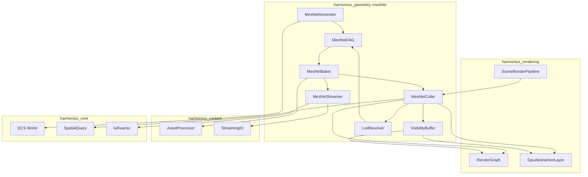
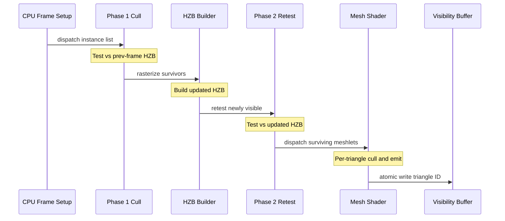
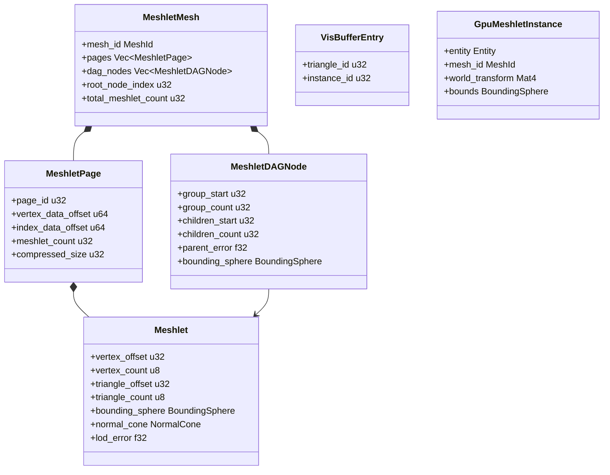
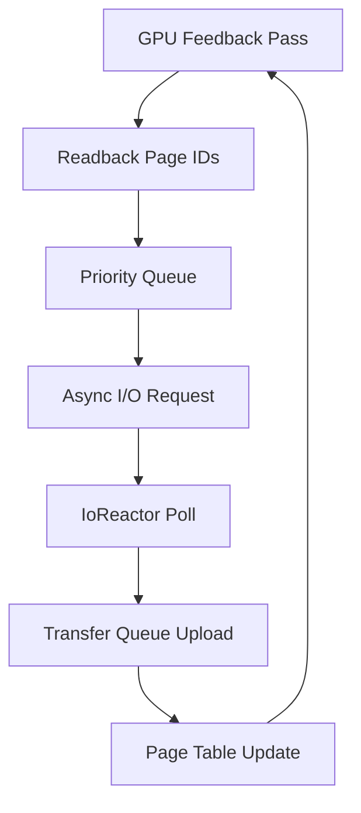
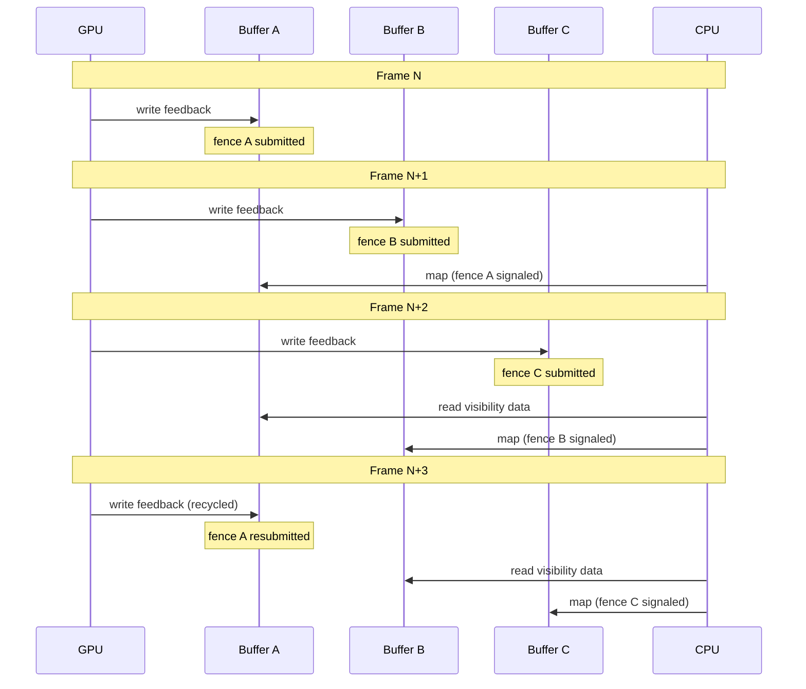

# Meshlet Pipeline Design

## Requirements Trace

> **Canonical sources:** Features, requirements, and user stories are defined in
> [features/geometry-world/](../../features/geometry-world/),
> [requirements/geometry-world/](../../requirements/geometry-world/), and
> [user-stories/geometry-world/](../../user-stories/geometry-world/). The table below traces design
> elements to those definitions.

| Feature | Requirement | User Stories |
|---------|-------------|--------------|
| F-3.1.1 | R-3.1.1     | US-3.1.1     |
| F-3.1.2 | R-3.1.2     | US-3.1.2     |
| F-3.1.3 | R-3.1.3     | US-3.1.3     |
| F-3.1.4 | R-3.1.4     | US-3.1.4     |
| F-3.1.5 | R-3.1.5     | US-3.1.5     |
| F-3.1.6 | R-3.1.6     | US-3.1.6     |
| F-3.1.7 | R-3.1.7     | US-3.1.7     |

1. **F-3.1.1** — Meshlet decomposition and DAG hierarchy
2. **F-3.1.2** — Two-phase GPU occlusion culling
3. **F-3.1.3** — Cluster and triangle culling
4. **F-3.1.4** — Mesh shader pipeline with indirect draw fallback
5. **F-3.1.5** — Screen-space error LOD selection
6. **F-3.1.6** — On-demand meshlet page streaming
7. **F-3.1.7** — Visibility buffer rendering

### Cross-Cutting Dependencies

| Dependency | Source | Consumed API |
|------------|--------|--------------|
| ECS world | F-1.1.1 | `Component`, `Entity`, `Query` |
| Spatial index | F-1.9.1 | Shared BVH frustum query |
| Render graph | F-2.2.1 | Pass registration, resource declaration |
| GPU abstraction | F-2.1.1 | Backend trait, command buffers, pipelines |
| Scene pipeline | F-2.10.1 | Render proxy extraction |
| Asset processing | F-12.2.3 | Meshlet baking offline |
| Streaming I/O | F-12.5.2 | Platform-native async I/O |
| Thread pool | F-14.3.1 | Scoped parallel task execution |

## Overview

The meshlet pipeline is the geometry backbone of the Harmonius renderer. It replaces traditional
draw-call submission with a GPU-driven architecture where every triangle on screen flows through
meshlet clusters.

Key principles:

1. **Offline baking** decomposes source meshes into ~64-vertex / ~124-triangle meshlets organized in
   a DAG hierarchy with precomputed bounding metadata.
2. **GPU-driven culling** performs two-phase occlusion, frustum, backface-cone, and small-triangle
   rejection entirely on the GPU.
3. **Hierarchical LOD** selects the coarsest DAG cut whose screen-space error is below a pixel
   threshold, with dithered crossfade transitions.
4. **Visibility buffer rendering** writes a 64-bit triangle+instance ID per pixel, deferring all
   material evaluation to a fullscreen compute pass.
5. **Virtual geometry streaming** organizes meshlet data into fixed-size pages streamed on demand
   via platform-native async I/O.

The pipeline supports mesh shaders on modern GPUs and falls back to compute + multi-draw-indirect on
hardware lacking mesh shader support.

## Architecture

### Module Boundaries



```text
harmonius_geometry/
├── meshlet/
│   ├── generator.rs    # MeshletGenerator: partition
│   │                   # source mesh into meshlets
│   ├── dag.rs          # MeshletDAG: hierarchy nodes,
│   │                   # coarsening, cut selection
│   ├── baker.rs        # MeshletBaker: offline bake
│   │                   # orchestrator (asset pipeline)
│   ├── streamer.rs     # MeshletStreamer: page-based
│   │                   # virtual geometry streaming
│   ├── culler.rs       # MeshletCuller: GPU-driven
│   │                   # frustum/occlusion/backface
│   ├── visibility.rs   # VisibilityBuffer: 64-bit
│   │                   # visbuf write + material eval
│   ├── lod.rs          # LodResolver: screen-space
│   │                   # error LOD selection
│   ├── page.rs         # MeshletPage: fixed-size page
│   │                   # packing and management
│   ├── bounds.rs       # BoundingSphere, NormalCone
│   │                   # computation
│   └── data.rs         # Core data structures:
│                       # Meshlet, MeshletMesh, etc.
```

### Offline Baking Pipeline

The asset processor invokes the baking pipeline at import time. Each source mesh flows through these
stages sequentially.


| Stage | Module | Description |
|-------|--------|-------------|
| Simplify | `meshoptimizer` FFI | Edge-collapse simplification per LOD level |
| LOD Chain | `generator.rs` | Generate LOD0..N at target triangle ratios |
| Partition | `generator.rs` | Cluster each LOD into meshlets of max 64v/124t |
| Bounds | `bounds.rs` | Compute bounding sphere, normal cone, error per meshlet |
| DAG Build | `dag.rs` | Link LOD levels into parent-child DAG nodes |
| Cache Opt | `meshoptimizer` FFI | Vertex cache + overdraw optimization per meshlet |
| Page Pack | `page.rs` | Pack meshlets into fixed-size 64 KiB pages |
| Archive | Content pipeline | Write pages to compressed archive (Zstd) |

### GPU-Driven Culling and Rendering Flow



### Core Data Structures



### Render Graph Integration

The meshlet pipeline registers the following passes with the render graph. The graph compiler
resolves dependencies, inserts barriers, and assigns queues automatically.


| Pass | Queue | Capability Gate |
|------|-------|-----------------|
| Extract Instances | CPU | None |
| Upload GPU Buffers | Copy | None |
| Phase 1 Cull | Compute | None |
| HZB Build | Compute | None |
| Phase 2 Retest | Compute | None |
| Cluster Cull | Compute | None |
| Mesh Shader Raster | Graphics | Mesh shaders (optional) |
| Visibility Buffer Write | Graphics | 64-bit atomics |
| Material Eval Compute | Compute | None |

When mesh shaders are unavailable, the Cluster Cull pass writes surviving meshlet indices to an
indirect draw buffer consumed by a traditional vertex pipeline rasterization pass.

### Streaming Feedback Loop



## API Design

### Core Data Types

```rust
/// Maximum vertices per meshlet. Fixed across all
/// platforms to ensure consistent GPU workgroup sizing.
pub const MAX_MESHLET_VERTICES: u8 = 64;

/// Maximum triangles per meshlet.
pub const MAX_MESHLET_TRIANGLES: u8 = 124;

/// Fixed page size for streaming granularity.
/// 64 KiB aligns with GPU transfer and SSD
/// sector boundaries.
pub const MESHLET_PAGE_SIZE: u32 = 65536;

/// A single meshlet cluster within a mesh.
/// Stored in GPU-accessible buffers.
#[derive(Clone, Copy, Debug)]
#[repr(C)]
pub struct Meshlet {
    /// Offset into the shared vertex buffer.
    pub vertex_offset: u32,
    /// Number of vertices (max 64).
    pub vertex_count: u8,
    /// Offset into the shared index buffer
    /// (micro-indices, 3 bytes per triangle).
    pub triangle_offset: u32,
    /// Number of triangles (max 124).
    pub triangle_count: u8,
    /// Bounding sphere for frustum/occlusion
    /// culling.
    pub bounding_sphere: BoundingSphere,
    /// Normal cone for backface culling.
    pub normal_cone: NormalCone,
    /// Screen-space error bound for LOD
    /// selection. Represents the maximum
    /// geometric deviation in object space.
    pub lod_error: f32,
}

/// Tight bounding sphere for a meshlet or
/// DAG node.
#[derive(Clone, Copy, Debug)]
#[repr(C)]
pub struct BoundingSphere {
    pub center: [f32; 3],
    pub radius: f32,
}

/// Normal cone for conservative backface
/// culling. If the view direction falls outside
/// this cone, the entire meshlet is backfacing.
#[derive(Clone, Copy, Debug)]
#[repr(C)]
pub struct NormalCone {
    /// Cone axis (unit vector).
    pub axis: [f32; 3],
    /// Cosine of the half-angle. Meshlet is
    /// backfacing when dot(view, axis) < cutoff.
    pub cutoff: f32,
}

/// A node in the meshlet LOD DAG. Each node
/// represents a group of meshlets at a
/// particular detail level.
#[derive(Clone, Copy, Debug)]
pub struct MeshletDAGNode {
    /// Start index into the meshlet array for
    /// this group.
    pub group_start: u32,
    /// Number of meshlets in this group.
    pub group_count: u32,
    /// Start index into the DAG node array for
    /// child nodes.
    pub children_start: u32,
    /// Number of child nodes.
    pub children_count: u32,
    /// Screen-space error of this node's
    /// simplification relative to the original.
    pub parent_error: f32,
    /// Bounding sphere enclosing all meshlets
    /// in this group and its descendants.
    pub bounding_sphere: BoundingSphere,
}

/// A fixed-size page of meshlet data for
/// streaming.
#[derive(Clone, Debug)]
pub struct MeshletPage {
    /// Unique page identifier within the mesh.
    pub page_id: u32,
    /// Byte offset into the vertex data blob.
    pub vertex_data_offset: u64,
    /// Byte offset into the index data blob.
    pub index_data_offset: u64,
    /// Number of meshlets packed in this page.
    pub meshlet_count: u32,
    /// Compressed size in bytes for I/O.
    pub compressed_size: u32,
    /// Uncompressed size for allocation.
    pub uncompressed_size: u32,
}

/// A complete meshlet mesh ready for GPU-driven
/// rendering. Produced by the offline baker and
/// stored as a processed asset.
#[derive(Clone, Debug)]
pub struct MeshletMesh {
    /// Asset identifier.
    pub mesh_id: MeshId,
    /// All meshlets across all LOD levels.
    pub meshlets: Vec<Meshlet>,
    /// DAG hierarchy nodes.
    pub dag_nodes: Vec<MeshletDAGNode>,
    /// Root node index (coarsest LOD).
    pub root_node_index: u32,
    /// Pages for streaming.
    pub pages: Vec<MeshletPage>,
    /// Shared vertex buffer (positions, normals,
    /// UVs, tangents).
    pub vertex_data: Vec<u8>,
    /// Shared micro-index buffer (3 bytes per
    /// triangle: local vertex indices 0..63).
    pub index_data: Vec<u8>,
    /// Total meshlet count across all LODs.
    pub total_meshlet_count: u32,
}
```

### ECS Components

```rust
/// Attached to entities with meshlet geometry.
/// Links an entity to its MeshletMesh asset.
#[derive(Clone, Debug)]
pub struct MeshletMeshComponent {
    /// Handle to the MeshletMesh asset.
    pub mesh: AssetHandle<MeshletMesh>,
    /// Per-instance pixel-error threshold
    /// override. None = use global default.
    pub error_threshold: Option<f32>,
    /// Whether this instance participates in
    /// the visibility buffer.
    pub visible: bool,
}

/// GPU-side instance data uploaded each frame
/// for surviving instances after CPU-side
/// broad-phase culling.
#[derive(Clone, Copy, Debug)]
#[repr(C)]
pub struct GpuMeshletInstance {
    /// World-space transform (4x3 affine,
    /// packed as 3 rows of float4).
    pub world_transform: [f32; 12],
    /// World-space bounding sphere for
    /// coarse GPU frustum test.
    pub world_bounds: BoundingSphere,
    /// Index into the MeshletMesh asset table.
    pub mesh_index: u32,
    /// DAG root node for LOD traversal.
    pub dag_root: u32,
    /// Per-instance pixel-error scale factor.
    pub error_scale: f32,
    /// Dither seed for LOD crossfade.
    pub dither_seed: u32,
}
```

### Meshlet Generator

```rust
/// Configuration for meshlet generation.
pub struct MeshletGeneratorConfig {
    /// Maximum vertices per meshlet.
    /// Default: 64.
    pub max_vertices: u8,
    /// Maximum triangles per meshlet.
    /// Default: 124.
    pub max_triangles: u8,
    /// LOD simplification ratios.
    /// Each entry is a fraction of the
    /// previous level's triangle count.
    /// Example: [0.5, 0.25, 0.125]
    pub lod_ratios: Vec<f32>,
    /// Maximum screen-space error tolerance
    /// for simplification in object-space
    /// units.
    pub max_simplification_error: f32,
    /// Target page size in bytes.
    pub page_size: u32,
}

/// Generates meshlet data from source geometry.
pub struct MeshletGenerator { /* ... */ }

impl MeshletGenerator {
    pub fn new(
        config: MeshletGeneratorConfig,
    ) -> Self;

    /// Decompose a source mesh into a complete
    /// MeshletMesh. Runs the full offline
    /// pipeline: simplification, partitioning,
    /// bounds computation, DAG construction,
    /// cache optimization, and page packing.
    ///
    /// This is a CPU-intensive operation run
    /// during asset processing.
    pub fn generate(
        &self,
        vertices: &[Vertex],
        indices: &[u32],
    ) -> Result<MeshletMesh, MeshletError>;

    /// Partition a single LOD level into
    /// meshlets without DAG construction.
    /// Used internally and for debugging.
    pub fn partition(
        &self,
        vertices: &[Vertex],
        indices: &[u32],
    ) -> Result<Vec<Meshlet>, MeshletError>;
}
```

### DAG Construction and LOD Resolution

```rust
/// Builds the meshlet DAG from a set of LOD
/// meshlet arrays.
pub struct MeshletDAGBuilder { /* ... */ }

impl MeshletDAGBuilder {
    pub fn new() -> Self;

    /// Add a LOD level's meshlets. LOD 0 is the
    /// finest (original), higher levels are
    /// coarser.
    pub fn add_lod_level(
        &mut self,
        lod: u32,
        meshlets: &[Meshlet],
    );

    /// Build the DAG by linking child meshlets
    /// to parent groups. Parent groups are
    /// formed by spatial clustering of child
    /// meshlets.
    pub fn build(
        self,
    ) -> Result<Vec<MeshletDAGNode>, MeshletError>;
}

/// Resolves which DAG cut to use at runtime
/// based on screen-space error.
pub struct LodResolver { /* ... */ }

impl LodResolver {
    pub fn new() -> Self;

    /// Select the coarsest DAG cut where every
    /// node's projected error is below
    /// `pixel_threshold`. Returns indices into
    /// the DAG node array representing the
    /// active cut.
    ///
    /// This runs on the GPU in the task shader.
    /// The CPU-side method is provided for
    /// validation and debugging.
    pub fn select_cut(
        &self,
        dag: &[MeshletDAGNode],
        view_proj: &Mat4,
        screen_height: f32,
        pixel_threshold: f32,
    ) -> Vec<u32>;
}
```

### GPU Culling Pipeline

```rust
/// Orchestrates the GPU-driven culling pipeline.
/// Registers render graph passes and manages
/// GPU buffers.
pub struct MeshletCuller { /* ... */ }

/// Configuration for the culling pipeline.
pub struct CullerConfig {
    /// Maximum instances per frame.
    pub max_instances: u32,
    /// Maximum meshlets per frame.
    pub max_meshlets: u32,
    /// HZB resolution divisor (1 = full res,
    /// 2 = half res). Mobile uses 2.
    pub hzb_divisor: u32,
    /// Enable phase-two retest. May be
    /// disabled on mobile under budget
    /// pressure.
    pub enable_phase_two: bool,
    /// Pixel-error threshold for LOD
    /// selection.
    pub lod_pixel_threshold: f32,
    /// Enable mesh shader path. Falls back to
    /// compute + indirect draw when false.
    pub use_mesh_shaders: bool,
}

impl MeshletCuller {
    pub fn new<B: GpuBackend>(
        device: &B::Device,
        config: CullerConfig,
    ) -> Self;

    /// Register all culling passes with the
    /// render graph. Called once at startup and
    /// when device capabilities change.
    pub fn register_passes<B: GpuBackend>(
        &self,
        graph: &mut RenderGraphBuilder,
    );

    /// Upload instance data for the current
    /// frame. Called during the Extract phase.
    pub fn upload_instances<B: GpuBackend>(
        &self,
        cmd: &mut B::CommandBuffer,
        instances: &[GpuMeshletInstance],
    );

    /// Read back culling statistics for
    /// profiling. Returns counts from the
    /// previous frame to avoid stalls.
    pub fn read_stats(
        &self,
    ) -> CullStats;
}

/// Culling statistics for profiling and
/// diagnostics.
#[derive(Clone, Copy, Debug, Default)]
pub struct CullStats {
    /// Instances submitted.
    pub instances_submitted: u32,
    /// Instances surviving phase 1.
    pub instances_phase1_visible: u32,
    /// Meshlets surviving cluster cull.
    pub meshlets_visible: u32,
    /// Triangles surviving triangle cull.
    pub triangles_visible: u32,
    /// Triangles rasterized (after
    /// small-triangle rejection).
    pub triangles_rasterized: u32,
}
```

### Visibility Buffer

```rust
/// Manages the 64-bit visibility buffer and
/// material evaluation compute pass.
pub struct VisibilityBuffer { /* ... */ }

/// Pixel entry in the visibility buffer.
/// Packed as a single u64 for atomic writes.
#[derive(Clone, Copy, Debug)]
#[repr(C)]
pub struct VisBufferEntry {
    /// Meshlet instance index (upper 32 bits).
    pub instance_id: u32,
    /// Triangle index within the meshlet
    /// (lower 32 bits).
    pub triangle_id: u32,
}

impl VisibilityBuffer {
    pub fn new<B: GpuBackend>(
        device: &B::Device,
        width: u32,
        height: u32,
    ) -> Self;

    /// Register the visibility buffer write
    /// pass and material evaluation pass with
    /// the render graph.
    pub fn register_passes<B: GpuBackend>(
        &self,
        graph: &mut RenderGraphBuilder,
    );

    /// Resize the visibility buffer when the
    /// render target changes.
    pub fn resize<B: GpuBackend>(
        &mut self,
        device: &B::Device,
        width: u32,
        height: u32,
    );

    /// Decode a visibility buffer entry from
    /// a packed u64. Used by the material
    /// evaluation shader.
    pub fn decode(packed: u64) -> VisBufferEntry {
        VisBufferEntry {
            instance_id: (packed >> 32) as u32,
            triangle_id: packed as u32,
        }
    }

    /// Encode a visibility buffer entry into
    /// a packed u64 for atomic writes.
    pub fn encode(
        entry: VisBufferEntry,
    ) -> u64 {
        ((entry.instance_id as u64) << 32)
            | (entry.triangle_id as u64)
    }
}
```

### Meshlet Streamer

```rust
/// Page residency state.
#[derive(
    Clone, Copy, Debug, PartialEq, Eq,
)]
pub enum PageState {
    /// Not loaded; placeholder geometry used.
    NotResident,
    /// I/O in flight.
    Loading,
    /// Resident in GPU memory.
    Resident,
    /// Scheduled for eviction.
    PendingEviction,
}

/// Manages virtual geometry streaming via
/// fixed-size pages.
pub struct MeshletStreamer { /* ... */ }

/// Configuration for the streaming system.
pub struct StreamerConfig {
    /// Maximum resident pages in GPU memory.
    pub max_resident_pages: u32,
    /// Maximum concurrent I/O requests.
    pub max_in_flight_io: u32,
    /// Priority weight for screen-space size.
    pub screen_size_weight: f32,
    /// Priority weight for camera distance.
    pub distance_weight: f32,
}

impl MeshletStreamer {
    pub fn new(config: StreamerConfig) -> Self;

    /// Process GPU feedback buffer to determine
    /// which pages are needed. Returns page
    /// request list sorted by priority.
    pub fn process_feedback(
        &mut self,
        feedback: &[u32],
    ) -> Vec<PageRequest>;

    /// Submit async I/O requests for the
    /// highest-priority pages. Uses
    /// platform-native async I/O via the
    /// IoReactor.
    pub async fn request_pages(
        &mut self,
        reactor: &IoReactor,
        requests: &[PageRequest],
    ) -> Vec<Result<PageLoadResult, IoError>>;

    /// Upload loaded page data to the GPU
    /// via the transfer queue.
    pub fn upload_pages<B: GpuBackend>(
        &mut self,
        cmd: &mut B::CommandBuffer,
        loaded: &[PageLoadResult],
    );

    /// Evict lowest-priority resident pages
    /// to make room for new requests.
    pub fn evict_pages(
        &mut self,
        count: u32,
    ) -> Vec<u32>;

    /// Query the residency state of a page.
    pub fn page_state(
        &self,
        page_id: u32,
    ) -> PageState;

    /// Register the GPU feedback pass with
    /// the render graph.
    pub fn register_feedback_pass<B: GpuBackend>(
        &self,
        graph: &mut RenderGraphBuilder,
    );
}

/// A page load request with priority.
#[derive(Clone, Debug)]
pub struct PageRequest {
    pub page_id: u32,
    pub mesh_id: MeshId,
    pub priority: f32,
    pub file_offset: u64,
    pub compressed_size: u32,
}

/// Result of a successful page load from disk.
#[derive(Debug)]
pub struct PageLoadResult {
    pub page_id: u32,
    pub data: BufferSlot,
}
```

### Offline Baker (Asset Pipeline Integration)

```rust
/// Orchestrates the complete offline meshlet
/// baking pipeline. Invoked by the asset
/// processor during mesh import.
pub struct MeshletBaker { /* ... */ }

/// Result of baking a single source mesh.
#[derive(Debug)]
pub struct BakeResult {
    /// The processed meshlet mesh asset.
    pub mesh: MeshletMesh,
    /// Baking statistics for the build log.
    pub stats: BakeStats,
}

/// Statistics from the baking process.
#[derive(Clone, Debug)]
pub struct BakeStats {
    /// Source triangle count.
    pub source_triangles: u32,
    /// Total meshlet count across all LODs.
    pub total_meshlets: u32,
    /// Number of LOD levels generated.
    pub lod_levels: u32,
    /// Number of DAG nodes.
    pub dag_nodes: u32,
    /// Number of pages produced.
    pub page_count: u32,
    /// Total compressed size in bytes.
    pub compressed_bytes: u64,
    /// Bake duration.
    pub duration_ms: f64,
}

impl MeshletBaker {
    pub fn new(
        config: MeshletGeneratorConfig,
    ) -> Self;

    /// Bake a source mesh into a MeshletMesh.
    /// Runs the full pipeline: simplify,
    /// partition, bounds, DAG, optimize, pack.
    ///
    /// Uses scoped parallelism for LOD
    /// generation across multiple levels.
    pub fn bake(
        &self,
        pool: &ThreadPool,
        vertices: &[Vertex],
        indices: &[u32],
    ) -> Result<BakeResult, MeshletError>;
}
```

### HLSL Shader Signatures

The following HLSL entry points are compiled via DXC and consumed by the GPU abstraction layer.

```rust
// These are the HLSL shader entry points.
// Shown as Rust doc comments for the shader
// compilation manifest.

/// Task (amplification) shader: per-meshlet
/// culling and LOD selection.
///
/// HLSL: `meshlet_task.hlsl`
/// - Reads: instance buffer, DAG buffer,
///   prev-frame HZB, meshlet bounds
/// - Writes: mesh shader payload (surviving
///   meshlet indices)
/// - Workgroup: [32, 1, 1]
pub const SHADER_MESHLET_TASK: &str =
    "meshlet_task.hlsl";

/// Mesh shader: per-triangle culling and
/// vertex emission.
///
/// HLSL: `meshlet_mesh.hlsl`
/// - Reads: vertex buffer, index buffer,
///   meshlet descriptors, task payload
/// - Writes: triangles to rasterizer
/// - Max vertices: 64, max primitives: 124
pub const SHADER_MESHLET_MESH: &str =
    "meshlet_mesh.hlsl";

/// Compute fallback: meshlet culling +
/// indirect draw buffer compaction.
///
/// HLSL: `meshlet_cull_compact.hlsl`
/// - Reads: instance buffer, meshlet bounds
/// - Writes: indirect draw argument buffer
/// - Workgroup: [64, 1, 1]
pub const SHADER_MESHLET_CULL_COMPACT: &str =
    "meshlet_cull_compact.hlsl";

/// Visibility buffer write (fragment).
///
/// HLSL: `visibility_write.hlsl`
/// - Reads: SV_PrimitiveID, instance index
/// - Writes: 64-bit atomic to UAV
pub const SHADER_VISIBILITY_WRITE: &str =
    "visibility_write.hlsl";

/// Material evaluation fullscreen compute.
///
/// HLSL: `material_eval.hlsl`
/// - Reads: visibility buffer, vertex buffer,
///   index buffer, material descriptors,
///   bindless textures
/// - Writes: G-buffer targets (albedo,
///   normal, roughness, metallic, emissive)
/// - Workgroup: [8, 8, 1]
pub const SHADER_MATERIAL_EVAL: &str =
    "material_eval.hlsl";

/// HZB construction from depth buffer.
///
/// HLSL: `hzb_build.hlsl`
/// - Reads: depth buffer mip N
/// - Writes: depth buffer mip N+1 (min
///   reduction)
/// - Workgroup: [8, 8, 1]
pub const SHADER_HZB_BUILD: &str =
    "hzb_build.hlsl";

/// Phase 1 occlusion cull (prev-frame HZB).
///
/// HLSL: `occlusion_cull_phase1.hlsl`
/// - Reads: instance bounds, prev-frame HZB
/// - Writes: visible instance bitmask
/// - Workgroup: [64, 1, 1]
pub const SHADER_OCCLUSION_PHASE1: &str =
    "occlusion_cull_phase1.hlsl";

/// Phase 2 occlusion retest (updated HZB).
///
/// HLSL: `occlusion_cull_phase2.hlsl`
/// - Reads: newly visible instances, updated
///   HZB
/// - Writes: final visible instance list
/// - Workgroup: [64, 1, 1]
pub const SHADER_OCCLUSION_PHASE2: &str =
    "occlusion_cull_phase2.hlsl";

/// Streaming feedback: record page IDs of
/// visible meshlets.
///
/// HLSL: `streaming_feedback.hlsl`
/// - Reads: visible meshlet list, page table
/// - Writes: feedback buffer (page IDs)
/// - Workgroup: [64, 1, 1]
pub const SHADER_STREAMING_FEEDBACK: &str =
    "streaming_feedback.hlsl";
```

### Error Types

```rust
/// Errors produced by the meshlet pipeline.
#[derive(Clone, Debug)]
pub enum MeshletError {
    /// Source mesh has no triangles.
    EmptyMesh,
    /// Source mesh has degenerate triangles
    /// that prevent partitioning.
    DegenerateGeometry {
        triangle_index: u32,
    },
    /// Simplification failed to meet the
    /// target ratio for a LOD level.
    SimplificationFailed {
        lod_level: u32,
        target_ratio: f32,
        achieved_ratio: f32,
    },
    /// DAG construction found disconnected
    /// meshlet groups that cannot be linked.
    DisconnectedHierarchy {
        orphan_count: u32,
    },
    /// Page packing exceeded the maximum page
    /// count limit.
    TooManyPages {
        page_count: u32,
        limit: u32,
    },
    /// GPU buffer allocation failed.
    GpuAllocationFailed {
        buffer_name: &'static str,
        requested_bytes: u64,
    },
}
```

## Data Flow

### Per-Frame Rendering Flow

The meshlet pipeline executes these steps each frame. Steps 1-2 run on the CPU. Steps 3-10 run
entirely on the GPU via render graph passes.

1. **Extract** -- The scene pipeline extracts visible entities with `MeshletMeshComponent` into
   `GpuMeshletInstance` arrays via ECS queries.

2. **Upload** -- Instance data is written to a GPU buffer via the copy queue.

3. **Phase 1 Occlusion Cull** -- A compute shader tests each instance's bounding sphere against the
   previous frame's HZB. Instances that pass are marked visible.

4. **HZB Build** -- Visible instances from phase 1 are rasterized (depth only). A mip chain is built
   from the resulting depth buffer via iterative min-reduction.

5. **Phase 2 Retest** -- Instances that were occluded in phase 1 but might be visible (newly
   unoccluded by phase-1 geometry) are retested against the updated HZB.

6. **LOD Selection** -- The task shader traverses each surviving instance's DAG, selecting the
   coarsest cut whose projected error is below the pixel threshold.

7. **Cluster Cull** -- The task shader performs per-meshlet frustum, backface-cone, and occlusion
   culling on the selected cut.

8. **Triangle Cull + Rasterize** -- The mesh shader (or indirect draw fallback) emits surviving
   triangles. Per-triangle backface and small-triangle culling discard sub-pixel geometry.

9. **Visibility Buffer Write** -- Fragment shaders atomically write a 64-bit entry (instance_id |
   triangle_id) per pixel.

10. **Material Evaluation** -- A fullscreen compute pass reads the visibility buffer, fetches vertex
    attributes for each visible pixel, and evaluates materials via bindless descriptor indices into
    the G-buffer.

### Streaming Data Flow

The streaming subsystem operates as a feedback loop across frames.

1. **Feedback** -- A compute pass records page IDs of all meshlets referenced by visible instances
   into a feedback buffer.

2. **Readback** -- The feedback buffer is read back to the CPU one frame later (no stall).

3. **Prioritize** -- The `MeshletStreamer` scores each requested page by screen-space contribution
   and camera distance.

4. **I/O Request** -- Highest-priority pages are submitted as async reads via the IoReactor.

5. **Poll** -- At the frame poll point, `reactor.poll()` drains completed I/O.

6. **Decompress** -- Loaded page data is decompressed (Zstd) on a worker thread.

7. **Upload** -- Decompressed page data is uploaded to the GPU via the transfer queue.

8. **Update** -- The page table is updated to mark new pages as resident. The next frame's culling
   shaders see the updated residency.

### Scoped Parallel Baking

The offline baker uses the thread pool's scoped execution to parallelize LOD generation.

```rust
// Pseudocode: parallel LOD bake
let lods = pool.scope(|scope| {
    let mut handles = Vec::new();
    for ratio in &config.lod_ratios {
        let h = scope.spawn(|| {
            let simplified =
                simplify(vertices, indices, *ratio);
            partition_into_meshlets(&simplified)
        });
        handles.push(h);
    }
    handles
        .into_iter()
        .map(|h| h.join())
        .collect::<Vec<_>>()
});

let dag = MeshletDAGBuilder::new();
for (level, meshlets) in lods.iter().enumerate() {
    dag.add_lod_level(level as u32, meshlets);
}
let dag_nodes = dag.build()?;
```

## GPU-CPU Readback Synchronization

The visibility buffer feedback loop reads GPU results back to the CPU "one frame later" to avoid
pipeline stalls. However, no synchronization mechanism is specified for when the GPU has not yet
finished writing feedback data. Without explicit fence handling, the CPU may read incomplete or
stale visibility data.

**Ring-buffer strategy.** Readback uses a triple-buffered ring of GPU buffers with associated
fences. This ensures the CPU never reads a buffer the GPU is actively writing.

| Slot | Frame N Role | Frame N+1 Role | Frame N+2 Role |
|------|-------------|----------------|----------------|
| A | GPU writes | CPU maps | CPU reads |
| B | CPU reads | GPU writes | CPU maps |
| C | CPU maps | CPU reads | GPU writes |

Each ring-buffer slot has:

- A GPU feedback buffer for visibility page IDs
- A fence signaled when the GPU finishes writing
- A generation counter tracking the source frame

```rust
/// A single slot in the readback ring buffer.
#[derive(Debug)]
pub struct ReadbackSlot {
    /// GPU buffer for feedback data.
    pub buffer: GpuBuffer,
    /// Fence signaled when GPU write completes.
    pub fence: GpuFence,
    /// Frame number that produced this data.
    pub source_frame: u64,
    /// Whether the CPU has mapped this buffer.
    pub mapped: bool,
}

/// Triple-buffered readback ring.
pub struct ReadbackRing {
    pub slots: [ReadbackSlot; 3],
    /// Index of the slot currently being
    /// written by the GPU.
    pub write_index: usize,
}
```

**Fallback and fence handling.** When readback data is not ready, the system uses conservative
fallback to avoid visual artifacts. Each ring-buffer slot has a dedicated GPU fence polled at the
start of each culling pass using a non-blocking query.

| Condition | Action | Consequence |
|-----------|--------|-------------|
| Fence not signaled | Use previous frame's visibility set | Higher draw count |
| 3 consecutive stale frames | Log perf warning, force GPU-CPU sync | One-frame stall |
| GPU device loss | Reset all ring buffers, rebuild visibility | Full re-cull |
| Frame start | Identify read slot (`write_index - 2` mod 3) | Select buffer |
| Fence signaled | Read buffer, use fresh visibility data | Optimal culling |
| Stale counter reaches 3 | Issue blocking fence wait | Guarantees data |

The fallback is conservative: rendering more meshlets than necessary (not fewer). This prevents
popping artifacts at the cost of slightly higher draw counts.

```rust
/// Status of a readback attempt.
#[derive(Clone, Copy, Debug, PartialEq, Eq)]
pub enum ReadbackStatus {
    /// Fresh data from the expected frame.
    Current,
    /// Using stale data from a prior frame.
    Stale { frames_behind: u32 },
    /// Forced GPU-CPU sync due to excessive
    /// staleness.
    ForcedSync,
    /// Ring buffers reset after device loss.
    Reset,
}
```

```rust
impl ReadbackRing {
    /// Poll the oldest slot for readability.
    /// Returns the slot index and status.
    pub fn poll_read_slot(
        &self,
    ) -> (usize, ReadbackStatus);

    /// Force a blocking wait on the read slot.
    /// Used when staleness exceeds 3 frames.
    pub fn force_sync(&mut self);

    /// Reset all slots after GPU device loss.
    pub fn reset(&mut self);

    /// Advance the ring after GPU submission.
    /// Rotates write_index forward.
    pub fn advance(&mut self);
}
```

**Pipeline sequence.**



## Platform Considerations

### GPU Backend Feature Matrix

| Feature           |
|-------------------|
| Mesh shaders      |
| 64-bit atomics    |
| Indirect draw     |
| HZB mip gen       |
| Feedback readback |

1. **Mesh shaders** — Object + Mesh shaders (Metal 3)
   - **D3D12:** Amplification + Mesh shaders (SM 6.5)
   - **Vulkan:** `VK_EXT_mesh_shader` task + mesh
2. **64-bit atomics** — `MTLGPUFamilyApple7`+
   - **D3D12:** SM 6.6 `InterlockedCompareExchange64`
   - **Vulkan:** `shaderBufferInt64Atomics`
3. **Indirect draw** — `drawIndexedPrimitives:indirectBuffer:`
   - **D3D12:** `ExecuteIndirect`
   - **Vulkan:** `vkCmdDrawIndexedIndirect`
4. **HZB mip gen** — Compute shader
   - **D3D12:** Compute shader
   - **Vulkan:** Compute shader
5. **Feedback readback** — Shared memory buffer
   - **D3D12:** Readback heap
   - **Vulkan:** Host-visible buffer

### Mesh Shader Fallback Path

When mesh shaders are unavailable (older Vulkan drivers, pre-Metal 3 GPUs), the pipeline falls back:

| Stage | Mesh Shader Path | Fallback Path |
|-------|-----------------|---------------|
| Culling | Task shader | Compute shader |
| LOD select | Task shader | Compute shader |
| Compaction | Task shader payload | Compute prefix-sum + scatter to indirect draw buffer |
| Rasterize | Mesh shader | `DrawIndexedIndirect` with vertex shader |

The fallback path preserves all GPU-driven culling benefits. The render graph's capability gating
(F-2.2.2) selects the correct pass set at startup.

### Streaming I/O Backends

| Platform | I/O API | GPU Upload |
|----------|---------|------------|
| Windows | IOCP via IoReactor | Copy queue `CopyBufferRegion` |
| macOS | GCD Dispatch IO via IoReactor | `blitCommandEncoder` copy |
| Linux | io_uring via IoReactor | `vkCmdCopyBuffer` via transfer queue |

All I/O uses the engine's controlled reactor poll point. No callbacks fire asynchronously.

### Scaling Tiers

| Tier | Max Instances | Max Meshlets | HZB Res | Phase 2 | Pages |
|------|--------------|--------------|---------|---------|-------|
| Mobile | 4,096 | 65,536 | Half | Skippable | 512 |
| Desktop | 32,768 | 524,288 | Full | Enabled | 4,096 |
| High-end | 131,072 | 2,097,152 | Full | Enabled | 16,384 |

### Proposed Dependencies

| Crate      | Purpose                        |
|------------|--------------------------------|
| `meshopt`  | meshoptimizer FFI bindings     |
| `lz4_flex` | LZ4 decompression              |
| `zstd`     | Zstd compression/decompression |

1. **`meshopt`** — Industry-standard meshlet partitioning, vertex cache optimization, and mesh
   simplification. C library via bindgen.
2. **`lz4_flex`** — Fast decompression for latency-sensitive page loads. Pure Rust.
3. **`zstd`** — High-ratio compression for archived meshlet pages. C library via bindgen.

## Test Plan

### Unit Tests

| Test                            | Req     |
|---------------------------------|---------|
| `test_partition_64v_124t`       | R-3.1.1 |
| `test_bounding_sphere_encloses` | R-3.1.1 |
| `test_normal_cone_valid`        | R-3.1.1 |
| `test_dag_cut_watertight`       | R-3.1.1 |
| `test_dag_coarsening`           | R-3.1.1 |
| `test_lod_error_monotonic`      | R-3.1.5 |
| `test_lod_select_coarsest`      | R-3.1.5 |
| `test_lod_select_finest`        | R-3.1.5 |
| `test_visbuf_encode_decode`     | R-3.1.7 |
| `test_visbuf_uniqueness`        | R-3.1.7 |
| `test_page_packing_fits`        | R-3.1.6 |
| `test_page_alignment`           | R-3.1.6 |
| `test_empty_mesh_error`         | R-3.1.1 |
| `test_degenerate_triangle`      | R-3.1.1 |

1. **`test_partition_64v_124t`** — Partition a cube mesh; verify every meshlet has at most 64
   vertices and 124 triangles.
2. **`test_bounding_sphere_encloses`** — For each meshlet, verify all vertices lie within the
   bounding sphere.
3. **`test_normal_cone_valid`** — For each meshlet, verify cone axis is unit length and cutoff is in
   [-1, 1].
4. **`test_dag_cut_watertight`** — Take every possible cut through a DAG and verify the resulting
   mesh is watertight (no T-junctions).
5. **`test_dag_coarsening`** — Verify parent nodes have fewer meshlets than the sum of their
   children.
6. **`test_lod_error_monotonic`** — Verify `parent_error` increases monotonically from leaves to
   root.
7. **`test_lod_select_coarsest`** — Given a far camera, verify LOD resolver selects the root
   (coarsest) node.
8. **`test_lod_select_finest`** — Given a very close camera, verify LOD resolver selects leaf
   (finest) nodes.
9. **`test_visbuf_encode_decode`** — Round-trip encode/decode of `VisBufferEntry` through u64
   packing.
10. **`test_visbuf_uniqueness`** — Verify no two entries in a packed u64 map to the same
    instance+triangle pair.
11. **`test_page_packing_fits`** — Verify all meshlet data fits within the declared page size.
12. **`test_page_alignment`** — Verify page offsets are aligned to 64 KiB boundaries.
13. **`test_empty_mesh_error`** — Pass empty vertex/index arrays and verify `EmptyMesh` error.
14. **`test_degenerate_triangle`** — Pass a mesh with zero-area triangles and verify
    `DegenerateGeometry` error.

### Integration Tests

| Test                               | Req     |
|------------------------------------|---------|
| `test_bake_stanford_bunny`         | R-3.1.1 |
| `test_bake_parallel_lod`           | R-3.1.1 |
| `test_culling_frustum_gpu`         | R-3.1.3 |
| `test_culling_occlusion_two_phase` | R-3.1.2 |
| `test_culling_backface_cone`       | R-3.1.3 |
| `test_fallback_indirect_draw`      | R-3.1.4 |
| `test_visbuf_material_correctness` | R-3.1.7 |
| `test_streaming_page_load`         | R-3.1.6 |
| `test_streaming_eviction`          | R-3.1.6 |
| `test_streaming_priority`          | R-3.1.6 |

1. **`test_bake_stanford_bunny`** — Bake the Stanford Bunny (69k triangles) and verify meshlet
   counts, DAG depth, and page count are within expected ranges.
2. **`test_bake_parallel_lod`** — Bake on thread pool with 4+ workers; verify identical output to
   single-threaded bake (determinism).
3. **`test_culling_frustum_gpu`** — Render a scene with meshlets outside the frustum; verify zero
   mesh shader invocations via GPU counters.
4. **`test_culling_occlusion_two_phase`** — Move an occluder to reveal geometry; verify no one-frame
   pop-in (disocclusion artifact).
5. **`test_culling_backface_cone`** — Render a sphere from outside; verify backfacing meshlets are
   culled (roughly half).
6. **`test_fallback_indirect_draw`** — Disable mesh shaders; verify identical visual output via
   indirect draw path.
7. **`test_visbuf_material_correctness`** — Render a multi-material mesh and verify each pixel
   resolves to the correct material via readback.
8. **`test_streaming_page_load`** — Request pages via async I/O; verify data integrity after
   decompression and upload.
9. **`test_streaming_eviction`** — Fill the page cache, then request new pages; verify LRU eviction
   and no corruption.
10. **`test_streaming_priority`** — Request pages at varying distances; verify closer pages load
    before distant ones.

### GPU Benchmarks

| Benchmark | Target | Source |
|-----------|--------|--------|
| Phase 1 + Phase 2 cull (100k instances) | < 1 ms | US-3.1.8 |
| Mesh shader rasterize (1M meshlets) | < 4 ms | US-3.1.8 |
| Material eval fullscreen (1080p) | < 2 ms | US-3.1.8 |
| HZB build (1080p, full mip chain) | < 0.5 ms | US-3.1.8 |
| Offline bake (100k triangles) | < 2 s | US-3.1.1 |
| Page load + decompress (64 KiB) | < 1 ms | US-3.1.6 |
| Streaming feedback + readback | < 0.2 ms | US-3.1.6 |

### Virtual Geometry Streaming Framework

Meshlet page streaming uses the shared `VirtualResourceStreamer` framework (see
[shared-primitives.md](../core-runtime/shared-primitives.md)) for GPU-feedback-driven page
residency, priority queue, async I/O, and LRU eviction.

### Terrain Integration

Terrain geometry (see [terrain.md](terrain.md)) generates meshlets at the clipmap tile level.
Terrain meshlet LOD integrates with the hierarchical LOD selection system.

## Design Q & A

**Q1. What is the biggest constraint limiting this design?**

The mesh shader hardware requirement is the biggest constraint. The design depends on
VK_EXT_mesh_shader, D3D12 mesh shaders, or Metal mesh shaders for the primary path (F-3.1.4).
Hardware without mesh shaders falls back to compute + indirect draw, which loses the tight
task-to-mesh shader data flow and adds a GPU buffer compaction step. Lifting this constraint would
let us eliminate the indirect draw fallback entirely, simplify the pipeline to a single path, and
remove ~30% of the culling shader code. However, mobile GPUs and older desktop GPUs lack mesh
shaders, so the fallback is essential for the engine's multiplatform requirement (R-3.1.4).

**Q2. How can this design be improved?**

The DAG hierarchy build is offline-only (F-3.1.1), meaning runtime-generated geometry (voxel
meshing, procedural meshes) must either skip the DAG or run a simplified online builder. Adding a
lightweight runtime DAG builder would unify LOD selection for all geometry. The streaming system
(F-3.1.6) uses fixed 64 KiB pages, but meshlet data varies in density; variable-size pages or page
packing could reduce I/O waste. The visibility buffer (F-3.1.7) requires 64-bit atomics, which
excludes some mobile GPUs. A 32-bit fallback with reduced ID range would broaden compatibility. The
two-phase occlusion culling (F-3.1.2) adds a frame of HZB latency; temporal reprojection could
reduce false occlusion in fast camera movement scenarios.

**Q3. Is there a better approach?**

Nanite-style virtualized geometry uses a persistent streaming mesh that renders directly from a page
cache without traditional draw calls. This eliminates the indirect draw fallback and simplifies the
pipeline. We do not take this approach because Nanite is tightly coupled to Unreal's renderer and
difficult to replicate without their proprietary rasterizer. Our meshlet DAG approach is more
modular, works with standard rasterization, and integrates cleanly with the visibility buffer. The
trade-off is more explicit pipeline stages versus Nanite's monolithic simplicity.

**Q4. Does this design solve all customer problems?**

The design handles static meshes thoroughly (F-3.1.1--7) but does not address skinned mesh meshlets
for animated characters. Characters currently bypass the meshlet pipeline entirely, using
traditional vertex pipelines. Adding meshlet support for skinned meshes would unify all geometry
into a single rendering path, reducing shader permutations and enabling visibility buffer deferred
shading for characters. Particle and VFX geometry also bypasses meshlets. Games with massive crowds
(MMO, RTS) would benefit most from skinned meshlet rendering. US-3.1.1 mentions artists importing
high-poly models, but the user story for runtime-generated meshlets from procedural content is
missing.

**Q5. Is this design cohesive with the overall engine?**

The meshlet pipeline integrates tightly with the render graph (F-2.2.1), shared BVH (F-1.9.1), and
ECS scene pipeline (F-2.10.1). Meshlet baking in the asset pipeline (F-12.2.3) ensures all geometry
arrives pre-processed. The design aligns with the engine's GPU-driven philosophy. However, the
terrain system generates meshlets at the clipmap tile level, which uses a different LOD strategy
(CDLOD rings vs DAG screen-space error) creating two parallel LOD systems. Unifying terrain and mesh
LOD under a single screen-space error metric would improve cohesion. The streaming system should
share the page cache infrastructure with the virtual texture system (F-3.2.2) rather than
maintaining a separate cache.

## Open Questions

1. **Meshlet size tuning** -- 64 vertices / 124 triangles matches meshoptimizer defaults and aligns
   with GPU workgroup sizes. Should this be configurable per-platform, or is a single fixed size
   sufficient for all backends?

2. **DAG coarsening strategy** -- Spatial clustering (group nearby meshlets) vs connectivity-based
   (group meshlets sharing edges). Spatial produces better bounding spheres; connectivity produces
   better watertightness. Need profiling data.

3. **Crossfade dither pattern** -- Blue noise vs Bayer matrix for LOD crossfade. Blue noise produces
   less visible patterns but is more expensive to evaluate. Mobile may need Bayer.

4. **Page size** -- 64 KiB is chosen for alignment with SSD sectors and GPU transfer granularity.
   Larger pages (256 KiB) reduce I/O overhead but increase granularity waste. Needs measurement
   across NVMe and SATA drives.

5. **Visibility buffer depth** -- 64-bit atomics provide 32 bits each for instance and triangle ID.
   This limits the scene to 4 billion instances and 4 billion triangles per frame. If a more compact
   encoding is needed (e.g., 32-bit with split fields), the tradeoff is reduced ID range.

6. **GPU decompression** -- Pages are currently decompressed on the CPU. GPU decompression
   (F-12.5.3, DirectStorage / Metal I/O) could bypass CPU staging entirely. Integration depends on
   GPU Direct Storage design completion.

7. **Multi-view efficiency** -- Shadow cascade views and VR stereo views share the same meshlet
   data. Should culling run per-view independently, or should a single cull pass produce a superset
   visible set that is then per-view filtered?

8. **Meshlet merging for small objects** -- Objects with fewer than 64 vertices produce a single
   meshlet with poor GPU occupancy. Should the baker merge multiple small objects into shared
   meshlet pages for better workgroup utilization?
