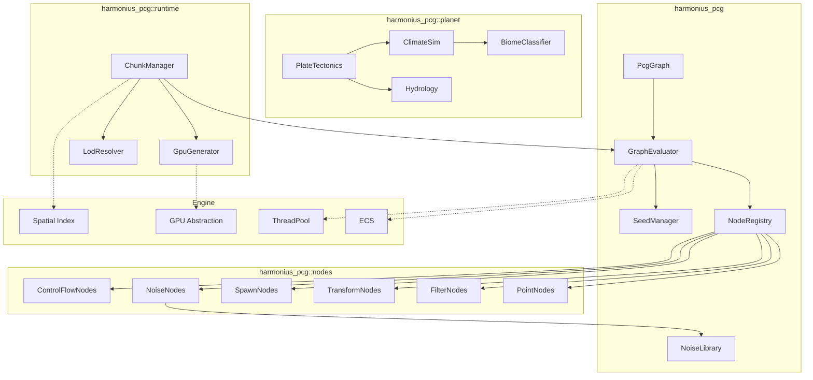
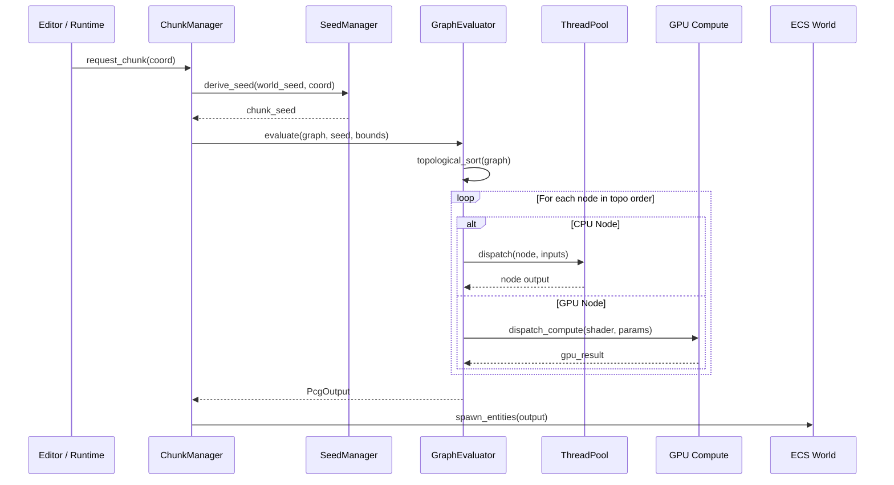
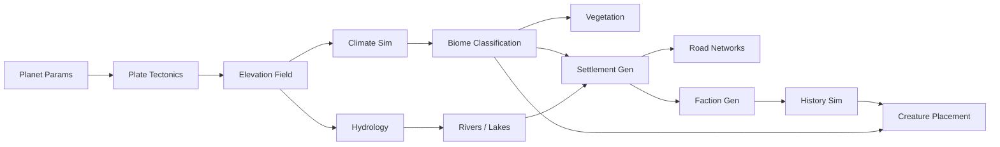
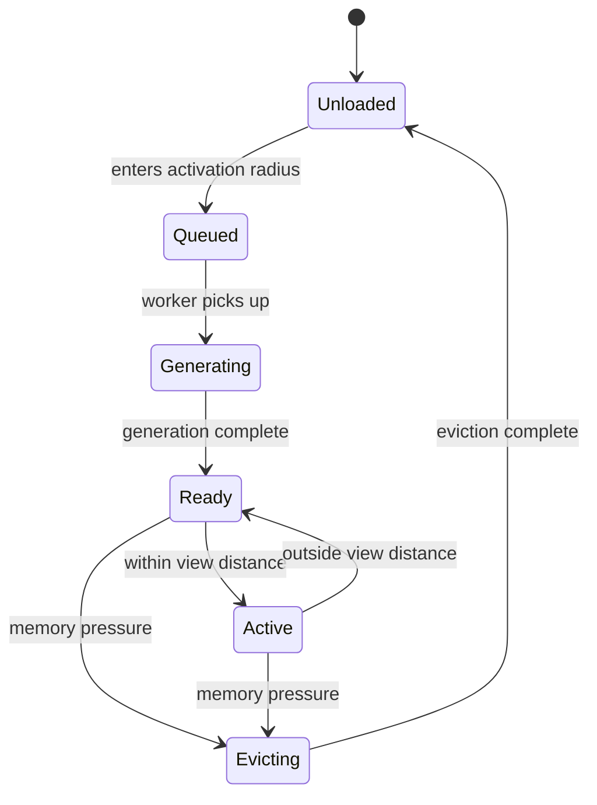
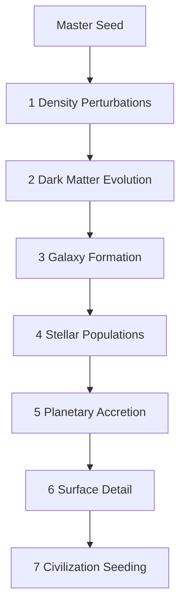
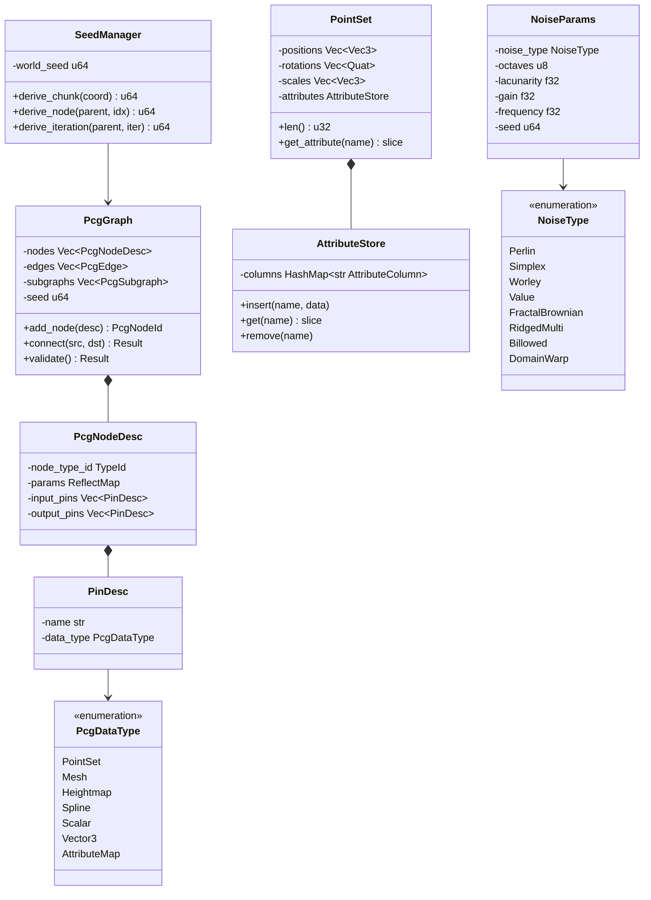

# Procedural Generation Design

## Requirements Trace

> **Canonical sources:** Features, requirements, and user stories are defined in
> [features/geometry/](../../features/), [requirements/geometry/](../../requirements/), and
> [user-stories/geometry/](../../user-stories/). The table below traces design elements to those
> definitions.

| Feature  | Requirement |
|----------|-------------|
| F-3.6.1  | R-3.6.1     |
| F-3.6.2  | R-3.6.2     |
| F-3.6.3  | R-3.6.3     |
| F-3.6.4  | R-3.6.4     |
| F-3.6.5  | R-3.6.5     |
| F-3.6.6  | R-3.6.6     |
| F-3.6.7  | R-3.6.7     |
| F-3.6.8  | R-3.6.8     |
| F-3.6.9  | R-3.6.9     |
| F-3.6.10 | R-3.6.10    |
| F-3.6.11 | R-3.6.11    |
| F-3.6.12 | R-3.6.12    |
| F-3.6.13 | R-3.6.13    |
| F-3.6.14 | R-3.6.14    |
| F-3.6.15 | R-3.6.15    |
| F-3.6.16 | R-3.6.16    |
| F-3.6.17 | R-3.6.17    |
| F-3.6.18 | R-3.6.18    |
| F-3.6.19 | R-3.6.19    |
| F-3.6.20 | R-3.6.20    |
| F-3.6.21 | R-3.6.21    |
| F-3.6.22 | R-3.6.22    |
| F-3.6.23 | R-3.6.23    |
| F-3.6.24 | R-3.6.24    |
| F-3.6.25 | R-3.6.25    |
| F-3.6.26 | R-3.6.26    |
| F-3.6.27 | R-3.6.27    |
| F-3.6.28 | R-3.6.28    |
| F-3.6.29 | R-3.6.29    |
| F-3.6.30 | R-3.6.30    |
| F-3.6.31 | R-3.6.31    |
| F-3.6.32 | R-3.6.32    |
| F-3.6.33 | R-3.6.33    |
| F-3.6.34 | R-3.6.34    |
| F-3.6.35 | R-3.6.35    |
| F-3.6.36 | R-3.6.36    |
| F-3.6.37 | R-3.6.37    |
| F-3.6.38 | R-3.6.38    |
| F-3.6.39 | R-3.6.39    |
| F-3.6.40 | R-3.6.40    |
| F-3.6.41 | R-3.6.41    |
| F-3.6.42 | R-3.6.42    |
| F-3.6.43 | R-3.6.43    |
| F-3.6.44 | R-3.6.44    |
| F-3.6.45 | R-3.6.45    |
| F-3.6.46 | R-3.6.46    |
| F-3.6.47 | R-3.6.47    |
| F-3.6.48 | R-3.6.48    |
| F-3.6.49 | R-3.6.49    |
| F-3.6.50 | R-3.6.50    |
| F-3.6.51 | R-3.6.51    |
| F-3.6.52 | R-3.6.52    |
| F-3.6.53 | R-3.6.53    |
| F-3.6.54 | R-3.6.54    |
| F-3.6.55 | R-3.6.55    |
| F-3.6.56 | R-3.6.56    |
| F-3.6.57 | R-3.6.57    |
| F-3.6.58 | R-3.6.58    |
| F-3.6.59 | R-3.6.59    |
| F-3.6.60 | R-3.6.60    |
| F-3.6.61 | R-3.6.61    |
| F-3.6.62 | R-3.6.62    |
| F-3.6.63 | R-3.6.63    |
| F-3.6.64 | R-3.6.64    |

1. **F-3.6.1** — Node-based procedural content graph
2. **F-3.6.2** — Point generation nodes
3. **F-3.6.3** — Point filtering and transformation
4. **F-3.6.4** — Mesh spawning from points
5. **F-3.6.5** — Deterministic seeding (xxHash)
6. **F-3.6.6** — Point attributes and metadata
7. **F-3.6.7** — Point set boolean operations
8. **F-3.6.8** — Control flow: loops, branches, subgraphs
9. **F-3.6.9** — Non-destructive terrain stamps
10. **F-3.6.10** — Terrain texture stamps
11. **F-3.6.11** — Biome distribution (Whittaker diagram)
12. **F-3.6.12** — Rule-based vegetation placement (GPU)
13. **F-3.6.13** — Vegetation clearing along splines
14. **F-3.6.14** — Spline-based road generation
15. **F-3.6.15** — L-system road network generation
16. **F-3.6.16** — Spline SDF caching
17. **F-3.6.17** — Road intersection and junction generation
18. **F-3.6.18** — Shape grammar building generator
19. **F-3.6.19** — Modular building assembly
20. **F-3.6.20** — 2D tile-based Wave Function Collapse
21. **F-3.6.21** — 3D voxel WFC
22. **F-3.6.22** — WFC constraint painting
23. **F-3.6.23** — Socket-based modular assembly engine
24. **F-3.6.24** — Procedural object generation rules
25. **F-3.6.25** — Houdini Engine procedural pipeline
26. **F-3.6.26** — Hierarchical modular composition
27. **F-3.6.27** — Interactive PCG authoring tools
28. **F-3.6.28** — Artist-guided constraint authoring
29. **F-3.6.29** — AI-driven content generation
30. **F-3.6.30** — Constraint satisfaction solver
31. **F-3.6.31** — Runtime chunk-based generation
32. **F-3.6.32** — GPU compute generation
33. **F-3.6.33** — Noise function library (CPU + GPU)
34. **F-3.6.34** — Planetary terrain generation
35. **F-3.6.35** — City and settlement generation
36. **F-3.6.36** — Faction and civilization generation
37. **F-3.6.37** — Procedural quest generation
38. **F-3.6.38** — Dynamic ecosystem simulation
39. **F-3.6.39** — Civilization time-scale simulation
40. **F-3.6.40** — Procedural enemy and creature placement
41. **F-3.6.41** — Procedural loot and economy distribution
42. **F-3.6.42** — Plate tectonics simulation
43. **F-3.6.43** — Climate and atmospheric simulation
44. **F-3.6.44** — Biome classification (16+ types)
45. **F-3.6.45** — Hydrological system and water bodies
46. **F-3.6.46** — Geological landform generation (30+ types)
47. **F-3.6.47** — Earth/GIS data import
48. **F-3.6.48** — Configurable planet parameters (7+ presets)
49. **F-3.6.49** — Star system generation and stellar lifecycle
50. **F-3.6.50** — Protoplanetary accretion simulation
51. **F-3.6.51** — Planetary collision / giant impact sim
52. **F-3.6.52** — Gas giant and non-terrestrial planet gen
53. **F-3.6.53** — Moon and ring system generation
54. **F-3.6.54** — Automatic planet type classification
55. **F-3.6.55** — Galaxy structure generation
56. **F-3.6.56** — Supermassive black hole rendering
57. **F-3.6.57** — Dark matter and large-scale structure
58. **F-3.6.58** — Stellar collision simulation
59. **F-3.6.59** — Black hole formation and merger
60. **F-3.6.60** — Universe generation pipeline (7 phases)
61. **F-3.6.61** — Planetary mineralogy and resources
62. **F-3.6.62** — Server-side universe generation
63. **F-3.6.63** — Sparse cosmic data storage (128-bit keys)
64. **F-3.6.64** — On-demand hierarchical detail (6+ LOD tiers)

## Client of Graph Runtime

This document is a **client** of [core-runtime/graph-runtime.md](../core-runtime/graph-runtime.md).
Procedural graphs parameterize the shared `GraphRuntime<ProceduralNode, TypedEdge, GeneratedAsset>`
type — they do not re-implement DAG validation, cycle detection, topological sort, constant folding,
dead-node elimination, or hot-reload barriers. The PCG subsystem contributes:

1. A node palette: noise generators, scatter points, wave function collapse, shape grammars,
   erosion, BSP split, cellular automata, mesh boolean ops, spline/heightmap consumers, etc.
2. Typed edges carrying `Points`, `Meshes`, `Splines`, `Heightmaps`, and `Volumes` data streams.
3. A codegen backend: `RustBackend` for graph evaluation (when compiling graphs to executable code
   for hot-reload) and `TypeDescriptorBackend` for node palette metadata.
4. Compiled output: a `GeneratedAsset` bundle containing one or more `ProceduralMeshOutput` records,
   points, splines, or spawned entities.

All DAG validation language in this document is now delegated to the shared runtime — the old text
describing "topological-sort executor" and "cycle detector" is gone. This doc describes only
PCG-specific semantics: node vocabulary, data streams, attribute stores, seeding policy, and runtime
chunk streaming.

## Overview

The Procedural Generation (PCG) system is Harmonius's content creation backbone. It enables worlds
from a single dungeon room to an observable universe, all authored through a visual no-code node
graph.

The system has four layers:

1. **PCG Graph** -- a node palette of typed nodes that produce, filter, transform, and consume data
   streams (points, meshes, splines, heightmaps), evaluated through the shared `GraphRuntime`
   described above.
2. **Planet-Scale Simulation** -- plate tectonics, climate, hydrology, biomes, settlements,
   factions, and ecosystems chained in a physically-motivated pipeline.
3. **Universe Pipeline** -- seven phases from density perturbations through civilization seeding,
   stored in sparse octrees with 128-bit keys.
4. **Runtime Streaming** -- chunk-based generation on background threads and GPU compute, with
   deterministic seeding for reproducible infinite worlds.

All PCG state is ECS-primary (~90%)-based. Graphs, nodes, seeds, chunks, and outputs are components.
Evaluation, streaming, and spawning are systems. No separate procedural world exists outside the
ECS.

## Architecture

### Module Boundaries



```text
harmonius_pcg/
├── graph/
│   ├── graph.rs          # PcgGraph, PcgEdge,
│   │                     # PcgSubgraph
│   ├── evaluator.rs      # GraphEvaluator, topo sort,
│   │                     # parallel dispatch
│   ├── node.rs           # PcgNodeTrait, PcgNodeId,
│   │                     # PcgNodeDesc
│   ├── pin.rs            # PinDesc, PcgDataType
│   ├── registry.rs       # NodeRegistry, type lookup
│   └── seed.rs           # SeedManager, xxHash
├── data/
│   ├── point_set.rs      # PointSet, AttributeStore,
│   │                     # AttributeColumn
│   ├── heightmap.rs      # Heightmap, HeightmapPatch
│   ├── spline.rs         # PcgSpline, SplineSdf
│   └── mesh_output.rs    # PcgMeshOutput
├── noise/
│   ├── perlin.rs         # Perlin 2D/3D/4D
│   ├── simplex.rs        # Simplex 2D/3D/4D
│   ├── worley.rs         # Worley / cellular
│   ├── value.rs          # Value noise
│   ├── fractal.rs        # fBm, ridged, billowed
│   ├── warp.rs           # Domain warping
│   └── gpu_noise.hlsl    # HLSL compute kernels
├── nodes/
│   ├── point_gen.rs      # Surface, volume, grid,
│   │                     # Poisson, spline samplers
│   ├── filter.rs         # Height, slope, distance,
│   │                     # density, exclusion filters
│   ├── transform.rs      # Jitter, snap, align, scale
│   ├── spawn.rs          # ECS entity spawning
│   ├── noise_node.rs     # Noise generator nodes
│   ├── set_ops.rs        # Union, intersect, diff
│   ├── control_flow.rs   # Loop, branch, select,
│   │                     # subgraph
│   ├── wfc.rs            # 2D and 3D WFC solver
│   ├── shape_grammar.rs  # Split grammar evaluator
│   ├── modular.rs        # Socket assembly engine
│   └── terrain.rs        # Stamp, texture, biome nodes
├── planet/
│   ├── tectonics.rs      # Plate simulation on sphere
│   ├── climate.rs        # Temperature, moisture, wind
│   ├── hydrology.rs      # Rivers, lakes, erosion
│   ├── biome.rs          # Whittaker classification
│   ├── landform.rs       # 30+ landform generators
│   ├── settlement.rs     # City, road network gen
│   ├── faction.rs        # Faction and culture gen
│   ├── ecosystem.rs      # Lotka-Volterra dynamics
│   ├── history.rs        # Epoch-based civ sim
│   ├── creature.rs       # Enemy and NPC placement
│   ├── loot.rs           # Economy distribution
│   └── config.rs         # PlanetConfig, presets
├── universe/
│   ├── pipeline.rs       # 7-phase universe gen
│   ├── galaxy.rs         # Spiral, elliptical, etc.
│   ├── star_system.rs    # Spectral types, lifecycle
│   ├── accretion.rs      # Protoplanetary disk sim
│   ├── collision.rs      # SPH giant impact sim
│   ├── planet_type.rs    # Auto-classification
│   ├── moon_ring.rs      # Moon and ring generation
│   ├── black_hole.rs     # Formation, merger, SMBH
│   ├── dark_matter.rs    # NFW halos, cosmic web
│   ├── mineral.rs        # Planetary mineralogy
│   └── storage.rs        # Sparse octree, 128-bit keys
├── runtime/
│   ├── chunk.rs          # ChunkManager, ChunkState
│   ├── gpu_gen.rs        # Compute shader dispatch
│   ├── lod.rs            # LodResolver, 6+ tiers
│   ├── prefetch.rs       # Direction-based prefetch
│   └── budget.rs         # Memory budget, eviction
├── gis/
│   ├── srtm.rs           # SRTM/ASTER heightmap import
│   ├── osm.rs            # OpenStreetMap import
│   └── reproject.rs      # WGS84/UTM to world-space
└── editor/
    ├── pcg_editor.rs     # Visual graph editor
    ├── authoring.rs      # Paint, drag, wire tools
    ├── constraint.rs     # Constraint zone painting
    └── preview.rs        # Real-time preview system
```

### PCG Graph Evaluation Flow



### Planet Generation Pipeline



### Runtime Chunk State Machine



### Universe Generation Pipeline



### Core Data Model



## API Design

### PCG Graph Core

```rust
/// Unique identifier for a node in a PCG graph.
#[derive(
    Clone, Copy, Debug, PartialEq, Eq, Hash,
)]
pub struct PcgNodeId(pub(crate) u32);

/// Unique identifier for a pin on a node.
#[derive(
    Clone, Copy, Debug, PartialEq, Eq, Hash,
)]
pub struct PcgPinId {
    pub node: PcgNodeId,
    pub index: u16,
}

/// Data types that flow between PCG nodes.
#[derive(
    Clone, Copy, Debug, PartialEq, Eq, Reflect,
)]
pub enum PcgDataType {
    PointSet,
    Mesh,
    Heightmap,
    Spline,
    Scalar,
    Vector3,
    AttributeMap,
}

/// Describes an input or output pin on a node.
#[derive(Clone, Debug)]
pub struct PinDesc {
    pub name: &'static str,
    pub data_type: PcgDataType,
}

/// Typed data flowing between nodes.
pub enum PcgData {
    PointSet(PointSet),
    Mesh(ProceduralMeshOutput),
    Heightmap(Heightmap),
    Spline(PcgSpline),
    Scalar(f32),
    Vector3(Vec3),
    AttributeMap(AttributeStore),
}

/// Procedural mesh output. A procedural graph that
/// produces a mesh always emits BOTH the visual
/// mesh and its collision shape in one record.
/// This ensures that renderer geometry and physics
/// collision can never drift out of sync — they
/// are generated atomically by the same node and
/// referenced as two handles on the same output.
///
/// `Handle<T>` comes from core-runtime/primitives.md;
/// `MeshAsset` is the canonical meshlet asset from
/// rendering/meshlets.md; `CollisionShape` is the
/// collider asset referenced by physics/foundation.md.
#[derive(Clone, Debug)]
pub struct ProceduralMeshOutput {
    /// Handle to the rasterized / ray-traced
    /// meshlet asset.
    pub mesh: Handle<MeshAsset>,
    /// Handle to the collision shape asset. The
    /// physics engine reads this directly; there
    /// is no separate collision path.
    pub collision_shape: Handle<CollisionShape>,
    /// Optional bounding sphere for fast culling.
    pub bounds: BoundingSphere,
}

/// Directed edge connecting two pins.
#[derive(Clone, Debug)]
pub struct PcgEdge {
    pub source: PcgPinId,
    pub target: PcgPinId,
}

/// A procedural content generation graph.
/// Stored as an ECS component on a graph entity.
#[derive(Component, Reflect)]
pub struct PcgGraph {
    nodes: Vec<PcgNodeDesc>,
    edges: Vec<PcgEdge>,
    subgraphs: Vec<PcgSubgraph>,
    seed: u64,
}

impl PcgGraph {
    pub fn new(seed: u64) -> Self;

    /// Add a node and return its ID.
    pub fn add_node(
        &mut self,
        desc: PcgNodeDesc,
    ) -> PcgNodeId;

    /// Connect an output pin to an input pin.
    /// Returns error if types mismatch.
    pub fn connect(
        &mut self,
        source: PcgPinId,
        target: PcgPinId,
    ) -> Result<(), PcgGraphError>;

    /// Embed a subgraph as a single node.
    pub fn add_subgraph(
        &mut self,
        name: &'static str,
        sub: PcgGraph,
    ) -> PcgNodeId;

    /// Validate: cycle detection, type checking,
    /// pin connectivity. Returns sorted order on
    /// success.
    pub fn validate(
        &self,
    ) -> Result<Vec<PcgNodeId>, PcgGraphError>;

    pub fn node_count(&self) -> u32;
    pub fn edge_count(&self) -> u32;
    pub fn seed(&self) -> u64;
}

/// Encapsulated subgraph with typed I/O pins.
#[derive(Clone, Debug, Reflect)]
pub struct PcgSubgraph {
    pub name: &'static str,
    pub graph: PcgGraph,
    pub input_pins: Vec<PinDesc>,
    pub output_pins: Vec<PinDesc>,
}
```

### Node Trait and Registration

```rust
/// Context passed to every node during evaluation.
pub struct PcgContext<'a> {
    pub seed: u64,
    pub bounds: Aabb,
    pub lod: u8,
    pub thread_pool: &'a ThreadPool,
    pub gpu: Option<&'a GpuDevice>,
    pub spatial_index: &'a SpatialIndex,
}

/// Inputs to a node: a map from pin index to data.
pub struct PcgInputs {
    pins: SmallVec<[Option<PcgData>; 4]>,
}

impl PcgInputs {
    pub fn get(
        &self,
        index: u16,
    ) -> Option<&PcgData>;

    pub fn take(
        &mut self,
        index: u16,
    ) -> Option<PcgData>;
}

/// Outputs produced by a node.
pub struct PcgOutputs {
    pins: SmallVec<[Option<PcgData>; 4]>,
}

impl PcgOutputs {
    pub fn set(
        &mut self,
        index: u16,
        data: PcgData,
    );
}

/// Trait implemented by all PCG node types.
/// Static dispatch via enum or function pointer --
/// no trait objects.
pub trait PcgNodeBehavior {
    fn evaluate(
        &self,
        ctx: &PcgContext,
        inputs: PcgInputs,
    ) -> Result<PcgOutputs, PcgNodeError>;

    fn input_pins(&self) -> &[PinDesc];
    fn output_pins(&self) -> &[PinDesc];
}

/// Node descriptor stored in the graph. Params
/// are stored as a Reflect map for visual editor
/// binding.
#[derive(Clone, Debug, Reflect)]
pub struct PcgNodeDesc {
    pub node_type_id: PcgNodeTypeId,
    pub params: ReflectMap,
    pub input_pins: Vec<PinDesc>,
    pub output_pins: Vec<PinDesc>,
}

/// Registered node type ID.
#[derive(
    Clone, Copy, Debug, PartialEq, Eq, Hash,
)]
pub struct PcgNodeTypeId(pub u64);

/// Registry of all available PCG node types.
/// Populated at startup; queried by the visual
/// editor to list available nodes.
pub struct NodeRegistry {
    entries: HashMap<
        PcgNodeTypeId,
        NodeRegistryEntry,
    >,
}

pub struct NodeRegistryEntry {
    pub name: &'static str,
    pub category: &'static str,
    pub create_fn:
        fn(&ReflectMap) -> PcgNodeKind,
    pub default_params: ReflectMap,
    pub input_pins: Vec<PinDesc>,
    pub output_pins: Vec<PinDesc>,
}

impl NodeRegistry {
    pub fn new() -> Self;

    pub fn register(
        &mut self,
        entry: NodeRegistryEntry,
    ) -> PcgNodeTypeId;

    pub fn get(
        &self,
        id: PcgNodeTypeId,
    ) -> Option<&NodeRegistryEntry>;

    pub fn iter_by_category(
        &self,
        category: &str,
    ) -> impl Iterator<Item = &NodeRegistryEntry>;
}
```

### Graph Evaluator

```rust
/// Evaluates a PcgGraph by topological traversal,
/// dispatching independent nodes in parallel on
/// the thread pool.
pub struct GraphEvaluator { /* ... */ }

impl GraphEvaluator {
    pub fn new(
        registry: &NodeRegistry,
    ) -> Self;

    /// Evaluate the graph. Returns the final
    /// outputs from all terminal nodes.
    pub fn evaluate(
        &self,
        graph: &PcgGraph,
        ctx: &PcgContext,
    ) -> Result<PcgOutputs, PcgEvalError>;

    /// Evaluate a single node (for editor preview
    /// of partial graphs).
    pub fn evaluate_node(
        &self,
        graph: &PcgGraph,
        node: PcgNodeId,
        ctx: &PcgContext,
    ) -> Result<PcgOutputs, PcgEvalError>;
}
```

### Deterministic Seeding

```rust
/// Manages hierarchical seed derivation. All seeds
/// are derived from a single world seed via xxHash.
/// Identical seeds produce identical output
/// regardless of thread scheduling or platform.
#[derive(Component, Reflect)]
pub struct SeedManager {
    world_seed: u64,
}

impl SeedManager {
    pub fn new(world_seed: u64) -> Self;

    /// Derive a chunk seed from spatial coords.
    /// xxhash64(world_seed, x, y, z, lod).
    pub fn derive_chunk(
        &self,
        coord: ChunkCoord,
    ) -> u64;

    /// Derive a per-node seed within a chunk.
    /// xxhash64(parent_seed, node_index).
    pub fn derive_node(
        &self,
        parent: u64,
        node_idx: u32,
    ) -> u64;

    /// Derive a per-iteration seed for loops.
    /// xxhash64(parent_seed, iteration).
    pub fn derive_iteration(
        &self,
        parent: u64,
        iteration: u32,
    ) -> u64;

    pub fn world_seed(&self) -> u64;
}

/// Spatial chunk coordinate.
#[derive(
    Clone, Copy, Debug, PartialEq, Eq, Hash,
    Reflect,
)]
pub struct ChunkCoord {
    pub x: i32,
    pub y: i32,
    pub z: i32,
    pub lod: u8,
}
```

### Point Set and Attributes

```rust
/// A collection of generated points with
/// struct-of-arrays layout for cache efficiency.
pub struct PointSet {
    positions: Vec<Vec3>,
    rotations: Vec<Quat>,
    scales: Vec<Vec3>,
    attributes: AttributeStore,
}

impl PointSet {
    pub fn new() -> Self;
    pub fn with_capacity(cap: u32) -> Self;
    pub fn len(&self) -> u32;
    pub fn is_empty(&self) -> bool;

    pub fn push(
        &mut self,
        pos: Vec3,
        rot: Quat,
        scale: Vec3,
    );

    pub fn positions(&self) -> &[Vec3];
    pub fn rotations(&self) -> &[Quat];
    pub fn scales(&self) -> &[Vec3];
    pub fn attributes(&self) -> &AttributeStore;

    pub fn attributes_mut(
        &mut self,
    ) -> &mut AttributeStore;
}

/// Type-erased columnar attribute storage.
/// Each column stores a single attribute for all
/// points in SoA layout.
pub struct AttributeStore {
    columns: HashMap<
        &'static str,
        AttributeColumn,
    >,
}

impl AttributeStore {
    pub fn new() -> Self;

    /// Insert a typed column. Panics if length
    /// does not match point count.
    pub fn insert<T: Reflect + Send + Sync>(
        &mut self,
        name: &'static str,
        data: Vec<T>,
    );

    /// Get a typed column slice.
    pub fn get<T: Reflect>(
        &self,
        name: &'static str,
    ) -> Option<&[T]>;

    /// Get a mutable typed column slice.
    pub fn get_mut<T: Reflect>(
        &mut self,
        name: &'static str,
    ) -> Option<&mut [T]>;

    pub fn remove(
        &mut self,
        name: &'static str,
    ) -> bool;

    pub fn contains(
        &self,
        name: &'static str,
    ) -> bool;

    pub fn column_names(
        &self,
    ) -> impl Iterator<Item = &'static str>;
}

/// A single attribute column (type-erased bytes).
pub struct AttributeColumn {
    data: Vec<u8>,
    type_id: TypeId,
    stride: usize,
}
```

### Noise Library

```rust
/// Noise function type selection.
#[derive(
    Clone, Copy, Debug, PartialEq, Eq, Reflect,
)]
pub enum NoiseType {
    Perlin,
    Simplex,
    Worley,
    Value,
    FractalBrownian,
    RidgedMulti,
    Billowed,
    DomainWarp,
}

/// Parameters for noise evaluation. Exposed in
/// the visual editor via Reflect.
#[derive(Clone, Debug, Reflect)]
pub struct NoiseParams {
    pub noise_type: NoiseType,
    pub octaves: u8,
    pub lacunarity: f32,
    pub gain: f32,
    pub frequency: f32,
    pub seed: u64,
    /// Domain warp amplitude (only for
    /// DomainWarp type).
    pub warp_amplitude: f32,
}

impl Default for NoiseParams {
    fn default() -> Self {
        Self {
            noise_type: NoiseType::Perlin,
            octaves: 6,
            lacunarity: 2.0,
            gain: 0.5,
            frequency: 1.0,
            seed: 0,
            warp_amplitude: 0.0,
        }
    }
}

/// CPU noise evaluation. All functions are
/// deterministic: identical inputs produce
/// identical outputs across all platforms.
pub struct NoiseLibrary;

impl NoiseLibrary {
    /// Evaluate noise at a 2D point.
    pub fn evaluate_2d(
        params: &NoiseParams,
        x: f32,
        y: f32,
    ) -> f32;

    /// Evaluate noise at a 3D point.
    pub fn evaluate_3d(
        params: &NoiseParams,
        x: f32,
        y: f32,
        z: f32,
    ) -> f32;

    /// Evaluate noise at a 4D point
    /// (3D + time for animation).
    pub fn evaluate_4d(
        params: &NoiseParams,
        x: f32,
        y: f32,
        z: f32,
        w: f32,
    ) -> f32;

    /// Fill a 2D grid. Parallelized across
    /// the thread pool via scoped tasks.
    pub fn fill_grid_2d(
        params: &NoiseParams,
        origin: Vec2,
        cell_size: f32,
        width: u32,
        height: u32,
        pool: &ThreadPool,
        output: &mut [f32],
    );
}
```

### Wave Function Collapse

```rust
/// 2D tile for WFC. Adjacency encoded as
/// per-edge socket IDs.
#[derive(Clone, Debug, Reflect)]
pub struct WfcTile2d {
    pub id: u32,
    /// Socket IDs: [north, east, south, west].
    pub sockets: [u32; 4],
    pub weight: f32,
    /// Allowed rotation variants (0, 90, 180, 270).
    pub rotations: SmallVec<[u16; 4]>,
}

/// 3D tile for voxel WFC.
#[derive(Clone, Debug, Reflect)]
pub struct WfcTile3d {
    pub id: u32,
    /// Socket IDs: [+x, -x, +y, -y, +z, -z].
    pub sockets: [u32; 6],
    pub weight: f32,
}

/// WFC solver configuration.
#[derive(Clone, Debug, Reflect)]
pub struct WfcConfig {
    pub max_backtrack_depth: u32,
    pub contradiction_strategy:
        ContradictionStrategy,
    pub seed: u64,
}

#[derive(
    Clone, Copy, Debug, PartialEq, Eq, Reflect,
)]
pub enum ContradictionStrategy {
    /// Backtrack and retry with different choice.
    Backtrack,
    /// Clear the conflicting neighborhood and
    /// re-propagate.
    ClearNeighborhood,
    /// Fail and report the contradiction.
    Fail,
}

/// 2D WFC solver. Operates on a fixed grid.
pub struct WfcSolver2d { /* ... */ }

impl WfcSolver2d {
    pub fn new(
        tiles: &[WfcTile2d],
        width: u32,
        height: u32,
        config: WfcConfig,
    ) -> Self;

    /// Pin a specific tile at a cell before
    /// solving (constraint painting).
    pub fn pin_cell(
        &mut self,
        x: u32,
        y: u32,
        tile_id: u32,
    ) -> Result<(), WfcError>;

    /// Restrict a cell to a subset of tiles.
    pub fn restrict_cell(
        &mut self,
        x: u32,
        y: u32,
        allowed: &[u32],
    ) -> Result<(), WfcError>;

    /// Run the solver. Returns the collapsed grid.
    pub fn solve(
        &mut self,
    ) -> Result<WfcResult2d, WfcError>;
}

/// 3D WFC solver with chunked boundary sharing.
pub struct WfcSolver3d { /* ... */ }

impl WfcSolver3d {
    pub fn new(
        tiles: &[WfcTile3d],
        width: u32,
        height: u32,
        depth: u32,
        config: WfcConfig,
    ) -> Self;

    /// Set boundary constraints from an adjacent
    /// already-solved chunk.
    pub fn set_boundary(
        &mut self,
        face: WfcFace,
        constraints: &[u32],
    );

    pub fn pin_cell(
        &mut self,
        x: u32,
        y: u32,
        z: u32,
        tile_id: u32,
    ) -> Result<(), WfcError>;

    pub fn solve(
        &mut self,
    ) -> Result<WfcResult3d, WfcError>;
}

#[derive(
    Clone, Copy, Debug, PartialEq, Eq,
)]
pub enum WfcFace {
    PosX, NegX, PosY, NegY, PosZ, NegZ,
}
```

### Shape Grammar Building Generator

```rust
/// A rule in a shape grammar. Splits a shape
/// into sub-shapes along an axis.
#[derive(Clone, Debug, Reflect)]
pub struct SplitRule {
    pub axis: SplitAxis,
    pub segments: Vec<SplitSegment>,
}

#[derive(
    Clone, Copy, Debug, PartialEq, Eq, Reflect,
)]
pub enum SplitAxis {
    X, Y, Z,
}

#[derive(Clone, Debug, Reflect)]
pub struct SplitSegment {
    /// Absolute or relative size.
    pub size: SplitSize,
    /// Rule to apply to this segment.
    pub sub_rule: GrammarRuleId,
}

#[derive(Clone, Debug, Reflect)]
pub enum SplitSize {
    Absolute(f32),
    Relative(f32),
    Repeat(f32),
}

/// Complete grammar definition stored as an asset.
#[derive(Clone, Debug, Reflect)]
pub struct ShapeGrammar {
    pub rules: Vec<GrammarRule>,
    pub root_rule: GrammarRuleId,
}

#[derive(
    Clone, Copy, Debug, PartialEq, Eq, Hash,
)]
pub struct GrammarRuleId(pub u32);

#[derive(Clone, Debug, Reflect)]
pub enum GrammarRule {
    Split(SplitRule),
    PlaceMesh { asset_id: AssetId },
    Conditional {
        predicate: GrammarPredicate,
        then_rule: GrammarRuleId,
        else_rule: GrammarRuleId,
    },
    Repeat {
        rule: GrammarRuleId,
        count: RangeInclusive<u32>,
    },
}

/// Evaluate a shape grammar on a bounding volume.
pub fn evaluate_grammar(
    grammar: &ShapeGrammar,
    initial_volume: Aabb,
    seed: u64,
) -> Vec<GrammarPlacement>;

pub struct GrammarPlacement {
    pub asset_id: AssetId,
    pub transform: Transform,
}
```

### Socket-Based Modular Assembly

```rust
/// A socket (attach point) on a modular piece.
#[derive(Clone, Debug, Reflect)]
pub struct ModuleSocket {
    pub name: &'static str,
    pub position: Vec3,
    pub rotation: Quat,
    pub type_id: SocketTypeId,
    pub direction: SocketDirection,
}

#[derive(
    Clone, Copy, Debug, PartialEq, Eq, Hash,
    Reflect,
)]
pub struct SocketTypeId(pub u32);

#[derive(
    Clone, Copy, Debug, PartialEq, Eq, Reflect,
)]
pub enum SocketDirection {
    /// This socket provides a connection.
    Male,
    /// This socket accepts a connection.
    Female,
    /// This socket is bidirectional.
    Neutral,
}

/// A modular piece with sockets.
#[derive(Component, Reflect)]
pub struct ModulePiece {
    pub mesh: AssetId,
    pub sockets: Vec<ModuleSocket>,
    pub tags: SmallVec<[&'static str; 4]>,
}

/// Assembly engine: validates and resolves
/// socket connections into entity hierarchies.
pub struct ModularAssembly { /* ... */ }

impl ModularAssembly {
    /// Attempt to connect piece B's socket to
    /// piece A's socket. Returns error if types
    /// are incompatible.
    pub fn connect(
        &mut self,
        piece_a: PcgNodeId,
        socket_a: &str,
        piece_b: PcgNodeId,
        socket_b: &str,
    ) -> Result<(), AssemblyError>;

    /// Resolve all connections and compute
    /// world-space transforms for every piece.
    pub fn resolve(
        &self,
    ) -> Result<Vec<AssemblyPlacement>, AssemblyError>;
}

pub struct AssemblyPlacement {
    pub piece_node: PcgNodeId,
    pub transform: Transform,
    pub mesh: AssetId,
}
```

### Runtime Chunk Manager

```rust
/// State of a procedural chunk.
#[derive(
    Clone, Copy, Debug, PartialEq, Eq, Reflect,
)]
pub enum ChunkState {
    Unloaded,
    Queued,
    Generating,
    Ready,
    Active,
    Evicting,
}

/// ECS component tagging a chunk entity.
#[derive(Component, Reflect)]
pub struct PcgChunk {
    pub coord: ChunkCoord,
    pub state: ChunkState,
    pub seed: u64,
    pub memory_bytes: u64,
    pub priority: f32,
}

/// Manages chunk lifecycle: activation, generation
/// dispatch, LOD transitions, and eviction.
pub struct ChunkManager { /* ... */ }

impl ChunkManager {
    pub fn new(config: ChunkConfig) -> Self;

    /// Called each frame. Updates chunk priorities,
    /// queues generation for new chunks, and evicts
    /// distant chunks under memory pressure.
    pub fn update(
        &mut self,
        camera_pos: Vec3,
        memory_budget: u64,
        ecs: &mut World,
        pool: &ThreadPool,
        evaluator: &GraphEvaluator,
    );

    pub fn active_chunk_count(&self) -> u32;
    pub fn total_memory_bytes(&self) -> u64;
}

#[derive(Clone, Debug, Reflect)]
pub struct ChunkConfig {
    /// World-space size of a chunk.
    pub chunk_size: f32,
    /// Distance at which chunks begin generating.
    pub activation_radius: f32,
    /// Distance at which chunks become visible.
    pub view_radius: f32,
    /// Maximum memory budget in bytes.
    pub memory_budget: u64,
    /// Per-frame CPU time budget in microseconds.
    pub frame_budget_us: u32,
}
```

### GPU Compute Generation

```rust
/// Dispatches PCG compute shaders for heightmap,
/// noise, and vegetation scatter generation.
pub struct GpuGenerator { /* ... */ }

impl GpuGenerator {
    pub fn new(
        device: &GpuDevice,
    ) -> Self;

    /// Generate a heightmap tile on the GPU.
    /// Dispatched as a compute pass through the
    /// render graph. Returns a job handle that
    /// the caller polls at the frame boundary.
    /// No `Future`s, no `.await`.
    pub fn generate_heightmap(
        &self,
        params: &NoiseParams,
        bounds: Aabb,
        resolution: u32,
    ) -> JobHandle<Result<Heightmap, GpuGenError>>;

    /// Generate a vegetation scatter buffer.
    /// Uses indirect dispatch to populate an
    /// instance buffer for GPU instanced
    /// rendering.
    pub fn scatter_vegetation(
        &self,
        rules: &[VegetationRule],
        heightmap: &Heightmap,
        biome_map: &BiomeMap,
    ) -> JobHandle<Result<VegetationBuffer, GpuGenError>>;

    /// Fill a noise grid on the GPU. Results
    /// are bit-identical to CPU NoiseLibrary.
    pub fn fill_noise_gpu(
        &self,
        params: &NoiseParams,
        origin: Vec2,
        cell_size: f32,
        width: u32,
        height: u32,
    ) -> JobHandle<Result<Vec<f32>, GpuGenError>>;
}
```

### Planet Configuration

```rust
/// Unified planet configuration. All parameters
/// feed into geology, climate, and biome sims.
#[derive(Clone, Debug, Reflect)]
pub struct PlanetConfig {
    pub radius_km: f64,
    pub mass_earth: f64,
    pub axial_tilt_deg: f32,
    pub orbital_period_days: f32,
    pub rotation_period_hours: f32,
    pub sun_count: u8,
    pub sun_luminosities: SmallVec<[f32; 3]>,
    pub moon_count: u8,
    pub ocean_coverage: f32,
    pub atmosphere: AtmosphereType,
    pub tectonic_activity: f32,
    pub magnetic_field: f32,
    pub age_gyr: f32,
}

#[derive(
    Clone, Copy, Debug, PartialEq, Eq, Reflect,
)]
pub enum AtmosphereType {
    None,
    Thin,
    EarthLike,
    Thick,
    Crushing,
}

/// Built-in planet presets.
#[derive(
    Clone, Copy, Debug, PartialEq, Eq, Reflect,
)]
pub enum PlanetPreset {
    EarthLike,
    MarsLike,
    OceanWorld,
    IceWorld,
    DesertWorld,
    JungleWorld,
    VolcanicWorld,
}

impl PlanetConfig {
    pub fn from_preset(
        preset: PlanetPreset,
    ) -> Self;
}
```

### Constraint Satisfaction Solver

```rust
/// A variable in the constraint solver.
#[derive(Clone, Debug)]
pub struct CspVariable {
    pub id: u32,
    pub domain: Vec<CspValue>,
    pub position: Vec3,
}

/// A constraint between variables.
pub enum CspConstraint {
    MinDistance {
        a: u32,
        b: u32,
        distance: f32,
    },
    MaxDistance {
        a: u32,
        b: u32,
        distance: f32,
    },
    Connected {
        a: u32,
        b: u32,
    },
    Downhill {
        from: u32,
        to: u32,
    },
    Custom {
        variables: SmallVec<[u32; 4]>,
        check: fn(&[CspValue]) -> bool,
    },
}

/// General-purpose constraint satisfaction solver.
/// Uses backtracking with arc consistency pruning.
pub struct CspSolver { /* ... */ }

impl CspSolver {
    pub fn new() -> Self;

    pub fn add_variable(
        &mut self,
        var: CspVariable,
    );

    pub fn add_constraint(
        &mut self,
        constraint: CspConstraint,
    );

    /// Solve. Returns an assignment for all
    /// variables or failure.
    pub fn solve(
        &mut self,
        config: CspConfig,
    ) -> Result<CspSolution, CspError>;
}

#[derive(Clone, Debug)]
pub struct CspConfig {
    pub max_backtrack_depth: u32,
    pub timeout_us: u64,
}
```

### Sparse Cosmic Storage

```rust
/// 128-bit fixed-point position key for
/// universe-scale addressing. Sub-meter precision
/// at cosmic distances.
#[derive(
    Clone, Copy, Debug, PartialEq, Eq, Hash,
)]
pub struct CosmicKey {
    pub x: i128,
    pub y: i128,
    pub z: i128,
}

/// Sparse hierarchical octree for universe data.
/// Dense regions subdivide deeply; voids remain
/// as single empty nodes.
pub struct CosmicOctree<T> { /* ... */ }

impl<T: Send + Sync> CosmicOctree<T> {
    pub fn new(half_extent: i128) -> Self;

    pub fn insert(
        &mut self,
        key: CosmicKey,
        value: T,
    );

    pub fn get(
        &self,
        key: CosmicKey,
    ) -> Option<&T>;

    /// Query all entries within a bounding box.
    pub fn query_range(
        &self,
        min: CosmicKey,
        max: CosmicKey,
    ) -> Vec<&T>;

    pub fn node_count(&self) -> u64;
    pub fn memory_bytes(&self) -> u64;
}

/// Compact star record for galaxy catalogs.
/// Stored in columnar compressed format with
/// delta encoding. Unvisited stars: < 64 bytes.
#[derive(Clone, Debug)]
pub struct StarRecord {
    pub position: CosmicKey,
    pub spectral_type: SpectralType,
    pub luminosity: f32,
    pub mass_solar: f32,
    pub age_gyr: f32,
    pub seed: u64,
}

#[derive(
    Clone, Copy, Debug, PartialEq, Eq, Reflect,
)]
pub enum SpectralType {
    O, B, A, F, G, K, M,
}

/// LOD tier for hierarchical detail resolution.
#[derive(
    Clone, Copy, Debug, PartialEq, Eq, Reflect,
)]
pub enum UniverseLod {
    CosmicWeb,
    Galaxy,
    Sector,
    StarSystem,
    PlanetOrbit,
    Surface,
}
```

### Error Types

```rust
pub enum PcgGraphError {
    CycleDetected {
        cycle: Vec<PcgNodeId>,
    },
    TypeMismatch {
        source: PcgPinId,
        target: PcgPinId,
        expected: PcgDataType,
        found: PcgDataType,
    },
    DisconnectedInput {
        node: PcgNodeId,
        pin: u16,
    },
    EmptyGraph,
}

pub enum PcgNodeError {
    InvalidInput {
        pin: u16,
        reason: &'static str,
    },
    GenerationFailed {
        reason: String,
    },
}

pub enum PcgEvalError {
    GraphError(PcgGraphError),
    NodeError {
        node: PcgNodeId,
        error: PcgNodeError,
    },
    Timeout,
}

pub enum WfcError {
    Contradiction { x: u32, y: u32, z: u32 },
    BacktrackExhausted,
    UnsatisfiableConstraints,
    InvalidTileId(u32),
}

pub enum AssemblyError {
    IncompatibleSockets {
        socket_a: String,
        socket_b: String,
    },
    SocketNotFound(String),
    OverlappingGeometry,
}

pub enum CspError {
    Unsatisfiable,
    BacktrackExhausted,
    Timeout,
}

pub enum GpuGenError {
    ShaderCompilationFailed(String),
    BufferAllocationFailed,
    DeviceLost,
}
```

## Data Flow

### Graph Evaluation Pipeline

The evaluator performs a topological sort on the graph and partitions independent nodes into
parallel wavefronts. Within each wavefront, nodes execute concurrently on the thread pool.

```rust
// Simplified graph evaluation loop
let sorted = graph.validate()?;
let mut data: HashMap<PcgPinId, PcgData> =
    HashMap::new();

for wavefront in partition_wavefronts(&sorted) {
    pool.scope(|scope| {
        for &node_id in &wavefront {
            let node = &graph.nodes[node_id.0];
            let inputs = gather_inputs(
                node, &data,
            );
            let seed = seed_mgr.derive_node(
                ctx.seed, node_id.0,
            );
            scope.spawn(move || {
                let behavior =
                    registry.create(node);
                let ctx = PcgContext {
                    seed, ..ctx
                };
                behavior.evaluate(&ctx, inputs)
            });
        }
    });
    // Store outputs in data map
}
```

### Seed Derivation Hierarchy

Seed derivation is strictly hierarchical. No seed depends on evaluation order or thread scheduling.

```text
world_seed
├── chunk_seed = xxhash(world_seed, x, y, z, lod)
│   ├── node_seed = xxhash(chunk_seed, node_idx)
│   │   ├── iteration_seed = xxhash(node_seed, i)
│   │   └── ...
│   └── ...
└── ...
```

### Runtime Chunk Lifecycle

1. Camera moves. `ChunkManager::update` computes which `ChunkCoord`s fall within the activation
   radius.
2. New coords transition to `Queued`. A priority queue orders them by distance to camera.
3. The manager picks the highest-priority queued chunk, derives its seed, and dispatches graph
   evaluation on a background thread (via `ThreadPool::spawn`).
4. On completion, the chunk transitions to `Ready`. The spawned ECS entities are inserted into the
   world. The chunk enters the shared spatial index.
5. When the camera moves close enough, `Ready` transitions to `Active` (visible, fully simulated).
6. When a chunk leaves the view distance, it returns to `Ready` (invisible but resident).
7. When total memory exceeds the budget, the most distant `Ready` chunks transition to `Evicting`
   and then `Unloaded`. Their entities are despawned and memory freed.
8. Revisiting an unloaded chunk regenerates it identically from the same seed.

### GPU Generation Data Flow

1. `GpuGenerator::generate_heightmap` allocates a UAV texture on the GPU.
2. A compute shader dispatch fills the texture with noise. The HLSL noise kernels produce
   bit-identical results to the CPU `NoiseLibrary` for the same seed and parameters.
3. The result is read back via a GPU-to-CPU copy. The job handle resolves when the main thread polls
   the GPU fence at the frame poll point.
4. For vegetation scatter, an indirect dispatch compute shader evaluates placement rules against the
   heightmap and biome map, writing to an instance buffer. No CPU readback needed; the instance
   buffer feeds directly into the GPU instanced draw.

## Platform Considerations

### Scaling Tiers

| Tier    |
|---------|
| Mobile  |
| Switch  |
| Desktop |

1. **Mobile** — 256m
   - **Activation Radius:** 512m
   - **Frame Budget:** 2 ms
   - **Point Budget:** 10K
   - **WFC 2D Grid:** 32x32
   - **WFC 3D Grid:** 16x16x8
   - **Noise Octaves:** 4
2. **Switch** — 256m
   - **Activation Radius:** 768m
   - **Frame Budget:** 3 ms
   - **Point Budget:** 50K
   - **WFC 2D Grid:** 64x64
   - **WFC 3D Grid:** 32x32x16
   - **Noise Octaves:** 6
3. **Desktop** — 128m
   - **Activation Radius:** 1536m
   - **Frame Budget:** 8 ms
   - **Point Budget:** 500K+
   - **WFC 2D Grid:** 128x128
   - **WFC 3D Grid:** 64x64x32
   - **Noise Octaves:** 8

### Platform-Specific Notes

| Platform | I/O                               | Concurrency               |
|----------|-----------------------------------|---------------------------|
| Windows  | IOCP via `IoRequest`              | Thread pool, scoped tasks |
| macOS    | GCD dispatch I/O via `IoRequest`  | Thread pool, scoped tasks |
| Linux    | io_uring via `IoRequest`          | Thread pool, scoped tasks |

1. **Windows** — D3D12 compute shaders via DXC
2. **macOS** — Metal compute shaders (HLSL via Metal Shader Converter)
3. **Linux** — Vulkan compute shaders (HLSL via DXC to SPIR-V)

### Computation Distribution

| Component | Editor | Server | Client Runtime |
|-----------|--------|--------|----------------|
| PCG graph evaluation | Yes | Yes | Yes |
| Plate tectonics | Yes | Yes | No (pre-baked) |
| Climate simulation | Yes | Yes | No (pre-baked) |
| Hydrology | Yes | Yes | No (pre-baked) |
| Settlement generation | Yes | Yes | No (pre-baked) |
| Faction generation | Yes | Yes | No (lightweight lookup) |
| History simulation | Yes | Yes | No (pre-baked) |
| Ecosystem simulation | No | Yes | No (snapshots) |
| Quest generation | No | Yes | No (data records) |
| Runtime chunk gen | N/A | N/A | Yes |
| GPU noise / heightmap | Yes | No | Yes |
| Vegetation scatter | Yes | No | Yes (GPU) |
| Universe pipeline | Yes | Yes | No (LOD streaming) |
| SPH collision sim | Yes | Yes | No |

### Proposed Dependencies

| Crate         |
|---------------|
| `xxhash-rust` |
| `smallvec`    |
| `ahash`       |

1. **`xxhash-rust`** — Deterministic seed hashing
   - **Justification:** Fast, portable, no_std; industry standard for game seeds
2. **`smallvec`** — Inline-allocated vectors for pins, sockets
   - **Justification:** Avoids heap alloc for small collections
3. **`ahash`** — Fast HashMap for attribute stores
   - **Justification:** Non-cryptographic; faster than SipHash for lookups

## Test Plan

### Unit Tests

| Test                                | Req      |
|-------------------------------------|----------|
| `test_graph_validate_cycle`         | R-3.6.1  |
| `test_graph_validate_type_mismatch` | R-3.6.1  |
| `test_graph_subgraph_io`            | R-3.6.8  |
| `test_poisson_disk_min_distance`    | R-3.6.2  |
| `test_point_filter_height_range`    | R-3.6.3  |
| `test_point_set_union`              | R-3.6.7  |
| `test_point_set_difference`         | R-3.6.7  |
| `test_seed_determinism`             | R-3.6.5  |
| `test_seed_cross_thread`            | R-3.6.5  |
| `test_attribute_insert_get`         | R-3.6.6  |
| `test_attribute_partition`          | R-3.6.6  |
| `test_noise_perlin_range`           | R-3.6.33 |
| `test_noise_simplex_range`          | R-3.6.33 |
| `test_noise_worley_positive`        | R-3.6.33 |
| `test_noise_cpu_gpu_identical`      | R-3.6.33 |
| `test_noise_deterministic`          | R-3.6.33 |
| `test_wfc_2d_all_collapsed`         | R-3.6.20 |
| `test_wfc_2d_deterministic`         | R-3.6.20 |
| `test_wfc_2d_pin_cell`              | R-3.6.22 |
| `test_wfc_3d_boundary_share`        | R-3.6.21 |
| `test_shape_grammar_floor_count`    | R-3.6.18 |
| `test_socket_type_mismatch`         | R-3.6.23 |
| `test_socket_transform_resolve`     | R-3.6.23 |
| `test_csp_min_distance`             | R-3.6.30 |
| `test_csp_unsatisfiable`            | R-3.6.30 |
| `test_stamp_nondestructive`         | R-3.6.9  |
| `test_stamp_reorder`                | R-3.6.9  |
| `test_biome_whittaker`              | R-3.6.11 |
| `test_spline_sdf_accuracy`          | R-3.6.16 |
| `test_vegetation_slope_filter`      | R-3.6.12 |
| `test_cosmic_key_precision`         | R-3.6.63 |
| `test_cosmic_octree_sparse`         | R-3.6.63 |
| `test_star_spectral_distribution`   | R-3.6.49 |
| `test_planet_classification`        | R-3.6.54 |

1. **`test_graph_validate_cycle`** — Graph with cycle returns `CycleDetected`.
2. **`test_graph_validate_type_mismatch`** — Connecting PointSet output to Scalar input returns
   `TypeMismatch`.
3. **`test_graph_subgraph_io`** — Subgraph with 1 input and 1 output evaluates identically to
   inlined nodes.
4. **`test_poisson_disk_min_distance`** — Poisson disk points on a flat surface maintain minimum
   inter-point distance.
5. **`test_point_filter_height_range`** — Height filter removes all points outside the configured
   range.
6. **`test_point_set_union`** — Union of two disjoint sets has count = A + B.
7. **`test_point_set_difference`** — Difference of A minus B excludes all points within B's bounds.
8. **`test_seed_determinism`** — Same seed produces bit-identical output across two evaluations.
9. **`test_seed_cross_thread`** — Same seed produces identical output regardless of thread count.
10. **`test_attribute_insert_get`** — Insert a "biome_id" u32 column; get returns correct values.
11. **`test_attribute_partition`** — Partition by attribute produces correct subsets.
12. **`test_noise_perlin_range`** — Perlin noise output is in [-1, 1] for 10K samples.
13. **`test_noise_simplex_range`** — Simplex noise output is in [-1, 1] for 10K samples.
14. **`test_noise_worley_positive`** — Worley noise output is in [0, +inf) for 10K samples.
15. **`test_noise_cpu_gpu_identical`** — CPU and GPU noise produce bit-identical results for 1K
    sample points.
16. **`test_noise_deterministic`** — Same seed + same coords = identical noise value.
17. **`test_wfc_2d_all_collapsed`** — 20x20 grid: all cells collapsed, all adjacency constraints
    satisfied.
18. **`test_wfc_2d_deterministic`** — Same seed produces identical WFC output.
19. **`test_wfc_2d_pin_cell`** — Pinned cell retains its tile after solving.
20. **`test_wfc_3d_boundary_share`** — Two adjacent chunks share boundary constraints without
    contradiction.
21. **`test_shape_grammar_floor_count`** — Grammar with 5-floor param produces 5 horizontal
    divisions.
22. **`test_socket_type_mismatch`** — Connecting incompatible socket types returns error.
23. **`test_socket_transform_resolve`** — Connected pieces have correct world-space transforms.
24. **`test_csp_min_distance`** — Solver enforces 50m minimum distance between all placed buildings.
25. **`test_csp_unsatisfiable`** — Unsatisfiable constraint set returns error, not infinite loop.
26. **`test_stamp_nondestructive`** — Apply A-B-C stamps; remove B; result equals A+C.
27. **`test_stamp_reorder`** — Reordering stamps C-A produces a different but valid result.
28. **`test_biome_whittaker`** — Equatorial lowland gets tropical biome; polar highland gets tundra.
29. **`test_spline_sdf_accuracy`** — SDF texture matches brute-force polynomial eval within 0.5m for
    50 random samples.
30. **`test_vegetation_slope_filter`** — No vegetation instances on slopes > 30 degrees when rule
    specifies < 30.
31. **`test_cosmic_key_precision`** — 128-bit key has sub-meter precision at 10 billion light-year
    distances.
32. **`test_cosmic_octree_sparse`** — Empty octree region uses < 1KB.
33. **`test_star_spectral_distribution`** — 100 generated stars follow the initial mass function
    distribution.
34. **`test_planet_classification`** — Inner planet classified as rocky; outer planet as gas giant.

### Integration Tests

| Test                               | Req      |
|------------------------------------|----------|
| `test_graph_end_to_end`            | R-3.6.1  |
| `test_graph_editor_runtime_parity` | R-3.6.1  |
| `test_chunk_generate_and_revisit`  | R-3.6.31 |
| `test_chunk_activation_radius`     | R-3.6.31 |
| `test_chunk_memory_eviction`       | R-3.6.31 |
| `test_gpu_heightmap_vs_cpu`        | R-3.6.32 |
| `test_gpu_single_frame`            | R-3.6.32 |
| `test_vegetation_100k_instances`   | R-3.6.12 |
| `test_road_network_connected`      | R-3.6.15 |
| `test_road_slope_limit`            | R-3.6.15 |
| `test_intersection_geometry`       | R-3.6.17 |
| `test_modular_building_3story`     | R-3.6.19 |
| `test_hierarchical_composition`    | R-3.6.26 |
| `test_settlement_scaling`          | R-3.6.35 |
| `test_faction_territories`         | R-3.6.36 |
| `test_ecosystem_lotka_volterra`    | R-3.6.38 |
| `test_history_ruins`               | R-3.6.39 |
| `test_planet_biome_diversity`      | R-3.6.44 |
| `test_planet_river_downhill`       | R-3.6.45 |
| `test_planet_landform_count`       | R-3.6.46 |
| `test_gis_import_accuracy`         | R-3.6.47 |
| `test_planet_presets_distinct`     | R-3.6.48 |
| `test_accretion_frost_line`        | R-3.6.50 |
| `test_universe_cosmic_to_surface`  | R-3.6.60 |
| `test_universe_deterministic`      | R-3.6.60 |
| `test_universe_memory_budget`      | R-3.6.64 |
| `test_lod_resolve_time`            | R-3.6.64 |

1. **`test_graph_end_to_end`** — Build graph: point gen -> filter -> spawn. Assert entity count
   matches expected output.
2. **`test_graph_editor_runtime_parity`** — Same graph produces identical output in editor and
   runtime evaluation contexts.
3. **`test_chunk_generate_and_revisit`** — Generate chunk, evict it, revisit: output is
   bit-identical.
4. **`test_chunk_activation_radius`** — Move camera through 20 boundaries; all chunks generate
   before becoming visible.
5. **`test_chunk_memory_eviction`** — Total memory stays within budget after generating 100 chunks.
6. **`test_gpu_heightmap_vs_cpu`** — GPU-generated heightmap matches CPU reference within float
   tolerance.
7. **`test_gpu_single_frame`** — 512x512 heightmap generates within one frame (< 16.6 ms).
8. **`test_vegetation_100k_instances`** — 100K+ vegetation instances without dropping below target
   frame rate.
9. **`test_road_network_connected`** — 3 population centers all connected via primary roads.
10. **`test_road_slope_limit`** — No road segment exceeds configured max slope.
11. **`test_intersection_geometry`** — Crossing splines generate crossroads junction with continuous
    terrain.
12. **`test_modular_building_3story`** — 3-story L-shaped building: all sockets match, no
    overlapping geometry.
13. **`test_hierarchical_composition`** — Walls -> room -> floor -> building: all transforms
    correct.
14. **`test_settlement_scaling`** — Population 10K: road network, building lots, distinct zoning.
15. **`test_faction_territories`** — 5 factions: each controls >= 1 settlement, buffer zones between
    rivals.
16. **`test_ecosystem_lotka_volterra`** — 100 prey + 20 predators oscillate correctly over 100
    ticks.
17. **`test_history_ruins`** — 10 epochs: at least one fallen faction with ruined settlements.
18. **`test_planet_biome_diversity`** — Generated planet has >= 16 distinct biome types.
19. **`test_planet_river_downhill`** — All river segments flow strictly downhill.
20. **`test_planet_landform_count`** — Generated planet has >= 30 distinct landform types in
    geologically appropriate contexts.
21. **`test_gis_import_accuracy`** — 100km x 100km Earth import: RMS elevation error < 5m.
22. **`test_planet_presets_distinct`** — All 7 presets produce visually distinct terrain/biome
    distributions.
23. **`test_accretion_frost_line`** — Gas giants form beyond frost line in 50 generated systems.
24. **`test_universe_cosmic_to_surface`** — Zoom from cosmic web to surface: consistent LOD at each
    tier.
25. **`test_universe_deterministic`** — Regenerate from same seed: identical output.
26. **`test_universe_memory_budget`** — Explore 100 systems: memory stays within budget.
27. **`test_lod_resolve_time`** — Each LOD tier resolves within 5 seconds.

### Benchmarks

| Benchmark | Target | Source |
|-----------|--------|--------|
| Graph eval (100 nodes) | < 5 ms on desktop | R-3.6.1 |
| Poisson disk 500K points | < 50 ms | R-3.6.2 |
| Noise fill 512x512 CPU | < 10 ms | R-3.6.33 |
| Noise fill 512x512 GPU | < 2 ms | R-3.6.32 |
| WFC 2D 128x128 | < 100 ms | R-3.6.20 |
| WFC 3D 64x64x32 | < 500 ms | R-3.6.21 |
| Chunk generation (full) | < 8 ms on desktop | R-3.6.31 |
| Seed derivation (xxHash) | < 10 ns per derive | R-3.6.5 |
| Vegetation scatter 100K GPU | < 1 ms | R-3.6.12 |
| SDF texture 256x256 | < 2 ms | R-3.6.16 |
| Shape grammar (5-floor building) | < 1 ms | R-3.6.18 |
| CSP solver (100 variables) | < 50 ms | R-3.6.30 |
| Planet tectonic sim (8 plates) | < 30 s | R-3.6.42 |
| Climate sim (full planet) | < 60 s | R-3.6.43 |
| Galaxy (100B statistical stars) | < 100 GB storage | R-3.6.63 |

### GPU Compute Availability

| Backend | Compute Shaders | Mesh Shaders | Notes |
|---------|----------------|-------------|-------|
| D3D12 | Yes (SM 5.0+) | Yes (SM 6.5+, optional) | Full procgen compute support. |
| Vulkan | Yes (1.0+) | Yes (task/mesh, optional) | Subgroup operations for reduction. |
| Metal | Yes (MSL 2.0+) | Object/mesh (Apple GPU family 7+) | Threadgroup memory for local sort. |
| Mobile | Limited dispatch size | No mesh shaders | Reduced procgen budgets. |

**Note:** The procedural generation graph is a specialization of the universal logic graph runtime
(see [visual-editors.md](../tools/visual-editors.md)). It reuses the logic graph's type system,
validation, node evaluation, and visual editor infrastructure, parameterized with
procedural-generation-specific node types.

## Design Q & A

**Q1. What is the biggest constraint limiting this design?**

The no-code engine constraint is the biggest limitation. All procedural generation must be authored
through visual node graphs (F-3.6.1), which caps expressive power compared to scripted generation.
Complex algorithms like L-system road networks (F-3.6.15), WFC (F-3.6.20--22), and plate tectonics
(F-3.6.42) require deeply nested subgraphs that become hard to visualize. Lifting this constraint
would allow power users to write custom generation logic in Rust or a scripting language, enabling
algorithms that do not map well to node graphs. The best unconstrained solution would offer both
visual graphs and a text-based DSL. However, the no-code constraint is a core engine principle, so
the graph system must compensate with control flow nodes (F-3.6.8) and subgraph encapsulation.

**Q2. How can this design be improved?**

The design spans 29+ features (F-3.6.1--29) covering points, roads, buildings, WFC, biomes, and
planetary generation. This breadth risks shallow implementations. Prioritizing the core graph engine
(F-3.6.1--8) with deep polish before tackling domain-specific generators would reduce risk. GPU
readback for collision and navigation mesh updates (after GPU heightmap generation) introduces
latency that is not well addressed. Deterministic seeding via xxHash (F-3.6.5) is good, but the
design does not specify how determinism interacts with parallel node evaluation across threads,
where execution order may vary. The streaming chunk boundary problem (Open Question 4) needs a
concrete solution before implementation.

**Q3. Is there a better approach?**

Houdini Engine integration (F-3.6.25) provides a proven procedural pipeline but adds a runtime
licensing dependency and breaks the self-contained engine philosophy. The alternative is building
all generation natively, which we do for most features. We keep Houdini as an optional editor-time
tool with baked output so the runtime remains license-free. A pure GPU compute approach for all
generation (not just vegetation placement) would be faster but harder to debug and author. The
hybrid CPU graph with GPU-accelerated leaf nodes (F-3.6.32) is the right middle ground for the
no-code authoring requirement.

**Q4. Does this design solve all customer problems?**

The design covers terrain, vegetation, roads, buildings, and WFC comprehensively. However, interior
procedural generation (F-3.2.8 portals exist but no procedural room layout generator) is missing.
Roguelike and dungeon-crawler games need procedural room graphs, corridor placement, and encounter
distribution. Procedural quest and narrative content generation is also absent. Adding a room-graph
generator node type would enable roguelikes, and a reward/encounter distribution node would help
RPGs. The planetary pipeline (F-3.6.34--63) is ambitious but untested at scale; games like No Man's
Sky show that quality control over procedural planets is the hardest unsolved problem.

**Q5. Is this design cohesive with the overall engine?**

The PCG graph reuses the universal logic graph runtime from the tools domain (F-15.8), which is
excellent for cohesion. Terrain stamps (F-3.6.9--10) integrate with the terrain system's heightfield
and splatmap components. Vegetation placement (F-3.6.12) feeds into the foliage instancing pipeline
(F-3.3.1). The road generator (F-3.6.14--17) outputs spline entities consumed by the spline mesh
system. These cross-domain contracts are well-defined. However, the WFC system (F-3.6.20-- 22) does
not reference the ECS entity spawning pipeline, leaving it unclear how WFC tile results become game
entities. The biome system (F-3.6.11) should share data with the foliage placement rules (F-3.3.2)
but the coupling is implicit.

## Open Questions

1. **Node evaluation granularity** -- Should each PCG node be an individual task on the thread pool,
   or should wavefronts batch small nodes together? Individual dispatch maximizes parallelism but
   adds overhead for trivial nodes.
2. **GPU readback latency** -- GPU-generated heightmaps require readback for CPU-side collision and
   navigation mesh generation. Should we double-buffer to hide latency, or keep collision/navmesh
   generation on the GPU as well?
3. **WFC contradiction recovery** -- Backtracking is exponential in the worst case. Should the
   engine impose a hard timeout and fall back to `ClearNeighborhood` strategy, or let the artist
   control the strategy per graph?
4. **Streaming chunk overlap** -- Adjacent chunks need consistent borders (terrain height,
   vegetation, WFC tiles). Should we use shared boundary margins (generate slightly oversized chunks
   that overlap) or a separate boundary reconciliation pass?
5. **Houdini Engine licensing** -- F-3.6.25 requires Houdini Engine at edit time. Should we design a
   fallback path that bakes Houdini results to a portable format so runtime does not require a
   Houdini license?
6. **Floating point determinism across GPU vendors** -- GPU noise must match CPU results
   bit-identically. IEEE 754 compliance varies across GPU vendors. Should we use integer arithmetic
   in noise shaders to guarantee determinism, or accept vendor-specific ULP differences and define
   an acceptable tolerance?
7. **Planet simulation resolution** -- Icosahedral subdivision level determines global simulation
   fidelity vs generation time. Should we expose this as a quality slider in the editor, or fix it
   per platform tier?
8. **Sparse octree memory layout** -- Should `CosmicOctree` use pointer-based tree nodes or a flat
   arena with index- based addressing? Arena layout is cache-friendlier but complicates insertion.
9. **AI-driven generation integration** -- R-3.6.29 requires an AI agent interface. Should this be a
   first-class PCG node type, or an external API that drives existing nodes programmatically?
10. **Ecosystem simulation tick rate** -- Lotka-Volterra dynamics on the server need a simulation
    tick rate. Should it run at a fixed real-time interval or in batch during world generation only?

## Review Feedback

### RF-1: Remove async — use render graph compute passes

Replace all `async fn` in GpuGenerator with render graph compute passes. GPU procedural generation
IS render graph work — not separate from it.

### RF-2: Multi-frame async compute via render graph

Procedural generation is too expensive for one frame. Use multi-frame async compute dispatches:

```rust
pub struct AsyncComputeTask {
    pub id: AsyncTaskId,
    pub passes: Vec<ComputePassDesc>,
    pub current_pass: usize,
    pub fence: FenceHandle,
    pub status: AsyncTaskStatus,
}

pub enum AsyncTaskStatus {
    Queued,
    InProgress { frame_started: u64 },
    Complete,
    Failed,
}
```

**Multi-frame execution model:**

```text
Frame N:   Submit compute pass 0 (noise generation)
Frame N+1: Poll fence — pass 0 done. Submit pass 1 (erosion)
Frame N+2: Poll fence — pass 1 done. Submit pass 2 (splatmap)
Frame N+3: Poll fence — pass 2 done. Result ready.
           ChunkManager transitions chunk to Ready.
```

Each pass runs on the GPU async compute queue (overlapping with graphics work on the graphics
queue). The render graph schedules compute passes alongside render passes, handling barrier
insertion and resource aliasing.

**Render graph integration:**

Procedural generation compute passes are render graph nodes just like shadow maps or GI. The render
graph:

1. Allocates transient GPU buffers for intermediate data (noise field, erosion map, splatmap)
2. Inserts barriers between compute and graphics
3. Aliases memory for intermediate buffers (noise field reused after erosion consumes it)
4. Schedules on async compute queue when possible

```rust
// Register procedural compute passes in render graph:
render_graph.add_pass(ComputePass {
    name: "terrain_noise",
    queue: QueueType::AsyncCompute,
    reads: &[],
    writes: &[heightfield_buffer],
    execute: |cmd| {
        cmd.dispatch_compute(
            noise_pipeline,
            chunk_size / 8,
            chunk_size / 8,
            1,
        );
    },
});

render_graph.add_pass(ComputePass {
    name: "terrain_erosion",
    queue: QueueType::AsyncCompute,
    reads: &[heightfield_buffer],
    writes: &[eroded_buffer],
    execute: |cmd| {
        cmd.dispatch_compute(
            erosion_pipeline,
            chunk_size / 8,
            chunk_size / 8,
            1,
        );
    },
});
```

**Budget control:**

The ChunkManager submits N compute passes per frame (configurable per platform tier):

| Tier | Passes/frame | Chunks in flight |
|------|-------------|-----------------|
| Ultra | 4 | 8 |
| High | 2 | 4 |
| Medium | 1 | 2 |
| Low | 1 | 1 |

This prevents GPU procedural generation from stealing too much compute time from rendering.

### RF-3: Fix platform I/O table

Replace Tokio references with platform-native I/O.

### RF-4: Replace TypeId with codegen'd enum

Replace `TypeId` in `AttributeColumn` with a codegen'd `AttributeTypeId` enum.

### RF-5: Clarify ReflectMap as codegen

Document that ReflectMap is codegen'd via middleman .dylib, not runtime reflection.

### RF-6: Add erosion, BSP, cellular automata nodes

- `ErosionNode`: thermal + hydraulic erosion on heightmaps
- `BspPartitionNode`: recursive binary space partition for dungeon rooms
- `CellularAutomataNode`: 2D CA with configurable birth/ survival rules (roguelike caves)

### RF-7: Resolve GPU float determinism

Use integer arithmetic in noise shaders for guaranteed cross-vendor determinism. Or relax test
TC-3.6.33.4 to accept tolerance (1e-5). Document the decision.

### RF-8: Algorithm references

| Algorithm | Reference |
|-----------|-----------|
| Simplex noise | [Gustavson (2005)](https://weber.itn.liu.se/~stegu/simplexnoise/simplexnoise.pdf) |
| Perlin noise | [Perlin (1985)](https://mrl.cs.nyu.edu/~perlin/paper445.pdf) |
| Worley/cellular | [Worley (1996)](https://dl.acm.org/doi/10.1145/237170.237267) |
| WFC | [Gumin (2016)](https://github.com/mxgmn/WaveFunctionCollapse) |
| Poisson disk | [Bridson (2007)](https://www.cs.ubc.ca/~rbridson/docs/bridson-siggraph07-poissondisk.pdf) |
| Hydraulic erosion | [Mei et al. (2007)](https://dl.acm.org/doi/10.1145/1274871.1274890) |
| BSP dungeon | [Shaker et al. (2016)](http://pcgbook.com/) |
| Cellular automata caves | [Johnson (2010)](http://www.roguebasin.com/index.php/Cellular_Automata_Method_for_Generating_Random_Cave-Like_Levels) |
| xxHash | [Collet (2012)](https://github.com/Cyan4973/xxHash) |
| Whittaker biomes | [Whittaker (1975)](https://en.wikipedia.org/wiki/Biome#Whittaker's_biome_classification) |

### RF-9: GPU readback for baking procedural assets

Procedural assets generated on the GPU can be read back to CPU and persisted to disk as baked assets
(rkyv):

1. Async compute generates terrain/vegetation/texture
2. GPU readback via render graph copy pass (RF-14 in render-pipeline.md)
3. Staging buffer mapped to CPU
4. Data serialized via rkyv → written to disk via platform I/O
5. Baked asset loads instantly (zero-copy mmap)

**Editor "Bake" workflow:**

- Designer generates content procedurally
- Tweaks parameters, previews in real-time
- Clicks "Bake" → readback → rkyv asset on disk
- Baked asset replaces procedural generation for that chunk (instant load, no runtime generation)
- Can re-generate any time (non-destructive)

**Runtime persistence:**

Games with player-modified terrain (voxel editing, building) readback the modified GPU data and save
it alongside the save game. On load, the baked data is mmap'd directly — no re-generation needed.

Cross-references render-pipeline RF-14 for the GPU readback pipeline and staging buffer pool.

### RF-10: Create companion test cases file

Verify `procedural-generation-test-cases.md` exists with TC-X.Y.Z.N IDs.
