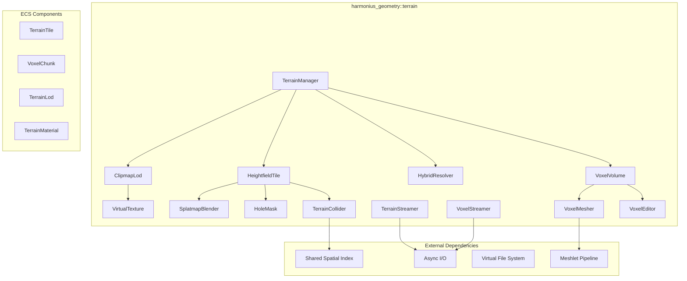
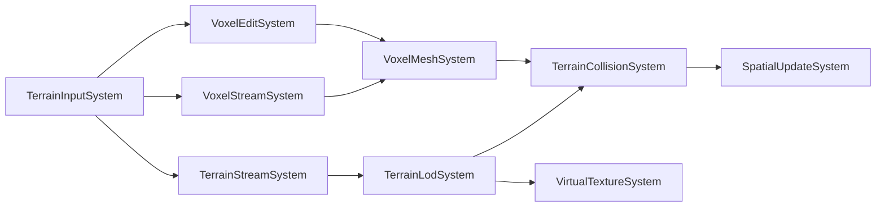
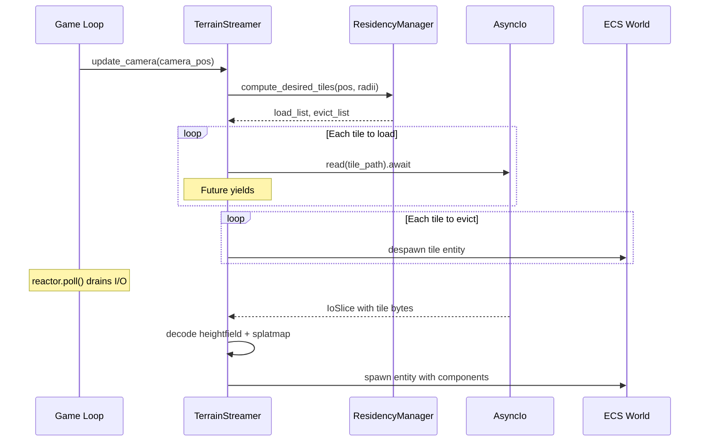
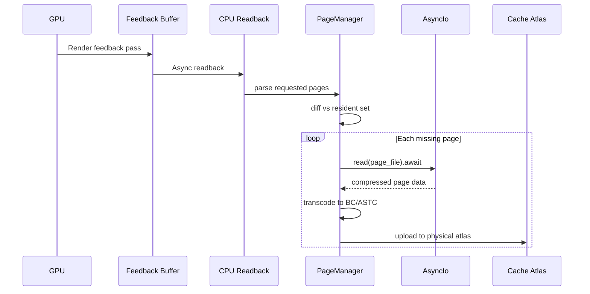
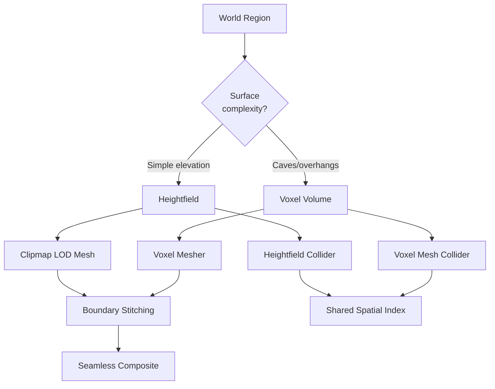
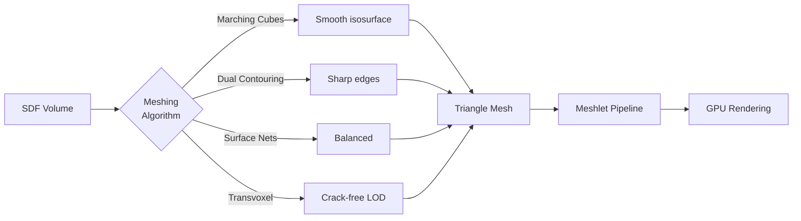
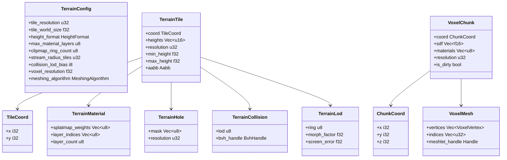
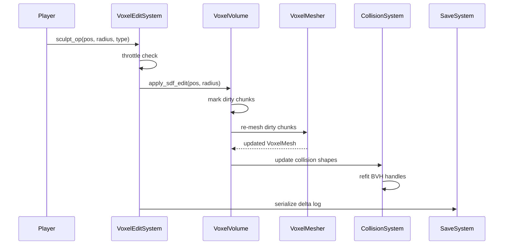

# Terrain Design

## Requirements Trace

> **Canonical sources:** Features, requirements, and user stories are defined in
> [features/geometry-world/](../../features/geometry-world/),
> [requirements/geometry-world/](../../requirements/geometry-world/), and
> [user-stories/geometry-world/](../../user-stories/geometry-world/). The table below traces design
> elements to those definitions.

### Heightfield Terrain (F-3.2.1–8 / R-3.2.1–8)

| Feature | Requirement | User Story | Description |
|---------|-------------|------------|-------------|
| F-3.2.1 | R-3.2.1 | US-3.2.1 | Tile-based heightfield with 16/32-bit grids, async streaming, low-LOD fallbacks |
| F-3.2.2 | R-3.2.2 | US-3.2.2 | Virtual texture clipmap with GPU feedback-driven page loading |
| F-3.2.3 | R-3.2.3 | US-3.2.3 | CDLOD geometry clipmap with vertex morphing at ring boundaries |
| F-3.2.4 | R-3.2.4 | US-3.2.4 | Per-tile 1-bit hole masks mirrored in collision |
| F-3.2.5 | R-3.2.5 | US-3.2.5 | Splatmap blending of up to 16 PBR layers with height-weighted transitions |
| F-3.2.6 | R-3.2.6 | US-3.2.6 | Heightfield collision with LOD independent of visual LOD |
| F-3.2.7 | R-3.2.7 | US-3.2.7 | 64-bit world coordinates with camera-relative f32 rendering |
| F-3.2.8 | R-3.2.8 | US-3.2.8a, US-3.2.8b | Portal-based indoor visibility with per-room lighting |

### Voxel Terrain (F-3.2.9–14 / R-3.2.9–14)

| Feature | Requirement | User Story | Description |
|---------|-------------|------------|-------------|
| F-3.2.9 | R-3.2.9 | US-3.2.9 | Sparse octree SDF volume with material IDs and metadata |
| F-3.2.10 | R-3.2.10 | US-3.2.10 | Hybrid heightmap-voxel with automatic representation selection |
| F-3.2.11 | R-3.2.11 | US-3.2.11 | Planetary-scale voxel sphere with radial gravity |
| F-3.2.12 | R-3.2.12 | US-3.2.12 | Meshing pipeline: Marching Cubes, Dual Contouring, Surface Nets, Transvoxel |
| F-3.2.13 | R-3.2.13 | US-3.2.13 | Runtime voxel editing with incremental re-mesh, collision, NavMesh update |
| F-3.2.14 | R-3.2.14 | US-3.2.14 | Voxel LOD streaming with RLE compression and memory budget enforcement |

### Cross-Cutting Dependencies

| Dependency | Source | Consumed API |
|------------|--------|--------------|
| Shared spatial index | F-1.9.1 | `BvhIndex::insert`, `BvhIndex::remove`, `SpatialQuery` |
| Async I/O | F-1.8.1–3 | `AsyncIo::read`, `VirtualFileSystem::open` |
| Memory budgets | F-1.7.6 | `MemoryBudget::check`, `MemoryBudget::record_alloc` |
| Thread pool | F-14.3.1 | `ThreadPool::scope`, `ThreadPool::spawn` |
| Meshlet pipeline | F-3.1.1 | Meshlet build from triangle mesh output |
| Render graph | F-2.10 | Pass registration for clipmap, virtual texture, feedback |
| ECS | F-1.1 | Components, resources, systems, change detection |
| Scene transforms | F-1.2.4 | `WorldPosition` (64-bit), camera-relative rebasing |

---

## Overview

The terrain subsystem provides two complementary representations -- heightfield tiles and sparse
voxel volumes -- unified through a hybrid resolver that automatically selects the optimal
representation per region. All terrain data lives as ECS components. All terrain logic runs as ECS
systems.

**Heightfield terrain** is the primary representation for open-world surfaces. Tiles stream via
async I/O, LOD is managed by a CDLOD geometry clipmap, and materials composite through a virtual
texture clipmap with GPU feedback.

**Voxel terrain** handles 3D geometry impossible with heightmaps: caves, overhangs, tunnels, and
player-dug holes. A sparse octree stores SDF values and material IDs. Four meshing algorithms serve
different art styles. Runtime editing supports survival/sandbox gameplay.

**Hybrid mode** is the default. The heightmap covers most of the world; voxel volumes overlay
regions with vertical complexity. Boundary stitching (Transvoxel) eliminates seams. Physics
collision works across both representations via the shared spatial index.

**Planetary mode** wraps voxel terrain around a sphere with radial gravity and clipmap LOD from
ground to orbit.

### Interop Contracts Defined Here

| Contract | Consumed By |
|----------|-------------|
| `TerrainTile` component | Rendering, Physics, Navigation |
| `VoxelChunk` component | Rendering, Physics, Navigation |
| `TerrainCollision` component | Physics broadphase via shared BVH |
| `TerrainQuery` trait | Gameplay (ground height, material at point) |
| Virtual texture atlas | Render graph terrain pass |

---

## Architecture

### Module Boundaries



### File Layout

```text
harmonius_geometry/
└── terrain/
    ├── mod.rs            # Public re-exports
    ├── config.rs         # TerrainConfig, VoxelConfig,
    │                     # ClipmapConfig
    ├── tile.rs           # HeightfieldTile, TileCoord,
    │                     # TileData decode/encode
    ├── voxel.rs          # VoxelVolume, SparseOctree,
    │                     # SdfCell, ChunkCoord
    ├── hybrid.rs         # HybridResolver,
    │                     # RepresentationTag
    ├── clipmap.rs        # ClipmapLod, ClipmapRing,
    │                     # morph factor computation
    ├── virtual_tex.rs    # VirtualTextureAtlas,
    │                     # PageManager, FeedbackPass
    ├── splatmap.rs       # SplatmapBlender,
    │                     # MaterialLayer
    ├── hole.rs           # HoleMask, hole query
    ├── collision.rs      # TerrainCollider,
    │                     # HeightfieldCollider,
    │                     # VoxelMeshCollider
    ├── streamer.rs       # TerrainStreamer,
    │                     # ResidencyManager,
    │                     # TileResidencyState
    ├── voxel_stream.rs   # VoxelStreamer,
    │                     # OctreeNodeLoader
    ├── mesher.rs         # VoxelMesher,
    │                     # MarchingCubes,
    │                     # DualContouring,
    │                     # SurfaceNets, Transvoxel
    ├── editor.rs         # VoxelEditor, SdfBrush,
    │                     # EditDelta, EditLog
    ├── planet.rs         # PlanetSphere,
    │                     # SphericalCoord,
    │                     # CubeSphereProjection
    ├── query.rs          # TerrainQuery trait,
    │                     # height_at, material_at
    ├── components.rs     # All ECS components
    ├── resources.rs      # All ECS resources
    ├── systems.rs        # All ECS systems
    └── error.rs          # TerrainError variants
```

### ECS System Schedule



| Phase | System | Runs After | Description |
|-------|--------|------------|-------------|
| PreUpdate | `TerrainInputSystem` | Input | Process sculpt tool inputs, camera position |
| Update | `TerrainStreamSystem` | TerrainInput | Async tile load/evict based on camera |
| Update | `VoxelStreamSystem` | TerrainInput | Async voxel octree node load/evict |
| Update | `VoxelEditSystem` | TerrainInput | Apply runtime SDF edits, throttled |
| PostUpdate | `TerrainLodSystem` | Stream systems | Compute clipmap rings, morph factors |
| PostUpdate | `VoxelMeshSystem` | VoxelStream, VoxelEdit | Re-mesh dirty chunks |
| PostUpdate | `TerrainCollisionSystem` | LOD, VoxelMesh | Update collision, register in BVH |
| PostUpdate | `VirtualTextureSystem` | TerrainLod | Feedback readback, page upload |
| PostUpdate | `SpatialUpdateSystem` | TerrainCollision | Shared BVH refit (external) |

### Tile Streaming Sequence



### Virtual Texture Feedback Pipeline



### Hybrid Heightmap-Voxel Decision



### Voxel Meshing Algorithms



### Core Data Structures



### Runtime Voxel Edit Pipeline



---

## API Design

### Coordinate Types

```rust
/// 2D tile coordinate in the heightfield grid.
#[derive(
    Clone, Copy, Debug, PartialEq, Eq, Hash,
)]
pub struct TileCoord {
    pub x: i32,
    pub y: i32,
}

/// 3D chunk coordinate in the voxel volume.
#[derive(
    Clone, Copy, Debug, PartialEq, Eq, Hash,
)]
pub struct ChunkCoord {
    pub x: i32,
    pub y: i32,
    pub z: i32,
}

/// 64-bit world position. All terrain operations
/// use this to avoid precision loss at large
/// distances from the origin.
#[derive(Clone, Copy, Debug)]
pub struct WorldPosition {
    pub x: f64,
    pub y: f64,
    pub z: f64,
}

impl WorldPosition {
    /// Rebase to camera-relative f32 for GPU
    /// submission. Eliminates jitter at distance.
    pub fn to_camera_relative(
        &self,
        camera: &WorldPosition,
    ) -> [f32; 3] {
        [
            (self.x - camera.x) as f32,
            (self.y - camera.y) as f32,
            (self.z - camera.z) as f32,
        ]
    }
}
```

### Configuration

```rust
/// Height storage precision.
#[derive(Clone, Copy, Debug, PartialEq, Eq)]
pub enum HeightFormat {
    /// 16-bit unsigned. 65,536 height levels.
    /// Suitable for most terrain.
    U16,
    /// 32-bit float. Full precision for extreme
    /// elevation ranges (space elevators, deep
    /// ocean trenches).
    F32,
}

/// Voxel meshing algorithm selection.
#[derive(Clone, Copy, Debug, PartialEq, Eq)]
pub enum MeshingAlgorithm {
    /// Smooth isosurface. Best for organic terrain.
    MarchingCubes,
    /// Preserves sharp edges. Best for rocky or
    /// architectural terrain.
    DualContouring,
    /// Balanced smooth/sharp with lower poly count.
    SurfaceNets,
    /// Crack-free LOD transitions between octree
    /// levels. Required for hybrid mode boundaries.
    Transvoxel,
}

/// Terrain representation mode.
#[derive(Clone, Copy, Debug, PartialEq, Eq)]
pub enum TerrainMode {
    /// Heightfield only. No caves or overhangs.
    HeightfieldOnly,
    /// Voxel only. Full 3D geometry everywhere.
    VoxelOnly,
    /// Hybrid: heightfield base + voxel overlays.
    /// Default for open-world games.
    Hybrid,
    /// Planetary sphere. Voxel volume wrapped
    /// around a sphere with radial gravity.
    Planetary,
}

/// Global terrain configuration. ECS resource.
pub struct TerrainConfig {
    /// Terrain representation mode.
    pub mode: TerrainMode,
    /// Vertices per tile edge. Must be power of 2
    /// plus 1 (e.g., 129, 257, 513).
    pub tile_resolution: u32,
    /// World-space size of one tile edge in meters.
    pub tile_world_size: f32,
    /// Height storage precision.
    pub height_format: HeightFormat,
    /// Maximum material layers per tile.
    /// Range: 4..=16.
    pub max_material_layers: u8,
    /// Number of clipmap LOD rings.
    /// Range: 4..=12.
    pub clipmap_ring_count: u8,
    /// How many tiles to stream around camera.
    pub stream_radius_tiles: u32,
    /// Collision LOD offset from visual LOD.
    /// Negative = finer, positive = coarser.
    pub collision_lod_bias: i8,
    /// Voxel cell size in meters (e.g., 1.0).
    pub voxel_resolution: f32,
    /// Voxel meshing algorithm.
    pub meshing_algorithm: MeshingAlgorithm,
    /// Maximum voxel edits processed per frame.
    pub max_edits_per_frame: u32,
    /// Planet radius in meters (Planetary mode).
    pub planet_radius: Option<f64>,
}
```

### ECS Components

```rust
/// Heightfield tile component. One entity per
/// loaded tile. Heights stored as a flat grid
/// in row-major order.
pub struct TerrainTile {
    /// Grid coordinate of this tile.
    pub coord: TileCoord,
    /// Height samples. Length = resolution^2.
    /// Stored as u16 when HeightFormat::U16,
    /// reinterpreted via height_scale/offset.
    pub heights: Vec<u16>,
    /// Vertices per edge (e.g., 257).
    pub resolution: u32,
    /// Minimum height in world units.
    pub min_height: f32,
    /// Maximum height in world units.
    pub max_height: f32,
    /// World-space AABB for spatial index.
    pub aabb: Aabb,
}

impl TerrainTile {
    /// Sample height at a normalized (0..1) UV
    /// within the tile. Bilinear interpolation.
    pub fn sample_height(
        &self,
        u: f32,
        v: f32,
    ) -> f32;

    /// Sample height at world XZ coordinates.
    /// Returns None if outside this tile.
    pub fn height_at_world(
        &self,
        world_x: f64,
        world_z: f64,
        config: &TerrainConfig,
    ) -> Option<f32>;

    /// Compute the world-space normal at a UV.
    pub fn normal_at(
        &self,
        u: f32,
        v: f32,
    ) -> [f32; 3];
}

/// Per-tile material splatmap. Weight maps for
/// blending PBR material layers.
pub struct TerrainMaterial {
    /// Per-vertex weights for each active layer.
    /// Layout: [layer0_weights..., layer1_weights...]
    /// Each weight is u8 (0..255). Weights for a
    /// vertex sum to 255.
    pub splatmap_weights: Vec<u8>,
    /// Indices into the global material palette.
    pub layer_indices: Vec<u8>,
    /// Number of active material layers (1..=16).
    pub layer_count: u8,
}

/// Per-tile hole mask. 1 bit per vertex. A set
/// bit marks the vertex as a hole. Triangles
/// with any hole vertex are discarded.
pub struct TerrainHole {
    /// Packed bit array. Length = ceil(res^2 / 8).
    pub mask: Vec<u8>,
    /// Must match TerrainTile::resolution.
    pub resolution: u32,
}

impl TerrainHole {
    /// Test if a vertex is marked as a hole.
    pub fn is_hole(
        &self,
        x: u32,
        y: u32,
    ) -> bool;

    /// Set or clear the hole flag for a vertex.
    pub fn set_hole(
        &mut self,
        x: u32,
        y: u32,
        is_hole: bool,
    );
}

/// LOD state for a terrain tile within the
/// clipmap ring hierarchy.
pub struct TerrainLod {
    /// Which clipmap ring this tile belongs to.
    /// 0 = finest (nearest camera).
    pub ring: u8,
    /// Morph blend factor [0..1] for transition
    /// to the next coarser ring. Used in the
    /// vertex shader.
    pub morph_factor: f32,
    /// Screen-space geometric error in pixels.
    pub screen_error: f32,
}

/// Terrain collision state. Links the tile to
/// the shared spatial index.
pub struct TerrainCollision {
    /// Collision mesh LOD level.
    pub lod: u8,
    /// Handle into the shared BVH.
    pub bvh_handle: BvhHandle,
}

/// Sparse voxel chunk component. One entity per
/// loaded chunk. Stores SDF + material per cell.
pub struct VoxelChunk {
    /// 3D grid coordinate of this chunk.
    pub coord: ChunkCoord,
    /// Signed distance field values. Negative =
    /// inside solid. Length = resolution^3.
    /// Stored as f16 for memory efficiency.
    pub sdf: Vec<u16>,
    /// Material ID per cell. 0 = air.
    pub materials: Vec<u8>,
    /// Cells per chunk edge (e.g., 16).
    pub resolution: u32,
    /// Set when SDF data has been modified and
    /// the mesh needs regeneration.
    pub is_dirty: bool,
    /// World-space AABB.
    pub aabb: Aabb,
}

impl VoxelChunk {
    /// Sample SDF at a cell coordinate.
    pub fn sdf_at(
        &self,
        x: u32,
        y: u32,
        z: u32,
    ) -> f32;

    /// Material ID at a cell coordinate.
    pub fn material_at(
        &self,
        x: u32,
        y: u32,
        z: u32,
    ) -> u8;

    /// Apply an SDF edit operation. Returns the
    /// set of affected cell coordinates.
    pub fn apply_edit(
        &mut self,
        edit: &SdfEdit,
    ) -> Vec<[u32; 3]>;
}

/// Generated mesh for a voxel chunk.
pub struct VoxelMesh {
    /// Interleaved vertex data.
    pub vertices: Vec<VoxelVertex>,
    /// Triangle indices.
    pub indices: Vec<u32>,
    /// Handle to the meshlet build output.
    pub meshlet_handle: Option<Handle<MeshletData>>,
}

/// Vertex format for voxel meshes.
#[repr(C)]
pub struct VoxelVertex {
    /// Position relative to chunk origin.
    pub position: [f32; 3],
    /// Packed normal (octahedral encoding).
    pub normal: u32,
    /// Material blend weights (up to 4 materials).
    pub material_weights: [u8; 4],
    /// Material indices (up to 4 materials).
    pub material_indices: [u8; 4],
}

/// Tags a region as heightfield, voxel, or
/// boundary (used by HybridResolver).
#[derive(Clone, Copy, Debug, PartialEq, Eq)]
pub enum RepresentationTag {
    Heightfield,
    Voxel,
    /// Boundary between heightfield and voxel.
    /// Requires Transvoxel stitching.
    Boundary,
}
```

### ECS Resources

```rust
/// Virtual texture atlas. Manages the physical
/// texture cache and indirection table. Stored
/// as an ECS resource.
pub struct VirtualTextureAtlas {
    /// Physical cache dimensions (e.g., 8192x8192).
    pub atlas_size: u32,
    /// Page dimensions (e.g., 128x128 + 4px
    /// border).
    pub page_size: u32,
    /// Number of clipmap mip levels.
    pub mip_levels: u8,
    /// Currently resident pages.
    resident_pages: HashMap<VirtualPageId, PhysicalSlot>,
    /// Free slots in the physical cache.
    free_slots: Vec<PhysicalSlot>,
    /// Indirection table: virtual -> physical.
    indirection: Vec<u32>,
}

impl VirtualTextureAtlas {
    pub fn new(config: &VirtualTextureConfig) -> Self;

    /// Request a page upload. Returns the physical
    /// slot where the page should be written.
    pub fn allocate_page(
        &mut self,
        page_id: VirtualPageId,
    ) -> Result<PhysicalSlot, VirtualTextureError>;

    /// Release a page slot back to the free list.
    pub fn release_page(
        &mut self,
        page_id: VirtualPageId,
    );

    /// Look up the physical slot for a virtual page.
    pub fn resolve(
        &self,
        page_id: VirtualPageId,
    ) -> Option<PhysicalSlot>;

    pub fn resident_count(&self) -> u32;
    pub fn capacity(&self) -> u32;
}

/// Page identifier in the virtual texture space.
#[derive(
    Clone, Copy, Debug, PartialEq, Eq, Hash,
)]
pub struct VirtualPageId {
    pub x: u32,
    pub y: u32,
    pub mip: u8,
}

/// Slot in the physical texture atlas.
#[derive(Clone, Copy, Debug)]
pub struct PhysicalSlot {
    pub x: u32,
    pub y: u32,
    pub layer: u32,
}

/// Memory budget tracking for terrain subsystem.
pub struct TerrainBudget {
    /// Budget for heightfield tile data.
    pub heightfield_budget: MemoryBudget,
    /// Budget for voxel octree data.
    pub voxel_budget: MemoryBudget,
    /// Budget for virtual texture cache.
    pub virtual_texture_budget: MemoryBudget,
    /// Budget for collision meshes.
    pub collision_budget: MemoryBudget,
}
```

### Terrain Streamer

```rust
/// Tile residency state machine.
#[derive(Clone, Copy, Debug, PartialEq, Eq)]
pub enum TileResidencyState {
    /// Not loaded. No entity exists.
    Evicted,
    /// Async I/O in flight. Placeholder low-LOD
    /// tile displayed.
    Loading,
    /// Fully loaded. Entity has all components.
    Resident,
    /// Marked for eviction at end of frame.
    PendingEvict,
}

/// Manages tile loading, eviction, and residency
/// based on camera proximity.
pub struct ResidencyManager {
    /// Current state of every tile in range.
    states: HashMap<TileCoord, TileResidencyState>,
    /// Ring radii in tile units. Index 0 = innermost
    /// (highest priority).
    load_radii: Vec<u32>,
    /// Maximum concurrent async loads.
    max_in_flight: u32,
    /// Current in-flight count.
    in_flight: u32,
}

impl ResidencyManager {
    pub fn new(
        config: &TerrainConfig,
        max_in_flight: u32,
    ) -> Self;

    /// Given camera position, compute which tiles
    /// to load and which to evict. Returns sorted
    /// by priority (nearest first).
    pub fn compute_desired(
        &mut self,
        camera_tile: TileCoord,
    ) -> ResidencyDelta;

    /// Record that a tile load completed.
    pub fn mark_resident(
        &mut self,
        coord: TileCoord,
    );

    /// Record that a tile was evicted.
    pub fn mark_evicted(
        &mut self,
        coord: TileCoord,
    );

    pub fn state(
        &self,
        coord: TileCoord,
    ) -> TileResidencyState;

    pub fn resident_count(&self) -> u32;
    pub fn loading_count(&self) -> u32;
}

/// Delta computed by ResidencyManager each frame.
pub struct ResidencyDelta {
    /// Tiles to begin loading, sorted nearest first.
    pub to_load: Vec<TileCoord>,
    /// Tiles to evict this frame.
    pub to_evict: Vec<TileCoord>,
}

/// Streams heightfield tiles via async I/O.
/// Runs as part of TerrainStreamSystem.
pub struct TerrainStreamer {
    residency: ResidencyManager,
    vfs: *const VirtualFileSystem,
    cancel_tokens: HashMap<TileCoord, CancelToken>,
}

impl TerrainStreamer {
    pub fn new(
        config: &TerrainConfig,
        vfs: &VirtualFileSystem,
    ) -> Self;

    /// Update camera position and issue async
    /// loads / evictions. Called once per frame.
    pub async fn update(
        &mut self,
        camera_pos: WorldPosition,
        config: &TerrainConfig,
        budget: &TerrainBudget,
    ) -> Vec<LoadedTile>;

    /// Cancel all in-flight loads (e.g., on
    /// teleport to distant location).
    pub fn cancel_all(&mut self);
}

/// Result of a successful tile load.
pub struct LoadedTile {
    pub coord: TileCoord,
    pub tile: TerrainTile,
    pub material: TerrainMaterial,
    pub hole: Option<TerrainHole>,
}
```

### Clipmap LOD

```rust
/// A single clipmap ring surrounding the camera.
pub struct ClipmapRing {
    /// Ring index. 0 = finest resolution.
    pub ring_index: u8,
    /// Vertex spacing in world units.
    /// ring_spacing = base_spacing * 2^ring_index.
    pub vertex_spacing: f32,
    /// Inner radius (where this ring starts).
    pub inner_radius: f32,
    /// Outer radius (where this ring ends).
    pub outer_radius: f32,
    /// Width of the morph transition zone
    /// at the outer boundary.
    pub morph_zone_width: f32,
}

/// Manages the CDLOD clipmap ring hierarchy.
pub struct ClipmapLod {
    rings: Vec<ClipmapRing>,
    /// Base vertex spacing at ring 0 (e.g., 1.0m).
    base_spacing: f32,
    /// Screen-space error threshold in pixels.
    error_threshold: f32,
}

impl ClipmapLod {
    pub fn new(config: &ClipmapConfig) -> Self;

    /// Recompute ring assignments for all loaded
    /// tiles based on current camera position and
    /// FOV. Returns updated TerrainLod components.
    pub fn update(
        &self,
        camera_pos: WorldPosition,
        fov_y: f32,
        viewport_height: u32,
        tiles: &[(TileCoord, Aabb)],
    ) -> Vec<(TileCoord, TerrainLod)>;

    /// Compute the morph factor for a vertex at
    /// `distance` from camera within `ring`.
    pub fn morph_factor(
        &self,
        ring: &ClipmapRing,
        distance: f32,
    ) -> f32;

    /// Compute screen-space geometric error for a
    /// given vertex spacing at a given distance.
    pub fn screen_error(
        &self,
        vertex_spacing: f32,
        distance: f32,
        fov_y: f32,
        viewport_height: u32,
    ) -> f32;

    pub fn ring_count(&self) -> u8;
    pub fn ring(&self, index: u8) -> &ClipmapRing;
}

/// Clipmap configuration.
pub struct ClipmapConfig {
    /// Base vertex spacing at finest ring (meters).
    pub base_spacing: f32,
    /// Number of rings.
    pub ring_count: u8,
    /// Screen error threshold (pixels).
    pub error_threshold: f32,
    /// Morph zone fraction (0.0..1.0) of ring width.
    pub morph_zone_fraction: f32,
}
```

### Splatmap Material Blending

```rust
/// A terrain material layer with full PBR textures.
pub struct MaterialLayer {
    /// Index in the global material palette.
    pub palette_index: u8,
    /// Albedo texture handle.
    pub albedo: Handle<TextureAsset>,
    /// Normal map handle.
    pub normal: Handle<TextureAsset>,
    /// Roughness/metallic/AO packed handle.
    pub orm: Handle<TextureAsset>,
    /// Height map for height-weighted blending.
    pub height: Handle<TextureAsset>,
    /// UV tiling factor.
    pub tiling: f32,
}

/// Global material palette. ECS resource shared
/// by all terrain tiles.
pub struct TerrainMaterialPalette {
    layers: Vec<MaterialLayer>,
}

impl TerrainMaterialPalette {
    pub fn new() -> Self;

    pub fn add_layer(
        &mut self,
        layer: MaterialLayer,
    ) -> u8;

    pub fn get_layer(
        &self,
        index: u8,
    ) -> Option<&MaterialLayer>;

    pub fn layer_count(&self) -> u8;
}

/// Composites splatmap weights into the virtual
/// texture pages. Height-weighted blending uses
/// the height maps from MaterialLayer to produce
/// natural transitions.
pub struct SplatmapBlender;

impl SplatmapBlender {
    /// Blend material layers for a region and
    /// write the result into a virtual texture
    /// page. Runs on GPU compute.
    pub fn blend_page(
        &self,
        page_id: VirtualPageId,
        tile: &TerrainTile,
        material: &TerrainMaterial,
        palette: &TerrainMaterialPalette,
    ) -> BlendedPage;
}

pub struct BlendedPage {
    /// Composited albedo pixels.
    pub albedo: Vec<u8>,
    /// Composited normal pixels.
    pub normal: Vec<u8>,
    /// Composited ORM pixels.
    pub orm: Vec<u8>,
}
```

### Terrain Collision

```rust
/// Heightfield collision representation. Derived
/// from TerrainTile at a potentially different LOD
/// than the visual mesh.
pub struct HeightfieldCollider {
    /// Coarsened height samples for physics.
    heights: Vec<u16>,
    /// Collision grid resolution (may differ from
    /// visual tile resolution).
    resolution: u32,
    /// World-space tile bounds.
    aabb: Aabb,
    /// Hole mask (shared with visual tile).
    hole_mask: Option<Vec<u8>>,
}

impl HeightfieldCollider {
    /// Build from a TerrainTile at the specified
    /// collision LOD level.
    pub fn from_tile(
        tile: &TerrainTile,
        hole: Option<&TerrainHole>,
        lod: u8,
    ) -> Self;

    /// Ray cast against the heightfield. Returns
    /// hit distance and surface normal.
    pub fn ray_cast(
        &self,
        origin: [f32; 3],
        direction: [f32; 3],
        max_distance: f32,
    ) -> Option<RayHit>;

    /// Shape cast (swept AABB/sphere) against
    /// the heightfield.
    pub fn shape_cast(
        &self,
        shape: &CollisionShape,
        direction: [f32; 3],
        max_distance: f32,
    ) -> Option<ShapeHit>;

    /// Sample height at a local XZ position.
    pub fn height_at(
        &self,
        local_x: f32,
        local_z: f32,
    ) -> Option<f32>;
}

/// Collision derived from voxel mesh triangles.
pub struct VoxelMeshCollider {
    /// Triangle soup from voxel meshing output.
    vertices: Vec<[f32; 3]>,
    indices: Vec<u32>,
    aabb: Aabb,
}

impl VoxelMeshCollider {
    /// Build from VoxelMesh output.
    pub fn from_mesh(mesh: &VoxelMesh) -> Self;

    pub fn ray_cast(
        &self,
        origin: [f32; 3],
        direction: [f32; 3],
        max_distance: f32,
    ) -> Option<RayHit>;

    pub fn shape_cast(
        &self,
        shape: &CollisionShape,
        direction: [f32; 3],
        max_distance: f32,
    ) -> Option<ShapeHit>;
}

/// Collision query result.
pub struct RayHit {
    pub distance: f32,
    pub normal: [f32; 3],
    pub position: [f32; 3],
    /// Material ID at the hit point (for footstep
    /// sounds, particle effects, etc.).
    pub material_id: u8,
}

pub struct ShapeHit {
    pub distance: f32,
    pub normal: [f32; 3],
    pub penetration_depth: f32,
}
```

### Voxel Volume

```rust
/// Sparse octree node. Only surface-adjacent
/// nodes store full SDF data. Deep solid/air
/// regions are represented by a single value.
pub enum OctreeNode {
    /// Leaf node with full SDF grid.
    Leaf {
        sdf: Vec<u16>,
        materials: Vec<u8>,
        resolution: u32,
    },
    /// Interior node with 8 children.
    Interior {
        children: [Option<Box<OctreeNode>>; 8],
        aabb: Aabb,
    },
    /// Homogeneous region (all solid or all air).
    /// Stores a single SDF value. Consumes zero
    /// per-cell memory.
    Homogeneous {
        sdf_value: f32,
        material_id: u8,
    },
}

/// The voxel terrain volume. Wraps a sparse octree
/// with streaming and edit support.
pub struct VoxelVolume {
    root: OctreeNode,
    /// World-space bounds of the entire volume.
    world_bounds: Aabb,
    /// Maximum octree depth (controls resolution).
    max_depth: u8,
    /// Cell size at maximum depth.
    cell_size: f32,
}

impl VoxelVolume {
    pub fn new(
        world_bounds: Aabb,
        max_depth: u8,
        cell_size: f32,
    ) -> Self;

    /// Sample the SDF at a world position.
    /// Traverses the octree to find the leaf.
    pub fn sample_sdf(
        &self,
        world_pos: [f32; 3],
    ) -> f32;

    /// Material ID at a world position.
    pub fn material_at(
        &self,
        world_pos: [f32; 3],
    ) -> u8;

    /// Insert or update an octree node from
    /// streamed data.
    pub fn insert_node(
        &mut self,
        path: &OctreePath,
        node: OctreeNode,
    );

    /// Remove an octree node (eviction).
    pub fn remove_node(
        &mut self,
        path: &OctreePath,
    );

    /// List all dirty chunks that need re-meshing.
    pub fn dirty_chunks(
        &self,
    ) -> Vec<ChunkCoord>;

    /// Clear the dirty flag on specified chunks.
    pub fn clear_dirty(
        &mut self,
        chunks: &[ChunkCoord],
    );
}

/// Path from root to a specific octree node.
/// Each element is a child index (0..7).
pub struct OctreePath {
    pub indices: Vec<u8>,
}
```

### Voxel Mesher

```rust
/// Input to the meshing pipeline: a chunk's SDF
/// and material data plus neighbor data for
/// seamless boundaries.
pub struct MeshInput {
    /// The chunk to mesh.
    pub chunk: ChunkCoord,
    /// SDF values for this chunk.
    pub sdf: Vec<u16>,
    /// Material IDs for this chunk.
    pub materials: Vec<u8>,
    /// Cells per edge.
    pub resolution: u32,
    /// Neighbor SDF data for boundary cells.
    /// Order: -X, +X, -Y, +Y, -Z, +Z.
    pub neighbors: [Option<Vec<u16>>; 6],
}

/// Meshing output.
pub struct MeshOutput {
    pub chunk: ChunkCoord,
    pub vertices: Vec<VoxelVertex>,
    pub indices: Vec<u32>,
}

/// Voxel meshing pipeline. Supports multiple
/// algorithms selected at configuration time.
pub struct VoxelMesher {
    algorithm: MeshingAlgorithm,
}

impl VoxelMesher {
    pub fn new(
        algorithm: MeshingAlgorithm,
    ) -> Self;

    /// Mesh a single chunk on the CPU. Used for
    /// mobile fallback and batch generation.
    pub fn mesh_cpu(
        &self,
        input: &MeshInput,
    ) -> MeshOutput;

    /// Submit a chunk for GPU compute meshing.
    /// Returns a future that resolves when the
    /// GPU has finished. Desktop only.
    pub async fn mesh_gpu(
        &self,
        input: &MeshInput,
    ) -> MeshOutput;

    /// Mesh multiple chunks in parallel using
    /// scoped thread pool tasks.
    pub fn mesh_batch_cpu(
        &self,
        inputs: &[MeshInput],
        pool: &ThreadPool,
    ) -> Vec<MeshOutput>;
}
```

### Voxel Editor

```rust
/// SDF brush operations for runtime terrain
/// editing.
#[derive(Clone, Copy, Debug, PartialEq, Eq)]
pub enum SdfBrushOp {
    /// Add material (subtract from SDF).
    Add,
    /// Remove material (add to SDF).
    Subtract,
    /// Smooth SDF values within radius.
    Smooth,
    /// Flatten to a target height plane.
    Flatten,
    /// Paint material without changing shape.
    Paint,
}

/// Parameters for an SDF edit operation.
pub struct SdfEdit {
    /// World-space center of the edit.
    pub center: [f32; 3],
    /// Brush radius in world units.
    pub radius: f32,
    /// Falloff curve exponent. 1.0 = linear,
    /// 2.0 = quadratic, etc.
    pub falloff: f32,
    /// Brush operation type.
    pub op: SdfBrushOp,
    /// Strength multiplier [0..1].
    pub strength: f32,
    /// Material to paint (for Add and Paint ops).
    pub material_id: u8,
    /// Target height (for Flatten op only).
    pub flatten_height: Option<f32>,
}

/// A compact record of one edit, used for
/// save/load delta logs. Target: under 1 KB
/// per edit.
#[derive(Clone, Debug)]
pub struct EditDelta {
    /// Chunk affected.
    pub chunk: ChunkCoord,
    /// Cell indices within the chunk that changed.
    pub cells: Vec<u16>,
    /// Previous SDF values (for undo).
    pub old_sdf: Vec<u16>,
    /// New SDF values.
    pub new_sdf: Vec<u16>,
    /// Previous material IDs (for undo).
    pub old_materials: Vec<u8>,
    /// New material IDs.
    pub new_materials: Vec<u8>,
}

/// Persistent log of all voxel edits. Serialized
/// with save data. Replay reconstructs terrain.
pub struct EditLog {
    deltas: Vec<EditDelta>,
}

impl EditLog {
    pub fn new() -> Self;
    pub fn push(&mut self, delta: EditDelta);
    pub fn len(&self) -> usize;

    /// Replay all edits onto a fresh volume.
    pub fn replay(
        &self,
        volume: &mut VoxelVolume,
    );

    /// Undo the last N edits.
    pub fn undo(
        &mut self,
        count: usize,
        volume: &mut VoxelVolume,
    );

    /// Serialize to bytes for save system.
    pub fn serialize(&self) -> Vec<u8>;

    /// Deserialize from saved bytes.
    pub fn deserialize(
        data: &[u8],
    ) -> Result<Self, TerrainError>;
}

/// Runtime voxel editor. Processes sculpt inputs,
/// applies edits with throttling, and records
/// deltas.
pub struct VoxelEditor {
    edit_log: EditLog,
    /// Edits queued this frame.
    pending_edits: Vec<SdfEdit>,
    /// Maximum edits per frame (from config).
    max_per_frame: u32,
}

impl VoxelEditor {
    pub fn new(max_per_frame: u32) -> Self;

    /// Queue an edit. Will be applied during
    /// VoxelEditSystem, subject to throttling.
    pub fn queue_edit(&mut self, edit: SdfEdit);

    /// Apply queued edits to the volume up to the
    /// per-frame budget. Returns deltas for
    /// save/replication and list of dirty chunks.
    pub fn flush(
        &mut self,
        volume: &mut VoxelVolume,
    ) -> (Vec<EditDelta>, Vec<ChunkCoord>);

    pub fn edit_log(&self) -> &EditLog;
}
```

### Planetary Sphere

```rust
/// Cube-sphere face identifier (6 faces).
#[derive(
    Clone, Copy, Debug, PartialEq, Eq, Hash,
)]
pub enum CubeFace {
    PosX,
    NegX,
    PosY,
    NegY,
    PosZ,
    NegZ,
}

/// Coordinate on the planetary sphere surface.
pub struct SphericalCoord {
    pub latitude: f64,
    pub longitude: f64,
    pub altitude: f64,
}

/// Planetary terrain wrapping a voxel volume
/// around a sphere.
pub struct PlanetSphere {
    /// Planet radius in meters.
    pub radius: f64,
    /// Per-face voxel volumes (cube-sphere
    /// projection).
    faces: [VoxelVolume; 6],
    /// Gravity direction is always toward
    /// planet center.
    pub gravity_direction: fn(
        &WorldPosition,
    ) -> [f32; 3],
}

impl PlanetSphere {
    pub fn new(
        radius: f64,
        voxel_config: &TerrainConfig,
    ) -> Self;

    /// Convert world position to spherical
    /// coordinate.
    pub fn to_spherical(
        &self,
        world_pos: &WorldPosition,
    ) -> SphericalCoord;

    /// Convert spherical to world position.
    pub fn to_world(
        &self,
        coord: &SphericalCoord,
    ) -> WorldPosition;

    /// Determine which cube face and local UV
    /// a world position maps to.
    pub fn project_to_face(
        &self,
        world_pos: &WorldPosition,
    ) -> (CubeFace, f32, f32);

    /// Sample terrain height at a surface point
    /// (altitude above/below radius).
    pub fn surface_height(
        &self,
        coord: &SphericalCoord,
    ) -> f64;

    /// Compute gravity vector (toward center)
    /// at a world position.
    pub fn gravity_at(
        &self,
        world_pos: &WorldPosition,
    ) -> [f32; 3];
}
```

### Terrain Query Trait

```rust
/// Unified terrain query interface consumed by
/// gameplay, physics, and navigation systems.
pub trait TerrainQuery {
    /// Sample ground height at world XZ. Returns
    /// the highest solid surface Y coordinate.
    fn height_at(
        &self,
        world_x: f64,
        world_z: f64,
    ) -> Option<f32>;

    /// Material ID at a world XZ position on the
    /// terrain surface.
    fn material_at(
        &self,
        world_x: f64,
        world_z: f64,
    ) -> Option<u8>;

    /// Surface normal at world XZ.
    fn normal_at(
        &self,
        world_x: f64,
        world_z: f64,
    ) -> Option<[f32; 3]>;

    /// Test if a world position is inside a
    /// terrain hole.
    fn is_hole(
        &self,
        world_x: f64,
        world_z: f64,
    ) -> bool;

    /// Ray cast against all terrain
    /// representations (heightfield + voxel).
    fn ray_cast(
        &self,
        origin: [f32; 3],
        direction: [f32; 3],
        max_distance: f32,
    ) -> Option<RayHit>;
}
```

### Error Types

```rust
pub enum TerrainError {
    /// Tile not loaded at the requested coordinate.
    TileNotLoaded { coord: TileCoord },
    /// Voxel chunk not loaded.
    ChunkNotLoaded { coord: ChunkCoord },
    /// Async I/O failure during streaming.
    IoError(IoError),
    /// Memory budget exceeded. Eviction required.
    BudgetExceeded {
        subsystem: &'static str,
        budget_bytes: usize,
        requested_bytes: usize,
    },
    /// Invalid tile data (corrupt file, wrong
    /// version).
    InvalidTileData {
        coord: TileCoord,
        reason: &'static str,
    },
    /// Edit rejected by server in multiplayer
    /// (restricted zone).
    EditRejected {
        coord: ChunkCoord,
        reason: &'static str,
    },
    /// Virtual texture page allocation failed
    /// (atlas full, eviction in progress).
    VirtualTextureExhausted,
    /// Meshing failed (degenerate SDF data).
    MeshingFailed {
        chunk: ChunkCoord,
        algorithm: MeshingAlgorithm,
    },
}
```

---

## Data Flow

### Frame Lifecycle

Each frame, terrain systems execute in this order:

```rust
// Simplified frame flow for terrain

// 1. PreUpdate: capture camera + tool inputs
terrain_input_system(camera, tool_state);

// 2. Update: stream tiles based on camera
let loaded = terrain_streamer
    .update(camera_pos, config, budget)
    .await;
for tile in loaded {
    world.spawn((
        tile.tile,
        tile.material,
        tile.hole,
    ));
}

// 3. Update: stream voxel nodes
let voxel_nodes = voxel_streamer
    .update(camera_pos, config, budget)
    .await;
for node in voxel_nodes {
    world.spawn((node.chunk,));
}

// 4. Update: apply voxel edits (throttled)
let (deltas, dirty) =
    voxel_editor.flush(&mut volume);
for delta in &deltas {
    save_system.record(delta);
    net.replicate_edit(delta);
}

// 5. PostUpdate: recompute LOD rings
let lod_updates = clipmap
    .update(camera_pos, fov, viewport, tiles);
for (coord, lod) in lod_updates {
    world.insert(entity, lod);
}

// 6. PostUpdate: re-mesh dirty voxel chunks
pool.scope(|scope| {
    for chunk in dirty {
        scope.spawn(|| {
            mesher.mesh_cpu(&chunk_input)
        });
    }
});

// 7. PostUpdate: update collision
for tile_entity in changed_tiles {
    let collider = HeightfieldCollider::from_tile(
        &tile, hole.as_ref(), lod,
    );
    let handle = bvh.insert(entity, aabb);
    world.insert(entity, TerrainCollision {
        lod,
        bvh_handle: handle,
    });
}

// 8. PostUpdate: virtual texture feedback
virtual_texture_system(
    &feedback_buffer,
    &mut atlas,
    &async_io,
    &palette,
);
```

### Tile Binary Format

Tile files are stored on disk with the following layout. All multi-byte values are little-endian.

| Offset | Size | Field |
|--------|------|-------|
| 0 | 4 | Magic: `HTIL` |
| 4 | 4 | Version (u32) |
| 8 | 4 | Resolution (u32) |
| 12 | 1 | HeightFormat (0=U16, 1=F32) |
| 13 | 1 | Layer count |
| 14 | 2 | Flags (bit 0: has_holes) |
| 16 | 4 | min_height (f32) |
| 20 | 4 | max_height (f32) |
| 24 | 4 | Height data size (u32) |
| 28 | N | Height data (LZ4 compressed) |
| 28+N | 4 | Splatmap data size (u32) |
| 32+N | M | Splatmap weights (LZ4 compressed) |
| 32+N+M | 4 | Hole mask size (u32, 0 if none) |
| 36+N+M | H | Hole mask bits (uncompressed) |

### Voxel Chunk Binary Format

| Offset | Size | Field |
|--------|------|-------|
| 0 | 4 | Magic: `VCHK` |
| 4 | 4 | Version (u32) |
| 8 | 4 | Resolution (u32) |
| 12 | 4 | SDF data size (u32) |
| 16 | S | SDF values (RLE + LZ4) |
| 16+S | 4 | Material data size (u32) |
| 20+S | M | Material IDs (RLE + LZ4) |

### Voxel Compression Pipeline

Voxel data uses two-stage compression to achieve the 10:1 target ratio (R-3.2.14):

1. **RLE (Run-Length Encoding):** Consecutive cells with identical SDF/material values are collapsed
   to (value, count) pairs. Homogeneous regions (common in underground solid and open air) compress
   extremely well.

2. **LZ4:** The RLE stream is further compressed with LZ4 for fast decompression on load. LZ4
   decompression runs at memory bandwidth speed.

| Region Type | Typical RLE Ratio | After LZ4 |
|-------------|------------------|-----------|
| Open air (homogeneous) | 100:1+ | 500:1+ |
| Deep solid (homogeneous) | 100:1+ | 500:1+ |
| Surface (varied SDF) | 2:1 to 5:1 | 5:1 to 15:1 |
| Edited (high entropy) | 1.5:1 to 3:1 | 3:1 to 8:1 |

---

## Platform Considerations

### Async I/O Integration

All terrain streaming uses platform-native async I/O through the `AsyncIo` / `VirtualFileSystem`
layer. No `std::fs` calls.

| Platform | I/O Backend | Terrain Notes |
|----------|-------------|---------------|
| Windows | IOCP | `ReadFile` + `OVERLAPPED` for tile reads. Large tiles use scatter-gather for header + data separation. |
| macOS | GCD / Dispatch IO | `dispatch_io_read` via cxx.rs. Tile reads routed to controlled dispatch queue, drained at reactor poll point. |
| Linux | io_uring | `io_uring_prep_read` for tile data. Registered buffers for frequently-loaded tile sizes. |

### GPU Compute Availability

| Feature | Desktop | Mobile | Switch |
|---------|---------|--------|--------|
| Virtual texture feedback | GPU readback | GPU readback | GPU readback |
| Splatmap compositing | GPU compute | GPU compute | GPU compute |
| Voxel meshing | GPU compute | CPU fallback | CPU fallback |
| Clipmap vertex morph | Vertex shader | Vertex shader | Vertex shader |
| Hole mask discard | Mesh shader | Fragment discard | Fragment discard |

### Scaling Tiers

| Parameter | Mobile | Switch | Desktop | High-End |
|-----------|--------|--------|---------|----------|
| Tile resolution | 129 | 257 | 257 | 513 |
| Tile world size | 64 m | 128 m | 256 m | 256 m |
| Clipmap rings | 4 | 6 | 8 | 12 |
| Material layers/tile | 4 | 8 | 12 | 16 |
| Stream radius (tiles) | 4 | 8 | 16 | 32 |
| Voxel cell size | 2.0 m | 1.5 m | 1.0 m | 0.5 m |
| Voxel chunk resolution | 16 | 16 | 16 | 32 |
| Max concurrent I/O | 8 | 16 | 64 | 128 |
| Virtual texture atlas | 4096 | 4096 | 8192 | 16384 |
| Collision LOD bias | +2 | +1 | 0 | 0 |
| Max edits/frame | 2 | 4 | 16 | 32 |
| Heightfield budget | 64 MB | 128 MB | 512 MB | 2 GB |
| Voxel budget | 32 MB | 64 MB | 256 MB | 1 GB |

### HLSL Shader Notes

All terrain shaders are authored in HLSL per the project-wide shader constraint.

| Shader | Stage | Purpose |
|--------|-------|---------|
| `terrain_clipmap.hlsl` | Vertex | Clipmap ring vertex position + morph |
| `terrain_hole.hlsl` | Mesh/Fragment | Hole mask triangle discard |
| `terrain_splatmap.hlsl` | Fragment | Height-weighted material blending |
| `terrain_feedback.hlsl` | Fragment | Virtual texture page ID output |
| `terrain_virtual.hlsl` | Fragment | Indirection table lookup + sampling |
| `voxel_mesh_cs.hlsl` | Compute | GPU voxel meshing (Marching Cubes) |
| `voxel_triplanar.hlsl` | Fragment | Triplanar texture mapping for voxels |

### Memory Layout

Terrain components are designed for cache-friendly ECS iteration. Hot data (coord, LOD, AABB) is
separated from cold data (height arrays, splatmaps).

| Component | Hot Fields | Cold Fields |
|-----------|-----------|-------------|
| `TerrainTile` | coord, aabb, resolution | heights (heap Vec) |
| `TerrainMaterial` | layer_count, layer_indices | splatmap_weights (heap Vec) |
| `TerrainHole` | resolution | mask (heap Vec) |
| `TerrainLod` | ring, morph_factor, screen_error | (none) |
| `TerrainCollision` | lod, bvh_handle | (none) |
| `VoxelChunk` | coord, aabb, is_dirty | sdf, materials (heap Vec) |

---

## Test Plan

### Unit Tests

| Test | Req | Description |
|------|-----|-------------|
| `test_tile_height_sample_bilinear` | R-3.2.1 | Sample height at UV (0.5, 0.5) with known grid. Verify bilinear interpolation matches expected value. |
| `test_tile_height_at_world` | R-3.2.1 | Convert world XZ to tile UV. Verify correct height. Verify None for out-of-bounds. |
| `test_tile_normal_flat` | R-3.2.1 | Flat tile (all heights equal). Verify normal = (0, 1, 0). |
| `test_tile_normal_slope` | R-3.2.1 | 45-degree slope tile. Verify normal is correct and normalized. |
| `test_clipmap_ring_spacing` | R-3.2.3 | 8 rings with base 1.0m. Verify ring N spacing = 2^N meters. |
| `test_clipmap_morph_boundaries` | R-3.2.3 | Vertex at ring boundary. Verify morph_factor = 1.0. Vertex at ring center: morph_factor = 0.0. |
| `test_clipmap_screen_error` | R-3.2.3 | 1m spacing at 100m distance with 90-degree FOV, 1080p. Verify screen error < threshold. |
| `test_hole_mask_bit_ops` | R-3.2.4 | Set hole at (5,7), verify is_hole(5,7) = true. Clear it, verify false. Adjacent vertices unaffected. |
| `test_hole_mask_round_trip` | R-3.2.4 | Set 100 random holes. Verify all 100 read back correctly. Verify all others are not holes. |
| `test_splatmap_weight_sum` | R-3.2.5 | 4 layers with random weights. Verify per-vertex weights sum to 255. |
| `test_splatmap_16_layers` | R-3.2.5 | Tile with 16 active layers. Verify all layer indices valid. Verify weight lookup for each layer. |
| `test_heightfield_collider_ray_hit` | R-3.2.6 | Ray from (50, 100, 50) downward. Verify hit at terrain surface. Verify normal is upward-ish. |
| `test_heightfield_collider_ray_miss` | R-3.2.6 | Ray parallel to terrain surface. Verify no hit. |
| `test_heightfield_collider_hole_passthrough` | R-3.2.6 | Ray through a hole region. Verify ray passes through (no hit in hole). |
| `test_world_position_camera_relative` | R-3.2.7 | Position at (100000.5, 0, 100000.5). Camera at (100000, 0, 100000). Verify relative = (0.5, 0, 0.5). |
| `test_world_position_no_jitter` | R-3.2.7 | 10 positions at 50 km from origin. Convert to camera-relative f32. Verify sub-millimeter precision. |
| `test_voxel_sdf_sample` | R-3.2.9 | Known SDF grid. Sample at cell centers. Verify values match. |
| `test_voxel_homogeneous_zero_memory` | R-3.2.9 | Create 1000 homogeneous air nodes. Verify total memory = node metadata only, no per-cell arrays. |
| `test_hybrid_representation_selection` | R-3.2.10 | Flat region -> Heightfield. Region with cave -> Voxel. Verify RepresentationTag. |
| `test_marching_cubes_sphere` | R-3.2.12 | SDF sphere of radius 5. Verify mesh is closed, vertex count > 0, all normals point outward. |
| `test_dual_contouring_cube` | R-3.2.12 | SDF axis-aligned cube. Verify sharp edges preserved (angle between adjacent face normals ~90 degrees). |
| `test_transvoxel_no_cracks` | R-3.2.12 | Two adjacent chunks at different LODs. Verify shared edge vertices match exactly (no T-junctions). |
| `test_meshing_incremental` | R-3.2.12 | Modify 1 cell. Verify only containing chunk is re-meshed, not neighbors. |
| `test_sdf_edit_add` | R-3.2.13 | Apply Add brush at center. Verify SDF values decreased within radius. Verify outside radius unchanged. |
| `test_sdf_edit_subtract` | R-3.2.13 | Apply Subtract brush. Verify SDF values increased (material removed). |
| `test_sdf_edit_smooth` | R-3.2.13 | Apply Smooth brush to noisy SDF. Verify variance decreased. |
| `test_sdf_edit_flatten` | R-3.2.13 | Apply Flatten brush with target height. Verify surface converges to target. |
| `test_edit_delta_size` | R-3.2.13 | Single-cell edit. Serialize EditDelta. Verify size < 1 KB. |
| `test_edit_log_undo` | R-3.2.13 | Apply 5 edits, undo 3. Verify volume matches state after edit 2. |
| `test_edit_log_round_trip` | R-3.2.13 | Apply edits, serialize log, deserialize, replay on fresh volume. Verify identical result. |
| `test_edit_throttle` | R-3.2.13 | Queue 100 edits with max 10/frame. Verify flush returns exactly 10. |
| `test_voxel_rle_compression` | R-3.2.14 | Homogeneous air chunk. RLE compress. Verify ratio > 100:1. |
| `test_voxel_lz4_round_trip` | R-3.2.14 | Compress surface chunk with RLE+LZ4. Decompress. Verify bit-exact match. |
| `test_voxel_compression_ratio` | R-3.2.14 | Mixed terrain chunk. Verify overall ratio >= 10:1. |
| `test_residency_load_nearest_first` | R-3.2.1 | Camera at (0,0). Verify to_load is sorted by distance ascending. |
| `test_residency_evict_farthest` | R-3.2.1 | Move camera 10 tiles. Verify old distant tiles appear in to_evict. |
| `test_residency_budget_enforcement` | R-3.2.14 | Set budget to 10 tiles. Load 15. Verify eviction kicks in at 10. |
| `test_virtual_page_allocate_release` | R-3.2.2 | Allocate 100 pages. Release 50. Allocate 50 more. Verify no leak. |
| `test_virtual_indirection_resolve` | R-3.2.2 | Allocate page. Resolve its VirtualPageId. Verify correct PhysicalSlot. |
| `test_planet_spherical_round_trip` | R-3.2.11 | Convert world pos to spherical and back. Verify sub-meter precision. |
| `test_planet_gravity_toward_center` | R-3.2.11 | Position on surface. Verify gravity vector points toward (0,0,0). |
| `test_planet_cube_face_projection` | R-3.2.11 | 6 axis-aligned positions. Verify each maps to the correct CubeFace. |

### Integration Tests

| Test | Req | Description |
|------|-----|-------------|
| `test_stream_100_tiles_no_holes` | R-3.2.1 | Stream 100 tiles via async I/O. Verify all load, no placeholder tiles remain after settling. |
| `test_stream_teleport_cancel` | R-3.2.1 | Start loading 50 tiles. Teleport camera 1 km away. Verify old loads cancelled, new loads issued. |
| `test_stream_budget_eviction` | R-3.2.1 | Stream 200 tiles with budget for 100. Verify 100 resident, 100 evicted, no memory leak. |
| `test_clipmap_visual_no_seams` | R-3.2.3 | Render 8-ring clipmap. Verify adjacent ring vertex heights match within epsilon at morph boundaries. |
| `test_collision_matches_visual` | R-3.2.4, R-3.2.6 | Paint holes. Verify visual mesh discards same triangles as collision rejects. |
| `test_hybrid_boundary_stitch` | R-3.2.10 | Heightfield tile adjacent to voxel chunk. Verify shared edge vertices produce watertight mesh. |
| `test_voxel_edit_mesh_collision_sync` | R-3.2.13 | Dig tunnel. Verify mesh has hole, collision allows passage, NavMesh path exists through tunnel. |
| `test_multiplayer_edit_replication` | R-3.2.13 | Client applies edit. Server validates and replicates. Second client receives edit. Verify identical terrain. |
| `test_multiplayer_restricted_zone` | R-3.2.13 | Client attempts edit in restricted zone. Verify EditRejected error. Verify terrain unchanged. |
| `test_virtual_texture_feedback_loop` | R-3.2.2 | Render terrain, read feedback, load pages, render again. Verify requested pages are now resident. |
| `test_platform_async_io_per_platform` | R-3.2.1 | Same streaming test on Windows, macOS, Linux CI. Verify identical tile data loaded on all platforms. |

### Benchmarks

| Benchmark | Target | Source |
|-----------|--------|--------|
| Tile decode (257x257 U16 + LZ4) | < 1 ms | US-3.2.1 |
| Clipmap LOD update (1000 tiles) | < 500 us | US-3.2.3 |
| Heightfield ray cast (single tile) | < 5 us | US-3.2.6 |
| Voxel meshing 16x16x16 (CPU) | < 5 ms | R-3.2.12 |
| Voxel meshing 16x16x16 (GPU compute) | < 2 ms | R-3.2.12 |
| SDF edit apply (radius 5m) | < 1 ms | US-3.2.13 |
| EditDelta serialize | < 100 us | R-3.2.13 |
| RLE+LZ4 decompress (surface chunk) | < 500 us | R-3.2.14 |
| Virtual texture page upload (128x128 BC7) | < 200 us | US-3.2.2 |
| Splatmap blend (4 layers, 257x257) | < 2 ms | US-3.2.5 |
| Residency compute (1000 tile radius) | < 200 us | US-3.2.1 |

---

### GPU Compute Availability

| Backend | Compute Shaders | Mesh Shaders | Notes |
|---------|----------------|-------------|-------|
| D3D12 | Yes (SM 5.0+) | Yes (SM 6.5+, optional) | Full terrain compute support. |
| Vulkan | Yes (1.0+) | Yes (task/mesh, optional) | Subgroup operations for reduction. |
| Metal | Yes (MSL 2.0+) | Object/mesh (Apple GPU family 7+) | Threadgroup memory for local sort. |
| Mobile | Limited dispatch size | No mesh shaders | Reduced terrain detail (PlatformTier::Mobile). |

Virtual texture streaming uses the shared `VirtualResourceStreamer` framework (see
[shared-primitives.md](../core-runtime/shared-primitives.md)).

Terrain sculpting brushes use the shared `BrushConfig` type (see also
[level-world.md](../tools/level-world.md)).

## Open Questions

1. **Heightfield-to-voxel transition heuristic** -- How should the HybridResolver detect that a
   region requires voxel representation? Options: artist-placed voxel zones only, automatic
   detection from cave entrance geometry, or a "voxel flag" per tile set in the editor. Automatic
   detection is harder but better for procedural worlds.

2. **Virtual texture page eviction policy** -- LRU is simplest but may thrash on camera rotation. A
   priority-aware policy that weights distance and mip level may perform better. Need profiling data
   to decide.

3. **GPU compute meshing dispatch model** -- Should each dirty chunk be a separate compute dispatch,
   or should multiple chunks be batched into one dispatch with indirect arguments? Batching reduces
   dispatch overhead but complicates the shader.

4. **Transvoxel at hybrid boundaries** -- The Transvoxel algorithm handles LOD transitions within
   the voxel volume, but stitching voxel mesh edges to heightfield mesh edges is a separate problem.
   May need a dedicated boundary stitching pass that samples the heightfield at voxel boundary
   vertices.

5. **Edit delta compression** -- The 1 KB target per edit (R-3.2.13) may be tight for large-radius
   edits affecting hundreds of cells. Consider delta-encoding SDF values (store difference from
   previous value) or quantizing the delta to fewer bits.

6. **Planetary LOD at poles** -- Cube-sphere projection introduces distortion at face edges and
   vertices. The clipmap ring calculation needs adjustment near poles to avoid over-tessellation or
   gaps.

7. **Collision LOD stability** -- If visual LOD changes but collision LOD stays constant, the player
   may see visual terrain at a different height than the collision surface. Need to define the
   maximum acceptable divergence and ensure the collision_lod_bias keeps it within tolerance.

8. **Streaming priority vs. I/O priority** -- Tile loads use `IoPriority::Normal`. Should tiles
   directly under the camera use `Critical` priority? This would reduce pop-in on fast camera
   movement but may starve other I/O (audio, network).
