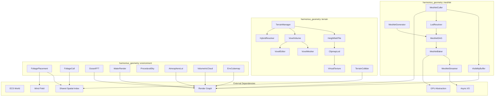
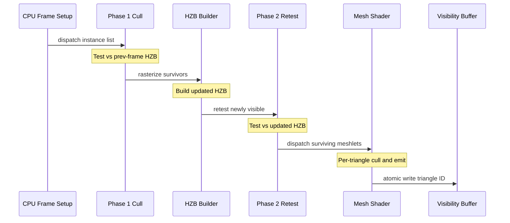
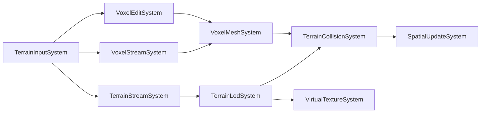
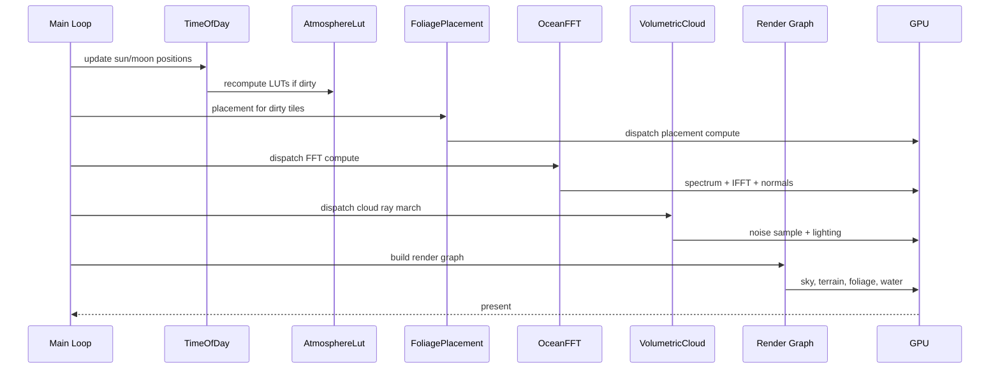
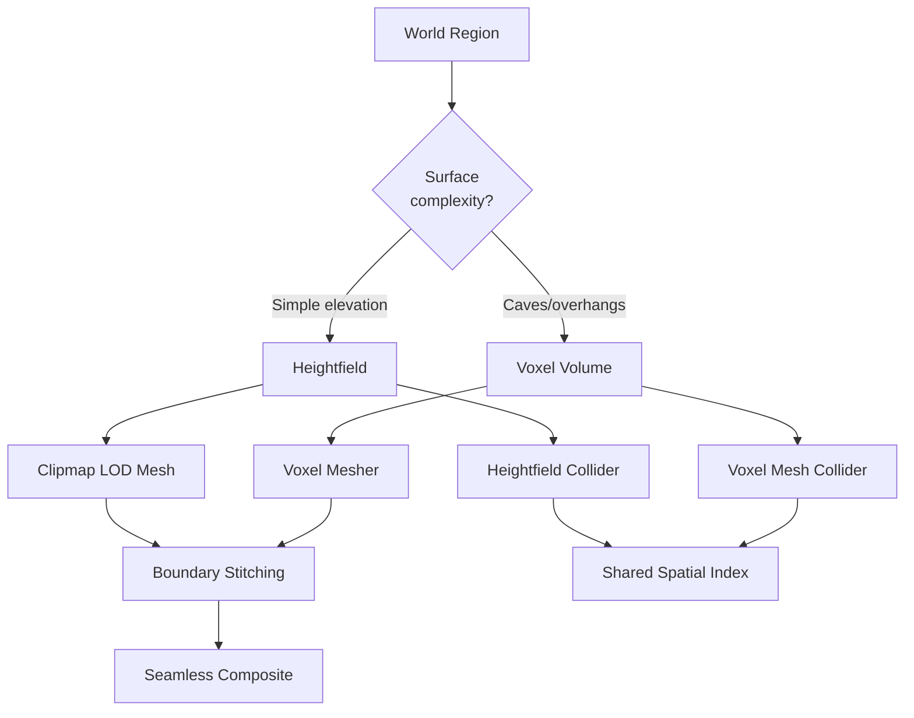
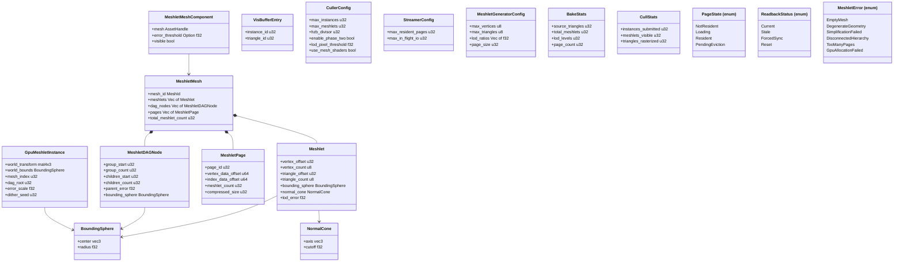
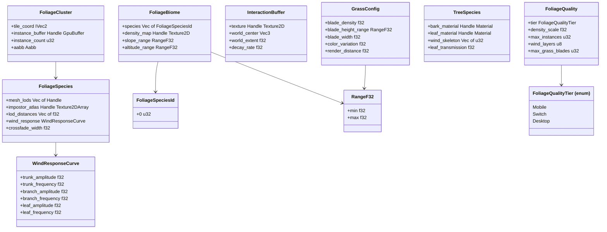
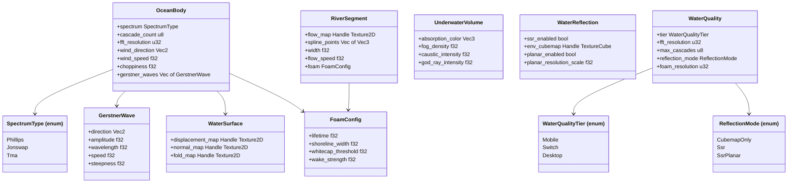
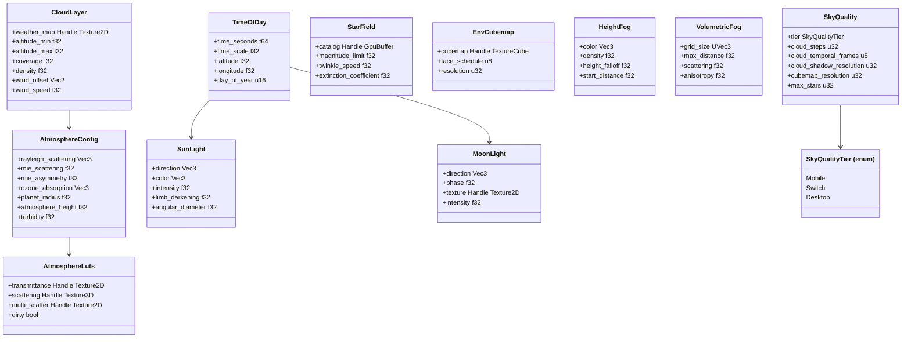

# World Geometry Design

Consolidated design covering the meshlet rendering pipeline, terrain heightfields and voxels,
foliage, water, and sky/atmosphere. These subsystems share GPU-driven instancing, page-based
streaming, and the shared spatial index.

## Requirements Trace

> **Canonical sources:** Features, requirements, and user stories are in
> [features/](../../features/), [requirements/](../../requirements/), and
> [user-stories/](../../user-stories/). Tables below trace design elements to those definitions.

### Meshlet Pipeline (F-3.1.1--7 / R-3.1.1--7)

| Feature | Requirement | User Stories |
|---------|-------------|--------------|
| F-3.1.1 | R-3.1.1     | US-3.1.1     |
| F-3.1.2 | R-3.1.2     | US-3.1.2     |
| F-3.1.3 | R-3.1.3     | US-3.1.3     |
| F-3.1.4 | R-3.1.4     | US-3.1.4     |
| F-3.1.5 | R-3.1.5     | US-3.1.5     |
| F-3.1.6 | R-3.1.6     | US-3.1.6     |
| F-3.1.7 | R-3.1.7     | US-3.1.7     |

1. **F-3.1.1** -- Meshlet decomposition and DAG hierarchy
2. **F-3.1.2** -- Two-phase GPU occlusion culling
3. **F-3.1.3** -- Cluster and triangle culling
4. **F-3.1.4** -- Mesh shader pipeline with indirect draw fallback
5. **F-3.1.5** -- Screen-space error LOD selection
6. **F-3.1.6** -- On-demand meshlet page streaming
7. **F-3.1.7** -- Visibility buffer rendering

### Heightfield Terrain (F-3.2.1--8 / R-3.2.1--8)

| Feature | Requirement | User Story            |
|---------|-------------|-----------------------|
| F-3.2.1 | R-3.2.1     | US-3.2.1              |
| F-3.2.2 | R-3.2.2     | US-3.2.2              |
| F-3.2.3 | R-3.2.3     | US-3.2.3              |
| F-3.2.4 | R-3.2.4     | US-3.2.4              |
| F-3.2.5 | R-3.2.5     | US-3.2.5              |
| F-3.2.6 | R-3.2.6     | US-3.2.6              |
| F-3.2.7 | R-3.2.7     | US-3.2.7              |
| F-3.2.8 | R-3.2.8     | US-3.2.8a, US-3.2.8b |

1. **F-3.2.1** -- Tile-based heightfield with 16/32-bit grids, async streaming, low-LOD fallbacks
2. **F-3.2.2** -- Virtual texture clipmap with GPU feedback
3. **F-3.2.3** -- CDLOD geometry clipmap with vertex morphing
4. **F-3.2.4** -- Per-tile 1-bit hole masks mirrored in collision
5. **F-3.2.5** -- Splatmap blending of up to 16 PBR layers
6. **F-3.2.6** -- Heightfield collision independent of visual LOD
7. **F-3.2.7** -- 64-bit world coordinates with camera-relative f32 rendering
8. **F-3.2.8** -- Portal-based indoor visibility

### Voxel Terrain (F-3.2.9--14 / R-3.2.9--14)

| Feature  | Requirement | User Story |
|----------|-------------|------------|
| F-3.2.9  | R-3.2.9     | US-3.2.9   |
| F-3.2.10 | R-3.2.10    | US-3.2.10  |
| F-3.2.11 | R-3.2.11    | US-3.2.11  |
| F-3.2.12 | R-3.2.12    | US-3.2.12  |
| F-3.2.13 | R-3.2.13    | US-3.2.13  |
| F-3.2.14 | R-3.2.14    | US-3.2.14  |

1. **F-3.2.9** -- Sparse octree SDF volume with material IDs
2. **F-3.2.10** -- Hybrid heightmap-voxel with auto selection
3. **F-3.2.11** -- Planetary-scale voxel sphere with radial gravity
4. **F-3.2.12** -- Meshing: Marching Cubes, Dual Contouring, Surface Nets, Transvoxel
5. **F-3.2.13** -- Runtime voxel editing with incremental re-mesh
6. **F-3.2.14** -- Voxel LOD streaming with RLE compression

### Foliage (F-3.3.1--7 / R-3.3.1--7)

| Feature | Requirement | User Story |
|---------|-------------|------------|
| F-3.3.1 | R-3.3.1     | US-3.3.1   |
| F-3.3.2 | R-3.3.2     | US-3.3.2   |
| F-3.3.3 | R-3.3.3     | US-3.3.3   |
| F-3.3.4 | R-3.3.4     | US-3.3.4   |
| F-3.3.5 | R-3.3.5     | US-3.3.5   |
| F-3.3.6 | R-3.3.6     | US-3.3.6   |
| F-3.3.7 | R-3.3.7     | US-3.3.7   |

1. **F-3.3.1** -- GPU-driven instanced foliage with compute culling
2. **F-3.3.2** -- Density map and rule-based procedural placement
3. **F-3.3.3** -- Billboard/impostor LOD with crossfade dithering
4. **F-3.3.4** -- GPU vertex shader wind animation from wind field
5. **F-3.3.5** -- Character-vegetation interaction displacement
6. **F-3.3.6** -- Procedural grass blade rendering via mesh shader
7. **F-3.3.7** -- Tree rendering with subsurface leaf transmission

### Water (F-3.4.1--7 / R-3.4.1--7)

| Feature | Requirement | User Story |
|---------|-------------|------------|
| F-3.4.1 | R-3.4.1     | US-3.4.1   |
| F-3.4.2 | R-3.4.2     | US-3.4.2   |
| F-3.4.3 | R-3.4.3     | US-3.4.3   |
| F-3.4.4 | R-3.4.4     | US-3.4.4   |
| F-3.4.5 | R-3.4.5     | US-3.4.5   |
| F-3.4.6 | R-3.4.6     | US-3.4.6   |
| F-3.4.7 | R-3.4.7     | US-3.4.7   |

1. **F-3.4.1** -- FFT ocean wave simulation with multiple cascades
2. **F-3.4.2** -- Shoreline depth-based blending with foam
3. **F-3.4.3** -- Underwater rendering with volume effects
4. **F-3.4.4** -- Water caustics projection onto seabed
5. **F-3.4.5** -- Fresnel-weighted reflection and refraction
6. **F-3.4.6** -- Flow map river simulation
7. **F-3.4.7** -- Dynamic foam from waves, shore, flow, wakes

### Sky/Atmosphere (F-3.5.1--7 / R-3.5.1--7)

| Feature | Requirement | User Story |
|---------|-------------|------------|
| F-3.5.1 | R-3.5.1     | US-3.5.1   |
| F-3.5.2 | R-3.5.2     | US-3.5.2   |
| F-3.5.3 | R-3.5.3     | US-3.5.3   |
| F-3.5.4 | R-3.5.4     | US-3.5.4   |
| F-3.5.5 | R-3.5.5     | US-3.5.5   |
| F-3.5.6 | R-3.5.6     | US-3.5.6   |
| F-3.5.7 | R-3.5.7     | US-3.5.7   |

1. **F-3.5.1** -- Procedural sky model (Preetham/Hosek-Wilkie)
2. **F-3.5.2** -- Multi-scattering atmosphere with aerial perspective
3. **F-3.5.3** -- Ray-marched volumetric clouds
4. **F-3.5.4** -- Cloud shadow map on terrain/foliage/water
5. **F-3.5.5** -- Dynamic time-of-day with astronomical arcs
6. **F-3.5.6** -- Celestial body rendering (sun, moon, stars)
7. **F-3.5.7** -- Environment cubemap capture for IBL

### Cross-Cutting Dependencies

| Dependency | Source | Consumed API |
|------------|--------|--------------|
| ECS world | F-1.1.1 | Component, Entity, Query |
| Spatial index | F-1.9.1 | Shared BVH frustum query |
| Render graph | F-2.2.1 | Pass registration |
| GPU abstraction | F-2.1.1 | Backend trait, pipelines |
| Scene pipeline | F-2.10.1 | Render proxy extraction |
| Asset processing | F-12.2.3 | Meshlet baking offline |
| Streaming I/O | F-12.5.2 | Tokio async I/O |
| Thread pool | F-14.3.1 | Scoped parallel tasks |
| Memory budgets | F-1.7.6 | MemoryBudget check/record |
| Scene transforms | F-1.2.4 | WorldPosition (64-bit) |
| Wind field | F-4.7.5 | Shared 3D wind texture |
| Physics buoyancy | F-4.8.5 | WaterSurface wave height |

---

## Overview

World geometry encompasses every static and semi-static visual element in the scene: meshes,
terrain, vegetation, water bodies, and the sky dome.

### Meshlet Pipeline

The meshlet pipeline is the geometry backbone. It replaces traditional draw-call submission with
GPU-driven clusters.

1. **Offline baking** decomposes meshes into ~64-vertex / ~124-triangle meshlets in a DAG hierarchy.
2. **GPU-driven culling** performs two-phase occlusion, frustum, backface-cone, and small-triangle
   rejection on the GPU.
3. **Hierarchical LOD** selects the coarsest DAG cut whose screen-space error is below a pixel
   threshold.
4. **Visibility buffer** writes a 64-bit triangle+instance ID per pixel, deferring material
   evaluation to a compute pass.
5. **Virtual geometry streaming** organizes meshlet data into fixed-size 64 KiB pages streamed via
   Tokio async I/O.

> **Precision model.** All meshlet GPU data (vertex positions, bounding spheres, error metrics, LOD
> thresholds) uses f32. WorldPosition (f64) is used only in the ECS transform system for large-world
> scene positioning. The camera-relative rendering transform converts f64 world positions to f32
> view-space before GPU submission. Meshlet vertex data is stored in object-space f32.

### Terrain

Two complementary representations -- heightfield tiles and sparse voxel volumes -- unified through a
hybrid resolver.

- **Heightfield** is the primary open-world surface. Tiles stream via async I/O; LOD via CDLOD
  clipmap; materials via virtual texture clipmap with GPU feedback.
- **Voxel** handles caves, overhangs, tunnels, and player edits. Sparse octree stores SDF + material
  IDs. Four meshing algorithms.
- **Hybrid mode** (default) uses heightmap for most of the world with voxel overlays for vertical
  complexity.
- **Planetary mode** wraps voxel terrain around a sphere with radial gravity.

### Environment Systems

Foliage, water, and sky/atmosphere render the natural world. All are ECS-primary (~90%) with
GPU-driven compute pipelines.

1. **GPU-driven.** Placement, culling, animation, and simulation run as HLSL compute shaders.
2. **Shared data.** Foliage reads the wind field (F-4.7.5). Water exposes wave heights for buoyancy
   (F-4.8.5). Sky provides the environment cubemap for IBL.
3. **Tiered scaling.** Every GPU workload has per-platform quality tiers (mobile, Switch, desktop)
   via config components.
4. **Temporal amortization.** Expensive operations spread across frames via temporal reprojection or
   round-robin scheduling.

### Performance Targets

| Metric | Target |
|--------|--------|
| Meshlet cull (100K inst) | < 1 ms GPU |
| Mesh shader raster (1M) | < 4 ms GPU |
| Material eval (1080p) | < 2 ms GPU |
| Foliage instances (desktop) | 1M+ visible |
| Ocean FFT 3-cascade (desktop) | < 1 ms GPU |
| Cloud ray march (half-res) | < 3 ms GPU |
| Atmosphere LUT rebuild | < 2 ms GPU |
| Tile decode (257x257 LZ4) | < 1 ms CPU |
| Voxel mesh 16^3 (CPU) | < 5 ms CPU |

---

## Architecture

### Module Boundaries



### File Layout

```text
harmonius_geometry/
├── meshlet/
│   ├── generator.rs    # MeshletGenerator
│   ├── dag.rs          # MeshletDAG hierarchy
│   ├── baker.rs        # Offline bake orchestrator
│   ├── streamer.rs     # Page-based streaming
│   ├── culler.rs       # GPU-driven culling
│   ├── visibility.rs   # 64-bit visibility buffer
│   ├── lod.rs          # Screen-space error LOD
│   ├── page.rs         # Page packing/management
│   ├── bounds.rs       # BoundingSphere, NormalCone
│   └── data.rs         # Core data structures
├── terrain/
│   ├── config.rs       # TerrainConfig, enums
│   ├── tile.rs         # HeightfieldTile
│   ├── voxel.rs        # VoxelVolume, SparseOctree
│   ├── hybrid.rs       # HybridResolver
│   ├── clipmap.rs      # ClipmapLod, ClipmapRing
│   ├── virtual_tex.rs  # VirtualTextureAtlas
│   ├── splatmap.rs     # SplatmapBlender
│   ├── hole.rs         # HoleMask
│   ├── collision.rs    # HeightfieldCollider
│   ├── streamer.rs     # TerrainStreamer
│   ├── mesher.rs       # VoxelMesher algorithms
│   ├── editor.rs       # VoxelEditor, SdfBrush
│   ├── planet.rs       # PlanetSphere
│   ├── query.rs        # TerrainQuery trait
│   ├── components.rs   # All ECS components
│   ├── systems.rs      # All ECS systems
│   └── error.rs        # TerrainError
└── environment/
    ├── foliage/
    │   ├── placement.rs    # FoliagePlacement
    │   ├── cull.rs         # FoliageCull
    │   ├── wind.rs         # FoliageWind
    │   ├── interaction.rs  # InteractionBuffer
    │   ├── grass.rs        # GrassGeneration
    │   ├── tree.rs         # TreeRender
    │   └── components.rs   # Foliage ECS types
    ├── water/
    │   ├── ocean.rs        # OceanSpectrum, FFT
    │   ├── render.rs       # WaterRender
    │   ├── shoreline.rs    # ShorelineBlend
    │   ├── underwater.rs   # UnderwaterSystem
    │   ├── caustics.rs     # CausticsSystem
    │   ├── foam.rs         # WaterFoam
    │   ├── river.rs        # RiverFlow
    │   └── components.rs   # Water ECS types
    └── sky/
        ├── procedural.rs   # ProceduralSky
        ├── atmosphere.rs   # AtmosphereLut
        ├── clouds.rs       # VolumetricCloud
        ├── shadow.rs       # CloudShadow
        ├── time_of_day.rs  # TimeOfDay
        ├── celestial.rs    # CelestialBody
        ├── cubemap.rs      # EnvCubemap
        └── components.rs   # Sky ECS types
```

### Meshlet Offline Baking Pipeline


| Stage | Module | Description |
|-------|--------|-------------|
| Simplify | meshoptimizer FFI | Edge-collapse per LOD |
| LOD Chain | generator.rs | LOD0..N at ratios |
| Partition | generator.rs | Cluster into meshlets |
| Bounds | bounds.rs | Sphere, cone, error |
| DAG Build | dag.rs | Link LOD DAG nodes |
| Cache Opt | meshoptimizer FFI | Vertex cache optimize |
| Page Pack | page.rs | Pack into 64 KiB pages |
| Archive | Content pipeline | Write compressed Zstd |

### GPU-Driven Culling and Rendering



### Terrain ECS System Schedule



### Environment Frame Execution



### Hybrid Heightmap-Voxel Decision



---

## Data Structures

All types derive `Reflect`. No `Arc`, `Rc`, `Cell`, or `RefCell`.

### Meshlet Types



### Terrain Types

```mermaid
classDiagram
    class TerrainConfig {
        +mode TerrainMode
        +tile_resolution u32
        +tile_world_size f32
        +height_format HeightFormat
        +max_material_layers u8
        +clipmap_ring_count u8
        +stream_radius_tiles u32
        +collision_lod_bias i8
        +voxel_resolution f32
        +meshing_algorithm MeshingAlgorithm
        +max_edits_per_frame u32
        +planet_radius Option f64
    }
    class TerrainTile {
        +coord TileCoord
        +heights Vec of u16
        +resolution u32
        +min_height f32
        +max_height f32
        +aabb Aabb
    }
    class TerrainMaterial {
        +splatmap_weights Vec of u8
        +layer_indices Vec of u8
        +layer_count u8
    }
    class TerrainHole {
        +mask Vec of u8
        +resolution u32
    }
    class TerrainLod {
        +ring u8
        +morph_factor f32
        +screen_error f32
    }
    class TerrainCollision {
        +lod u8
        +bvh_handle BvhHandle
    }
    class VoxelChunk {
        +coord ChunkCoord
        +sdf Vec of u16
        +materials Vec of u8
        +resolution u32
        +is_dirty bool
        +aabb Aabb
    }
    class VoxelMesh {
        +vertices Vec of VoxelVertex
        +indices Vec of u32
        +meshlet_handle Option Handle
    }
    class VoxelVertex {
        +position vec3
        +normal u32
        +material_weights u8x4
        +material_indices u8x4
    }
    class TileCoord {
        +x i32
        +y i32
    }
    class ChunkCoord {
        +x i32
        +y i32
        +z i32
    }
    class WorldPosition {
        +x f64
        +y f64
        +z f64
    }
    class ClipmapRing {
        +ring_index u8
        +vertex_spacing f32
        +inner_radius f32
        +outer_radius f32
        +morph_zone_width f32
    }
    class VirtualTextureAtlas {
        +atlas_size u32
        +page_size u32
        +mip_levels u8
    }
    class MaterialLayer {
        +palette_index u8
        +albedo Handle
        +normal Handle
        +orm Handle
        +height Handle
        +tiling f32
    }
    class SdfEdit {
        +center vec3
        +radius f32
        +falloff f32
        +op SdfBrushOp
        +strength f32
        +material_id u8
    }
    class EditDelta {
        +chunk ChunkCoord
        +cells Vec of u16
        +old_sdf Vec of u16
        +new_sdf Vec of u16
    }
    class SphericalCoord {
        +latitude f64
        +longitude f64
        +altitude f64
    }
    class TerrainBudget {
        +heightfield_budget MemoryBudget
        +voxel_budget MemoryBudget
        +virtual_texture_budget MemoryBudget
    }
    class TerrainMode["TerrainMode (enum)"] {
        HeightfieldOnly
        VoxelOnly
        Hybrid
        Planetary
    }
    class HeightFormat["HeightFormat (enum)"] {
        U16
        F32
    }
    class MeshingAlgorithm["MeshingAlgorithm (enum)"] {
        MarchingCubes
        DualContouring
        SurfaceNets
        Transvoxel
    }
    class RepresentationTag["RepresentationTag (enum)"] {
        Heightfield
        Voxel
        Boundary
    }
    class TileResidencyState["TileResidencyState (enum)"] {
        Evicted
        Loading
        Resident
        PendingEvict
    }
    class SdfBrushOp["SdfBrushOp (enum)"] {
        Add
        Subtract
        Smooth
        Flatten
        Paint
    }
    class OctreeNode["OctreeNode (enum)"] {
        Leaf
        Interior
        Homogeneous
    }
    class CubeFace["CubeFace (enum)"] {
        PosX NegX
        PosY NegY
        PosZ NegZ
    }
    class TerrainError["TerrainError (enum)"] {
        TileNotLoaded
        ChunkNotLoaded
        IoError
        BudgetExceeded
        EditRejected
        MeshingFailed
    }
    TerrainConfig --> TerrainMode
    TerrainConfig --> HeightFormat
    TerrainConfig --> MeshingAlgorithm
    TerrainTile --> TileCoord
    TerrainTile --> TerrainMaterial
    TerrainTile --> TerrainHole
    TerrainTile --> TerrainLod
    TerrainTile --> TerrainCollision
    VoxelChunk --> ChunkCoord
    VoxelChunk --> VoxelMesh
    VoxelMesh --> VoxelVertex
    SdfEdit --> SdfBrushOp
    EditDelta --> ChunkCoord
```



### Foliage Types



### Water Types



### Sky/Atmosphere Types



---

## API Design

### Meshlet Core Types

```rust
pub const MAX_MESHLET_VERTICES: u8 = 64;
pub const MAX_MESHLET_TRIANGLES: u8 = 124;
pub const MESHLET_PAGE_SIZE: u32 = 65536;

#[derive(Clone, Copy, Debug, Reflect)]
#[repr(C)]
pub struct Meshlet {
    pub vertex_offset: u32,
    pub vertex_count: u8,
    pub triangle_offset: u32,
    pub triangle_count: u8,
    pub bounding_sphere: BoundingSphere,
    pub normal_cone: NormalCone,
    pub lod_error: f32,
}

#[derive(Clone, Copy, Debug, Reflect)]
#[repr(C)]
pub struct BoundingSphere {
    pub center: [f32; 3],
    pub radius: f32,
}

#[derive(Clone, Copy, Debug, Reflect)]
#[repr(C)]
pub struct NormalCone {
    pub axis: [f32; 3],
    pub cutoff: f32,
}

#[derive(Clone, Copy, Debug, Reflect)]
pub struct MeshletDAGNode {
    pub group_start: u32,
    pub group_count: u32,
    pub children_start: u32,
    pub children_count: u32,
    pub parent_error: f32,
    pub bounding_sphere: BoundingSphere,
}

#[derive(Clone, Debug, Reflect)]
pub struct MeshletPage {
    pub page_id: u32,
    pub vertex_data_offset: u64,
    pub index_data_offset: u64,
    pub meshlet_count: u32,
    pub compressed_size: u32,
    pub uncompressed_size: u32,
}

#[derive(Clone, Debug, Reflect)]
pub struct MeshletMesh {
    pub mesh_id: MeshId,
    pub meshlets: Vec<Meshlet>,
    pub dag_nodes: Vec<MeshletDAGNode>,
    pub root_node_index: u32,
    pub pages: Vec<MeshletPage>,
    pub vertex_data: Vec<u8>,
    pub index_data: Vec<u8>,
    pub total_meshlet_count: u32,
}
```

### Meshlet ECS and GPU Types

```rust
#[derive(Clone, Debug, Component, Reflect)]
pub struct MeshletMeshComponent {
    pub mesh: AssetHandle<MeshletMesh>,
    pub error_threshold: Option<f32>,
    pub visible: bool,
}

#[derive(Clone, Copy, Debug, Reflect)]
#[repr(C)]
pub struct GpuMeshletInstance {
    pub world_transform: [f32; 12],
    pub world_bounds: BoundingSphere,
    pub mesh_index: u32,
    pub dag_root: u32,
    pub error_scale: f32,
    pub dither_seed: u32,
}

#[derive(Clone, Copy, Debug, Reflect)]
#[repr(C)]
pub struct VisBufferEntry {
    pub instance_id: u32,
    pub triangle_id: u32,
}
```

### Meshlet Generator and Baker

```rust
pub struct MeshletGeneratorConfig {
    pub max_vertices: u8,
    pub max_triangles: u8,
    pub lod_ratios: Vec<f32>,
    pub max_simplification_error: f32,
    pub page_size: u32,
}

pub struct MeshletGenerator;
impl MeshletGenerator {
    pub fn new(
        config: MeshletGeneratorConfig,
    ) -> Self;
    pub fn generate(
        &self,
        vertices: &[Vertex],
        indices: &[u32],
    ) -> Result<MeshletMesh, MeshletError>;
}

pub struct MeshletBaker;
impl MeshletBaker {
    pub fn bake(
        &self,
        pool: &ThreadPool,
        vertices: &[Vertex],
        indices: &[u32],
    ) -> Result<BakeResult, MeshletError>;
}

#[derive(Clone, Debug, Reflect)]
pub struct BakeStats {
    pub source_triangles: u32,
    pub total_meshlets: u32,
    pub lod_levels: u32,
    pub dag_nodes: u32,
    pub page_count: u32,
    pub compressed_bytes: u64,
    pub duration_ms: f64,
}
```

### Meshlet Culling and Streaming

```rust
pub struct CullerConfig {
    pub max_instances: u32,
    pub max_meshlets: u32,
    pub hzb_divisor: u32,
    pub enable_phase_two: bool,
    pub lod_pixel_threshold: f32,
    pub use_mesh_shaders: bool,
}

pub struct MeshletCuller;
impl MeshletCuller {
    pub fn new<B: GpuBackend>(
        device: &B::Device,
        config: CullerConfig,
    ) -> Self;
    pub fn register_passes<B: GpuBackend>(
        &self,
        graph: &mut RenderGraphBuilder,
    );
    pub fn read_stats(&self) -> CullStats;
}

#[derive(Clone, Copy, Debug, Reflect)]
pub enum PageState {
    NotResident,
    Loading,
    Resident,
    PendingEviction,
}

pub struct StreamerConfig {
    pub max_resident_pages: u32,
    pub max_in_flight_io: u32,
    pub screen_size_weight: f32,
    pub distance_weight: f32,
}

pub struct MeshletStreamer;
impl MeshletStreamer {
    pub fn new(config: StreamerConfig) -> Self;
    pub fn process_feedback(
        &mut self,
        feedback: &[u32],
    ) -> Vec<PageRequest>;
    pub async fn request_pages(
        &mut self,
        requests: &[PageRequest],
    ) -> Vec<Result<PageLoadResult, IoError>>;
    pub fn evict_pages(
        &mut self,
        count: u32,
    ) -> Vec<u32>;
}
```

### Meshlet Readback Ring

```rust
#[derive(Debug, Reflect)]
pub struct ReadbackSlot {
    pub buffer: GpuBuffer,
    pub fence: GpuFence,
    pub source_frame: u64,
    pub mapped: bool,
}

pub struct ReadbackRing {
    pub slots: [ReadbackSlot; 3],
    pub write_index: usize,
}

#[derive(Clone, Copy, Debug, Reflect)]
pub enum ReadbackStatus {
    Current,
    Stale { frames_behind: u32 },
    ForcedSync,
    Reset,
}

impl ReadbackRing {
    pub fn poll_read_slot(
        &self,
    ) -> (usize, ReadbackStatus);
    pub fn force_sync(&mut self);
    pub fn reset(&mut self);
    pub fn advance(&mut self);
}
```

### Meshlet Errors

```rust
#[derive(Clone, Debug, Reflect)]
pub enum MeshletError {
    EmptyMesh,
    DegenerateGeometry { triangle_index: u32 },
    SimplificationFailed {
        lod_level: u32,
        target_ratio: f32,
        achieved_ratio: f32,
    },
    DisconnectedHierarchy { orphan_count: u32 },
    TooManyPages { page_count: u32, limit: u32 },
    GpuAllocationFailed {
        buffer_name: &'static str,
        requested_bytes: u64,
    },
}
```

### Terrain Configuration

```rust
#[derive(Clone, Copy, Debug, Reflect)]
pub enum HeightFormat { U16, F32 }

#[derive(Clone, Copy, Debug, Reflect)]
pub enum MeshingAlgorithm {
    MarchingCubes,
    DualContouring,
    SurfaceNets,
    Transvoxel,
}

#[derive(Clone, Copy, Debug, Reflect)]
pub enum TerrainMode {
    HeightfieldOnly,
    VoxelOnly,
    Hybrid,
    Planetary,
}

#[derive(Clone, Debug, Resource, Reflect)]
pub struct TerrainConfig {
    pub mode: TerrainMode,
    pub tile_resolution: u32,
    pub tile_world_size: f32,
    pub height_format: HeightFormat,
    pub max_material_layers: u8,
    pub clipmap_ring_count: u8,
    pub stream_radius_tiles: u32,
    pub collision_lod_bias: i8,
    pub voxel_resolution: f32,
    pub meshing_algorithm: MeshingAlgorithm,
    pub max_edits_per_frame: u32,
    pub planet_radius: Option<f64>,
}
```

### Terrain Coordinates

```rust
#[derive(
    Clone, Copy, Debug, PartialEq, Eq,
    Hash, Reflect,
)]
pub struct TileCoord { pub x: i32, pub y: i32 }

#[derive(
    Clone, Copy, Debug, PartialEq, Eq,
    Hash, Reflect,
)]
pub struct ChunkCoord {
    pub x: i32,
    pub y: i32,
    pub z: i32,
}

#[derive(Clone, Copy, Debug, Reflect)]
pub struct WorldPosition {
    pub x: f64,
    pub y: f64,
    pub z: f64,
}

impl WorldPosition {
    pub fn to_camera_relative(
        &self,
        camera: &WorldPosition,
    ) -> [f32; 3];
}
```

### Terrain ECS Components

```rust
#[derive(Component, Reflect)]
pub struct TerrainTile {
    pub coord: TileCoord,
    pub heights: Vec<u16>,
    pub resolution: u32,
    pub min_height: f32,
    pub max_height: f32,
    pub aabb: Aabb,
}

#[derive(Component, Reflect)]
pub struct TerrainMaterial {
    pub splatmap_weights: Vec<u8>,
    pub layer_indices: Vec<u8>,
    pub layer_count: u8,
}

#[derive(Component, Reflect)]
pub struct TerrainHole {
    pub mask: Vec<u8>,
    pub resolution: u32,
}

#[derive(Component, Reflect)]
pub struct TerrainLod {
    pub ring: u8,
    pub morph_factor: f32,
    pub screen_error: f32,
}

#[derive(Component, Reflect)]
pub struct TerrainCollision {
    pub lod: u8,
    pub bvh_handle: BvhHandle,
}

#[derive(Component, Reflect)]
pub struct VoxelChunk {
    pub coord: ChunkCoord,
    pub sdf: Vec<u16>,
    pub materials: Vec<u8>,
    pub resolution: u32,
    pub is_dirty: bool,
    pub aabb: Aabb,
}

#[derive(Reflect)]
pub struct VoxelMesh {
    pub vertices: Vec<VoxelVertex>,
    pub indices: Vec<u32>,
    pub meshlet_handle: Option<Handle<MeshletData>>,
}

#[derive(Clone, Copy, Debug, Reflect)]
#[repr(C)]
pub struct VoxelVertex {
    pub position: [f32; 3],
    pub normal: u32,
    pub material_weights: [u8; 4],
    pub material_indices: [u8; 4],
}

#[derive(Clone, Copy, Debug, Reflect)]
pub enum RepresentationTag {
    Heightfield,
    Voxel,
    Boundary,
}
```

### Terrain Streaming and LOD

```rust
#[derive(Clone, Copy, Debug, Reflect)]
pub enum TileResidencyState {
    Evicted,
    Loading,
    Resident,
    PendingEvict,
}

pub struct ClipmapRing {
    pub ring_index: u8,
    pub vertex_spacing: f32,
    pub inner_radius: f32,
    pub outer_radius: f32,
    pub morph_zone_width: f32,
}

pub struct ClipmapLod;
impl ClipmapLod {
    pub fn new(config: &ClipmapConfig) -> Self;
    pub fn update(
        &self,
        camera_pos: WorldPosition,
        fov_y: f32,
        viewport_height: u32,
        tiles: &[(TileCoord, Aabb)],
    ) -> Vec<(TileCoord, TerrainLod)>;
    pub fn morph_factor(
        &self,
        ring: &ClipmapRing,
        distance: f32,
    ) -> f32;
}

pub struct ResidencyManager;
impl ResidencyManager {
    pub fn compute_desired(
        &mut self,
        camera_tile: TileCoord,
    ) -> ResidencyDelta;
    pub fn mark_resident(
        &mut self,
        coord: TileCoord,
    );
}

pub struct TerrainStreamer;
impl TerrainStreamer {
    pub async fn update(
        &mut self,
        camera_pos: WorldPosition,
        config: &TerrainConfig,
        budget: &TerrainBudget,
    ) -> Vec<LoadedTile>;
    pub fn cancel_all(&mut self);
}
```

### Terrain Virtual Texture and Collision

```rust
pub struct VirtualTextureAtlas;
impl VirtualTextureAtlas {
    pub fn allocate_page(
        &mut self,
        page_id: VirtualPageId,
    ) -> Result<PhysicalSlot, VirtualTextureError>;
    pub fn release_page(
        &mut self,
        page_id: VirtualPageId,
    );
    pub fn resolve(
        &self,
        page_id: VirtualPageId,
    ) -> Option<PhysicalSlot>;
}

pub struct HeightfieldCollider;
impl HeightfieldCollider {
    pub fn from_tile(
        tile: &TerrainTile,
        hole: Option<&TerrainHole>,
        lod: u8,
    ) -> Self;
    pub fn ray_cast(
        &self,
        origin: [f32; 3],
        direction: [f32; 3],
        max_distance: f32,
    ) -> Option<RayHit>;
}

pub struct VoxelMeshCollider;
impl VoxelMeshCollider {
    pub fn from_mesh(mesh: &VoxelMesh) -> Self;
    pub fn ray_cast(
        &self,
        origin: [f32; 3],
        direction: [f32; 3],
        max_distance: f32,
    ) -> Option<RayHit>;
}
```

### Voxel Volume and Editing

```rust
#[derive(Clone, Copy, Debug, Reflect)]
pub enum SdfBrushOp {
    Add,
    Subtract,
    Smooth,
    Flatten,
    Paint,
}

#[derive(Clone, Debug, Reflect)]
pub struct SdfEdit {
    pub center: [f32; 3],
    pub radius: f32,
    pub falloff: f32,
    pub op: SdfBrushOp,
    pub strength: f32,
    pub material_id: u8,
    pub flatten_height: Option<f32>,
}

#[derive(Clone, Debug, Reflect)]
pub struct EditDelta {
    pub chunk: ChunkCoord,
    pub cells: Vec<u16>,
    pub old_sdf: Vec<u16>,
    pub new_sdf: Vec<u16>,
    pub old_materials: Vec<u8>,
    pub new_materials: Vec<u8>,
}

pub struct VoxelEditor;
impl VoxelEditor {
    pub fn queue_edit(&mut self, edit: SdfEdit);
    pub fn flush(
        &mut self,
        volume: &mut VoxelVolume,
    ) -> (Vec<EditDelta>, Vec<ChunkCoord>);
}

pub struct VoxelMesher;
impl VoxelMesher {
    pub fn mesh_cpu(
        &self,
        input: &MeshInput,
    ) -> MeshOutput;
    pub async fn mesh_gpu(
        &self,
        input: &MeshInput,
    ) -> MeshOutput;
}
```

### Planetary Sphere

```rust
#[derive(Clone, Copy, Debug, Reflect)]
pub enum CubeFace {
    PosX, NegX, PosY, NegY, PosZ, NegZ,
}

#[derive(Clone, Copy, Debug, Reflect)]
pub struct SphericalCoord {
    pub latitude: f64,
    pub longitude: f64,
    pub altitude: f64,
}

pub struct PlanetSphere;
impl PlanetSphere {
    pub fn to_spherical(
        &self,
        world_pos: &WorldPosition,
    ) -> SphericalCoord;
    pub fn to_world(
        &self,
        coord: &SphericalCoord,
    ) -> WorldPosition;
    pub fn gravity_at(
        &self,
        world_pos: &WorldPosition,
    ) -> [f32; 3];
}
```

### Terrain Query Trait

```rust
pub trait TerrainQuery {
    fn height_at(
        &self, world_x: f64, world_z: f64,
    ) -> Option<f32>;
    fn material_at(
        &self, world_x: f64, world_z: f64,
    ) -> Option<u8>;
    fn normal_at(
        &self, world_x: f64, world_z: f64,
    ) -> Option<[f32; 3]>;
    fn is_hole(
        &self, world_x: f64, world_z: f64,
    ) -> bool;
    fn ray_cast(
        &self,
        origin: [f32; 3],
        direction: [f32; 3],
        max_distance: f32,
    ) -> Option<RayHit>;
}
```

### Terrain Errors

```rust
#[derive(Clone, Debug, Reflect)]
pub enum TerrainError {
    TileNotLoaded { coord: TileCoord },
    ChunkNotLoaded { coord: ChunkCoord },
    IoError(IoError),
    BudgetExceeded {
        subsystem: &'static str,
        budget_bytes: usize,
        requested_bytes: usize,
    },
    InvalidTileData {
        coord: TileCoord,
        reason: &'static str,
    },
    EditRejected {
        coord: ChunkCoord,
        reason: &'static str,
    },
    VirtualTextureExhausted,
    MeshingFailed {
        chunk: ChunkCoord,
        algorithm: MeshingAlgorithm,
    },
}
```

### Foliage Components

```rust
#[derive(
    Clone, Copy, Debug, PartialEq, Eq,
    Hash, Reflect,
)]
pub struct FoliageSpeciesId(pub u32);

#[derive(Clone, Copy, Debug, Reflect)]
pub struct RangeF32 {
    pub min: f32,
    pub max: f32,
}

#[derive(Component, Reflect)]
pub struct FoliageBiome {
    pub species: Vec<FoliageSpeciesId>,
    pub density_map: Handle<Texture2D>,
    pub slope_range: RangeF32,
    pub altitude_range: RangeF32,
}

#[derive(Reflect)]
pub struct FoliageSpecies {
    pub mesh_lods: Vec<Handle<Mesh>>,
    pub impostor_atlas: Handle<Texture2DArray>,
    pub lod_distances: Vec<f32>,
    pub wind_response: WindResponseCurve,
    pub crossfade_width: f32,
}

#[derive(Clone, Copy, Debug, Reflect)]
pub struct WindResponseCurve {
    pub trunk_amplitude: f32,
    pub trunk_frequency: f32,
    pub branch_amplitude: f32,
    pub branch_frequency: f32,
    pub leaf_amplitude: f32,
    pub leaf_frequency: f32,
}

#[derive(Component, Reflect)]
pub struct FoliageCluster {
    pub tile_coord: IVec2,
    pub instance_buffer: Handle<GpuBuffer>,
    pub instance_count: u32,
    pub aabb: Aabb,
}

#[derive(Component, Reflect)]
pub struct InteractionBuffer {
    pub texture: Handle<Texture2D>,
    pub world_center: Vec3,
    pub world_extent: f32,
    pub decay_rate: f32,
}

#[derive(Component, Reflect)]
pub struct GrassConfig {
    pub blade_density: f32,
    pub blade_height_range: RangeF32,
    pub blade_width: f32,
    pub color_variation: f32,
    pub render_distance: f32,
}

#[derive(Component, Reflect)]
pub struct TreeSpecies {
    pub bark_material: Handle<Material>,
    pub leaf_material: Handle<Material>,
    pub wind_skeleton: Vec<u32>,
    pub leaf_transmission: f32,
}

#[derive(Clone, Copy, Debug, Reflect)]
pub enum FoliageQualityTier {
    Mobile,
    Switch,
    Desktop,
}

#[derive(Resource, Reflect)]
pub struct FoliageQuality {
    pub tier: FoliageQualityTier,
    pub density_scale: f32,
    pub max_instances: u32,
    pub wind_layers: u8,
    pub max_grass_blades: u32,
    pub interaction_resolution: u32,
    pub impostor_resolution: u32,
}
```

### Water Components

```rust
#[derive(Clone, Copy, Debug, Reflect)]
pub enum SpectrumType { Phillips, Jonswap, Tma }

#[derive(Component, Reflect)]
pub struct OceanBody {
    pub spectrum: SpectrumType,
    pub cascade_count: u8,
    pub fft_resolution: u32,
    pub wind_direction: Vec2,
    pub wind_speed: f32,
    pub choppiness: f32,
    pub gerstner_waves: Vec<GerstnerWave>,
}

#[derive(Clone, Copy, Debug, Reflect)]
pub struct GerstnerWave {
    pub direction: Vec2,
    pub amplitude: f32,
    pub wavelength: f32,
    pub speed: f32,
    pub steepness: f32,
}

#[derive(Component, Reflect)]
pub struct WaterSurface {
    pub displacement_map: Handle<Texture2D>,
    pub normal_map: Handle<Texture2D>,
    pub fold_map: Handle<Texture2D>,
}

#[derive(Component, Reflect)]
pub struct RiverSegment {
    pub flow_map: Handle<Texture2D>,
    pub spline_points: Vec<Vec3>,
    pub width: f32,
    pub flow_speed: f32,
    pub foam: FoamConfig,
}

#[derive(Component, Reflect)]
pub struct UnderwaterVolume {
    pub absorption_color: Vec3,
    pub fog_density: f32,
    pub caustic_intensity: f32,
    pub god_ray_intensity: f32,
}

#[derive(Clone, Copy, Debug, Reflect)]
pub struct FoamConfig {
    pub lifetime: f32,
    pub shoreline_width: f32,
    pub whitecap_threshold: f32,
    pub wake_strength: f32,
}

#[derive(Component, Reflect)]
pub struct WaterReflection {
    pub ssr_enabled: bool,
    pub env_cubemap: Handle<TextureCube>,
    pub planar_enabled: bool,
    pub planar_resolution_scale: f32,
}

#[derive(Clone, Copy, Debug, Reflect)]
pub enum ReflectionMode {
    CubemapOnly,
    Ssr,
    SsrPlanar,
}

#[derive(Resource, Reflect)]
pub struct WaterQuality {
    pub tier: WaterQualityTier,
    pub fft_resolution: u32,
    pub max_cascades: u8,
    pub reflection_mode: ReflectionMode,
    pub foam_resolution: u32,
    pub god_rays_enabled: bool,
    pub realtime_caustics: bool,
}
```

### Sky/Atmosphere Components

```rust
#[derive(Component, Reflect)]
pub struct AtmosphereConfig {
    pub rayleigh_scattering: Vec3,
    pub mie_scattering: f32,
    pub mie_asymmetry: f32,
    pub ozone_absorption: Vec3,
    pub planet_radius: f32,
    pub atmosphere_height: f32,
    pub turbidity: f32,
}

#[derive(Component, Reflect)]
pub struct AtmosphereLuts {
    pub transmittance: Handle<Texture2D>,
    pub scattering: Handle<Texture3D>,
    pub multi_scatter: Handle<Texture2D>,
    pub dirty: bool,
}

#[derive(Component, Reflect)]
pub struct TimeOfDay {
    pub time_seconds: f64,
    pub time_scale: f32,
    pub latitude: f32,
    pub longitude: f32,
    pub day_of_year: u16,
}

#[derive(Component, Reflect)]
pub struct SunLight {
    pub direction: Vec3,
    pub color: Vec3,
    pub intensity: f32,
    pub limb_darkening: f32,
    pub angular_diameter: f32,
}

#[derive(Component, Reflect)]
pub struct MoonLight {
    pub direction: Vec3,
    pub phase: f32,
    pub texture: Handle<Texture2D>,
    pub intensity: f32,
}

#[derive(Component, Reflect)]
pub struct CloudLayer {
    pub weather_map: Handle<Texture2D>,
    pub altitude_min: f32,
    pub altitude_max: f32,
    pub coverage: f32,
    pub density: f32,
    pub wind_offset: Vec2,
    pub wind_speed: f32,
}

#[derive(Component, Reflect)]
pub struct StarField {
    pub catalog: Handle<GpuBuffer>,
    pub magnitude_limit: f32,
    pub twinkle_speed: f32,
    pub extinction_coefficient: f32,
}

#[derive(Component, Reflect)]
pub struct EnvCubemap {
    pub cubemap: Handle<TextureCube>,
    pub face_schedule: u8,
    pub resolution: u32,
}

#[derive(Component, Reflect)]
pub struct HeightFog {
    pub color: Vec3,
    pub density: f32,
    pub height_falloff: f32,
    pub start_distance: f32,
}

#[derive(Component, Reflect)]
pub struct VolumetricFog {
    pub grid_size: UVec3,
    pub max_distance: f32,
    pub scattering: f32,
    pub anisotropy: f32,
}

#[derive(Clone, Copy, Debug, Reflect)]
pub enum SkyQualityTier {
    Mobile,
    Switch,
    Desktop,
}

#[derive(Resource, Reflect)]
pub struct SkyQuality {
    pub tier: SkyQualityTier,
    pub cloud_steps: u32,
    pub cloud_temporal_frames: u8,
    pub cloud_shadow_resolution: u32,
    pub froxel_depth_slices: u32,
    pub lut_resolution: UVec2,
    pub cubemap_resolution: u32,
    pub cubemap_update_interval: u8,
    pub max_stars: u32,
    pub twinkling_enabled: bool,
}
```

---

## Data Flow

### Per-Frame Meshlet Rendering

1. **Extract** -- Scene pipeline extracts visible entities with `MeshletMeshComponent` into
   `GpuMeshletInstance` arrays.
2. **Upload** -- Instance data written to GPU via copy queue.
3. **Coarse Instance Cull (CPU)** -- BVH frustum query eliminates entire instances whose bounding
   volumes fall outside the view frustum before any GPU work is issued.
4. **Phase 1 Occlusion Cull** -- Compute tests surviving instances against previous frame's HZB.
   Passing instances marked visible.
5. **HZB Build** -- Survivors rasterized (depth only), mip chain built via min-reduction.
6. **Phase 2 Occlusion Retest** -- Occluded instances retested against updated HZB. Together with
   Phase 1 this forms the two-phase occlusion culling with HZB.
7. **HLOD DAG Traversal** -- Task shader traverses the DAG hierarchy top-down. For each node the
   bounding sphere is tested against frustum and HZB; entire branches are pruned when a parent group
   is outside the frustum or fully occluded. The coarsest cut whose screen-space error is below the
   pixel threshold is selected.
8. **Cluster Cull** -- Per-meshlet frustum culling and backface-cone culling applied to each
   surviving meshlet cluster.
9. **Rasterize** -- Mesh shader (or indirect draw fallback) emits surviving triangles.
10. **Visibility Buffer Write** -- Fragment shader atomically writes 64-bit entry per pixel.
11. **Material Eval** -- Fullscreen compute reads visibility buffer, evaluates materials into
    G-buffer.

### Hierarchical Culling

The meshlet pipeline applies four culling stages in order, from coarsest to finest:

1. **Coarse instance-level frustum culling** -- BVH query on CPU rejects instances outside the
   frustum before GPU dispatch.
2. **DAG traversal for HLOD selection** -- The meshlet DAG hierarchy is traversed top-down, pruning
   entire branches when a parent group's bounding sphere is outside the frustum or fully occluded.
3. **Cluster-level frustum and backface-cone culling** -- Each surviving meshlet is tested
   individually.
4. **Two-phase occlusion culling with HZB** -- Phase 1 tests against the previous frame's HZB; Phase
   2 retests against the current frame's updated HZB.

### Meshlet Streaming Feedback Loop

1. **Feedback** -- Compute records page IDs of visible meshlets.
2. **Readback** -- Feedback buffer read back one frame later.
3. **Prioritize** -- Streamer scores pages by screen-space contribution and distance.
4. **I/O Request** -- Highest-priority pages submitted via Tokio.
5. **Poll** -- Tokio runtime drains completed I/O futures.
6. **Decompress** -- Zstd decompression on worker thread.
7. **Upload** -- Pages uploaded to GPU via transfer queue.
8. **Update** -- Page table updated; next frame sees residency.

### Terrain Frame Lifecycle

1. **PreUpdate** -- Capture camera position and tool inputs.
2. **Update** -- Stream tiles and voxel nodes via async I/O.
3. **Update** -- Apply voxel edits (throttled per frame).
4. **PostUpdate** -- Recompute clipmap rings and morph factors.
5. **PostUpdate** -- Re-mesh dirty voxel chunks (parallel).
6. **PostUpdate** -- Update collision, register in shared BVH.
7. **PostUpdate** -- Virtual texture feedback readback and page upload.

### Foliage Lifecycle

1. **Tile loads** -- `FoliageBiome` attached to tile entities.
2. **Placement** -- Compute shader generates instances from density map, slope/altitude rules, and
   species list.
3. **Spatial registration** -- Cluster AABB registered in BVH.
4. **Culling** -- Compute tests frustum and HiZ; compacts survivors into indirect draw buffers with
   LOD indices.
5. **Wind** -- Vertex shader samples shared wind field texture and applies three-layer sinusoidal
   displacement.
6. **Interaction** -- Character positions written to displacement buffer; vertex shader bends nearby
   foliage.
7. **Render** -- Indirect draws grouped by LOD level: full mesh, billboard, impostor with crossfade
   dithering.

### Ocean Simulation Lifecycle

1. **Spectrum init** -- Runs on `Added<OceanBody>` or `Changed<OceanBody>`. Generates
   frequency-domain spectrum.
2. **FFT each frame** -- Phase modulation, IFFT butterfly, normal map, fold map (Jacobian).
3. **Surface output** -- Written to `WaterSurface` component. Physics reads displacement for
   buoyancy.
4. **Foam** -- Coverage accumulated from Jacobian whitecaps, shoreline depth, flow turbulence,
   object wakes.
5. **Render** -- Ocean grid with LOD tessellation, Fresnel reflection/refraction, foam modulation.
6. **Shoreline** -- Depth-based opacity fade and foam mask.
7. **Underwater** -- Beer-Lambert fog, absorption color shift, refraction from below, volumetric god
   rays.

### Sky/Atmosphere Lifecycle

1. **Time advance** -- Sun and moon directions from astronomical formulae.
2. **Atmosphere LUTs** -- Transmittance, scattering, and multi-scattering LUTs recomputed when
   dirty.
3. **Cloud ray march** -- Per-pixel at reduced resolution with temporal reprojection.
4. **Cloud shadows** -- Density field rendered from sun view.
5. **Celestials** -- Sun disc, moon phase, star catalog.
6. **Aerial perspective** -- Froxel volume fades distant objects into atmosphere haze.
7. **Cubemap capture** -- One face per frame, round-robin.

---

## Platform Considerations

### GPU Backend Feature Matrix

| Feature | Metal | D3D12 | Vulkan |
|---------|-------|-------|--------|
| Mesh shaders | Metal 3 | SM 6.5 | VK_EXT_mesh_shader |
| 64-bit atomics | Apple7+ | SM 6.6 | shaderBufferInt64 |
| Indirect draw | Yes | Yes | Yes |
| Compute shaders | MSL 2.0+ | SM 5.0+ | 1.0+ |

### Mesh Shader Fallback

| Stage | Mesh Shader | Fallback |
|-------|------------|----------|
| Culling | Task shader | Compute |
| LOD select | Task shader | Compute |
| Compaction | Payload | Prefix-sum |
| Rasterize | Mesh shader | DrawIndirect |

### Async I/O Backends

| Platform | I/O API | GPU Upload |
|----------|---------|------------|
| Windows | Tokio (IOCP) | Copy queue |
| macOS | Tokio (kqueue) | blitCommandEncoder |
| Linux | Tokio (epoll) | Transfer queue |

### Meshlet Scaling Tiers

| Tier | Max Inst | Max Meshlets | Pages |
|------|----------|-------------|-------|
| Mobile | 4,096 | 65,536 | 512 |
| Desktop | 32,768 | 524,288 | 4,096 |
| High-end | 131,072 | 2,097,152 | 16,384 |

### Terrain Scaling Tiers

| Param | Mobile | Desktop | High-End |
|-------|--------|---------|----------|
| Tile res | 129 | 257 | 513 |
| Clipmap rings | 4 | 8 | 12 |
| Material layers | 4 | 12 | 16 |
| Stream radius | 4 | 16 | 32 |
| Voxel cell | 2.0 m | 1.0 m | 0.5 m |
| Virtual atlas | 4096 | 8192 | 16384 |

### Foliage Scaling

| Param | Mobile | Switch | Desktop |
|-------|--------|--------|---------|
| Max instances | 50K-100K | 200K | 1M+ |
| Wind layers | 1 | 2 | 3 |
| Grass blades | 10K-30K | 50K | 200K+ |
| Interaction buf | 128x128 | 256x256 | 512x512 |

### Water Scaling

| Param | Mobile | Switch | Desktop |
|-------|--------|--------|---------|
| FFT resolution | 64x64 | 128x128 | 256x256+ |
| FFT cascades | 1 | 2 | 3-4 |
| Reflection | Cubemap | SSR half | SSR+planar |
| Caustics | Baked | Baked | Real-time |

### Sky/Atmosphere Scaling

| Param | Mobile | Switch | Desktop |
|-------|--------|--------|---------|
| Sky model | Analytical | LUTs | Bruneton |
| Cloud mode | Skybox | Quarter march | Half march |
| Cloud steps | N/A | 32-48 | 96-128 |
| Cubemap res | 64 | 128 | 256 |

### Proposed Dependencies

| Crate | Purpose |
|-------|---------|
| `meshopt` | meshoptimizer FFI |
| `lz4_flex` | LZ4 decompression |
| `zstd` | Zstd compression |

---

## Test Plan

Full test cases are in the companion file
[world-geometry-test-cases.md](world-geometry-test-cases.md).

### Summary

| Domain | Unit | Integration | Benchmarks |
|--------|------|-------------|------------|
| Meshlet | 14 | 10 | 7 |
| Terrain | 42 | 11 | 11 |
| Foliage | 10 | 2 | 2 |
| Water | 12 | 2 | 1 |
| Sky | 15 | 6 | 5 |
| **Total** | **93** | **31** | **26** |

---

## Design Q and A

**Q1. What is the biggest constraint?**

Mesh shader hardware (F-3.1.4) and the dual-representation hybrid terrain (F-3.2.10). Mesh shaders
require fallback paths for older GPUs, adding ~30% shader code. Hybrid terrain doubles the API
surface for every downstream consumer (physics, navigation, foliage placement).

**Q2. How can this design be improved?**

- Unify terrain clipmap LOD (distance rings) and meshlet LOD (screen-space error) under a single
  metric.
- Share the page cache between meshlet streaming and virtual texture streaming.
- Add a lightweight runtime DAG builder for voxel and procedural meshes.
- Pre-fetch virtual texture pages based on camera velocity to reduce feedback latency.

**Q3. Is there a better approach?**

Monolithic virtualized geometry (Nanite-style) eliminates the indirect draw fallback but is tightly
coupled and hard to replicate without a proprietary rasterizer. Our modular meshlet DAG approach
works with standard rasterization and integrates cleanly with the visibility buffer. A fully
voxel-only terrain would remove hybrid complexity but at enormous memory cost for large worlds.

**Q4. Does this design solve all customer problems?**

Missing features: skinned mesh meshlets for animated characters, snow accumulation/weather effects
on foliage, lava/toxic fluid water variants, terrain decals for roads and tire tracks, and water
table flooding when digging below sea level.

**Q5. Is this design cohesive with the overall engine?**

The world geometry subsystems integrate tightly with the ECS, shared BVH (F-1.9.1), render graph
(F-2.2.1), and Tokio async I/O. The wind field texture provides cross-domain cohesion between
foliage, cloth, and VFX. The foliage placement system should share node evaluation with the
procedural generation graph (F-3.6.12) to avoid duplication.

## Open Questions

1. **Meshlet size tuning** -- 64v/124t matches meshoptimizer defaults. Configurable per-platform or
   fixed?
2. **DAG coarsening** -- Spatial vs connectivity clustering. Spatial gives better bounds;
   connectivity better watertight.
3. **Crossfade dither** -- Blue noise vs Bayer. Blue noise better but costlier. Mobile may need
   Bayer.
4. **Heightfield-to-voxel heuristic** -- Artist zones, auto detection from cave geometry, or
   per-tile editor flag?
5. **Virtual texture eviction** -- LRU vs priority-weighted policy considering distance and mip
   level.
6. **GPU decompression** -- DirectStorage/Metal I/O could bypass CPU staging. Depends on GPU Direct
   Storage design.
7. **Multi-view culling** -- Per-view independent cull or single superset cull then per-view filter?
8. **Ocean FFT precision** -- FP16 vs FP32 for FFT textures.
9. **River-ocean estuary blending** -- UV-space, height, or both for smooth transition.
10. **Atmosphere LUT dirty threshold** -- Sun angle sensitivity for LUT recompute triggers.
11. **Volumetric fog integration** -- Unified froxel volume vs per-system separate volumes.
12. **Star catalog** -- Hipparcos ~118K vs Tycho-2 ~2.5M. Memory budget vs visual quality.
