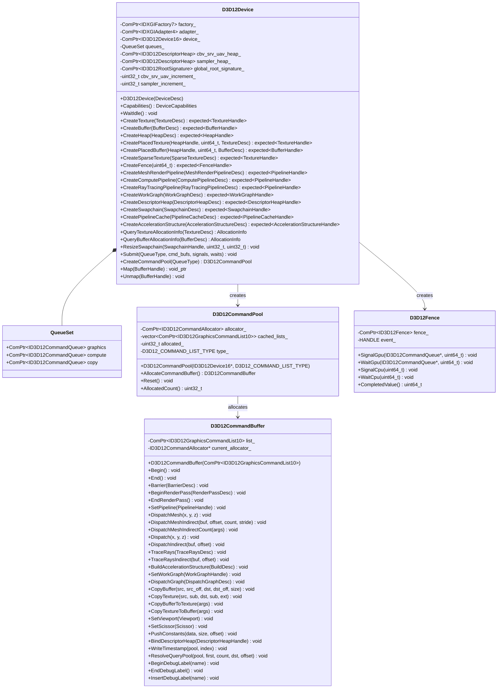
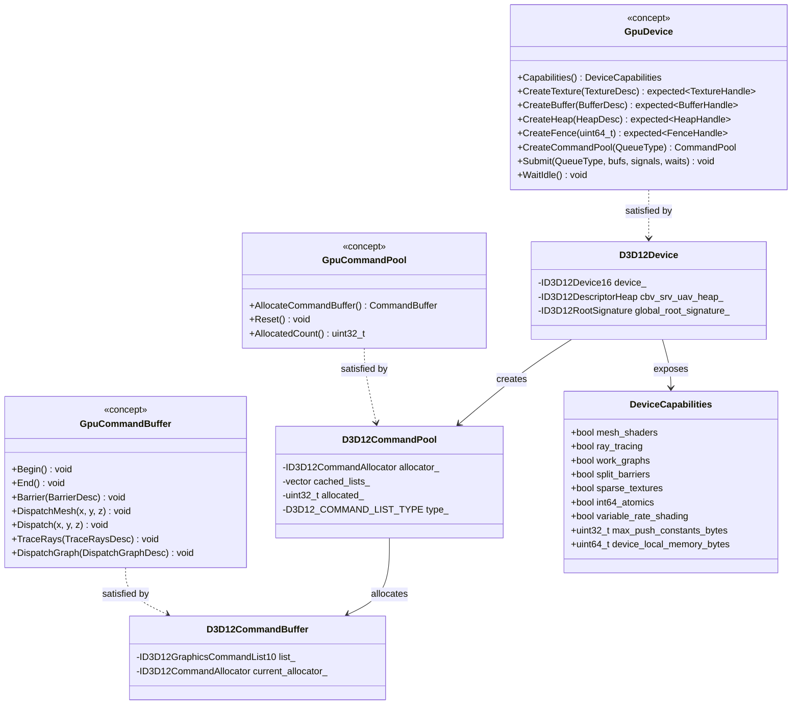
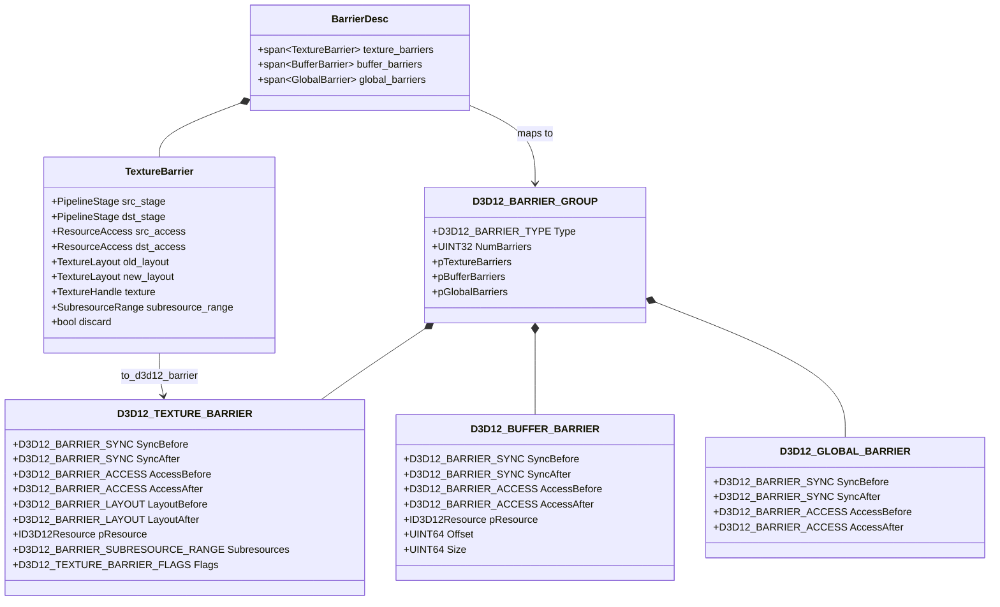
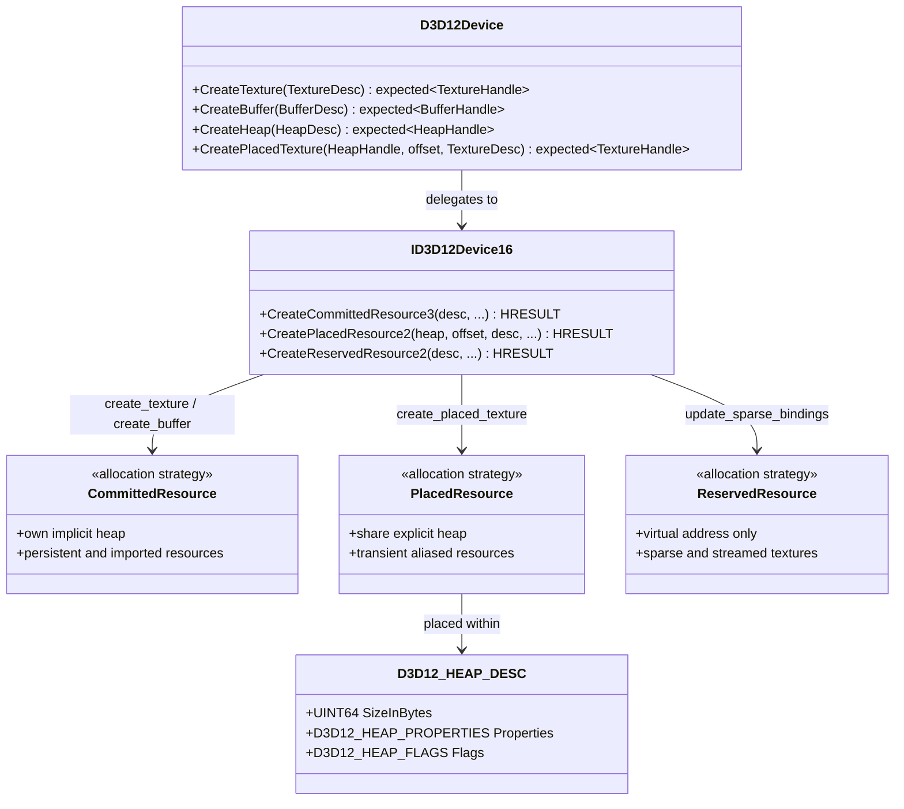
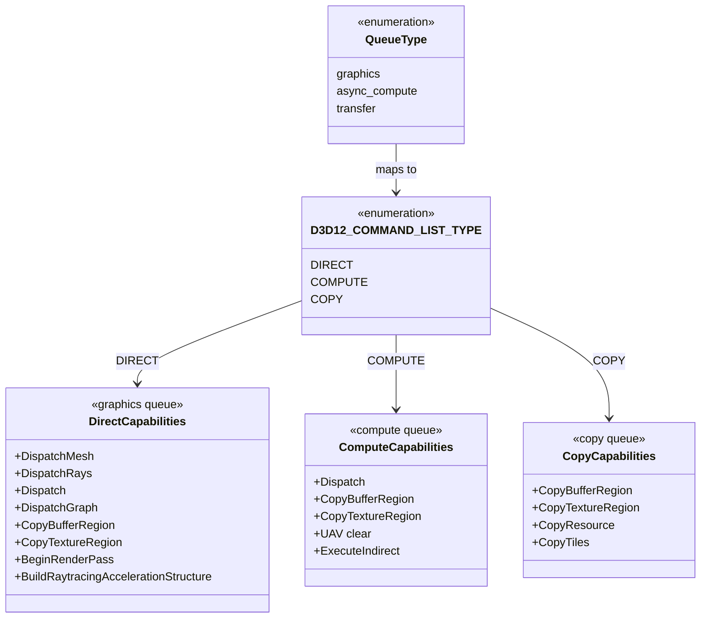
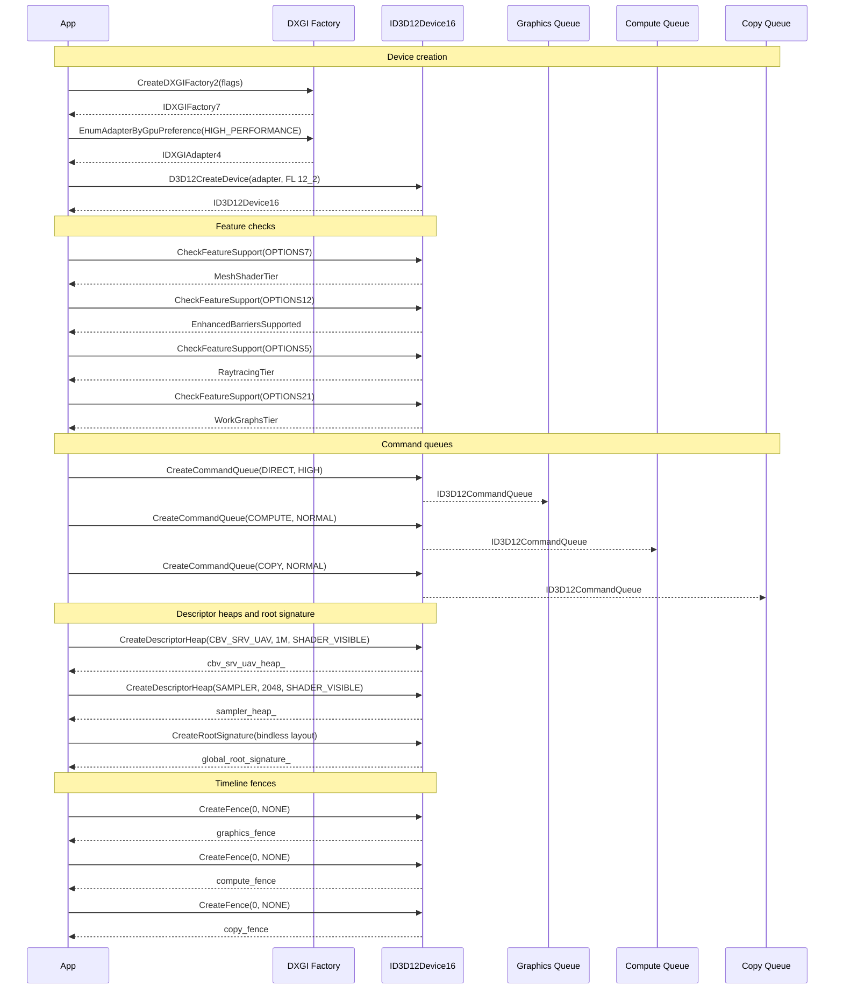
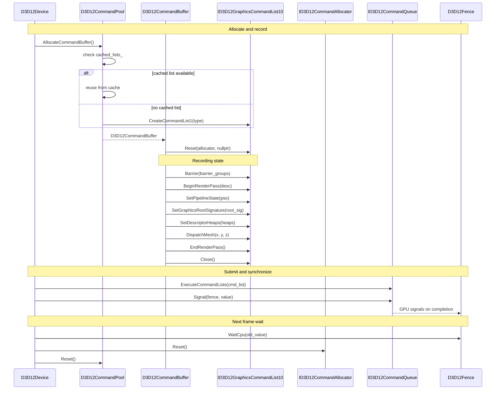
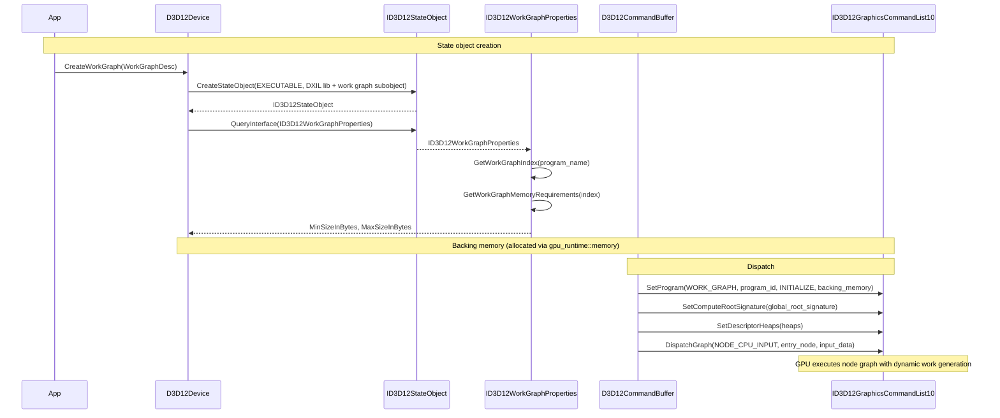
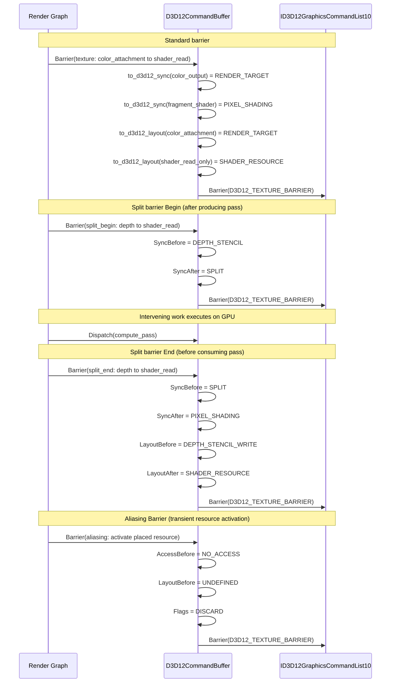

# D3D12 GPU Backend Class and Sequence Diagrams

Class diagrams for the Direct3D 12 backend implementation and sequence diagrams showing D3D12-specific
interactions. Companion to [gpu-backend-d3d12.md](gpu-backend-d3d12.md). See
[gpu-backend-interface-classes.md](gpu-backend-interface-classes.md) for the shared concepts and types
(`GpuDevice`, `GpuCommandBuffer`, `GpuCommandPool`, `DeviceCapabilities`).

---

## Contents

- [Class Diagrams](#class-diagrams)
  - [1. D3D12 Backend Classes](#1-d3d12-backend-classes)
  - [2. Concept Satisfaction](#2-concept-satisfaction)
  - [3. Enhanced Barriers Mapping](#3-enhanced-barriers-mapping)
  - [4. Resource Creation via D3D12 API](#4-resource-creation-via-d3d12-api)
  - [5. Command List Type Mapping](#5-command-list-type-mapping)
- [Sequence Diagrams](#sequence-diagrams)
  - [D3D12 Device Initialization](#d3d12-device-initialization)
  - [Command Recording and Submission](#command-recording-and-submission)
  - [Work Graph Dispatch](#work-graph-dispatch)
  - [Enhanced Barrier Usage](#enhanced-barrier-usage)

---

## Class Diagrams

### 1. D3D12 Backend Classes

`harmonius::gpu::d3d12` -- All D3D12 backend classes with fields and methods.

### 2. Concept Satisfaction

How D3D12 classes satisfy the `GpuDevice`, `GpuCommandPool`, and `GpuCommandBuffer` concepts defined
in [gpu-backend-interface-classes.md](gpu-backend-interface-classes.md). Each satisfaction is enforced
at compile time via `static_assert`.

**Compile-time enforcement:**

| D3D12 Class | Concept | Assertion |
|-------------|---------|-----------|
| `D3D12Device` | `GpuDevice` | `static_assert(GpuDevice<D3D12Device>)` |
| `D3D12CommandPool` | `GpuCommandPool` | `static_assert(GpuCommandPool<D3D12CommandPool>)` |
| `D3D12CommandBuffer` | `GpuCommandBuffer` | `static_assert(GpuCommandBuffer<D3D12CommandBuffer>)` |

### 3. Enhanced Barriers Mapping

How the abstract `BarrierDesc` maps to D3D12 Enhanced Barriers (`ID3D12GraphicsCommandList7::Barrier`).

**Stage mapping (`PipelineStage` to `D3D12_BARRIER_SYNC`):**

| Abstract | D3D12 |
|----------|-------|
| `kMeshShader` | `VERTEX_SHADING` |
| `kTaskShader` | `VERTEX_SHADING` |
| `kFragmentShader` | `PIXEL_SHADING` |
| `kComputeShader` | `COMPUTE_SHADING` |
| `kRayTracingShader` | `RAYTRACING` |
| `kColorOutput` | `RENDER_TARGET` |
| `kDepthStencil` | `DEPTH_STENCIL` |
| `kTransfer` | `COPY` |
| `kAccelerationStructure` | `BUILD_RAYTRACING_ACCELERATION_STRUCTURE` |
| `all` | `ALL` |
| `SplitBegin` | Set `SyncAfter = SPLIT` |
| `SplitEnd` | Set `SyncBefore = SPLIT` |

**Layout mapping (`TextureLayout` to `D3D12_BARRIER_LAYOUT`):**

| Abstract | D3D12 |
|----------|-------|
| `undefined` | `UNDEFINED` |
| `kGeneral` | `UNORDERED_ACCESS` |
| `kColorAttachment` | `RENDER_TARGET` |
| `kDepthStencilAttachment` | `DEPTH_STENCIL_WRITE` |
| `kDepthStencilReadOnly` | `DEPTH_STENCIL_READ` |
| `kShaderReadOnly` | `SHADER_RESOURCE` |
| `kTransferSrc` | `COPY_SOURCE` |
| `kTransferDst` | `COPY_DEST` |
| `Present` | `PRESENT` |
| `kShadingRate` | `SHADING_RATE_SOURCE` |

### 4. Resource Creation via D3D12 API

How the abstract resource creation methods map to D3D12 allocation strategies. Memory
management (sub-allocation, defragmentation) is handled by the GPU runtime layer
(`harmonius::gpu_runtime::memory`); the D3D12 backend provides only the raw D3D12 API calls.

### 5. Command List Type Mapping

How `QueueType` maps to D3D12 command list types and allowed operations.

---

## Sequence Diagrams

### D3D12 Device Initialization

Full initialization sequence: DXGI factory, adapter enumeration, device creation, feature checks,
queue creation, descriptor heaps, root signature, and timeline fences.

### Command Recording and Submission

How `D3D12CommandPool` allocates command buffers, records commands via
`ID3D12GraphicsCommandList10`, and submits to a queue with fence synchronization.

### Work Graph Dispatch

D3D12 work graph setup and dispatch via `ID3D12GraphicsCommandList10::SetProgram` and
`DispatchGraph`. Includes state object creation, backing memory allocation, and dispatch.

### Enhanced Barrier Usage

How the render graph's `BarrierDesc` is translated to D3D12 Enhanced Barriers, including split
barriers for overlapped transitions.

