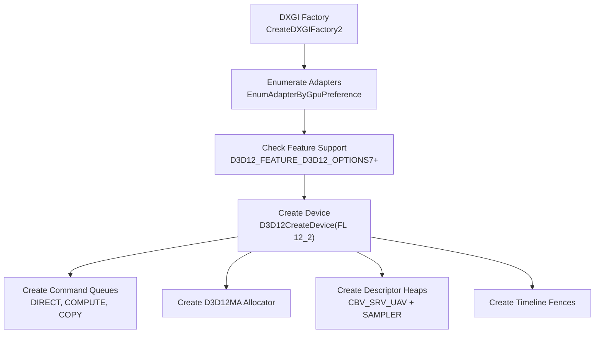
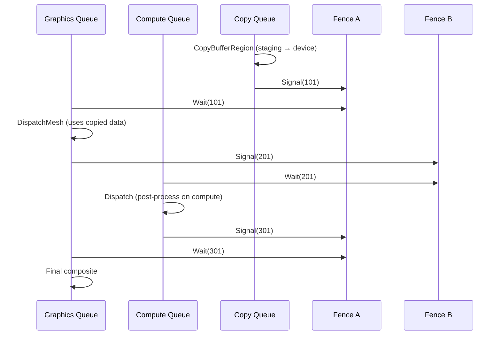
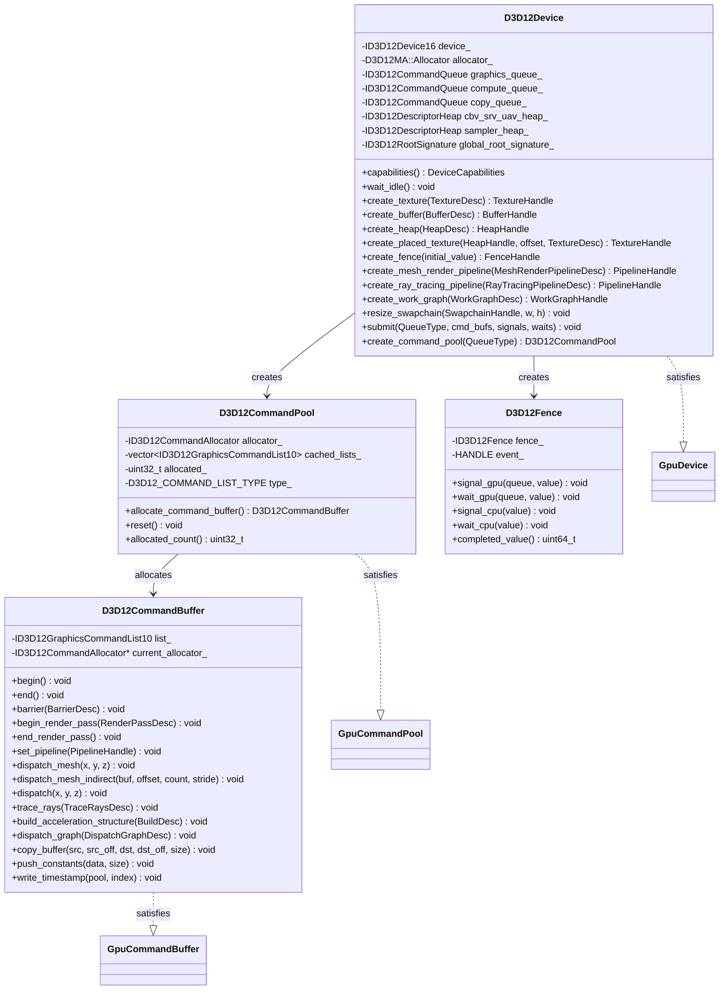

# GPU Backend — Direct3D 12

Implementation of the `harmonius::gpu` interface for Windows via Direct3D 12 with the Agility SDK.
Covers device creation, resource management, command recording, synchronization, pipeline state,
and resource binding using the latest D3D12 API surface.

**Requirements:** R-1.2.2 (Windows via D3D12), R-1.1.5 (native backend), R-1.1.6 (modern hardware).

**Minimum API:** Direct3D 12 with Agility SDK 1.619+, Feature Level 12_2, Shader Model 6.9,
`ID3D12Device16` (revised view creation with byte-offset buffer views).

**Specifications:**
- [DirectX Specs](https://microsoft.github.io/DirectX-Specs/)
- [D3D12 Programming Guide](https://learn.microsoft.com/en-us/windows/win32/direct3d12/directx-12-programming-guide)

---

## Contents

- [Device Initialization](#device-initialization)
- [Queue Topology](#queue-topology)
- [Resource Management](#resource-management)
  - [Committed Resources](#committed-resources)
  - [Heaps and Placed Resources](#heaps-and-placed-resources)
  - [Reserved Resources (Sparse)](#reserved-resources-sparse)
  - [Memory Allocator](#memory-allocator)
- [Command Recording](#command-recording)
  - [Command Allocators and Lists](#command-allocators-and-lists)
  - [Command List Capabilities](#command-list-capabilities)
- [Synchronization](#synchronization)
  - [Enhanced Barriers](#enhanced-barriers)
  - [Fences](#fences)
  - [Multi-Queue Synchronization](#multi-queue-synchronization)
- [Mesh Shader Pipeline](#mesh-shader-pipeline)
  - [Pipeline State Object](#pipeline-state-object)
  - [DispatchMesh](#dispatchmesh)
  - [Indirect Dispatch](#indirect-dispatch)
  - [Limits](#limits)
- [Ray Tracing (DXR 1.2)](#ray-tracing-dxr-12)
  - [Acceleration Structures](#acceleration-structures)
  - [Ray Tracing PSO](#ray-tracing-pso)
  - [Shader Binding Table](#shader-binding-table)
  - [DispatchRays](#dispatchrays)
- [Work Graphs](#work-graphs)
  - [State Object Creation](#state-object-creation)
  - [Backing Memory](#backing-memory)
  - [DispatchGraph](#dispatchgraph)
- [Resource Binding](#resource-binding)
  - [Descriptor Heaps](#descriptor-heaps)
  - [Root Signature](#root-signature)
  - [Bindless Access (SM 6.6)](#bindless-access-sm-66)
- [Swapchain](#swapchain)
- [Pipeline State](#pipeline-state)
  - [Stream-Based PSO Creation](#stream-based-pso-creation)
  - [Pipeline Library Caching](#pipeline-library-caching)
  - [Pipeline Cache Serialization](#pipeline-cache-serialization)
- [Diagnostics](#diagnostics)
- [Class Diagram](#class-diagram)

---

## Device Initialization



**Feature checks at initialization:**

| Feature | Check | Requirement |
|---------|-------|-------------|
| Mesh shaders | `D3D12_FEATURE_D3D12_OPTIONS7.MeshShaderTier >= TIER_1` | Hard requirement |
| Enhanced barriers | `D3D12_FEATURE_D3D12_OPTIONS12.EnhancedBarriersSupported` | Hard requirement |
| Ray tracing (DXR 1.2) | `D3D12_FEATURE_D3D12_OPTIONS5.RaytracingTier >= TIER_1_1` | Soft-gated |
| Shader execution reordering | `D3D12_FEATURE_D3D12_OPTIONS21.ShaderExecutionReorderingSupported` | Soft-gated |
| Opacity micromaps | `D3D12_FEATURE_D3D12_OPTIONS21.OpacityMicromapSupported` | Soft-gated |
| Byte-offset views | `D3D12_FEATURE_D3D12_OPTIONS22.CreateByteOffsetViewsSupported` | Preferred (fallback to element views) |
| Tight alignment | `D3D12_FEATURE_D3D12_OPTIONS22.TightAlignmentTier >= TIER_1` | Preferred (fallback to 64KB alignment) |
| Cooperative vectors | `D3D12_FEATURE_D3D12_OPTIONS22.CooperativeVectorTier >= TIER_1` | Soft-gated |
| Work graphs | `D3D12_FEATURE_D3D12_OPTIONS21.WorkGraphsTier >= TIER_1_0` | Soft-gated |
| Bindless | `D3D12_FEATURE_D3D12_OPTIONS.ResourceBindingTier >= TIER_3` | Hard requirement |
| 64-bit atomics | `D3D12_FEATURE_D3D12_OPTIONS9.AtomicInt64OnTypedResourceSupported` | Soft-gated |
| VRS | `D3D12_FEATURE_D3D12_OPTIONS6.VariableShadingRateTier >= TIER_2` | Soft-gated |

**Implementation class:**

```cpp
namespace harmonius::gpu::d3d12 {

class D3D12Device {
public:
    explicit D3D12Device(const DeviceDesc& desc);
    ~D3D12Device();

    // Non-copyable, non-movable
    D3D12Device(const D3D12Device&) = delete;
    D3D12Device& operator=(const D3D12Device&) = delete;

    [[nodiscard]] DeviceCapabilities capabilities() const;

    // Drains all queues and blocks until the GPU is idle.
    // Signals each queue's fence and waits on the CPU for completion.
    void wait_idle();

    // See gpu-backend-interface.md for the full method list.

private:
    ComPtr<IDXGIFactory7>                factory_;
    ComPtr<IDXGIAdapter4>                adapter_;
    ComPtr<ID3D12Device16>               device_;
    ComPtr<D3D12MA::Allocator>           allocator_;

    struct QueueSet {
        ComPtr<ID3D12CommandQueue>  graphics;
        ComPtr<ID3D12CommandQueue>  compute;
        ComPtr<ID3D12CommandQueue>  copy;
    } queues_;

    ComPtr<ID3D12DescriptorHeap>         cbv_srv_uav_heap_;
    ComPtr<ID3D12DescriptorHeap>         sampler_heap_;
    ComPtr<ID3D12RootSignature>          global_root_signature_;

    uint32_t cbv_srv_uav_increment_ = 0;
    uint32_t sampler_increment_     = 0;
};

static_assert(GpuDevice<D3D12Device>);

} // namespace harmonius::gpu::d3d12
```

---

## Queue Topology

D3D12 exposes three command list types mapping to three GPU engines:

| `QueueType` | D3D12 Command List Type | GPU Engine | Allowed Operations |
|-------------|------------------------|-----------|--------------------|
| `graphics` | `D3D12_COMMAND_LIST_TYPE_DIRECT` | 3D engine | All: draw, dispatch, copy, RT, AS build, work graphs |
| `async_compute` | `D3D12_COMMAND_LIST_TYPE_COMPUTE` | Compute engine | Dispatch, copy, UAV clear, indirect execute |
| `transfer` | `D3D12_COMMAND_LIST_TYPE_COPY` | Copy engine | `CopyBufferRegion`, `CopyTextureRegion`, `CopyResource`, `CopyTiles` |

**Queue creation:**

```cpp
D3D12_COMMAND_QUEUE_DESC queue_desc = {};
queue_desc.Type     = D3D12_COMMAND_LIST_TYPE_DIRECT;
queue_desc.Priority = D3D12_COMMAND_QUEUE_PRIORITY_HIGH;
queue_desc.Flags    = D3D12_COMMAND_QUEUE_FLAG_NONE;
device_->CreateCommandQueue(&queue_desc, IID_PPV_ARGS(&queues_.graphics));
```

**Cross-queue resource access rules:**
- Resource state is shared across all Compute and 3D queues (same type class).
- Copy queue has its own state class — resources must be in `COMMON` state for copy queue access.
- Only one queue can write to a resource at a time; a fence must separate writes from subsequent reads on another queue.

---

## Resource Management

### Committed Resources

Committed resources allocate their own implicit heap. Used for persistent and imported resources.

```cpp
D3D12MA::ALLOCATION_DESC alloc_desc = {};
alloc_desc.HeapType = D3D12_HEAP_TYPE_DEFAULT;

D3D12_RESOURCE_DESC1 res_desc = {};
res_desc.Dimension        = D3D12_RESOURCE_DIMENSION_TEXTURE2D;
res_desc.Width            = desc.width;
res_desc.Height           = desc.height;
res_desc.DepthOrArraySize = desc.depth_or_layers;
res_desc.MipLevels        = desc.mip_levels;
res_desc.Format           = to_dxgi_format(desc.format);
res_desc.SampleDesc       = {static_cast<UINT>(desc.samples), 0};
res_desc.Layout           = D3D12_TEXTURE_LAYOUT_UNKNOWN;
res_desc.Flags            = to_d3d12_resource_flags(desc.usage);

allocator_->CreateResource3(&alloc_desc, &res_desc,
    D3D12_BARRIER_LAYOUT_UNDEFINED, nullptr, 0, nullptr,
    &allocation, IID_PPV_ARGS(&resource));
```

### Heaps and Placed Resources

Used by the render graph's aliasing system (RG-8.1–8.6). Multiple transient resources alias
within the same heap at non-overlapping lifetime intervals.

```cpp
// Create a heap
D3D12_HEAP_DESC heap_desc = {};
heap_desc.SizeInBytes     = desc.size_bytes;
heap_desc.Properties.Type = D3D12_HEAP_TYPE_DEFAULT;
heap_desc.Flags           = D3D12_HEAP_FLAG_ALLOW_ALL_BUFFERS_AND_TEXTURES;
device_->CreateHeap(&heap_desc, IID_PPV_ARGS(&heap));

// Place a resource within the heap at a specific offset
device_->CreatePlacedResource2(heap, offset, &res_desc,
    D3D12_BARRIER_LAYOUT_UNDEFINED, nullptr, 0, nullptr,
    IID_PPV_ARGS(&resource));
```

**Aliasing rules:**
- Resources at overlapping heap offsets are implicitly aliased.
- Before using a newly activated aliased resource, issue a texture barrier transitioning from
  `UNDEFINED` layout with `D3D12_TEXTURE_BARRIER_FLAGS_DISCARD` to initialize compression metadata.
- The deactivated resource needs no explicit barrier — `AccessBefore = NO_ACCESS` suffices.

### Reserved Resources (Sparse)

For virtual textures and sparse residency (R-3.2.6):

```cpp
device_->CreateReservedResource2(&res_desc,
    D3D12_BARRIER_LAYOUT_UNDEFINED, nullptr, nullptr, 0, nullptr,
    IID_PPV_ARGS(&sparse_texture));

// Map tiles from a heap
D3D12_TILED_RESOURCE_COORDINATE coord = {tile_x, tile_y, 0, 0};
D3D12_TILE_REGION_SIZE region = {1, FALSE, 0, 0, 0};
D3D12_TILE_RANGE_FLAGS flags = D3D12_TILE_RANGE_FLAG_NONE;
UINT heap_offset = ...;
queue->UpdateTileMappings(sparse_texture, 1, &coord, &region,
    heap, 1, &flags, &heap_offset, &tile_count, D3D12_TILE_MAPPING_FLAG_NONE);
```

### Memory Allocator

The D3D12 backend uses [D3D12 Memory Allocator (D3D12MA)](https://gpuopen.com/d3d12-memory-allocator/)
for sub-allocation, defragmentation, and budget tracking.

| D3D12MA Feature | Usage |
|----------------|-------|
| Pool allocator | Transient resource pools per heap type |
| Virtual blocks | Ring buffer sub-allocation for staging |
| Budget queries | `IDXGIAdapter3::QueryVideoMemoryInfo` |
| Defragmentation | Background defrag of persistent resources |

---

## Command Recording

### Command Allocators and Lists

```cpp
// One allocator per frame-in-flight per queue type per thread
device_->CreateCommandAllocator(
    D3D12_COMMAND_LIST_TYPE_DIRECT,
    IID_PPV_ARGS(&allocator)
);

// Command list reused across frames (Reset + re-record)
device_->CreateCommandList1(
    0, D3D12_COMMAND_LIST_TYPE_DIRECT,
    D3D12_COMMAND_LIST_FLAG_NONE,
    IID_PPV_ARGS(&cmd_list)
);

// Begin recording
cmd_list->Reset(allocator, nullptr);

// ... record commands ...

// Finish recording
cmd_list->Close();

// Submit
ID3D12CommandList* lists[] = {cmd_list};
queue->ExecuteCommandLists(1, lists);
```

**D3D12CommandPool** satisfies the `GpuCommandPool` concept. It owns one
`ID3D12CommandAllocator` and maintains a cache of `ID3D12GraphicsCommandList10` objects for reuse:

```cpp
class D3D12CommandPool {
public:
    D3D12CommandPool(ID3D12Device16* device, D3D12_COMMAND_LIST_TYPE type);

    // Reuse a cached command list or create a new one.
    // The returned list is in a non-recording state — call begin() to start.
    [[nodiscard]] D3D12CommandBuffer allocate_command_buffer();

    // Reset the underlying ID3D12CommandAllocator and return all command
    // lists to the cache. Must only be called once the GPU has finished
    // executing all previously submitted command buffers from this pool.
    void reset();

    [[nodiscard]] uint32_t allocated_count() const { return allocated_; }

private:
    ComPtr<ID3D12CommandAllocator>                        allocator_;
    std::vector<ComPtr<ID3D12GraphicsCommandList10>>      cached_lists_;
    uint32_t                                              allocated_ = 0;
    D3D12_COMMAND_LIST_TYPE                               type_;
};

static_assert(GpuCommandPool<D3D12CommandPool>);
```

**D3D12CommandBuffer** satisfies the `GpuCommandBuffer` concept. It wraps
a single `ID3D12GraphicsCommandList10`:

```cpp
class D3D12CommandBuffer {
public:
    explicit D3D12CommandBuffer(ComPtr<ID3D12GraphicsCommandList10> list);

    // Reset the command list with the given allocator, entering the recording state.
    // Calls list_->Reset(allocator, nullptr).
    void begin();

    // Finalize the command list for submission.
    // Calls list_->Close().
    void end();

    // ... remaining methods (barrier, dispatch_mesh, etc.)

private:
    ComPtr<ID3D12GraphicsCommandList10>  list_;
    ID3D12CommandAllocator*              current_allocator_ = nullptr;
};

static_assert(GpuCommandBuffer<D3D12CommandBuffer>);
```

### Command List Capabilities

The D3D12 backend uses `ID3D12GraphicsCommandList10` which inherits all functionality:

| Interface Level | Key Methods |
|----------------|-------------|
| `List` (base) | `Close`, `Reset` |
| `List1` | `CopyBufferRegion`, `CopyTextureRegion`, `ResourceBarrier` |
| `List4` | `BeginRenderPass`, `EndRenderPass` |
| `List6` | `DispatchMesh` |
| `List7` | `Barrier` (enhanced barriers) |
| `List10` | `SetProgram`, `DispatchGraph` (work graphs) |

---

## Synchronization

### Enhanced Barriers

The D3D12 backend exclusively uses Enhanced Barriers (`ID3D12GraphicsCommandList7::Barrier`),
not the legacy `ResourceBarrier` API. Enhanced barriers decouple three operations: synchronization,
cache flushing, and layout transitions.

**Mapping from abstract `BarrierDesc`:**

```cpp
void D3D12CommandBuffer::barrier(std::span<const BarrierDesc> barriers) {
    // Collect into D3D12_BARRIER_GROUP arrays
    std::vector<D3D12_TEXTURE_BARRIER> texture_barriers;
    std::vector<D3D12_BUFFER_BARRIER>  buffer_barriers;
    std::vector<D3D12_GLOBAL_BARRIER>  global_barriers;

    for (auto& b : barriers) {
        for (auto& tb : b.texture_barriers) {
            texture_barriers.push_back({
                .SyncBefore   = to_d3d12_sync(tb.src_stage),
                .SyncAfter    = to_d3d12_sync(tb.dst_stage),
                .AccessBefore = to_d3d12_access(tb.src_access),
                .AccessAfter  = to_d3d12_access(tb.dst_access),
                .LayoutBefore = to_d3d12_layout(tb.old_layout),
                .LayoutAfter  = to_d3d12_layout(tb.new_layout),
                .pResource    = resolve_texture(tb.texture),
                .Subresources = to_d3d12_subresource_range(tb.subresource_range),
                .Flags        = tb.discard
                    ? D3D12_TEXTURE_BARRIER_FLAGS_DISCARD
                    : D3D12_TEXTURE_BARRIER_FLAGS_NONE,
            });
        }
        // ... buffer and global barriers similarly ...
    }

    D3D12_BARRIER_GROUP groups[3];
    uint32_t group_count = 0;
    // ... populate groups ...

    cmd_list_->Barrier(group_count, groups);
}
```

**Stage mapping (`PipelineStage` → `D3D12_BARRIER_SYNC`):**

| Abstract | D3D12 |
|----------|-------|
| `mesh_shader` | `VERTEX_SHADING` (covers mesh/amplification) |
| `task_shader` | `VERTEX_SHADING` |
| `fragment_shader` | `PIXEL_SHADING` |
| `compute_shader` | `COMPUTE_SHADING` |
| `ray_tracing_shader` | `RAYTRACING` |
| `color_output` | `RENDER_TARGET` |
| `depth_stencil` | `DEPTH_STENCIL` |
| `transfer` | `COPY` |
| `resolve` | `RESOLVE` |
| `acceleration_structure` | `BUILD_RAYTRACING_ACCELERATION_STRUCTURE` |
| `indirect_argument` | `EXECUTE_INDIRECT` |
| `all` | `ALL` |
| `split_begin` | Set `SyncAfter = SPLIT` |
| `split_end` | Set `SyncBefore = SPLIT` |

**Layout mapping (`TextureLayout` → `D3D12_BARRIER_LAYOUT`):**

| Abstract | D3D12 |
|----------|-------|
| `undefined` | `UNDEFINED` |
| `general` | `UNORDERED_ACCESS` |
| `color_attachment` | `RENDER_TARGET` |
| `depth_stencil_attachment` | `DEPTH_STENCIL_WRITE` |
| `depth_stencil_read_only` | `DEPTH_STENCIL_READ` |
| `shader_read_only` | `SHADER_RESOURCE` |
| `transfer_src` | `COPY_SOURCE` |
| `transfer_dst` | `COPY_DEST` |
| `present` | `PRESENT` |
| `shading_rate` | `SHADING_RATE_SOURCE` |

**Split barriers** are supported by D3D12. The render graph compiler emits `split_begin` at the
first possible point after the producing pass and `split_end` just before the consuming pass,
allowing the GPU to overlap the transition with intervening work.

### Fences

D3D12 fences are inherently timeline-based — they store a monotonically increasing `UINT64` value.

```cpp
// Create fence
device_->CreateFence(0, D3D12_FENCE_FLAG_NONE, IID_PPV_ARGS(&fence));

// GPU-side signal (after all preceding commands complete)
queue->Signal(fence, value);

// GPU-side wait (queue stalls until fence >= value)
queue->Wait(fence, value);

// CPU-side query
uint64_t completed = fence->GetCompletedValue();

// CPU-side wait
HANDLE event = CreateEvent(nullptr, FALSE, FALSE, nullptr);
fence->SetEventOnCompletion(value, event);
WaitForSingleObject(event, INFINITE);
```

### Multi-Queue Synchronization



---

## Mesh Shader Pipeline

### Pipeline State Object

Mesh shader PSOs use stream-based creation (not the legacy `D3D12_GRAPHICS_PIPELINE_STATE_DESC`):

```cpp
struct MeshPSO_Stream {
    CD3DX12_PIPELINE_STATE_STREAM_ROOT_SIGNATURE   pRootSignature;
    CD3DX12_PIPELINE_STATE_STREAM_AS               AS;  // amplification (task)
    CD3DX12_PIPELINE_STATE_STREAM_MS               MS;  // mesh
    CD3DX12_PIPELINE_STATE_STREAM_PS               PS;  // pixel (fragment)
    CD3DX12_PIPELINE_STATE_STREAM_BLEND_DESC       Blend;
    CD3DX12_PIPELINE_STATE_STREAM_RASTERIZER       Rasterizer;
    CD3DX12_PIPELINE_STATE_STREAM_DEPTH_STENCIL1   DepthStencil;
    CD3DX12_PIPELINE_STATE_STREAM_RENDER_TARGET_FORMATS RTFormats;
    CD3DX12_PIPELINE_STATE_STREAM_DEPTH_STENCIL_FORMAT  DSFormat;
    CD3DX12_PIPELINE_STATE_STREAM_SAMPLE_DESC      SampleDesc;
};

MeshPSO_Stream stream = {};
stream.pRootSignature = {global_root_signature_};
stream.AS = {task_bytecode};
stream.MS = {mesh_bytecode};
stream.PS = {pixel_bytecode};
// ... set render state ...

D3D12_PIPELINE_STATE_STREAM_DESC stream_desc = {};
stream_desc.SizeInBytes = sizeof(stream);
stream_desc.pPipelineStateSubobjectStream = &stream;
device_->CreatePipelineState(&stream_desc, IID_PPV_ARGS(&pso));
```

**No Input Assembler or Stream Output** — these stages do not exist in the mesh pipeline.

### DispatchMesh

```cpp
// Direct dispatch
cmd_list->DispatchMesh(groups_x, groups_y, groups_z);
```

### Indirect Dispatch

```cpp
// GPU-driven dispatch via ExecuteIndirect with mesh dispatch command signature
D3D12_INDIRECT_ARGUMENT_DESC arg_desc = {};
arg_desc.Type = D3D12_INDIRECT_ARGUMENT_TYPE_DISPATCH_MESH;

D3D12_COMMAND_SIGNATURE_DESC sig_desc = {};
sig_desc.ByteStride    = sizeof(D3D12_DISPATCH_MESH_ARGUMENTS);
sig_desc.NumArgumentDescs = 1;
sig_desc.pArgumentDescs   = &arg_desc;
device_->CreateCommandSignature(&sig_desc, nullptr,
    IID_PPV_ARGS(&mesh_indirect_sig));

// At recording time:
cmd_list->ExecuteIndirect(mesh_indirect_sig, draw_count,
    argument_buffer, arg_offset, count_buffer, count_offset);
```

### Limits

| Limit | Value |
|-------|-------|
| Max threads per mesh group | 128 |
| Max output vertices | 256 |
| Max output primitives | 256 |
| Max shared memory (mesh) | 28 KB |
| Max shared memory (amplification) | 32 KB |
| Max payload size (AS → MS) | 16 KB |
| Max dispatch dimensions (each) | 65,535 |
| Max total dispatched groups | 2²² |

---

## Ray Tracing (DXR 1.2)

### Acceleration Structures

```cpp
// BLAS creation
D3D12_RAYTRACING_GEOMETRY_DESC geom_desc = {};
geom_desc.Type = D3D12_RAYTRACING_GEOMETRY_TYPE_TRIANGLES;
geom_desc.Triangles.VertexBuffer.StartAddress = vertex_gpu_addr;
geom_desc.Triangles.VertexBuffer.StrideInBytes = vertex_stride;
geom_desc.Triangles.VertexCount = vertex_count;
geom_desc.Triangles.VertexFormat = DXGI_FORMAT_R32G32B32_FLOAT;
geom_desc.Triangles.IndexBuffer = index_gpu_addr;
geom_desc.Triangles.IndexFormat = DXGI_FORMAT_R32_UINT;
geom_desc.Triangles.IndexCount  = index_count;
geom_desc.Flags = D3D12_RAYTRACING_GEOMETRY_FLAG_OPAQUE;

D3D12_BUILD_RAYTRACING_ACCELERATION_STRUCTURE_INPUTS inputs = {};
inputs.Type          = D3D12_RAYTRACING_ACCELERATION_STRUCTURE_TYPE_BOTTOM_LEVEL;
inputs.Flags         = D3D12_RAYTRACING_ACCELERATION_STRUCTURE_BUILD_FLAG_PREFER_FAST_TRACE;
inputs.NumDescs      = 1;
inputs.pGeometryDescs = &geom_desc;

// Query sizes
D3D12_RAYTRACING_ACCELERATION_STRUCTURE_PREBUILD_INFO prebuild_info = {};
device_->GetRaytracingAccelerationStructurePrebuildInfo(&inputs, &prebuild_info);

// Build
D3D12_BUILD_RAYTRACING_ACCELERATION_STRUCTURE_DESC build_desc = {};
build_desc.Inputs                           = inputs;
build_desc.DestAccelerationStructureData    = blas_gpu_addr;
build_desc.ScratchAccelerationStructureData = scratch_gpu_addr;
cmd_list->BuildRaytracingAccelerationStructure(&build_desc, 0, nullptr);
```

### Ray Tracing PSO

RT pipelines use state objects:

```cpp
CD3DX12_STATE_OBJECT_DESC so_desc(D3D12_STATE_OBJECT_TYPE_RAYTRACING_PIPELINE);

// Add DXIL library subobject with shader entry points
auto* lib = so_desc.CreateSubobject<CD3DX12_DXIL_LIBRARY_SUBOBJECT>();
lib->SetDXILLibrary(&shader_bytecode);

// Add hit groups
auto* hit_group = so_desc.CreateSubobject<CD3DX12_HIT_GROUP_SUBOBJECT>();
hit_group->SetClosestHitShaderImport(L"ClosestHit");
hit_group->SetHitGroupExport(L"HitGroup0");
hit_group->SetHitGroupType(D3D12_HIT_GROUP_TYPE_TRIANGLES);

// Configuration
auto* config = so_desc.CreateSubobject<CD3DX12_RAYTRACING_SHADER_CONFIG_SUBOBJECT>();
config->Config(max_payload_size, max_attribute_size);

auto* pipeline_config = so_desc.CreateSubobject<CD3DX12_RAYTRACING_PIPELINE_CONFIG_SUBOBJECT>();
pipeline_config->Config(max_recursion_depth);

// Global root signature
auto* global_rs = so_desc.CreateSubobject<CD3DX12_GLOBAL_ROOT_SIGNATURE_SUBOBJECT>();
global_rs->SetRootSignature(global_root_signature_);

device_->CreateStateObject(so_desc, IID_PPV_ARGS(&rt_state_object));
```

### Shader Binding Table

The SBT maps ray types to shader entry points:

| Region | Contents | Stride |
|--------|----------|--------|
| Ray generation | 1 record: shader identifier (32 bytes) | 32 bytes |
| Miss | N records: shader identifier + local root args | Aligned stride |
| Hit group | N records: shader identifier + local root args | Aligned stride |

### DispatchRays

```cpp
D3D12_DISPATCH_RAYS_DESC dispatch_desc = {};
dispatch_desc.RayGenerationShaderRecord = {raygen_gpu_addr, raygen_size};
dispatch_desc.MissShaderTable           = {miss_gpu_addr, miss_size, miss_stride};
dispatch_desc.HitGroupTable             = {hit_gpu_addr, hit_size, hit_stride};
dispatch_desc.Width  = width;
dispatch_desc.Height = height;
dispatch_desc.Depth  = 1;
cmd_list->SetPipelineState1(rt_state_object);
cmd_list->DispatchRays(&dispatch_desc);

// Indirect dispatch
cmd_list->DispatchRays(&dispatch_desc);  // indirect variant via ExecuteIndirect
```

### DXR 1.2: Shader Execution Reordering (SER)

DXR 1.2 (SM 6.9, Agility SDK 1.619+) adds Shader Execution Reordering, which allows ray tracing
shaders to hint the GPU to reorder thread execution for better coherence. This is a required
feature of SM 6.9.

```hlsl
// HLSL — SER usage in ray generation shader
RayQuery<RAY_FLAG_NONE> q;
q.TraceRayInline(accel, RAY_FLAG_NONE, 0xFF, ray);

// Reorder threads for better coherence based on hit data
HitObject hit = HitObject::FromRayQuery(q);
ReorderThread(hit);  // GPU reorders warps by hit shader / geometry

// Now execute shading with improved coherence
hit.Invoke(/* payload */);
```

| SER Feature | Hardware Support |
|-------------|-----------------|
| NVIDIA | RTX 40/50 series — hardware-accelerated reordering |
| Intel | Arc B-series — hardware-accelerated (up to +90% perf) |
| AMD | RX 9000 — API support, driver reordering pending |

### DXR 1.2: Opacity Micromaps

Opacity micromaps accelerate alpha-tested geometry in RT (RG-2.25). Built in a dedicated pass
and attached to BLAS geometry:

```cpp
D3D12_RAYTRACING_GEOMETRY_DESC geom_desc = {};
geom_desc.Triangles.OpacityMicromap = omm_handle;  // attached OMM
```

### SM 6.9: Cooperative Vectors and Long Vectors

SM 6.9 introduces long vectors (up to 1024 elements) and cooperative vector operations for
neural rendering workloads:

```hlsl
// Long vector — load/store up to 1024-element vectors
vector<float, 64> weights = buf.Load<vector<float, 64>>(offset);

// Cooperative vector — matrix-vector multiply
vector<float, 16> result = __builtin_MatVecMul(weights, matrix_buf, ...);
```

---

## Work Graphs

Work graphs enable GPU-driven dynamic work generation (RG-1.13). Capability-gated (soft).

### State Object Creation

```cpp
CD3DX12_STATE_OBJECT_DESC so_desc(D3D12_STATE_OBJECT_TYPE_EXECUTABLE);

// Add DXIL library with [Shader("node")] entry points
auto* lib = so_desc.CreateSubobject<CD3DX12_DXIL_LIBRARY_SUBOBJECT>();
lib->SetDXILLibrary(&work_graph_shader);

// Add work graph definition
auto* wg = so_desc.CreateSubobject<CD3DX12_WORK_GRAPH_SUBOBJECT>();
wg->SetProgramName(L"MyWorkGraph");
wg->AddEntrypoint({L"EntryNode", 0});
wg->IncludeAllAvailableNodes();

device_->CreateStateObject(so_desc, IID_PPV_ARGS(&wg_state_object));
```

### Backing Memory

Work graphs require backing memory for intermediate records:

```cpp
ComPtr<ID3D12WorkGraphProperties> wg_props;
wg_state_object->QueryInterface(IID_PPV_ARGS(&wg_props));

uint32_t wg_index = wg_props->GetWorkGraphIndex(L"MyWorkGraph");
D3D12_WORK_GRAPH_MEMORY_REQUIREMENTS mem_req = {};
wg_props->GetWorkGraphMemoryRequirements(wg_index, &mem_req);

// Allocate backing memory buffer of at least mem_req.MinSizeInBytes
```

### DispatchGraph

```cpp
D3D12_SET_PROGRAM_DESC set_desc = {};
set_desc.Type = D3D12_PROGRAM_TYPE_WORK_GRAPH;
set_desc.WorkGraph.ProgramIdentifier = wg_props->GetProgramIdentifier(L"MyWorkGraph");
set_desc.WorkGraph.Flags = D3D12_SET_WORK_GRAPH_FLAG_INITIALIZE;
set_desc.WorkGraph.BackingMemory = {backing_gpu_addr, backing_size};
cmd_list->SetProgram(&set_desc);

D3D12_DISPATCH_GRAPH_DESC dispatch_desc = {};
dispatch_desc.Mode           = D3D12_DISPATCH_GRAPH_MODE_NODE_CPU_INPUT;
dispatch_desc.NodeCPUInput   = {0, input_data, input_size};
cmd_list->DispatchGraph(&dispatch_desc);
```

---

## Resource Binding

### Descriptor Heaps

D3D12 has four descriptor heap types. Only `CBV_SRV_UAV` and `SAMPLER` are shader-visible:

| Heap Type | Shader Visible | Usage |
|-----------|---------------|-------|
| `CBV_SRV_UAV` | Yes | All bindless resource descriptors |
| `SAMPLER` | Yes | Sampler states |
| `RTV` | No | Render target views (used by `BeginRenderPass`) |
| `DSV` | No | Depth/stencil views |

**One large shader-visible heap per type** is created at initialization and bound once:

```cpp
D3D12_DESCRIPTOR_HEAP_DESC heap_desc = {};
heap_desc.NumDescriptors = 1'000'000;
heap_desc.Type           = D3D12_DESCRIPTOR_HEAP_TYPE_CBV_SRV_UAV;
heap_desc.Flags          = D3D12_DESCRIPTOR_HEAP_FLAG_SHADER_VISIBLE;
device_->CreateDescriptorHeap(&heap_desc, IID_PPV_ARGS(&cbv_srv_uav_heap_));
```

### Root Signature

A single global root signature serves all pipelines:

```cpp
// Slot 0: Root CBV (FrameConstants, b0)
// Slot 1: Descriptor table — unbounded SRV array (t0, space0)
// Slot 2: Descriptor table — unbounded UAV array (u0, space0)
// Slot 3: Descriptor table — unbounded sampler array (s0, space0)
// Slot 4: 32-byte root constants (per-draw push data)

CD3DX12_ROOT_PARAMETER1 params[5];
params[0].InitAsConstantBufferView(0);  // b0

CD3DX12_DESCRIPTOR_RANGE1 srv_range(D3D12_DESCRIPTOR_RANGE_TYPE_SRV,
    UINT_MAX, 0, 0, D3D12_DESCRIPTOR_RANGE_FLAG_DESCRIPTORS_VOLATILE);
params[1].InitAsDescriptorTable(1, &srv_range);

CD3DX12_DESCRIPTOR_RANGE1 uav_range(D3D12_DESCRIPTOR_RANGE_TYPE_UAV,
    UINT_MAX, 0, 0, D3D12_DESCRIPTOR_RANGE_FLAG_DESCRIPTORS_VOLATILE);
params[2].InitAsDescriptorTable(1, &uav_range);

CD3DX12_DESCRIPTOR_RANGE1 sampler_range(D3D12_DESCRIPTOR_RANGE_TYPE_SAMPLER,
    UINT_MAX, 0, 0, D3D12_DESCRIPTOR_RANGE_FLAG_DESCRIPTORS_VOLATILE);
params[3].InitAsDescriptorTable(1, &sampler_range);

params[4].InitAsConstants(8, 1); // 8 DWORDs = 32 bytes at b1
```

### Bindless Access (SM 6.6)

With SM 6.6, shaders access the heap directly without explicit descriptor tables:

```hlsl
// In HLSL — direct heap access
ByteAddressBuffer  buf = ResourceDescriptorHeap[index];
Texture2D<float4>  tex = ResourceDescriptorHeap[index];
RWTexture2D<float4> rw = ResourceDescriptorHeap[index];
SamplerState       smp = SamplerDescriptorHeap[index];
```

### Revised View Creation (Byte-Offset Buffer Views)

Agility SDK 1.619+ introduces byte-offset buffer views via `ID3D12Device16`, replacing the
legacy element-based model. Buffer SRV/UAV offsets and sizes are now specified in bytes,
enabling precise sub-allocation from ring buffers and shared buffer pools.

**Feature check:**

```cpp
D3D12_FEATURE_DATA_D3D12_OPTIONS22 options22 = {};
device_->CheckFeatureSupport(D3D12_FEATURE_D3D12_OPTIONS22,
    &options22, sizeof(options22));
bool byte_views = options22.CreateByteOffsetViewsSupported;
```

**New structures:**

```cpp
// Byte-offset SRV for buffers
struct D3D12_BUFFER_SRV_BYTE_OFFSET {
    UINT64  Offset;               // byte offset into the buffer
    UINT64  Size;                  // view size in bytes (0 = to end)
    UINT    StructureByteStride;   // element stride (0 = typed/raw)
    D3D12_BUFFER_SRV_FLAGS Flags;
};

// Byte-offset UAV for buffers
struct D3D12_BUFFER_UAV_BYTE_OFFSET {
    UINT64  Offset;               // byte offset into the buffer
    UINT64  Size;                  // view size in bytes
    UINT    StructureByteStride;   // element stride
    UINT64  CounterOffsetInBytes;  // counter resource offset
    D3D12_BUFFER_UAV_FLAGS Flags;
};
```

**Usage (replaces element-based `FirstElement`/`NumElements`):**

```cpp
D3D12_SHADER_RESOURCE_VIEW_DESC srv_desc = {};
srv_desc.Format        = DXGI_FORMAT_UNKNOWN;
srv_desc.ViewDimension = D3D12_SRV_DIMENSION_BUFFER_BYTE_OFFSET;
srv_desc.BufferByteOffset.Offset = ring_buffer_offset;  // arbitrary byte offset
srv_desc.BufferByteOffset.Size   = 256;
srv_desc.BufferByteOffset.StructureByteStride = 16;

// New Try* methods return HRESULT for error handling
HRESULT hr = device16->TryCreateShaderResourceView(
    buffer, &srv_desc, descriptor_handle);
```

**Alignment rules for byte-offset views:**

| Buffer Type | Minimum Alignment |
|------------|-------------------|
| Power-of-2 format (e.g., `R32G32B32A32_FLOAT`) | Format size (16 bytes) |
| Non-power-of-2 format (e.g., `R32G32B32_FLOAT`) | Channel size (4 bytes) |
| Structured buffer | `min(2^ffs(stride), 16)` bytes |
| Raw buffer | 16 bytes (`D3D12_RAW_UAV_SRV_BYTE_ALIGNMENT`) |

### Tight Alignment for Placed Resources

Agility SDK 1.618+ supports `D3D12_RESOURCE_FLAG_USE_TIGHT_ALIGNMENT` for placed buffer
resources, reducing alignment from 64 KB to as low as 8 bytes:

```cpp
CD3DX12_RESOURCE_DESC buf_desc = CD3DX12_RESOURCE_DESC::Buffer(
    size, D3D12_RESOURCE_FLAG_USE_TIGHT_ALIGNMENT);

D3D12_RESOURCE_ALLOCATION_INFO info =
    device_->GetResourceAllocationInfo(0, 1, &buf_desc);
// info.Alignment may be as low as 8 bytes

device_->CreatePlacedResource2(heap, offset, &buf_desc,
    D3D12_BARRIER_LAYOUT_UNDEFINED, nullptr, 0, nullptr,
    IID_PPV_ARGS(&resource));
```

This reduces memory waste for many small buffers by 25–50% and enables denser packing in
aliasing heaps (RG-8.1).

---

## Swapchain

The D3D12 backend creates an `IDXGISwapChain4` via `IDXGIFactory7::CreateSwapChainForHwnd`
(or `CreateSwapChainForCoreWindow` on Xbox). The swapchain uses the `FLIP_DISCARD` model
with 2–3 back buffers.

**Resize** is handled in-place via `IDXGISwapChain4::ResizeBuffers` — no destroy/recreate cycle
is needed (unlike Vulkan). All references to back buffer resources must be released before calling
`ResizeBuffers`:

```cpp
void D3D12Device::resize_swapchain(SwapchainHandle handle,
                                   uint32_t width, uint32_t height) {
    auto& sc = get_swapchain(handle);

    // Release all back buffer references so ResizeBuffers can succeed.
    for (auto& rt : sc.back_buffers) {
        rt.Reset();
    }

    HRESULT hr = sc.swapchain->ResizeBuffers(
        0,           // keep current buffer count
        width,
        height,
        DXGI_FORMAT_UNKNOWN,  // keep current format
        sc.flags
    );
    check_hresult(hr);

    // Re-acquire back buffer resources and recreate RTVs.
    for (uint32_t i = 0; i < sc.buffer_count; ++i) {
        sc.swapchain->GetBuffer(i, IID_PPV_ARGS(&sc.back_buffers[i]));
    }
}
```

---

## Pipeline State

### Stream-Based PSO Creation

All PSOs use the stream-based `CreatePipelineState` method (not the legacy struct-based API).
This allows mixing and matching sub-objects for different pipeline configurations:

| Pipeline Type | Required Subobjects |
|--------------|---------------------|
| Mesh render | Root signature, AS, MS, PS, blend, rasterizer, depth-stencil, RT formats, DS format, sample desc |
| Compute | Root signature, CS |
| Ray tracing | State object (DXIL libraries, hit groups, shader config, pipeline config, root signatures) |
| Work graph | State object (DXIL libraries, work graph subobject, entry points) |

### Shader Function Linking

D3D12 supports dynamic shader composition through `ID3D12FunctionLinkingGraph`, which links
independently compiled DXIL library functions into a single shader module. Fragments are compiled
with `dxc -T lib_6_9` to produce DXIL library targets.

```cpp
// Compile fragment HLSL to DXIL library (offline, via DXC)
// dxc -T lib_6_9 -Fo pbr_standard.dxil pbr_standard.hlsl
// dxc -T lib_6_9 -Fo lighting_deferred.dxil lighting_deferred.hlsl

// Create function linking graph
ComPtr<ID3D12FunctionLinkingGraph> flg;
D3DCreateFunctionLinkingGraph(0, &flg);

// Define input signature (data from mesh shader)
D3D12_PARAMETER_DESC input_params[] = { /* position, UV, tangent frame */ };
ID3D12LinkingNode* input_node;
flg->SetInputSignature(input_params, _countof(input_params), &input_node);

// Add fragment function nodes from DXIL libraries
ID3D12LinkingNode* surface_node;
flg->CallFunction("", surface_library, "pbr_standard", &surface_node);

ID3D12LinkingNode* lighting_node;
flg->CallFunction("", lighting_library, "lighting_deferred", &lighting_node);

// Connect: input -> surface -> lighting -> output
flg->PassValue(input_node, 0, surface_node, 0);
flg->PassValue(surface_node, 0, lighting_node, 0);

ID3D12LinkingNode* output_node;
flg->SetOutputSignature(output_params, _countof(output_params), &output_node);
flg->PassValue(lighting_node, 0, output_node, 0);

// Link into a module and use in stream-based PSO creation
ComPtr<ID3D12ModuleInstance> linked_module;
flg->CreateModuleInstance(nullptr, &linked_module);
```

**SM 6.8 specialization constants:** On SM 6.8+ hardware, specialization constants are baked into
the linked shader at PSO creation time. On older hardware, the fallback uses root constants with
the function linking graph inserting load instructions for the constant values.

### Pipeline Library Caching

```cpp
// Save compiled PSOs to a pipeline library (includes linked PSOs)
ComPtr<ID3D12PipelineLibrary1> library;
device_->CreatePipelineLibrary(nullptr, 0, IID_PPV_ARGS(&library));

// Store a PSO
library->StorePipeline(L"gbuffer_mesh", pso);
library->StorePipeline(L"material_coated_metal_deferred", linked_pso);

// Load a PSO (fast path — no recompilation or re-linking)
library->LoadPipeline(L"material_coated_metal_deferred", &stream_desc, IID_PPV_ARGS(&pso));

// Serialize library to disk
SIZE_T size = library->GetSerializedSize();
std::vector<uint8_t> blob(size);
library->Serialize(blob.data(), size);
```

### Pipeline Cache Serialization

`ID3D12PipelineLibrary` acts as a pipeline cache. On startup, the backend loads a previously
serialized blob to avoid redundant shader compilation:

```cpp
// Load pipeline library from a previously saved blob
std::vector<uint8_t> blob = load_file("pipeline_cache.bin");
ComPtr<ID3D12PipelineLibrary1> library;
HRESULT hr = device_->CreatePipelineLibrary(
    blob.data(), blob.size(), IID_PPV_ARGS(&library));

if (hr == D3D12_ERROR_DRIVER_VERSION_MISMATCH ||
    hr == D3D12_ERROR_ADAPTER_NOT_FOUND ||
    hr == DXGI_ERROR_UNSUPPORTED) {
    // Blob is stale — create a fresh library
    device_->CreatePipelineLibrary(nullptr, 0, IID_PPV_ARGS(&library));
}

// Store PSOs in the library as they are created
library->StorePipeline(L"gbuffer_mesh", gbuffer_pso);
library->StorePipeline(L"shadow_mesh",  shadow_pso);
library->StorePipeline(L"lighting_cs",  lighting_pso);

// At shutdown, serialize the library to disk for the next session
SIZE_T cache_size = library->GetSerializedSize();
std::vector<uint8_t> cache(cache_size);
library->Serialize(cache.data(), cache_size);
save_file("pipeline_cache.bin", cache);
```

The pipeline library blob is invalidated by driver updates or adapter changes. The backend
detects these conditions via `HRESULT` and rebuilds the cache transparently.

---

## Diagnostics

| Feature | D3D12 API |
|---------|-----------|
| Timestamp queries | `EndQuery(D3D12_QUERY_TYPE_TIMESTAMP)` → resolve to readback buffer |
| Pipeline statistics | `BeginQuery(D3D12_QUERY_TYPE_PIPELINE_STATISTICS1)` / `EndQuery` |
| Debug labels | PIX `PIXBeginEvent` / `PIXEndEvent` on command list |
| Resource naming | `ID3D12Object::SetName(LPCWSTR)` on all device children |
| GPU capture | PIX `WinPixEventRuntime`, `PIXBeginCapture` |
| Memory budget | `IDXGIAdapter3::QueryVideoMemoryInfo` |
| Mesh shader stats | `D3D12_QUERY_DATA_PIPELINE_STATISTICS1.ASInvocations`, `.MSInvocations`, `.MSPrimitives` |

### Shader Debugging

| Feature | Mechanism |
|---------|-----------|
| Shader printf | SM 6.6 `printf()` — output captured by D3D12 debug layer message callback |
| DRED | Device Removed Extended Data — breadcrumbs + page fault info after `DEVICE_REMOVED` |
| GPU validation | `ID3D12Debug3::SetGPUBasedValidationFlags` — UAV/descriptor validation on GPU |
| Shader PDB | Compile with `/Zi` — PIX loads PDBs for source-level shader debugging |
| Live shader edit | PIX shader edit & continue — modify HLSL and recompile without restarting |

```cpp
// Enable DRED
ComPtr<ID3D12DeviceRemovedExtendedDataSettings1> dred;
D3D12GetDebugInterface(IID_PPV_ARGS(&dred));
dred->SetAutoBreadcrumbsEnablement(D3D12_DRED_ENABLEMENT_FORCED_ON);
dred->SetPageFaultEnablement(D3D12_DRED_ENABLEMENT_FORCED_ON);

// After device removal, query DRED data
ComPtr<ID3D12DeviceRemovedExtendedData1> dred_data;
device_->QueryInterface(IID_PPV_ARGS(&dred_data));
D3D12_DRED_AUTO_BREADCRUMBS_OUTPUT1 breadcrumbs;
dred_data->GetAutoBreadcrumbsOutput1(&breadcrumbs);
```

---

## Class Diagram


