# GPU Backend Interface Class and Sequence Diagrams

Class diagrams for each shared type module and sequence diagrams showing cross-module interactions.
Companion to [gpu-backend-interface.md](gpu-backend-interface.md).

---

## Contents

- [Module Class Diagrams](#module-class-diagrams)
  - [1. Handles](#1-handles)
  - [2. Core Enums](#2-core-enums)
  - [3. Resource Descriptors](#3-resource-descriptors)
  - [4. Acceleration Structures](#4-acceleration-structures)
  - [5. Synchronization Types](#5-synchronization-types)
  - [6. Render Pass Types](#6-render-pass-types)
  - [7. Pipeline State Types](#7-pipeline-state-types)
  - [8. Resource Binding Types](#8-resource-binding-types)
  - [9. Diagnostics Types](#9-diagnostics-types)
  - [10. Indirect Command Types](#10-indirect-command-types)
  - [11. Device Capabilities](#11-device-capabilities)
  - [12. Error Types](#12-error-types)
- [Concepts](#concepts)
- [Cross-Module Relationships](#cross-module-relationships)
- [Sequence Diagrams](#sequence-diagrams)
  - [Backend Selection and Type Aliasing](#backend-selection-and-type-aliasing)
  - [Command Recording Lifecycle](#command-recording-lifecycle)
  - [Cross-Queue Synchronization with Timeline Fences](#cross-queue-synchronization-with-timeline-fences)

---

## Module Class Diagrams

### 1. Handles

`harmonius::gpu` -- Opaque typed handles. All are `enum class : uint64_t` with an
`invalid = 0` sentinel value. The backend stores implementation-specific data behind
each handle.

```mermaid
classDiagram
    class TextureHandle {
        <<enum class>>
        invalid
    }
    class BufferHandle {
        <<enum class>>
        invalid
    }
    class HeapHandle {
        <<enum class>>
        invalid
    }
    class AccelerationStructureHandle {
        <<enum class>>
        invalid
    }
    class FenceHandle {
        <<enum class>>
        invalid
    }
    class PipelineHandle {
        <<enum class>>
        invalid
    }
    class WorkGraphHandle {
        <<enum class>>
        invalid
    }
    class DescriptorHeapHandle {
        <<enum class>>
        invalid
    }
    class QueryPoolHandle {
        <<enum class>>
        invalid
    }
    class SwapchainHandle {
        <<enum class>>
        invalid
    }
    class PipelineCacheHandle {
        <<enum class>>
        invalid
    }
```

### 2. Core Enums

`harmonius::gpu` -- Vocabulary enumerations used across multiple modules.

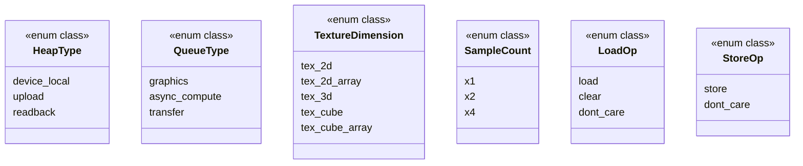

### 3. Resource Descriptors

`harmonius::gpu` -- Structs describing resource creation parameters. Usage flag
enums are bitmasks combined with bitwise OR.

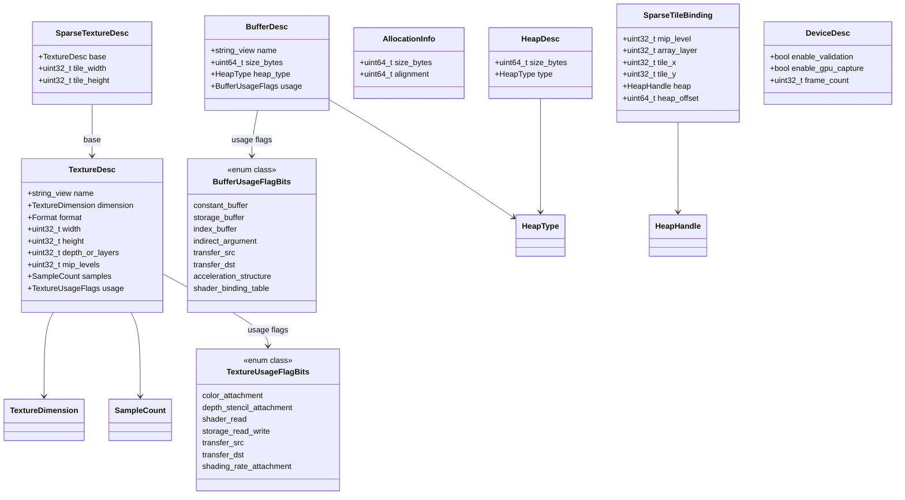

### 4. Acceleration Structures

`harmonius::gpu` -- Ray tracing acceleration structure creation and build types.

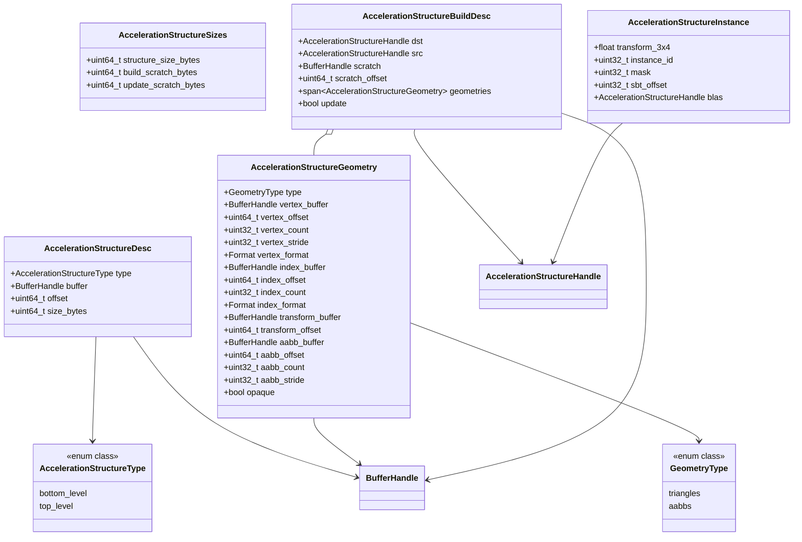

### 5. Synchronization Types

`harmonius::gpu` -- Barrier descriptors, pipeline stages, resource access masks,
texture layouts, and fence operations. The render graph compiler produces these
barrier descriptions; the backend translates them to native API calls.

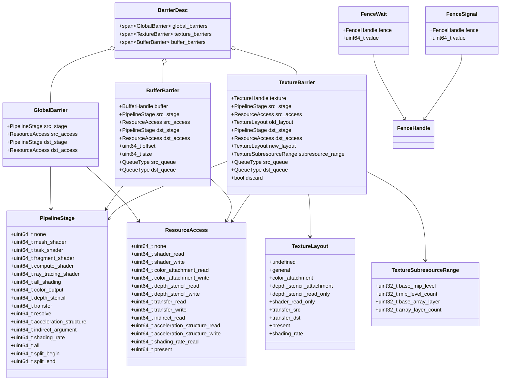

### 6. Render Pass Types

`harmonius::gpu` -- Attachment descriptors for render passes and viewport/scissor
state.

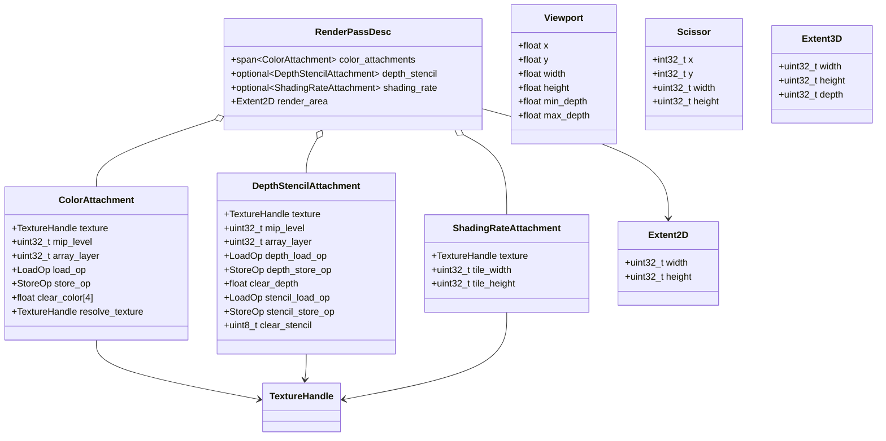

### 7. Pipeline State Types

`harmonius::gpu` -- Shader bytecode, pipeline descriptors for mesh render, compute,
ray tracing, work graphs, and associated render state blocks.

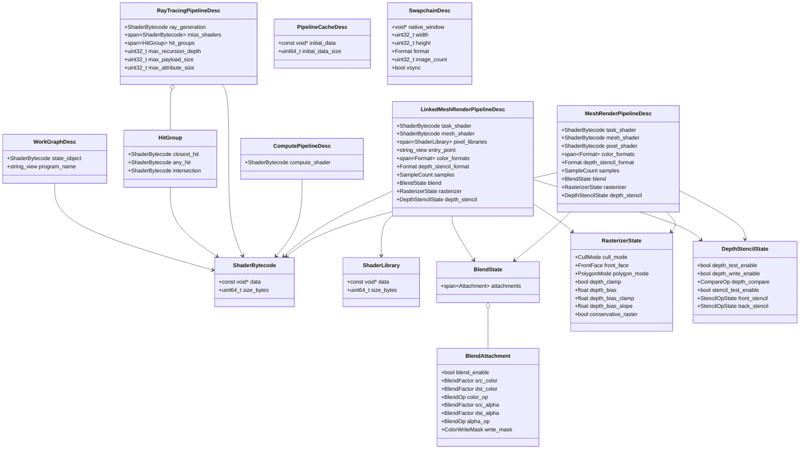

### 8. Resource Binding Types

`harmonius::gpu` -- Bindless descriptor heap and descriptor write operations.

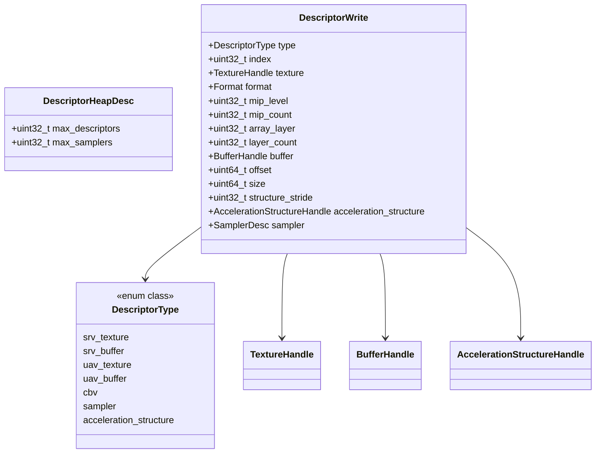

### 9. Diagnostics Types

`harmonius::gpu` -- Query pools for timestamp and pipeline statistics.

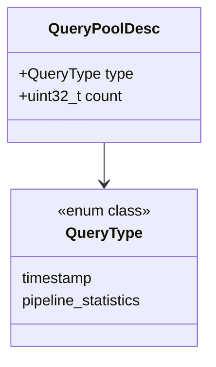

### 10. Indirect Command Types

`harmonius::gpu` -- GPU-side argument structs for indirect dispatch and ray tracing.

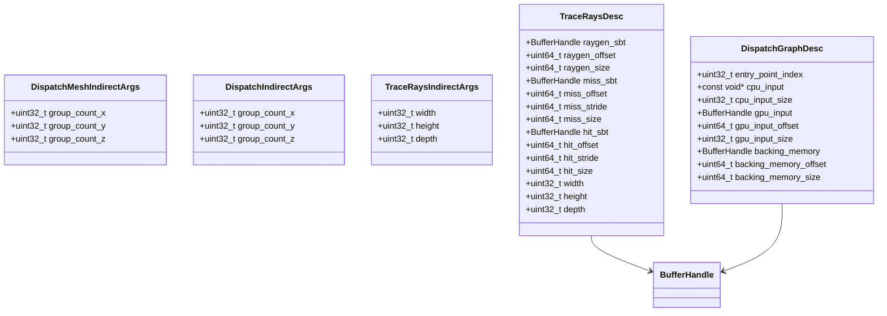

### 11. Device Capabilities

`harmonius::gpu` -- Feature flags and hardware limits queried at initialization.
Consumed by the render graph's gating system to enable or disable passes.

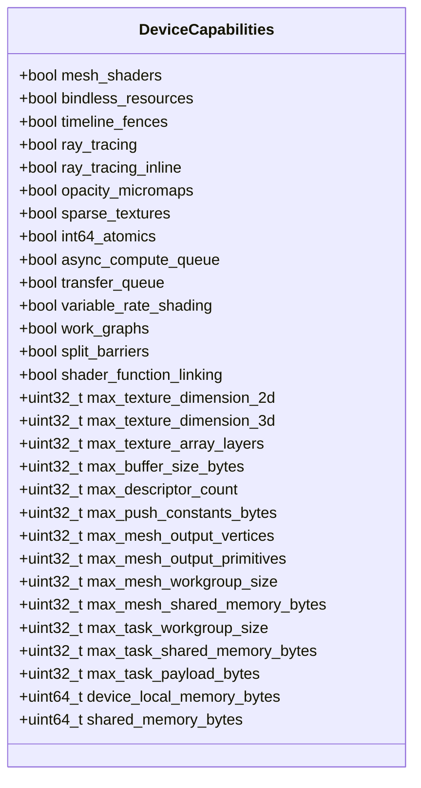

### 12. Error Types

`harmonius::gpu` -- Error enumerations returned from device and pipeline operations.

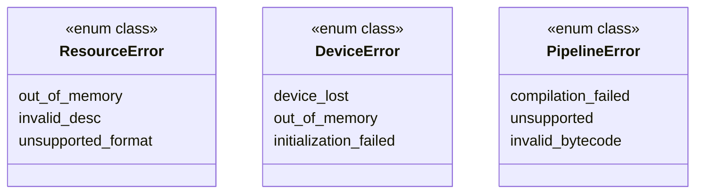

---

## Concepts

`harmonius::gpu` -- C++20 concepts defining the interface contracts. Each backend
provides a plain concrete class satisfying these concepts. No virtual dispatch, no
CRTP, no base classes. `static_assert` at the type alias site catches interface
violations at compile time.

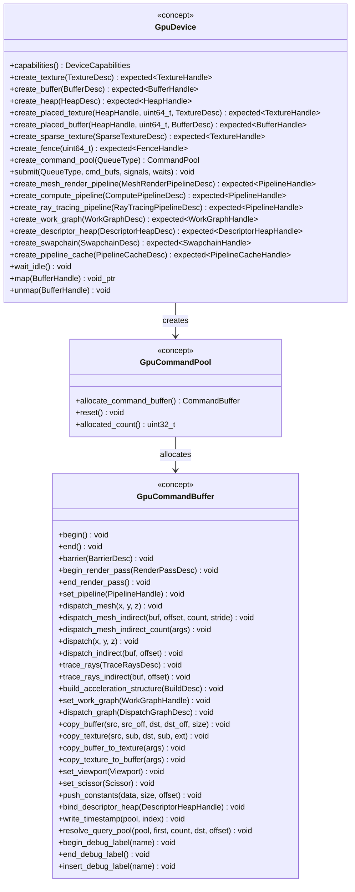

---

## Cross-Module Relationships

How the twelve type modules and three concepts connect. Arrows show which modules
depend on types from other modules.

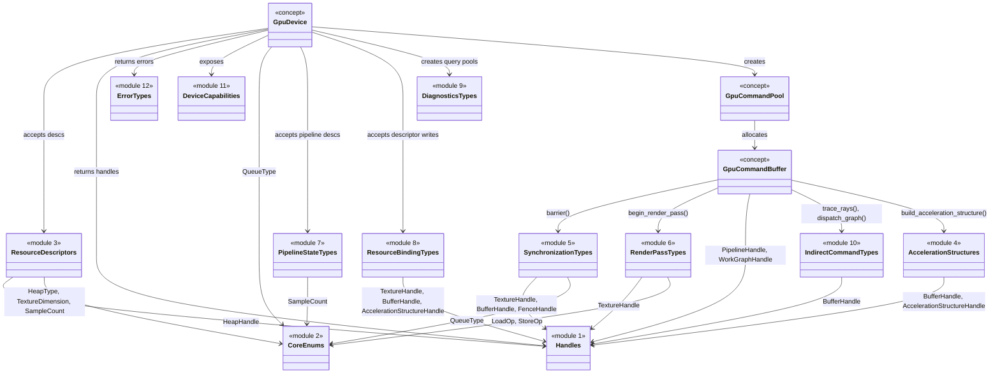

### Handle-to-Module Ownership

Which concept methods create and destroy each handle type.

| Handle | Created By | Destroyed By |
|--------|-----------|-------------|
| `TextureHandle` | `GpuDevice::create_texture`, `create_placed_texture`, `create_sparse_texture` | `GpuDevice::destroy_texture` |
| `BufferHandle` | `GpuDevice::create_buffer`, `create_placed_buffer` | `GpuDevice::destroy_buffer` |
| `HeapHandle` | `GpuDevice::create_heap` | `GpuDevice::destroy_heap` |
| `AccelerationStructureHandle` | `GpuDevice::create_acceleration_structure` | `GpuDevice::destroy_acceleration_structure` |
| `FenceHandle` | `GpuDevice::create_fence` | `GpuDevice::destroy_fence` |
| `PipelineHandle` | `GpuDevice::create_mesh_render_pipeline`, `create_compute_pipeline`, `create_ray_tracing_pipeline` | `GpuDevice::destroy_pipeline` |
| `WorkGraphHandle` | `GpuDevice::create_work_graph` | `GpuDevice::destroy_work_graph` |
| `DescriptorHeapHandle` | `GpuDevice::create_descriptor_heap` | `GpuDevice::destroy_descriptor_heap` |
| `QueryPoolHandle` | `GpuDevice::create_query_pool` | `GpuDevice::destroy_query_pool` |
| `SwapchainHandle` | `GpuDevice::create_swapchain` | `GpuDevice::destroy_swapchain` |
| `PipelineCacheHandle` | `GpuDevice::create_pipeline_cache` | `GpuDevice::destroy_pipeline_cache` |

---

## Sequence Diagrams

### Backend Selection and Type Aliasing

How the build system selects a backend, aliases concrete types, and verifies them
against concepts at compile time.

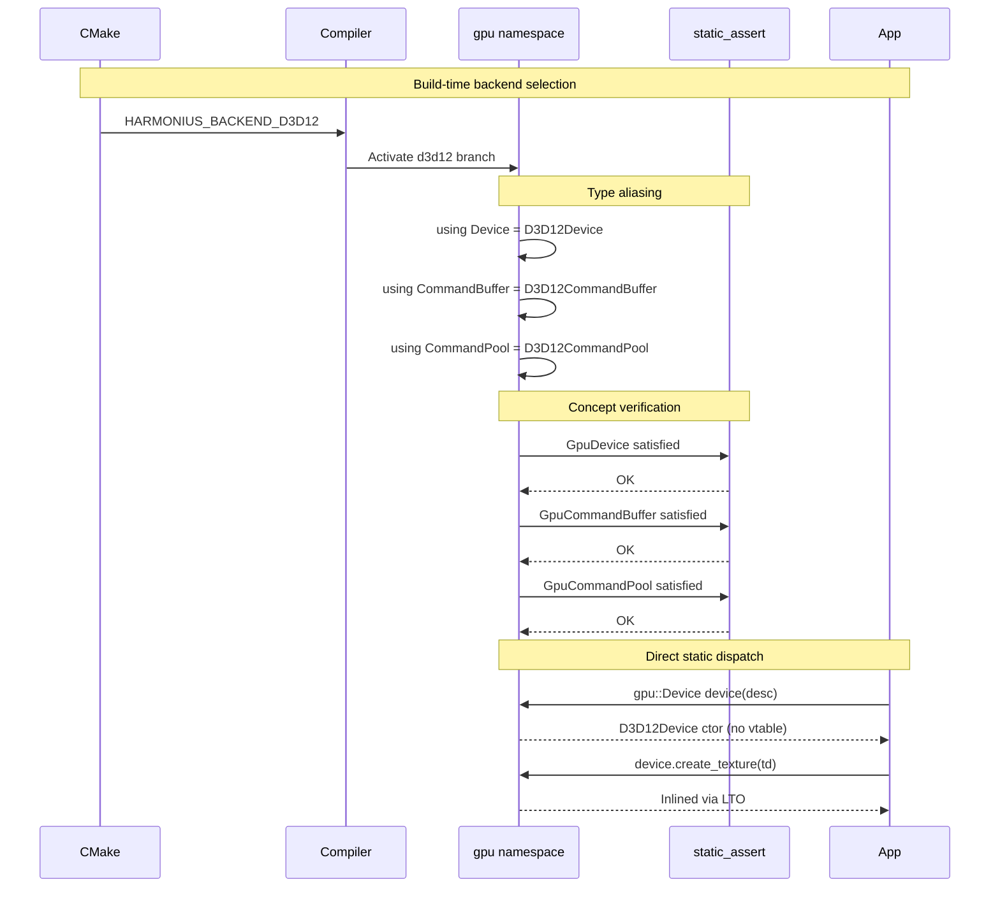

### Command Recording Lifecycle

Pool creation, command buffer allocation, recording, submission, and per-frame
reset.

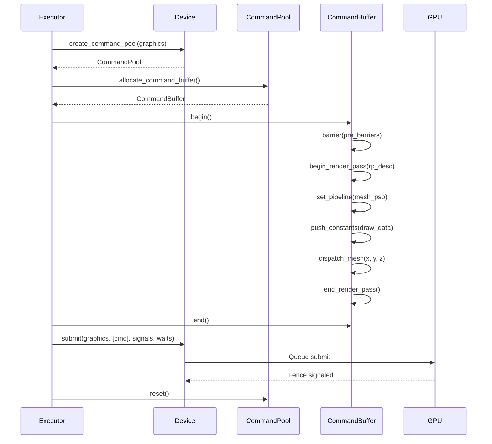

### Cross-Queue Synchronization with Timeline Fences

Three queues coordinated via monotonically increasing timeline fence values.
Transfer uploads first, async compute waits on transfer, graphics waits on
compute. CPU paces frames by waiting on the graphics fence.

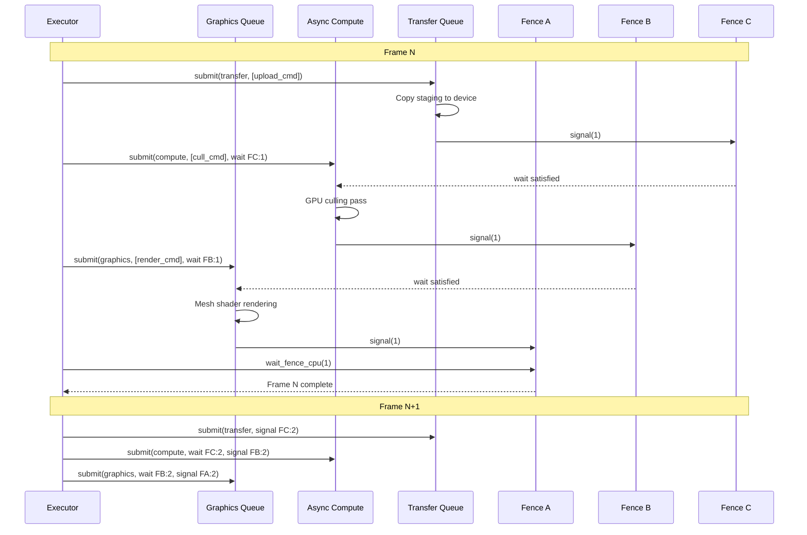
