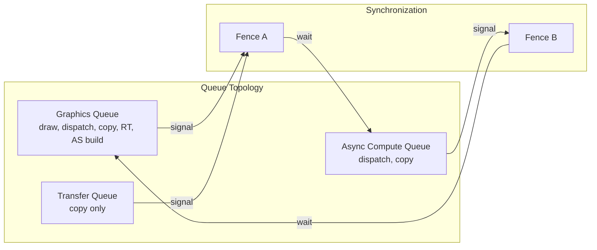
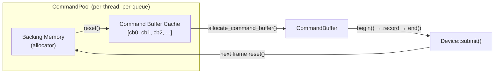
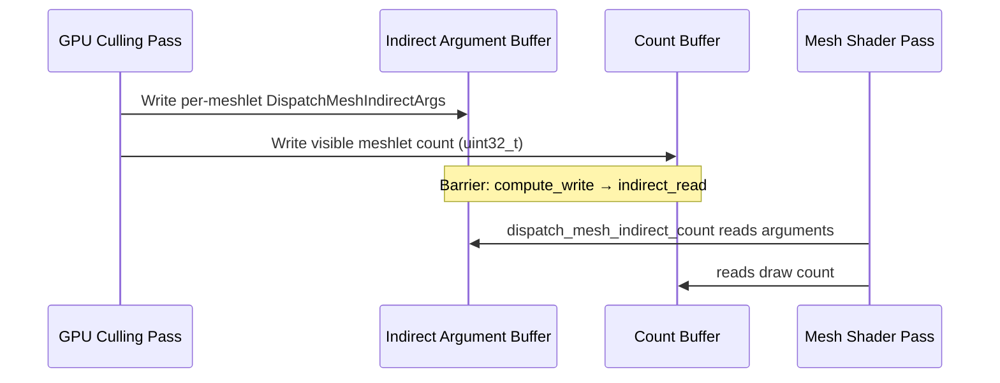

# GPU Backend Interface Design

Abstract interface layer (`harmonius::gpu`) providing the primitives the render graph builds on. Each
backend (D3D12, Vulkan, Metal) implements this interface using native API calls. Companion to
[render-graph-design.md](render-graph-design.md) and the backend-specific documents:

- [gpu-backend-d3d12.md](gpu-backend-d3d12.md)
- [gpu-backend-vulkan.md](gpu-backend-vulkan.md)
- [gpu-backend-metal.md](gpu-backend-metal.md)

**Requirements:** R-1.1.3 (mesh shaders only), R-1.1.5 (native backends), R-1.1.6 (modern hardware),
R-1.2.1–R-1.2.5 (platform support), R-3.2.1–R-3.2.7 (hardware requirements).

---

## Contents

- [Design Principles](#design-principles)
- [Backend Selection](#backend-selection)
- [Device](#device)
  - [Device Creation](#device-creation)
  - [Device Capabilities](#device-capabilities)
  - [Queue Topology](#queue-topology)
- [Resources](#resources)
  - [Resource Types](#resource-types)
  - [Texture Creation](#texture-creation)
  - [Buffer Creation](#buffer-creation)
  - [Heap and Placed Resources](#heap-and-placed-resources)
  - [Sparse Resources](#sparse-resources)
  - [Resource Mapping](#resource-mapping)
  - [Acceleration Structures](#acceleration-structures)
- [Command Recording](#command-recording)
  - [Command Pool](#command-pool)
  - [Command Buffer](#command-buffer)
  - [Render Pass Encoding](#render-pass-encoding)
  - [Compute Encoding](#compute-encoding)
  - [Transfer Encoding](#transfer-encoding)
  - [Mesh Shader Dispatch](#mesh-shader-dispatch)
  - [Ray Tracing Dispatch](#ray-tracing-dispatch)
  - [Work Graph Dispatch](#work-graph-dispatch)
  - [Indirect Commands](#indirect-commands)
- [Synchronization](#synchronization)
  - [Barriers](#barriers)
  - [Timeline Fences](#timeline-fences)
  - [Swapchain](#swapchain)
- [Pipeline State](#pipeline-state)
  - [Mesh Render Pipeline](#mesh-render-pipeline)
  - [Compute Pipeline](#compute-pipeline)
  - [Ray Tracing Pipeline](#ray-tracing-pipeline)
  - [Work Graph Program](#work-graph-program)
  - [Pipeline Cache](#pipeline-cache)
- [Resource Binding](#resource-binding)
  - [Bindless Descriptor Heap](#bindless-descriptor-heap)
  - [Push Constants](#push-constants)
  - [Root Constant Buffer](#root-constant-buffer)
- [Diagnostics](#diagnostics)
  - [Timestamp Queries](#timestamp-queries)
  - [Pipeline Statistics](#pipeline-statistics)
  - [Debug Labels](#debug-labels)
  - [Resource Naming](#resource-naming)
  - [Shader Debugging](#shader-debugging)
- [Format Mapping](#format-mapping)
- [Backend Mapping Tables](#backend-mapping-tables)
- [Cross-Backend Compatibility](#cross-backend-compatibility)
  - [Ray Tracing Model Divergence](#ray-tracing-model-divergence)
  - [Work Graphs (D3D12-Only)](#work-graphs-d3d12-only)
  - [Split Barriers](#split-barriers-1)
  - [Texture Layouts](#texture-layouts-image-layouts)
  - [Queue Ownership Transfers](#queue-ownership-transfers)
  - [Variable Rate Shading](#variable-rate-shading)
  - [Indirect Mesh Dispatch with Count Buffer](#indirect-mesh-dispatch-with-count-buffer)
  - [Push Constants Size](#push-constants-size)
  - [Residency Management](#residency-management)
  - [Error Types](#error-types)
  - [Opacity Micromaps](#opacity-micromaps)
  - [Capability Summary](#capability-summary)

---

## Design Principles

| Principle | Rationale |
|-----------|-----------|
| Thin abstraction | The interface adds no policy or caching — the render graph owns scheduling, aliasing, and barriers |
| C++20 concepts | Interface contracts are defined as concepts and enforced via `static_assert` — zero overhead, no vtables, no CRTP |
| Static linkage only | The GPU backend is statically linked into the render graph library — no shared/dynamic libraries |
| No legacy paths | No vertex/geometry/tessellation stages; mesh shaders are the sole geometry pipeline (R-1.1.3) |
| Native backends only | No translation layers (R-1.1.5); each backend maps directly to the native API |
| Explicit everything | Resource states, barriers, memory — nothing is implicit; the render graph compiler drives all transitions |

---

## Backend Selection

The backend is selected at **build time** via a CMake option. Only one backend is compiled into a
given binary — there is no runtime backend switching.

```cmake
# CMakeLists.txt — select exactly one backend
option(HARMONIUS_GPU_BACKEND "GPU backend" "")
# Automatically selected per platform if not specified:
#   Windows → d3d12  (or vulkan via explicit override)
#   Linux   → vulkan
#   macOS   → metal
```

### Concept-Based Static Dispatch

Interface contracts are defined as **C++20 concepts** (`GpuDevice`, `GpuCommandBuffer`,
`GpuCommandPool`) that constrain the concrete backend types. Each backend is a plain concrete
class — no base classes, no CRTP, no vtables. The concepts enforce method signatures at the
`static_assert` site, catching interface violations at compile time. Since only one backend is
compiled per binary, all calls resolve to direct method calls that the compiler can inline
through LTO. Each concept is defined in its respective section below:
- [`GpuDevice`](#device-creation) — resource creation, submission, synchronization
- [`GpuCommandPool`](#command-pool) — command buffer memory management
- [`GpuCommandBuffer`](#command-buffer) — recording commands

The build-time backend selection aliases the concrete types and verifies them against the concepts:

```cpp
namespace harmonius::gpu {

#if defined(HARMONIUS_BACKEND_D3D12)
    using Device        = d3d12::D3D12Device;
    using CommandBuffer = d3d12::D3D12CommandBuffer;
    using CommandPool   = d3d12::D3D12CommandPool;
#elif defined(HARMONIUS_BACKEND_VULKAN)
    using Device        = vulkan::VulkanDevice;
    using CommandBuffer = vulkan::VulkanCommandBuffer;
    using CommandPool   = vulkan::VulkanCommandPool;
#elif defined(HARMONIUS_BACKEND_METAL)
    using Device        = metal::MetalDevice;
    using CommandBuffer = metal::MetalCommandBuffer;
    using CommandPool   = metal::MetalCommandPool;
#else
    #error "No GPU backend selected. Set HARMONIUS_GPU_BACKEND in CMake."
#endif

// Compile-time verification — if a backend is missing any required method,
// the static_assert fires with a clear concept-violation diagnostic.
static_assert(GpuDevice<Device>);
static_assert(GpuCommandBuffer<CommandBuffer>);
static_assert(GpuCommandPool<CommandPool>);

} // namespace harmonius::gpu
```

**Why concepts over CRTP:** C++20 concepts define the interface contract without requiring base
classes or `impl_*` method naming conventions. Each backend is a plain concrete class — no
inheritance hierarchy, no template machinery, no forwarding boilerplate. The `static_assert`
at the type alias site catches missing or mistyped methods with clear diagnostics. The generated
code is identical to direct method calls on the concrete type.

**Why concepts over virtual dispatch:** The render graph records thousands of commands per frame
across multiple threads. Virtual method calls on `CommandBuffer` would add vtable indirection on
every draw, dispatch, barrier, and copy call. With concepts, all calls resolve to direct calls
on the concrete type. LTO can inline across the render graph and backend boundary.

**Why no shared library:** The GPU backend is tightly coupled to the render graph — they share
handle types, barrier descriptors, and pipeline state. A shared library boundary would force stable
ABI guarantees and prevent inlining across the boundary. Static linkage allows LTO to optimize
across the render graph and backend together.

---

## Device

### Device Creation

```cpp
namespace harmonius::gpu {

struct DeviceDesc {
    bool enable_validation  = false;   // debug layer / validation layers
    bool enable_gpu_capture = false;   // PIX / RenderDoc / Xcode GPU capture
    uint32_t frame_count    = 3;       // triple buffering (R-3.1.7)
};

} // namespace harmonius::gpu
```

The `GpuDevice` concept defines the full Device interface. Each backend provides a plain concrete
class satisfying this concept. Device methods are categorized:
- Resource creation (not hot path — called during init and recompilation)
- Submission (moderate path — called once per queue per frame)
- Query (cold path — called at init or for diagnostics)

All hot-path recording goes through CommandBuffer (see below).

```cpp
namespace harmonius::gpu {

template <typename D>
concept GpuDevice = requires(D d, const D cd,
        const TextureDesc& td, const BufferDesc& bd,
        const HeapDesc& hd, const SparseTextureDesc& stexd,
        const AccelerationStructureDesc& asd,
        const MeshRenderPipelineDesc& mrpd,
        const ComputePipelineDesc& cpd,
        const RayTracingPipelineDesc& rtpd,
        const WorkGraphDesc& wgd,
        const DescriptorHeapDesc& dhd,
        const QueryPoolDesc& qpd,
        const SwapchainDesc& scd,
        const PipelineCacheDesc& pcached,
        TextureHandle th, BufferHandle bh, HeapHandle hh,
        AccelerationStructureHandle ash,
        FenceHandle fh, PipelineHandle ph,
        WorkGraphHandle wgh, DescriptorHeapHandle dhh,
        QueryPoolHandle qph, SwapchainHandle swh,
        PipelineCacheHandle pch, QueueType qt) {

    { cd.capabilities() } -> std::same_as<DeviceCapabilities>;
    { cd.queue_count(qt) } -> std::same_as<uint32_t>;

    { d.create_texture(td) }
        -> std::same_as<std::expected<TextureHandle, ResourceError>>;
    { d.create_buffer(bd) }
        -> std::same_as<std::expected<BufferHandle, ResourceError>>;
    { d.destroy_texture(th) } -> std::same_as<void>;
    { d.destroy_buffer(bh) } -> std::same_as<void>;

    { d.create_heap(hd) }
        -> std::same_as<std::expected<HeapHandle, ResourceError>>;
    { d.create_placed_texture(hh, uint64_t{}, td) }
        -> std::same_as<std::expected<TextureHandle, ResourceError>>;
    { d.create_placed_buffer(hh, uint64_t{}, bd) }
        -> std::same_as<std::expected<BufferHandle, ResourceError>>;
    { d.destroy_heap(hh) } -> std::same_as<void>;

    { d.create_sparse_texture(stexd) }
        -> std::same_as<std::expected<TextureHandle, ResourceError>>;
    { d.update_sparse_bindings(th, std::span<const SparseTileBinding>{}) }
        -> std::same_as<void>;

    { d.map(bh) } -> std::same_as<void*>;
    { d.unmap(bh) } -> std::same_as<void>;

    { d.create_acceleration_structure(asd) }
        -> std::same_as<std::expected<AccelerationStructureHandle, ResourceError>>;
    { cd.query_acceleration_structure_sizes(asd) }
        -> std::same_as<AccelerationStructureSizes>;
    { d.destroy_acceleration_structure(ash) } -> std::same_as<void>;

    { d.create_fence(uint64_t{}) }
        -> std::same_as<std::expected<FenceHandle, DeviceError>>;
    { d.destroy_fence(fh) } -> std::same_as<void>;
    { cd.fence_completed_value(fh) } -> std::same_as<uint64_t>;
    { d.wait_fence_cpu(fh, uint64_t{}) } -> std::same_as<void>;

    { d.create_command_pool(qt) };
    requires GpuCommandPool<decltype(d.create_command_pool(qt))>;

    { d.submit(qt,
               std::span<typename D::CommandBufferType*>{},
               std::span<const FenceSignal>{},
               std::span<const FenceWait>{}) } -> std::same_as<void>;

    { d.create_mesh_render_pipeline(mrpd) }
        -> std::same_as<std::expected<PipelineHandle, PipelineError>>;
    { d.create_compute_pipeline(cpd) }
        -> std::same_as<std::expected<PipelineHandle, PipelineError>>;
    { d.create_ray_tracing_pipeline(rtpd) }
        -> std::same_as<std::expected<PipelineHandle, PipelineError>>;
    { d.create_work_graph(wgd) }
        -> std::same_as<std::expected<WorkGraphHandle, PipelineError>>;
    { d.destroy_pipeline(ph) } -> std::same_as<void>;
    { d.destroy_work_graph(wgh) } -> std::same_as<void>;

    { d.create_descriptor_heap(dhd) }
        -> std::same_as<std::expected<DescriptorHeapHandle, DeviceError>>;
    { d.write_descriptor(dhh, uint32_t{}, DescriptorWrite{}) }
        -> std::same_as<void>;
    { d.destroy_descriptor_heap(dhh) } -> std::same_as<void>;

    { d.create_query_pool(qpd) }
        -> std::same_as<std::expected<QueryPoolHandle, DeviceError>>;
    { d.destroy_query_pool(qph) } -> std::same_as<void>;
    { cd.timestamp_period_ns() } -> std::same_as<double>;

    { d.create_swapchain(scd) }
        -> std::same_as<std::expected<SwapchainHandle, DeviceError>>;
    { d.acquire_next_image(swh) }
        -> std::same_as<std::expected<TextureHandle, DeviceError>>;
    { d.present(swh) } -> std::same_as<void>;
    { d.resize_swapchain(swh, uint32_t{}, uint32_t{}) } -> std::same_as<void>;
    { d.destroy_swapchain(swh) } -> std::same_as<void>;

    { d.set_name(th, std::string_view{}) } -> std::same_as<void>;
    { d.set_name(bh, std::string_view{}) } -> std::same_as<void>;
    { d.set_name(ash, std::string_view{}) } -> std::same_as<void>;
    { d.set_name(ph, std::string_view{}) } -> std::same_as<void>;
    { d.set_name(fh, std::string_view{}) } -> std::same_as<void>;

    { d.wait_idle() } -> std::same_as<void>;

    { d.create_pipeline_cache(pcached) }
        -> std::same_as<std::expected<PipelineCacheHandle, DeviceError>>;
    { d.serialize_pipeline_cache(pch) } -> std::same_as<std::vector<uint8_t>>;
    { d.destroy_pipeline_cache(pch) } -> std::same_as<void>;
};

} // namespace harmonius::gpu
```

### Device Capabilities

Queried at initialization and used by the render graph's gating system (RG-6.1–6.7).

```cpp
namespace harmonius::gpu {

struct DeviceCapabilities {
    // --- Required capabilities (initialization fails without these) ---
    bool mesh_shaders             = false;  // R-3.2.2
    bool bindless_resources       = false;  // R-3.2.1
    bool timeline_fences          = false;  // R-3.2.5

    // --- Soft-gated capabilities ---
    bool ray_tracing              = false;  // R-3.2.3
    bool ray_tracing_inline       = false;  // ray queries in any shader stage
    bool opacity_micromaps        = false;  // RG-2.25
    bool sparse_textures          = false;  // R-3.2.6
    bool int64_atomics            = false;  // R-3.2.7
    bool async_compute_queue      = false;  // R-3.2.4
    bool transfer_queue           = false;  // R-3.2.4
    bool variable_rate_shading    = false;
    bool work_graphs              = false;
    bool split_barriers           = false;
    bool shader_function_linking  = false;  // D3D12: ID3D12FunctionLinkingGraph,
                                            // Vulkan: VK_EXT_graphics_pipeline_library,
                                            // Metal: MTLStitchedLibrary

    // --- Limits ---
    uint32_t max_texture_dimension_2d     = 0;
    uint32_t max_texture_dimension_3d     = 0;
    uint32_t max_texture_array_layers     = 0;
    uint32_t max_buffer_size_bytes        = 0;
    uint32_t max_descriptor_count         = 0;
    uint32_t max_push_constants_bytes     = 0;

    // --- Mesh shader limits ---
    uint32_t max_mesh_output_vertices     = 0;
    uint32_t max_mesh_output_primitives   = 0;
    uint32_t max_mesh_workgroup_size      = 0;
    uint32_t max_mesh_shared_memory_bytes = 0;
    uint32_t max_task_workgroup_size      = 0;
    uint32_t max_task_shared_memory_bytes = 0;
    uint32_t max_task_payload_bytes       = 0;

    // --- Memory ---
    uint64_t device_local_memory_bytes    = 0;
    uint64_t shared_memory_bytes          = 0; // unified / host-visible
};

} // namespace harmonius::gpu
```

### Queue Topology

```cpp
namespace harmonius::gpu {

enum class QueueType : uint8_t {
    graphics,       // supports all operations
    async_compute,  // compute + copy
    transfer,       // copy only
};

struct FenceSignal {
    FenceHandle fence;
    uint64_t    value;
};

struct FenceWait {
    FenceHandle fence;
    uint64_t    value;
};

} // namespace harmonius::gpu
```



---

## Resources

### Resource Types

```cpp
namespace harmonius::gpu {

// Opaque handles — backend stores implementation-specific data
enum class TextureHandle : uint64_t { invalid = 0 };
enum class BufferHandle : uint64_t { invalid = 0 };
enum class HeapHandle : uint64_t { invalid = 0 };
enum class AccelerationStructureHandle : uint64_t { invalid = 0 };

enum class HeapType : uint8_t {
    device_local,   // GPU-only memory (DEFAULT / DEVICE_LOCAL / private)
    upload,         // CPU-writable, GPU-readable (UPLOAD / HOST_VISIBLE | HOST_COHERENT / shared)
    readback,       // GPU-writable, CPU-readable (READBACK / HOST_VISIBLE | HOST_CACHED / shared)
};

} // namespace harmonius::gpu
```

### Texture Creation

```cpp
namespace harmonius::gpu {

enum class TextureDimension : uint8_t {
    tex_2d,
    tex_2d_array,
    tex_3d,
    tex_cube,
    tex_cube_array,
};

struct TextureDesc {
    std::string_view   name;
    TextureDimension   dimension       = TextureDimension::tex_2d;
    Format             format          = Format::rgba8_unorm;
    uint32_t           width           = 1;
    uint32_t           height          = 1;
    uint32_t           depth_or_layers = 1;
    uint32_t           mip_levels      = 1;
    SampleCount        samples         = SampleCount::x1;
    TextureUsageFlags  usage           = {};
};

enum class TextureUsageFlagBits : uint32_t {
    color_attachment              = 1 << 0,
    depth_stencil_attachment      = 1 << 1,
    shader_read                   = 1 << 2,
    storage_read_write            = 1 << 3,
    transfer_src                  = 1 << 4,
    transfer_dst                  = 1 << 5,
    shading_rate_attachment       = 1 << 6,
};
using TextureUsageFlags = uint32_t;

enum class SampleCount : uint8_t { x1 = 1, x2 = 2, x4 = 4 };

} // namespace harmonius::gpu
```

### Buffer Creation

```cpp
namespace harmonius::gpu {

struct BufferDesc {
    std::string_view   name;
    uint64_t           size_bytes  = 0;
    HeapType           heap_type   = HeapType::device_local;
    BufferUsageFlags   usage       = {};
};

enum class BufferUsageFlagBits : uint32_t {
    constant_buffer         = 1 << 0,
    storage_buffer          = 1 << 1,
    index_buffer            = 1 << 2,
    indirect_argument       = 1 << 3,
    transfer_src            = 1 << 4,
    transfer_dst            = 1 << 5,
    acceleration_structure  = 1 << 6,
    shader_binding_table    = 1 << 7,
};
using BufferUsageFlags = uint32_t;

} // namespace harmonius::gpu
```

### Heap and Placed Resources

Used by the render graph's aliasing system (RG-8.1–8.6) to sub-allocate transient resources from
shared heaps.

```cpp
namespace harmonius::gpu {

struct HeapDesc {
    uint64_t size_bytes = 0;
    HeapType type       = HeapType::device_local;
};

struct AllocationInfo {
    uint64_t size_bytes  = 0;
    uint64_t alignment   = 0;
};

/// Query the size and alignment a resource would require if placed in a heap.
[[nodiscard]]
AllocationInfo query_texture_allocation_info(const TextureDesc& desc);

[[nodiscard]]
AllocationInfo query_buffer_allocation_info(const BufferDesc& desc);

} // namespace harmonius::gpu
```

### Sparse Resources

```cpp
namespace harmonius::gpu {

struct SparseTextureDesc {
    TextureDesc  base;
    uint32_t     tile_width  = 256;  // texels per tile (hardware-dependent)
    uint32_t     tile_height = 256;
};

struct SparseTileBinding {
    uint32_t     mip_level;
    uint32_t     array_layer;
    uint32_t     tile_x;
    uint32_t     tile_y;
    HeapHandle   heap;         // source heap (invalid = unmap tile)
    uint64_t     heap_offset;
};

} // namespace harmonius::gpu
```

### Resource Mapping

```cpp
namespace harmonius::gpu {

/// Map a buffer for CPU access.
/// Only valid for upload and readback heap types.
/// Returns a pointer valid until unmap() is called.
void* map(BufferHandle handle);
void  unmap(BufferHandle handle);

} // namespace harmonius::gpu
```

### Acceleration Structures

```cpp
namespace harmonius::gpu {

enum class AccelerationStructureType : uint8_t {
    bottom_level,   // BLAS — triangle/AABB geometry
    top_level,      // TLAS — instances referencing BLASes
};

struct AccelerationStructureDesc {
    AccelerationStructureType type;
    BufferHandle              buffer;
    uint64_t                  offset      = 0;
    uint64_t                  size_bytes  = 0;
};

struct AccelerationStructureSizes {
    uint64_t structure_size_bytes = 0;
    uint64_t build_scratch_bytes  = 0;
    uint64_t update_scratch_bytes = 0;
};

struct AccelerationStructureGeometry {
    enum class GeometryType : uint8_t { triangles, aabbs };
    GeometryType type;

    // For triangles:
    BufferHandle vertex_buffer;
    uint64_t     vertex_offset       = 0;
    uint32_t     vertex_count        = 0;
    uint32_t     vertex_stride       = 0;
    Format       vertex_format       = Format::rgb32_float;
    BufferHandle index_buffer;
    uint64_t     index_offset        = 0;
    uint32_t     index_count         = 0;
    Format       index_format        = Format::r32_uint;
    BufferHandle transform_buffer;
    uint64_t     transform_offset    = 0;

    // For AABBs:
    BufferHandle aabb_buffer;
    uint64_t     aabb_offset         = 0;
    uint32_t     aabb_count          = 0;
    uint32_t     aabb_stride         = 0;

    bool opaque = true;
};

struct AccelerationStructureBuildDesc {
    AccelerationStructureHandle              dst;
    AccelerationStructureHandle              src;       // for updates
    BufferHandle                             scratch;
    uint64_t                                 scratch_offset = 0;
    std::span<const AccelerationStructureGeometry> geometries;
    bool                                     update     = false;
};

struct AccelerationStructureInstance {
    float                          transform[3][4];
    uint32_t                       instance_id       = 0;
    uint32_t                       mask               = 0xFF;
    uint32_t                       sbt_offset         = 0;
    AccelerationStructureHandle    blas;
};

} // namespace harmonius::gpu
```

---

## Command Recording

### Command Pool

One pool per queue type per thread. The render graph's `CommandBufferPool` (RG-10.2) wraps this.
The pool owns all backing memory for its command buffers — resetting the pool recycles all memory
in a single operation, avoiding per-buffer deallocation.

```cpp
namespace harmonius::gpu {

enum class CommandPoolHandle : uint64_t { invalid = 0 };
enum class CommandBufferHandle : uint64_t { invalid = 0 };

template <typename P>
concept GpuCommandPool = requires(P p, const P cp) {
    { p.allocate_command_buffer() };
    { p.reset() } -> std::same_as<void>;
    { cp.allocated_count() } -> std::convertible_to<uint32_t>;
};

} // namespace harmonius::gpu
```

Each backend provides a concrete pool class satisfying `GpuCommandPool`:

```cpp
// D3D12 example — plain concrete class, no base class:
class D3D12CommandPool {
public:
    D3D12CommandBuffer allocate_command_buffer();
    void reset();
    uint32_t allocated_count() const;

private:
    ComPtr<ID3D12CommandAllocator> allocator_;
    std::vector<ComPtr<ID3D12GraphicsCommandList10>> cached_lists_;
    uint32_t next_free_ = 0;
};
static_assert(GpuCommandPool<D3D12CommandPool>);
```

**Memory management strategy:** Each pool maintains a cache of previously created command buffers.
`allocate_command_buffer()` returns a cached buffer when available, or creates a new one if the
cache is exhausted. `reset()` resets the underlying allocator memory and returns all buffers to
the cache. This avoids per-frame allocation and deallocation overhead.



| Backend | Pool Creation | Buffer Allocation | Pool Reset |
|---------|--------------|-------------------|------------|
| D3D12 | `CreateCommandAllocator(type)` | Reuse cached `ID3D12GraphicsCommandList10` or `CreateCommandList1(type, nullptr)` (closed state) | `ID3D12CommandAllocator::Reset()` — recycles all GPU-side memory; cached lists remain valid |
| Vulkan | `vkCreateCommandPool(poolInfo)` with `RESET_COMMAND_BUFFER_BIT` | `vkAllocateCommandBuffers` from pool, or reuse cached | `vkResetCommandPool(pool, 0)` — all buffers return to initial state |
| Metal | Create `MTL4CommandAllocator` from device | `[allocator commandBuffer]` — lightweight, pool-backed | `[allocator reset]` — recycles all command buffer memory |

**Thread safety:** Each pool is **single-threaded by design**. The render graph assigns one pool
per (queue type, thread) pair. No locking is needed within a pool. The execution engine dispatches
encoding groups to threads, each thread uses its own pool, and the main thread resets all pools
after the frame fence signals completion.

### Command Buffer

The command buffer is the **hottest path** in the renderer — called thousands of times per frame
across multiple threads. All dispatch is static — no vtables, no indirection.

Each backend provides a concrete class satisfying the `GpuCommandBuffer` concept.
`gpu::CommandBuffer` is a type alias to the concrete backend class. The render graph's
`PassContext::cmd()` returns a `gpu::CommandBuffer&` — a direct reference to the concrete
type. All calls are direct method calls that the compiler and LTO can inline.

```cpp
namespace harmonius::gpu {

template <typename B>
concept GpuCommandBuffer = requires(B b,
        const BarrierDesc& bd, const RenderPassDesc& rpd,
        PipelineHandle ph, BufferHandle bh, TextureHandle th,
        WorkGraphHandle wgh, QueryPoolHandle qph, DescriptorHeapHandle dhh,
        const AccelerationStructureBuildDesc& asbuild,
        const TraceRaysDesc& trd, const DispatchGraphDesc& dgd,
        const TextureSubresource& tsub, const Viewport& vp, const Scissor& sc,
        Extent3D ext) {

    { b.begin() } -> std::same_as<void>;
    { b.end() } -> std::same_as<void>;

    { b.barrier(bd) } -> std::same_as<void>;

    { b.begin_render_pass(rpd) } -> std::same_as<void>;
    { b.end_render_pass() } -> std::same_as<void>;

    { b.set_pipeline(ph) } -> std::same_as<void>;

    { b.dispatch_mesh(uint32_t{}, uint32_t{}, uint32_t{}) } -> std::same_as<void>;
    { b.dispatch_mesh_indirect(bh, uint64_t{}, uint32_t{}, uint32_t{}) }
        -> std::same_as<void>;
    { b.dispatch_mesh_indirect_count(bh, uint64_t{}, bh, uint64_t{},
                                     uint32_t{}, uint32_t{}) }
        -> std::same_as<void>;

    { b.dispatch(uint32_t{}, uint32_t{}, uint32_t{}) } -> std::same_as<void>;
    { b.dispatch_indirect(bh, uint64_t{}) } -> std::same_as<void>;

    { b.trace_rays(trd) } -> std::same_as<void>;
    { b.trace_rays_indirect(bh, uint64_t{}) } -> std::same_as<void>;

    { b.build_acceleration_structure(asbuild) } -> std::same_as<void>;

    { b.set_work_graph(wgh) } -> std::same_as<void>;
    { b.dispatch_graph(dgd) } -> std::same_as<void>;

    { b.copy_buffer(bh, uint64_t{}, bh, uint64_t{}, uint64_t{}) }
        -> std::same_as<void>;
    { b.copy_texture(th, tsub, th, tsub, ext) } -> std::same_as<void>;
    { b.copy_buffer_to_texture(bh, uint64_t{}, th, tsub, ext) }
        -> std::same_as<void>;
    { b.copy_texture_to_buffer(th, tsub, bh, uint64_t{}, ext) }
        -> std::same_as<void>;

    { b.set_viewport(vp) } -> std::same_as<void>;
    { b.set_scissor(sc) } -> std::same_as<void>;

    { b.push_constants(static_cast<const void*>(nullptr),
                       uint32_t{}, uint32_t{}) } -> std::same_as<void>;

    { b.bind_descriptor_heap(dhh) } -> std::same_as<void>;

    { b.write_timestamp(qph, uint32_t{}) } -> std::same_as<void>;
    { b.resolve_query_pool(qph, uint32_t{}, uint32_t{}, bh, uint64_t{}) }
        -> std::same_as<void>;

    { b.begin_debug_label(std::string_view{}) } -> std::same_as<void>;
    { b.end_debug_label() } -> std::same_as<void>;
    { b.insert_debug_label(std::string_view{}) } -> std::same_as<void>;
};

} // namespace harmonius::gpu
```

**Recording lifecycle:** Every command buffer must be opened with `begin()` before recording any
commands, and closed with `end()` before submission. The execution engine calls these around each
encoding group.

| Operation | D3D12 | Vulkan | Metal |
|-----------|-------|--------|-------|
| `begin()` | `ID3D12GraphicsCommandList::Reset(allocator, nullptr)` | `vkBeginCommandBuffer(buf, &beginInfo)` | Implicit — `MTL4CommandBuffer` is recording-ready from allocation |
| `end()` | `ID3D12GraphicsCommandList::Close()` | `vkEndCommandBuffer(buf)` | `[encoder endEncoding]` on active encoder (if any) |

### Render Pass Encoding

```cpp
namespace harmonius::gpu {

struct ColorAttachment {
    TextureHandle   texture;
    uint32_t        mip_level    = 0;
    uint32_t        array_layer  = 0;
    LoadOp          load_op      = LoadOp::clear;
    StoreOp         store_op     = StoreOp::store;
    float           clear_color[4] = {0, 0, 0, 0};
    TextureHandle   resolve_texture;  // for MSAA resolve
};

struct DepthStencilAttachment {
    TextureHandle   texture;
    uint32_t        mip_level      = 0;
    uint32_t        array_layer    = 0;
    LoadOp          depth_load_op  = LoadOp::clear;
    StoreOp         depth_store_op = StoreOp::store;
    float           clear_depth    = 1.0f;
    LoadOp          stencil_load_op  = LoadOp::dont_care;
    StoreOp         stencil_store_op = StoreOp::dont_care;
    uint8_t         clear_stencil    = 0;
};

struct ShadingRateAttachment {
    TextureHandle   texture;
    uint32_t        tile_width  = 16;
    uint32_t        tile_height = 16;
};

struct RenderPassDesc {
    std::span<const ColorAttachment>      color_attachments;
    std::optional<DepthStencilAttachment> depth_stencil;
    std::optional<ShadingRateAttachment>  shading_rate;
    Extent2D                              render_area;
};

enum class LoadOp : uint8_t { load, clear, dont_care };
enum class StoreOp : uint8_t { store, dont_care };

struct Extent2D { uint32_t width = 0; uint32_t height = 0; };
struct Extent3D { uint32_t width = 0; uint32_t height = 0; uint32_t depth = 1; };

struct Viewport {
    float x = 0, y = 0, width = 0, height = 0;
    float min_depth = 0, max_depth = 1;
};

struct Scissor {
    int32_t  x = 0, y = 0;
    uint32_t width = 0, height = 0;
};

} // namespace harmonius::gpu
```

**Render target management:** The abstract interface does not expose render target views (RTVs)
or framebuffers. Instead, `begin_render_pass` accepts `TextureHandle` references with mip/layer
targeting, and the backend creates transient views internally:

| Backend | Render Target Mechanism |
|---------|------------------------|
| D3D12 | Creates `D3D12_RENDER_TARGET_VIEW_DESC` in a non-shader-visible RTV heap; creates `D3D12_DEPTH_STENCIL_VIEW_DESC` in a DSV heap. Views are cached and reused per unique (texture, mip, layer) triple. Passed to `OMSetRenderTargets` inside `BeginRenderPass`. |
| Vulkan | Uses dynamic rendering (`vkCmdBeginRendering` / `VkRenderingInfo`). Creates `VkImageView` per unique (image, mip, layer, format) tuple. Views are cached in a frame-ring and destroyed when the frame completes. |
| Metal | Sets color/depth attachments directly on `MTLRenderPassDescriptor`. Metal does not require explicit view objects — the texture, level, and slice are set as properties on `MTLRenderPassColorAttachmentDescriptor`. |

### Compute Encoding

Compute work is recorded directly on the command buffer without a sub-encoder:

```cpp
cmd->set_pipeline(compute_pso);
cmd->push_constants(&per_dispatch_data, sizeof(per_dispatch_data));
cmd->dispatch(groups_x, groups_y, groups_z);
```

### Transfer Encoding

Transfer-only commands for the copy queue:

```cpp
cmd->copy_buffer(src, src_offset, dst, dst_offset, size);
cmd->copy_buffer_to_texture(staging, offset, texture, subresource, extent);
```

### Mesh Shader Dispatch

The sole geometry dispatch path (R-1.1.3). No vertex/geometry/tessellation draw calls exist.

```cpp
// Direct dispatch — launches threadgroups for task/mesh pipeline
cmd->dispatch_mesh(groups_x, groups_y, groups_z);

// GPU-driven indirect dispatch — arguments read from buffer
cmd->dispatch_mesh_indirect(argument_buffer, offset, draw_count, stride);

// Indirect with count — draw count also read from buffer
cmd->dispatch_mesh_indirect_count(
    argument_buffer, arg_offset,
    count_buffer, count_offset,
    max_draw_count, stride
);
```

### Ray Tracing Dispatch

```cpp
namespace harmonius::gpu {

struct TraceRaysDesc {
    BufferHandle raygen_sbt;
    uint64_t     raygen_offset;
    uint64_t     raygen_size;
    BufferHandle miss_sbt;
    uint64_t     miss_offset;
    uint64_t     miss_stride;
    uint64_t     miss_size;
    BufferHandle hit_sbt;
    uint64_t     hit_offset;
    uint64_t     hit_stride;
    uint64_t     hit_size;
    uint32_t     width;
    uint32_t     height;
    uint32_t     depth = 1;
};

} // namespace harmonius::gpu
```

### Work Graph Dispatch

```cpp
namespace harmonius::gpu {

struct DispatchGraphDesc {
    uint32_t          entry_point_index = 0;
    const void*       cpu_input         = nullptr;
    uint32_t          cpu_input_size    = 0;
    BufferHandle      gpu_input;
    uint64_t          gpu_input_offset  = 0;
    uint32_t          gpu_input_size    = 0;
    BufferHandle      backing_memory;
    uint64_t          backing_memory_offset = 0;
    uint64_t          backing_memory_size   = 0;
};

} // namespace harmonius::gpu
```

### Indirect Commands

GPU-driven rendering (R-1.1.2) requires all dispatch to originate from indirect buffers populated
by compute culling passes. The indirect argument structs define the GPU-side buffer layout.

```cpp
namespace harmonius::gpu {

/// Mesh shader indirect arguments — written by GPU culling pass, consumed by dispatch_mesh_indirect.
struct DispatchMeshIndirectArgs {
    uint32_t group_count_x;
    uint32_t group_count_y;
    uint32_t group_count_z;
};

/// Compute indirect arguments — written by GPU, consumed by dispatch_indirect.
struct DispatchIndirectArgs {
    uint32_t group_count_x;
    uint32_t group_count_y;
    uint32_t group_count_z;
};

/// Ray tracing indirect arguments — consumed by trace_rays_indirect.
struct TraceRaysIndirectArgs {
    uint32_t width;
    uint32_t height;
    uint32_t depth;
};

} // namespace harmonius::gpu
```

**Multi-draw indirect with count:** The `dispatch_mesh_indirect_count` variant reads both the
argument buffer and a separate count buffer. The count buffer contains a `uint32_t` draw count
written by a preceding compute pass. This is the primary path for GPU-driven mesh rendering:



| Backend | Indirect Count Mechanism |
|---------|------------------------|
| D3D12 | `ExecuteIndirect` with `D3D12_INDIRECT_ARGUMENT_TYPE_DISPATCH_MESH` command signature; count buffer passed as `pCountBuffer` parameter |
| Vulkan | `vkCmdDrawMeshTasksIndirectCountEXT(commandBuffer, buffer, offset, countBuffer, countBufferOffset, maxDrawCount, stride)` |
| Metal | `drawMeshThreadgroupsWithIndirectBuffer:indirectBufferOffset:threadsPerObjectThreadgroup:threadsPerMeshThreadgroup:` (count from buffer requires compute pre-pass on Metal) |

---

## Synchronization

### Barriers

The barrier system maps to D3D12 Enhanced Barriers, Vulkan Synchronization2, and Metal 4 barriers.
The render graph compiler (RG-3.1–3.6) produces these barrier descriptions.

```cpp
namespace harmonius::gpu {

enum class PipelineStage : uint64_t {
    none                      = 0,
    mesh_shader               = 1 << 0,
    task_shader               = 1 << 1,
    fragment_shader           = 1 << 2,
    compute_shader            = 1 << 3,
    ray_tracing_shader        = 1 << 4,
    all_shading               = 1 << 5,
    color_output              = 1 << 6,
    depth_stencil             = 1 << 7,
    transfer                  = 1 << 8,
    resolve                   = 1 << 9,
    acceleration_structure    = 1 << 10,
    indirect_argument         = 1 << 11,
    shading_rate              = 1 << 12,
    all                       = 0xFFFFFFFFFFFFFFFF,

    // Split barrier markers
    split_begin               = 1ULL << 62,
    split_end                 = 1ULL << 63,
};

enum class ResourceAccess : uint64_t {
    none                      = 0,
    shader_read               = 1 << 0,
    shader_write              = 1 << 1,
    color_attachment_read     = 1 << 2,
    color_attachment_write    = 1 << 3,
    depth_stencil_read        = 1 << 4,
    depth_stencil_write       = 1 << 5,
    transfer_read             = 1 << 6,
    transfer_write            = 1 << 7,
    indirect_read             = 1 << 8,
    acceleration_structure_read  = 1 << 9,
    acceleration_structure_write = 1 << 10,
    shading_rate_read         = 1 << 11,
    resolve_read              = 1 << 12,
    resolve_write             = 1 << 13,
    present                   = 1 << 14,
};

enum class TextureLayout : uint8_t {
    undefined,
    general,
    color_attachment,
    depth_stencil_attachment,
    depth_stencil_read_only,
    shader_read_only,
    transfer_src,
    transfer_dst,
    present,
    shading_rate,
};

struct TextureSubresourceRange {
    uint32_t base_mip_level    = 0;
    uint32_t mip_level_count   = 1;
    uint32_t base_array_layer  = 0;
    uint32_t array_layer_count = 1;
};

struct TextureBarrier {
    TextureHandle           texture;
    PipelineStage           src_stage;
    ResourceAccess          src_access;
    TextureLayout           old_layout;
    PipelineStage           dst_stage;
    ResourceAccess          dst_access;
    TextureLayout           new_layout;
    TextureSubresourceRange subresource_range;
    QueueType               src_queue = QueueType::graphics;
    QueueType               dst_queue = QueueType::graphics;
    bool                    discard   = false;
};

struct BufferBarrier {
    BufferHandle   buffer;
    PipelineStage  src_stage;
    ResourceAccess src_access;
    PipelineStage  dst_stage;
    ResourceAccess dst_access;
    uint64_t       offset = 0;
    uint64_t       size   = ~0ULL; // whole buffer
    QueueType      src_queue = QueueType::graphics;
    QueueType      dst_queue = QueueType::graphics;
};

struct GlobalBarrier {
    PipelineStage  src_stage;
    ResourceAccess src_access;
    PipelineStage  dst_stage;
    ResourceAccess dst_access;
};

struct BarrierDesc {
    std::span<const GlobalBarrier>  global_barriers;
    std::span<const TextureBarrier> texture_barriers;
    std::span<const BufferBarrier>  buffer_barriers;
};

} // namespace harmonius::gpu
```

### Timeline Fences

Cross-queue and cross-frame synchronization (RG-10.6). All three backends support timeline
semantics natively.

```cpp
namespace harmonius::gpu {

enum class FenceHandle : uint64_t { invalid = 0 };

/// GPU-side signal — enqueued in the command queue.
/// GPU-side wait — the queue stalls until the fence reaches the value.
/// CPU-side wait — blocks the calling thread.
/// CPU-side query — non-blocking poll of the completed value.

} // namespace harmonius::gpu
```

| Operation | D3D12 | Vulkan | Metal |
|-----------|-------|--------|-------|
| GPU signal | `ID3D12CommandQueue::Signal` | `VkSemaphoreSubmitInfo` in `vkQueueSubmit2` | `MTLSharedEvent` signaled in `MTL4CommandBuffer` |
| GPU wait | `ID3D12CommandQueue::Wait` | `VkSemaphoreSubmitInfo` in `vkQueueSubmit2` | `MTLSharedEvent` waited in `MTL4CommandBuffer` |
| CPU signal | `ID3D12Fence::Signal` | `vkSignalSemaphore` | `MTLSharedEvent.signaledValue = N` |
| CPU wait | `ID3D12Fence::SetEventOnCompletion` | `vkWaitSemaphores` | `MTLSharedEvent.notifyListener` |
| CPU query | `ID3D12Fence::GetCompletedValue` | `vkGetSemaphoreCounterValue` | `MTLSharedEvent.signaledValue` |

### Swapchain

```cpp
namespace harmonius::gpu {

enum class SwapchainHandle : uint64_t { invalid = 0 };

struct SwapchainDesc {
    void*     native_window;  // HWND, CAMetalLayer*, etc.
    uint32_t  width;
    uint32_t  height;
    Format    format = Format::bgra8_unorm;
    uint32_t  image_count = 3;
    bool      vsync = true;
};

} // namespace harmonius::gpu
```

---

## Pipeline State

### Mesh Render Pipeline

The only rasterization pipeline type. No vertex/geometry/tessellation pipeline exists.

```cpp
namespace harmonius::gpu {

enum class PipelineHandle : uint64_t { invalid = 0 };

struct ShaderBytecode {
    const void*  data      = nullptr;
    uint64_t     size_bytes = 0;
};

struct MeshRenderPipelineDesc {
    ShaderBytecode task_shader;   // optional (amplification / object)
    ShaderBytecode mesh_shader;   // required
    ShaderBytecode pixel_shader;  // required (fragment)

    std::span<const Format> color_formats;
    Format                  depth_stencil_format = Format::undefined;
    SampleCount             samples              = SampleCount::x1;

    BlendState              blend;
    RasterizerState         rasterizer;
    DepthStencilState       depth_stencil;
};

// A compiled but unlinked shader function library
struct ShaderLibrary {
    const void*  data       = nullptr;
    uint64_t     size_bytes = 0;
};

// Linked mesh render pipeline — pixel shader assembled from fragment libraries at link time.
// Requires DeviceCapabilities::shader_function_linking.
// D3D12: ID3D12FunctionLinkingGraph links DXIL library functions
// Vulkan: VK_EXT_graphics_pipeline_library links pipeline library objects with LTO
// Metal:  MTLStitchedLibrary stitches Metal IR library functions
struct LinkedMeshRenderPipelineDesc {
    ShaderBytecode                    task_shader;       // monolithic
    ShaderBytecode                    mesh_shader;       // monolithic
    std::span<const ShaderLibrary>    pixel_libraries;   // fragment libraries to link
    std::string_view                  entry_point;       // entry point in linked result

    std::span<const Format> color_formats;
    Format                  depth_stencil_format = Format::undefined;
    SampleCount             samples              = SampleCount::x1;

    BlendState              blend;
    RasterizerState         rasterizer;
    DepthStencilState       depth_stencil;
};

struct BlendState {
    struct Attachment {
        bool     blend_enable    = false;
        BlendFactor src_color    = BlendFactor::one;
        BlendFactor dst_color    = BlendFactor::zero;
        BlendOp     color_op     = BlendOp::add;
        BlendFactor src_alpha    = BlendFactor::one;
        BlendFactor dst_alpha    = BlendFactor::zero;
        BlendOp     alpha_op     = BlendOp::add;
        ColorWriteMask write_mask = ColorWriteMask::all;
    };
    std::span<const Attachment> attachments;
};

struct RasterizerState {
    CullMode     cull_mode     = CullMode::back;
    FrontFace    front_face    = FrontFace::counter_clockwise;
    PolygonMode  polygon_mode  = PolygonMode::fill;
    bool         depth_clamp   = false;
    float        depth_bias           = 0;
    float        depth_bias_clamp     = 0;
    float        depth_bias_slope     = 0;
    bool         conservative_raster  = false;
};

struct DepthStencilState {
    bool          depth_test_enable   = true;
    bool          depth_write_enable  = true;
    CompareOp     depth_compare       = CompareOp::less;
    bool          stencil_test_enable = false;
    StencilOpState front_stencil;
    StencilOpState back_stencil;
};

} // namespace harmonius::gpu
```

### Compute Pipeline

```cpp
namespace harmonius::gpu {

struct ComputePipelineDesc {
    ShaderBytecode compute_shader;
};

} // namespace harmonius::gpu
```

### Ray Tracing Pipeline

```cpp
namespace harmonius::gpu {

struct HitGroup {
    ShaderBytecode closest_hit;
    ShaderBytecode any_hit;       // optional
    ShaderBytecode intersection;  // optional (for procedural geometry)
};

struct RayTracingPipelineDesc {
    ShaderBytecode                   ray_generation;
    std::span<const ShaderBytecode>  miss_shaders;
    std::span<const HitGroup>        hit_groups;
    uint32_t  max_recursion_depth   = 1;
    uint32_t  max_payload_size      = 32;
    uint32_t  max_attribute_size    = 8;
};

} // namespace harmonius::gpu
```

### Work Graph Program

```cpp
namespace harmonius::gpu {

enum class WorkGraphHandle : uint64_t { invalid = 0 };

struct WorkGraphDesc {
    ShaderBytecode state_object;    // compiled state object blob
    std::string_view program_name;  // identifies the work graph within the state object
};

struct WorkGraphMemoryRequirements {
    uint64_t min_backing_memory_bytes  = 0;
    uint64_t max_backing_memory_bytes  = 0;
    uint64_t max_input_records_bytes   = 0;
};

} // namespace harmonius::gpu
```

### Pipeline Cache

Pipeline caches persist compiled pipeline state to disk, avoiding expensive shader compilation on
subsequent launches. The render graph creates a single pipeline cache at startup and passes it to
all pipeline creation calls.

```cpp
namespace harmonius::gpu {

enum class PipelineCacheHandle : uint64_t { invalid = 0 };

struct PipelineCacheDesc {
    const void*  initial_data      = nullptr;  // previously serialized cache blob
    uint64_t     initial_data_size = 0;
};

} // namespace harmonius::gpu
```

| Backend | Cache Type | Creation | Serialization |
|---------|-----------|----------|---------------|
| D3D12 | `ID3D12PipelineLibrary` | `CreatePipelineLibrary(initial_data)` | `Serialize()` to blob |
| Vulkan | `VkPipelineCache` | `vkCreatePipelineCache(createInfo)` | `vkGetPipelineCacheData()` |
| Metal | `MTLBinaryArchive` | `newBinaryArchiveWithDescriptor:` with URL | `serializeToURL:error:` |

Pipeline creation methods (`create_mesh_render_pipeline`, `create_compute_pipeline`,
`create_ray_tracing_pipeline`) accept an optional `PipelineCacheHandle`. When provided, the backend
stores the compiled pipeline in the cache and reuses cached results for identical pipeline state.

---

## Resource Binding

### Bindless Descriptor Heap

All shaders access resources through a single global descriptor heap (R-3.2.1). The heap stores
CBV/SRV/UAV descriptors indexed by `uint32_t`.

```cpp
namespace harmonius::gpu {

enum class DescriptorHeapHandle : uint64_t { invalid = 0 };

struct DescriptorHeapDesc {
    uint32_t max_descriptors = 1'000'000;
    uint32_t max_samplers    = 2048;
};

enum class DescriptorType : uint8_t {
    srv_texture,
    srv_buffer,
    uav_texture,
    uav_buffer,
    cbv,
    sampler,
    acceleration_structure,
};

struct DescriptorWrite {
    DescriptorType type;
    uint32_t       index;

    // For textures:
    TextureHandle  texture;
    Format         format   = Format::undefined; // view format override
    uint32_t       mip_level    = 0;
    uint32_t       mip_count    = ~0u;
    uint32_t       array_layer  = 0;
    uint32_t       layer_count  = ~0u;

    // For buffers:
    BufferHandle   buffer;
    uint64_t       offset       = 0;
    uint64_t       size         = ~0ULL;
    uint32_t       structure_stride = 0;

    // For acceleration structures:
    AccelerationStructureHandle acceleration_structure;

    // For samplers:
    SamplerDesc    sampler;
};

} // namespace harmonius::gpu
```

| Backend | Bindless Mechanism | Heap Binding |
|---------|--------------------|-------------|
| D3D12 | SM 6.6 `ResourceDescriptorHeap[idx]` | `SetDescriptorHeaps` + unbounded descriptor table |
| Vulkan | `VK_EXT_descriptor_indexing` with `UPDATE_AFTER_BIND` + `PARTIALLY_BOUND` | `vkCmdBindDescriptorSets` with runtime array |
| Metal | Argument Buffers Tier 2 / `MTL4ArgumentTable` | Resource made resident via `useHeap` / residency sets |

### Push Constants

Small per-draw data (32 bytes, matching the global root signature) pushed directly to the pipeline
without descriptor allocation.

```cpp
cmd->push_constants(&draw_data, sizeof(draw_data));
```

| Backend | Mechanism | Limit |
|---------|-----------|-------|
| D3D12 | Root constants (32-bit values at root signature slot) | 64 DWORDs max root arguments |
| Vulkan | `vkCmdPushConstants` | `maxPushConstantsSize` (min 128 bytes) |
| Metal | `setBytes:length:atIndex:` on encoder | 4 KB per stage |

### Root Constant Buffer

Frame-wide constants (scene data, resolution, frame index) bound once per frame through
the global root signature's CBV slot (b0).

---

## Diagnostics

### Timestamp Queries

```cpp
namespace harmonius::gpu {

enum class QueryPoolHandle : uint64_t { invalid = 0 };

struct QueryPoolDesc {
    QueryType type  = QueryType::timestamp;
    uint32_t  count = 256;
};

enum class QueryType : uint8_t {
    timestamp,
    pipeline_statistics,
};

} // namespace harmonius::gpu
```

| Backend | Timestamp Mechanism |
|---------|-------------------|
| D3D12 | `ID3D12GraphicsCommandList::EndQuery(D3D12_QUERY_TYPE_TIMESTAMP)` |
| Vulkan | `vkCmdWriteTimestamp2` with `VK_PIPELINE_STAGE_2_ALL_COMMANDS_BIT` |
| Metal | `MTLCounterSampleBuffer` + `sampleCounters` |

### Pipeline Statistics

| Backend | Statistics |
|---------|-----------|
| D3D12 | `D3D12_QUERY_DATA_PIPELINE_STATISTICS1` (includes `MSInvocations`, `MSPrimitives`) |
| Vulkan | `VK_QUERY_TYPE_PIPELINE_STATISTICS` with `meshShaderInvocations` |
| Metal | GPU counters via `MTLCounterSet` |

### Debug Labels

Command buffer debug labels (for GPU profiler regions):

| Backend | Label Mechanism |
|---------|----------------|
| D3D12 | PIX `PIXBeginEvent` / `PIXEndEvent` on command list |
| Vulkan | `vkCmdBeginDebugUtilsLabelEXT` / `vkCmdEndDebugUtilsLabelEXT` |
| Metal | `pushDebugGroup:` / `popDebugGroup` on command encoder |

### Resource Naming

All GPU objects carry debug names for profiler and validation layer output. The `Device::set_name`
overloads apply names at creation or retroactively:

| Backend | Naming Mechanism |
|---------|-----------------|
| D3D12 | `ID3D12Object::SetName(LPCWSTR)` |
| Vulkan | `vkSetDebugUtilsObjectNameEXT(VkDebugUtilsObjectNameInfoEXT)` |
| Metal | `MTLResource.label`, `MTLCommandBuffer.label`, `MTLCommandQueue.label` |

Names flow through from `TextureDesc::name` / `BufferDesc::name` automatically at creation time.

### Shader Debugging

| Feature | D3D12 | Vulkan | Metal |
|---------|-------|--------|-------|
| Shader printf | SM 6.6 `printf()` via debug layer | `debugPrintfEXT()` via validation layer | `os_log` in Metal shader |
| Shader assert | Not natively supported | Not natively supported | Metal shader validation |
| GPU capture | PIX programmatic capture | RenderDoc capture layer | Xcode Metal debugger |
| Shader profiling | PIX shader profiler | VK_KHR_performance_query | Xcode GPU shader profiler |
| Validation layers | D3D12 Debug Layer + DRED | VK_LAYER_KHRONOS_validation | Metal API validation |
| GPU crash dump | DRED (Device Removed Extended Data) | VK_EXT_device_fault | Metal command buffer error |

**DRED (D3D12):** Automatically enabled in debug builds. Provides breadcrumbs identifying the
last successfully completed GPU operation before a device removal. Integrated with Windows Error
Reporting.

**VK_EXT_device_fault (Vulkan):** Provides vendor-specific fault information after
`VK_ERROR_DEVICE_LOST`. Includes address-based fault information and vendor binary crash dumps.

**Metal command buffer error:** `MTLCommandBuffer.error` provides `MTLCommandBufferError` with
error codes and the `MTLCommandBufferEncoderInfo` array identifying which encoder faulted.

---

## Format Mapping

```cpp
namespace harmonius::gpu {

enum class Format : uint32_t {
    undefined = 0,

    // 8-bit
    r8_unorm, r8_snorm, r8_uint, r8_sint,

    // 16-bit
    r16_float, r16_uint, r16_sint, r16_unorm,
    rg8_unorm, rg8_snorm, rg8_uint, rg8_sint,

    // 32-bit
    r32_float, r32_uint, r32_sint,
    rg16_float, rg16_uint, rg16_sint,
    rgba8_unorm, rgba8_snorm, rgba8_uint, rgba8_sint, rgba8_srgb,
    bgra8_unorm, bgra8_srgb,
    rgb10a2_unorm, rgb10a2_uint,
    rg11b10_float,

    // 64-bit
    rg32_float, rg32_uint, rg32_sint,
    rgba16_float, rgba16_uint, rgba16_sint, rgba16_unorm,

    // 128-bit
    rgba32_float, rgba32_uint, rgba32_sint,

    // Depth/stencil
    d16_unorm, d32_float, d24_unorm_s8_uint, d32_float_s8_uint,

    // Compressed
    bc1_unorm, bc1_srgb,
    bc2_unorm, bc2_srgb,
    bc3_unorm, bc3_srgb,
    bc4_unorm, bc4_snorm,
    bc5_unorm, bc5_snorm,
    bc6h_ufloat, bc6h_sfloat,
    bc7_unorm, bc7_srgb,
};

} // namespace harmonius::gpu
```

---

## Backend Mapping Tables

### Device Creation

| Abstract | D3D12 | Vulkan | Metal |
|----------|-------|--------|-------|
| `create_device` | `D3D12CreateDevice` (feature level 12_2) | `vkCreateInstance` + `vkCreateDevice` | `MTLCreateSystemDefaultDevice` |
| Validation | `ID3D12Debug::EnableDebugLayer` | `VK_LAYER_KHRONOS_validation` | `MTL_DEBUG_LAYER=1` |
| GPU capture | PIX `WinPixEventRuntime` | RenderDoc layer | Xcode Metal capture |

### Resource Management

| Abstract | D3D12 | Vulkan | Metal |
|----------|-------|--------|-------|
| `create_texture` | `CreateCommittedResource2` | `vkCreateImage` + `vkAllocateMemory` + `vkBindImageMemory` | `newTextureWithDescriptor` |
| `create_buffer` | `CreateCommittedResource2` | `vkCreateBuffer` + `vkAllocateMemory` + `vkBindBufferMemory` | `newBufferWithLength` |
| `create_heap` | `CreateHeap` | `vkAllocateMemory` (dedicated) | `newHeapWithDescriptor` |
| `create_placed_texture` | `CreatePlacedResource2` | `vkCreateImage` + `vkBindImageMemory2` (at offset) | `newTextureWithDescriptor:offset:` on heap |
| `create_sparse_texture` | `CreateReservedResource2` | `vkCreateImage` with `VK_IMAGE_CREATE_SPARSE_BINDING_BIT` | `newTextureWithDescriptor` with sparse options |
| Allocator | D3D12MA (`D3D12MemoryAllocator`) | VMA (`VulkanMemoryAllocator`) | VMA virtualized (`VmaVirtualBlock`) + MTLHeap |

### Device Lifecycle

| Abstract | D3D12 | Vulkan | Metal |
|----------|-------|--------|-------|
| `wait_idle` | Signal fence on each queue + `WaitForSingleObject` | `vkDeviceWaitIdle` | `[commandBuffer waitUntilCompleted]` on all in-flight buffers |
| `resize_swapchain` | `IDXGISwapChain4::ResizeBuffers` | Destroy + recreate `VkSwapchainKHR` (pass old as `oldSwapchain`) | Set `CAMetalLayer.drawableSize` |

### Command Recording

| Abstract | D3D12 | Vulkan | Metal |
|----------|-------|--------|-------|
| `create_command_pool` | `CreateCommandAllocator` | `vkCreateCommandPool` | `MTL4CommandAllocator` |
| `allocate_command_buffer` | `CreateCommandList1(type, nullptr)` — created closed | `vkAllocateCommandBuffers` | `[allocator commandBuffer]` |
| `begin` | `ID3D12GraphicsCommandList::Reset(allocator, nullptr)` | `vkBeginCommandBuffer` | Implicit (recording-ready from allocation) |
| `end` | `ID3D12GraphicsCommandList::Close()` | `vkEndCommandBuffer` | `[encoder endEncoding]` on active encoder |
| `reset_command_pool` | `ID3D12CommandAllocator::Reset()` | `vkResetCommandPool` | `[allocator reset]` |
| Command buffer | `ID3D12GraphicsCommandList10` | `VkCommandBuffer` | `MTL4CommandBuffer` |
| Render pass | `BeginRenderPass` / `EndRenderPass` | `vkCmdBeginRendering` / `vkCmdEndRendering` | `MTL4RenderCommandEncoder` |
| `dispatch_mesh` | `DispatchMesh(x,y,z)` | `vkCmdDrawMeshTasksEXT(x,y,z)` | `drawMeshThreadgroups:threadsPerObjectThreadgroup:threadsPerMeshThreadgroup:` |
| `dispatch` | `Dispatch(x,y,z)` | `vkCmdDispatch(x,y,z)` | `dispatchThreadgroups:threadsPerThreadgroup:` |
| `trace_rays` | `DispatchRays` | `vkCmdTraceRaysKHR` | Compute-based intersection query |
| `build_acceleration_structure` | `BuildRaytracingAccelerationStructure` | `vkCmdBuildAccelerationStructuresKHR` | `accelerationStructureCommandEncoder.build` |
| `dispatch_graph` | `DispatchGraph` | N/A (capability-gated) | N/A (capability-gated) |

### Synchronization

| Abstract | D3D12 | Vulkan | Metal |
|----------|-------|--------|-------|
| Timeline fence | `ID3D12Fence` | `VkSemaphore` (timeline type) | `MTLSharedEvent` |
| Barrier | `ID3D12GraphicsCommandList7::Barrier` | `vkCmdPipelineBarrier2` | `MTL4ComputeCommandEncoder` barrier API |
| Texture layout | `D3D12_BARRIER_LAYOUT` | `VkImageLayout` | Automatic (Metal manages internally) |
| Split barrier | `SyncAfter=SPLIT` / `SyncBefore=SPLIT` | `vkCmdSetEvent2` / `vkCmdWaitEvents2` | N/A (Metal barriers are immediate) |
| Queue ownership | Enhanced barriers with queue-specific layouts | `srcQueueFamilyIndex` / `dstQueueFamilyIndex` | Not required (unified memory) |

### Pipeline State

| Abstract | D3D12 | Vulkan | Metal |
|----------|-------|--------|-------|
| Mesh render PSO | Stream-based PSO (`CD3DX12_PIPELINE_STATE_STREAM_MS`) | `vkCreateGraphicsPipelines` with `MESH_BIT_EXT` stages | `newRenderPipelineStateWithMeshDescriptor:` |
| Compute PSO | `CreateComputePipelineState` | `vkCreateComputePipelines` | `newComputePipelineStateWithFunction:` |
| RT PSO | `CreateStateObject` (`RAYTRACING_PIPELINE`) | `vkCreateRayTracingPipelinesKHR` | Compute-based (intersection query) |
| Work graph | `CreateStateObject` (`WORK_GRAPH`) | N/A | N/A |
| Pipeline cache | `ID3D12PipelineLibrary` | `VkPipelineCache` | `MTLBinaryArchive` |

---

## Cross-Backend Compatibility

This section documents every behavioral difference between the three backends and the shims,
fallbacks, or capability gates required to make the abstract interface behave consistently.

### Ray Tracing Model Divergence

**Problem:** D3D12 and Vulkan use dedicated ray tracing pipeline stages (ray generation, closest
hit, any hit, miss) dispatched via `DispatchRays` / `vkCmdTraceRaysKHR`. Metal uses intersection
queries in compute shaders — there is no dedicated RT pipeline.

**Shim:** The Metal backend implements `create_ray_tracing_pipeline` as a **no-op that returns an
error** when `DeviceCapabilities::ray_tracing` is true but the pipeline model is unavailable. Ray
tracing on Metal is implemented through inline ray queries (`RayQuery<>` / `intersector<>`) in
compute shaders. The render graph expresses RT passes as compute passes on Metal.

| Interface Method | D3D12 | Vulkan | Metal |
|-----------------|-------|--------|-------|
| `create_ray_tracing_pipeline` | State object with DXIL RT libraries | `vkCreateRayTracingPipelinesKHR` | Returns `PipelineError::unsupported` — use compute |
| `trace_rays` | `DispatchRays` | `vkCmdTraceRaysKHR` | Translated to `dispatch()` with intersection query compute kernel |
| `trace_rays_indirect` | `ExecuteIndirect` with RT signature | `vkCmdTraceRaysIndirect2KHR` | Translated to `dispatch_indirect()` |
| SBT fields in `TraceRaysDesc` | Used | Used | Ignored — Metal has no SBT |

**Application impact:** Shader code that uses inline ray queries (`RayQuery` in HLSL / `intersector`
in MSL) works identically on all backends. Full RT pipeline shaders (raygen/hit/miss) only work
on D3D12 and Vulkan. The render graph's capability gating system (RG-6.1) gates the RT pipeline
path separately from inline ray query support via `DeviceCapabilities::ray_tracing` vs
`DeviceCapabilities::ray_tracing_inline`.

### Work Graphs (D3D12-Only)

**Problem:** Work graphs are only available on D3D12. Neither Vulkan nor Metal has an equivalent.

**Shim:** None. Work graph passes are capability-gated via `DeviceCapabilities::work_graphs`.
On Vulkan and Metal, `work_graphs` is always `false`. The render graph's fallback chain (RG-6.3)
must provide a compute-shader fallback for any work graph pass.

| Interface Method | D3D12 | Vulkan | Metal |
|-----------------|-------|--------|-------|
| `create_work_graph` | `CreateStateObject(WORK_GRAPH)` | Returns `PipelineError::unsupported` | Returns `PipelineError::unsupported` |
| `set_work_graph` | `SetProgram` | No-op | No-op |
| `dispatch_graph` | `DispatchGraph` | No-op | No-op |

### Split Barriers

**Problem:** Metal does not support split barriers. D3D12 supports them via enhanced barriers
(`SPLIT` sync). Vulkan supports them via events.

**Shim:** The Metal backend collapses split barriers into immediate barriers:
- `split_begin` → ignored (no-op)
- `split_end` → emitted as an immediate full barrier with the combined src/dst stages

The render graph compiler should check `DeviceCapabilities::split_barriers` and emit split
barriers only when `true`. When `false`, it emits immediate barriers at the consuming pass.

| | D3D12 | Vulkan | Metal |
|---|-------|--------|-------|
| `split_barriers` capability | `true` | `true` | `false` |
| Split begin | `SyncAfter = SPLIT` | `vkCmdSetEvent2` | Ignored |
| Split end | `SyncBefore = SPLIT` | `vkCmdWaitEvents2` | Immediate barrier |

### Texture Layouts (Image Layouts)

**Problem:** D3D12 and Vulkan require explicit texture layout transitions. Metal manages layouts
internally — all layout fields are ignored.

**Shim:** The Metal backend ignores `old_layout` and `new_layout` in `TextureBarrier`. Barriers
are emitted as stage/access-only synchronization:

```cpp
// Metal barrier translation — layout fields stripped
void MetalCommandBuffer::barrier(const BarrierDesc& desc) {
    for (auto& tb : desc.texture_barriers) {
        // Ignore old_layout, new_layout — Metal manages internally
        [encoder memoryBarrierWithResources:&texture count:1
                               afterStages:to_mtl_stage(tb.src_stage)
                              beforeStages:to_mtl_stage(tb.dst_stage)];
    }
}
```

**Vulkan simplification:** When `VK_KHR_unified_image_layouts` is available, Vulkan can also
use `VK_IMAGE_LAYOUT_GENERAL` everywhere, making its barrier path equivalent to Metal's.

### Queue Ownership Transfers

**Problem:** Vulkan requires explicit release/acquire barrier pairs when resources move between
queue families. D3D12 uses resource state promotion for COMMON state. Metal requires nothing
(unified memory).

**Shim:** The abstract barrier's `src_queue` / `dst_queue` fields drive queue ownership:

| Backend | Cross-queue barrier behavior |
|---------|----------------------------|
| D3D12 | Resources on the copy queue must be in COMMON layout. Enhanced barriers handle cross-engine access via layout-based access patterns. No explicit release/acquire pairs. |
| Vulkan | Full release/acquire barrier pair with `srcQueueFamilyIndex` / `dstQueueFamilyIndex`. |
| Metal | `src_queue` / `dst_queue` ignored. Only stage/access synchronization emitted. |

### Variable Rate Shading

**Problem:** Metal does not support image-based VRS. D3D12 supports `SHADING_RATE_SOURCE` layout.
Vulkan supports `VK_KHR_fragment_shading_rate` with per-tile rate images.

**Shim:** The Metal backend ignores `ShadingRateAttachment` in `RenderPassDesc`. When
`DeviceCapabilities::variable_rate_shading` is `false` (always on Metal), the render graph
should not emit VRS passes. VRS is capability-gated.

### Indirect Mesh Dispatch with Count Buffer

**Problem:** D3D12 (`ExecuteIndirect` with count buffer) and Vulkan
(`vkCmdDrawMeshTasksIndirectCountEXT`) natively support reading the draw count from a GPU buffer.
Metal does not — `drawMeshThreadgroupsWithIndirectBuffer` takes a fixed group count.

**Shim:** The Metal backend implements `dispatch_mesh_indirect_count` by:
1. Reading the count buffer via a small compute pre-pass that clamps the count and writes it
   into the indirect argument buffer's header.
2. Dispatching with the maximum possible count, relying on the compute pre-pass to zero out
   excess entries.

This shim is invisible to the render graph — the command buffer method signature is identical.

### Push Constants Size

**Problem:** Push constant limits vary dramatically:

| Backend | Maximum Push Constants |
|---------|----------------------|
| D3D12 | 32 bytes (8 DWORDs in root signature slot 4) |
| Vulkan | 128 bytes minimum (`maxPushConstantsSize`, typically 128–256) |
| Metal | 4 KB per stage (`setBytes:length:atIndex:`) |

**Shim:** The interface limits push constants to **32 bytes** (the D3D12 minimum). This is
enforced by the `DeviceCapabilities::max_push_constants_bytes` field. All per-draw data must
fit within 32 bytes. Larger per-frame data goes through the frame constants CBV (b0).

### Residency Management

**Problem:** Metal requires explicit residency declarations for resources accessed via argument
buffers. D3D12 and Vulkan do not require this (resources are implicitly resident when referenced
by descriptors on Windows/Linux).

**Shim:** The Metal backend manages residency internally:
- At initialization, a `MTLResidencySet` is created containing all heap allocations.
- When new heaps are created (e.g., for aliasing), they are added to the residency set.
- The residency set is committed once and included in all command buffers automatically.
- Per-encoder `useHeap` calls are emitted when a heap is first referenced in a render pass.

This is invisible to the render graph — no residency API is exposed in the abstract interface.

### Error Types

All `std::expected` return types use the following error enums:

```cpp
namespace harmonius::gpu {

enum class ResourceError : uint8_t {
    out_of_memory,           // device or host memory exhausted
    invalid_format,          // unsupported format for this resource type
    invalid_dimensions,      // dimensions exceed device limits
    unsupported_usage,       // usage flags not supported by this backend
};

enum class DeviceError : uint8_t {
    initialization_failed,   // device creation failed
    feature_not_supported,   // required feature unavailable
    out_of_memory,
};

enum class PipelineError : uint8_t {
    compilation_failed,      // shader compilation error
    unsupported,             // pipeline type not available (e.g., RT on Metal)
    invalid_state,           // invalid pipeline state combination
};

} // namespace harmonius::gpu
```

### Opacity Micromaps

| Backend | Support | Capability Gate |
|---------|---------|----------------|
| D3D12 | DXR 1.2 — attached to BLAS geometry via `OpacityMicromap` field | `DeviceCapabilities::opacity_micromaps` |
| Vulkan | `VK_EXT_opacity_micromap` — separate build pass | `DeviceCapabilities::opacity_micromaps` |
| Metal | Not supported | `opacity_micromaps` is always `false` |

### Capability Summary

| Capability | D3D12 | Vulkan | Metal |
|-----------|-------|--------|-------|
| `mesh_shaders` | Required (SM 6.5+) | Required (`VK_EXT_mesh_shader`) | Required (Apple8+) |
| `bindless_resources` | Required (Tier 3) | Required (`VK_EXT_descriptor_indexing`) | Required (Tier 2) |
| `timeline_fences` | Required (`ID3D12Fence`) | Required (core 1.2) | Required (`MTLSharedEvent`) |
| `ray_tracing` | Soft-gated (DXR 1.2) | Soft-gated (`VK_KHR_ray_tracing_pipeline`) | Soft-gated (Apple7+ — inline only) |
| `ray_tracing_inline` | Soft-gated (SM 6.5 `RayQuery`) | Soft-gated (`VK_KHR_ray_query`) | Soft-gated (Apple7+ — `intersector`) |
| `opacity_micromaps` | Soft-gated (DXR 1.2) | Soft-gated (`VK_EXT_opacity_micromap`) | Always `false` |
| `sparse_textures` | Soft-gated (Tiled Resources Tier 1+) | Soft-gated (`sparseBinding`) | Soft-gated (Apple7+) |
| `int64_atomics` | Soft-gated (SM 6.6) | Soft-gated (`shaderBufferInt64Atomics`) | Soft-gated (Apple7+) |
| `async_compute_queue` | Always `true` (dedicated compute engine) | Depends on queue families | Always `true` (Metal queues are universal) |
| `transfer_queue` | Always `true` (dedicated copy engine) | Depends on queue families | Always `true` |
| `variable_rate_shading` | Soft-gated (VRS Tier 2) | Soft-gated (`VK_KHR_fragment_shading_rate`) | Always `false` (no image-based VRS) |
| `work_graphs` | Soft-gated (Work Graphs Tier 1) | Always `false` | Always `false` |
| `split_barriers` | Always `true` (enhanced barriers) | Always `true` (events) | Always `false` |
