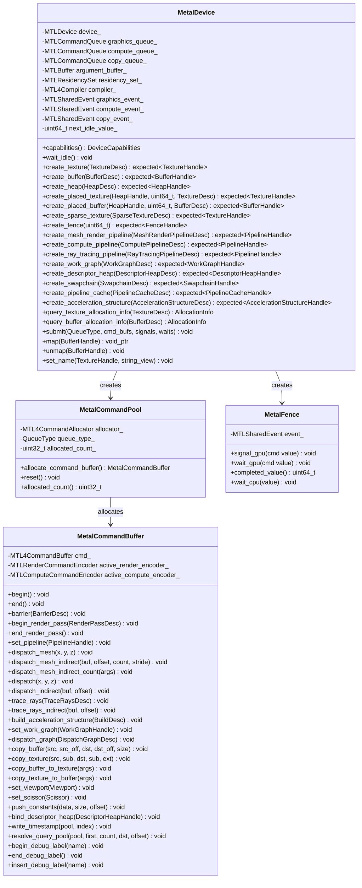
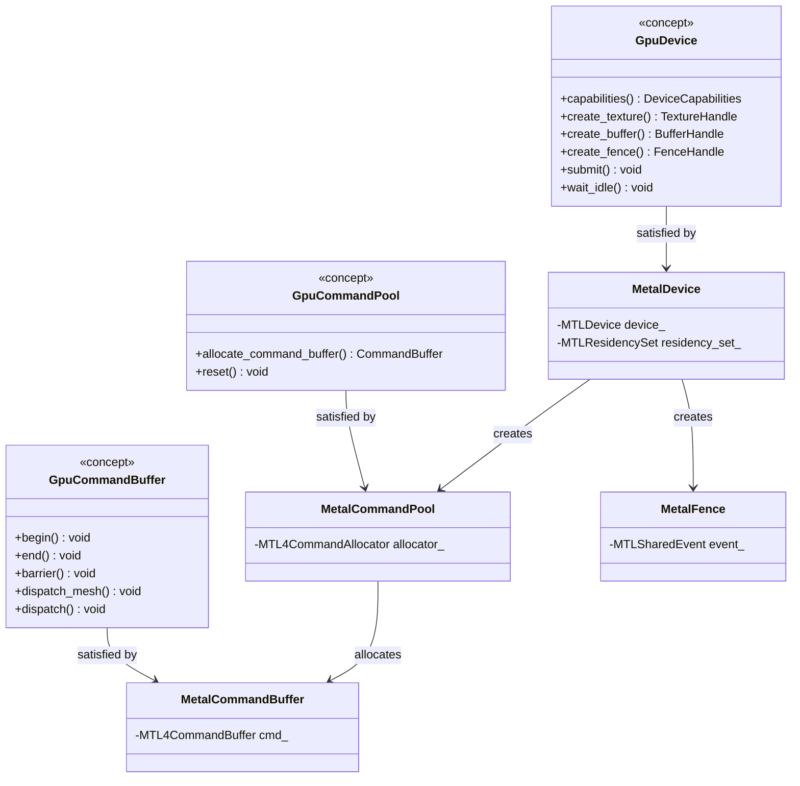
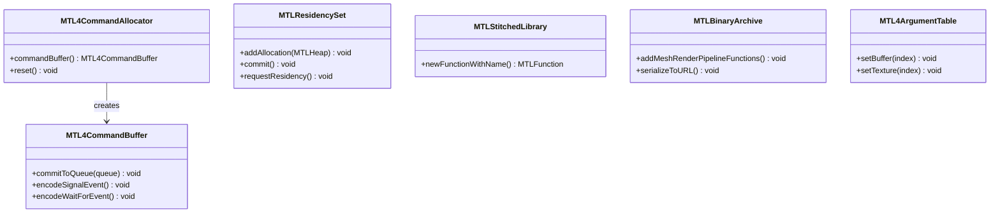
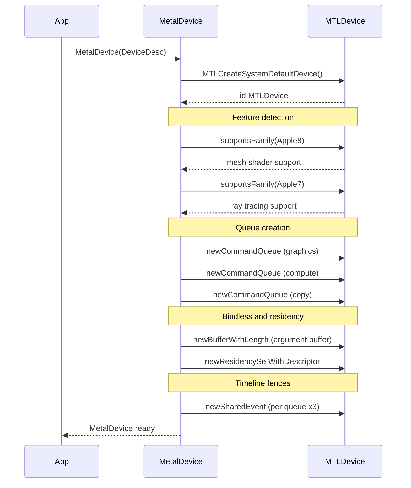
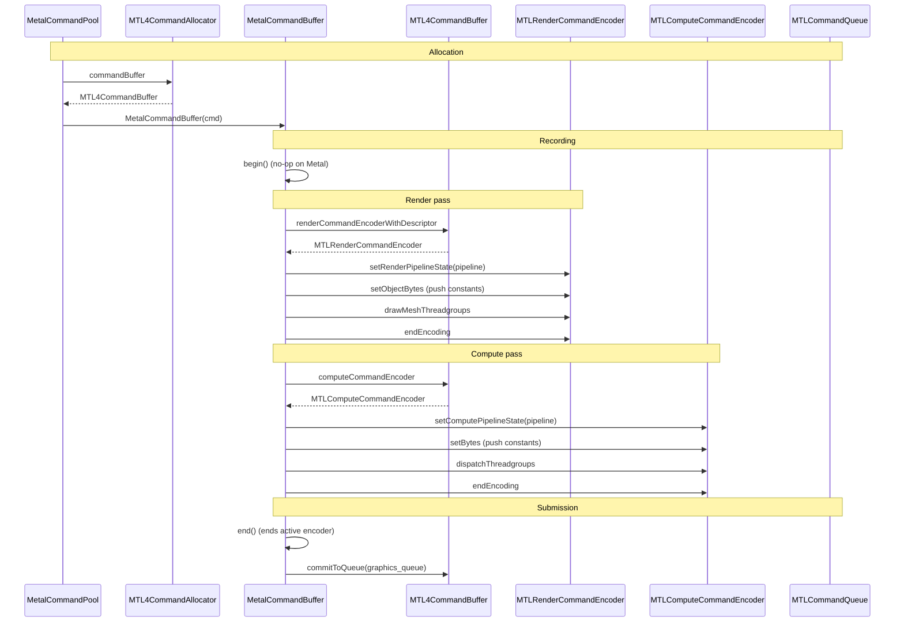
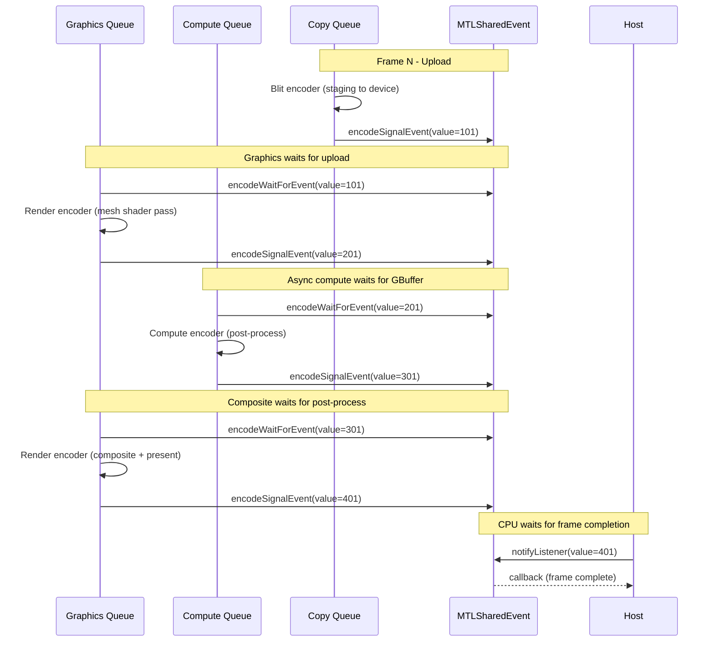
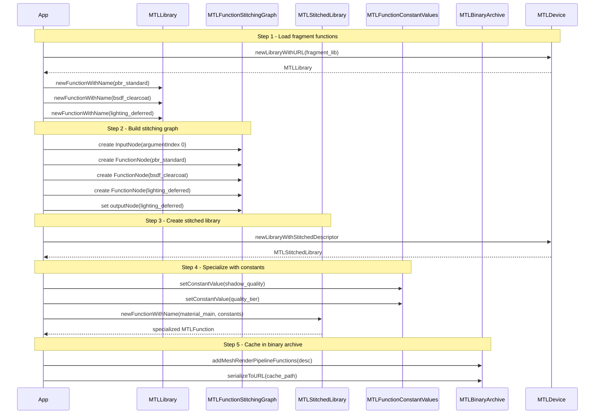

# GPU Backend -- Metal Class and Sequence Diagrams

Class diagrams for the Metal GPU backend and sequence diagrams showing Metal-specific
interactions. Companion to [gpu-backend-metal.md](gpu-backend-metal.md). See
[gpu-backend-interface-classes.md](gpu-backend-interface-classes.md) for the shared
concepts and types that these classes satisfy.

---

## Contents

- [Class Diagrams](#class-diagrams)
  - [1. Metal Backend Classes](#1-metal-backend-classes)
  - [2. Concept Satisfaction](#2-concept-satisfaction)
  - [3. Metal-Specific Types](#3-metal-specific-types)
- [Metal-Specific Details](#metal-specific-details)
  - [Metal 4 Command Model](#metal-4-command-model)
  - [Residency Management](#residency-management)
  - [Memory Management](#memory-management)
  - [Bindless Resources](#bindless-resources)
  - [Shader Function Linking](#shader-function-linking)
  - [Pipeline Caching](#pipeline-caching)
  - [No Explicit Image Layouts](#no-explicit-image-layouts)
  - [No Queue Ownership Transfers](#no-queue-ownership-transfers)
- [Sequence Diagrams](#sequence-diagrams)
  - [Metal Device Initialization](#metal-device-initialization)
  - [Metal 4 Command Recording](#metal-4-command-recording)
  - [MTLSharedEvent Multi-Queue Synchronization](#mtlsharedevent-multi-queue-synchronization)
  - [MTLStitchedLibrary Shader Linking](#mtlstitchedlibrary-shader-linking)

---

## Class Diagrams

### 1. Metal Backend Classes

`harmonius::gpu::metal` -- All four classes in the Metal backend with their complete
fields and methods. Each class satisfies its corresponding C++20 concept via
`static_assert`.



### 2. Concept Satisfaction

How Metal classes satisfy the abstract `GpuDevice`, `GpuCommandBuffer`, and
`GpuCommandPool` concepts defined in
[gpu-backend-interface.md](gpu-backend-interface.md). Each satisfaction is enforced at
compile time via `static_assert`. See
[gpu-backend-interface-classes.md](gpu-backend-interface-classes.md) for the full
concept definitions.



**Compile-time enforcement:**

```cpp
static_assert(GpuDevice<MetalDevice>);
static_assert(GpuCommandBuffer<MetalCommandBuffer>);
static_assert(GpuCommandPool<MetalCommandPool>);
```

### 3. Metal-Specific Types

Native Metal 4 and supporting types used internally by the Metal backend classes.
These types are not exposed through the abstract GPU interface.



---

## Metal-Specific Details

Key architectural differences between Metal and D3D12/Vulkan that affect how the Metal
backend implements the shared GPU interface.

### Metal 4 Command Model

Metal 4 introduces `MTL4CommandAllocator` and `MTL4CommandBuffer`, decoupling command
buffers from queues. This maps cleanly to the abstract `GpuCommandPool` /
`GpuCommandBuffer` split:

| Abstract Type | Metal 4 Type | Notes |
|---------------|-------------|-------|
| `GpuCommandPool` | `MTL4CommandAllocator` | Pool-backed memory; `reset()` recycles all |
| `GpuCommandBuffer` | `MTL4CommandBuffer` | Recording-ready from allocation (no begin) |
| `submit()` | `commitToQueue()` | Commit to a specific queue at submission |

Unlike D3D12 and Vulkan, Metal command buffers are immediately recording-ready after
allocation. The `begin()` method on `MetalCommandBuffer` is a no-op.

### Residency Management

Metal requires explicit residency management for resources accessed via argument
buffers. `MTLResidencySet` (Metal 4) provides batch residency control:

| Operation | Metal API | When |
|-----------|----------|------|
| Register heap | `addAllocation(MTLHeap)` | After heap creation |
| Apply changes | `commit()` | After adding/removing allocations |
| Make resident | `requestResidency()` | Before first use in command buffer |

All command buffers automatically include residency set resources once committed.

### Memory Management

Memory management (sub-allocation, defragmentation, budget tracking) is handled by
the GPU runtime layer (`harmonius::gpu_runtime::memory`). The Metal backend provides
only raw heap and resource creation primitives:

| Backend Method | Metal API Call |
|----------------|---------------|
| `create_heap()` | `newHeapWithDescriptor:` |
| `create_placed_texture()` | `newTextureWithDescriptor:offset:` on `MTLHeap` |
| `create_placed_buffer()` | `newBufferWithLength:options:offset:` on `MTLHeap` |
| `create_texture()` | `newTextureWithDescriptor:` |
| `create_buffer()` | `newBufferWithLength:options:` |

Memory budget monitoring uses `MTLDevice.currentAllocatedSize`, exposed through
the `DeviceCapabilities` struct.

### Bindless Resources

Metal supports bindless rendering through Argument Buffers Tier 2 and the Metal 4
`MTL4ArgumentTable`:

| Approach | Metal API | Use Case |
|----------|----------|----------|
| Tier 2 argument buffers | `MTLBuffer` with GPU resource IDs | Legacy bindless |
| MTL4 argument tables | `MTL4ArgumentTable` | Modern Metal 4 bindless |
| Push constants | `setBytes` (up to 4 KB per stage) | Per-draw inline data |

The `argument_buffer_` field in `MetalDevice` holds the bindless resource table. All
textures and buffers are registered in this table upon creation, enabling shader access
by index without per-draw binding changes.

### Shader Function Linking

Metal's `MTLStitchedLibrary` provides native support for composing shader functions at
runtime. Each `StitchNode` in the Harmonius stitching graph becomes an
`MTLFunctionStitchingFunctionNode`, and each `StitchEdge` becomes a connection between
node arguments.

| Stitching Step | Metal API |
|---------------|----------|
| Load functions | `MTLLibrary.newFunctionWithName` |
| Build graph | `MTLFunctionStitchingGraph` with `FunctionNode` entries |
| Create library | `MTLDevice.newLibraryWithStitchedDescriptor` |
| Specialize | `MTLFunctionConstantValues` applied to stitched function |
| Cache | `MTLBinaryArchive.addMeshRenderPipelineFunctions` |

Combined with Metal 4's `supportRenderTargetReassignment`, a stitched pipeline can be
specialized for different render target configurations without re-stitching or
recompilation.

### Pipeline Caching

`MTLBinaryArchive` stores pre-compiled pipeline binaries on disk, equivalent to
D3D12's pipeline state cache or Vulkan's `VkPipelineCache`. On subsequent launches,
the archive provides pre-compiled binaries without shader compilation:

| Operation | Metal API |
|-----------|----------|
| Create archive | `newBinaryArchiveWithDescriptor` (nil URL for fresh) |
| Add pipeline | `addMeshRenderPipelineFunctions` / `addComputePipelineFunctions` |
| Serialize | `serializeToURL` |
| Load on next launch | Set `url` on `MTLBinaryArchiveDescriptor` |
| Use at creation | Set `binaryArchives` on pipeline descriptor |

### No Explicit Image Layouts

Unlike D3D12 and Vulkan, Metal manages texture compression and layout internally. The
abstract interface's `TextureLayout` values are ignored on Metal. Barriers only need to
express stage/access dependencies via `memoryBarrierWithScope:` or
`memoryBarrierWithResources:`.

| Abstract Concept | Metal Equivalent |
|-----------------|-----------------|
| Texture layout transition | Not needed (Metal handles internally) |
| Memory barrier | `memoryBarrierWithScope:` / `memoryBarrierWithResources:` |
| Split barriers | Not supported (barriers are immediate) |

### No Queue Ownership Transfers

Apple Silicon uses a unified memory architecture. Resources are accessible from any
queue without release/acquire pairs. The abstract interface's `src_queue` / `dst_queue`
barrier fields are ignored on Metal.

| Abstract Concept | Metal Equivalent |
|-----------------|-----------------|
| Queue ownership release | Not needed (unified memory) |
| Queue ownership acquire | Not needed (unified memory) |
| Cross-queue synchronization | `MTLSharedEvent` signal/wait |

---

## Sequence Diagrams

### Metal Device Initialization

Feature detection, queue creation, memory management setup, bindless configuration,
and timeline fence creation.



### Metal 4 Command Recording

Allocator lifecycle, command buffer creation, encoder transitions between render and
compute passes, and queue submission.



### MTLSharedEvent Multi-Queue Synchronization

Timeline-based synchronization across graphics, compute, and copy queues using
`MTLSharedEvent`. Each queue signals a monotonically increasing value; dependent queues
wait on the required value before proceeding.



### MTLStitchedLibrary Shader Linking

Five-step pipeline: load fragment functions from a compiled library, build a stitching
graph connecting surface evaluation, BSDF layers, and lighting, create the stitched
library, specialize with function constants, and cache in a binary archive.


