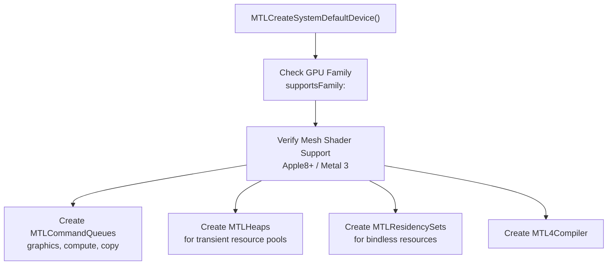
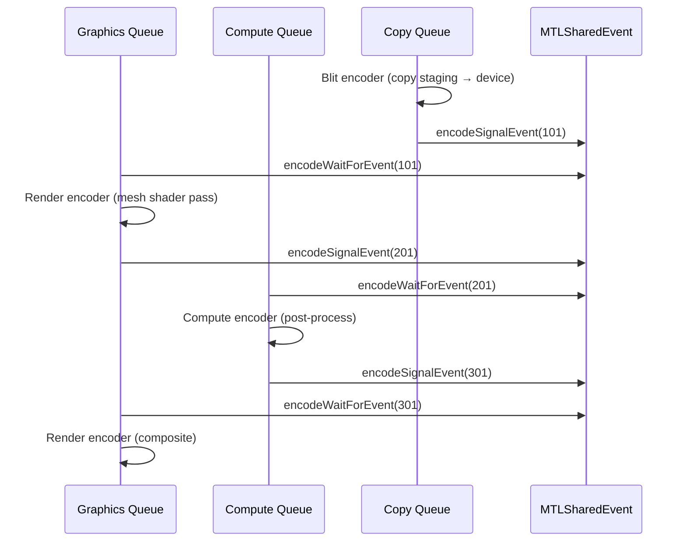
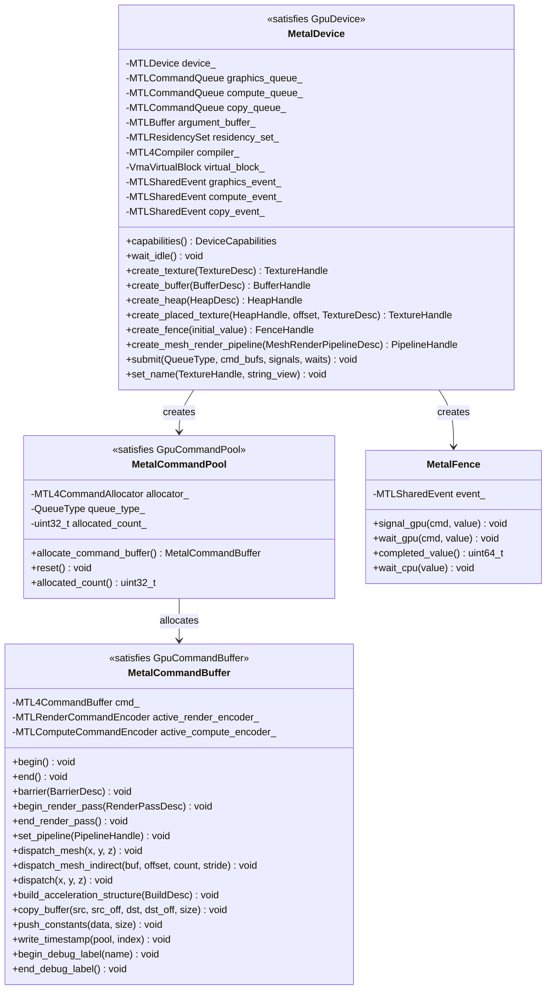

# GPU Backend — Metal

Implementation of the `harmonius::gpu` interface for macOS via Metal 4 on Apple Silicon.
Covers device creation, resource management, command recording, synchronization, pipeline state,
and resource binding using the native Metal API (Objective-C).

**Requirements:** R-1.2.1 (macOS via Metal), R-1.1.5 (native backend), R-1.1.6 (modern hardware).

**Minimum API:** Metal 4, macOS 15+, Apple Silicon (M1+).

**GPU Family Requirements:**
- Apple7+ for ray tracing
- Apple8+ (A15/M1 Pro+) for mesh shaders
- Argument Buffers Tier 2 for bindless

**Documentation:**
- [Metal Documentation](https://developer.apple.com/documentation/metal?language=objc)
- [Metal Feature Set Tables](https://developer.apple.com/metal/Metal-Feature-Set-Tables.pdf)

---

## Contents

- [Device Initialization](#device-initialization)
- [Queue Topology](#queue-topology)
- [Resource Management](#resource-management)
  - [Texture Creation](#texture-creation)
  - [Buffer Creation](#buffer-creation)
  - [Heaps and Placed Resources](#heaps-and-placed-resources)
  - [Sparse Resources](#sparse-resources)
  - [Residency Management](#residency-management)
- [Command Recording](#command-recording)
  - [Metal 4 Command Model](#metal-4-command-model)
  - [Render Command Encoding](#render-command-encoding)
  - [Compute Command Encoding](#compute-command-encoding)
  - [Blit Command Encoding](#blit-command-encoding)
- [Synchronization](#synchronization)
  - [Metal 4 Barriers](#metal-4-barriers)
  - [MTLSharedEvent (Timeline Fences)](#mtlsharedevent-timeline-fences)
  - [Multi-Queue Synchronization](#multi-queue-synchronization)
- [Mesh Shader Pipeline](#mesh-shader-pipeline)
  - [Pipeline Creation](#pipeline-creation)
  - [Dispatch Commands](#dispatch-commands)
  - [Limits](#limits)
- [Ray Tracing](#ray-tracing)
  - [Acceleration Structures](#acceleration-structures)
  - [Intersection Queries](#intersection-queries)
- [Resource Binding](#resource-binding)
  - [Argument Buffers Tier 2](#argument-buffers-tier-2)
  - [MTL4ArgumentTable](#mtl4argumenttable)
  - [Push Constants via setBytes](#push-constants-via-setbytes)
- [Pipeline State](#pipeline-state)
  - [Mesh Render Pipeline](#mesh-render-pipeline)
  - [Compute Pipeline](#compute-pipeline)
  - [Flexible Pipeline State (Metal 4)](#flexible-pipeline-state-metal-4)
  - [Binary Archives](#binary-archives)
- [Diagnostics](#diagnostics)
- [Metal vs D3D12/Vulkan Differences](#metal-vs-d3d12vulkan-differences)
- [Class Diagram](#class-diagram)

---

## Device Initialization



**Feature checks at initialization:**

| Feature | Metal Check | Requirement |
|---------|------------|-------------|
| Mesh shaders | `[device supportsFamily:MTLGPUFamilyApple8]` | Hard requirement |
| Ray tracing | `[device supportsFamily:MTLGPUFamilyApple7]` | Soft-gated |
| Argument buffers tier 2 | `device.argumentBuffersSupport == MTLArgumentBuffersTier2` | Hard requirement |
| 64-bit atomics | `[device supportsFamily:MTLGPUFamilyApple7]` | Soft-gated |
| Sparse textures | `[device supportsFamily:MTLGPUFamilyApple7]` | Soft-gated |

**Implementation class:**

```cpp
namespace harmonius::gpu::metal {

class MetalDevice {
public:
    explicit MetalDevice(const DeviceDesc& desc);
    ~MetalDevice();

    MetalDevice(const MetalDevice&) = delete;
    MetalDevice& operator=(const MetalDevice&) = delete;

    [[nodiscard]] DeviceCapabilities capabilities() const;

    /// Waits for all in-flight command buffers to complete by waiting on
    /// MTLSharedEvent timeline values for each queue. Used at shutdown and
    /// before pipeline recompilation.
    void wait_idle();

    // All remaining GpuDevice concept methods — see gpu-backend-interface.md
    // for the full method list.

private:
    id<MTLDevice>          device_;
    id<MTLCommandQueue>    graphics_queue_;
    id<MTLCommandQueue>    compute_queue_;
    id<MTLCommandQueue>    copy_queue_;

    id<MTLBuffer>          argument_buffer_;      // bindless resource table
    id<MTLResidencySet>    residency_set_;         // Metal 4 residency
    MTL4Compiler*          compiler_;              // Metal 4 shader compiler
    VmaVirtualBlock        virtual_block_;          // VMA virtualized mode for sub-allocation

    // Per-queue shared events used by wait_idle() to drain all queues.
    id<MTLSharedEvent>     graphics_event_;
    id<MTLSharedEvent>     compute_event_;
    id<MTLSharedEvent>     copy_event_;
    uint64_t               next_idle_value_ = 0;
};

static_assert(GpuDevice<MetalDevice>);

} // namespace harmonius::gpu::metal
```

---

## Queue Topology

Metal exposes `MTLCommandQueue` objects. Multiple queues can be created from the same device.
Unlike Vulkan, Metal does not have queue families — all queues can execute all operation types.

| `QueueType` | Metal Queue | Encoding |
|-------------|-------------|----------|
| `graphics` | Primary `MTLCommandQueue` | Render + compute + blit encoders |
| `async_compute` | Secondary `MTLCommandQueue` | Compute + blit encoders |
| `transfer` | Tertiary `MTLCommandQueue` | Blit encoder only |

**Unified memory:** Apple Silicon has a unified memory architecture. There is no distinction
between "device local" and "host visible" memory at the physical level. However, Metal still
exposes `MTLStorageMode` to control CPU/GPU caching behavior:

| `HeapType` | `MTLStorageMode` | `MTLCPUCacheMode` |
|------------|------------------|--------------------|
| `device_local` | `MTLStorageModePrivate` | N/A (GPU only) |
| `upload` | `MTLStorageModeShared` | `MTLCPUCacheModeWriteCombined` |
| `readback` | `MTLStorageModeShared` | `MTLCPUCacheModeDefaultCache` |

**No queue ownership transfers:** Because of unified memory, Metal does not require explicit
queue ownership transfer barriers. Resources are accessible from any queue without release/acquire
pairs. The abstract interface's `src_queue` / `dst_queue` fields are ignored on Metal.

---

## Resource Management

### Texture Creation

```objc
MTLTextureDescriptor* desc = [MTLTextureDescriptor new];
desc.textureType     = to_mtl_texture_type(texture_desc.dimension);
desc.pixelFormat     = to_mtl_pixel_format(texture_desc.format);
desc.width           = texture_desc.width;
desc.height          = texture_desc.height;
desc.depth           = texture_desc.depth_or_layers;
desc.mipmapLevelCount = texture_desc.mip_levels;
desc.sampleCount     = static_cast<NSUInteger>(texture_desc.samples);
desc.storageMode     = MTLStorageModePrivate;
desc.usage           = to_mtl_texture_usage(texture_desc.usage);

id<MTLTexture> texture = [device_ newTextureWithDescriptor:desc];
texture.label = @(texture_desc.name.data());
```

### Buffer Creation

```objc
MTLResourceOptions options = to_mtl_resource_options(buffer_desc.heap_type);
id<MTLBuffer> buffer = [device_ newBufferWithLength:buffer_desc.size_bytes
                                            options:options];
buffer.label = @(buffer_desc.name.data());

// Mapping (shared storage mode only)
void* ptr = [buffer contents];
```

### Heaps and Placed Resources

```objc
// Create a heap for aliased transient resources
MTLHeapDescriptor* heap_desc = [MTLHeapDescriptor new];
heap_desc.size        = desc.size_bytes;
heap_desc.storageMode = MTLStorageModePrivate;
heap_desc.type        = MTLHeapTypePlacement;  // enables explicit offset placement
id<MTLHeap> heap = [device_ newHeapWithDescriptor:heap_desc];

// Place a texture at a specific offset within the heap
id<MTLTexture> placed_texture = [heap newTextureWithDescriptor:tex_desc
                                                        offset:offset];
```

**Aliasing on Metal:**
- Use `MTLHeapTypePlacement` for explicit offset control (required for render graph aliasing).
- Before first use of an aliased resource, Metal requires making it "aliasable" — this is
  automatic with placement heaps.
- Metal does not require explicit aliasing barriers for compression metadata. The texture's
  storage is uninitialized after placement; the first render pass should use `MTLLoadActionClear`
  or `MTLLoadActionDontCare`.

### Sparse Resources

Metal supports sparse textures via placement heaps with page-granularity binding:

```objc
// Create a sparse texture (no backing pages initially)
MTLTextureDescriptor* desc = [MTLTextureDescriptor new];
desc.storageMode = MTLStorageModePrivate;
// ... other properties ...

// Metal 4: Placement sparse resources
// Pages are bound/unbound from placement heaps on demand
```

### Residency Management

Metal requires explicit residency management for resources accessed via argument buffers.
Metal 4 introduces `MTLResidencySet` for batch residency control:

```objc
// Create residency set at initialization
MTLResidencySetDescriptor* rs_desc = [MTLResidencySetDescriptor new];
rs_desc.initialCapacity = 10000;
id<MTLResidencySet> residency_set = [device_ newResidencySetWithDescriptor:rs_desc
                                                                     error:nil];

// Add heaps (covers all resources allocated from the heap)
[residency_set addAllocation:heap];

// Commit changes
[residency_set commit];

// Request residency
[residency_set requestResidency];

// All command buffers automatically include residency set resources
```

**Alternatively, per-encoder residency:**

```objc
// Make a heap resident for a specific render pass
[encoder useHeap:heap];

// Make individual resources resident
[encoder useResource:texture usage:MTLResourceUsageRead];
```

---

### Memory Allocator

The Metal backend uses [Vulkan Memory Allocator (VMA)](https://gpuopen.com/vulkan-memory-allocator/) in
**virtualized mode** for GPU memory management, allocation tracking, and memory defragmentation. VMA's
virtual block feature (`VmaVirtualBlock`) provides sub-allocation and defragmentation algorithms without
requiring a real Vulkan device — it operates as a pure CPU-side allocator that tracks offset/size pairs.
The actual Metal allocations (`MTLHeap`, `MTLBuffer`, `MTLTexture`) are performed through Metal APIs, but
VMA manages the logical address space and provides unified allocation tracking across all platforms.

| VMA Virtual Block Feature | Metal Usage |
|---------------------------|-------------|
| Virtual sub-allocation | Offset management within `MTLHeap` placement heaps |
| Virtual block defragmentation | Compaction of persistent resources across heaps |
| Allocation tracking | Unified memory diagnostics across all backends |
| Budget tracking | Memory pressure monitoring via `MTLDevice.currentAllocatedSize` |

This approach provides consistent memory management APIs and defragmentation strategies across
D3D12 (via D3D12MA), Vulkan (via VMA native mode), and Metal (via VMA virtualized mode).

---

## Command Recording

### Metal 4 Command Model

Metal 4 introduces a new command recording model that decouples command buffers from queues
and provides explicit memory management:

```objc
// Create a command allocator for explicit memory control
MTL4CommandAllocator* allocator = [device_ newCommandAllocator];

// Create a command buffer (decoupled from queue)
MTL4CommandBuffer* cmd = [allocator commandBuffer];

// Record commands using encoders
// ...

// Commit to a specific queue
[cmd commitToQueue:graphics_queue_];
```

**Command pool implementation class:**

```cpp
namespace harmonius::gpu::metal {

class MetalCommandPool {
public:
    MetalCommandPool(id<MTLDevice> device, QueueType queue_type);
    ~MetalCommandPool();

    /// Creates an MTL4CommandBuffer from the allocator. The returned buffer is
    /// lightweight and pool-backed. Metal command buffers are recording-ready
    /// from allocation — no separate begin() call is needed.
    MetalCommandBuffer allocate_command_buffer();

    /// Calls [allocator_ reset] to recycle all backing memory. All command
    /// buffers previously allocated from this pool become invalid.
    void reset();

    uint32_t allocated_count() const;

private:
    MTL4CommandAllocator* allocator_;   // Metal 4 command allocator (wraps pool memory)
    QueueType             queue_type_;
    uint32_t              allocated_count_ = 0;
};

static_assert(GpuCommandPool<MetalCommandPool>);

} // namespace harmonius::gpu::metal
```

**Command buffer implementation class:**

```cpp
namespace harmonius::gpu::metal {

class MetalCommandBuffer {
public:
    explicit MetalCommandBuffer(MTL4CommandBuffer* cmd);

    /// No-op — Metal command buffers are recording-ready from allocation.
    void begin();

    /// Calls [encoder endEncoding] on the active encoder, if any.
    void end();

    // All remaining GpuCommandBuffer concept methods — see
    // gpu-backend-interface.md for the full method list.

private:
    MTL4CommandBuffer*             cmd_;
    id<MTLRenderCommandEncoder>    active_render_encoder_;
    id<MTLComputeCommandEncoder>   active_compute_encoder_;
};

static_assert(GpuCommandBuffer<MetalCommandBuffer>);

} // namespace harmonius::gpu::metal
```

### Render Command Encoding

```objc
MTLRenderPassDescriptor* rpd = [MTLRenderPassDescriptor new];

// Color attachment
rpd.colorAttachments[0].texture    = color_texture;
rpd.colorAttachments[0].level      = mip_level;
rpd.colorAttachments[0].slice      = array_layer;
rpd.colorAttachments[0].loadAction = to_mtl_load_action(desc.load_op);
rpd.colorAttachments[0].storeAction = to_mtl_store_action(desc.store_op);
rpd.colorAttachments[0].clearColor = MTLClearColorMake(r, g, b, a);

// Depth attachment
rpd.depthAttachment.texture     = depth_texture;
rpd.depthAttachment.loadAction  = to_mtl_load_action(desc.depth_load_op);
rpd.depthAttachment.storeAction = to_mtl_store_action(desc.depth_store_op);
rpd.depthAttachment.clearDepth  = desc.clear_depth;

// MSAA resolve
rpd.colorAttachments[0].resolveTexture = resolve_texture;
rpd.colorAttachments[0].storeAction    = MTLStoreActionMultisampleResolve;

// Create encoder
id<MTLRenderCommandEncoder> encoder = [cmd renderCommandEncoderWithDescriptor:rpd];
encoder.label = @"GBuffer Pass";
```

**No explicit image view objects:** Metal sets the texture, mip level, and array slice directly
on the render pass descriptor — no `VkImageView` or D3D12 RTV/DSV equivalent needed.

### Compute Command Encoding

Metal 4 consolidates compute, blit, and acceleration structure operations into a single
`MTL4ComputeCommandEncoder`:

```objc
id<MTLComputeCommandEncoder> encoder = [cmd computeCommandEncoder];

[encoder setComputePipelineState:pipeline];
[encoder setBytes:&push_data length:sizeof(push_data) atIndex:0];
[encoder setBuffer:argument_buffer_ offset:0 atIndex:1];
[encoder dispatchThreadgroups:groups threadsPerThreadgroup:threads];

[encoder endEncoding];
```

### Blit Command Encoding

```objc
id<MTLBlitCommandEncoder> blit = [cmd blitCommandEncoder];

[blit copyFromBuffer:src sourceOffset:src_offset
            toBuffer:dst destinationOffset:dst_offset
                size:size_bytes];

[blit copyFromBuffer:staging sourceOffset:0
           sourceBytesPerRow:bytes_per_row
         sourceBytesPerImage:bytes_per_image
                  sourceSize:extent
               toTexture:texture
        destinationSlice:slice destinationLevel:level
       destinationOrigin:origin];

[blit endEncoding];
```

### Swapchain Resize

Metal resizes by setting `CAMetalLayer.drawableSize` — the next `nextDrawable` call returns a
correctly sized drawable automatically. No explicit destruction or recreation of swapchain images
is required (unlike Vulkan's `vkCreateSwapchainKHR` or D3D12's `ResizeBuffers`).

```objc
// After a window resize event (caller must wait on all in-flight fences first)
CAMetalLayer* layer = /* ... */;
layer.drawableSize = CGSizeMake(new_width, new_height);

// Next frame — drawable is already the correct size
id<CAMetalDrawable> drawable = [layer nextDrawable];
id<MTLTexture> backbuffer = drawable.texture;
// backbuffer.width == new_width, backbuffer.height == new_height
```

---

## Synchronization

### Metal 4 Barriers

Metal 4 provides a low-overhead barrier API for stage-to-stage synchronization:

```objc
// Within a compute encoder
[encoder memoryBarrierWithScope:MTLBarrierScopeBuffers
                   afterStages:MTLRenderStageFragment
                  beforeStages:MTLRenderStageVertex];

// For textures — Metal manages image layouts internally
[encoder memoryBarrierWithResources:&texture count:1
                       afterStages:MTLRenderStageFragment
                      beforeStages:MTLRenderStageVertex];
```

**Metal does not have explicit image layouts.** Unlike D3D12 and Vulkan, Metal manages texture
compression and layout internally. The abstract interface's `TextureLayout` values are ignored
on Metal — barriers only need to express stage/access dependencies.

**Mapping from abstract barriers to Metal:**

| Abstract Concept | Metal Equivalent |
|-----------------|-----------------|
| Texture layout transition | Not needed — Metal handles internally |
| Memory barrier | `memoryBarrierWithScope:` or `memoryBarrierWithResources:` |
| Queue ownership transfer | Not needed — unified memory |
| Split barriers | Not supported — barriers are immediate |

### MTLSharedEvent (Timeline Fences)

`MTLSharedEvent` provides timeline semaphore semantics:

```objc
// Create shared event (timeline fence)
id<MTLSharedEvent> event = [device_ newSharedEvent];

// GPU-side signal (in command buffer)
[cmd encodeSignalEvent:event value:signal_value];

// GPU-side wait (in command buffer)
[cmd encodeWaitForEvent:event value:wait_value];

// CPU-side query
uint64_t completed = event.signaledValue;

// CPU-side wait (async callback)
MTLSharedEventListener* listener = [[MTLSharedEventListener alloc] init];
[event notifyListener:listener atValue:target_value block:^(id<MTLSharedEvent> ev,
                                                             uint64_t value) {
    // Fence reached target value
}];

// CPU-side wait (blocking)
// Metal does not have a direct blocking wait. Use dispatch_semaphore:
dispatch_semaphore_t sem = dispatch_semaphore_create(0);
[event notifyListener:listener atValue:target_value block:^(id<MTLSharedEvent> ev,
                                                             uint64_t value) {
    dispatch_semaphore_signal(sem);
}];
dispatch_semaphore_wait(sem, DISPATCH_TIME_FOREVER);
```

### Multi-Queue Synchronization



---

## Mesh Shader Pipeline

### Pipeline Creation

Metal uses `MTLMeshRenderPipelineDescriptor` for mesh shader pipelines:

```objc
MTLMeshRenderPipelineDescriptor* desc = [MTLMeshRenderPipelineDescriptor new];

// Object shader (task/amplification equivalent)
desc.objectFunction  = [library newFunctionWithName:@"object_main"];

// Mesh shader
desc.meshFunction    = [library newFunctionWithName:@"mesh_main"];

// Fragment shader
desc.fragmentFunction = [library newFunctionWithName:@"fragment_main"];

// Render target formats
desc.colorAttachments[0].pixelFormat = MTLPixelFormatRGBA8Unorm;
desc.depthAttachmentPixelFormat      = MTLPixelFormatDepth32Float;

// Blend state
desc.colorAttachments[0].blendingEnabled    = YES;
desc.colorAttachments[0].sourceRGBBlendFactor = MTLBlendFactorOne;
// ...

// Rasterizer state
desc.rasterSampleCount = 1;

NSError* error = nil;
id<MTLRenderPipelineState> pipeline =
    [device_ newRenderPipelineStateWithMeshDescriptor:desc
                                             options:0
                                          reflection:nil
                                               error:&error];
```

### Dispatch Commands

```objc
// Direct dispatch
[encoder drawMeshThreadgroups:MTLSizeMake(groups_x, groups_y, groups_z)
    threadsPerObjectThreadgroup:MTLSizeMake(obj_threads, 1, 1)
      threadsPerMeshThreadgroup:MTLSizeMake(mesh_threads, 1, 1)];

// Indirect dispatch (argument buffer contains group counts)
[encoder drawMeshThreadgroupsWithIndirectBuffer:argument_buffer
                           indirectBufferOffset:offset
                  threadsPerObjectThreadgroup:MTLSizeMake(obj_threads, 1, 1)
                    threadsPerMeshThreadgroup:MTLSizeMake(mesh_threads, 1, 1)];
```

**Metal Shading Language mesh shader syntax:**

```metal
using namespace metal;

struct VertexOut {
    float4 position [[position]];
    float2 uv;
};

struct PrimitiveOut {
    // per-primitive data
};

// Object shader (task equivalent)
[[object, max_total_threads_per_threadgroup(32)]]
void object_main(
    object_data ObjectPayload& payload [[payload]],
    uint tid [[thread_index_in_threadgroup]],
    uint gid [[threadgroup_position_in_grid]],
    mesh_grid_properties mgp)
{
    // Determine mesh threadgroup count
    mgp.set_threadgroups_per_grid(uint3(meshlet_count, 1, 1));

    // Write payload for mesh shader
    payload.meshlet_indices[tid] = visible_meshlets[gid * 32 + tid];
}

// Mesh shader
[[mesh, max_total_threads_per_threadgroup(128),
        max_total_vertices_per_mesh(64),
        max_total_primitives_per_mesh(126)]]
void mesh_main(
    object_data const ObjectPayload& payload [[payload]],
    uint tid [[thread_index_in_threadgroup]],
    uint gid [[threadgroup_position_in_grid]],
    mesh<VertexOut, PrimitiveOut, 64, 126, topology::triangle> output)
{
    // Emit vertices and primitives
    output.set_vertex(tid, vertex_data);
    output.set_index(tid * 3 + 0, idx0);
    output.set_index(tid * 3 + 1, idx1);
    output.set_index(tid * 3 + 2, idx2);
    output.set_primitive_count(prim_count);
}
```

### Limits

| Limit | Value (Apple8+) |
|-------|-----------------|
| Max output vertices per mesh | 256 |
| Max output primitives per mesh | 256 |
| Max threads per mesh threadgroup | 1,024 |
| Max threads per object threadgroup | 1,024 |
| Max threadgroup memory | 32 KB |
| Max payload size | 16 KB |
| Max mesh threadgroups per grid | 1M per dimension |

---

## Ray Tracing

### Acceleration Structures

Metal uses compute-shader-based ray tracing with acceleration structures:

```objc
// Create BLAS descriptor
MTLPrimitiveAccelerationStructureDescriptor* blas_desc =
    [MTLPrimitiveAccelerationStructureDescriptor descriptor];

MTLAccelerationStructureTriangleGeometryDescriptor* geom =
    [MTLAccelerationStructureTriangleGeometryDescriptor descriptor];
geom.vertexBuffer  = vertex_buffer;
geom.vertexStride  = vertex_stride;
geom.indexBuffer   = index_buffer;
geom.indexType     = MTLIndexTypeUInt32;
geom.triangleCount = triangle_count;
geom.opaque        = YES;
blas_desc.geometryDescriptors = @[geom];

// Query sizes
MTLAccelerationStructureSizes sizes =
    [device_ accelerationStructureSizesWithDescriptor:blas_desc];

// Create acceleration structure
id<MTLAccelerationStructure> blas =
    [device_ newAccelerationStructureWithSize:sizes.accelerationStructureSize];

// Build (via compute command encoder)
id<MTLAccelerationStructureCommandEncoder> as_encoder =
    [cmd accelerationStructureCommandEncoder];

[as_encoder buildAccelerationStructure:blas
                            descriptor:blas_desc
                         scratchBuffer:scratch_buffer
                   scratchBufferOffset:0];

[as_encoder endEncoding];
```

**TLAS (instance acceleration structure):**

```objc
MTLInstanceAccelerationStructureDescriptor* tlas_desc =
    [MTLInstanceAccelerationStructureDescriptor descriptor];
tlas_desc.instanceDescriptorBuffer = instance_buffer;
tlas_desc.instanceCount            = instance_count;
tlas_desc.instancedAccelerationStructures = @[blas0, blas1, blas2];
```

### Intersection Queries

Metal performs ray tracing via intersection queries in compute or fragment shaders,
not via a dedicated ray tracing pipeline like DXR/Vulkan RT:

```metal
// Metal Shading Language — ray tracing in compute shader
[[kernel]]
void raygen(
    uint2 tid [[thread_position_in_grid]],
    instance_acceleration_structure accel [[buffer(0)]],
    texture2d<float, access::write> output [[texture(0)]])
{
    ray r;
    r.origin    = camera_origin;
    r.direction = compute_ray_direction(tid);
    r.min_distance = 0.001;
    r.max_distance = 1000.0;

    intersector<triangle_data> intersector;
    intersector.assume_geometry_type(geometry_type::triangle);
    intersection_result<triangle_data> result = intersector.intersect(r, accel);

    if (result.type == intersection_type::triangle) {
        float2 bary = result.triangle_barycentric_coord;
        // shade hit point
    }
}
```

**Difference from D3D12/Vulkan:** Metal does not have separate ray generation, closest hit, any
hit, and miss shader stages. All ray tracing logic lives in a single compute kernel using the
intersection query API. The abstract interface's `trace_rays` command is implemented as a compute
dispatch on Metal, with the SBT fields unused.

---

## Resource Binding

### Argument Buffers Tier 2

Tier 2 argument buffers enable bindless rendering by storing resource references
(GPU virtual addresses) in a buffer:

```objc
// Create argument buffer large enough for all descriptors
id<MTLBuffer> arg_buffer = [device_ newBufferWithLength:descriptor_count * 8
                                                options:MTLResourceStorageModeShared];

// Encode resource handles into the argument buffer
// Each entry is a GPU resource ID (64-bit) that the shader indexes into
```

### MTL4ArgumentTable

Metal 4 introduces `MTL4ArgumentTable` as a modern replacement for argument encoder workflows:

```objc
// Create argument table describing binding layout
MTL4ArgumentTableDescriptor* table_desc = [MTL4ArgumentTableDescriptor new];
// Configure binding points

MTL4ArgumentTable* table = [device_ newArgumentTableWithDescriptor:table_desc];

// Bind to encoder
[encoder setArgumentTable:table atIndex:0];
```

### Push Constants via setBytes

Metal supports inline constant data up to 4 KB per shader stage:

```objc
// Equivalent to push constants — data is inlined in the command buffer
[encoder setObjectBytes:&push_data length:sizeof(push_data) atIndex:0];
[encoder setMeshBytes:&push_data length:sizeof(push_data) atIndex:0];
[encoder setFragmentBytes:&push_data length:sizeof(push_data) atIndex:0];

// For compute
[computeEncoder setBytes:&push_data length:sizeof(push_data) atIndex:0];
```

---

## Pipeline State

### Mesh Render Pipeline

Created via `MTLMeshRenderPipelineDescriptor` (see [Pipeline Creation](#pipeline-creation) above).

### Compute Pipeline

```objc
id<MTLFunction> function = [library newFunctionWithName:@"compute_main"];
NSError* error = nil;
id<MTLComputePipelineState> pipeline =
    [device_ newComputePipelineStateWithFunction:function error:&error];
```

**Function constants (specialization constants):**

```objc
MTLFunctionConstantValues* constants = [MTLFunctionConstantValues new];
BOOL enable_feature = YES;
[constants setConstantValue:&enable_feature type:MTLDataTypeBool atIndex:0];

id<MTLFunction> specialized = [library newFunctionWithName:@"compute_main"
                                            constantValues:constants
                                                     error:&error];
```

### Flexible Pipeline State (Metal 4)

Metal 4 allows creating an unspecialized pipeline once and specializing it for different
render target configurations without full recompilation:

```objc
// Create flexible (unspecialized) pipeline
MTLMeshRenderPipelineDescriptor* desc = /* ... */;
desc.supportRenderTargetReassignment = YES;
id<MTLRenderPipelineState> flexible_pso = [device_ newRenderPipelineStateWithMeshDescriptor:desc
                                                                                   options:0
                                                                                reflection:nil
                                                                                     error:nil];

// Specialize for a specific render target configuration at render time
// Without recompiling the shader — only the fixed-function state changes
```

### Binary Archives

`MTLBinaryArchive` is Metal's pipeline cache mechanism — the equivalent of D3D12's pipeline
state cache or Vulkan's `VkPipelineCache`. It stores pre-compiled pipeline binaries on disk so
that subsequent launches skip shader compilation entirely.

```objc
// --- Creation ---
// Create a new (empty) binary archive, or load an existing one from disk.
MTLBinaryArchiveDescriptor* archive_desc = [MTLBinaryArchiveDescriptor new];
archive_desc.url = cache_file_url;  // nil for a fresh archive; file URL to load existing
id<MTLBinaryArchive> archive = [device_ newBinaryArchiveWithDescriptor:archive_desc
                                                                 error:nil];

// --- Adding pipelines ---
// Each addXxxFunctionsWithDescriptor: call records the compiled binary for the given
// pipeline descriptor. Call once per unique pipeline permutation.
[archive addRenderPipelineFunctionsWithDescriptor:render_desc error:nil];
[archive addMeshRenderPipelineFunctionsWithDescriptor:mesh_desc error:nil];
[archive addComputePipelineFunctionsWithDescriptor:compute_desc error:nil];

// --- Serialization ---
// Write the archive to disk. On the next launch, loading the archive via the
// descriptor URL skips all shader compilation for the recorded pipelines.
[archive serializeToURL:cache_file_url error:nil];

// --- Using the archive at pipeline creation ---
// Pass the archive in the pipeline descriptor so Metal can look up the pre-compiled
// binary instead of recompiling.
mesh_desc.binaryArchives = @[archive];
id<MTLRenderPipelineState> pso =
    [device_ newRenderPipelineStateWithMeshDescriptor:mesh_desc
                                              options:0
                                           reflection:nil
                                                error:nil];
```

### Function Stitching (Shader Function Linking)

Metal's `MTLStitchedLibrary` provides native support for composing shader functions at runtime.
This maps directly to the Harmonius stitching graph: each `StitchNode` becomes an
`MTLFunctionStitchingFunctionNode`, and each `StitchEdge` becomes a connection between node
arguments.

```objc
// --- Step 1: Load fragment functions from a compiled Metal library ---
id<MTLLibrary> fragment_lib = [device_ newLibraryWithURL:fragment_lib_url error:nil];

// Get individual fragment functions (visible functions in the library)
id<MTLFunction> surface_fn  = [fragment_lib newFunctionWithName:@"pbr_standard"];
id<MTLFunction> coat_fn     = [fragment_lib newFunctionWithName:@"bsdf_clearcoat"];
id<MTLFunction> lighting_fn = [fragment_lib newFunctionWithName:@"lighting_deferred"];

// --- Step 2: Build the stitching graph ---
// Input node receives interpolated data from the mesh shader
MTLFunctionStitchingInputNode* input =
    [[MTLFunctionStitchingInputNode alloc] initWithArgumentIndex:0];

// Surface evaluation: receives material params, outputs SurfaceData
MTLFunctionStitchingFunctionNode* surface_node =
    [[MTLFunctionStitchingFunctionNode alloc] initWithName:@"pbr_standard"
                                                 arguments:@[input]];

// BSDF layer: receives SurfaceData, outputs modified SurfaceData
MTLFunctionStitchingFunctionNode* coat_node =
    [[MTLFunctionStitchingFunctionNode alloc] initWithName:@"bsdf_clearcoat"
                                                 arguments:@[surface_node]];

// Lighting: receives SurfaceData, outputs radiance
MTLFunctionStitchingFunctionNode* lighting_node =
    [[MTLFunctionStitchingFunctionNode alloc] initWithName:@"lighting_deferred"
                                                 arguments:@[coat_node]];

// Assemble the stitching graph
MTLFunctionStitchingGraph* stitch_graph =
    [[MTLFunctionStitchingGraph alloc]
        initWithFunctionName:@"material_main"
                       nodes:@[surface_node, coat_node, lighting_node]
                  outputNode:lighting_node
                  attributes:@[]];

// --- Step 3: Create the stitched library ---
MTLStitchedLibraryDescriptor* stitch_desc = [MTLStitchedLibraryDescriptor new];
stitch_desc.functionGraphs = @[stitch_graph];
stitch_desc.functions = @[surface_fn, coat_fn, lighting_fn];

NSError* error = nil;
id<MTLLibrary> stitched_lib =
    [device_ newLibraryWithStitchedDescriptor:stitch_desc error:&error];

// --- Step 4: Get the stitched function and create the pipeline ---
// Apply function constants (specialization) to the stitched function
MTLFunctionConstantValues* constants = [MTLFunctionConstantValues new];
uint32_t shadow_quality = 1;  // PCSS
uint32_t quality_tier = 2;    // high
[constants setConstantValue:&shadow_quality type:MTLDataTypeUInt atIndex:0];
[constants setConstantValue:&quality_tier   type:MTLDataTypeUInt atIndex:1];

id<MTLFunction> material_fn =
    [stitched_lib newFunctionWithName:@"material_main"
                       constantValues:constants
                                error:&error];

// Use in mesh render pipeline descriptor
MTLMeshRenderPipelineDescriptor* pipeline_desc = [MTLMeshRenderPipelineDescriptor new];
pipeline_desc.objectFunction   = object_fn;   // monolithic task shader
pipeline_desc.meshFunction     = mesh_fn;     // monolithic mesh shader
pipeline_desc.fragmentFunction = material_fn; // stitched + specialized fragment
pipeline_desc.colorAttachments[0].pixelFormat = MTLPixelFormatRGBA16Float;
pipeline_desc.depthAttachmentPixelFormat      = MTLPixelFormatDepth32Float;

id<MTLRenderPipelineState> pso =
    [device_ newRenderPipelineStateWithMeshDescriptor:pipeline_desc
                                              options:0
                                           reflection:nil
                                                error:&error];
```

**Stitched pipeline caching:** Stitched pipelines are cached in `MTLBinaryArchive` like any
other pipeline. On subsequent loads, the archive provides the pre-compiled binary without
re-stitching:

```objc
// Add stitched pipeline to archive
pipeline_desc.binaryArchives = @[archive];
[archive addMeshRenderPipelineFunctionsWithDescriptor:pipeline_desc error:nil];
```

**Flexible pipeline state (Metal 4):** Combined with `supportRenderTargetReassignment`, a
stitched pipeline can be specialized for different render target configurations without
re-stitching or recompilation, further reducing the effective PSO count.

---

## Diagnostics

| Feature | Metal API |
|---------|-----------|
| Timestamp queries | `MTLCounterSampleBuffer` + `sampleCounters` |
| Pipeline statistics | GPU counters via `MTLCounterSet` |
| Debug labels | `pushDebugGroup:` / `popDebugGroup` on encoder; `.label` on cmd buffer |
| Resource naming | `MTLResource.label`, `MTLCommandBuffer.label`, `MTLCommandQueue.label` |
| GPU capture | Xcode Metal debugger, `MTLCaptureManager` for programmatic capture |
| Shader profiling | Xcode GPU shader profiler (per-line cost) |
| Validation | `MTL_DEBUG_LAYER=1`, `MTL_SHADER_VALIDATION=1` env vars |
| Shader printf | `os_log` in Metal shading language |
| GPU fault info | `MTLCommandBuffer.error` → `MTLCommandBufferError` with encoder info |

```objc
// Programmatic GPU capture
MTLCaptureManager* capture = [MTLCaptureManager sharedCaptureManager];
MTLCaptureDescriptor* desc = [MTLCaptureDescriptor new];
desc.captureObject = device_;
desc.destination   = MTLCaptureDestinationGPUTraceDocument;
desc.outputURL     = trace_file_url;
[capture startCaptureWithDescriptor:desc error:nil];
// ... render frame ...
[capture stopCapture];
```

---

## Metal vs D3D12/Vulkan Differences

Key architectural differences that affect the backend implementation:

| Aspect | D3D12 / Vulkan | Metal |
|--------|---------------|-------|
| Memory model | Discrete GPU: separate device/host memory | Unified memory: single address space |
| Memory allocator | D3D12MA / VMA (native) | VMA virtualized mode (`VmaVirtualBlock`) + MTLHeap |
| Image layouts | Explicit layout transitions required | Automatic — Metal manages internally |
| Queue ownership | Explicit release/acquire barrier pairs | Not required — unified memory |
| Split barriers | Supported (enhanced barriers / events) | Not supported — immediate barriers |
| Ray tracing model | Dedicated pipeline stages (raygen, hit, miss) | Intersection query in compute/fragment shaders |
| Render target views | Explicit RTV/DSV (D3D12) or VkImageView | Set directly on render pass descriptor |
| Descriptor binding | Descriptor heaps/tables (D3D12) or descriptor sets (Vulkan) | Argument buffers / argument tables |
| Work graphs | State object + DispatchGraph (D3D12 only) | Not supported — stubs return `PipelineError::unsupported` |
| Variable rate shading | Shading rate image attachment | Per-primitive or per-draw rate (no image-based VRS) |

---

## Class Diagram


