# Vulkan GPU Backend Class Diagrams

Class diagrams for the Vulkan backend implementation (`harmonius::gpu::vulkan`).
Companion to [gpu-backend-vulkan.md](gpu-backend-vulkan.md) and
[gpu-backend-interface.md](gpu-backend-interface.md). For render graph types, see
[render-graph-classes.md](render-graph-classes.md).

---

## Contents

- [Class Diagrams](#class-diagrams)
  - [1. Concept Satisfaction](#1-concept-satisfaction)
  - [2. VulkanDevice](#2-vulkandevice)
  - [3. DeviceCapabilities and Feature Detection](#3-devicecapabilities-and-feature-detection)
  - [4. Texture and Buffer Resources](#4-texture-and-buffer-resources)
  - [5. Resource Enums](#5-resource-enums)
  - [6. Heap and Placed Resources](#6-heap-and-placed-resources)
  - [7. Sparse Resources](#7-sparse-resources)
  - [8. Acceleration Structures](#8-acceleration-structures)
  - [9. VulkanCommandPool and VulkanCommandBuffer](#9-vulkancommandpool-and-vulkancommandbuffer)
  - [10. VulkanCommandBuffer Full API](#10-vulkancommandbuffer-full-api)
  - [11. Render Pass Types](#11-render-pass-types)
  - [12. Indirect Command Types](#12-indirect-command-types)
  - [13. Barrier System](#13-barrier-system)
  - [14. Barrier and Synchronization Enums](#14-barrier-and-synchronization-enums)
  - [15. Timeline Fences](#15-timeline-fences)
  - [16. Mesh Render Pipeline](#16-mesh-render-pipeline)
  - [17. Pipeline Library Linking](#17-pipeline-library-linking)
  - [18. Compute and Ray Tracing Pipelines](#18-compute-and-ray-tracing-pipelines)
  - [19. Pipeline Cache](#19-pipeline-cache)
  - [20. Descriptor Binding](#20-descriptor-binding)
  - [21. Bindless Descriptor Set Layout](#21-bindless-descriptor-set-layout)
  - [22. Swapchain and Presentation](#22-swapchain-and-presentation)
  - [23. Diagnostics](#23-diagnostics)
  - [24. Conversion Helpers](#24-conversion-helpers)
  - [25. Cross-Class Relationships](#25-cross-class-relationships)
- [Vulkan-Specific Details](#vulkan-specific-details)
  - [26. Instance and Device Creation](#26-instance-and-device-creation)
  - [27. Memory Management](#27-memory-management)
  - [28. Queue Family Selection](#28-queue-family-selection)
  - [29. Dynamic Rendering](#29-dynamic-rendering)
- [Sequence Diagrams](#sequence-diagrams)
  - [30. Device Initialization Sequence](#30-device-initialization-sequence)
  - [31. Synchronization2 Barrier Sequence](#31-synchronization2-barrier-sequence)
  - [32. Swapchain Recreation Sequence](#32-swapchain-recreation-sequence)
  - [33. Multi-Queue Synchronization Sequence](#33-multi-queue-synchronization-sequence)

---

## Class Diagrams

### 1. Concept Satisfaction

How the three Vulkan backend classes satisfy the abstract `harmonius::gpu` concepts
defined in [gpu-backend-interface.md](gpu-backend-interface.md). Each concept is
enforced at compile time via `static_assert`.

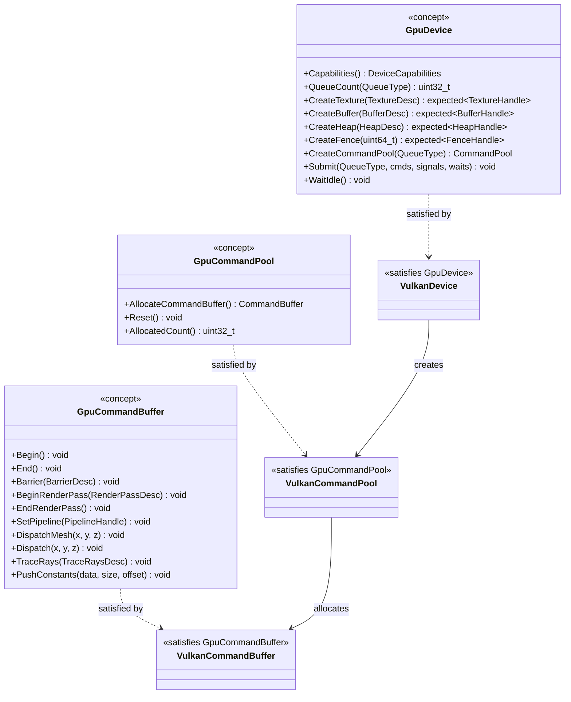
```mermaid
classDiagram
    class GpuDevice {
        <<concept>>
        +Capabilities() DeviceCapabilities
        +QueueCount(QueueType) uint32_t
        +CreateTexture(TextureDesc) expected~TextureHandle~
        +CreateBuffer(BufferDesc) expected~BufferHandle~
        +CreateHeap(HeapDesc) expected~HeapHandle~
        +CreateFence(uint64_t) expected~FenceHandle~
        +CreateCommandPool(QueueType) CommandPool
        +Submit(QueueType, cmds, signals, waits) void
        +WaitIdle() void
    }
    class GpuCommandBuffer {
        <<concept>>
        +Begin() void
        +End() void
        +Barrier(BarrierDesc) void
        +BeginRenderPass(RenderPassDesc) void
        +EndRenderPass() void
        +SetPipeline(PipelineHandle) void
        +DispatchMesh(x, y, z) void
        +Dispatch(x, y, z) void
        +TraceRays(TraceRaysDesc) void
        +PushConstants(data, size, offset) void
    }
    class GpuCommandPool {
        <<concept>>
        +AllocateCommandBuffer() CommandBuffer
        +Reset() void
        +AllocatedCount() uint32_t
    }
    class VulkanDevice {
        <<satisfies GpuDevice>>
    }
    class VulkanCommandBuffer {
        <<satisfies GpuCommandBuffer>>
    }
    class VulkanCommandPool {
        <<satisfies GpuCommandPool>>
    }

    GpuDevice ..> VulkanDevice : satisfied by
    GpuCommandBuffer ..> VulkanCommandBuffer : satisfied by
    GpuCommandPool ..> VulkanCommandPool : satisfied by
    VulkanDevice --> VulkanCommandPool : creates
    VulkanCommandPool --> VulkanCommandBuffer : allocates
```

### 2. VulkanDevice

`harmonius::gpu::vulkan::VulkanDevice` -- the central device class owning all
Vulkan handles and satisfying the `GpuDevice` concept.

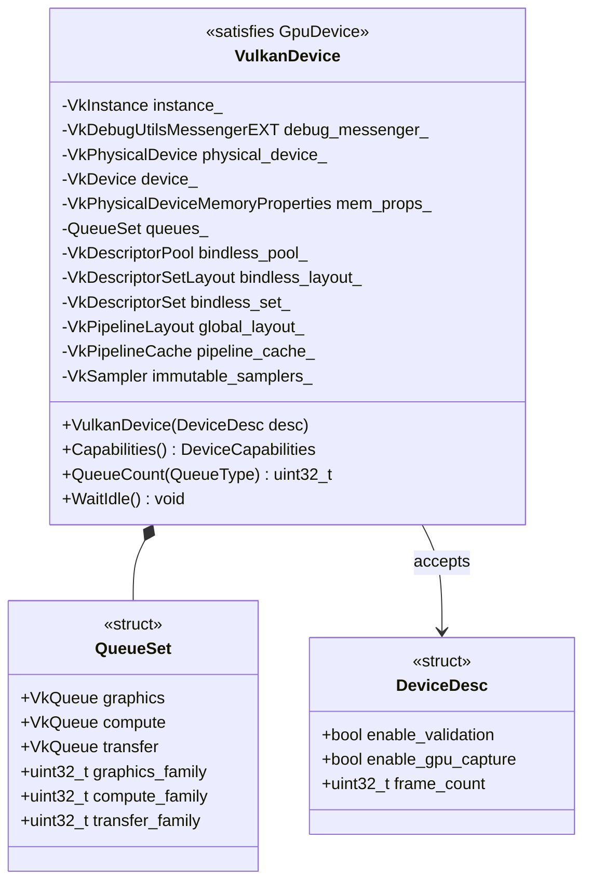
```mermaid
classDiagram
    class VulkanDevice {
        <<satisfies GpuDevice>>
        -VkInstance instance_
        -VkDebugUtilsMessengerEXT debug_messenger_
        -VkPhysicalDevice physical_device_
        -VkDevice device_
        -VkPhysicalDeviceMemoryProperties mem_props_
        -QueueSet queues_
        -VkDescriptorPool bindless_pool_
        -VkDescriptorSetLayout bindless_layout_
        -VkDescriptorSet bindless_set_
        -VkPipelineLayout global_layout_
        -VkPipelineCache pipeline_cache_
        -VkSampler immutable_samplers_
        +VulkanDevice(DeviceDesc desc)
        +Capabilities() DeviceCapabilities
        +QueueCount(QueueType) uint32_t
        +WaitIdle() void
    }
    class QueueSet {
        <<struct>>
        +VkQueue graphics
        +VkQueue compute
        +VkQueue transfer
        +uint32_t graphics_family
        +uint32_t compute_family
        +uint32_t transfer_family
    }
    class DeviceDesc {
        <<struct>>
        +bool enable_validation
        +bool enable_gpu_capture
        +uint32_t frame_count
    }

    VulkanDevice *-- QueueSet
    VulkanDevice --> DeviceDesc : accepts
```

### 3. DeviceCapabilities and Feature Detection

Populated from `VkPhysicalDeviceFeatures2` and related feature structs at device
creation. Consumed by the render graph gating system.

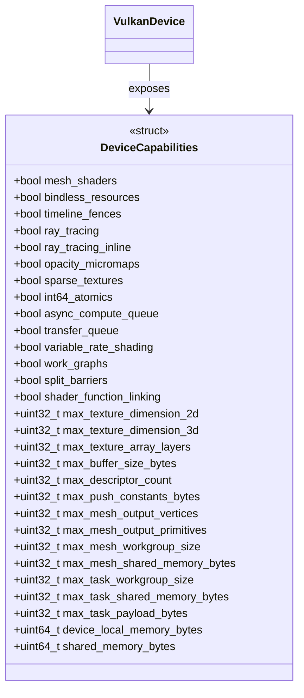
```mermaid
classDiagram
    class DeviceCapabilities {
        <<struct>>
        +bool mesh_shaders
        +bool bindless_resources
        +bool timeline_fences
        +bool ray_tracing
        +bool ray_tracing_inline
        +bool opacity_micromaps
        +bool sparse_textures
        +bool int64_atomics
        +bool async_compute_queue
        +bool transfer_queue
        +bool variable_rate_shading
        +bool work_graphs
        +bool split_barriers
        +bool shader_function_linking
        +uint32_t max_texture_dimension_2d
        +uint32_t max_texture_dimension_3d
        +uint32_t max_texture_array_layers
        +uint32_t max_buffer_size_bytes
        +uint32_t max_descriptor_count
        +uint32_t max_push_constants_bytes
        +uint32_t max_mesh_output_vertices
        +uint32_t max_mesh_output_primitives
        +uint32_t max_mesh_workgroup_size
        +uint32_t max_mesh_shared_memory_bytes
        +uint32_t max_task_workgroup_size
        +uint32_t max_task_shared_memory_bytes
        +uint32_t max_task_payload_bytes
        +uint64_t device_local_memory_bytes
        +uint64_t shared_memory_bytes
    }

    VulkanDevice --> DeviceCapabilities : exposes
```

**Vulkan feature struct mapping:**

```mermaid
classDiagram
    class VkPhysicalDeviceMeshShaderFeaturesEXT {
        <<Vulkan struct>>
        +VkBool32 meshShader
        +VkBool32 taskShader
    }
    class VkPhysicalDeviceDescriptorIndexingFeatures {
        <<Vulkan struct>>
        +VkBool32 shaderSampledImageArrayNonUniformIndexing
        +VkBool32 descriptorBindingSampledImageUpdateAfterBind
        +VkBool32 descriptorBindingPartiallyBound
        +VkBool32 runtimeDescriptorArray
    }
    class VkPhysicalDeviceTimelineSemaphoreFeatures {
        <<Vulkan struct>>
        +VkBool32 timelineSemaphore
    }
    class VkPhysicalDeviceSynchronization2Features {
        <<Vulkan struct>>
        +VkBool32 synchronization2
    }
    class VkPhysicalDeviceDynamicRenderingFeatures {
        <<Vulkan struct>>
        +VkBool32 dynamicRendering
    }
    class VkPhysicalDeviceRayTracingPipelineFeaturesKHR {
        <<Vulkan struct>>
        +VkBool32 rayTracingPipeline
    }
    class VkPhysicalDeviceAccelerationStructureFeaturesKHR {
        <<Vulkan struct>>
        +VkBool32 accelerationStructure
    }
    class DeviceCapabilities {
        <<struct>>
    }

    DeviceCapabilities <-- VkPhysicalDeviceMeshShaderFeaturesEXT : mesh_shaders
    DeviceCapabilities <-- VkPhysicalDeviceDescriptorIndexingFeatures : bindless
    DeviceCapabilities <-- VkPhysicalDeviceTimelineSemaphoreFeatures : fences
    DeviceCapabilities <-- VkPhysicalDeviceSynchronization2Features : required
    DeviceCapabilities <-- VkPhysicalDeviceDynamicRenderingFeatures : required
    DeviceCapabilities <-- VkPhysicalDeviceRayTracingPipelineFeaturesKHR : ray_tracing
    DeviceCapabilities <-- VkPhysicalDeviceAccelerationStructureFeaturesKHR : ray_tracing
```

### 4. Texture and Buffer Resources

VulkanDevice resource creation methods and the descriptor types they consume.

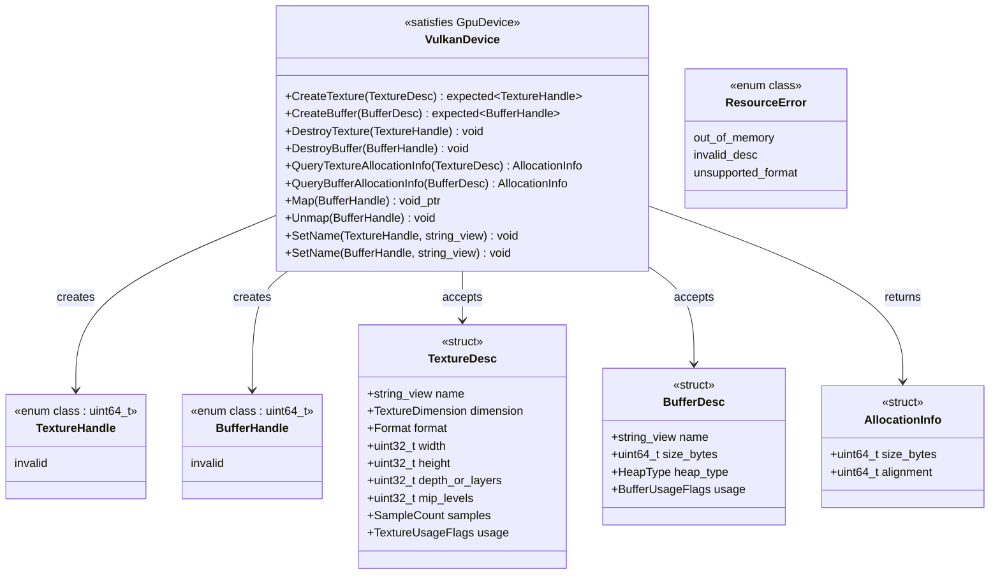
```mermaid
classDiagram
    class VulkanDevice {
        <<satisfies GpuDevice>>
        +CreateTexture(TextureDesc) expected~TextureHandle~
        +CreateBuffer(BufferDesc) expected~BufferHandle~
        +DestroyTexture(TextureHandle) void
        +DestroyBuffer(BufferHandle) void
        +QueryTextureAllocationInfo(TextureDesc) AllocationInfo
        +QueryBufferAllocationInfo(BufferDesc) AllocationInfo
        +Map(BufferHandle) void_ptr
        +Unmap(BufferHandle) void
        +SetName(TextureHandle, string_view) void
        +SetName(BufferHandle, string_view) void
    }
    class TextureHandle {
        <<enum class : uint64_t>>
        invalid
    }
    class BufferHandle {
        <<enum class : uint64_t>>
        invalid
    }
    class TextureDesc {
        <<struct>>
        +string_view name
        +TextureDimension dimension
        +Format format
        +uint32_t width
        +uint32_t height
        +uint32_t depth_or_layers
        +uint32_t mip_levels
        +SampleCount samples
        +TextureUsageFlags usage
    }
    class BufferDesc {
        <<struct>>
        +string_view name
        +uint64_t size_bytes
        +HeapType heap_type
        +BufferUsageFlags usage
    }
    class AllocationInfo {
        <<struct>>
        +uint64_t size_bytes
        +uint64_t alignment
    }
    class ResourceError {
        <<enum class>>
        out_of_memory
        invalid_desc
        unsupported_format
    }

    VulkanDevice --> TextureHandle : creates
    VulkanDevice --> BufferHandle : creates
    VulkanDevice --> TextureDesc : accepts
    VulkanDevice --> BufferDesc : accepts
    VulkanDevice --> AllocationInfo : returns
```

### 5. Resource Enums

Format, dimension, usage, and heap type enumerations used by resource creation.

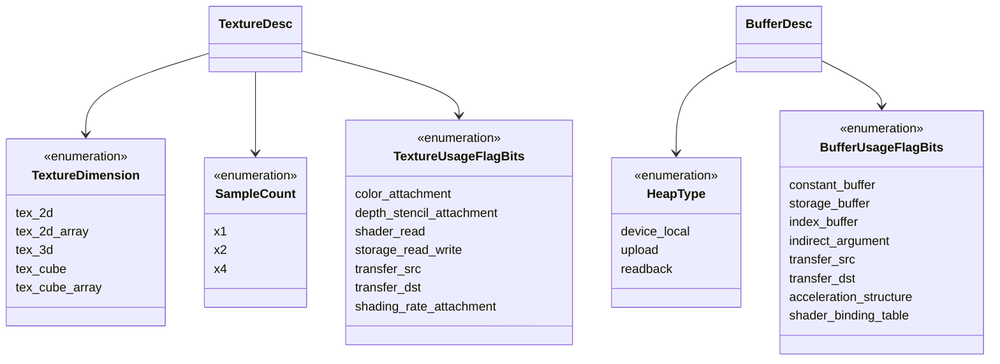
```mermaid
classDiagram
    class TextureDimension {
        <<enumeration>>
        tex_2d
        tex_2d_array
        tex_3d
        tex_cube
        tex_cube_array
    }
    class SampleCount {
        <<enumeration>>
        x1
        x2
        x4
    }
    class TextureUsageFlagBits {
        <<enumeration>>
        color_attachment
        depth_stencil_attachment
        shader_read
        storage_read_write
        transfer_src
        transfer_dst
        shading_rate_attachment
    }
    class BufferUsageFlagBits {
        <<enumeration>>
        constant_buffer
        storage_buffer
        index_buffer
        indirect_argument
        transfer_src
        transfer_dst
        acceleration_structure
        shader_binding_table
    }
    class HeapType {
        <<enumeration>>
        device_local
        upload
        readback
    }

    TextureDesc --> TextureDimension
    TextureDesc --> SampleCount
    TextureDesc --> TextureUsageFlagBits
    BufferDesc --> HeapType
    BufferDesc --> BufferUsageFlagBits
```

### 6. Heap and Placed Resources

Aliasing support for the render graph transient resource system. Uses dedicated
pools for explicit offset placement.

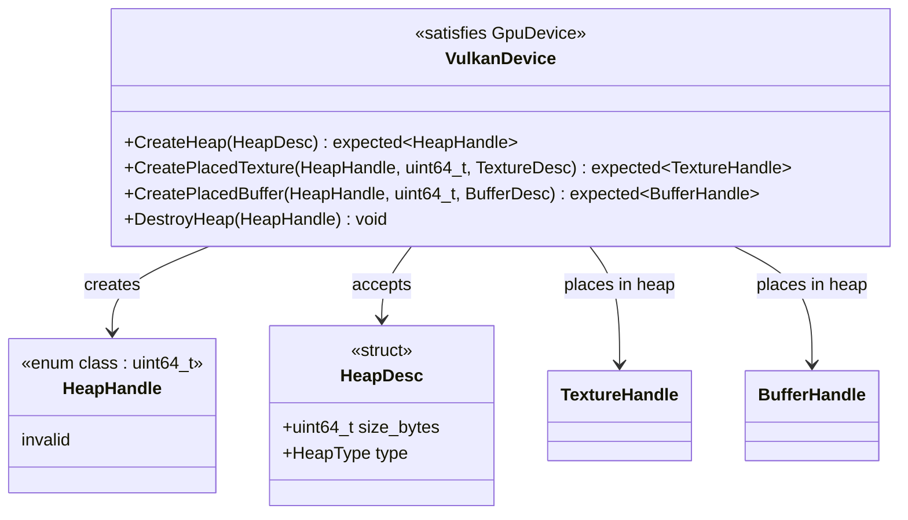
```mermaid
classDiagram
    class VulkanDevice {
        <<satisfies GpuDevice>>
        +CreateHeap(HeapDesc) expected~HeapHandle~
        +CreatePlacedTexture(HeapHandle, uint64_t, TextureDesc) expected~TextureHandle~
        +CreatePlacedBuffer(HeapHandle, uint64_t, BufferDesc) expected~BufferHandle~
        +DestroyHeap(HeapHandle) void
    }
    class HeapHandle {
        <<enum class : uint64_t>>
        invalid
    }
    class HeapDesc {
        <<struct>>
        +uint64_t size_bytes
        +HeapType type
    }

    VulkanDevice --> HeapHandle : creates
    VulkanDevice --> HeapDesc : accepts
    VulkanDevice --> TextureHandle : places in heap
    VulkanDevice --> BufferHandle : places in heap
```

### 7. Sparse Resources

Sparse binding for virtual texture streaming via `VK_IMAGE_CREATE_SPARSE_BINDING_BIT`
and `VK_IMAGE_CREATE_SPARSE_RESIDENCY_BIT`.

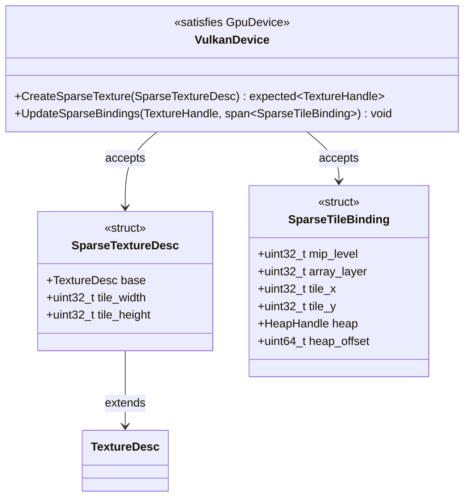
```mermaid
classDiagram
    class VulkanDevice {
        <<satisfies GpuDevice>>
        +CreateSparseTexture(SparseTextureDesc) expected~TextureHandle~
        +UpdateSparseBindings(TextureHandle, span~SparseTileBinding~) void
    }
    class SparseTextureDesc {
        <<struct>>
        +TextureDesc base
        +uint32_t tile_width
        +uint32_t tile_height
    }
    class SparseTileBinding {
        <<struct>>
        +uint32_t mip_level
        +uint32_t array_layer
        +uint32_t tile_x
        +uint32_t tile_y
        +HeapHandle heap
        +uint64_t heap_offset
    }

    VulkanDevice --> SparseTextureDesc : accepts
    VulkanDevice --> SparseTileBinding : accepts
    SparseTextureDesc --> TextureDesc : extends
```

### 8. Acceleration Structures

Ray tracing BLAS/TLAS resource management (soft-gated on
`VK_KHR_acceleration_structure`).

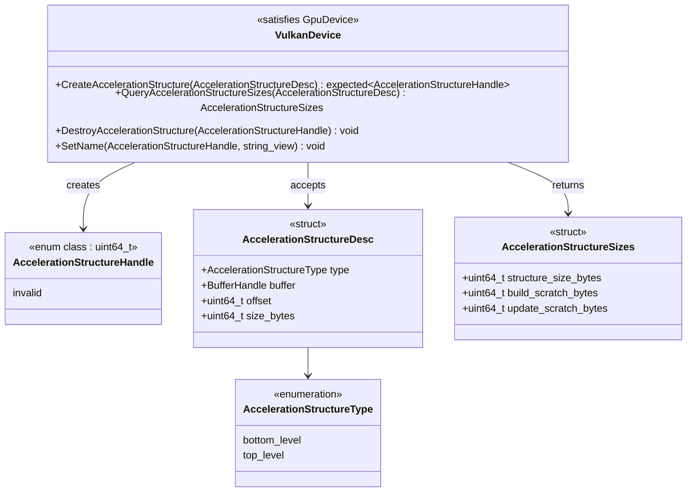
```mermaid
classDiagram
    class VulkanDevice {
        <<satisfies GpuDevice>>
        +CreateAccelerationStructure(AccelerationStructureDesc) expected~AccelerationStructureHandle~
        +QueryAccelerationStructureSizes(AccelerationStructureDesc) AccelerationStructureSizes
        +DestroyAccelerationStructure(AccelerationStructureHandle) void
        +SetName(AccelerationStructureHandle, string_view) void
    }
    class AccelerationStructureHandle {
        <<enum class : uint64_t>>
        invalid
    }
    class AccelerationStructureType {
        <<enumeration>>
        bottom_level
        top_level
    }
    class AccelerationStructureDesc {
        <<struct>>
        +AccelerationStructureType type
        +BufferHandle buffer
        +uint64_t offset
        +uint64_t size_bytes
    }
    class AccelerationStructureSizes {
        <<struct>>
        +uint64_t structure_size_bytes
        +uint64_t build_scratch_bytes
        +uint64_t update_scratch_bytes
    }

    VulkanDevice --> AccelerationStructureHandle : creates
    VulkanDevice --> AccelerationStructureDesc : accepts
    VulkanDevice --> AccelerationStructureSizes : returns
    AccelerationStructureDesc --> AccelerationStructureType
```

**Geometry and build types:**

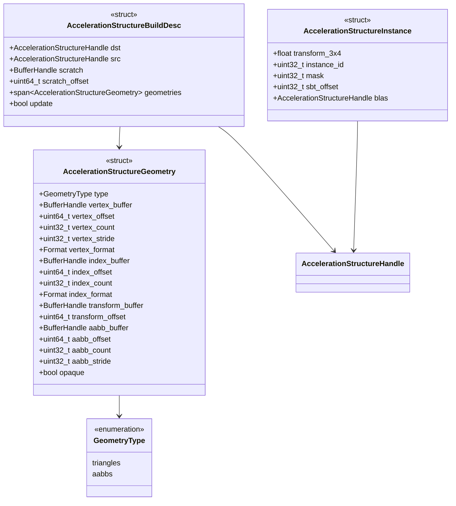
```mermaid
classDiagram
    class AccelerationStructureGeometry {
        <<struct>>
        +GeometryType type
        +BufferHandle vertex_buffer
        +uint64_t vertex_offset
        +uint32_t vertex_count
        +uint32_t vertex_stride
        +Format vertex_format
        +BufferHandle index_buffer
        +uint64_t index_offset
        +uint32_t index_count
        +Format index_format
        +BufferHandle transform_buffer
        +uint64_t transform_offset
        +BufferHandle aabb_buffer
        +uint64_t aabb_offset
        +uint32_t aabb_count
        +uint32_t aabb_stride
        +bool opaque
    }
    class GeometryType {
        <<enumeration>>
        triangles
        aabbs
    }
    class AccelerationStructureBuildDesc {
        <<struct>>
        +AccelerationStructureHandle dst
        +AccelerationStructureHandle src
        +BufferHandle scratch
        +uint64_t scratch_offset
        +span~AccelerationStructureGeometry~ geometries
        +bool update
    }
    class AccelerationStructureInstance {
        <<struct>>
        +float transform_3x4
        +uint32_t instance_id
        +uint32_t mask
        +uint32_t sbt_offset
        +AccelerationStructureHandle blas
    }

    AccelerationStructureGeometry --> GeometryType
    AccelerationStructureBuildDesc --> AccelerationStructureGeometry
    AccelerationStructureBuildDesc --> AccelerationStructureHandle
    AccelerationStructureInstance --> AccelerationStructureHandle
```

### 9. VulkanCommandPool and VulkanCommandBuffer

`VulkanCommandPool` wraps `VkCommandPool` with a free-list cache.
`VulkanCommandBuffer` wraps `VkCommandBuffer`.

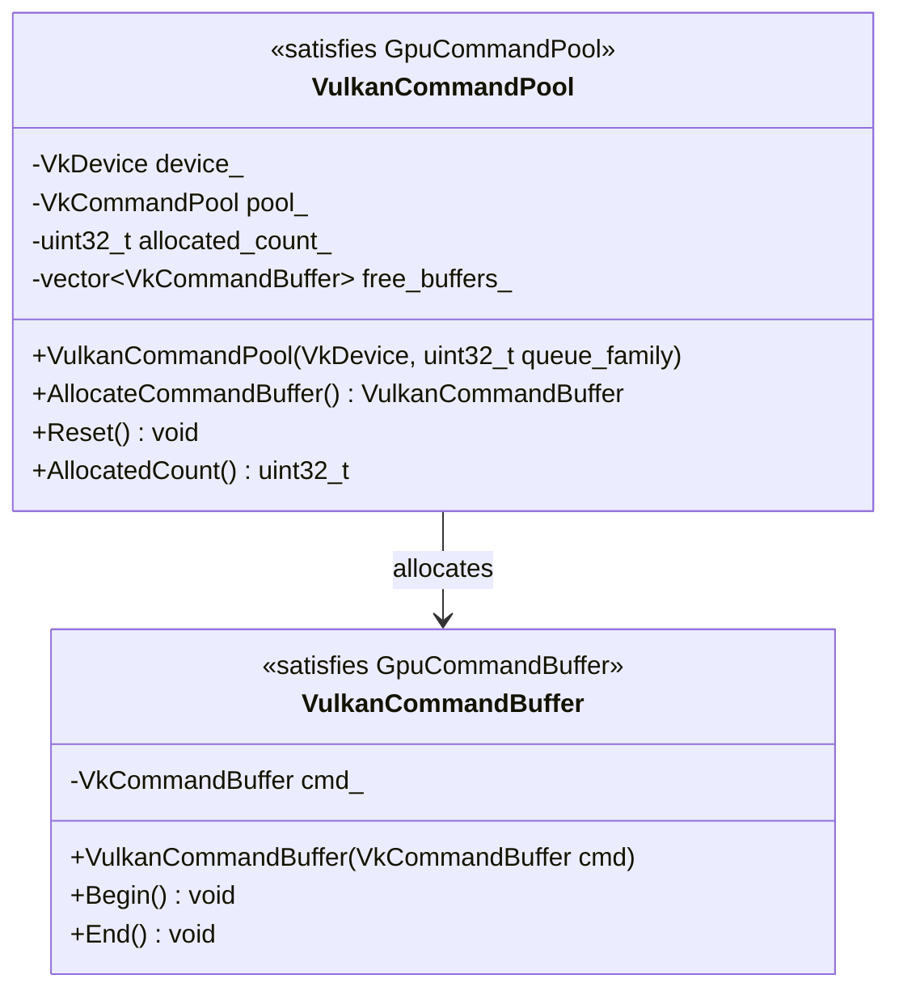
```mermaid
classDiagram
    class VulkanCommandPool {
        <<satisfies GpuCommandPool>>
        -VkDevice device_
        -VkCommandPool pool_
        -uint32_t allocated_count_
        -vector~VkCommandBuffer~ free_buffers_
        +VulkanCommandPool(VkDevice, uint32_t queue_family)
        +AllocateCommandBuffer() VulkanCommandBuffer
        +Reset() void
        +AllocatedCount() uint32_t
    }
    class VulkanCommandBuffer {
        <<satisfies GpuCommandBuffer>>
        -VkCommandBuffer cmd_
        +VulkanCommandBuffer(VkCommandBuffer cmd)
        +Begin() void
        +End() void
    }

    VulkanCommandPool --> VulkanCommandBuffer : allocates
```

### 10. VulkanCommandBuffer Full API

All command recording methods on `VulkanCommandBuffer`, grouped by category.

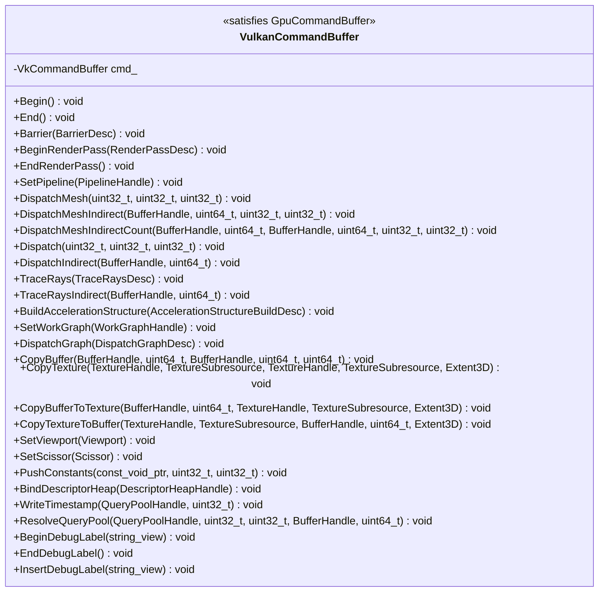
```mermaid
classDiagram
    class VulkanCommandBuffer {
        <<satisfies GpuCommandBuffer>>
        -VkCommandBuffer cmd_
        +Begin() void
        +End() void
        +Barrier(BarrierDesc) void
        +BeginRenderPass(RenderPassDesc) void
        +EndRenderPass() void
        +SetPipeline(PipelineHandle) void
        +DispatchMesh(uint32_t, uint32_t, uint32_t) void
        +DispatchMeshIndirect(BufferHandle, uint64_t, uint32_t, uint32_t) void
        +DispatchMeshIndirectCount(BufferHandle, uint64_t, BufferHandle, uint64_t, uint32_t, uint32_t) void
        +Dispatch(uint32_t, uint32_t, uint32_t) void
        +DispatchIndirect(BufferHandle, uint64_t) void
        +TraceRays(TraceRaysDesc) void
        +TraceRaysIndirect(BufferHandle, uint64_t) void
        +BuildAccelerationStructure(AccelerationStructureBuildDesc) void
        +SetWorkGraph(WorkGraphHandle) void
        +DispatchGraph(DispatchGraphDesc) void
        +CopyBuffer(BufferHandle, uint64_t, BufferHandle, uint64_t, uint64_t) void
        +CopyTexture(TextureHandle, TextureSubresource, TextureHandle, TextureSubresource, Extent3D) void
        +CopyBufferToTexture(BufferHandle, uint64_t, TextureHandle, TextureSubresource, Extent3D) void
        +CopyTextureToBuffer(TextureHandle, TextureSubresource, BufferHandle, uint64_t, Extent3D) void
        +SetViewport(Viewport) void
        +SetScissor(Scissor) void
        +PushConstants(const_void_ptr, uint32_t, uint32_t) void
        +BindDescriptorHeap(DescriptorHeapHandle) void
        +WriteTimestamp(QueryPoolHandle, uint32_t) void
        +ResolveQueryPool(QueryPoolHandle, uint32_t, uint32_t, BufferHandle, uint64_t) void
        +BeginDebugLabel(string_view) void
        +EndDebugLabel() void
        +InsertDebugLabel(string_view) void
    }
```

### 11. Render Pass Types

Types consumed by `BeginRenderPass` -- mapped to `vkCmdBeginRendering` (dynamic
rendering, no `VkRenderPass` or `VkFramebuffer`).

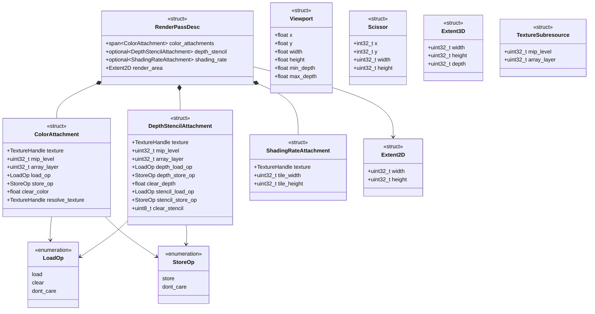
```mermaid
classDiagram
    class RenderPassDesc {
        <<struct>>
        +span~ColorAttachment~ color_attachments
        +optional~DepthStencilAttachment~ depth_stencil
        +optional~ShadingRateAttachment~ shading_rate
        +Extent2D render_area
    }
    class ColorAttachment {
        <<struct>>
        +TextureHandle texture
        +uint32_t mip_level
        +uint32_t array_layer
        +LoadOp load_op
        +StoreOp store_op
        +float clear_color
        +TextureHandle resolve_texture
    }
    class DepthStencilAttachment {
        <<struct>>
        +TextureHandle texture
        +uint32_t mip_level
        +uint32_t array_layer
        +LoadOp depth_load_op
        +StoreOp depth_store_op
        +float clear_depth
        +LoadOp stencil_load_op
        +StoreOp stencil_store_op
        +uint8_t clear_stencil
    }
    class ShadingRateAttachment {
        <<struct>>
        +TextureHandle texture
        +uint32_t tile_width
        +uint32_t tile_height
    }
    class LoadOp {
        <<enumeration>>
        load
        clear
        dont_care
    }
    class StoreOp {
        <<enumeration>>
        store
        dont_care
    }
    class Viewport {
        <<struct>>
        +float x
        +float y
        +float width
        +float height
        +float min_depth
        +float max_depth
    }
    class Scissor {
        <<struct>>
        +int32_t x
        +int32_t y
        +uint32_t width
        +uint32_t height
    }
    class Extent2D {
        <<struct>>
        +uint32_t width
        +uint32_t height
    }
    class Extent3D {
        <<struct>>
        +uint32_t width
        +uint32_t height
        +uint32_t depth
    }
    class TextureSubresource {
        <<struct>>
        +uint32_t mip_level
        +uint32_t array_layer
    }

    RenderPassDesc *-- ColorAttachment
    RenderPassDesc *-- DepthStencilAttachment
    RenderPassDesc *-- ShadingRateAttachment
    RenderPassDesc --> Extent2D
    ColorAttachment --> LoadOp
    ColorAttachment --> StoreOp
    DepthStencilAttachment --> LoadOp
    DepthStencilAttachment --> StoreOp
```

### 12. Indirect Command Types

GPU-side argument structs written by compute culling passes and consumed by
indirect dispatch, plus ray tracing and work graph dispatch descriptors.

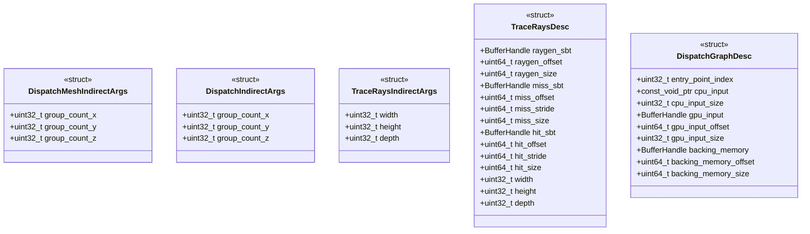
```mermaid
classDiagram
    class DispatchMeshIndirectArgs {
        <<struct>>
        +uint32_t group_count_x
        +uint32_t group_count_y
        +uint32_t group_count_z
    }
    class DispatchIndirectArgs {
        <<struct>>
        +uint32_t group_count_x
        +uint32_t group_count_y
        +uint32_t group_count_z
    }
    class TraceRaysIndirectArgs {
        <<struct>>
        +uint32_t width
        +uint32_t height
        +uint32_t depth
    }
    class TraceRaysDesc {
        <<struct>>
        +BufferHandle raygen_sbt
        +uint64_t raygen_offset
        +uint64_t raygen_size
        +BufferHandle miss_sbt
        +uint64_t miss_offset
        +uint64_t miss_stride
        +uint64_t miss_size
        +BufferHandle hit_sbt
        +uint64_t hit_offset
        +uint64_t hit_stride
        +uint64_t hit_size
        +uint32_t width
        +uint32_t height
        +uint32_t depth
    }
    class DispatchGraphDesc {
        <<struct>>
        +uint32_t entry_point_index
        +const_void_ptr cpu_input
        +uint32_t cpu_input_size
        +BufferHandle gpu_input
        +uint64_t gpu_input_offset
        +uint32_t gpu_input_size
        +BufferHandle backing_memory
        +uint64_t backing_memory_offset
        +uint64_t backing_memory_size
    }
```

### 13. Barrier System

Vulkan Synchronization2 barrier types. `VulkanCommandBuffer::Barrier()` translates
the abstract `BarrierDesc` into `vkCmdPipelineBarrier2` calls.

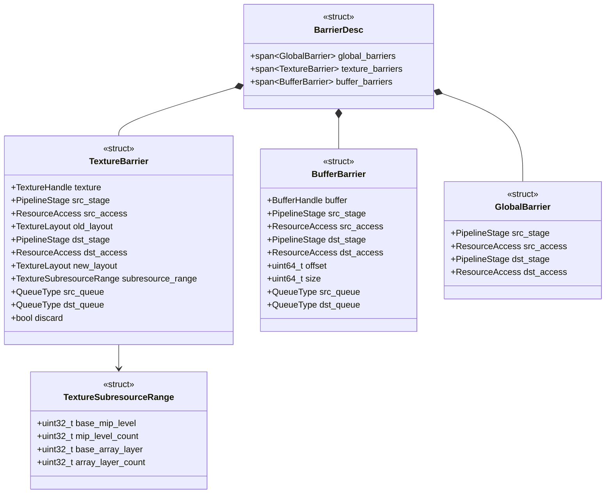
```mermaid
classDiagram
    class BarrierDesc {
        <<struct>>
        +span~GlobalBarrier~ global_barriers
        +span~TextureBarrier~ texture_barriers
        +span~BufferBarrier~ buffer_barriers
    }
    class TextureBarrier {
        <<struct>>
        +TextureHandle texture
        +PipelineStage src_stage
        +ResourceAccess src_access
        +TextureLayout old_layout
        +PipelineStage dst_stage
        +ResourceAccess dst_access
        +TextureLayout new_layout
        +TextureSubresourceRange subresource_range
        +QueueType src_queue
        +QueueType dst_queue
        +bool discard
    }
    class BufferBarrier {
        <<struct>>
        +BufferHandle buffer
        +PipelineStage src_stage
        +ResourceAccess src_access
        +PipelineStage dst_stage
        +ResourceAccess dst_access
        +uint64_t offset
        +uint64_t size
        +QueueType src_queue
        +QueueType dst_queue
    }
    class GlobalBarrier {
        <<struct>>
        +PipelineStage src_stage
        +ResourceAccess src_access
        +PipelineStage dst_stage
        +ResourceAccess dst_access
    }
    class TextureSubresourceRange {
        <<struct>>
        +uint32_t base_mip_level
        +uint32_t mip_level_count
        +uint32_t base_array_layer
        +uint32_t array_layer_count
    }

    BarrierDesc *-- GlobalBarrier
    BarrierDesc *-- TextureBarrier
    BarrierDesc *-- BufferBarrier
    TextureBarrier --> TextureSubresourceRange
```

### 14. Barrier and Synchronization Enums

Stage, access, layout, and queue type enumerations used throughout the
synchronization system.

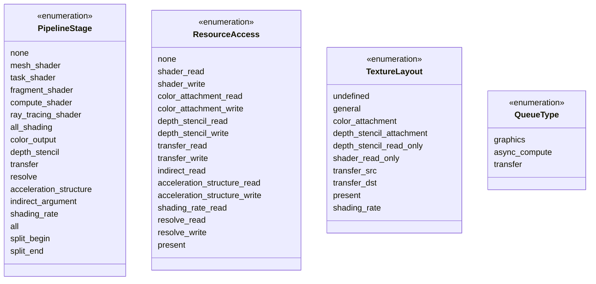
```mermaid
classDiagram
    class PipelineStage {
        <<enumeration>>
        none
        mesh_shader
        task_shader
        fragment_shader
        compute_shader
        ray_tracing_shader
        all_shading
        color_output
        depth_stencil
        transfer
        resolve
        acceleration_structure
        indirect_argument
        shading_rate
        all
        split_begin
        split_end
    }
    class ResourceAccess {
        <<enumeration>>
        none
        shader_read
        shader_write
        color_attachment_read
        color_attachment_write
        depth_stencil_read
        depth_stencil_write
        transfer_read
        transfer_write
        indirect_read
        acceleration_structure_read
        acceleration_structure_write
        shading_rate_read
        resolve_read
        resolve_write
        present
    }
    class TextureLayout {
        <<enumeration>>
        undefined
        general
        color_attachment
        depth_stencil_attachment
        depth_stencil_read_only
        shader_read_only
        transfer_src
        transfer_dst
        present
        shading_rate
    }
    class QueueType {
        <<enumeration>>
        graphics
        async_compute
        transfer
    }
```

### 15. Timeline Fences

Vulkan timeline semaphores implementing the abstract `FenceHandle` interface.

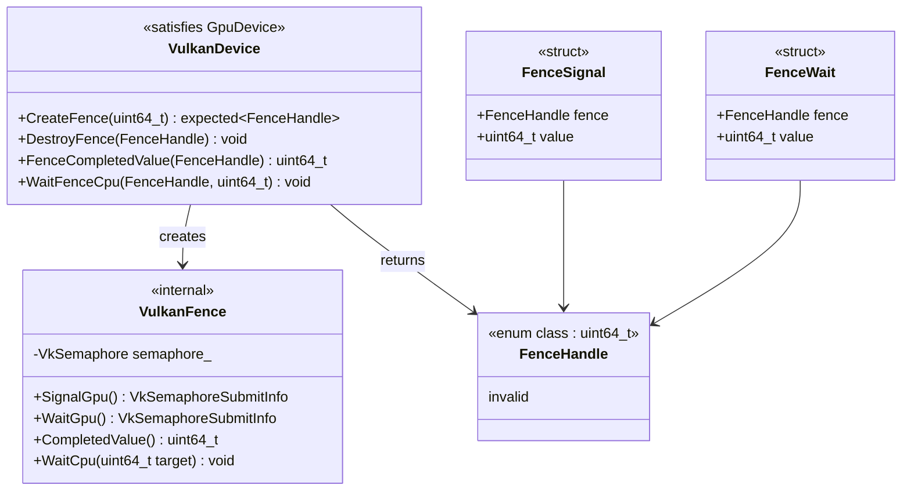
```mermaid
classDiagram
    class VulkanDevice {
        <<satisfies GpuDevice>>
        +CreateFence(uint64_t) expected~FenceHandle~
        +DestroyFence(FenceHandle) void
        +FenceCompletedValue(FenceHandle) uint64_t
        +WaitFenceCpu(FenceHandle, uint64_t) void
    }
    class VulkanFence {
        <<internal>>
        -VkSemaphore semaphore_
        +SignalGpu() VkSemaphoreSubmitInfo
        +WaitGpu() VkSemaphoreSubmitInfo
        +CompletedValue() uint64_t
        +WaitCpu(uint64_t target) void
    }
    class FenceHandle {
        <<enum class : uint64_t>>
        invalid
    }
    class FenceSignal {
        <<struct>>
        +FenceHandle fence
        +uint64_t value
    }
    class FenceWait {
        <<struct>>
        +FenceHandle fence
        +uint64_t value
    }

    VulkanDevice --> VulkanFence : creates
    VulkanDevice --> FenceHandle : returns
    FenceSignal --> FenceHandle
    FenceWait --> FenceHandle
```

### 16. Mesh Render Pipeline

The sole rasterization pipeline type -- task/mesh/fragment stages only. No
vertex/geometry/tessellation pipeline exists.

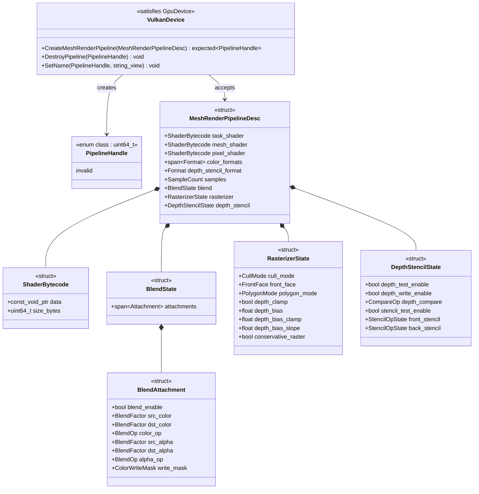
```mermaid
classDiagram
    class VulkanDevice {
        <<satisfies GpuDevice>>
        +CreateMeshRenderPipeline(MeshRenderPipelineDesc) expected~PipelineHandle~
        +DestroyPipeline(PipelineHandle) void
        +SetName(PipelineHandle, string_view) void
    }
    class PipelineHandle {
        <<enum class : uint64_t>>
        invalid
    }
    class MeshRenderPipelineDesc {
        <<struct>>
        +ShaderBytecode task_shader
        +ShaderBytecode mesh_shader
        +ShaderBytecode pixel_shader
        +span~Format~ color_formats
        +Format depth_stencil_format
        +SampleCount samples
        +BlendState blend
        +RasterizerState rasterizer
        +DepthStencilState depth_stencil
    }
    class ShaderBytecode {
        <<struct>>
        +const_void_ptr data
        +uint64_t size_bytes
    }
    class BlendState {
        <<struct>>
        +span~Attachment~ attachments
    }
    class BlendAttachment {
        <<struct>>
        +bool blend_enable
        +BlendFactor src_color
        +BlendFactor dst_color
        +BlendOp color_op
        +BlendFactor src_alpha
        +BlendFactor dst_alpha
        +BlendOp alpha_op
        +ColorWriteMask write_mask
    }
    class RasterizerState {
        <<struct>>
        +CullMode cull_mode
        +FrontFace front_face
        +PolygonMode polygon_mode
        +bool depth_clamp
        +float depth_bias
        +float depth_bias_clamp
        +float depth_bias_slope
        +bool conservative_raster
    }
    class DepthStencilState {
        <<struct>>
        +bool depth_test_enable
        +bool depth_write_enable
        +CompareOp depth_compare
        +bool stencil_test_enable
        +StencilOpState front_stencil
        +StencilOpState back_stencil
    }

    VulkanDevice --> PipelineHandle : creates
    VulkanDevice --> MeshRenderPipelineDesc : accepts
    MeshRenderPipelineDesc *-- ShaderBytecode
    MeshRenderPipelineDesc *-- BlendState
    MeshRenderPipelineDesc *-- RasterizerState
    MeshRenderPipelineDesc *-- DepthStencilState
    BlendState *-- BlendAttachment
```

### 17. Pipeline Library Linking

`VK_EXT_graphics_pipeline_library` splits mesh render pipelines into independently
compiled library objects linked with LTO. Requires
`DeviceCapabilities::shader_function_linking`.

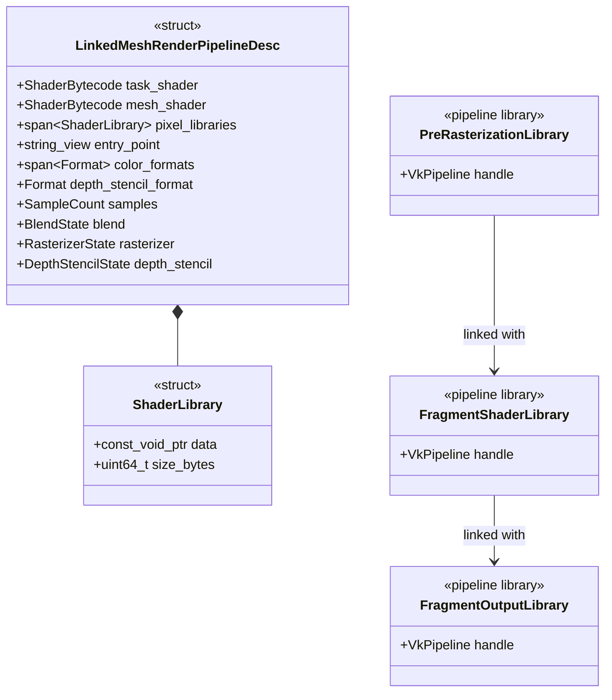
```mermaid
classDiagram
    class LinkedMeshRenderPipelineDesc {
        <<struct>>
        +ShaderBytecode task_shader
        +ShaderBytecode mesh_shader
        +span~ShaderLibrary~ pixel_libraries
        +string_view entry_point
        +span~Format~ color_formats
        +Format depth_stencil_format
        +SampleCount samples
        +BlendState blend
        +RasterizerState rasterizer
        +DepthStencilState depth_stencil
    }
    class ShaderLibrary {
        <<struct>>
        +const_void_ptr data
        +uint64_t size_bytes
    }
    class PreRasterizationLibrary {
        <<pipeline library>>
        +VkPipeline handle
    }
    class FragmentShaderLibrary {
        <<pipeline library>>
        +VkPipeline handle
    }
    class FragmentOutputLibrary {
        <<pipeline library>>
        +VkPipeline handle
    }

    LinkedMeshRenderPipelineDesc *-- ShaderLibrary
    PreRasterizationLibrary --> FragmentShaderLibrary : linked with
    FragmentShaderLibrary --> FragmentOutputLibrary : linked with
```

**Pipeline library linking flow:**

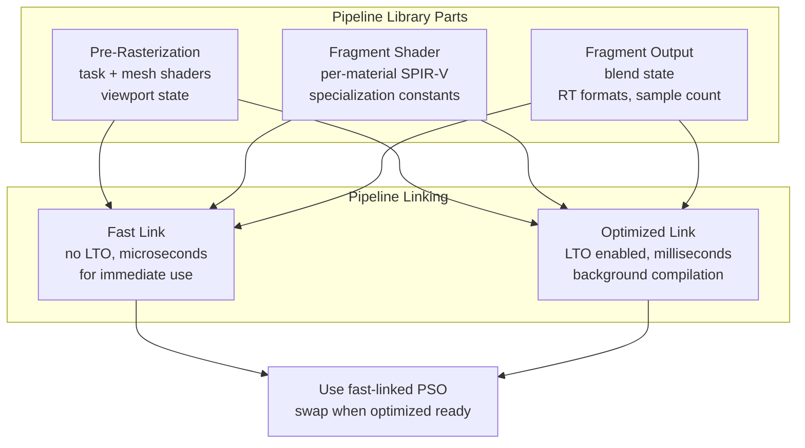
```mermaid
flowchart TD
    subgraph Libraries["Pipeline Library Parts"]
        PR["Pre-Rasterization\ntask + mesh shaders\nviewport state"]
        FS["Fragment Shader\nper-material SPIR-V\nspecialization constants"]
        FO["Fragment Output\nblend state\nRT formats, sample count"]
    end

    subgraph Linking["Pipeline Linking"]
        FAST["Fast Link\nno LTO, microseconds\nfor immediate use"]
        OPT["Optimized Link\nLTO enabled, milliseconds\nbackground compilation"]
    end

    PR --> FAST
    FS --> FAST
    FO --> FAST

    PR --> OPT
    FS --> OPT
    FO --> OPT

    FAST --> USE["Use fast-linked PSO\nswap when optimized ready"]
    OPT --> USE
```

### 18. Compute and Ray Tracing Pipelines

```mermaid
classDiagram
    class VulkanDevice {
        <<satisfies GpuDevice>>
        +CreateComputePipeline(ComputePipelineDesc) expected~PipelineHandle~
        +CreateRayTracingPipeline(RayTracingPipelineDesc) expected~PipelineHandle~
        +CreateWorkGraph(WorkGraphDesc) expected~WorkGraphHandle~
        +DestroyWorkGraph(WorkGraphHandle) void
    }
    class ComputePipelineDesc {
        <<struct>>
        +ShaderBytecode compute_shader
    }
    class RayTracingPipelineDesc {
        <<struct>>
        +ShaderBytecode ray_generation
        +span~ShaderBytecode~ miss_shaders
        +span~HitGroup~ hit_groups
        +uint32_t max_recursion_depth
        +uint32_t max_payload_size
        +uint32_t max_attribute_size
    }
    class HitGroup {
        <<struct>>
        +ShaderBytecode closest_hit
        +ShaderBytecode any_hit
        +ShaderBytecode intersection
    }
    class WorkGraphHandle {
        <<enum class : uint64_t>>
        invalid
    }
    class WorkGraphDesc {
        <<struct>>
        +ShaderBytecode state_object
        +string_view program_name
    }
    class WorkGraphMemoryRequirements {
        <<struct>>
        +uint64_t min_backing_memory_bytes
        +uint64_t max_backing_memory_bytes
        +uint64_t max_input_records_bytes
    }
    class PipelineError {
        <<enum class>>
        compilation_failed
        unsupported_feature
        out_of_memory
    }

    VulkanDevice --> ComputePipelineDesc : accepts
    VulkanDevice --> RayTracingPipelineDesc : accepts
    VulkanDevice --> WorkGraphDesc : accepts
    VulkanDevice --> WorkGraphHandle : creates
    RayTracingPipelineDesc *-- HitGroup
    RayTracingPipelineDesc *-- ShaderBytecode
    HitGroup *-- ShaderBytecode
```

### 19. Pipeline Cache

Wraps `VkPipelineCache` for persisting compiled pipeline state across sessions.

```mermaid
classDiagram
    class VulkanDevice {
        <<satisfies GpuDevice>>
        +CreatePipelineCache(PipelineCacheDesc) expected~PipelineCacheHandle~
        +SerializePipelineCache(PipelineCacheHandle) vector~uint8_t~
        +DestroyPipelineCache(PipelineCacheHandle) void
    }
    class PipelineCacheHandle {
        <<enum class : uint64_t>>
        invalid
    }
    class PipelineCacheDesc {
        <<struct>>
        +const_void_ptr initial_data
        +uint64_t initial_data_size
    }

    VulkanDevice --> PipelineCacheHandle : creates
    VulkanDevice --> PipelineCacheDesc : accepts
```

### 20. Descriptor Binding

Descriptor heap and write types for the bindless resource binding model.

```mermaid
classDiagram
    class VulkanDevice {
        <<satisfies GpuDevice>>
        +CreateDescriptorHeap(DescriptorHeapDesc) expected~DescriptorHeapHandle~
        +WriteDescriptor(DescriptorHeapHandle, uint32_t, DescriptorWrite) void
        +DestroyDescriptorHeap(DescriptorHeapHandle) void
    }
    class DescriptorHeapHandle {
        <<enum class : uint64_t>>
        invalid
    }
    class DescriptorHeapDesc {
        <<struct>>
        +uint32_t max_descriptors
        +uint32_t max_samplers
    }
    class DescriptorType {
        <<enumeration>>
        srv_texture
        srv_buffer
        uav_texture
        uav_buffer
        cbv
        sampler
        acceleration_structure
    }
    class DescriptorWrite {
        <<struct>>
        +DescriptorType type
        +uint32_t index
        +TextureHandle texture
        +Format format
        +uint32_t mip_level
        +uint32_t mip_count
        +uint32_t array_layer
        +uint32_t layer_count
        +BufferHandle buffer
        +uint64_t offset
        +uint64_t size
        +uint32_t structure_stride
        +AccelerationStructureHandle acceleration_structure
        +SamplerDesc sampler
    }

    VulkanDevice --> DescriptorHeapHandle : creates
    VulkanDevice --> DescriptorHeapDesc : accepts
    VulkanDevice --> DescriptorWrite : accepts
    DescriptorWrite --> DescriptorType
```

### 21. Bindless Descriptor Set Layout

Internal Vulkan descriptor set layout -- a single set with six bindings using
`UPDATE_AFTER_BIND` and `PARTIALLY_BOUND` flags.

```mermaid
flowchart LR
    subgraph DSL["Bindless Descriptor Set - set 0"]
        B0["Binding 0\nSAMPLED_IMAGE\n1M descriptors"]
        B1["Binding 1\nSTORAGE_IMAGE\n100K descriptors"]
        B2["Binding 2\nSTORAGE_BUFFER\n100K descriptors"]
        B3["Binding 3\nSAMPLER\n2048 immutable"]
        B4["Binding 4\nUNIFORM_BUFFER\n1 descriptor"]
        B5["Binding 5\nACCEL_STRUCTURE\n16 descriptors"]
    end

    subgraph Flags["Binding Flags"]
        F1["UPDATE_AFTER_BIND"]
        F2["PARTIALLY_BOUND"]
        F3["VARIABLE_DESCRIPTOR_COUNT"]
    end

    subgraph PL["Global Pipeline Layout"]
        S0["Set 0: bindless_layout_"]
        PC["Push Constants: 128 bytes\nVK_SHADER_STAGE_ALL"]
    end

    Flags --> DSL
    DSL --> PL
```

### 22. Swapchain and Presentation

```mermaid
classDiagram
    class VulkanDevice {
        <<satisfies GpuDevice>>
        +CreateSwapchain(SwapchainDesc) expected~SwapchainHandle~
        +AcquireNextImage(SwapchainHandle) expected~TextureHandle~
        +Present(SwapchainHandle) void
        +ResizeSwapchain(SwapchainHandle, uint32_t, uint32_t) void
        +DestroySwapchain(SwapchainHandle) void
    }
    class SwapchainHandle {
        <<enum class : uint64_t>>
        invalid
    }
    class SwapchainDesc {
        <<struct>>
        +void_ptr native_window
        +uint32_t width
        +uint32_t height
        +Format format
        +uint32_t image_count
        +bool vsync
    }
    class VulkanSwapchainState {
        <<internal>>
        -VkSwapchainKHR swapchain
        -VkSurfaceKHR surface
        -VkFormat format
        -VkColorSpaceKHR color_space
        -VkPresentModeKHR present_mode
        -VkSurfaceTransformFlagBitsKHR pre_transform
        -uint32_t image_count
        -vector~VkImage~ images
    }
    class DeviceError {
        <<enum class>>
        initialization_failed
        out_of_memory
        surface_lost
    }

    VulkanDevice --> SwapchainHandle : creates
    VulkanDevice --> SwapchainDesc : accepts
    VulkanDevice *-- VulkanSwapchainState
    VulkanSwapchainState --> TextureHandle : yields via acquire
```

### 23. Diagnostics

Query pools for timestamp and pipeline statistics, plus debug label and resource
naming support via `VK_EXT_debug_utils`.

```mermaid
classDiagram
    class VulkanDevice {
        <<satisfies GpuDevice>>
        +CreateQueryPool(QueryPoolDesc) expected~QueryPoolHandle~
        +DestroyQueryPool(QueryPoolHandle) void
        +TimestampPeriodNs() double
        +SetName(FenceHandle, string_view) void
    }
    class QueryPoolHandle {
        <<enum class : uint64_t>>
        invalid
    }
    class QueryPoolDesc {
        <<struct>>
        +QueryType type
        +uint32_t count
    }
    class QueryType {
        <<enumeration>>
        timestamp
        pipeline_statistics
    }
    class VulkanCommandBuffer {
        <<satisfies GpuCommandBuffer>>
        +WriteTimestamp(QueryPoolHandle, uint32_t) void
        +ResolveQueryPool(QueryPoolHandle, uint32_t, uint32_t, BufferHandle, uint64_t) void
        +BeginDebugLabel(string_view) void
        +EndDebugLabel() void
        +InsertDebugLabel(string_view) void
    }

    VulkanDevice --> QueryPoolHandle : creates
    VulkanDevice --> QueryPoolDesc : accepts
    QueryPoolDesc --> QueryType
    VulkanCommandBuffer --> QueryPoolHandle : writes to
```

### 24. Conversion Helpers

Free functions in `harmonius::gpu::vulkan` that translate abstract types to native
Vulkan enumerations. Used internally by `VulkanDevice` and `VulkanCommandBuffer`.

**Stage, access, and layout conversion:**

```mermaid
classDiagram
    class to_vk_stage {
        <<free function>>
        +PipelineStage to VkPipelineStageFlags2
    }
    class to_vk_access {
        <<free function>>
        +ResourceAccess to VkAccessFlags2
    }
    class to_vk_layout {
        <<free function>>
        +TextureLayout to VkImageLayout
    }
    class to_vk_queue_family {
        <<free function>>
        +QueueType to uint32_t
    }
    class to_vk_subresource_range {
        <<free function>>
        +TextureSubresourceRange to VkImageSubresourceRange
    }

    to_vk_stage --> PipelineStage : reads
    to_vk_access --> ResourceAccess : reads
    to_vk_layout --> TextureLayout : reads
```

**Resource creation conversion:**

```mermaid
classDiagram
    class to_vk_format {
        <<free function>>
        +Format to VkFormat
    }
    class to_vk_image_type {
        <<free function>>
        +TextureDimension to VkImageType
    }
    class to_vk_image_usage {
        <<free function>>
        +TextureUsageFlags to VkImageUsageFlags
    }
    class to_vk_buffer_usage {
        <<free function>>
        +BufferUsageFlags to VkBufferUsageFlags
    }
    class to_vk_sample_count {
        <<free function>>
        +SampleCount to VkSampleCountFlagBits
    }
    class to_vk_load_op {
        <<free function>>
        +LoadOp to VkAttachmentLoadOp
    }
    class to_vk_store_op {
        <<free function>>
        +StoreOp to VkAttachmentStoreOp
    }
    class to_vk_clear_value {
        <<free function>>
        +clear_color to VkClearValue
    }
```

### 25. Cross-Class Relationships

How all Vulkan backend classes relate to each other and to the abstract GPU backend
concepts.

```mermaid
classDiagram
    class GpuDevice {
        <<concept>>
    }
    class GpuCommandBuffer {
        <<concept>>
    }
    class GpuCommandPool {
        <<concept>>
    }
    class VulkanDevice {
        <<satisfies GpuDevice>>
        -VkDevice device_
        -VkPhysicalDeviceMemoryProperties mem_props_
        -VkDescriptorSet bindless_set_
        -VkPipelineLayout global_layout_
        -VkPipelineCache pipeline_cache_
    }
    class VulkanCommandPool {
        <<satisfies GpuCommandPool>>
        -VkCommandPool pool_
        -vector~VkCommandBuffer~ free_buffers_
    }
    class VulkanCommandBuffer {
        <<satisfies GpuCommandBuffer>>
        -VkCommandBuffer cmd_
    }
    class VulkanFence {
        <<internal>>
        -VkSemaphore semaphore_
    }
    class QueueSet {
        <<struct>>
        +VkQueue graphics
        +VkQueue compute
        +VkQueue transfer
    }
    class DeviceCapabilities {
        <<struct>>
    }
    class VulkanSwapchainState {
        <<internal>>
        -VkSwapchainKHR swapchain
    }

    GpuDevice ..> VulkanDevice : satisfied by
    GpuCommandBuffer ..> VulkanCommandBuffer : satisfied by
    GpuCommandPool ..> VulkanCommandPool : satisfied by
    VulkanDevice --> VulkanCommandPool : creates
    VulkanCommandPool --> VulkanCommandBuffer : allocates
    VulkanDevice --> VulkanFence : creates
    VulkanDevice *-- QueueSet
    VulkanDevice --> DeviceCapabilities : exposes
    VulkanDevice *-- VulkanSwapchainState
    VulkanDevice --> TextureHandle : creates
    VulkanDevice --> BufferHandle : creates
    VulkanDevice --> HeapHandle : creates
    VulkanDevice --> FenceHandle : creates
    VulkanDevice --> PipelineHandle : creates
    VulkanDevice --> PipelineCacheHandle : creates
    VulkanDevice --> QueryPoolHandle : creates
    VulkanDevice --> SwapchainHandle : creates
    VulkanDevice --> AccelerationStructureHandle : creates
    VulkanDevice --> DescriptorHeapHandle : creates
```

---

## Vulkan-Specific Details

### 26. Instance and Device Creation

The Vulkan backend requires Vulkan 1.4 (which promotes synchronization2, timeline
semaphores, dynamic rendering, maintenance4, and push descriptors to core) plus
several extensions.

```mermaid
flowchart TD
    A["Create VkInstance\nVK_API_VERSION_1_4"] --> B["Setup VK_EXT_debug_utils\nMessenger"]
    B --> C["Enumerate Physical Devices\nvkEnumeratePhysicalDevices"]
    C --> D{"Check Required\nFeatures"}

    D -->|meshShader| E["VK_EXT_mesh_shader"]
    D -->|descriptorIndexing| F["VK_EXT_descriptor_indexing\n(core 1.2 + extended)"]
    D -->|timelineSemaphore| G["Timeline Semaphores\n(core 1.2)"]
    D -->|synchronization2| H["Synchronization2\n(core 1.3)"]
    D -->|dynamicRendering| I["Dynamic Rendering\n(core 1.3)"]

    E --> J{"Check Soft-Gated\nFeatures"}
    F --> J
    G --> J
    H --> J
    I --> J

    J -->|optional| K["VK_KHR_acceleration_structure"]
    J -->|optional| L["VK_KHR_ray_tracing_pipeline"]
    J -->|optional| M["VK_EXT_graphics_pipeline_library"]
    J --> N["Query Queue Families"]

    K --> N
    L --> N
    M --> N

    N --> O["Select Queue Families\ngraphics + compute + transfer"]
    O --> P["Create VkDevice\nwith enabled extensions"]
    P --> R["Get Queue Handles\nvkGetDeviceQueue"]
    R --> S["Create Bindless Descriptor Pool\nUPDATE_AFTER_BIND"]
    S --> T["Create Descriptor Set Layout\nUnbounded arrays per binding"]
    T --> U["Allocate Bindless Descriptor Set"]
    U --> V["Create Global Pipeline Layout\nbindless_layout_ + push constants"]
    V --> W["Create Pipeline Cache\nLoad from disk if available"]
```

**Required vs. soft-gated extensions:**

| Extension | Requirement | Vulkan Feature Check |
|-----------|-------------|---------------------|
| `VK_EXT_mesh_shader` | Hard | `meshShader`, `taskShader` |
| `VK_EXT_descriptor_indexing` | Hard | Multiple non-uniform indexing + update-after-bind flags |
| Timeline semaphores | Hard (core 1.2) | `VkPhysicalDeviceTimelineSemaphoreFeatures` |
| Synchronization2 | Hard (core 1.3) | `VkPhysicalDeviceSynchronization2Features` |
| Dynamic rendering | Hard (core 1.3) | `VkPhysicalDeviceDynamicRenderingFeatures` |
| `VK_KHR_acceleration_structure` | Soft-gated | `accelerationStructure` |
| `VK_KHR_ray_tracing_pipeline` | Soft-gated | `rayTracingPipeline` |
| `VK_EXT_graphics_pipeline_library` | Soft-gated | `graphicsPipelineLibrary` |
| `VK_KHR_fragment_shading_rate` | Soft-gated | `pipelineFragmentShadingRate` |

### 27. Memory Management

Memory management (sub-allocation, defragmentation, budget tracking) is handled by the
GPU runtime layer (`harmonius::gpu_runtime::memory`). The Vulkan backend provides only
raw Vulkan memory and resource creation primitives:

| Backend Method | Vulkan API Call |
|----------------|-----------------|
| `CreateHeap()` | `vkAllocateMemory` with selected memory type |
| `CreatePlacedTexture()` | `vkCreateImage` + `vkBindImageMemory2` at offset |
| `CreatePlacedBuffer()` | `vkCreateBuffer` + `vkBindBufferMemory2` at offset |
| `CreateTexture()` | `vkCreateImage` + `vkAllocateMemory` + `vkBindImageMemory` |
| `CreateBuffer()` | `vkCreateBuffer` + `vkAllocateMemory` + `vkBindBufferMemory` |
| `QueryTextureAllocationInfo()` | `vkGetImageMemoryRequirements` |
| `QueryBufferAllocationInfo()` | `vkGetBufferMemoryRequirements` |

**HeapType to Vulkan memory property mapping:**

| `HeapType` | Vulkan Memory Properties |
|------------|-------------------------|
| `kDeviceLocal` | `VK_MEMORY_PROPERTY_DEVICE_LOCAL_BIT` |
| `kUpload` | `HOST_VISIBLE_BIT \| HOST_COHERENT_BIT` (prefer `DEVICE_LOCAL` if available) |
| `kReadback` | `HOST_VISIBLE_BIT \| HOST_CACHED_BIT` |

**Placed resource aliasing flow:**

1. `CreateHeap()` allocates a `VkDeviceMemory` block of the requested size
2. `CreatePlacedTexture()` / `CreatePlacedBuffer()` binds a resource at a
   specific offset using `vkBindImageMemory2` / `vkBindBufferMemory2`
3. Multiple resources alias the same memory at non-overlapping lifetime intervals
4. Before first use of an aliased resource, the render graph issues a barrier with
   `oldLayout = VK_IMAGE_LAYOUT_UNDEFINED` to reset metadata

### 28. Queue Family Selection

The backend selects one queue from each distinct family to map to the three
abstract queue types. Queue family indices are stored in `QueueSet` and used for
ownership transfer barriers.

| `QueueType` | Queue Family Selection | Allowed Operations |
|-------------|----------------------|-------------------|
| `kGraphics` | Family with `GRAPHICS_BIT \| COMPUTE_BIT` | All: draw, Dispatch, copy, RT, AS Build |
| `kAsyncCompute` | Dedicated family with `COMPUTE_BIT` only | Dispatch, copy |
| `kTransfer` | Dedicated family with `TRANSFER_BIT` only | Copy operations |

When a resource transitions between queues from different families, Vulkan requires
explicit queue ownership transfer barriers (release on source queue, acquire on
destination queue). The render graph barrier compiler emits these automatically
based on `QueueSet` family indices.

### 29. Dynamic Rendering

The Vulkan backend uses dynamic rendering (core in Vulkan 1.3) exclusively. No
`VkRenderPass` or `VkFramebuffer` objects are created:

- `BeginRenderPass()` maps to `vkCmdBeginRendering` with `VkRenderingInfo`
- `EndRenderPass()` maps to `vkCmdEndRendering`
- Pipeline creation uses `VkPipelineRenderingCreateInfo` in the `pNext` chain

**Image view caching:** `VkImageView` objects required for rendering attachments
are cached per frame, keyed by `(VkImage, format, mip, layer, aspect)`. Views are
destroyed when the frame they were used in completes (tracked via timeline
semaphore).

---

## Sequence Diagrams

### 30. Device Initialization Sequence

Full initialization sequence from `VulkanDevice` construction through to a ready
device with bindless descriptors, pipeline layout, and pipeline cache.

```mermaid
sequenceDiagram
    participant App
    participant VD as VulkanDevice
    participant Vk as Vulkan API
    App->>VD: VulkanDevice(DeviceDesc)
    VD->>Vk: vkCreateInstance(VK_API_VERSION_1_4)
    Vk-->>VD: VkInstance
    VD->>Vk: vkCreateDebugUtilsMessengerEXT
    VD->>Vk: vkEnumeratePhysicalDevices
    Vk-->>VD: physical devices
    VD->>Vk: vkGetPhysicalDeviceFeatures2
    Note over VD: Check mesh_shader, descriptor_indexing,<br/>timeline_semaphore, synchronization2,<br/>dynamic_rendering
    VD->>Vk: vkGetPhysicalDeviceQueueFamilyProperties2
    Note over VD: Select graphics, compute, transfer families
    VD->>Vk: vkCreateDevice (extensions + features)
    Vk-->>VD: VkDevice
    VD->>Vk: vkGetDeviceQueue (x3)
    Vk-->>VD: graphics, compute, transfer queues
    VD->>Vk: vkGetPhysicalDeviceMemoryProperties2
    Vk-->>VD: memory properties
    VD->>Vk: vkCreateDescriptorSetLayout (bindless)
    VD->>Vk: vkCreateDescriptorPool (UPDATE_AFTER_BIND)
    VD->>Vk: vkAllocateDescriptorSets
    Vk-->>VD: bindless_set_
    VD->>Vk: vkCreatePipelineLayout
    Vk-->>VD: global_layout_
    VD->>Vk: vkCreatePipelineCache
    Vk-->>VD: pipeline_cache_
    VD-->>App: VulkanDevice ready
```

### 31. Synchronization2 Barrier Sequence

How `VulkanCommandBuffer::Barrier()` translates abstract barrier descriptors into
Vulkan synchronization2 calls. Covers texture barriers (layout transitions), buffer
barriers, queue ownership transfers, and split barriers via events.

```mermaid
sequenceDiagram
    participant RG as Render Graph
    participant CB as VulkanCommandBuffer
    participant Vk as Vulkan API

    Note over RG,Vk: Texture Barrier (layout transition)
    RG->>CB: Barrier(BarrierDesc)
    CB->>CB: Translate to VkImageMemoryBarrier2
    Note over CB: srcStageMask, srcAccessMask,<br/>dstStageMask, dstAccessMask,<br/>oldLayout, newLayout
    CB->>Vk: vkCmdPipelineBarrier2(VkDependencyInfo)

    Note over RG,Vk: Buffer Barrier (storage write to read)
    RG->>CB: Barrier(BarrierDesc)
    CB->>CB: Translate to VkBufferMemoryBarrier2
    CB->>Vk: vkCmdPipelineBarrier2(VkDependencyInfo)

    Note over RG,Vk: Queue ownership transfer
    RG->>CB: Barrier(BarrierDesc) on compute queue
    CB->>CB: Build release barrier
    Note over CB: srcQueueFamilyIndex = compute,<br/>dstQueueFamilyIndex = graphics
    CB->>Vk: vkCmdPipelineBarrier2 (release)
    RG->>CB: Barrier(BarrierDesc) on graphics queue
    CB->>CB: Build acquire barrier
    CB->>Vk: vkCmdPipelineBarrier2 (acquire)

    Note over RG,Vk: Split barrier via events
    RG->>CB: Barrier(split_begin)
    CB->>Vk: vkCmdSetEvent2(event, VkDependencyInfo)
    Note over CB: Intervening commands overlap
    RG->>CB: Barrier(split_end)
    CB->>Vk: vkCmdWaitEvents2(event, VkDependencyInfo)
```

### 32. Swapchain Recreation Sequence

When the window surface dimensions change, the Vulkan backend destroys and
recreates the `VkSwapchainKHR`. The old handle is passed as `oldSwapchain` to
allow driver resource recycling.

```mermaid
sequenceDiagram
    participant App
    participant VD as VulkanDevice
    participant Vk as Vulkan API

    App->>VD: ResizeSwapchain(handle, width, height)
    VD->>VD: WaitIdle()
    VD->>Vk: vkDeviceWaitIdle
    Note over VD: All in-flight frames complete
    VD->>Vk: vkCreateSwapchainKHR(oldSwapchain)
    Vk-->>VD: new VkSwapchainKHR
    VD->>Vk: vkDestroySwapchainKHR(old)
    VD->>Vk: vkGetSwapchainImagesKHR
    Vk-->>VD: new VkImage handles
    VD->>VD: Invalidate cached VkImageViews
    VD-->>App: swapchain ready

    Note over App,Vk: Next frame resumes normally
    App->>VD: AcquireNextImage(handle)
    VD->>Vk: vkAcquireNextImageKHR
    Vk-->>VD: image index
    VD-->>App: TextureHandle
```

### 33. Multi-Queue Synchronization Sequence

Timeline semaphore coordination between graphics, compute, and transfer queues.

```mermaid
sequenceDiagram
    participant GFX as Graphics Queue
    participant AC as Compute Queue
    participant TX as Transfer Queue
    participant TS as Timeline Semaphore

    TX->>TX: vkCmdCopyBufferToImage
    TX->>TS: Signal(101) via VkSubmitInfo2
    GFX->>TS: Wait(101) via VkSubmitInfo2
    Note over TX,GFX: Queue ownership transfer barrier pair
    GFX->>GFX: vkCmdDrawMeshTasksEXT
    GFX->>TS: Signal(201)
    AC->>TS: Wait(201)
    AC->>AC: vkCmdDispatch (post-process)
    AC->>TS: Signal(301)
    GFX->>TS: Wait(301)
    GFX->>GFX: Final composite
```
