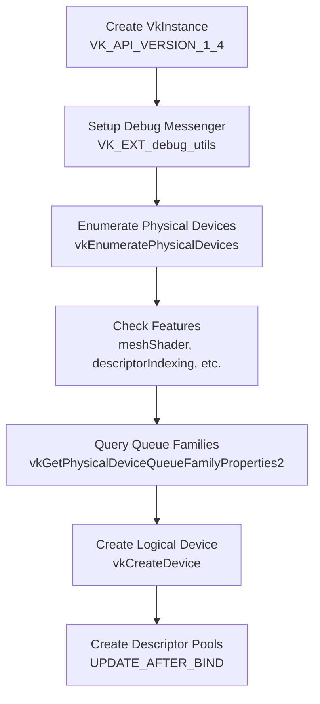
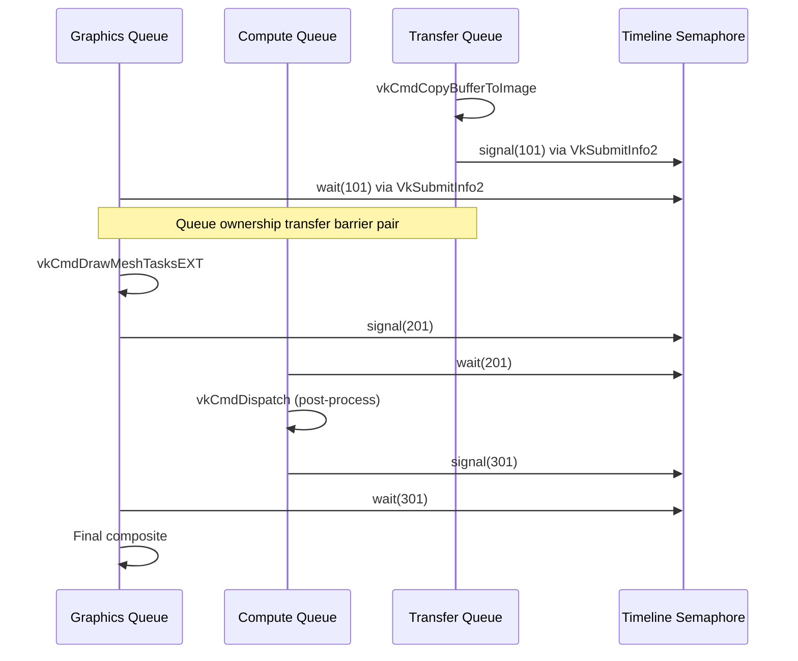
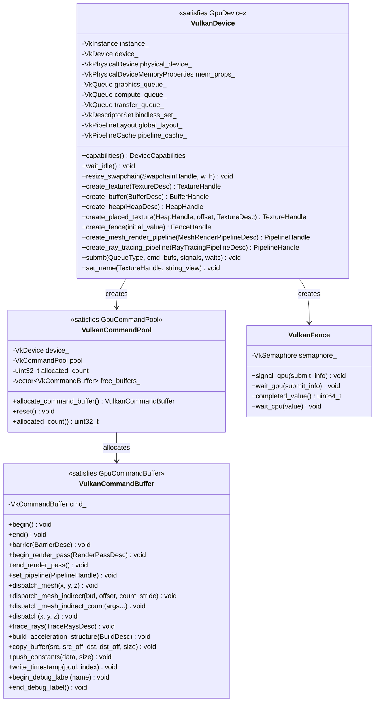

# GPU Backend — Vulkan

Implementation of the `harmonius::gpu` interface for Windows and SteamOS/Linux via Vulkan 1.4.
Covers device creation, resource management, command recording, synchronization, pipeline state,
and resource binding using the native Vulkan API.

**Requirements:** R-1.2.3 (Windows + SteamOS via Vulkan), R-1.1.5 (native backend),
R-1.1.6 (modern hardware).

**Minimum API:** Vulkan 1.4 (core promotion of synchronization2, timeline semaphores,
dynamic rendering, maintenance4, push descriptors).

**Required Extensions:**
- `VK_EXT_mesh_shader` — mesh and task shaders (not core in 1.4)
- `VK_EXT_descriptor_indexing` — bindless rendering (core in 1.2, extended features required)
- `VK_KHR_acceleration_structure` — BLAS/TLAS (soft-gated)
- `VK_KHR_ray_tracing_pipeline` — ray tracing dispatch (soft-gated)
- `VK_KHR_deferred_host_operations` — required by acceleration structures
- `VK_KHR_swapchain` — presentation
- `VK_EXT_debug_utils` — debug labels and naming

**Specifications:**
- [Vulkan Specification](https://docs.vulkan.org/spec/latest/index.html)
- [Vulkan Reference Pages](https://docs.vulkan.org/refpages/latest/refpages/index.html)

---

## Contents

- [Device Initialization](#device-initialization)
- [Queue Topology](#queue-topology)
- [Resource Management](#resource-management)
  - [Memory Types and Heaps](#memory-types-and-heaps)
  - [Image Creation](#image-creation)
  - [Buffer Creation](#buffer-creation)
  - [Placed Resources and Aliasing](#placed-resources-and-aliasing)
  - [Sparse Resources](#sparse-resources)
  - [Memory Allocator](#memory-allocator)
- [Command Recording](#command-recording)
  - [Command Pools and Buffers](#command-pools-and-buffers)
  - [Dynamic Rendering](#dynamic-rendering)
  - [Swapchain Resize](#swapchain-resize)
- [Synchronization](#synchronization)
  - [Pipeline Barriers (Synchronization2)](#pipeline-barriers-synchronization2)
  - [Timeline Semaphores](#timeline-semaphores)
  - [Multi-Queue Synchronization](#multi-queue-synchronization)
  - [Split Barriers via Events](#split-barriers-via-events)
- [Mesh Shader Pipeline](#mesh-shader-pipeline)
  - [Pipeline Creation](#pipeline-creation)
  - [Draw Commands](#draw-commands)
  - [Limits](#limits)
- [Ray Tracing](#ray-tracing)
  - [Acceleration Structures](#acceleration-structures)
  - [Ray Tracing Pipeline](#ray-tracing-pipeline)
  - [Shader Binding Table](#shader-binding-table)
- [Resource Binding](#resource-binding)
  - [Descriptor Indexing (Bindless)](#descriptor-indexing-bindless)
  - [Descriptor Set Layout](#descriptor-set-layout)
  - [Push Constants](#push-constants)
- [Pipeline State](#pipeline-state)
  - [Graphics Pipeline (Mesh Shaders)](#graphics-pipeline-mesh-shaders)
  - [Compute Pipeline](#compute-pipeline)
  - [Pipeline Cache](#pipeline-cache)
- [Diagnostics](#diagnostics)
- [Class Diagram](#class-diagram)

---

## Device Initialization



**Feature checks at initialization:**

| Feature | Vulkan Check | Requirement |
|---------|-------------|-------------|
| Mesh shaders | `VkPhysicalDeviceMeshShaderFeaturesEXT.meshShader` | Hard requirement |
| Task shaders | `VkPhysicalDeviceMeshShaderFeaturesEXT.taskShader` | Hard requirement |
| Descriptor indexing | `VkPhysicalDeviceDescriptorIndexingFeatures` (multiple flags) | Hard requirement |
| Timeline semaphores | `VkPhysicalDeviceTimelineSemaphoreFeatures` (core 1.2) | Hard requirement |
| Synchronization2 | `VkPhysicalDeviceSynchronization2Features` (core 1.3) | Hard requirement |
| Dynamic rendering | `VkPhysicalDeviceDynamicRenderingFeatures` (core 1.3) | Hard requirement |
| Ray tracing | `VkPhysicalDeviceRayTracingPipelineFeaturesKHR` | Soft-gated |
| Acceleration structures | `VkPhysicalDeviceAccelerationStructureFeaturesKHR` | Soft-gated |
| 64-bit atomics | `VkPhysicalDeviceShaderAtomicInt64Features.shaderBufferInt64Atomics` | Soft-gated |
| VRS | `VkPhysicalDeviceFragmentShadingRateFeaturesKHR` | Soft-gated |
| Sparse binding | `VkPhysicalDeviceFeatures.sparseBinding` | Soft-gated |

**Implementation class:**

```cpp
namespace harmonius::gpu::vulkan {

class VulkanDevice {
public:
    explicit VulkanDevice(const DeviceDesc& desc);
    ~VulkanDevice();

    VulkanDevice(const VulkanDevice&) = delete;
    VulkanDevice& operator=(const VulkanDevice&) = delete;

    [[nodiscard]] DeviceCapabilities capabilities() const;

    /// Drains all queues — maps to vkDeviceWaitIdle.
    /// Used at shutdown and before pipeline recompilation.
    void wait_idle() { vkDeviceWaitIdle(device_); }

    // Remaining methods — see gpu-backend-interface.md for the full list.

private:
    // --- Vulkan handles ---
    VkInstance                    instance_         = VK_NULL_HANDLE;
    VkDebugUtilsMessengerEXT     debug_messenger_  = VK_NULL_HANDLE;
    VkPhysicalDevice             physical_device_  = VK_NULL_HANDLE;
    VkDevice                     device_           = VK_NULL_HANDLE;
    VkPhysicalDeviceMemoryProperties mem_props_    = {};

    struct QueueSet {
        VkQueue graphics  = VK_NULL_HANDLE;
        VkQueue compute   = VK_NULL_HANDLE;
        VkQueue transfer  = VK_NULL_HANDLE;
        uint32_t graphics_family  = 0;
        uint32_t compute_family   = 0;
        uint32_t transfer_family  = 0;
    } queues_;

    VkDescriptorPool             bindless_pool_    = VK_NULL_HANDLE;
    VkDescriptorSetLayout        bindless_layout_  = VK_NULL_HANDLE;
    VkDescriptorSet              bindless_set_     = VK_NULL_HANDLE;
    VkPipelineLayout             global_layout_    = VK_NULL_HANDLE;
    VkSampler                    immutable_samplers_[16] = {};
};

static_assert(GpuDevice<VulkanDevice>);

} // namespace harmonius::gpu::vulkan
```

---

## Queue Topology

Vulkan exposes queue families. The backend selects one queue from each distinct family:

| `QueueType` | Queue Family Selection | Allowed Operations |
|-------------|----------------------|-------------------|
| `graphics` | Family with `VK_QUEUE_GRAPHICS_BIT \| VK_QUEUE_COMPUTE_BIT` | All: draw, dispatch, copy, RT, AS build |
| `async_compute` | Dedicated family with `VK_QUEUE_COMPUTE_BIT` but without `GRAPHICS_BIT` | Dispatch, copy |
| `transfer` | Dedicated family with `VK_QUEUE_TRANSFER_BIT` only | Copy operations |

**Queue family ownership transfers:** When a resource transitions between queues from different
families, Vulkan requires explicit ownership transfer barriers:

```cpp
// Release on source queue
VkImageMemoryBarrier2 release = {
    .srcStageMask       = VK_PIPELINE_STAGE_2_COMPUTE_SHADER_BIT,
    .srcAccessMask      = VK_ACCESS_2_SHADER_STORAGE_WRITE_BIT,
    .dstStageMask       = VK_PIPELINE_STAGE_2_NONE,
    .dstAccessMask      = VK_ACCESS_2_NONE,
    .oldLayout          = VK_IMAGE_LAYOUT_GENERAL,
    .newLayout          = VK_IMAGE_LAYOUT_SHADER_READ_ONLY_OPTIMAL,
    .srcQueueFamilyIndex = compute_family,
    .dstQueueFamilyIndex = graphics_family,
    .image              = image,
    .subresourceRange   = full_range,
};

// Acquire on destination queue
VkImageMemoryBarrier2 acquire = {
    .srcStageMask       = VK_PIPELINE_STAGE_2_NONE,
    .srcAccessMask      = VK_ACCESS_2_NONE,
    .dstStageMask       = VK_PIPELINE_STAGE_2_FRAGMENT_SHADER_BIT,
    .dstAccessMask      = VK_ACCESS_2_SHADER_SAMPLED_READ_BIT,
    .oldLayout          = VK_IMAGE_LAYOUT_GENERAL,
    .newLayout          = VK_IMAGE_LAYOUT_SHADER_READ_ONLY_OPTIMAL,
    .srcQueueFamilyIndex = compute_family,
    .dstQueueFamilyIndex = graphics_family,
    .image              = image,
    .subresourceRange   = full_range,
};
```

---

## Resource Management

### Memory Types and Heaps

Vulkan exposes memory types with property flags. The backend maps abstract `HeapType` to Vulkan
memory properties:

| `HeapType` | Vulkan Memory Properties |
|------------|-------------------------|
| `device_local` | `VK_MEMORY_PROPERTY_DEVICE_LOCAL_BIT` |
| `upload` | `VK_MEMORY_PROPERTY_HOST_VISIBLE_BIT \| HOST_COHERENT_BIT` (prefer `DEVICE_LOCAL` if available) |
| `readback` | `VK_MEMORY_PROPERTY_HOST_VISIBLE_BIT \| HOST_CACHED_BIT` |

### Image Creation

```cpp
VkImageCreateInfo image_info = {
    .sType       = VK_STRUCTURE_TYPE_IMAGE_CREATE_INFO,
    .imageType   = to_vk_image_type(desc.dimension),
    .format      = to_vk_format(desc.format),
    .extent      = {desc.width, desc.height, desc.depth_or_layers},
    .mipLevels   = desc.mip_levels,
    .arrayLayers = desc.depth_or_layers,
    .samples     = to_vk_sample_count(desc.samples),
    .tiling      = VK_IMAGE_TILING_OPTIMAL,
    .usage       = to_vk_image_usage(desc.usage),
    .sharingMode = VK_SHARING_MODE_EXCLUSIVE,
};

VkImage image;
vkCreateImage(device_, &image_info, nullptr, &image);

VkMemoryRequirements mem_req;
vkGetImageMemoryRequirements(device_, image, &mem_req);
// Memory allocation and binding handled by gpu_runtime::memory::Allocator

// Set debug name
VkDebugUtilsObjectNameInfoEXT name_info = {
    .sType        = VK_STRUCTURE_TYPE_DEBUG_UTILS_OBJECT_NAME_INFO_EXT,
    .objectType   = VK_OBJECT_TYPE_IMAGE,
    .objectHandle = reinterpret_cast<uint64_t>(image),
    .pObjectName  = desc.name.data(),
};
vkSetDebugUtilsObjectNameEXT(device_, &name_info);
```

### Buffer Creation

```cpp
VkBufferCreateInfo buffer_info = {
    .sType = VK_STRUCTURE_TYPE_BUFFER_CREATE_INFO,
    .size  = desc.size_bytes,
    .usage = to_vk_buffer_usage(desc.usage),
};

VkBuffer buffer;
vkCreateBuffer(device_, &buffer_info, nullptr, &buffer);

VkMemoryRequirements mem_req;
vkGetBufferMemoryRequirements(device_, buffer, &mem_req);
// Memory allocation and binding handled by gpu_runtime::memory::Allocator
```

### Placed Resources and Aliasing

For render graph aliasing (RG-8.1–8.6), the GPU runtime's memory manager creates dedicated
`VkDeviceMemory` blocks via `create_heap()` and places resources at specific offsets via
`create_placed_texture()` / `create_placed_buffer()`:

```cpp
// Allocate a dedicated memory block (heap)
VkMemoryAllocateInfo alloc_info = {
    .sType           = VK_STRUCTURE_TYPE_MEMORY_ALLOCATE_INFO,
    .allocationSize  = heap_size_bytes,
    .memoryTypeIndex = device_local_type_index,
};
VkDeviceMemory memory;
vkAllocateMemory(device_, &alloc_info, nullptr, &memory);

// Place a resource at a specific offset (aliasing)
vkBindImageMemory2(device_, 1, &(VkBindImageMemoryInfo){
    .sType        = VK_STRUCTURE_TYPE_BIND_IMAGE_MEMORY_INFO,
    .image        = image,
    .memory       = memory,
    .memoryOffset = offset_within_heap,
});

// Before first use of an aliased resource, issue a barrier with
// oldLayout = UNDEFINED to reset metadata.
```

### Sparse Resources

```cpp
VkImageCreateInfo sparse_info = {
    .sType = VK_STRUCTURE_TYPE_IMAGE_CREATE_INFO,
    .flags = VK_IMAGE_CREATE_SPARSE_BINDING_BIT | VK_IMAGE_CREATE_SPARSE_RESIDENCY_BIT,
    .imageType = VK_IMAGE_TYPE_2D,
    .format    = to_vk_format(desc.format),
    // ...
};
vkCreateImage(device_, &sparse_info, nullptr, &sparse_image);

// Query sparse memory requirements
uint32_t req_count = 0;
vkGetImageSparseMemoryRequirements2(device_, &info, &req_count, nullptr);

// Bind tiles via queue sparse bind
VkSparseImageMemoryBind bind = {
    .subresource  = {VK_IMAGE_ASPECT_COLOR_BIT, mip, layer},
    .offset       = {tile_x * tile_w, tile_y * tile_h, 0},
    .extent       = {tile_w, tile_h, 1},
    .memory       = heap_memory,
    .memoryOffset = heap_offset,
};
VkSparseImageMemoryBindInfo bind_info = {sparse_image, 1, &bind};
VkBindSparseInfo sparse_bind = {
    .sType = VK_STRUCTURE_TYPE_BIND_SPARSE_INFO,
    .imageBindCount = 1,
    .pImageBinds    = &bind_info,
};
vkQueueBindSparse(queues_.graphics, 1, &sparse_bind, VK_NULL_HANDLE);
```

### Memory Management

Memory management (sub-allocation, defragmentation, budget tracking) is handled by the GPU
runtime layer (`harmonius::gpu_runtime::memory`). The Vulkan backend provides only raw heap
and resource creation primitives (`vkAllocateMemory`, `vkCreateImage`, `vkCreateBuffer`,
`vkBindImageMemory2`, `vkBindBufferMemory2`). Memory budget queries use
`VK_EXT_memory_budget`, exposed through the `DeviceCapabilities` struct.

---

## Command Recording

### Command Pools and Buffers

**VulkanCommandPool** satisfies the `GpuCommandPool` concept. Each pool holds
a `VkCommandPool` plus a cache of previously allocated `VkCommandBuffer` handles. When the render
graph requests a new command buffer, `allocate_command_buffer()` first checks the cache and
reuses a buffer if available; otherwise it calls `vkAllocateCommandBuffers`. Resetting the pool
via `reset()` calls `vkResetCommandPool` and returns all buffers to the cache.

```cpp
class VulkanCommandPool {
public:
    VulkanCommandPool(VkDevice device, uint32_t queue_family);
    ~VulkanCommandPool();

    /// Allocate a command buffer. Reuses a cached buffer when available,
    /// otherwise calls vkAllocateCommandBuffers with the pool.
    VulkanCommandBuffer allocate_command_buffer();

    /// Reset the pool — calls vkResetCommandPool (recycles all memory)
    /// and moves all outstanding buffers back into the free cache.
    void reset();

    [[nodiscard]] uint32_t allocated_count() const { return allocated_count_; }

private:
    // --- Vulkan handles ---
    VkDevice        device_          = VK_NULL_HANDLE;
    VkCommandPool   pool_            = VK_NULL_HANDLE;
    uint32_t        allocated_count_ = 0;

    // Cache of previously allocated VkCommandBuffers ready for reuse.
    std::vector<VkCommandBuffer> free_buffers_;
};

static_assert(GpuCommandPool<VulkanCommandPool>);
```

**VulkanCommandBuffer** satisfies the `GpuCommandBuffer` concept.
`begin()` calls `vkBeginCommandBuffer` and `end()` calls `vkEndCommandBuffer`.

```cpp
class VulkanCommandBuffer {
public:
    explicit VulkanCommandBuffer(VkCommandBuffer cmd) : cmd_(cmd) {}

    void begin() {
        VkCommandBufferBeginInfo begin_info = {
            .sType = VK_STRUCTURE_TYPE_COMMAND_BUFFER_BEGIN_INFO,
            .flags = VK_COMMAND_BUFFER_USAGE_ONE_TIME_SUBMIT_BIT,
        };
        vkBeginCommandBuffer(cmd_, &begin_info);
    }

    void end() { vkEndCommandBuffer(cmd_); }

    // Remaining methods — see gpu-backend-interface.md for the full list.

private:
    VkCommandBuffer cmd_ = VK_NULL_HANDLE;
};

static_assert(GpuCommandBuffer<VulkanCommandBuffer>);
```

**Pool creation and command buffer allocation (raw Vulkan calls):**

```cpp
// One pool per queue family per thread — allows lock-free allocation
VkCommandPoolCreateInfo pool_info = {
    .sType            = VK_STRUCTURE_TYPE_COMMAND_POOL_CREATE_INFO,
    .flags            = VK_COMMAND_POOL_CREATE_TRANSIENT_BIT,
    .queueFamilyIndex = queues_.graphics_family,
};
vkCreateCommandPool(device_, &pool_info, nullptr, &pool);

// Allocate command buffers from pool
VkCommandBufferAllocateInfo alloc_info = {
    .sType              = VK_STRUCTURE_TYPE_COMMAND_BUFFER_ALLOCATE_INFO,
    .commandPool        = pool,
    .level              = VK_COMMAND_BUFFER_LEVEL_PRIMARY,
    .commandBufferCount = 1,
};
vkAllocateCommandBuffers(device_, &alloc_info, &cmd);

// Begin recording
VkCommandBufferBeginInfo begin_info = {
    .sType = VK_STRUCTURE_TYPE_COMMAND_BUFFER_BEGIN_INFO,
    .flags = VK_COMMAND_BUFFER_USAGE_ONE_TIME_SUBMIT_BIT,
};
vkBeginCommandBuffer(cmd, &begin_info);

// ... record commands ...

vkEndCommandBuffer(cmd);

// Submit via vkQueueSubmit2 (Vulkan 1.3+)
VkCommandBufferSubmitInfo cmd_info = {
    .sType         = VK_STRUCTURE_TYPE_COMMAND_BUFFER_SUBMIT_INFO,
    .commandBuffer = cmd,
};
VkSubmitInfo2 submit = {
    .sType                    = VK_STRUCTURE_TYPE_SUBMIT_INFO2,
    .commandBufferInfoCount   = 1,
    .pCommandBufferInfos      = &cmd_info,
};
vkQueueSubmit2(queue, 1, &submit, VK_NULL_HANDLE);
```

### Dynamic Rendering

The Vulkan backend uses dynamic rendering (core in Vulkan 1.3) — no `VkRenderPass` or
`VkFramebuffer` objects. This matches the abstract interface's `begin_render_pass` / `end_render_pass`.

```cpp
VkRenderingAttachmentInfo color_attachment = {
    .sType       = VK_STRUCTURE_TYPE_RENDERING_ATTACHMENT_INFO,
    .imageView   = color_view,
    .imageLayout = VK_IMAGE_LAYOUT_COLOR_ATTACHMENT_OPTIMAL,
    .loadOp      = to_vk_load_op(desc.color_attachments[0].load_op),
    .storeOp     = to_vk_store_op(desc.color_attachments[0].store_op),
    .clearValue  = to_vk_clear_value(desc.color_attachments[0].clear_color),
};

VkRenderingAttachmentInfo depth_attachment = {
    .sType       = VK_STRUCTURE_TYPE_RENDERING_ATTACHMENT_INFO,
    .imageView   = depth_view,
    .imageLayout = VK_IMAGE_LAYOUT_DEPTH_STENCIL_ATTACHMENT_OPTIMAL,
    .loadOp      = to_vk_load_op(desc.depth_stencil->depth_load_op),
    .storeOp     = to_vk_store_op(desc.depth_stencil->depth_store_op),
    .clearValue  = {.depthStencil = {desc.depth_stencil->clear_depth, 0}},
};

VkRenderingInfo rendering_info = {
    .sType                = VK_STRUCTURE_TYPE_RENDERING_INFO,
    .renderArea           = {{0, 0}, {desc.render_area.width, desc.render_area.height}},
    .layerCount           = 1,
    .colorAttachmentCount = static_cast<uint32_t>(color_count),
    .pColorAttachments    = &color_attachment,
    .pDepthAttachment     = &depth_attachment,
};
vkCmdBeginRendering(cmd, &rendering_info);
```

**Image view caching:** `VkImageView` objects are required for rendering attachments. The backend
maintains a frame-ringed cache keyed by (VkImage, format, mip, layer, aspect). Views are destroyed
when the frame they were used in completes (tracked via timeline semaphore).

### Swapchain Resize

Vulkan requires destroying and recreating the `VkSwapchainKHR` when the surface dimensions change
(e.g., window resize). The old swapchain handle is passed as `oldSwapchain` in
`VkSwapchainCreateInfoKHR`, which allows the driver to recycle internal resources instead of
allocating from scratch. The caller must ensure all in-flight frames referencing the old swapchain
images have completed (wait on all timeline fences) before destroying it.

```cpp
void VulkanDevice::resize_swapchain(SwapchainHandle handle,
                                         uint32_t width, uint32_t height) {
    auto& sc = swapchains_[handle];

    // Wait for all in-flight frames to finish using old images
    wait_idle();

    VkSwapchainCreateInfoKHR create_info = {
        .sType            = VK_STRUCTURE_TYPE_SWAPCHAIN_CREATE_INFO_KHR,
        .surface          = sc.surface,
        .minImageCount    = sc.image_count,
        .imageFormat      = sc.format,
        .imageColorSpace  = sc.color_space,
        .imageExtent      = {width, height},
        .imageArrayLayers = 1,
        .imageUsage       = VK_IMAGE_USAGE_COLOR_ATTACHMENT_BIT,
        .imageSharingMode = VK_SHARING_MODE_EXCLUSIVE,
        .preTransform     = sc.pre_transform,
        .compositeAlpha   = VK_COMPOSITE_ALPHA_OPAQUE_BIT_KHR,
        .presentMode      = sc.present_mode,
        .clipped          = VK_TRUE,
        .oldSwapchain     = sc.swapchain,  // pass old for resource recycling
    };

    VkSwapchainKHR new_swapchain;
    vkCreateSwapchainKHR(device_, &create_info, nullptr, &new_swapchain);

    // Destroy old swapchain — driver recycles what it can via oldSwapchain
    vkDestroySwapchainKHR(device_, sc.swapchain, nullptr);
    sc.swapchain = new_swapchain;

    // Re-acquire swapchain images (handles change after recreation)
    uint32_t count = 0;
    vkGetSwapchainImagesKHR(device_, sc.swapchain, &count, nullptr);
    sc.images.resize(count);
    vkGetSwapchainImagesKHR(device_, sc.swapchain, &count, sc.images.data());
}
```

---

## Synchronization

### Pipeline Barriers (Synchronization2)

The Vulkan backend exclusively uses Synchronization2 (core in Vulkan 1.3). All barriers go through
`vkCmdPipelineBarrier2`.

**Mapping from abstract barrier types:**

```cpp
void VulkanCommandBuffer::barrier(const BarrierDesc& barriers) {
    std::vector<VkImageMemoryBarrier2>  image_barriers;
    std::vector<VkBufferMemoryBarrier2> buffer_barriers;
    std::vector<VkMemoryBarrier2>       memory_barriers;

    for (auto& tb : barriers.texture_barriers) {
        image_barriers.push_back({
            .sType               = VK_STRUCTURE_TYPE_IMAGE_MEMORY_BARRIER_2,
            .srcStageMask        = to_vk_stage(tb.src_stage),
            .srcAccessMask       = to_vk_access(tb.src_access),
            .dstStageMask        = to_vk_stage(tb.dst_stage),
            .dstAccessMask       = to_vk_access(tb.dst_access),
            .oldLayout           = to_vk_layout(tb.old_layout),
            .newLayout           = to_vk_layout(tb.new_layout),
            .srcQueueFamilyIndex = to_vk_queue_family(tb.src_queue),
            .dstQueueFamilyIndex = to_vk_queue_family(tb.dst_queue),
            .image               = resolve_image(tb.texture),
            .subresourceRange    = to_vk_subresource_range(tb.subresource_range),
        });
    }
    // ... buffer and global barriers similarly ...

    VkDependencyInfo dep_info = {
        .sType                    = VK_STRUCTURE_TYPE_DEPENDENCY_INFO,
        .memoryBarrierCount       = static_cast<uint32_t>(memory_barriers.size()),
        .pMemoryBarriers          = memory_barriers.data(),
        .bufferMemoryBarrierCount = static_cast<uint32_t>(buffer_barriers.size()),
        .pBufferMemoryBarriers    = buffer_barriers.data(),
        .imageMemoryBarrierCount  = static_cast<uint32_t>(image_barriers.size()),
        .pImageMemoryBarriers     = image_barriers.data(),
    };
    vkCmdPipelineBarrier2(cmd_, &dep_info);
}
```

**Stage mapping (`PipelineStage` → `VkPipelineStageFlags2`):**

| Abstract | Vulkan |
|----------|--------|
| `mesh_shader` | `VK_PIPELINE_STAGE_2_MESH_SHADER_BIT_EXT` |
| `task_shader` | `VK_PIPELINE_STAGE_2_TASK_SHADER_BIT_EXT` |
| `fragment_shader` | `VK_PIPELINE_STAGE_2_FRAGMENT_SHADER_BIT` |
| `compute_shader` | `VK_PIPELINE_STAGE_2_COMPUTE_SHADER_BIT` |
| `ray_tracing_shader` | `VK_PIPELINE_STAGE_2_RAY_TRACING_SHADER_BIT_KHR` |
| `color_output` | `VK_PIPELINE_STAGE_2_COLOR_ATTACHMENT_OUTPUT_BIT` |
| `depth_stencil` | `VK_PIPELINE_STAGE_2_EARLY_FRAGMENT_TESTS_BIT \| LATE_FRAGMENT_TESTS_BIT` |
| `transfer` | `VK_PIPELINE_STAGE_2_ALL_TRANSFER_BIT` |
| `resolve` | `VK_PIPELINE_STAGE_2_RESOLVE_BIT` |
| `acceleration_structure` | `VK_PIPELINE_STAGE_2_ACCELERATION_STRUCTURE_BUILD_BIT_KHR` |
| `indirect_argument` | `VK_PIPELINE_STAGE_2_DRAW_INDIRECT_BIT` |
| `all` | `VK_PIPELINE_STAGE_2_ALL_COMMANDS_BIT` |

**Layout mapping (`TextureLayout` → `VkImageLayout`):**

| Abstract | Vulkan |
|----------|--------|
| `undefined` | `VK_IMAGE_LAYOUT_UNDEFINED` |
| `general` | `VK_IMAGE_LAYOUT_GENERAL` |
| `color_attachment` | `VK_IMAGE_LAYOUT_COLOR_ATTACHMENT_OPTIMAL` |
| `depth_stencil_attachment` | `VK_IMAGE_LAYOUT_DEPTH_STENCIL_ATTACHMENT_OPTIMAL` |
| `depth_stencil_read_only` | `VK_IMAGE_LAYOUT_DEPTH_STENCIL_READ_ONLY_OPTIMAL` |
| `shader_read_only` | `VK_IMAGE_LAYOUT_SHADER_READ_ONLY_OPTIMAL` |
| `transfer_src` | `VK_IMAGE_LAYOUT_TRANSFER_SRC_OPTIMAL` |
| `transfer_dst` | `VK_IMAGE_LAYOUT_TRANSFER_DST_OPTIMAL` |
| `present` | `VK_IMAGE_LAYOUT_PRESENT_SRC_KHR` |
| `shading_rate` | `VK_IMAGE_LAYOUT_FRAGMENT_SHADING_RATE_ATTACHMENT_OPTIMAL_KHR` |

### Timeline Semaphores

Vulkan timeline semaphores (core in Vulkan 1.2) map directly to the abstract `FenceHandle`:

```cpp
// Create timeline semaphore
VkSemaphoreTypeCreateInfo type_info = {
    .sType         = VK_STRUCTURE_TYPE_SEMAPHORE_TYPE_CREATE_INFO,
    .semaphoreType = VK_SEMAPHORE_TYPE_TIMELINE,
    .initialValue  = 0,
};
VkSemaphoreCreateInfo sem_info = {
    .sType = VK_STRUCTURE_TYPE_SEMAPHORE_CREATE_INFO,
    .pNext = &type_info,
};
vkCreateSemaphore(device_, &sem_info, nullptr, &timeline_semaphore);

// GPU-side signal (in submission)
VkSemaphoreSubmitInfo signal_info = {
    .sType     = VK_STRUCTURE_TYPE_SEMAPHORE_SUBMIT_INFO,
    .semaphore = timeline_semaphore,
    .value     = signal_value,
    .stageMask = VK_PIPELINE_STAGE_2_ALL_COMMANDS_BIT,
};

// GPU-side wait (in submission)
VkSemaphoreSubmitInfo wait_info = {
    .sType     = VK_STRUCTURE_TYPE_SEMAPHORE_SUBMIT_INFO,
    .semaphore = timeline_semaphore,
    .value     = wait_value,
    .stageMask = VK_PIPELINE_STAGE_2_ALL_COMMANDS_BIT,
};

VkSubmitInfo2 submit = {
    .sType                    = VK_STRUCTURE_TYPE_SUBMIT_INFO2,
    .waitSemaphoreInfoCount   = 1,
    .pWaitSemaphoreInfos      = &wait_info,
    .commandBufferInfoCount   = 1,
    .pCommandBufferInfos      = &cmd_info,
    .signalSemaphoreInfoCount = 1,
    .pSignalSemaphoreInfos    = &signal_info,
};
vkQueueSubmit2(queue, 1, &submit, VK_NULL_HANDLE);

// CPU-side query
uint64_t completed;
vkGetSemaphoreCounterValue(device_, timeline_semaphore, &completed);

// CPU-side wait
VkSemaphoreWaitInfo wait = {
    .sType          = VK_STRUCTURE_TYPE_SEMAPHORE_WAIT_INFO,
    .semaphoreCount = 1,
    .pSemaphores    = &timeline_semaphore,
    .pValues        = &target_value,
};
vkWaitSemaphores(device_, &wait, UINT64_MAX);
```

### Multi-Queue Synchronization



### Split Barriers via Events

Split barriers are implemented via Vulkan events (`vkCmdSetEvent2` / `vkCmdWaitEvents2`):

```cpp
// At the "split begin" point — signal the event
VkDependencyInfo dep_info = { /* ... source stage + access */ };
vkCmdSetEvent2(cmd, event, &dep_info);

// ... intervening commands that overlap with the transition ...

// At the "split end" point — wait for the event
vkCmdWaitEvents2(cmd, 1, &event, &dep_info);
```

### VK_KHR_unified_image_layouts (Optional Simplification)

When `VK_KHR_unified_image_layouts` is available (SDK 1.4.321+), `VK_IMAGE_LAYOUT_GENERAL`
is guaranteed to be as efficient as specialized layouts on supported hardware. This aligns
Vulkan's barrier model with Metal's automatic layout management:

```cpp
// With unified layouts, all barriers can use GENERAL:
VkImageMemoryBarrier2 barrier = {
    .oldLayout = VK_IMAGE_LAYOUT_GENERAL,
    .newLayout = VK_IMAGE_LAYOUT_GENERAL,
    // Only stage/access synchronization remains relevant
};
```

When this extension is available, the render graph barrier compiler can emit `GENERAL` for all
layouts, simplifying the Vulkan barrier path to be equivalent to Metal's. When unavailable,
the full layout mapping table (above) is used.

---

## Mesh Shader Pipeline

### Pipeline Creation

Mesh shader pipelines use `VkGraphicsPipelineCreateInfo` with `VK_EXT_mesh_shader` stages:

```cpp
VkPipelineShaderStageCreateInfo stages[3];
stages[0] = {  // Task shader (amplification)
    .sType  = VK_STRUCTURE_TYPE_PIPELINE_SHADER_STAGE_CREATE_INFO,
    .stage  = VK_SHADER_STAGE_TASK_BIT_EXT,
    .module = task_module,
    .pName  = "main",
};
stages[1] = {  // Mesh shader
    .sType  = VK_STRUCTURE_TYPE_PIPELINE_SHADER_STAGE_CREATE_INFO,
    .stage  = VK_SHADER_STAGE_MESH_BIT_EXT,
    .module = mesh_module,
    .pName  = "main",
};
stages[2] = {  // Fragment shader
    .sType  = VK_STRUCTURE_TYPE_PIPELINE_SHADER_STAGE_CREATE_INFO,
    .stage  = VK_SHADER_STAGE_FRAGMENT_BIT,
    .module = fragment_module,
    .pName  = "main",
};

VkGraphicsPipelineCreateInfo pipeline_info = {
    .sType               = VK_STRUCTURE_TYPE_GRAPHICS_PIPELINE_CREATE_INFO,
    .stageCount          = 3,
    .pStages             = stages,
    .pVertexInputState   = nullptr,  // Not used with mesh shaders
    .pInputAssemblyState = nullptr,  // Not used with mesh shaders
    .pViewportState      = &viewport_state,
    .pRasterizationState = &rasterization_state,
    .pMultisampleState   = &multisample_state,
    .pDepthStencilState  = &depth_stencil_state,
    .pColorBlendState    = &color_blend_state,
    .pDynamicState       = &dynamic_state,
    .layout              = global_layout_,
    .renderPass          = VK_NULL_HANDLE,  // Dynamic rendering
};

// Dynamic rendering format info (pNext chain)
VkPipelineRenderingCreateInfo rendering_info = {
    .sType                   = VK_STRUCTURE_TYPE_PIPELINE_RENDERING_CREATE_INFO,
    .colorAttachmentCount    = color_count,
    .pColorAttachmentFormats = color_formats,
    .depthAttachmentFormat   = depth_format,
    .stencilAttachmentFormat = stencil_format,
};
pipeline_info.pNext = &rendering_info;

vkCreateGraphicsPipelines(device_, cache, 1, &pipeline_info, nullptr, &pipeline);
```

**No `pVertexInputState` or `pInputAssemblyState`** — these are null for mesh shader pipelines.

### Draw Commands

```cpp
// Direct dispatch
vkCmdDrawMeshTasksEXT(cmd, groups_x, groups_y, groups_z);

// Indirect dispatch
vkCmdDrawMeshTasksIndirectEXT(cmd, buffer, offset, draw_count, stride);

// Indirect with count
vkCmdDrawMeshTasksIndirectCountEXT(cmd,
    argument_buffer, arg_offset,
    count_buffer, count_offset,
    max_draw_count, stride);
```

### Limits

Queried via `VkPhysicalDeviceMeshShaderPropertiesEXT`:

| Limit | Property | Typical Value |
|-------|----------|---------------|
| Max output vertices | `maxMeshOutputVertices` | 256 |
| Max output primitives | `maxMeshOutputPrimitives` | 256 |
| Max mesh workgroup size | `maxMeshWorkGroupSize[0..2]` | 128×1×1 |
| Max mesh shared memory | `maxMeshSharedMemorySize` | 28 KB |
| Max task workgroup size | `maxTaskWorkGroupSize[0..2]` | 128×1×1 |
| Max task shared memory | `maxTaskSharedMemorySize` | 32 KB |
| Max task payload size | `maxTaskPayloadSize` | 16 KB |
| Preferred mesh subgroup size | `meshOutputPerPrimitiveGranularity` | 32 |

---

## Ray Tracing

### Acceleration Structures

```cpp
// BLAS geometry
VkAccelerationStructureGeometryKHR geometry = {
    .sType        = VK_STRUCTURE_TYPE_ACCELERATION_STRUCTURE_GEOMETRY_KHR,
    .geometryType = VK_GEOMETRY_TYPE_TRIANGLES_KHR,
    .geometry.triangles = {
        .sType         = VK_STRUCTURE_TYPE_ACCELERATION_STRUCTURE_GEOMETRY_TRIANGLES_DATA_KHR,
        .vertexFormat  = VK_FORMAT_R32G32B32_SFLOAT,
        .vertexData    = {.deviceAddress = vertex_addr},
        .vertexStride  = vertex_stride,
        .maxVertex     = vertex_count - 1,
        .indexType     = VK_INDEX_TYPE_UINT32,
        .indexData     = {.deviceAddress = index_addr},
    },
    .flags = VK_GEOMETRY_OPAQUE_BIT_KHR,
};

// Query sizes
VkAccelerationStructureBuildGeometryInfoKHR build_info = {
    .sType         = VK_STRUCTURE_TYPE_ACCELERATION_STRUCTURE_BUILD_GEOMETRY_INFO_KHR,
    .type          = VK_ACCELERATION_STRUCTURE_TYPE_BOTTOM_LEVEL_KHR,
    .flags         = VK_BUILD_ACCELERATION_STRUCTURE_PREFER_FAST_TRACE_BIT_KHR,
    .geometryCount = 1,
    .pGeometries   = &geometry,
};
VkAccelerationStructureBuildSizesInfoKHR sizes = {
    .sType = VK_STRUCTURE_TYPE_ACCELERATION_STRUCTURE_BUILD_SIZES_INFO_KHR,
};
vkGetAccelerationStructureBuildSizesKHR(device_,
    VK_ACCELERATION_STRUCTURE_BUILD_TYPE_DEVICE_KHR,
    &build_info, &prim_count, &sizes);

// Build
vkCmdBuildAccelerationStructuresKHR(cmd, 1, &build_info, &prim_count_ptr);
```

### Ray Tracing Pipeline

```cpp
// Create state object
VkRayTracingPipelineCreateInfoKHR rt_info = {
    .sType                        = VK_STRUCTURE_TYPE_RAY_TRACING_PIPELINE_CREATE_INFO_KHR,
    .stageCount                   = stage_count,
    .pStages                      = stages,
    .groupCount                   = group_count,
    .pGroups                      = groups,
    .maxPipelineRayRecursionDepth = max_recursion,
    .layout                       = global_layout_,
};
vkCreateRayTracingPipelinesKHR(device_, VK_NULL_HANDLE, cache,
    1, &rt_info, nullptr, &rt_pipeline);
```

### Shader Binding Table

```cpp
// Query shader group handles
uint32_t handle_size = rt_props.shaderGroupHandleSize;
uint32_t handle_alignment = rt_props.shaderGroupHandleAlignment;
uint32_t base_alignment = rt_props.shaderGroupBaseAlignment;

std::vector<uint8_t> handles(handle_size * group_count);
vkGetRayTracingShaderGroupHandlesKHR(device_, rt_pipeline,
    0, group_count, handles.size(), handles.data());

// Upload handles to SBT buffer with proper alignment
```

---

## Resource Binding

### Descriptor Indexing (Bindless)

The bindless model uses `VK_EXT_descriptor_indexing` features (core in 1.2):

**Required features:**
- `shaderSampledImageArrayNonUniformIndexing` — non-uniform texture access
- `shaderStorageImageArrayNonUniformIndexing` — non-uniform UAV texture access
- `shaderStorageBufferArrayNonUniformIndexing` — non-uniform SSBO access
- `descriptorBindingSampledImageUpdateAfterBind` — write descriptors after binding
- `descriptorBindingStorageImageUpdateAfterBind`
- `descriptorBindingStorageBufferUpdateAfterBind`
- `descriptorBindingPartiallyBound` — not all descriptors need to be valid
- `runtimeDescriptorArray` — runtime-sized descriptor arrays

### Descriptor Set Layout

A single global descriptor set with unbounded arrays:

```cpp
VkDescriptorSetLayoutBinding bindings[] = {
    {0, VK_DESCRIPTOR_TYPE_SAMPLED_IMAGE,     1'000'000, VK_SHADER_STAGE_ALL, nullptr},
    {1, VK_DESCRIPTOR_TYPE_STORAGE_IMAGE,     100'000,   VK_SHADER_STAGE_ALL, nullptr},
    {2, VK_DESCRIPTOR_TYPE_STORAGE_BUFFER,    100'000,   VK_SHADER_STAGE_ALL, nullptr},
    {3, VK_DESCRIPTOR_TYPE_SAMPLER,           2048,      VK_SHADER_STAGE_ALL, samplers},
    {4, VK_DESCRIPTOR_TYPE_UNIFORM_BUFFER,    1,         VK_SHADER_STAGE_ALL, nullptr},
    {5, VK_DESCRIPTOR_TYPE_ACCELERATION_STRUCTURE_KHR, 16, VK_SHADER_STAGE_ALL, nullptr},
};

VkDescriptorBindingFlags binding_flags[] = {
    VK_DESCRIPTOR_BINDING_UPDATE_AFTER_BIND_BIT | VK_DESCRIPTOR_BINDING_PARTIALLY_BOUND_BIT |
    VK_DESCRIPTOR_BINDING_VARIABLE_DESCRIPTOR_COUNT_BIT,
    // ... same for each binding ...
};

VkDescriptorSetLayoutBindingFlagsCreateInfo flags_info = {
    .sType         = VK_STRUCTURE_TYPE_DESCRIPTOR_SET_LAYOUT_BINDING_FLAGS_CREATE_INFO,
    .bindingCount  = 6,
    .pBindingFlags = binding_flags,
};

VkDescriptorSetLayoutCreateInfo layout_info = {
    .sType        = VK_STRUCTURE_TYPE_DESCRIPTOR_SET_LAYOUT_CREATE_INFO,
    .pNext        = &flags_info,
    .flags        = VK_DESCRIPTOR_SET_LAYOUT_CREATE_UPDATE_AFTER_BIND_POOL_BIT,
    .bindingCount = 6,
    .pBindings    = bindings,
};
vkCreateDescriptorSetLayout(device_, &layout_info, nullptr, &bindless_layout_);
```

**Pipeline layout:**

```cpp
VkPushConstantRange push_range = {
    .stageFlags = VK_SHADER_STAGE_ALL,
    .offset     = 0,
    .size       = 128,  // 128 bytes of push constants
};

VkPipelineLayoutCreateInfo layout_info = {
    .sType                  = VK_STRUCTURE_TYPE_PIPELINE_LAYOUT_CREATE_INFO,
    .setLayoutCount         = 1,
    .pSetLayouts            = &bindless_layout_,
    .pushConstantRangeCount = 1,
    .pPushConstantRanges    = &push_range,
};
vkCreatePipelineLayout(device_, &layout_info, nullptr, &global_layout_);
```

**GLSL/HLSL access pattern:**

```glsl
// In SPIR-V (compiled from HLSL via DXC -spirv):
layout(set = 0, binding = 0) uniform texture2D textures[];
layout(set = 0, binding = 3) uniform sampler samplers[];

// Non-uniform access requires nonUniformEXT qualifier:
vec4 color = texture(
    sampler2D(textures[nonuniformEXT(tex_idx)], samplers[sampler_idx]),
    uv
);
```

### Push Constants

```cpp
vkCmdPushConstants(cmd, global_layout_,
    VK_SHADER_STAGE_ALL, 0, size, data);
```

---

## Pipeline State

### Graphics Pipeline (Mesh Shaders)

**Dynamic state** — to minimize PSO count, the following states are set dynamically:

```cpp
VkDynamicState dynamic_states[] = {
    VK_DYNAMIC_STATE_VIEWPORT,
    VK_DYNAMIC_STATE_SCISSOR,
    VK_DYNAMIC_STATE_DEPTH_BIAS,
    VK_DYNAMIC_STATE_BLEND_CONSTANTS,
    VK_DYNAMIC_STATE_STENCIL_REFERENCE,
};
```

### Compute Pipeline

```cpp
VkComputePipelineCreateInfo compute_info = {
    .sType  = VK_STRUCTURE_TYPE_COMPUTE_PIPELINE_CREATE_INFO,
    .stage  = {
        .sType  = VK_STRUCTURE_TYPE_PIPELINE_SHADER_STAGE_CREATE_INFO,
        .stage  = VK_SHADER_STAGE_COMPUTE_BIT,
        .module = compute_module,
        .pName  = "main",
    },
    .layout = global_layout_,
};
vkCreateComputePipelines(device_, cache, 1, &compute_info, nullptr, &pipeline);
```

### Pipeline Cache

The pipeline cache stores compiled pipeline state so that subsequent runs (or pipeline
recompilation within the same session) can skip shader compilation. The cache is created from
previously serialized data on startup, passed to every pipeline creation call, and serialized back
to disk on shutdown.

```cpp
// --- 1. Create pipeline cache from initial data ---
// On first run, saved_cache_data is nullptr and saved_cache_size is 0.
// On subsequent runs, the blob is loaded from disk.
VkPipelineCacheCreateInfo cache_info = {
    .sType           = VK_STRUCTURE_TYPE_PIPELINE_CACHE_CREATE_INFO,
    .initialDataSize = saved_cache_size,
    .pInitialData    = saved_cache_data,
};
vkCreatePipelineCache(device_, &cache_info, nullptr, &pipeline_cache_);

// --- 2. Pass cache to all pipeline creation calls ---
// Graphics (mesh shader) pipeline
vkCreateGraphicsPipelines(device_, pipeline_cache_, 1, &graphics_info, nullptr, &gfx_pipeline);

// Compute pipeline
vkCreateComputePipelines(device_, pipeline_cache_, 1, &compute_info, nullptr, &cs_pipeline);

// Ray tracing pipeline
vkCreateRayTracingPipelinesKHR(device_, VK_NULL_HANDLE, pipeline_cache_,
    1, &rt_info, nullptr, &rt_pipeline);

// --- 3. Serialize cache to disk via vkGetPipelineCacheData ---
// Called at shutdown or periodically to persist compiled state.
size_t size = 0;
vkGetPipelineCacheData(device_, pipeline_cache_, &size, nullptr);
std::vector<uint8_t> data(size);
vkGetPipelineCacheData(device_, pipeline_cache_, &size, data.data());
// Write `data` to disk — the blob includes a vendor-specific header that
// Vulkan validates on load; mismatched drivers/hardware cause a clean miss.
```

### Graphics Pipeline Library (Shader Function Linking)

`VK_EXT_graphics_pipeline_library` enables splitting a graphics pipeline into independently
compiled library objects that are linked at PSO creation time. Combined with
`VK_PIPELINE_CREATE_LINK_TIME_OPTIMIZATION_BIT_EXT`, the driver performs dead code elimination
and constant folding across linked libraries, recovering monolithic shader performance.

Harmonius splits mesh render pipelines into three pipeline library objects:

| Library part       | Flag                                                        | Contents                                |
| ------------------ | ----------------------------------------------------------- | --------------------------------------- |
| Pre-rasterization  | `VK_GRAPHICS_PIPELINE_LIBRARY_PRE_RASTERIZATION_SHADERS_BIT_EXT` | Task shader, mesh shader, viewport state |
| Fragment shader    | `VK_GRAPHICS_PIPELINE_LIBRARY_FRAGMENT_SHADER_BIT_EXT`      | Linked pixel shader (from stitching)    |
| Fragment output    | `VK_GRAPHICS_PIPELINE_LIBRARY_FRAGMENT_OUTPUT_INTERFACE_BIT_EXT` | Blend state, RT formats, sample count   |

```cpp
// --- Step 1: Compile pre-rasterization library (reused across materials) ---
VkGraphicsPipelineLibraryCreateInfoEXT pre_raster_lib_info = {
    .sType = VK_STRUCTURE_TYPE_GRAPHICS_PIPELINE_LIBRARY_CREATE_INFO_EXT,
    .flags = VK_GRAPHICS_PIPELINE_LIBRARY_PRE_RASTERIZATION_SHADERS_BIT_EXT,
};
VkGraphicsPipelineCreateInfo pre_raster_ci = {
    .sType  = VK_STRUCTURE_TYPE_GRAPHICS_PIPELINE_CREATE_INFO,
    .pNext  = &pre_raster_lib_info,
    .flags  = VK_PIPELINE_CREATE_LIBRARY_BIT_KHR
            | VK_PIPELINE_CREATE_RETAIN_LINK_TIME_OPTIMIZATION_INFO_BIT_EXT,
    .stageCount = 2,
    .pStages    = task_mesh_stages,  // task + mesh shader stages
    .layout     = global_layout_,
};
VkPipeline pre_raster_lib;
vkCreateGraphicsPipelines(device_, cache, 1, &pre_raster_ci, nullptr, &pre_raster_lib);

// --- Step 2: Compile fragment shader library (per-material, from stitched SPIR-V) ---
VkSpecializationMapEntry spec_entries[] = {
    {0, 0, sizeof(uint32_t)},  // shadow_quality
    {1, 4, sizeof(uint32_t)},  // quality_tier
};
uint32_t spec_values[] = {1 /* PCSS */, 2 /* high */};
VkSpecializationInfo spec_info = {
    .mapEntryCount = 2,
    .pMapEntries   = spec_entries,
    .dataSize      = sizeof(spec_values),
    .pData         = spec_values,
};

VkPipelineShaderStageCreateInfo fragment_stage = {
    .sType  = VK_STRUCTURE_TYPE_PIPELINE_SHADER_STAGE_CREATE_INFO,
    .stage  = VK_SHADER_STAGE_FRAGMENT_BIT,
    .module = linked_fragment_module,  // stitched fragment SPIR-V
    .pName  = "main",
    .pSpecializationInfo = &spec_info,
};

VkGraphicsPipelineLibraryCreateInfoEXT frag_lib_info = {
    .sType = VK_STRUCTURE_TYPE_GRAPHICS_PIPELINE_LIBRARY_CREATE_INFO_EXT,
    .flags = VK_GRAPHICS_PIPELINE_LIBRARY_FRAGMENT_SHADER_BIT_EXT,
};
VkGraphicsPipelineCreateInfo frag_ci = {
    .sType  = VK_STRUCTURE_TYPE_GRAPHICS_PIPELINE_CREATE_INFO,
    .pNext  = &frag_lib_info,
    .flags  = VK_PIPELINE_CREATE_LIBRARY_BIT_KHR
            | VK_PIPELINE_CREATE_RETAIN_LINK_TIME_OPTIMIZATION_INFO_BIT_EXT,
    .stageCount = 1,
    .pStages    = &fragment_stage,
    .layout     = global_layout_,
};
VkPipeline frag_lib;
vkCreateGraphicsPipelines(device_, cache, 1, &frag_ci, nullptr, &frag_lib);

// --- Step 3: Compile fragment output library (reused across materials) ---
VkGraphicsPipelineLibraryCreateInfoEXT output_lib_info = {
    .sType = VK_STRUCTURE_TYPE_GRAPHICS_PIPELINE_LIBRARY_CREATE_INFO_EXT,
    .flags = VK_GRAPHICS_PIPELINE_LIBRARY_FRAGMENT_OUTPUT_INTERFACE_BIT_EXT,
};
VkGraphicsPipelineCreateInfo output_ci = {
    .sType  = VK_STRUCTURE_TYPE_GRAPHICS_PIPELINE_CREATE_INFO,
    .pNext  = &output_lib_info,
    .flags  = VK_PIPELINE_CREATE_LIBRARY_BIT_KHR,
    .pColorBlendState    = &blend_state,
    .pMultisampleState   = &multisample_state,
};
VkPipeline output_lib;
vkCreateGraphicsPipelines(device_, cache, 1, &output_ci, nullptr, &output_lib);

// --- Step 4: Link all libraries with LTO ---
VkPipeline libraries[] = {pre_raster_lib, frag_lib, output_lib};
VkPipelineLibraryCreateInfoKHR link_info = {
    .sType        = VK_STRUCTURE_TYPE_PIPELINE_LIBRARY_CREATE_INFO_KHR,
    .libraryCount = 3,
    .pLibraries   = libraries,
};
VkGraphicsPipelineCreateInfo linked_ci = {
    .sType = VK_STRUCTURE_TYPE_GRAPHICS_PIPELINE_CREATE_INFO,
    .pNext = &link_info,
    .flags = VK_PIPELINE_CREATE_LINK_TIME_OPTIMIZATION_BIT_EXT,
    .layout = global_layout_,
};
vkCreateGraphicsPipelines(device_, cache, 1, &linked_ci, nullptr, &final_pipeline);
```

The pre-rasterization and fragment output libraries are compiled once and shared across all
materials that use the same mesh shader and render target configuration. Only the fragment
shader library varies per material, reducing the effective linking cost to a single library
substitution.

**Fast linking (without LTO):** For async warmup or when a PSO is needed immediately, omit
`VK_PIPELINE_CREATE_LINK_TIME_OPTIMIZATION_BIT_EXT` to get a fast-linked pipeline. The fast
path skips cross-library optimization but produces a valid pipeline in microseconds instead of
milliseconds. The optimized pipeline can be compiled in the background and swapped in later.

---

## Unsupported Features

Work graphs (`create_work_graph`, `set_work_graph`, `dispatch_graph`) are a D3D12-only feature with no
Vulkan equivalent. These methods return `PipelineError::unsupported` and are gated by
`DeviceCapabilities::work_graphs = false`. The render graph's capability gating system (RG-6.1–RG-6.7)
ensures work graph passes are pruned at compile time on Vulkan.

---

## Diagnostics

| Feature | Vulkan API |
|---------|-----------|
| Timestamp queries | `vkCmdWriteTimestamp2(VK_PIPELINE_STAGE_2_ALL_COMMANDS_BIT)` |
| Pipeline statistics | `VK_QUERY_TYPE_PIPELINE_STATISTICS` (mesh shader stats via extension) |
| Debug labels | `vkCmdBeginDebugUtilsLabelEXT` / `vkCmdEndDebugUtilsLabelEXT` |
| Resource naming | `vkSetDebugUtilsObjectNameEXT` on all object types |
| GPU capture | RenderDoc layer integration |
| Memory budget | `VK_EXT_memory_budget` via `VkPhysicalDeviceMemoryBudgetPropertiesEXT` |
| Validation | `VK_LAYER_KHRONOS_validation` with GPU-assisted validation |
| Shader printf | `debugPrintfEXT()` in GLSL/SPIR-V — captured by validation layer |
| Device fault | `VK_EXT_device_fault` — vendor crash info after `VK_ERROR_DEVICE_LOST` |

---

## Class Diagram


