# GPU Runtime Class Diagrams

Class diagrams, sequence diagrams, and type definitions for the GPU runtime module
(`harmonius::gpu_runtime`). Companion to [gpu-runtime.md](gpu-runtime.md).

---

## Contents

- [GPU Runtime Class Diagrams](#gpu-runtime-class-diagrams)
  - [Contents](#contents)
  - [1. Memory Manager](#1-memory-manager)
    - [Class Diagram](#class-diagram)
    - [Allocation Flow](#allocation-flow)
    - [Defragmentation Flow](#defragmentation-flow)
  - [2. State Tracker](#2-state-tracker)
    - [Class Diagram](#class-diagram-1)
    - [Barrier Optimization Flow](#barrier-optimization-flow)
  - [3. Work Graph Runtime](#3-work-graph-runtime)
    - [Class Diagram](#class-diagram-2)
    - [Native Execution Flow](#native-execution-flow)
    - [Emulated Execution Flow](#emulated-execution-flow)
  - [4. Feature Emulation (Compat)](#4-feature-emulation-compat)
    - [Class Diagram](#class-diagram-3)
    - [RT Dispatch Flow](#rt-dispatch-flow)
  - [5. Module Dependencies](#5-module-dependencies)

---

## 1. Memory Manager

### Class Diagram

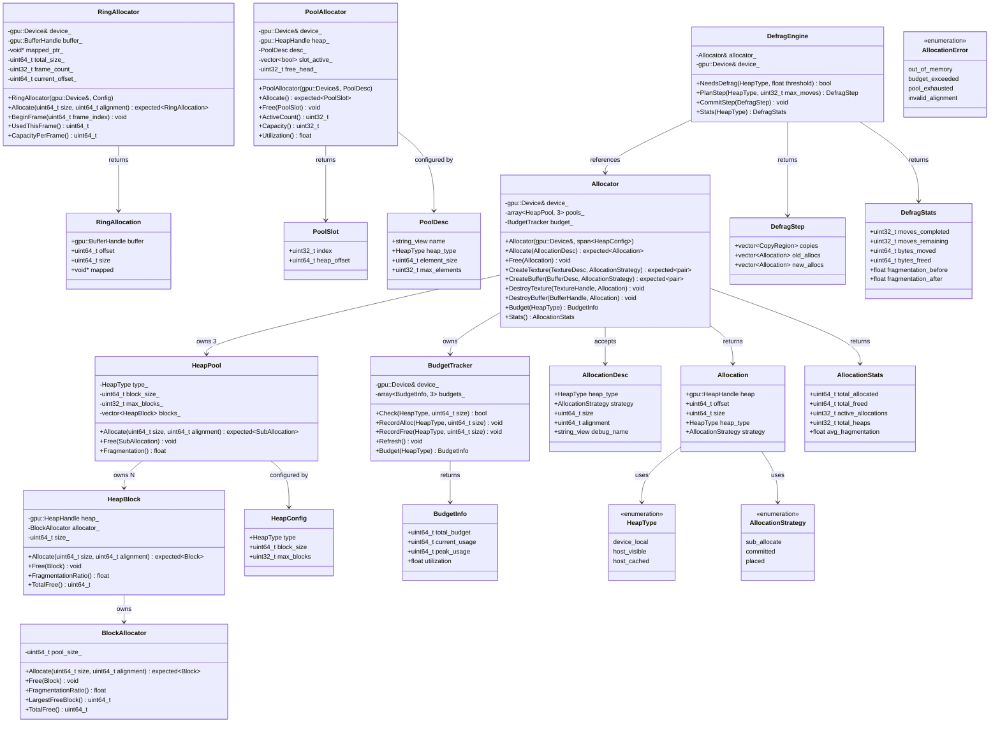

### Allocation Flow

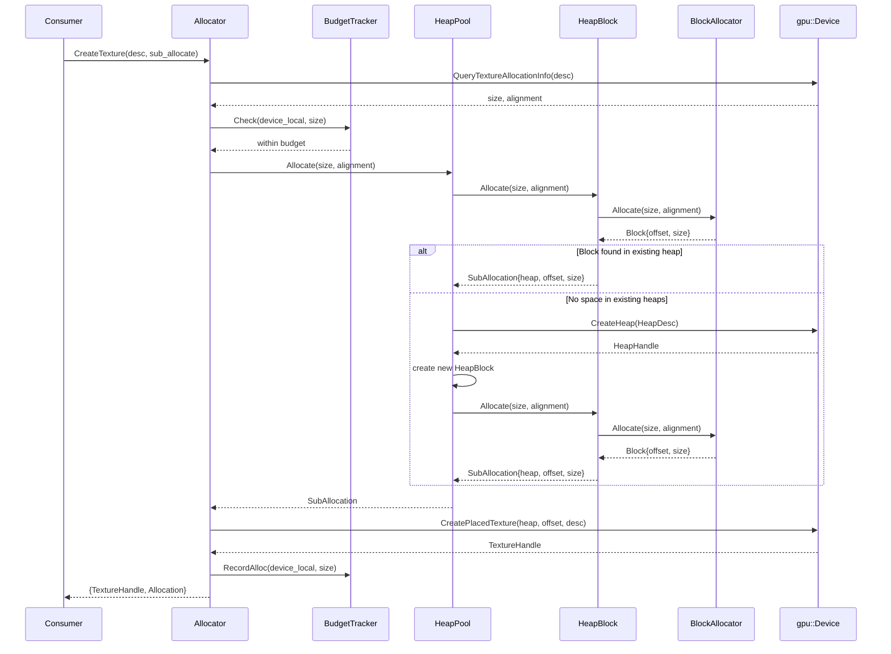

### Defragmentation Flow

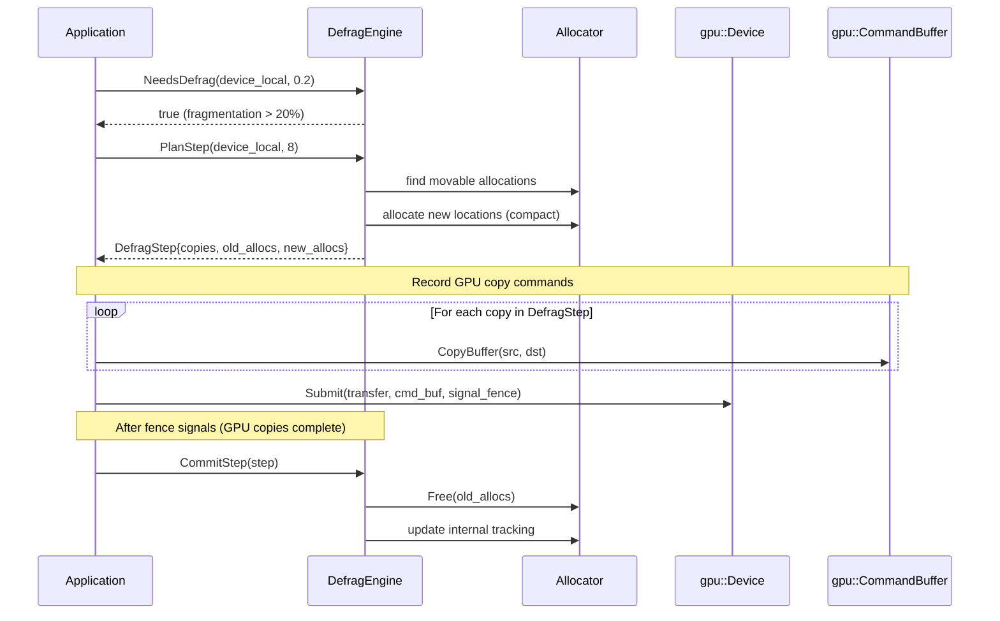

---

## 2. State Tracker

### Class Diagram

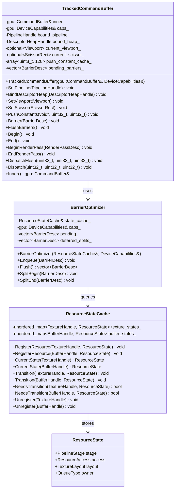

### Barrier Optimization Flow

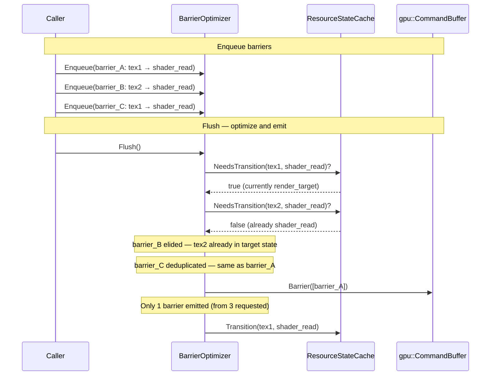

---

## 3. Work Graph Runtime

### Class Diagram

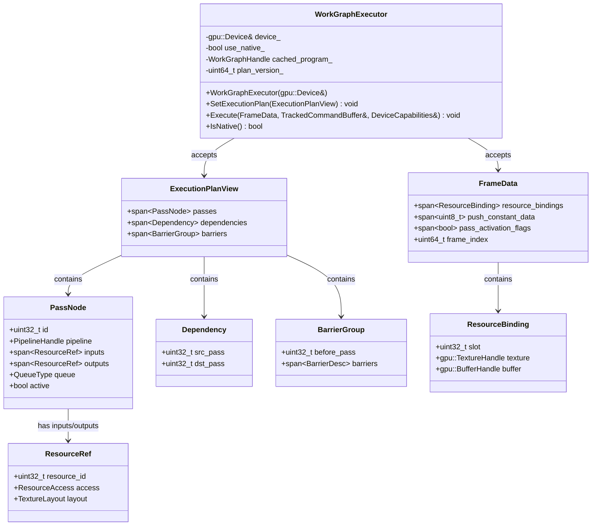

### Native Execution Flow

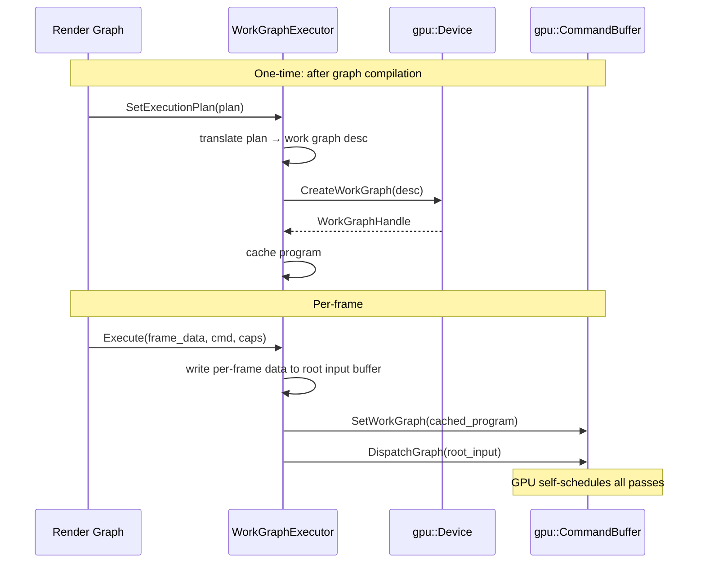

### Emulated Execution Flow

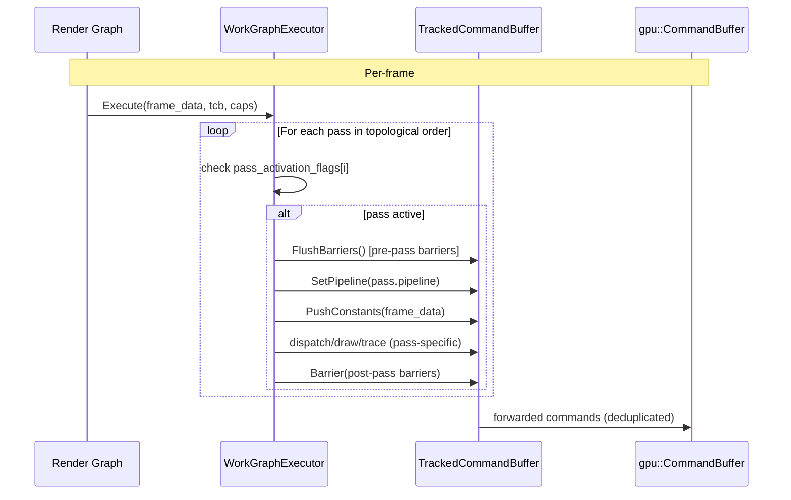

---

## 4. Feature Emulation (Compat)

### Class Diagram

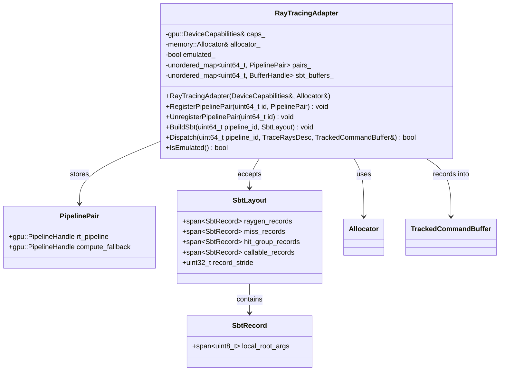

### RT Dispatch Flow

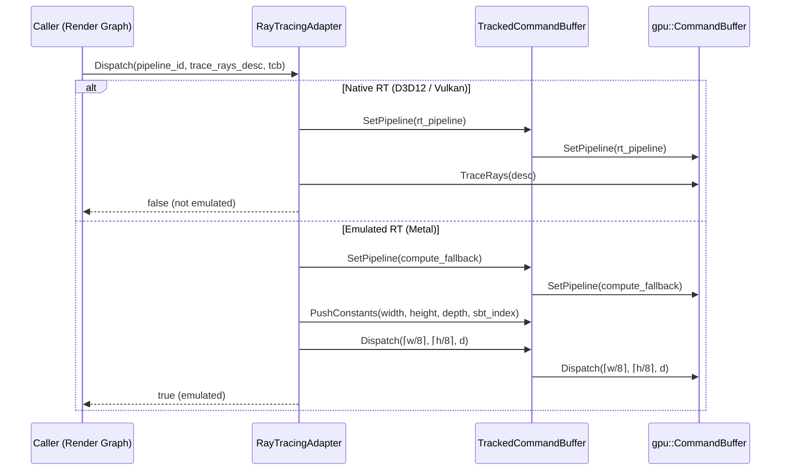

---

## 5. Module Dependencies

Complete dependency graph showing how the GPU runtime fits between the render graph and
GPU backend.

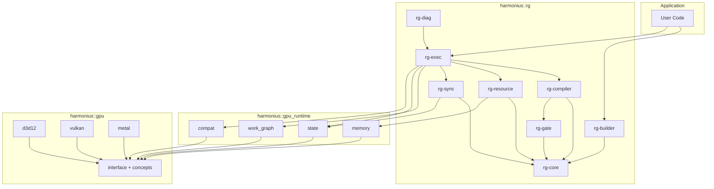
