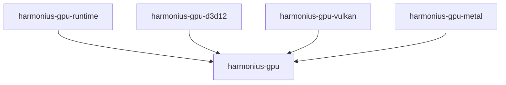
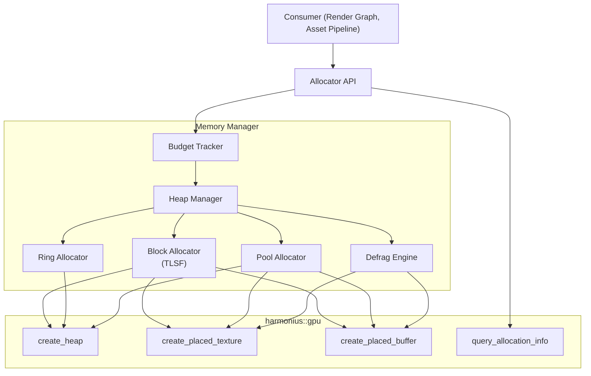
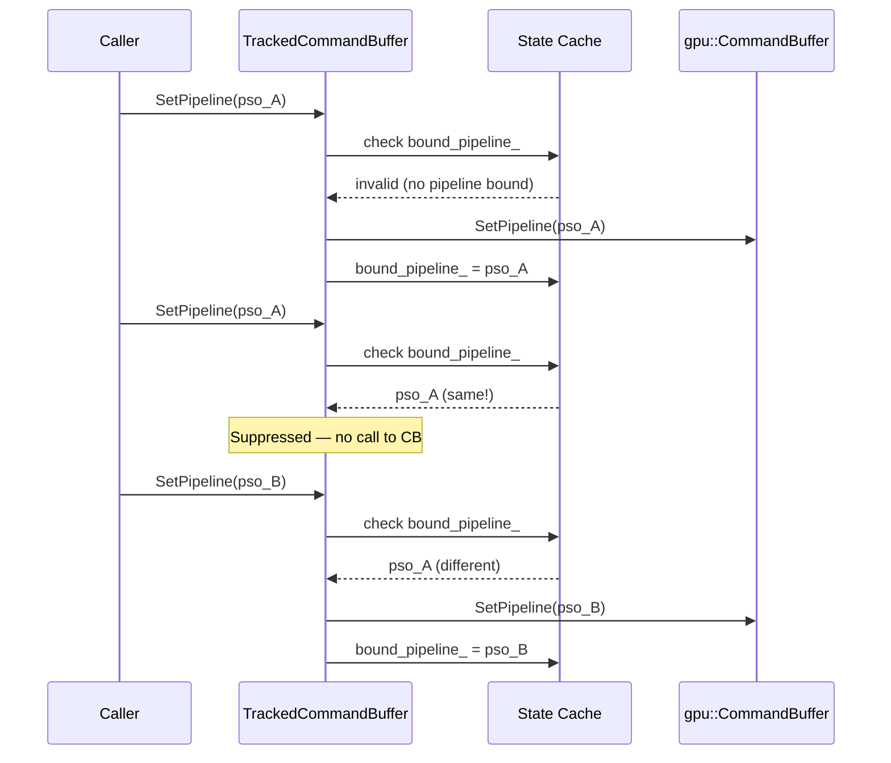
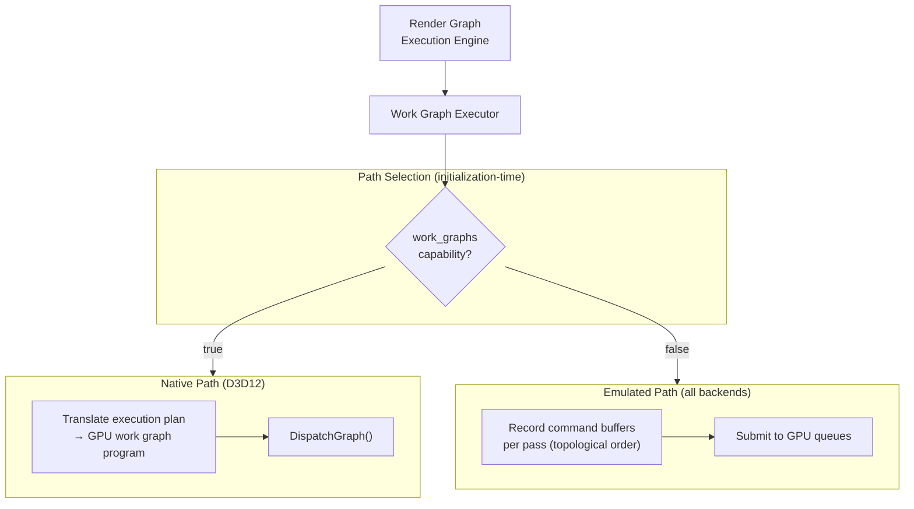
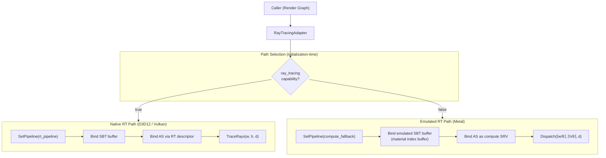
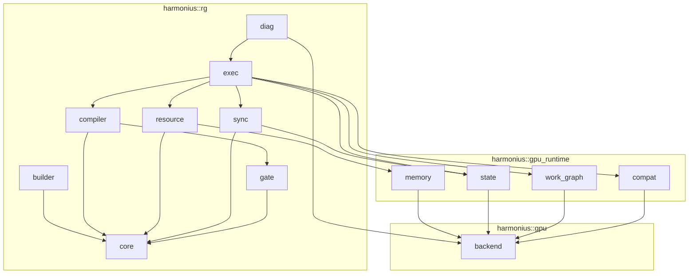

# GPU Runtime Module Design

Detailed module design for the Harmonius GPU runtime layer (`harmonius::gpu_runtime`). This
layer sits between the GPU backend interface (`harmonius::gpu`) and higher-level consumers
(render graph, asset pipeline), providing shared services for memory management, state
tracking, work graph execution, and feature emulation.

**Requirements:** [GR-1 through GR-4](../requirements/7-gpu-runtime/README.md)

---

## Contents

- [GPU Runtime Module Design](#gpu-runtime-module-design)
  - [Contents](#contents)
  - [Design Principles](#design-principles)
  - [Module Map](#module-map)
    - [Namespace Layout](#namespace-layout)
    - [Library Targets](#library-targets)
  - [1. Memory Manager — `harmonius::gpu_runtime::memory`](#1-memory-manager--harmoniusgpu_runtimememory)
    - [Architecture](#architecture)
    - [Heap Manager](#heap-manager)
    - [Block Allocator (TLSF)](#block-allocator-tlsf)
    - [Allocation API](#allocation-api)
    - [Ring Allocator](#ring-allocator)
    - [Pool Allocator](#pool-allocator)
    - [Defragmentation Engine](#defragmentation-engine)
    - [Budget Tracker](#budget-tracker)
  - [2. State Tracker — `harmonius::gpu_runtime::state`](#2-state-tracker--harmoniusgpu_runtimestate)
    - [Tracked Command Buffer](#tracked-command-buffer)
    - [Resource State Cache](#resource-state-cache)
    - [Barrier Optimizer](#barrier-optimizer)
  - [3. Work Graph Runtime — `harmonius::gpu_runtime::work_graph`](#3-work-graph-runtime--harmoniusgpu_runtimework_graph)
    - [Architecture](#architecture-1)
    - [Native Path](#native-path)
    - [Emulated Path](#emulated-path)
    - [Executor API](#executor-api)
    - [Synchronization in Emulated Path](#synchronization-in-emulated-path)
    - [Backing Memory](#backing-memory)
  - [4. Feature Emulation — `harmonius::gpu_runtime::compat`](#4-feature-emulation--harmoniusgpu_runtimecompat)
    - [Split Barrier Emulation](#split-barrier-emulation)
    - [Queue Ownership Elision](#queue-ownership-elision)
    - [Ray Tracing Pipeline Emulation](#ray-tracing-pipeline-emulation)
  - [Integration Points](#integration-points)
    - [Render Graph Integration](#render-graph-integration)
    - [GPU Backend API Usage](#gpu-backend-api-usage)

---

## Design Principles

| Principle                 | Rationale                                                                                      |
| ------------------------- | ---------------------------------------------------------------------------------------------- |
| Backend-agnostic          | All code is written against `harmonius::gpu` concepts — no `#ifdef BACKEND` in the runtime     |
| No third-party allocators | Memory management is first-party — VMA, D3D12MA, and similar libraries are not used            |
| Zero per-frame allocation | Hot-path operations use pre-allocated pools and ring buffers; no `malloc`/`new` per frame       |
| Transparent optimization  | Consumers see one API; native vs. emulated paths are selected at initialization                 |
| Static Dispatch           | The runtime is templated on the backend's concrete types via C++20 concepts — no vtables        |
| Strict downward deps      | Depends only on `harmonius::gpu` — no knowledge of render graph, asset pipeline, or application |

---

## Module Map

### Namespace Layout

| Namespace                             | Purpose                                                |
| ------------------------------------- | ------------------------------------------------------ |
| `harmonius::gpu_runtime`              | Root namespace — re-exports commonly used types         |
| `harmonius::gpu_runtime::memory`      | Memory allocation, sub-allocation, defrag, budgets      |
| `harmonius::gpu_runtime::state`       | State tracking, Barrier optimization, resource states   |
| `harmonius::gpu_runtime::work_graph`  | Work graph execution (native and emulated)              |
| `harmonius::gpu_runtime::compat`      | Feature emulation and cross-backend compatibility       |

### Library Targets



The GPU runtime compiles to a single static library target (`harmonius-gpu-runtime`) that
depends only on `harmonius-gpu` (the abstract interface). It does not link against any
backend-specific library. The render graph and other consumers link against
`harmonius-gpu-runtime` instead of `harmonius-gpu` directly.

```cmake
# src/gpu_runtime/CMakeLists.txt (sketch)
add_library(harmonius-gpu-runtime STATIC)
target_sources(harmonius-gpu-runtime
    PUBLIC FILE_SET CXX_MODULES FILES
        harmonius.gpu_runtime.cppm
        harmonius.gpu_runtime.memory.cppm
        harmonius.gpu_runtime.state.cppm
        harmonius.gpu_runtime.work_graph.cppm
        harmonius.gpu_runtime.compat.cppm)
target_link_libraries(harmonius-gpu-runtime PUBLIC harmonius-gpu)
```

---

## 1. Memory Manager — `harmonius::gpu_runtime::memory`

**Responsibility:** Manages all GPU memory allocation, sub-allocation, defragmentation, and
budget tracking. Replaces VMA and D3D12MA as the sole memory management layer.

**Requirements covered:** GR-1.1–GR-1.11.

### Architecture



The memory manager wraps `harmonius::gpu::GpuDevice` methods for heap and resource creation.
It adds sub-allocation, tracking, and defragmentation on top of the thin backend operations.

### Heap Manager

Manages a set of GPU heaps, grouped by heap type. New heaps are created on demand when
existing heaps cannot satisfy an allocation. Each heap is a fixed-size block of GPU memory
created via `gpu::Device::CreateHeap()`.

```cpp
namespace harmonius::gpu_runtime::memory {

enum class HeapType : uint8_t {
  kDeviceLocal,  // GPU-only memory (render targets, textures, buffers)
  kHostVisible,  // CPU-writable, GPU-readable (staging, upload)
  kHostCached,   // CPU-cached readback memory
};

struct HeapConfig {
  HeapType type;
  uint64_t block_size;  // size of each heap block (e.g., 64 MiB or 256 MiB)
  uint32_t max_blocks;  // maximum number of blocks per heap type
};

}  // namespace harmonius::gpu_runtime::memory
```

**Heap sizing strategy:**

| Heap Type      | Default Block Size | Rationale                                               |
| -------------- | ------------------ | ------------------------------------------------------- |
| `kDeviceLocal` | 256 MiB            | Large blocks reduce heap count; most resources are here  |
| `kHostVisible` | 64 MiB             | Staging buffers are transient; smaller blocks suffice    |
| `kHostCached`  | 16 MiB             | Readback is infrequent; small blocks minimize waste      |

### Block Allocator (TLSF)

The memory manager uses a **Two-Level Segregated Fit (TLSF)** algorithm for sub-allocation
within heaps. TLSF provides:

- O(1) allocation and deallocation (constant-time, no search)
- Bounded fragmentation (worst case ~3.5% internal fragmentation)
- No per-allocation heap overhead beyond a small header

```cpp
namespace harmonius::gpu_runtime::memory {

class BlockAllocator {
 public:
  explicit BlockAllocator(uint64_t pool_size);

  struct Block {
    uint64_t offset;
    uint64_t size;
  };

  // O(1) allocation — returns offset within the pool
  [[nodiscard]] std::expected<Block, AllocationError> Allocate(uint64_t size, uint64_t alignment);

  // O(1) deallocation
  void Free(Block block);

  // Fragmentation metrics
  [[nodiscard]] float FragmentationRatio() const;
  [[nodiscard]] uint64_t LargestFreeBlock() const;
  [[nodiscard]] uint64_t TotalFree() const;

 private:
  // TLSF internal state: first-level and second-level bitmaps,
  // free lists indexed by size class
};

}  // namespace harmonius::gpu_runtime::memory
```

**Why TLSF over other algorithms:**

| Algorithm     | Alloc Time | Dealloc Time | Fragmentation | Why Not                                    |
| ------------- | ---------- | ------------ | ------------- | ------------------------------------------ |
| First-fit     | O(n)       | O(1)         | High          | Linear search is too slow for hot paths    |
| Best-fit      | O(n)       | O(1)         | Low           | Linear search is too slow for hot paths    |
| Buddy         | O(log n)   | O(log n)     | ~50% internal | High internal Fragmentation wastes memory  |
| **TLSF**      | **O(1)**   | **O(1)**     | **~3.5%**     | **Best balance of speed and Fragmentation** |

### Allocation API

```cpp
namespace harmonius::gpu_runtime::memory {

enum class AllocationStrategy : uint8_t {
  kSubAllocate,  // Default: sub-allocate from a shared heap
  kCommitted,    // Dedicated heap for this resource
  kPlaced,       // Caller-managed placement at specific heap offset
};

struct AllocationDesc {
  HeapType heap_type = HeapType::kDeviceLocal;
  AllocationStrategy strategy = AllocationStrategy::kSubAllocate;
  uint64_t size = 0;
  uint64_t alignment = 0;  // 0 = auto (queried from backend)
  std::string_view debug_name = {};
};

struct Allocation {
  gpu::HeapHandle heap;
  uint64_t offset;
  uint64_t size;
  HeapType heap_type;
  AllocationStrategy strategy;
};

enum class AllocationError : uint8_t {
  kOutOfMemory,       // no free block large enough
  kBudgetExceeded,    // allocation would exceed memory budget
  kPoolExhausted,     // named pool is at capacity
  kInvalidAlignment,  // alignment is not a power of two
};

class Allocator {
 public:
  explicit Allocator(gpu::Device& device, std::span<const HeapConfig> configs);
  ~Allocator();

  // --- Core allocation ---

  [[nodiscard]]
  std::expected<Allocation, AllocationError> Allocate(const AllocationDesc& desc);

  void Free(const Allocation& alloc);

  // --- Texture/buffer creation with integrated allocation ---

  [[nodiscard]]
  std::expected<std::pair<gpu::TextureHandle, Allocation>, AllocationError> CreateTexture(
      const gpu::TextureDesc& desc, AllocationStrategy strategy = AllocationStrategy::kSubAllocate);

  [[nodiscard]]
  std::expected<std::pair<gpu::BufferHandle, Allocation>, AllocationError> CreateBuffer(
      const gpu::BufferDesc& desc, AllocationStrategy strategy = AllocationStrategy::kSubAllocate);

  void DestroyTexture(gpu::TextureHandle handle, const Allocation& alloc);
  void DestroyBuffer(gpu::BufferHandle handle, const Allocation& alloc);

  // --- Queries ---

  [[nodiscard]] BudgetInfo Budget(HeapType type) const;
  [[nodiscard]] AllocationStats Stats() const;

 private:
  gpu::Device& device_;
  std::array<HeapPool, 3> pools_;  // one per HeapType
  BudgetTracker budget_;
};

}  // namespace harmonius::gpu_runtime::memory
```

### Ring Allocator

Per-frame staging and constant buffer allocation using a circular buffer. The ring is
partitioned into N slots (one per frame in flight), and each slot is recycled after its
frame's GPU work completes.

```cpp
namespace harmonius::gpu_runtime::memory {

class RingAllocator {
 public:
  struct Config {
    uint64_t total_size;   // total ring buffer Size (e.g., 32 MiB)
    uint32_t frame_count;  // number of frames in flight (typically 3)
  };

  explicit RingAllocator(gpu::Device& device, const Config& config);

  struct RingAllocation {
    gpu::BufferHandle buffer;  // the ring buffer handle
    uint64_t offset;           // offset within the ring buffer
    uint64_t size;
    void* mapped;  // persistently mapped CPU pointer
  };

  // Lock-free allocation from the current frame's slot
  [[nodiscard]]
  std::expected<RingAllocation, AllocationError> Allocate(uint64_t size, uint64_t alignment = 256);

  // Called at frame start — recycles the slot from frame N-frame_count
  void BeginFrame(uint64_t frame_index);

  // Metrics
  [[nodiscard]] uint64_t UsedThisFrame() const;
  [[nodiscard]] uint64_t CapacityPerFrame() const;
};

}  // namespace harmonius::gpu_runtime::memory
```

### Pool Allocator

Fixed-capacity typed pools for streaming resources (tiles, voxels, chunks).

```cpp
namespace harmonius::gpu_runtime::memory {

struct PoolDesc {
  std::string_view name;
  HeapType heap_type;
  uint64_t element_size;
  uint32_t max_elements;
};

class PoolAllocator {
 public:
  explicit PoolAllocator(gpu::Device& device, const PoolDesc& desc);

  struct PoolSlot {
    uint32_t index;        // slot index within the pool
    uint64_t heap_offset;  // offset within the pool's heap
  };

  [[nodiscard]]
  std::expected<PoolSlot, AllocationError> Allocate();

  void Free(PoolSlot slot);

  [[nodiscard]] uint32_t ActiveCount() const;
  [[nodiscard]] uint32_t Capacity() const;
  [[nodiscard]] float Utilization() const;
};

}  // namespace harmonius::gpu_runtime::memory
```

### Defragmentation Engine

Incremental defragmentation that relocates resources to compact heaps.

```cpp
namespace harmonius::gpu_runtime::memory {

struct DefragStats {
  uint32_t moves_completed;
  uint32_t moves_remaining;
  uint64_t bytes_moved;
  uint64_t bytes_freed;
  float fragmentation_before;
  float fragmentation_after;
};

class DefragEngine {
 public:
  explicit DefragEngine(Allocator& allocator, gpu::Device& device);

  // Compute a defragmentation plan (which allocations to move)
  [[nodiscard]] bool NeedsDefrag(HeapType type, float threshold = 0.2f) const;

  // Execute one incremental step (bounded number of moves)
  // Returns GPU copy commands to be recorded into a transfer command buffer
  struct DefragStep {
    std::vector<gpu::CopyRegion> copies;  // GPU-side copies to execute
    std::vector<Allocation> old_allocs;   // allocations being moved
    std::vector<Allocation> new_allocs;   // new locations after move
  };

  [[nodiscard]] DefragStep PlanStep(HeapType type, uint32_t max_moves = 8);

  // Finalize after GPU copies complete (update internal tracking)
  void CommitStep(const DefragStep& step);

  [[nodiscard]] DefragStats Stats(HeapType type) const;
};

}  // namespace harmonius::gpu_runtime::memory
```

### Budget Tracker

```cpp
namespace harmonius::gpu_runtime::memory {

struct BudgetInfo {
  uint64_t total_budget;   // total available memory for this heap type
  uint64_t current_usage;  // currently allocated bytes
  uint64_t peak_usage;     // high-water mark since last reset
  float utilization;       // current_usage / total_budget
};

struct AllocationStats {
  uint64_t total_allocated;
  uint64_t total_freed;
  uint32_t active_allocations;
  uint32_t total_heaps;
  float avg_fragmentation;
};

}  // namespace harmonius::gpu_runtime::memory
```

---

## 2. State Tracker — `harmonius::gpu_runtime::state`

**Responsibility:** Tracks GPU pipeline and resource state per command buffer to eliminate
redundant API calls. Provides barrier optimization (batching, deduplication, elision).

**Requirements covered:** GR-2.1–GR-2.7, GR-4.2–GR-4.5.

### Tracked Command Buffer

Wraps a `gpu::CommandBuffer` and filters redundant state changes.

```cpp
namespace harmonius::gpu_runtime::state {

class TrackedCommandBuffer {
 public:
  explicit TrackedCommandBuffer(gpu::CommandBuffer& inner, const gpu::DeviceCapabilities& caps);

  // --- State-tracked methods (filter redundant calls) ---

  void SetPipeline(gpu::PipelineHandle handle);
  void BindDescriptorHeap(gpu::DescriptorHeapHandle handle);
  void SetViewport(const gpu::Viewport& vp);
  void SetScissor(const gpu::ScissorRect& rect);
  void PushConstants(const void* data, uint32_t size, uint32_t offset = 0);

  // --- Barrier optimization ---

  // Queue a barrier; will be batched and emitted on flush
  void Barrier(const gpu::BarrierDesc& desc);

  // Emit all queued barriers as a single batched call
  void FlushBarriers();

  // --- Pass-through methods (not state-tracked) ---

  void Begin();
  void End();
  void BeginRenderPass(const gpu::RenderPassDesc& desc);
  void EndRenderPass();
  void DispatchMesh(uint32_t x, uint32_t y, uint32_t z);
  void Dispatch(uint32_t x, uint32_t y, uint32_t z);
  void DispatchIndirect(gpu::BufferHandle args, uint64_t offset);
  void TraceRays(const gpu::TraceRaysDesc& desc);
  void BuildAccelerationStructure(const gpu::AccelerationStructureBuildDesc& desc);
  void CopyBuffer(const gpu::BufferCopyDesc& desc);
  void CopyBufferToTexture(const gpu::BufferTextureCopyDesc& desc);
  void CopyTextureToBuffer(const gpu::BufferTextureCopyDesc& desc);
  void CopyTexture(const gpu::TextureCopyDesc& desc);
  void BeginDebugLabel(std::string_view name, std::span<const float, 4> color);
  void EndDebugLabel();

  // Access the underlying command buffer
  [[nodiscard]] gpu::CommandBuffer& Inner();

 private:
  gpu::CommandBuffer& inner_;
  const gpu::DeviceCapabilities& caps_;

  // Cached state for redundancy elimination
  gpu::PipelineHandle bound_pipeline_ = gpu::PipelineHandle::kInvalid;
  gpu::DescriptorHeapHandle bound_heap_ = gpu::DescriptorHeapHandle::kInvalid;
  std::optional<gpu::Viewport> current_viewport_;
  std::optional<gpu::ScissorRect> current_scissor_;
  std::array<uint8_t, 128> push_constant_cache_ = {};
  uint32_t push_constant_size_ = 0;

  // Barrier batch buffer
  std::vector<gpu::BarrierDesc> pending_barriers_;
};

}  // namespace harmonius::gpu_runtime::state
```

**State-tracking flow:**



### Resource State Cache

Tracks the current layout/access state of every resource for barrier optimization.

```cpp
namespace harmonius::gpu_runtime::state {

struct ResourceState {
  gpu::PipelineStage stage = gpu::PipelineStage::kNone;
  gpu::ResourceAccess access = gpu::ResourceAccess::kNone;
  gpu::TextureLayout layout = gpu::TextureLayout::kUndefined;
  gpu::QueueType owner = gpu::QueueType::kGraphics;
};

class ResourceStateCache {
 public:
  // Set initial state for a resource (called at creation)
  void RegisterResource(gpu::TextureHandle handle, ResourceState initial);
  void RegisterResource(gpu::BufferHandle handle, ResourceState initial);

  // Query current state
  [[nodiscard]] ResourceState CurrentState(gpu::TextureHandle handle) const;
  [[nodiscard]] ResourceState CurrentState(gpu::BufferHandle handle) const;

  // Update state after a barrier
  void Transition(gpu::TextureHandle handle, ResourceState new_state);
  void Transition(gpu::BufferHandle handle, ResourceState new_state);

  // Check if a barrier is needed
  [[nodiscard]] bool NeedsTransition(gpu::TextureHandle handle, ResourceState target) const;
  [[nodiscard]] bool NeedsTransition(gpu::BufferHandle handle, ResourceState target) const;

  // Remove tracking (called at destruction)
  void Unregister(gpu::TextureHandle handle);
  void Unregister(gpu::BufferHandle handle);
};

}  // namespace harmonius::gpu_runtime::state
```

### Barrier Optimizer

Batches, merges, and deduplicates barriers before emitting to the backend.

```cpp
namespace harmonius::gpu_runtime::state {

class BarrierOptimizer {
 public:
  explicit BarrierOptimizer(ResourceStateCache& state_cache, const gpu::DeviceCapabilities& caps);

  // Queue a barrier request
  void Enqueue(const gpu::BarrierDesc& desc);

  // Process queued barriers: deduplicate, merge, elide, and emit
  // Returns the optimized barrier list ready for gpu::CommandBuffer::Barrier()
  [[nodiscard]] std::vector<gpu::BarrierDesc> Flush();

  // Split barrier support (GR-4.2)
  void SplitBegin(const gpu::BarrierDesc& desc);
  void SplitEnd(const gpu::BarrierDesc& desc);

 private:
  ResourceStateCache& state_cache_;
  const gpu::DeviceCapabilities& caps_;
  std::vector<gpu::BarrierDesc> pending_;
  std::vector<gpu::BarrierDesc> deferred_splits_;
};

}  // namespace harmonius::gpu_runtime::state
```

---

## 3. Work Graph Runtime — `harmonius::gpu_runtime::work_graph`

**Responsibility:** Transparently executes render graph passes using native GPU work graphs
when available, with CPU-side emulation as the fallback.

**Requirements covered:** GR-3.1–GR-3.7.

### Architecture



The path selection is made once at initialization based on `DeviceCapabilities::work_graphs`.
Since the GPU backend is selected at compile time, the unused path is eliminated by the
compiler on backends that never support work graphs (Vulkan, Metal).

### Native Path

On D3D12 when `work_graphs` is true, the executor translates the render graph's execution
plan into a GPU work graph program:

1. **Translation:** Each pass in the execution plan becomes a work graph node. Inter-pass
   resource dependencies become work graph edges. The barrier schedule from the execution
   plan is embedded in the work graph node entry/exit barriers.
2. **Program creation:** The translated work graph is compiled into a
   `gpu::WorkGraphHandle` via `gpu::Device::CreateWorkGraph()`. The program is cached
   and reused across frames until the execution plan changes.
3. **Per-frame dispatch:** Each frame, the executor writes per-frame data (resource bindings,
   constants, activation flags) into the root input record buffer, then dispatches the work
   graph via `gpu::CommandBuffer::DispatchGraph()`.
4. **GPU self-scheduling:** The GPU hardware schedules node execution, handling producer-
   consumer synchronization internally without CPU involvement.

```cpp
namespace harmonius::gpu_runtime::work_graph {

struct ExecutionPlanView {
  // Opaque view into the render graph's compiled execution plan.
  // The work graph runtime reads pass order, dependencies, barriers,
  // and resource bindings without depending on render graph types.
  std::span<const PassNode> passes;
  std::span<const Dependency> dependencies;
  std::span<const BarrierGroup> barriers;
};

struct PassNode {
  uint32_t id;
  gpu::PipelineHandle pipeline;
  std::span<const ResourceRef> inputs;
  std::span<const ResourceRef> outputs;
  gpu::QueueType queue;
  bool active;
};

struct Dependency {
  uint32_t src_pass;
  uint32_t dst_pass;
};

}  // namespace harmonius::gpu_runtime::work_graph
```

### Emulated Path

On all backends when `work_graphs` is false (and always on Vulkan/Metal), the executor
performs traditional CPU-side scheduling:

1. **Iterate passes** in topological order from the execution plan.
2. **Acquire command buffers** from the per-queue command pool.
3. **Emit pre-barriers** via the tracked command buffer.
4. **Record pass commands** by invoking the pass's execute callback.
5. **Emit post-barriers** via the tracked command buffer.
6. **Submit** command buffers to GPU queues in topological order with timeline fence
   coordination.

This is functionally identical to the current execution engine design described in
[render-graph-design.md](render-graph-design.md). The emulated path is the default and
always-available code path.

### Executor API

```cpp
namespace harmonius::gpu_runtime::work_graph {

class WorkGraphExecutor {
 public:
  explicit WorkGraphExecutor(gpu::Device& device);

  // Called once after graph compilation (or when execution plan changes)
  void SetExecutionPlan(const ExecutionPlanView& plan);

  // Called each frame with per-frame bindings
  struct FrameData {
    std::span<const ResourceBinding> resource_bindings;
    std::span<const uint8_t> push_constant_data;
    std::span<const bool> pass_activation_flags;
    uint64_t frame_index;
  };

  // Execute the current plan with the given frame data
  void Execute(const FrameData& data, state::TrackedCommandBuffer& cmd, const gpu::DeviceCapabilities& caps);

  // Query whether native path is active
  [[nodiscard]] bool IsNative() const;

 private:
  gpu::Device& device_;
  bool use_native_;
  gpu::WorkGraphHandle cached_program_ = gpu::WorkGraphHandle::kInvalid;
  uint64_t plan_version_ = 0;
};

}  // namespace harmonius::gpu_runtime::work_graph
```

### Synchronization in Emulated Path

The emulated path must replicate the synchronization guarantees that native GPU work graphs
provide implicitly. The executor derives synchronization points from the execution plan's
dependency edges:

| Dependency Type  | Native Work Graph                 | Emulated Path                                          |
| ---------------- | --------------------------------- | ------------------------------------------------------ |
| Same-queue       | Implicit node ordering            | Pipeline Barrier between Passes                        |
| Cross-queue      | Implicit via work graph scheduler | Timeline fence Signal (producer) + Wait (consumer)     |
| Read-after-write | Implicit memory visibility        | Barrier with appropriate stage and access flags        |
| Write-after-read | Implicit via node dependencies    | Execution Barrier with drain before subsequent write   |

The barrier optimizer (GR-2) processes all barriers emitted by the emulated path, so batching,
deduplication, and split barrier emulation apply automatically.

**Requirements covered:** GR-3.8.

### Backing Memory

Native GPU work graph programs require backing memory for node records and scheduler metadata.
The work graph executor queries memory requirements from the backend after program creation and
allocates backing memory through `gpu_runtime::memory::Allocator`:

```cpp
// After creating a native work graph program
auto mem_req = device_.QueryWorkGraphMemoryRequirements(cached_program_);
backing_alloc_ = allocator_.Allocate({.heap_type = memory::HeapType::kDeviceLocal,
                                      .strategy = memory::AllocationStrategy::kSubAllocate,
                                      .size = mem_req.size,
                                      .alignment = mem_req.alignment,
                                      .debug_name = "work_graph_backing"});
```

Backing memory is reused across frames. It is reallocated only when:

1. The execution plan changes (new program compiled via `SetExecutionPlan()`)
2. The new program's memory requirements exceed the current allocation

The backing memory handle and offset are passed to the backend via `DispatchGraphDesc`:

```cpp
void WorkGraphExecutor::Execute(const FrameData& data, state::TrackedCommandBuffer& cmd,
                                const gpu::DeviceCapabilities& caps) {
  if (use_native_) {
    gpu::DispatchGraphDesc desc{
        .backing_memory = backing_alloc_.value().heap,
        .backing_memory_offset = backing_alloc_.value().offset,
        .backing_memory_size = backing_alloc_.value().size,
        // ... per-frame input data ...
    };
    cmd.Inner().DispatchGraph(desc);
  } else {
    ExecuteEmulated(data, cmd);
  }
}
```

**Requirements covered:** GR-3.9.

---

## 4. Feature Emulation — `harmonius::gpu_runtime::compat`

**Responsibility:** Provides cross-backend feature compatibility built on top of the GPU
backend interface. Includes barrier optimization, split barrier emulation, queue ownership
elision, and ray tracing pipeline emulation.

**Requirements covered:** GR-4.1–GR-4.9.

### Split Barrier Emulation

When `DeviceCapabilities::split_barriers` is false, the barrier optimizer converts split
barrier pairs into immediate barriers:

| Operation       | Native (D3D12/Vulkan)                    | Emulated (Metal)                             |
| --------------- | ---------------------------------------- | -------------------------------------------- |
| `SplitBegin()` | Emit `Barrier(sync_after = SPLIT)`       | Store Barrier in deferred list (no GPU call)  |
| `SplitEnd()`   | Emit `Barrier(sync_before = SPLIT)`      | Emit immediate Barrier with combined stages   |

### Queue Ownership Elision

When the backend reports unified memory architecture (detected via
`DeviceCapabilities::shared_memory_bytes > 0` and no dedicated device-local memory), the
barrier optimizer elides queue ownership transfer barriers:

```cpp
// In BarrierOptimizer::Flush()
if (caps_.IsUnifiedMemory()) {
  // Remove queue ownership fields — not needed on unified memory
  for (auto& b : pending_) {
    b.src_queue = gpu::QueueType::kGraphics;
    b.dst_queue = gpu::QueueType::kGraphics;
  }
}
```

### Ray Tracing Pipeline Emulation

D3D12 and Vulkan provide dedicated ray tracing pipeline stages (ray generation, closest hit,
any hit, miss) dispatched via `TraceRays()`. Metal has no dedicated RT pipeline — ray tracing
is implemented through inline ray queries (`intersector<>`) in compute shaders. The compat
layer bridges this gap so higher-level systems can express RT passes uniformly.

**Requirements covered:** GR-4.6–GR-4.9.

#### Architecture



The path selection is made once at initialization based on
`DeviceCapabilities::ray_tracing`. Since the GPU backend is selected at compile time,
the unused path is eliminated by the compiler.

#### RayTracingAdapter

Manages pipeline pair registration and dispatch translation.

```cpp
namespace harmonius::gpu_runtime::compat {

struct PipelinePair {
  gpu::PipelineHandle rt_pipeline;       // native RT pipeline (invalid on Metal)
  gpu::PipelineHandle compute_fallback;  // compute pipeline with inline ray queries
};

class RayTracingAdapter {
 public:
  explicit RayTracingAdapter(const gpu::DeviceCapabilities& caps, memory::Allocator& allocator);

  // --- Pipeline pair registration (GR-4.8) ---

  void RegisterPipelinePair(uint64_t id, const PipelinePair& pair);
  void UnregisterPipelinePair(uint64_t id);

  // --- SBT management (GR-4.7) ---

  void BuildSbt(uint64_t pipeline_id, const SbtLayout& layout);

  // --- Dispatch (GR-4.6) ---

  // Dispatches trace_rays natively or translates to compute dispatch.
  // Returns true if the call was emulated.
  bool Dispatch(uint64_t pipeline_id, const gpu::TraceRaysDesc& desc, state::TrackedCommandBuffer& cmd);

  // --- Queries ---

  [[nodiscard]] bool IsEmulated() const;

 private:
  const gpu::DeviceCapabilities& caps_;
  memory::Allocator& allocator_;
  bool emulated_;
  std::unordered_map<uint64_t, PipelinePair> pairs_;
  std::unordered_map<uint64_t, gpu::BufferHandle> sbt_buffers_;
};

}  // namespace harmonius::gpu_runtime::compat
```

#### SBT Layout and Emulation

The SBT is a D3D12/Vulkan concept that maps geometry intersections to shader invocations and
per-record root arguments. On Metal, there is no SBT — the equivalent data must be packed
into a regular GPU buffer indexed by instance and geometry ID.

```cpp
namespace harmonius::gpu_runtime::compat {

struct SbtRecord {
  std::span<const uint8_t> local_root_args;  // per-record root arguments
};

struct SbtLayout {
  std::span<const SbtRecord> raygen_records;
  std::span<const SbtRecord> miss_records;
  std::span<const SbtRecord> hit_group_records;
  std::span<const SbtRecord> callable_records;
  uint32_t record_stride;  // stride between records
};

}  // namespace harmonius::gpu_runtime::compat
```

**SBT translation strategy:**

| SBT Component | Native (D3D12/Vulkan)                   | Emulated (Metal)                                       |
| ------------- | --------------------------------------- | ------------------------------------------------------ |
| Raygen record | SBT region at `raygen_offset`           | Push constants (Dispatch parameters)                   |
| Miss records  | SBT region at `miss_offset` + stride    | Buffer region indexed by miss shader index             |
| Hit groups    | SBT region at `hit_offset` + stride     | Buffer region indexed by `instanceID * geomCount + geomIdx` |
| Callable      | SBT region at `callable_offset` + stride | Buffer region indexed by callable index                |

On the native path, `BuildSbt()` creates a standard SBT buffer with shader identifiers and
per-record data laid out per the D3D12/Vulkan SBT alignment rules. On the emulated path,
`BuildSbt()` packs the per-record root arguments into a flat buffer without shader
identifiers (the compute fallback shader handles material dispatch via branching or indirect
function calls).

#### Dispatch Translation

When `IsEmulated()` is true, `RayTracingAdapter::Dispatch()` performs the following
translation:

```cpp
bool RayTracingAdapter::Dispatch(uint64_t pipeline_id, const gpu::TraceRaysDesc& desc,
                                 state::TrackedCommandBuffer& cmd) {
  auto it = pairs_.Find(pipeline_id);
  if (!emulated_) {
    // Native path: forward directly
    cmd.SetPipeline(it->second.rt_pipeline);
    cmd.Inner().TraceRays(desc);
    return false;
  }

  // Emulated path: translate to compute dispatch
  cmd.SetPipeline(it->second.compute_fallback);

  // Bind emulated SBT buffer as bindless SRV
  // Bind acceleration structure as compute SRV (GR-4.9)

  // Push trace_rays parameters as push constants
  struct RtPushConstants {
    uint32_t width;
    uint32_t height;
    uint32_t depth;
    uint32_t sbt_buffer_index;  // bindless index of emulated SBT
  };
  RtPushConstants pc{desc.width,
                     desc.height,
                     desc.depth,
                     /* bindless index */};
  cmd.PushConstants(&pc, sizeof(pc));

  // Dispatch with 8x8 thread groups
  constexpr uint32_t tile = 8;
  cmd.Dispatch((desc.width + tile - 1) / tile, (desc.height + tile - 1) / tile, desc.depth);
  return true;
}
```

#### Capability Matrix

| Feature                  | D3D12           | Vulkan          | Metal                     |
| ------------------------ | --------------- | --------------- | ------------------------- |
| `ray_tracing`            | DXR 1.2         | KHR extensions  | `false` — no RT pipeline  |
| `ray_tracing_inline`     | SM 6.5 RayQuery | KHR ray query   | Apple7+ `intersector<>`   |
| Dedicated RT pipeline    | Yes             | Yes             | No — Compute only         |
| SBT                      | Native          | Native          | Emulated via flat Buffer  |
| `TraceRays()`           | `DispatchRays`  | `vkCmdTraceRaysKHR` | → `Dispatch()`       |
| `TraceRaysIndirect()`  | `ExecuteIndirect` | `vkCmdTraceRaysIndirect2KHR` | → `DispatchIndirect()` |
| AS binding for inline    | SRV             | Descriptor      | Argument Buffer           |

**Shader pipeline interaction:** The GPU runtime does not compile or translate shaders. The
shader pipeline module is responsible for producing both variants of each RT effect:

1. **Native variant:** Raygen + miss + closest-hit + any-hit shaders → RT pipeline
2. **Compute variant:** Single compute shader with inline ray queries → compute pipeline

Both pipeline handles are registered with `RayTracingAdapter::RegisterPipelinePair()`.
The GPU runtime selects the appropriate handle at dispatch time based on device capabilities.

---

## Integration Points

### Render Graph Integration

The render graph modules change their dependencies from `harmonius::gpu` to
`harmonius::gpu_runtime`:

| Render Graph Module | Before (direct GPU)                     | After (via GPU Runtime)                          |
| ------------------- | --------------------------------------- | ------------------------------------------------ |
| `rg::resource`      | `gpu::Device::CreateTexture/Buffer`    | `gpu_runtime::memory::Allocator::CreateTexture` |
| `rg::sync`          | `gpu::CommandBuffer::Barrier`           | `gpu_runtime::state::BarrierOptimizer`           |
| `rg::exec`          | `gpu::CommandBuffer::*` (all methods)   | `gpu_runtime::state::TrackedCommandBuffer`       |
| `rg::exec`          | CPU-side pass scheduling                | `gpu_runtime::work_graph::WorkGraphExecutor`     |
| `rg::exec`          | `gpu::CommandBuffer::TraceRays`        | `gpu_runtime::compat::RayTracingAdapter`         |
| `rg::diag`          | `gpu::Device::CreateQueryPool`        | Unchanged (diagnostics access GPU directly)      |



### GPU Backend API Usage

The GPU runtime is the primary consumer of `harmonius::gpu` device and command buffer APIs.
The following table maps GPU runtime operations to backend API calls:

| GPU Runtime Operation                     | Backend API Calls                                           |
| ----------------------------------------- | ----------------------------------------------------------- |
| `Allocator::CreateTexture` (sub-alloc)   | `QueryTextureAllocationInfo` → `CreateHeap` (if needed) |
|                                           | → `CreatePlacedTexture`                                   |
| `Allocator::CreateTexture` (committed)   | `CreateTexture`                                            |
| `Allocator::CreateBuffer` (sub-alloc)    | `QueryBufferAllocationInfo` → `CreateHeap` (if needed)  |
|                                           | → `CreatePlacedBuffer`                                    |
| `RingAllocator::Allocate`                 | None (offset arithmetic on pre-allocated Buffer)             |
| `TrackedCommandBuffer::SetPipeline`      | `CommandBuffer::SetPipeline` (if changed)                   |
| `TrackedCommandBuffer::Barrier`           | Queued; emitted via `CommandBuffer::Barrier` on Flush         |
| `BarrierOptimizer::Flush`                 | `CommandBuffer::Barrier` (batched)                           |
| `WorkGraphExecutor::Execute` (native)     | `CommandBuffer::SetWorkGraph` → `DispatchGraph`           |
| `WorkGraphExecutor::Execute` (emulated)   | Per-pass: `Barrier` → pass commands → `Barrier`              |
| `DefragEngine::PlanStep`                 | None (CPU-side planning)                                     |
| `DefragEngine` GPU copies                 | `CommandBuffer::CopyBuffer` / `CopyTexture`                |
| `RayTracingAdapter::Dispatch` (native)    | `CommandBuffer::TraceRays`                                  |
| `RayTracingAdapter::Dispatch` (emulated)  | `SetPipeline(Compute)` → `PushConstants` → `Dispatch`     |
| `RayTracingAdapter::BuildSbt` (native)   | `Allocator::CreateBuffer` (SBT layout with shader IDs)     |
| `RayTracingAdapter::BuildSbt` (emulated) | `Allocator::CreateBuffer` (flat material index Buffer)      |
| `WorkGraphExecutor` backing memory        | `Allocator::Allocate` → passed via `DispatchGraphDesc`       |
