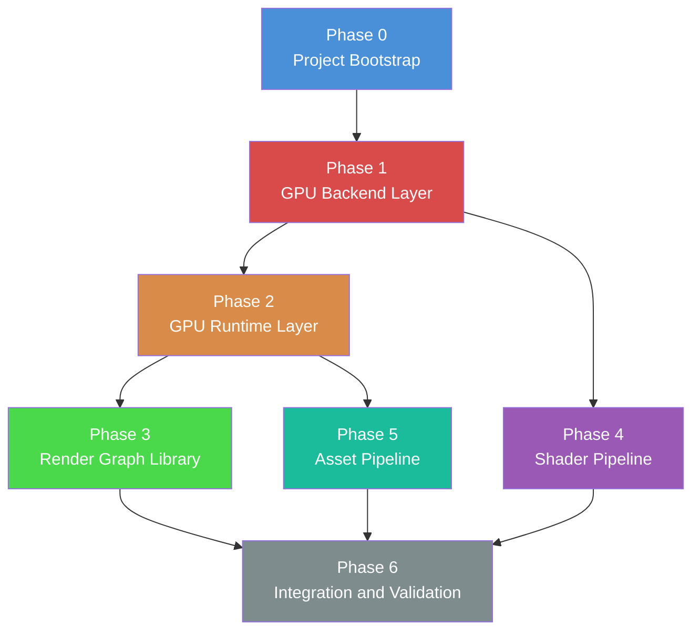
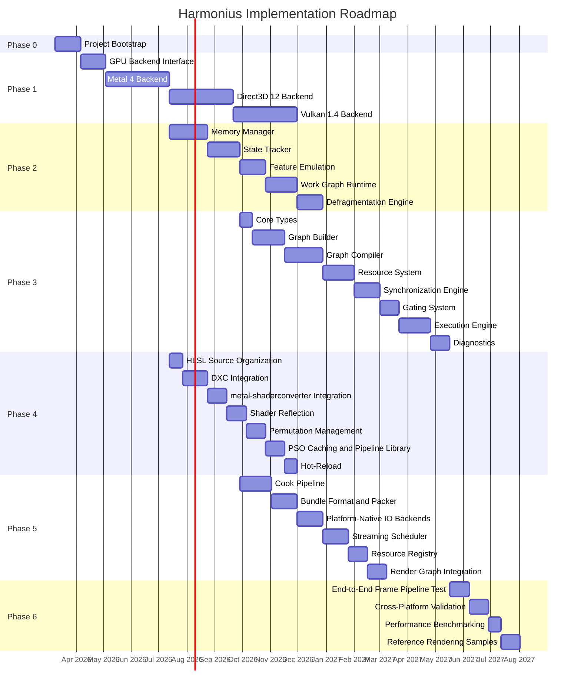

# Implementation Roadmap

This document defines the phased implementation plan for the Harmonius GPU graphics framework.
Harmonius is structured as three core layers -- GPU Backend (`harmonius::gpu`), GPU Runtime
(`harmonius::gpu_runtime`), and Render Graph (`harmonius::rg`) -- plus two supporting subsystems:
the Shader Pipeline and the Asset Pipeline.

Each phase lists its deliverables in dependency order. Phases themselves have strict dependency
relationships that determine which work can proceed in parallel.

## Phase dependency diagram

Key observations:

- Phase 4 (Shader Pipeline) can start in parallel with Phases 2 and 3 once Phase 1 is complete.
- Phase 5 (Asset Pipeline) can start in parallel with Phase 3 once Phase 2 is complete.
- Phase 6 (Integration and Validation) blocks on Phases 3, 4, and 5.

## Gantt chart

---

## Phase 0: Project Bootstrap

**Goal:** Establish the build system, dependency management, continuous integration, and code
quality tooling so that all subsequent phases can iterate quickly.

### 0.1 CMake project skeleton

- Configure CMake 3.30+ with C++26 standard (`CMAKE_CXX_STANDARD 26`).
- Define top-level targets for each library: `harmonius_gpu`, `harmonius_gpu_runtime`,
  `harmonius_rg`.
- Set up CTest integration for unit and integration test targets.
- Configure `CMAKE_EXPORT_COMPILE_COMMANDS` for tooling support.

### 0.2 vcpkg manifest

Create `vcpkg.json` with the following core dependencies:

| Dependency | Purpose |
|---|---|
| `alembic` | Scene interchange for asset pipeline |
| `cgltf` | glTF mesh loading |
| `draco` | Mesh geometry compression |
| `libpng` | PNG texture loading |
| `meshoptimizer` | Mesh optimization (simplification, vertex cache, overdraw) |
| `openexr` | HDR texture loading |
| `zstd` | Bundle compression |

Platform-specific dependencies (gated by triplet):

| Dependency | Platform | Purpose |
|---|---|---|
| `directx-headers` | Windows | Direct3D 12 API headers |
| `directx-dxc` | Windows, macOS | HLSL compiler (DXIL and SPIR-V output) |
| `vulkan-headers` | Windows, Linux | Vulkan API headers |
| `vulkan-loader` | Windows, Linux | Vulkan runtime loader |

### 0.3 CI pipeline skeleton

- Configure GitHub Actions workflows for macOS, Windows, and Linux.
- macOS: Apple Clang with Metal 4 SDK.
- Windows: MSVC with Windows SDK and Agility SDK.
- Linux: Clang/GCC with Vulkan SDK.
- Run build, test, and static analysis on every pull request.

### 0.4 Static analysis and formatting

- Configure `clang-format` with project style rules.
- Configure `clang-tidy` with modernize, performance, and bugprone checks.
- Integrate `cppcheck` as an additional static analysis pass.
- Enforce formatting and analysis in CI as gating checks.

### 0.5 Exit criteria

- All three library targets build (empty translation units) on all three platforms.
- CI pipeline runs and reports green on an empty project.
- `vcpkg install` succeeds for all declared dependencies on each platform.

---

## Phase 1: GPU Backend Layer (`harmonius::gpu`)

**Goal:** Define the backend-agnostic GPU interface using C++20 concepts and implement concrete
backends for Metal 4, Direct3D 12, and Vulkan 1.4.

**Dependency:** Phase 0 must be complete.

### 1.1 GPU backend interface

Define the concept-based interface that all backends must satisfy:

- `GpuDevice` -- device creation, feature queries, queue families, pipeline creation.
- `GpuCommandPool` -- command buffer allocation and reset.
- `GpuCommandBuffer` -- render/compute/transfer command recording.
- Resource types: buffers, textures, samplers, acceleration structures.
- Synchronization primitives: fences, semaphores, timeline semaphores.
- Pipeline state: graphics, compute, mesh shader, ray tracing.
- Bindless resource model: descriptor indexing, argument buffers.

Each concept constrains the associated types and member functions that a backend must provide.
No virtual methods or vtables -- all dispatch is static through templates.

### 1.2 Metal 4 backend

Metal 4 is the first backend because macOS is the initial development target (per R-1.2.1).

Milestone order:

1. **Device creation** -- `MTLDevice` acquisition, feature set queries, queue creation.
2. **Resource creation** -- buffers (`MTLBuffer`), textures (`MTLTexture`), heaps (`MTLHeap`),
   acceleration structures (`MTLAccelerationStructure`).
3. **Command recording** -- render, compute, and blit command encoders. Indirect command
   buffers. `MTLLogContainer` for shader logging.
4. **Synchronization** -- `MTLEvent`, `MTLSharedEvent` for timeline semaphores, fence-based
   resource hazard tracking.
5. **Mesh shader dispatch** -- object and mesh shader stages via Metal mesh render pipeline.
6. **Ray tracing dispatch** -- acceleration structure builds, intersection functions,
   ray tracing compute pipelines.
7. **Bindless resources** -- argument buffers, resource residency, GPU-driven indexing.
8. **Pipeline state** -- render pipeline descriptors, compute pipeline descriptors, pipeline
   caching via `MTLBinaryArchive`.
9. **Diagnostics** -- GPU capture integration, counter sampling, shader validation layer.

### 1.3 Direct3D 12 backend

Targets Agility SDK 1.619+ with Shader Model 6.9.

Milestone order:

1. **Device creation** -- `ID3D12Device` with Agility SDK, adapter enumeration,
   `D3D12_FEATURE_DATA` queries, command queue creation.
2. **Resource creation** -- committed and placed resources, heaps, descriptor heaps,
   RT acceleration structures (`ID3D12Resource` for BLAS/TLAS).
3. **Command recording** -- command list recording for graphics, compute, copy, and
   video decode. Indirect command signatures. Enhanced barriers
   (`D3D12_BARRIER_GROUP`).
4. **Synchronization** -- `ID3D12Fence` with timeline semantics, split barriers.
5. **Mesh shader dispatch** -- amplification and mesh shader stages via `DispatchMesh`.
6. **Ray tracing dispatch** -- `DispatchRays`, shader tables, RT pipeline state objects.
7. **Bindless resources** -- `CBV_SRV_UAV` descriptor heap indexing, root signature with
   unbounded descriptor ranges.
8. **Pipeline state** -- pipeline state streams (`D3D12_PIPELINE_STATE_STREAM_DESC`),
   pipeline library (`ID3D12PipelineLibrary`).
9. **Diagnostics** -- PIX event markers, GPU-based validation, DRED auto-breadcrumbs.

### 1.4 Vulkan 1.4 backend

Milestone order:

1. **Device creation** -- instance and device creation with required extensions, physical
   device selection, queue family discovery.
2. **Resource creation** -- buffers, images, memory allocation (via VMA or custom allocator),
   acceleration structures (`VK_KHR_acceleration_structure`).
3. **Command recording** -- command buffer recording with dynamic rendering
   (`VK_KHR_dynamic_rendering`), push descriptors, indirect commands.
4. **Synchronization** -- timeline semaphores (`VK_KHR_timeline_semaphore`), pipeline
   barriers with `VkDependencyInfo`, events.
5. **Mesh shader dispatch** -- `VK_EXT_mesh_shader` (EXT, not NV), task and mesh stages.
6. **Ray tracing dispatch** -- `VK_KHR_ray_tracing_pipeline`, shader binding tables,
   acceleration structure builds.
7. **Bindless resources** -- `VK_EXT_descriptor_indexing`, update-after-bind descriptor sets,
   buffer device addresses.
8. **Pipeline state** -- graphics, compute, and RT pipeline creation, pipeline cache,
   `VK_EXT_graphics_pipeline_library`.
9. **Diagnostics** -- validation layers, debug utils labels and markers, GPU-assisted
   validation.

### 1.5 Exit criteria

- Each backend passes the backend conformance test suite (device creation, resource lifecycle,
  command recording, synchronization, mesh dispatch, RT dispatch).
- All three backends satisfy the `GpuDevice`, `GpuCommandPool`, and `GpuCommandBuffer`
  concepts at compile time.

---

## Phase 2: GPU Runtime Layer (`harmonius::gpu_runtime`)

**Goal:** Provide memory management, automatic state tracking, feature emulation, and work graph
support on top of the raw GPU backend.

**Dependency:** Phase 1 Metal 4 backend must be complete. Subsequent backends can be integrated
as they become available.

### 2.1 Memory Manager

1. **TLSF block allocator** -- Two-Level Segregated Fit allocator for sub-allocation within
   GPU heaps. O(1) allocation and deallocation.
2. **Heap manager** -- manages multiple GPU heaps per memory type, grows on demand, and
   respects device memory limits.
3. **Ring allocator** -- per-frame ring buffer for transient upload/readback data. Fenced
   regions released after GPU completion.
4. **Pool allocator** -- fixed-size block pool for uniform-sized resources (e.g., constant
   buffers, staging tiles).
5. **Budget tracker** -- queries device memory budgets, tracks committed memory per heap type,
   and triggers eviction when approaching limits.

### 2.2 State Tracker

1. **Tracked command buffer** -- wraps the backend command buffer and records per-resource
   state (layout, access flags, queue ownership).
2. **Resource state cache** -- maintains the last-known state of every live resource, enabling
   automatic barrier insertion.
3. **Barrier optimizer** -- batches and coalesces barriers to minimize pipeline stalls. Merges
   compatible transitions and defers barriers to the latest valid point.

### 2.3 Feature Emulation

1. **Split barrier emulation** -- for backends that do not natively support split barriers
   (Vulkan events or Metal fences), emulate begin/end barrier semantics.
2. **Queue ownership elision** -- skip queue ownership transfers when the backend uses a
   unified queue model (Metal).
3. **RT pipeline emulation** -- for platforms without native RT pipeline support, emulate via
   compute shaders with software traversal.

### 2.4 Work Graph Runtime

1. **Native Direct3D 12 path** -- use `ID3D12WorkGraphProperties` and
   `D3D12_SET_WORK_GRAPH_DESC` for hardware-accelerated work graphs on D3D12.
2. **CPU emulation** -- for Metal and Vulkan (which lack native work graph APIs), emulate
   work graph execution on the CPU by dispatching compute shaders per node, using readback
   buffers for inter-node communication.

### 2.5 Defragmentation Engine

- Periodically compact GPU heaps by relocating resources to eliminate fragmentation.
- Copy-on-idle strategy: schedule defragmentation copies during low-utilization frames.
- Maintain a relocation table so that in-flight references remain valid until the next
  fence completion.

### 2.6 Exit criteria

- Memory manager unit tests: allocation, deallocation, fragmentation, budget enforcement.
- State tracker integration test: automatic barrier insertion matches hand-written barriers.
- Feature emulation tests: split barriers, queue ownership, RT emulation produce correct
  results on all backends.

---

## Phase 3: Render Graph Library (`harmonius::rg`)

**Goal:** Provide a declarative, frame-graph-based rendering API that compiles a directed acyclic
graph of passes into an optimized GPU command stream.

**Dependency:** Phase 2 State Tracker must be complete.

### 3.1 Core types

- **Handles** -- strongly typed, generational handles for passes, resources, and sub-graphs.
- **Enums** -- resource usage flags, pass types (graphics, compute, transfer, ray tracing),
  queue affinity hints.
- **Descriptors** -- `TextureDesc`, `BufferDesc`, `PassDesc` value types that describe
  resources and passes without creating them.

### 3.2 Graph Builder

1. **Pass declaration** -- `AddPass()` registers a pass with a name, queue affinity, and a
   setup callback. The setup callback declares resource reads, writes, and creates.
2. **Resource declaration** -- `CreateTexture()`, `CreateBuffer()` return transient resource
   handles. `import()` brings externally owned resources (swapchain images, persistent
   buffers) into the graph.
3. **Sub-graph templates** -- reusable sub-graphs (e.g., a shadow map cascade, a bloom chain)
   that can be instantiated multiple times with different parameters.
4. **Gates** -- attach capability or budget gates to passes. Gated passes are conditionally
   included based on runtime evaluation.

### 3.3 Graph Compiler

1. **Validation** -- verify that every resource read has a prior write, detect cycles, ensure
   queue affinity constraints are satisfiable.
2. **Gate evaluation** -- evaluate all gates and prune gated-out passes before further
   compilation.
3. **Dead-pass elimination** -- remove passes whose outputs are never consumed.
4. **Topological sort** -- produce a linear execution order respecting data dependencies.
5. **Barrier scheduling** -- insert resource transitions at optimal points. Use split barriers
   where beneficial.
6. **Aliasing** -- identify non-overlapping resource lifetimes and assign them to the same
   memory. Minimize total memory footprint.
7. **Queue partitioning** -- assign passes to hardware queues (graphics, compute, copy) based
   on affinity hints and dependency constraints. Insert cross-queue synchronization.

### 3.4 Resource System

1. **Allocation** -- allocate transient resources from pooled memory. Reuse allocations from
   previous frames when descriptors match.
2. **Aliasing solver** -- compute the interference graph and find an optimal aliasing
   assignment using a graph coloring algorithm.
3. **Pool and ring allocators** -- integrate with the runtime memory manager for fast transient
   allocation.
4. **Residency tracking** -- track which resources are resident in GPU memory and issue
   make-resident/evict calls as needed.

### 3.5 Synchronization Engine

1. **Barrier scheduler** -- convert the compiler's barrier plan into backend-specific barrier
   commands (enhanced barriers on D3D12, pipeline barriers on Vulkan, resource hazard tracking
   on Metal).
2. **Timeline fence manager** -- manage a pool of timeline fences for cross-queue and
   cross-frame synchronization. Recycle fences after completion.

### 3.6 Gating System

1. **Capability gates** -- enable or disable passes based on device feature support (e.g.,
   mesh shaders, ray tracing, variable rate shading).
2. **Budget gates** -- enable or disable passes based on runtime memory or performance budgets
   (e.g., skip expensive post-processing on low-end hardware).
3. **Fallback chains** -- define ordered lists of pass alternatives. The compiler selects the
   first pass whose gate evaluates to true.

### 3.7 Execution Engine

1. **Per-frame binding** -- bind the compiled graph to per-frame resources (swapchain image
   index, frame-in-flight index).
2. **Parallel encoding** -- distribute command recording across multiple threads. Each pass
   records into its own secondary command buffer or parallel render command encoder.
3. **Submission** -- submit command buffers to queues in the order determined by the compiler,
   with appropriate fence signals and waits.
4. **Ring buffer allocation** -- allocate per-frame transient data (uniform updates, vertex
   uploads) from ring buffers managed by the runtime.

### 3.8 Diagnostics

1. **Timestamps** -- insert GPU timestamp queries around each pass. Report per-pass GPU
   time in milliseconds.
2. **Statistics** -- collect resource allocation counts, barrier counts, memory usage, and
   aliasing efficiency per frame.
3. **Debug overlays** -- provide data for an optional debug overlay showing the render graph
   structure, pass timings, and resource lifetimes.

### 3.9 Exit criteria

- Graph builder can declare a non-trivial render graph (forward pass, shadow pass, post
  processing) and compile it without errors.
- Compiler produces correct barrier and aliasing plans verified by validation tests.
- Execution engine renders a frame on all three backends with identical results.

---

## Phase 4: Shader Pipeline

**Goal:** Compile HLSL shaders to all backend intermediate representations, manage permutations,
and support runtime pipeline state caching.

**Dependency:** Phase 1 must be complete. Can proceed in parallel with Phases 2 and 3.

### 4.1 HLSL source organization

- Establish a directory structure for shader source files grouped by rendering domain
  (geometry, lighting, post-processing, ray tracing).
- Define shared header conventions for cross-stage types and constants.
- Set up include path conventions for shader libraries.

### 4.2 DXC integration

- Integrate the DirectX Shader Compiler (DXC) as the primary compilation tool.
- Compile HLSL to DXIL for the Direct3D 12 backend.
- Compile HLSL to SPIR-V for the Vulkan backend (via `-spirv` flag).
- Configure target profiles for Shader Model 6.9.
- Wire DXC into the CMake build as a custom command.

### 4.3 metal-shaderconverter integration

- Integrate Apple's `metal-shaderconverter` tool to convert DXIL to Metal IR.
- Pipeline: HLSL --> DXC --> DXIL --> metal-shaderconverter --> Metal Library.
- Handle Metal-specific adjustments (argument buffer layout, vertex attribute mapping).

### 4.4 Shader reflection

- Extract reflection data from compiled shader blobs (DXIL, SPIR-V, Metal IR).
- Build a unified reflection model: resource bindings, push constants, vertex input layout,
  thread group size.
- Use reflection data to auto-generate root signatures, descriptor set layouts, and argument
  buffer structures.

### 4.5 Permutation management

- Define a permutation system based on feature flags (e.g., `HAS_NORMAL_MAP`,
  `SHADOW_QUALITY_HIGH`).
- Generate all required permutations at build time.
- Provide a runtime key-to-permutation lookup for selecting the correct shader variant.

### 4.6 PSO caching and pipeline library

- Serialize compiled pipeline state objects to disk.
- On Direct3D 12: use `ID3D12PipelineLibrary` for fast pipeline loading.
- On Vulkan: use `VkPipelineCache`.
- On Metal: use `MTLBinaryArchive`.
- Warm the cache on first launch by pre-compiling all expected PSO combinations.

### 4.7 Hot-reload (development only)

- Watch shader source files for modifications.
- Recompile changed shaders and rebuild affected pipeline state objects.
- Swap pipelines at the next frame boundary without restarting the application.
- Guard behind a compile-time development flag; exclude from release builds.

### 4.8 Exit criteria

- A single HLSL shader compiles to DXIL, SPIR-V, and Metal IR via the automated pipeline.
- Reflection data matches across all three outputs.
- Permutation system generates and indexes all expected variants.
- PSO cache reduces second-launch pipeline creation time by at least 90%.

---

## Phase 5: Asset Pipeline

**Goal:** Cook raw assets into GPU-optimal formats, package them into streaming-friendly bundles,
and load them efficiently using platform-native IO.

**Dependency:** Phase 2 must be complete. Can proceed in parallel with Phase 3.

### 5.1 Cook pipeline

**Mesh processing:**

1. Load meshes via `cgltf` (glTF) and `alembic` (Alembic).
2. Optimize with `meshoptimizer`: vertex cache optimization, overdraw optimization, vertex
   fetch optimization, mesh simplification (LOD generation).
3. Compress with `draco` for archival/distribution; store uncompressed for runtime
   streaming.
4. Generate meshlet data for mesh shader consumption.

**Texture processing:**

1. Load source textures via `libpng` (PNG, LDR) and `openexr` (EXR, HDR).
2. Generate full mip chains.
3. Compress to BC formats (BC1/BC3 for color, BC5 for normals, BC6H for HDR, BC7 for
   high-quality color).
4. Store as platform-optimal texture formats (DDS for D3D12/Vulkan, KTX2 as interchange).

### 5.2 Bundle format and packer

- Define a custom bundle format with a header, table of contents, and data payload.
- Align data regions to 64 KB boundaries for direct GPU upload compatibility.
- Compress bundle payload with `zstd` at a configurable compression level.
- Support delta bundles for patching.

### 5.3 Platform-native IO backends

No C++ standard library file IO is used. Each platform uses its native async IO mechanism.

| Platform | Backend | Description |
|---|---|---|
| macOS | `dispatch_io` (GCD) | Grand Central Dispatch async IO with staging buffer upload |
| Windows (D3D12) | DirectStorage | `IDStorageQueue` for GPU decompression and direct upload |
| Windows (Vulkan) | IOCP | I/O completion ports for async reads with staging buffer upload |
| Linux | `io_uring` | Kernel-level async IO with staging buffer upload |

Each backend implements a common async IO interface: submit read requests, poll or await
completion, retrieve loaded data.

### 5.4 Streaming scheduler and residency tracking

- Implement a priority-based streaming scheduler that determines which assets to load based
  on camera proximity, visibility, and predicted need.
- Track residency state per asset: not loaded, loading, resident, eviction candidate.
- Integrate with the runtime budget tracker to stay within memory limits.
- Support mip streaming for textures (load low mips first, stream high mips on demand).

### 5.5 Resource registry and bindless descriptor heap

- Maintain a global registry of loaded resources indexed by asset ID.
- Assign each loaded resource a stable bindless index in the global descriptor heap.
- Provide a GPU-visible buffer of resource metadata (dimensions, format, mip count) for
  shader-side lookup.

### 5.6 Render graph integration

- Inject transfer passes into the render graph for streaming uploads.
- The streaming scheduler submits upload requests; the render graph compiler places them
  optimally (on copy queues where possible).
- Barrier insertion ensures uploaded resources are available before first use.

### 5.7 Exit criteria

- Cook pipeline processes a reference asset set (meshes and textures) without errors.
- Bundle packer produces valid bundles that round-trip through pack and unpack.
- Platform-native IO backends load bundles on all three platforms.
- Streaming scheduler loads and evicts assets under memory pressure without visual artifacts.

---

## Phase 6: Integration and Validation

**Goal:** Validate the complete framework end-to-end across all platforms with benchmarks and
reference samples.

**Dependency:** Phases 3, 4, and 5 must be complete.

### 6.1 End-to-end frame pipeline test

- Build a render graph that includes geometry, shadow, lighting, and post-processing passes.
- Compile the graph, bind shader permutations, load assets, and execute a frame.
- Verify that the output image matches a reference image within a tolerance threshold.

### 6.2 Cross-platform validation

- Run the same render graph on all three backends (Metal, D3D12, Vulkan).
- Compare output images across backends. Differences must be below a per-pixel threshold
  that accounts for floating-point precision and rounding differences.
- Document any backend-specific divergences with explanations.

### 6.3 Performance benchmarking baselines

- Establish baseline benchmarks for key operations: graph compilation time, barrier
  insertion overhead, memory allocation throughput, frame time.
- Run benchmarks in CI to detect performance regressions.
- Publish benchmark results in a machine-readable format for tracking over time.

### 6.4 Reference rendering samples

- Create a minimal set of rendering samples that exercise all framework features:
  - Forward rendering with mesh shaders.
  - Deferred rendering with compute-based lighting.
  - Ray-traced shadows and reflections.
  - Streaming asset loading with LOD transitions.
- Each sample serves as both a functional test and a usage example.

### 6.5 Exit criteria

- All end-to-end tests pass on all three platforms.
- Cross-platform image comparison is within tolerance.
- Performance baselines are established and tracked in CI.
- Reference samples render correctly and are documented.
