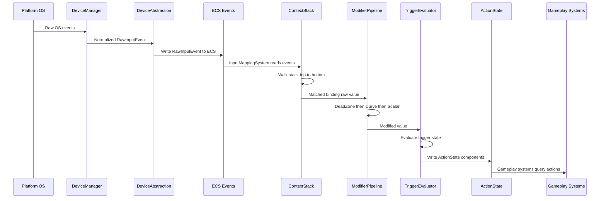
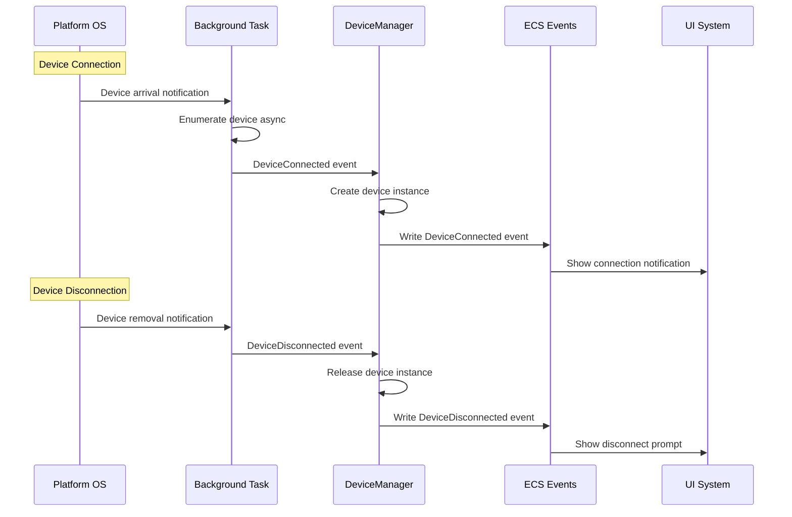
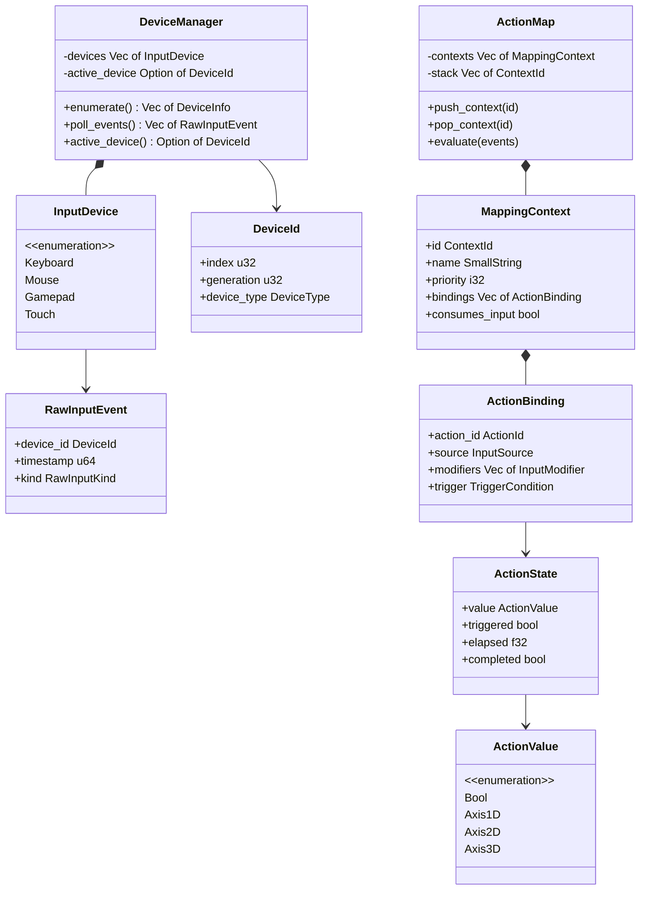
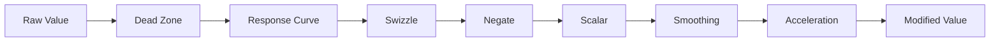
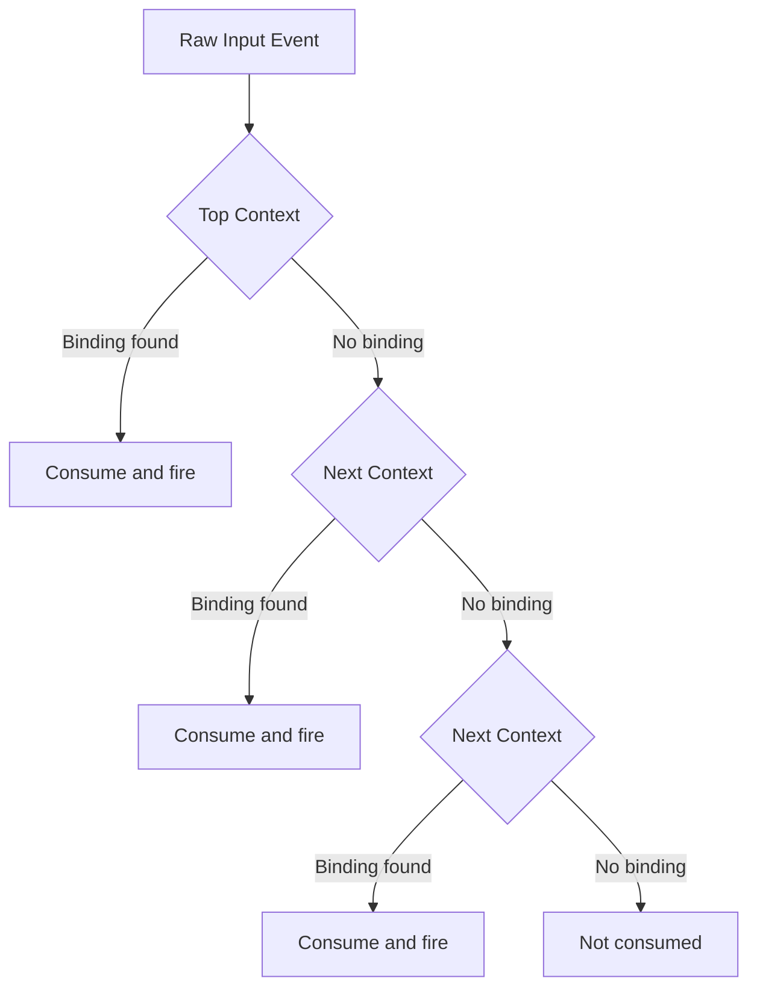
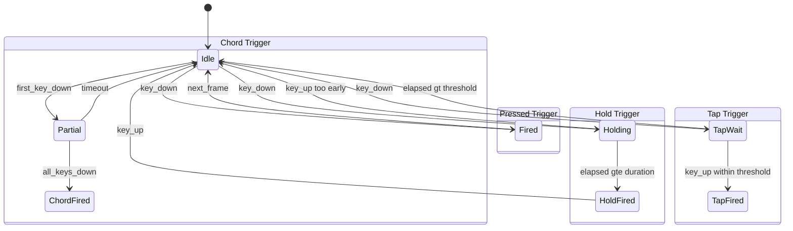
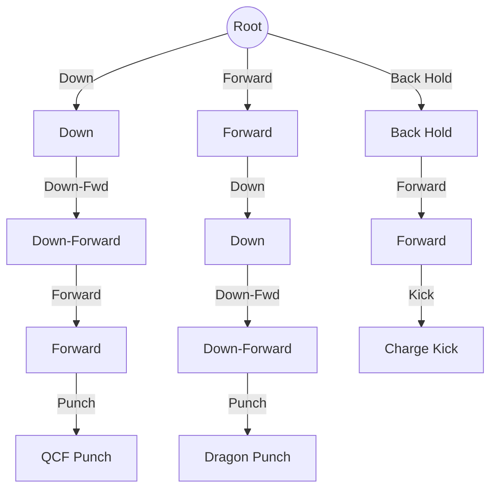

# Input Devices and Action Mapping Design

## Requirements Trace

> **Canonical sources:** Features, requirements, and user stories are defined in
> [features/input/](../../features/), [requirements/input/](../../requirements/), and
> [user-stories/input/](../../user-stories/). The table below traces design elements to those
> definitions.

### Device Abstraction (R-6.1)

| Feature   | Requirement |
|-----------|-------------|
| F-6.1.1   | R-6.1.1     |
| F-6.1.2   | R-6.1.2     |
| F-6.1.3   | R-6.1.3     |
| F-6.1.4   | R-6.1.4     |
| F-6.1.5   | R-6.1.5     |
| R-6.1.NF1 | --          |
| R-6.1.NF2 | --          |

1. **F-6.1.1** — Keyboard press, release, repeat with scancode and keycode
2. **F-6.1.2** — Mouse button, motion, scroll with sub-pixel deltas
3. **F-6.1.3** — Unified gamepad over XInput, DualSense, Switch Pro
4. **F-6.1.4** — Multi-touch and pen with pressure normalization
5. **F-6.1.5** — Device hot-plug detection and enumeration
6. **R-6.1.NF1** — OS-to-action pipeline under 1 ms p99
7. **R-6.1.NF2** — Device enumeration within 5 ms startup, 2 ms hot-plug

### Action Mapping (R-6.2)

| Feature   | Requirement |
|-----------|-------------|
| F-6.2.1   | R-6.2.1     |
| F-6.2.2   | R-6.2.2     |
| F-6.2.3   | R-6.2.3     |
| F-6.2.4   | R-6.2.4     |
| F-6.2.5   | R-6.2.5     |
| F-6.2.6   | R-6.2.6     |
| F-6.2.7   | R-6.2.7     |
| F-6.2.8   | R-6.2.8     |
| F-6.2.9   | R-6.2.9     |
| F-6.2.10  | R-6.2.10    |
| F-6.2.11  | R-6.2.11    |
| R-6.2.NF1 | --          |
| R-6.2.NF2 | --          |

1. **F-6.2.1** — Typed actions: bool, axis 1D, axis 2D, axis 3D
2. **F-6.2.2** — Mapping contexts with priority stacking
3. **F-6.2.3** — Modifier chains: dead zone, curve, swizzle, negate, scalar
4. **F-6.2.4** — Trigger conditions: pressed, released, hold, tap, pulse, chord, combo
5. **F-6.2.5** — Runtime rebinding with conflict detection
6. **F-6.2.6** — Platform-aware button glyph resolution
7. **F-6.2.7** — Input recording and deterministic playback
8. **F-6.2.8** — Combo input trees and directional sequences
9. **F-6.2.9** — Input buffering and ability cancel windows
10. **F-6.2.10** — Smoothing, acceleration, aim assist
11. **F-6.2.11** — Controller-driven UI interaction
12. **R-6.2.NF1** — 128 actions evaluated in under 0.2 ms per frame
13. **R-6.2.NF2** — Rebinding persisted within 100 ms, restored within 50 ms

## Overview

The input system is divided into two layers:

1. **Device Abstraction** -- platform-native capture of raw events from keyboard, mouse, gamepad,
   and touch. Each device backend uses OS-specific APIs (Win32 raw input, macOS HID/GCController,
   Linux evdev) and normalizes events into a common `RawInputEvent` type written to the ECS world.
2. **Action Mapping** -- a data-driven pipeline that maps raw events to named, typed gameplay
   actions. Bindings are grouped into priority-stacked mapping contexts. Raw values pass through a
   composable modifier chain (dead zones, response curves, scalars) and trigger evaluators (pressed,
   hold, tap, chord, combo) before producing `ActionState` components that gameplay systems query.

All input state lives as ECS components and resources. All bindings are authored in the visual
editor (no-code). Static dispatch is used throughout -- platform backends are selected via `cfg`
attributes, not trait objects.

## Architecture

### Module Boundaries

```mermaid
graph TD
    subgraph "harmonius_input"
        DA[DeviceAbstraction]
        AM[ActionMapping]
        MC[MappingContext]
        MP[ModifierPipeline]
        TC[TriggerConditions]
        RB[Rebinding]
        GR[GlyphResolver]
        IR[InputRecorder]
        CB[ComboSystem]
        IB[InputBuffer]
    end

    subgraph "harmonius_input::devices"
        KB[KeyboardDevice]
        MS[MouseDevice]
        GP[GamepadDevice]
        TH[TouchDevice]
        DM[DeviceManager]
    end

    subgraph "harmonius_ecs"
        EC[ECS World]
        EV[Event Bus]
    end

    subgraph "platform::windows"
        WK[WM_KEYDOWN / WM_KEYUP]
        WM[WM_INPUT Raw Mouse]
        WX[XInput / WGI]
        WP[WM_POINTER Touch]
        WD[WM_DEVICECHANGE]
    end

    subgraph "platform::macos"
        MH[IOHIDManager]
        MC2[CGEvent Mouse]
        MG[GCController]
        MTH[NSTouch]
        MI[IOHIDManager Plug]
    end

    subgraph "platform::linux"
        LE[evdev Keyboard]
        LM[evdev Mouse]
        LG[evdev Gamepad]
        LI[libinput Touch]
        LU[udev Monitor]
    end

    DM --> DA
    KB --> DA
    MS --> DA
    GP --> DA
    TH --> DA

    DA --> AM
    AM --> MC
    AM --> MP
    AM --> TC
    AM --> RB
    AM --> GR
    AM --> CB
    CB --> IB

    DA --> EV
    AM --> EC

    KB -.->|"cfg(windows)"| WK
    KB -.->|"cfg(macos)"| MH
    KB -.->|"cfg(linux)"| LE
    MS -.->|"cfg(windows)"| WM
    MS -.->|"cfg(macos)"| MC2
    MS -.->|"cfg(linux)"| LM
    GP -.->|"cfg(windows)"| WX
    GP -.->|"cfg(macos)"| MG
    GP -.->|"cfg(linux)"| LG
    TH -.->|"cfg(windows)"| WP
    TH -.->|"cfg(macos)"| MTH
    TH -.->|"cfg(linux)"| LI
    DM -.->|"cfg(windows)"| WD
    DM -.->|"cfg(macos)"| MI
    DM -.->|"cfg(linux)"| LU
```



### Directory Layout

```text
harmonius_input/
├── devices/
│   ├── mod.rs           # DeviceManager, DeviceId,
│   │                    # InputDevice enum
│   ├── keyboard.rs      # KeyboardState, Scancode,
│   │                    # Keycode enums
│   ├── mouse.rs         # MouseState, MouseButton enum
│   ├── gamepad.rs       # GamepadState, GamepadButton,
│   │                    # capability queries
│   ├── touch.rs         # TouchState, FingerId,
│   │                    # PenState
│   └── platform/
│       ├── windows/
│       │   ├── keyboard.rs  # WM_KEYDOWN/UP capture
│       │   ├── mouse.rs     # WM_INPUT raw mouse
│       │   ├── gamepad.rs   # XInput / WGI
│       │   ├── touch.rs     # WM_POINTER
│       │   └── hotplug.rs   # WM_DEVICECHANGE
│       ├── macos/
│       │   ├── keyboard.rs  # IOHIDManager keys
│       │   ├── mouse.rs     # CGEvent deltas
│       │   ├── gamepad.rs   # GCController
│       │   ├── touch.rs     # NSTouch / tablet
│       │   └── hotplug.rs   # IOHIDManager match
│       └── linux/
│           ├── keyboard.rs  # evdev key events
│           ├── mouse.rs     # evdev relative axes
│           ├── gamepad.rs   # evdev gamepad
│           ├── touch.rs     # libinput multitouch
│           └── hotplug.rs   # udev monitor
├── actions/
│   ├── mod.rs           # ActionId, ActionValue,
│   │                    # ActionState
│   ├── mapping.rs       # ActionMap, ActionBinding,
│   │                    # InputSource
│   ├── context.rs       # MappingContext, ContextStack
│   ├── modifiers.rs     # InputModifier enum,
│   │                    # ModifierChain
│   ├── triggers.rs      # TriggerCondition enum,
│   │                    # TriggerState
│   ├── rebinding.rs     # RebindRequest,
│   │                    # ConflictResolver
│   └── glyphs.rs        # GlyphResolver,
│   │                    # GlyphAtlas
│   └── recording.rs     # InputRecorder,
│                        # InputPlayback
├── combo/
│   ├── mod.rs           # ComboTree, ComboNode
│   ├── evaluator.rs     # ComboEvaluator state
│   │                    # machine
│   └── buffer.rs        # InputBuffer,
│                        # CancelWindow
└── systems.rs           # ECS systems:
                         # DevicePollSystem,
                         # ActionMappingSystem,
                         # ComboSystem,
                         # RecordingSystem
```

### Per-Frame Input Pipeline



### Device Hot-Plug Flow



### Core Data Structures



### Modifier Pipeline Chain



### Context Stack Priority Resolution



### Trigger Condition State Machines



### Combo Tree Example



## API Design

### Device Identification

```rust
/// Identifies a connected input device. Uses a
/// generational index for safe reuse after
/// disconnect/reconnect.
#[derive(
    Clone, Copy, Debug, PartialEq, Eq, Hash,
)]
pub struct DeviceId {
    pub index: u32,
    pub generation: u32,
}

/// Broad device classification.
#[derive(
    Clone, Copy, Debug, PartialEq, Eq, Hash,
)]
pub enum DeviceType {
    Keyboard,
    Mouse,
    Gamepad,
    Touch,
    Pen,
}

/// Static information about a connected device.
pub struct DeviceInfo {
    pub id: DeviceId,
    pub device_type: DeviceType,
    pub name: SmallString,
    pub vendor_id: u16,
    pub product_id: u16,
    pub capabilities: DeviceCapabilities,
}

/// Capability flags queried per device.
#[derive(Clone, Copy, Debug, Default)]
pub struct DeviceCapabilities {
    pub has_gyroscope: bool,
    pub has_accelerometer: bool,
    pub has_touchpad: bool,
    pub has_adaptive_triggers: bool,
    pub has_nfc: bool,
    pub has_rumble: bool,
    pub has_hd_rumble: bool,
    pub max_touch_points: u8,
}
```

### Scancode and Keycode

```rust
/// Layout-independent physical key identifier.
/// Normalized across platforms to a common
/// enumeration. Critical for WASD-style bindings
/// that must work on any keyboard layout.
#[derive(
    Clone, Copy, Debug, PartialEq, Eq, Hash,
)]
#[repr(u16)]
pub enum Scancode {
    A = 0x0004,
    B = 0x0005,
    C = 0x0006,
    D = 0x0007,
    // ... full USB HID usage table
    W = 0x001A,
    S = 0x0016,
    Space = 0x002C,
    LeftShift = 0x00E1,
    LeftCtrl = 0x00E0,
    LeftAlt = 0x00E2,
    Escape = 0x0029,
    // Up to ~256 keys
}

/// Locale-aware virtual keycode. Reflects the
/// character printed on the key for the user's
/// active keyboard layout. Used for text input
/// and display labels (not bindings).
#[derive(
    Clone, Copy, Debug, PartialEq, Eq, Hash,
)]
pub struct Keycode(pub u32);
```

### Raw Input Events

```rust
/// A normalized input event from any device.
/// Written to the ECS event bus each frame.
#[derive(Clone, Debug)]
pub struct RawInputEvent {
    pub device_id: DeviceId,
    pub timestamp: u64,
    pub kind: RawInputKind,
}

/// Discriminated union of all raw input types.
#[derive(Clone, Debug)]
pub enum RawInputKind {
    // -- Keyboard --
    KeyPress {
        scancode: Scancode,
        keycode: Keycode,
    },
    KeyRelease {
        scancode: Scancode,
        keycode: Keycode,
    },
    KeyRepeat {
        scancode: Scancode,
        keycode: Keycode,
    },

    // -- Mouse --
    MouseButton {
        button: MouseButton,
        pressed: bool,
    },
    /// High-resolution sub-pixel delta. Already
    /// normalized for high-DPI.
    MouseMotion {
        delta_x: f32,
        delta_y: f32,
    },
    /// Absolute cursor position in window coords.
    MousePosition {
        x: f32,
        y: f32,
    },
    /// Unified scroll axis. Trackpad continuous
    /// and discrete mouse wheel both produce
    /// normalized values.
    MouseScroll {
        horizontal: f32,
        vertical: f32,
    },

    // -- Gamepad --
    GamepadButton {
        button: GamepadButton,
        pressed: bool,
    },
    GamepadAxis {
        axis: GamepadAxis,
        value: f32,
    },
    /// Raw gyroscope and accelerometer data.
    /// Only emitted if device has_gyroscope /
    /// has_accelerometer capability.
    GamepadMotion {
        gyro: Vec3,
        accel: Vec3,
    },

    // -- Touch --
    TouchBegin {
        finger_id: FingerId,
        position: Vec2,
        pressure: f32,
        area: f32,
    },
    TouchMove {
        finger_id: FingerId,
        position: Vec2,
        pressure: f32,
    },
    TouchEnd {
        finger_id: FingerId,
    },

    // -- Pen --
    PenMove {
        position: Vec2,
        pressure: f32,
        tilt: Vec2,
    },
    PenButton {
        button_index: u8,
        pressed: bool,
    },
}

#[derive(
    Clone, Copy, Debug, PartialEq, Eq, Hash,
)]
pub enum MouseButton {
    Left,
    Right,
    Middle,
    Button4,
    Button5,
}

/// Unified gamepad button names. Platform
/// backends map hardware buttons to these.
#[derive(
    Clone, Copy, Debug, PartialEq, Eq, Hash,
)]
pub enum GamepadButton {
    South,       // A / Cross
    East,        // B / Circle
    West,        // X / Square
    North,       // Y / Triangle
    LeftBumper,
    RightBumper,
    LeftTrigger,
    RightTrigger,
    Select,      // Back / Share
    Start,       // Menu / Options
    LeftStick,
    RightStick,
    DPadUp,
    DPadDown,
    DPadLeft,
    DPadRight,
    Guide,       // PS / Xbox / Home
    Touchpad,    // DualSense only
    Misc,
}

#[derive(
    Clone, Copy, Debug, PartialEq, Eq, Hash,
)]
pub enum GamepadAxis {
    LeftStickX,
    LeftStickY,
    RightStickX,
    RightStickY,
    LeftTrigger,
    RightTrigger,
}

#[derive(
    Clone, Copy, Debug, PartialEq, Eq, Hash,
)]
pub struct FingerId(pub u8);
```

### Device Manager

```rust
/// ECS resource managing all connected input
/// devices. Polls platform backends and produces
/// RawInputEvents.
pub struct DeviceManager {
    devices: Vec<DeviceSlot>,
    generation: Vec<u32>,
    free_list: Vec<u32>,
    active_device: Option<DeviceId>,
    active_device_type: Option<DeviceType>,
}

struct DeviceSlot {
    info: DeviceInfo,
    state: DeviceState,
}

/// Per-device-type current-frame state.
enum DeviceState {
    Keyboard(KeyboardState),
    Mouse(MouseState),
    Gamepad(GamepadState),
    Touch(TouchState),
}

impl DeviceManager {
    pub fn new() -> Self;

    /// Enumerate all connected devices at startup.
    /// Runs synchronously; must complete within
    /// 5 ms (R-6.1.NF2).
    pub fn enumerate(&mut self) -> Vec<DeviceInfo>;

    /// Poll all connected devices for new events.
    /// Called once per frame by DevicePollSystem.
    /// Must complete within 1 ms (R-6.1.NF1).
    pub fn poll_events(
        &mut self,
        out: &mut Vec<RawInputEvent>,
    );

    /// The device that most recently produced
    /// input. Used for glyph resolution and
    /// automatic context switching.
    pub fn active_device(&self) -> Option<DeviceId>;

    /// Broad type of the active device.
    pub fn active_device_type(
        &self,
    ) -> Option<DeviceType>;

    /// Query capabilities of a specific device.
    pub fn capabilities(
        &self,
        id: DeviceId,
    ) -> Option<&DeviceCapabilities>;

    /// Handle a hot-plug connection event from
    /// the background monitor task.
    pub fn handle_connect(
        &mut self,
        info: DeviceInfo,
    ) -> DeviceId;

    /// Handle a hot-plug disconnection event.
    pub fn handle_disconnect(
        &mut self,
        id: DeviceId,
    );
}
```

### Device State Snapshots

```rust
/// Per-frame keyboard state. Bitset of pressed
/// scancodes for O(1) is-pressed queries.
pub struct KeyboardState {
    /// One bit per scancode (USB HID table).
    pressed: [u64; 4], // 256 bits
}

impl KeyboardState {
    pub fn is_pressed(
        &self,
        scancode: Scancode,
    ) -> bool;

    pub fn just_pressed(
        &self,
        scancode: Scancode,
        prev: &KeyboardState,
    ) -> bool;

    pub fn just_released(
        &self,
        scancode: Scancode,
        prev: &KeyboardState,
    ) -> bool;
}

/// Per-frame mouse state.
pub struct MouseState {
    pub position: Vec2,
    pub delta: Vec2,
    pub scroll: Vec2,
    pub buttons: u8, // bitfield: L R M 4 5
}

/// Per-frame gamepad state.
pub struct GamepadState {
    pub buttons: u32, // bitfield per GamepadButton
    pub left_stick: Vec2,
    pub right_stick: Vec2,
    pub left_trigger: f32,
    pub right_trigger: f32,
    pub gyro: Vec3,
    pub accel: Vec3,
    /// Orientation derived from Madgwick sensor
    /// fusion. Updated only if has_gyroscope.
    pub orientation: Quat,
}

/// Per-frame touch state. Up to 10 contacts.
pub struct TouchState {
    pub contacts: [Option<TouchContact>; 10],
    pub contact_count: u8,
}

pub struct TouchContact {
    pub finger_id: FingerId,
    pub position: Vec2,
    pub pressure: f32,
    pub area: f32,
}
```

### Typed Actions

```rust
/// Unique identifier for a named action.
/// Defined in the editor, serialized as a
/// string hash.
#[derive(
    Clone, Copy, Debug, PartialEq, Eq, Hash,
)]
pub struct ActionId(pub u64);

/// The value type of an action. Enforced at
/// binding load time (R-6.2.1).
#[derive(Clone, Copy, Debug, PartialEq)]
pub enum ActionValue {
    Bool(bool),
    Axis1D(f32),
    Axis2D(Vec2),
    Axis3D(Vec3),
}

/// The expected value type for an action
/// definition. Used for type checking bindings.
#[derive(
    Clone, Copy, Debug, PartialEq, Eq, Hash,
)]
pub enum ActionValueType {
    Bool,
    Axis1D,
    Axis2D,
    Axis3D,
}

/// Per-action state written to ECS each frame.
/// Gameplay systems query this.
#[derive(Clone, Debug)]
pub struct ActionState {
    /// The current processed value.
    pub value: ActionValue,
    /// True on the frame the trigger condition
    /// is satisfied.
    pub triggered: bool,
    /// Seconds the input has been active.
    pub elapsed: f32,
    /// True on the frame the trigger completed
    /// (e.g. hold duration reached).
    pub completed: bool,
}

/// Definition of a named action. Authored in
/// the visual editor and serialized as an asset.
pub struct ActionDefinition {
    pub id: ActionId,
    pub name: SmallString,
    pub value_type: ActionValueType,
    /// Default value when no input is active.
    pub default_value: ActionValue,
}
```

### Input Source

```rust
/// Identifies a physical input that can be
/// bound to an action.
#[derive(Clone, Debug, PartialEq, Eq, Hash)]
pub enum InputSource {
    Key(Scancode),
    MouseButton(MouseButton),
    MouseAxis(MouseAxisSource),
    GamepadButton(GamepadButton),
    GamepadAxis(GamepadAxis),
    GamepadStick(GamepadStickSource),
    TouchRegion(TouchRegionId),
    ComboTree(ComboTreeId),
}

/// Mouse axes that can be bound as action
/// sources.
#[derive(
    Clone, Copy, Debug, PartialEq, Eq, Hash,
)]
pub enum MouseAxisSource {
    DeltaX,
    DeltaY,
    Delta2D,
    ScrollVertical,
    ScrollHorizontal,
    Scroll2D,
}

/// Which gamepad stick to use as an axis 2D
/// source.
#[derive(
    Clone, Copy, Debug, PartialEq, Eq, Hash,
)]
pub enum GamepadStickSource {
    Left,
    Right,
}

/// Identifier for a touch region defined in
/// the visual editor (virtual joystick area,
/// button zone).
#[derive(
    Clone, Copy, Debug, PartialEq, Eq, Hash,
)]
pub struct TouchRegionId(pub u32);

/// Identifier for a combo tree asset.
#[derive(
    Clone, Copy, Debug, PartialEq, Eq, Hash,
)]
pub struct ComboTreeId(pub u64);
```

### Mapping Contexts and Bindings

```rust
/// Unique identifier for a mapping context.
#[derive(
    Clone, Copy, Debug, PartialEq, Eq, Hash,
)]
pub struct ContextId(pub u64);

/// A named set of input-to-action bindings.
/// Authored in the visual editor as an asset.
pub struct MappingContext {
    pub id: ContextId,
    pub name: SmallString,
    /// Higher priority contexts are evaluated
    /// first. Contexts at equal priority are
    /// evaluated in push order (LIFO).
    pub priority: i32,
    pub bindings: Vec<ActionBinding>,
    /// When true, matched inputs are consumed
    /// and not passed to lower contexts.
    pub consumes_input: bool,
}

/// A single input-to-action binding within a
/// context.
pub struct ActionBinding {
    pub action_id: ActionId,
    pub source: InputSource,
    pub modifiers: ModifierChain,
    pub trigger: TriggerCondition,
}

/// The priority-ordered context stack. The
/// ActionMappingSystem walks this top-to-bottom
/// each frame.
pub struct ContextStack {
    /// Sorted by (priority DESC, push_order DESC).
    active: Vec<ActiveContext>,
}

struct ActiveContext {
    pub context_id: ContextId,
    pub priority: i32,
    pub push_order: u32,
}

impl ContextStack {
    pub fn new() -> Self;

    /// Push a context onto the stack. Takes
    /// effect on the next frame.
    pub fn push(&mut self, id: ContextId);

    /// Remove a context from the stack.
    pub fn pop(&mut self, id: ContextId);

    /// Iterate active contexts in priority order
    /// (highest first).
    pub fn iter_active(
        &self,
    ) -> impl Iterator<Item = ContextId> + '_;

    /// Check whether a context is currently active.
    pub fn is_active(&self, id: ContextId) -> bool;
}
```

### Input Modifiers

```rust
/// A single modifier stage in the processing
/// pipeline. Each modifier transforms an
/// ActionValue in place.
#[derive(Clone, Debug)]
pub enum InputModifier {
    /// Axial dead zone: zero each axis
    /// independently below threshold.
    DeadZoneAxial {
        threshold_x: f32,
        threshold_y: f32,
    },
    /// Radial dead zone: zero the full vector
    /// if magnitude is below threshold. Remaps
    /// [threshold, 1.0] to [0.0, 1.0].
    DeadZoneRadial {
        threshold: f32,
    },
    /// Response curve applied per axis.
    ResponseCurve {
        curve_type: ResponseCurveType,
    },
    /// Remap axes. E.g. swap X and Y.
    Swizzle {
        order: SwizzleOrder,
    },
    /// Invert specified axes.
    Negate {
        negate_x: bool,
        negate_y: bool,
        negate_z: bool,
    },
    /// Multiply all axes by a scalar.
    Scalar {
        multiplier: f32,
    },
    /// Low-pass smoothing filter.
    Smoothing {
        /// Time constant in seconds. Larger
        /// values = more smoothing.
        time_constant: f32,
    },
    /// Velocity-based acceleration.
    Acceleration {
        ramp_up_time: f32,
        max_multiplier: f32,
        decay_rate: f32,
    },
}

#[derive(Clone, Copy, Debug, PartialEq, Eq)]
pub enum ResponseCurveType {
    Linear,
    Exponential,
    SCurve,
    /// Custom curve defined by control points.
    Custom { curve_asset: u64 },
}

#[derive(Clone, Copy, Debug, PartialEq, Eq)]
pub enum SwizzleOrder {
    YX,
    ZYX,
    XZY,
}

/// An ordered chain of modifiers. Evaluated
/// left-to-right.
pub struct ModifierChain {
    modifiers: SmallVec<[InputModifier; 4]>,
}

impl ModifierChain {
    pub fn new() -> Self;

    pub fn push(&mut self, modifier: InputModifier);

    /// Apply the full chain to a raw value.
    /// Uses the previous frame's smoothing
    /// state.
    pub fn apply(
        &self,
        value: ActionValue,
        dt: f32,
        state: &mut ModifierState,
    ) -> ActionValue;
}

/// Per-binding mutable state for stateful
/// modifiers (smoothing, acceleration).
pub struct ModifierState {
    pub smoothed_value: ActionValue,
    pub acceleration_velocity: f32,
}
```

### Trigger Conditions

```rust
/// Defines when an action fires relative to
/// input state changes.
#[derive(Clone, Debug)]
pub enum TriggerCondition {
    /// Fires on the frame the input becomes
    /// active (key down, button press).
    Pressed,
    /// Fires on the frame the input is released.
    Released,
    /// Fires after input is held for at least
    /// `duration` seconds.
    Hold {
        duration: f32,
    },
    /// Fires if pressed and released within
    /// `threshold` seconds.
    Tap {
        threshold: f32,
    },
    /// Fires repeatedly at `interval` while
    /// the input is held.
    Pulse {
        interval: f32,
    },
    /// Fires when all listed inputs are active
    /// simultaneously within `window` seconds.
    Chord {
        inputs: SmallVec<[InputSource; 4]>,
        window: f32,
    },
    /// Fires when inputs arrive in the listed
    /// order within `window` seconds per step.
    Combo {
        sequence: SmallVec<[InputSource; 8]>,
        window_per_step: f32,
    },
    /// Always fires while the input is active
    /// (default for axis bindings).
    Down,
}

/// Per-binding mutable state tracking trigger
/// progress.
pub struct TriggerState {
    pub phase: TriggerPhase,
    pub elapsed: f32,
    pub chord_active: SmallVec<[bool; 4]>,
    pub combo_step: u8,
    pub combo_timer: f32,
}

#[derive(
    Clone, Copy, Debug, PartialEq, Eq,
)]
pub enum TriggerPhase {
    Idle,
    Ongoing,
    Fired,
    Completed,
}

impl TriggerCondition {
    /// Evaluate the trigger for this frame.
    /// Returns the new phase.
    pub fn evaluate(
        &self,
        input_active: bool,
        value: &ActionValue,
        dt: f32,
        state: &mut TriggerState,
    ) -> TriggerPhase;
}
```

### Rebinding

```rust
/// A request to rebind an action to a new input.
pub struct RebindRequest {
    pub context_id: ContextId,
    pub action_id: ActionId,
    pub new_source: InputSource,
}

/// Outcome of a rebind attempt.
#[derive(Clone, Debug)]
pub enum RebindResult {
    /// Binding applied successfully.
    Success,
    /// Conflict detected with an existing binding.
    Conflict {
        conflicting_action: ActionId,
        conflicting_context: ContextId,
    },
    /// The target input is platform-reserved
    /// (e.g. PS button, Xbox Guide).
    ReservedInput {
        source: InputSource,
    },
    /// Type mismatch between source and action.
    TypeMismatch {
        expected: ActionValueType,
        got: ActionValueType,
    },
}

/// Resolution chosen by the player when a
/// conflict is detected.
#[derive(Clone, Copy, Debug, PartialEq, Eq)]
pub enum ConflictResolution {
    /// Swap bindings between the two actions.
    Swap,
    /// Unbind the conflicting action.
    UnbindPrevious,
    /// Cancel the rebind.
    Cancel,
}

/// Manages runtime rebinding with conflict
/// detection and persistence.
pub struct RebindManager {
    /// Platform-reserved inputs that cannot
    /// be bound.
    reserved: Vec<InputSource>,
}

impl RebindManager {
    pub fn new() -> Self;

    /// Attempt to rebind. Returns Conflict if
    /// another action in an overlapping context
    /// already uses this source.
    pub fn request_rebind(
        &self,
        req: &RebindRequest,
        contexts: &[MappingContext],
        stack: &ContextStack,
    ) -> RebindResult;

    /// Apply a conflict resolution and finalize
    /// the rebind.
    pub fn resolve_conflict(
        &self,
        req: &RebindRequest,
        resolution: ConflictResolution,
        contexts: &mut [MappingContext],
    );

    /// Serialize all current bindings to
    /// persistent storage. Must complete within
    /// 100 ms (R-6.2.NF2).
    pub async fn save_bindings(
        &self,
        contexts: &[MappingContext],
    ) -> Result<(), IoError>;

    /// Restore bindings from persistent storage.
    /// Must complete within 50 ms (R-6.2.NF2).
    pub async fn load_bindings(
        &self,
        contexts: &mut [MappingContext],
    ) -> Result<(), IoError>;

    /// Reset all bindings to defaults.
    pub fn reset_to_defaults(
        &self,
        contexts: &mut [MappingContext],
        defaults: &[MappingContext],
    );

    /// Register a platform-reserved input.
    pub fn add_reserved(
        &mut self,
        source: InputSource,
    );
}
```

### Button Glyph Resolution

```rust
/// Identifies a glyph atlas asset.
#[derive(
    Clone, Copy, Debug, PartialEq, Eq, Hash,
)]
pub struct GlyphAtlasId(pub u64);

/// A resolved glyph for display in UI.
pub struct ResolvedGlyph {
    pub atlas_id: GlyphAtlasId,
    pub sprite_index: u32,
    /// Fallback text label (e.g. "LMB", "Space").
    pub label: SmallString,
}

/// Resolves input actions to platform-specific
/// button icons. Updates reactively when the
/// active device changes.
pub struct GlyphResolver {
    /// One atlas per controller family.
    atlases: Vec<(DeviceFamily, GlyphAtlasId)>,
    /// Cached resolution per action.
    cache: Vec<(ActionId, ResolvedGlyph)>,
}

/// Controller family for glyph selection.
#[derive(
    Clone, Copy, Debug, PartialEq, Eq, Hash,
)]
pub enum DeviceFamily {
    Keyboard,
    Xbox,
    PlayStation,
    SwitchPro,
    Generic,
}

impl GlyphResolver {
    pub fn new() -> Self;

    /// Resolve the glyph for an action given the
    /// current active device. Returns the
    /// platform-specific icon.
    pub fn resolve(
        &mut self,
        action_id: ActionId,
        binding: &ActionBinding,
        active_family: DeviceFamily,
    ) -> &ResolvedGlyph;

    /// Invalidate cache. Called when the active
    /// device changes.
    pub fn invalidate(&mut self);

    /// Register a glyph atlas for a device
    /// family.
    pub fn register_atlas(
        &mut self,
        family: DeviceFamily,
        atlas: GlyphAtlasId,
    );
}
```

### Combo System

```rust
/// A combo tree asset authored in the visual
/// editor. Each node is an input step with a
/// timing window; edges define valid transitions.
pub struct ComboTree {
    pub id: ComboTreeId,
    pub nodes: Vec<ComboNode>,
    pub root: ComboNodeId,
}

#[derive(
    Clone, Copy, Debug, PartialEq, Eq, Hash,
)]
pub struct ComboNodeId(pub u16);

pub struct ComboNode {
    pub id: ComboNodeId,
    /// The input required to reach this node.
    pub input: ComboInput,
    /// Time window in seconds to reach this
    /// node from the parent.
    pub window: f32,
    /// Child transitions.
    pub children: SmallVec<[ComboNodeId; 4]>,
    /// Action to fire when this node is reached.
    /// None for intermediate nodes.
    pub action: Option<ActionId>,
}

/// Normalized directional input for combo
/// recognition. Stick, D-pad, and WASD all
/// map to these.
#[derive(
    Clone, Copy, Debug, PartialEq, Eq, Hash,
)]
pub enum ComboInput {
    Direction(CardinalDirection),
    Button(GamepadButton),
    Key(Scancode),
    AnyAttack,
    AnyDirection,
}

#[derive(
    Clone, Copy, Debug, PartialEq, Eq, Hash,
)]
pub enum CardinalDirection {
    Up,
    UpForward,
    Forward,
    DownForward,
    Down,
    DownBack,
    Back,
    UpBack,
    Neutral,
}

/// Per-entity combo evaluator state.
pub struct ComboEvaluator {
    pub tree_id: ComboTreeId,
    pub current_node: ComboNodeId,
    pub timer: f32,
    pub chain_count: u32,
    /// Leniency window. Wider on touch (150 ms)
    /// vs desktop (100 ms).
    pub leniency: f32,
}

impl ComboEvaluator {
    pub fn new(
        tree: &ComboTree,
        leniency: f32,
    ) -> Self;

    /// Advance the combo state with new input.
    /// Returns the fired action if a leaf node
    /// is reached.
    pub fn advance(
        &mut self,
        input: ComboInput,
        dt: f32,
        tree: &ComboTree,
    ) -> Option<ActionId>;

    /// Reset to root. Called on timeout or
    /// wrong input.
    pub fn reset(&mut self);

    pub fn chain_count(&self) -> u32;
}
```

### Input Buffer

```rust
/// Category of action for cancel window
/// priority resolution.
#[derive(
    Clone, Copy, Debug, PartialEq, Eq,
    PartialOrd, Ord, Hash,
)]
pub enum ActionCategory {
    Movement = 0,
    Attack = 1,
    Special = 2,
    Dodge = 3,
    /// Always permitted to cancel.
    Any = 4,
}

/// A buffered input waiting for a cancel window.
struct BufferedInput {
    pub action_id: ActionId,
    pub category: ActionCategory,
    pub timestamp: f32,
}

/// Cancel window defined per ability animation.
/// Authored in the visual editor.
pub struct CancelWindow {
    /// Start frame of the cancel window.
    pub start_frame: u32,
    /// End frame of the cancel window.
    pub end_frame: u32,
    /// Which action categories are permitted
    /// to cancel during this window.
    pub permitted: SmallVec<[ActionCategory; 4]>,
}

/// Per-entity input buffer. Stores the most
/// recent input during active ability frames.
pub struct InputBuffer {
    buffer: Option<BufferedInput>,
    /// Configurable buffer duration in seconds.
    /// Default: 0.1 (desktop), 0.2 (mobile).
    pub duration: f32,
}

impl InputBuffer {
    pub fn new(duration: f32) -> Self;

    /// Buffer an input. If one is already
    /// buffered, keep the higher-priority one.
    pub fn push(
        &mut self,
        action_id: ActionId,
        category: ActionCategory,
        time: f32,
    );

    /// Check if the buffered input can execute
    /// in the current cancel window. Consumes
    /// the buffer on success.
    pub fn try_consume(
        &mut self,
        window: &CancelWindow,
        current_frame: u32,
        current_time: f32,
    ) -> Option<ActionId>;

    /// Discard expired buffered inputs.
    pub fn flush_expired(
        &mut self,
        current_time: f32,
    );
}
```

### Input Recording

```rust
/// Frame-level input snapshot for recording.
#[derive(Clone, Debug)]
pub struct InputFrame {
    pub frame_number: u64,
    pub timestamp: f64,
    /// Action-level events (cross-platform).
    pub actions: SmallVec<[RecordedAction; 8]>,
}

#[derive(Clone, Debug)]
pub struct RecordedAction {
    pub action_id: ActionId,
    pub value: ActionValue,
    pub triggered: bool,
}

/// Binary input recording asset.
pub struct InputRecording {
    pub context_id: ContextId,
    pub frames: Vec<InputFrame>,
    pub total_duration: f64,
}

/// Records input events to a binary stream.
pub struct InputRecorder {
    recording: Option<InputRecording>,
    active: bool,
}

impl InputRecorder {
    pub fn new() -> Self;
    pub fn start(&mut self, context: ContextId);
    pub fn stop(&mut self) -> Option<InputRecording>;
    pub fn record_frame(
        &mut self,
        frame: u64,
        timestamp: f64,
        actions: &[(ActionId, ActionState)],
    );
    pub fn is_recording(&self) -> bool;
}

/// Plays back a recorded input stream.
pub struct InputPlayback {
    recording: InputRecording,
    cursor: usize,
    speed: f64,
    paused: bool,
}

impl InputPlayback {
    pub fn new(recording: InputRecording) -> Self;
    pub fn set_speed(&mut self, speed: f64);
    pub fn pause(&mut self);
    pub fn resume(&mut self);
    /// Advance one frame. Returns the actions
    /// for this frame.
    pub fn step(
        &mut self,
        dt: f64,
    ) -> Option<&[RecordedAction]>;
    pub fn is_complete(&self) -> bool;
    pub fn progress(&self) -> f64;
}
```

### Aim Assist

```rust
/// Aim assist configuration per weapon type
/// and game mode. Gamepad only.
pub struct AimAssistConfig {
    /// Magnetism: pull crosshair toward nearest
    /// valid target when within radius.
    pub magnetism_radius: f32,
    pub magnetism_strength: f32,
    /// Friction: reduce sensitivity when
    /// crosshair overlaps a target.
    pub friction_radius: f32,
    pub friction_multiplier: f32,
    /// Snap: instant snap to nearest target on
    /// ADS activation.
    pub snap_enabled: bool,
    pub snap_radius: f32,
    /// Globally enabled/disabled per game mode.
    pub enabled: bool,
}

/// Per-entity aim assist state. Only attached
/// to entities with gamepad input.
pub struct AimAssistState {
    pub current_target: Option<Entity>,
    pub magnetism_offset: Vec2,
    pub friction_active: bool,
}

impl AimAssistConfig {
    /// Apply aim assist to the look input.
    /// Queries the shared spatial index
    /// (F-1.9.4) for valid targets.
    pub fn apply(
        &self,
        look_input: Vec2,
        crosshair_world_pos: Vec3,
        targets: &[AimTarget],
        state: &mut AimAssistState,
    ) -> Vec2;
}

pub struct AimTarget {
    pub entity: Entity,
    pub screen_position: Vec2,
    pub priority: f32,
}
```

### ECS Systems

```rust
/// Polls all connected devices and writes
/// RawInputEvents to the ECS event bus.
/// Runs at the start of each frame.
pub struct DevicePollSystem;

impl System for DevicePollSystem {
    type Query = (
        ResMut<DeviceManager>,
        EventWriter<RawInputEvent>,
        EventWriter<DeviceConnected>,
        EventWriter<DeviceDisconnected>,
    );

    fn run(
        &self,
        (device_mgr, raw_events,
         connect_events, disconnect_events):
            Self::Query,
    );
}

/// Evaluates the action mapping pipeline:
/// context stack walk, modifier chains, trigger
/// evaluation. Writes ActionState components.
/// Runs after DevicePollSystem.
pub struct ActionMappingSystem;

impl System for ActionMappingSystem {
    type Query = (
        Res<DeviceManager>,
        Res<ActionMap>,
        Res<ContextStack>,
        EventReader<RawInputEvent>,
        ResMut<ActionStates>,
    );

    fn run(
        &self,
        (device_mgr, action_map, context_stack,
         raw_events, action_states):
            Self::Query,
    );
}

/// Evaluates combo trees and manages input
/// buffers. Runs after ActionMappingSystem.
pub struct ComboInputSystem;

impl System for ComboInputSystem {
    type Query = (
        Res<ActionStates>,
        Query<(
            &mut ComboEvaluator,
            &mut InputBuffer,
        )>,
    );

    fn run(
        &self,
        (action_states, combos): Self::Query,
    );
}

/// Records or plays back input each frame.
/// Runs after ActionMappingSystem.
pub struct InputRecordingSystem;

impl System for InputRecordingSystem {
    type Query = (
        ResMut<InputRecorder>,
        ResMut<InputPlayback>,
        Res<ActionStates>,
    );

    fn run(
        &self,
        (recorder, playback, actions):
            Self::Query,
    );
}

/// Updates glyph resolution when active device
/// changes. Runs after DevicePollSystem.
pub struct GlyphUpdateSystem;

impl System for GlyphUpdateSystem {
    type Query = (
        Res<DeviceManager>,
        ResMut<GlyphResolver>,
        Res<ActionMap>,
    );

    fn run(
        &self,
        (device_mgr, glyphs, action_map):
            Self::Query,
    );
}
```

### ECS Events

```rust
/// Emitted when a new input device is connected.
pub struct DeviceConnected {
    pub device_id: DeviceId,
    pub info: DeviceInfo,
}

/// Emitted when a device is disconnected.
pub struct DeviceDisconnected {
    pub device_id: DeviceId,
    pub device_type: DeviceType,
}

/// Emitted when the active input device type
/// changes (e.g. keyboard to gamepad).
pub struct ActiveDeviceChanged {
    pub previous: Option<DeviceType>,
    pub current: DeviceType,
    pub device_id: DeviceId,
}
```

### Error Types

```rust
pub enum InputError {
    /// Action type does not match binding source.
    TypeMismatch {
        action: ActionId,
        expected: ActionValueType,
        got: ActionValueType,
    },
    /// Context not found in the action map.
    ContextNotFound {
        id: ContextId,
    },
    /// Action not found in any loaded context.
    ActionNotFound {
        id: ActionId,
    },
    /// Device not found (stale DeviceId).
    DeviceNotFound {
        id: DeviceId,
    },
    /// Platform-specific device error.
    Platform {
        code: i32,
        message: SmallString,
    },
}
```

## Data Flow

### Per-Frame Pipeline

The input system executes as a sequence of ECS systems each frame:

```rust
// 1. Poll devices, write raw events
DevicePollSystem::run();

// 2. Detect active device changes, update glyphs
GlyphUpdateSystem::run();

// 3. Evaluate action mapping pipeline
ActionMappingSystem::run();

// 4. Evaluate combo trees and input buffers
ComboInputSystem::run();

// 5. Record/playback (if active)
InputRecordingSystem::run();

// -- Gameplay systems now read ActionStates --
```

### Context Stack Walk (ActionMappingSystem)

For each `RawInputEvent` in the frame:

1. Walk the `ContextStack` from highest to lowest priority.
2. For each active context, check if any `ActionBinding` matches the event's `InputSource`.
3. On first match:
   - Extract the raw value from the event.
   - Run the `ModifierChain::apply()` pipeline.
   - Evaluate `TriggerCondition::evaluate()`.
   - Write the resulting `ActionState` to the ECS world.
   - If `consumes_input` is true, stop walking. Otherwise continue to lower contexts.
4. If no context matches, the input is dropped.

### Modifier Chain Evaluation

Each modifier in the chain transforms the value in sequence:

1. **Dead Zone** -- zero values below threshold. Radial dead zone remaps [threshold, 1.0] to
   [0.0, 1.0] to avoid a jump at the edge.
2. **Response Curve** -- apply power function. Exponential: `sign(v) * |v|^exponent`. S-curve:
   hermite interpolation.
3. **Swizzle** -- remap axis order.
4. **Negate** -- invert specified axes.
5. **Scalar** -- multiply by sensitivity.
6. **Smoothing** -- exponential moving average: `smoothed = lerp(prev, raw, dt / time_const)`.
7. **Acceleration** -- scale by input velocity: `output = value * (1.0 + velocity * accel)`.

### Trigger State Transitions

Each trigger type follows a state machine:

- **Pressed**: Idle -> Fired (on key_down) -> Idle (next frame).
- **Released**: Idle -> Fired (on key_up) -> Idle (next frame).
- **Hold**: Idle -> Ongoing (key_down, counting) -> Fired (elapsed >= duration) -> Idle (key_up).
- **Tap**: Idle -> Ongoing (key_down) -> Fired (key_up within threshold) OR Idle (timeout).
- **Pulse**: Idle -> Ongoing (key_down) -> Fired (each interval) -> Idle (key_up).
- **Chord**: Idle -> Ongoing (first key) -> Fired (all keys within window) -> Idle (any key up).
- **Combo**: Idle -> Ongoing (step 0 matched) -> ... -> Fired (final step matched) -> Idle.
- **Down**: Fired every frame while input active.

### Rebinding Persistence

1. Player selects an action in the rebinding UI.
2. Engine enters "listen" mode, capturing the next raw input event.
3. `RebindManager::request_rebind()` checks for conflicts in overlapping active contexts.
4. If conflict, UI shows swap/unbind/cancel.
5. On resolution, the binding is updated in the `MappingContext`.
6. `save_bindings()` serializes all contexts to async persistent storage (< 100 ms).
7. On next startup, `load_bindings()` restores all rebindings (< 50 ms).

## Platform Considerations

### Keyboard

| Platform | Crate / FFI                          |
|----------|--------------------------------------|
| Windows  | `windows-rs`                        |
| macOS    | swift-bridge wrapper                |
| Linux    | `evdev` crate or C FFI via Rust crate |

1. **Windows** — `WM_KEYDOWN`, `WM_KEYUP`, `MapVirtualKey`
   - **Notes:** Scancodes from `lParam` bits 16-23
2. **macOS** — `IOHIDManager` key events
   - **Notes:** USB HID usage codes are native scancodes
3. **Linux** — `evdev` `EV_KEY` events
   - **Notes:** `input_event.code` = Linux scancode, convert to USB HID

### Mouse

| Platform | Crate / FFI                |
|----------|----------------------------|
| Windows  | `windows-rs`              |
| macOS    | swift-bridge wrapper      |
| Linux    | `evdev` crate |

1. **Windows** — `WM_INPUT` (raw input), `RAWINPUTDEVICE`
   - **Notes:** Sub-pixel deltas; must register for raw input at init
2. **macOS** — `CGEvent` with `kCGMouseEventDeltaX/Y`
   - **Notes:** Continuous scroll via `kCGScrollWheelEventFixedPtDeltaAxis1`
3. **Linux** — `evdev` `EV_REL` (REL_X, REL_Y, REL_WHEEL)
   - **Notes:** No sub-pixel; raw integer deltas

### Gamepad

| Platform | Crate / FFI                |
|----------|----------------------------|
| Windows  | `windows-rs`              |
| macOS    | swift-bridge wrapper    |
| Linux    | `evdev` crate |

1. **Windows** — XInput (`XInputGetState`), Windows.Gaming.Input
   - **Notes:** XInput for Xbox; WGI for DualSense/Switch via HID
2. **macOS** — `GCController`
   - **Notes:** Supports Xbox, DualSense, Switch Pro natively on macOS 11+
3. **Linux** — `evdev` gamepad events
   - **Notes:** Manual HID report parsing for DualSense motion data

### Touch and Pen

| Platform | Crate / FFI             |
|----------|-------------------------|
| Windows  | `windows-rs`           |
| macOS    | swift-bridge wrapper |
| Linux    | C FFI via Rust crate     |

1. **Windows** — `WM_POINTER` (Windows Ink)
   - **Notes:** Unified touch and pen; pressure via `pointerInfo`
2. **macOS** — `NSTouch`, `NSEvent` tablet events
   - **Notes:** Pressure from `NSEvent.pressure`; tilt from `NSEvent.tilt`
3. **Linux** — `libinput` multitouch slots, tablet tool events
   - **Notes:** Pressure normalization from device-specific ranges

### Device Hot-Plug

| Platform | Crate / FFI           |
|----------|-----------------------|
| Windows  | `windows-rs`         |
| macOS    | swift-bridge wrapper |
| Linux    | C FFI via Rust crate   |

1. **Windows** — `WM_DEVICECHANGE`, `RegisterDeviceNotification`
   - **Notes:** Runs on window message pump thread
2. **macOS** — `IOHIDManager` matching/removal callbacks
   - **Notes:** Callbacks routed to controlled GCD queue, drained at poll point
3. **Linux** — `udev` monitor or `inotify` on `/dev/input/`
   - **Notes:** Background task polls udev fd via io_uring

### Mobile Platforms

| Device | iOS | Android |
|--------|-----|---------|
| Touch | `UITouch` via swift-bridge | `MotionEvent` via `ndk` crate |
| Gamepad | `GCController` via swift-bridge | `InputDevice` via NDK |
| Keyboard | `UIKey` (iPad) | `KeyEvent` via NDK |
| Mouse | `UIHoverGestureRecognizer` (iPadOS) | `MotionEvent` with `SOURCE_MOUSE` |
| Hot-plug | `GCController.didConnectNotification` | `InputManager` callback |

Touch is the primary input on mobile. Gamepad support is optional. All mobile input flows through
the same `RawInputEvent` pipeline as desktop.

### Scancode Normalization

All platforms normalize to USB HID usage codes:

| Platform | Native Format | Conversion |
|----------|---------------|------------|
| Windows | Win32 scan codes (`lParam` bits 16-23) | Lookup table: Win32 scancode -> USB HID |
| macOS | USB HID usage codes (IOHIDManager) | Identity (already USB HID) |
| Linux | Linux `input_event.code` | Lookup table: Linux evdev code -> USB HID |

### Scaling Tiers

| Tier | Max Devices | Max Actions | Max Contexts | Buffer |
|------|-------------|-------------|--------------|--------|
| Mobile | 2 (touch + pen) | 64 | 4 | 200 ms |
| Desktop | 8 (KB + mouse + 4 gamepads + touch + pen) | 128 | 8 | 100 ms |
| Console | 6 (4 gamepads + KB + mouse) | 128 | 8 | 100 ms |

### Proposed Dependencies

| Crate | Purpose | Justification |
|-------|---------|---------------|
| `windows-rs` | Win32 API bindings | Zero-cost FFI for raw input, XInput, WM_POINTER |
| `swift-bridge` | Swift function bindings | Direct Rust-Swift FFI |
| `smallvec` | Inline-allocated small vectors | Modifier chains, combo children, chord inputs |

## Test Plan

### Unit Tests

| Test                                | Req      |
|-------------------------------------|----------|
| `test_scancode_normalization_win`   | R-6.1.1  |
| `test_scancode_normalization_linux` | R-6.1.1  |
| `test_scancode_layout_independence` | R-6.1.1  |
| `test_mouse_dpi_normalization`      | R-6.1.2  |
| `test_scroll_normalization`         | R-6.1.2  |
| `test_gamepad_button_mapping`       | R-6.1.3  |
| `test_gamepad_capability_query`     | R-6.1.3  |
| `test_madgwick_orientation`         | R-6.1.3  |
| `test_touch_pressure_normalization` | R-6.1.4  |
| `test_touch_10_contacts`            | R-6.1.4  |
| `test_action_type_bool`             | R-6.2.1  |
| `test_action_type_axis2d`           | R-6.2.1  |
| `test_action_type_mismatch`         | R-6.2.1  |
| `test_context_priority_consume`     | R-6.2.2  |
| `test_context_passthrough`          | R-6.2.2  |
| `test_deadzone_radial`              | R-6.2.3  |
| `test_deadzone_axial`               | R-6.2.3  |
| `test_response_curve_exponential`   | R-6.2.3  |
| `test_modifier_chain_order`         | R-6.2.3  |
| `test_trigger_pressed`              | R-6.2.4  |
| `test_trigger_released`             | R-6.2.4  |
| `test_trigger_hold`                 | R-6.2.4  |
| `test_trigger_tap`                  | R-6.2.4  |
| `test_trigger_pulse`                | R-6.2.4  |
| `test_trigger_chord`                | R-6.2.4  |
| `test_trigger_combo`                | R-6.2.4  |
| `test_rebind_success`               | R-6.2.5  |
| `test_rebind_conflict`              | R-6.2.5  |
| `test_rebind_reserved`              | R-6.2.5  |
| `test_rebind_swap_resolution`       | R-6.2.5  |
| `test_glyph_xbox`                   | R-6.2.6  |
| `test_glyph_playstation`            | R-6.2.6  |
| `test_glyph_device_switch`          | R-6.2.6  |
| `test_combo_qcf`                    | R-6.2.8  |
| `test_combo_timeout`                | R-6.2.8  |
| `test_combo_cross_device`           | R-6.2.8  |
| `test_buffer_consume`               | R-6.2.9  |
| `test_buffer_priority`              | R-6.2.9  |
| `test_buffer_expiry`                | R-6.2.9  |
| `test_smoothing_reduces_jitter`     | R-6.2.10 |
| `test_acceleration_scaling`         | R-6.2.10 |
| `test_aim_magnetism`                | R-6.2.10 |

1. **`test_scancode_normalization_win`** — All 104 Win32 scancodes map to correct USB HID codes.
2. **`test_scancode_normalization_linux`** — All 104 Linux evdev codes map to correct USB HID codes.
3. **`test_scancode_layout_independence`** — Same physical key on QWERTY and AZERTY produces same
   scancode, different keycode.
4. **`test_mouse_dpi_normalization`** — Delta values are scale-normalized across 100% and 200% DPI.
5. **`test_scroll_normalization`** — Trackpad continuous scroll and discrete mouse scroll produce
   equivalent axis values.
6. **`test_gamepad_button_mapping`** — Xbox South=A, PlayStation South=Cross, Switch South=B all map
   to GamepadButton::South.
7. **`test_gamepad_capability_query`** — DualSense reports gyro=true, Xbox reports gyro=false.
8. **`test_madgwick_orientation`** — Madgwick filter produces correct quaternion from known
   gyro/accel inputs.
9. **`test_touch_pressure_normalization`** — All backends produce pressure in [0.0, 1.0].
10. **`test_touch_10_contacts`** — 10 simultaneous contacts tracked with correct IDs.
11. **`test_action_type_bool`** — Boolean action fires true/false from keyboard, gamepad, and touch.
12. **`test_action_type_axis2d`** — Axis2D action produces Vec2 from stick, WASD composite, and
    touch joystick.
13. **`test_action_type_mismatch`** — Binding axis2D source to bool action returns TypeMismatch
    error.
14. **`test_context_priority_consume`** — Higher-priority context consumes Escape; lower context
    does not fire.
15. **`test_context_passthrough`** — Unbound input in top context passes to lower context.
16. **`test_deadzone_radial`** — Input magnitude 0.10 with 0.15 threshold produces (0,0). Input 0.50
    remaps correctly.
17. **`test_deadzone_axial`** — Each axis zeroed independently below its threshold.
18. **`test_response_curve_exponential`** — Exponential curve with exponent 2.0 produces v^2 output.
19. **`test_modifier_chain_order`** — Dead zone -> curve -> scalar 2.0 produces correct composed
    output.
20. **`test_trigger_pressed`** — Pressed fires on key-down frame only.
21. **`test_trigger_released`** — Released fires on key-up frame only.
22. **`test_trigger_hold`** — Hold fires after exactly the configured duration.
23. **`test_trigger_tap`** — Tap fires only if release is within threshold.
24. **`test_trigger_pulse`** — Pulse fires at each interval while held.
25. **`test_trigger_chord`** — Chord fires when all inputs active within window.
26. **`test_trigger_combo`** — Combo fires when inputs arrive in order within window.
27. **`test_rebind_success`** — Rebind action to new key succeeds.
28. **`test_rebind_conflict`** — Rebind to occupied key returns Conflict.
29. **`test_rebind_reserved`** — Rebind to PS button returns ReservedInput.
30. **`test_rebind_swap_resolution`** — Swap resolution correctly exchanges bindings.
31. **`test_glyph_xbox`** — Action bound to GamepadButton::South resolves to Xbox A glyph.
32. **`test_glyph_playstation`** — Same action resolves to PlayStation Cross glyph.
33. **`test_glyph_device_switch`** — Switching active device invalidates cache and resolves new
    glyphs.
34. **`test_combo_qcf`** — Down -> Down-Forward -> Forward -> Punch fires within window.
35. **`test_combo_timeout`** — Correct direction but exceeded window resets to root.
36. **`test_combo_cross_device`** — Stick, D-pad, and WASD produce identical combo results.
37. **`test_buffer_consume`** — Buffered dodge executes at cancel window start frame.
38. **`test_buffer_priority`** — Dodge beats attack when both buffered.
39. **`test_buffer_expiry`** — Expired buffer does not execute.
40. **`test_smoothing_reduces_jitter`** — 50 ms smoothing reduces variance by >= 80%.
41. **`test_acceleration_scaling`** — Max velocity input produces 2x output with 2x multiplier.
42. **`test_aim_magnetism`** — Crosshair deflects toward target, does not deflect with no target.

### Integration Tests

| Test                           | Req       |
|--------------------------------|-----------|
| `test_hotplug_connect`         | R-6.1.5   |
| `test_hotplug_disconnect`      | R-6.1.5   |
| `test_hotplug_rapid_cycles`    | R-6.1.5   |
| `test_cross_platform_keyboard` | R-6.1.1   |
| `test_cross_platform_gamepad`  | R-6.1.3   |
| `test_full_pipeline_latency`   | R-6.1.NF1 |
| `test_enumeration_speed`       | R-6.1.NF2 |
| `test_128_actions_throughput`  | R-6.2.NF1 |
| `test_rebind_persistence`      | R-6.2.NF2 |
| `test_recording_determinism`   | R-6.2.7   |
| `test_recording_speed_control` | R-6.2.7   |
| `test_full_ui_navigability`    | R-6.2.11  |

1. **`test_hotplug_connect`** — Connect gamepad, assert DeviceConnected event within one frame.
2. **`test_hotplug_disconnect`** — Disconnect gamepad mid-gameplay, assert DeviceDisconnected event
   and no frame hitch.
3. **`test_hotplug_rapid_cycles`** — Connect/disconnect 10 times rapidly; no crashes, no leaked
   device slots.
4. **`test_cross_platform_keyboard`** — End-to-end keyboard capture on each platform produces
   identical scancodes.
5. **`test_cross_platform_gamepad`** — End-to-end gamepad capture on each platform produces
   identical button/axis values.
6. **`test_full_pipeline_latency`** — Inject timestamped OS event, measure delta to ActionState
   write. Assert p99 < 1 ms over 10k events.
7. **`test_enumeration_speed`** — Connect 4 devices, assert enumeration within 5 ms.
8. **`test_128_actions_throughput`** — 128 actions across 8 contexts with 4-stage modifiers. Assert
   evaluation < 0.2 ms.
9. **`test_rebind_persistence`** — Rebind 20 actions, measure save < 100 ms. Restart, measure
   restore < 50 ms.
10. **`test_recording_determinism`** — Record 30s input, playback, compare game state hash.
11. **`test_recording_speed_control`** — Playback at 0.5x and 2.0x produces same final state.
12. **`test_full_ui_navigability`** — Navigate every UI screen using only gamepad. Assert every
    widget reachable.

### Benchmarks

| Benchmark | Target | Source |
|-----------|--------|--------|
| Device poll (all devices) | < 0.1 ms | R-6.1.NF1 |
| Scancode normalization (per key) | < 10 ns | R-6.1.1 |
| Action evaluation (128 actions) | < 0.2 ms | R-6.2.NF1 |
| Modifier chain (4 stages) | < 50 ns per binding | R-6.2.3 |
| Trigger evaluation (per binding) | < 20 ns | R-6.2.4 |
| Context stack walk (8 contexts) | < 0.05 ms | R-6.2.2 |
| Combo tree advance (per step) | < 100 ns | R-6.2.8 |
| Glyph resolution (cached) | < 10 ns | R-6.2.6 |
| Rebind save (20 actions) | < 100 ms | R-6.2.NF2 |
| Rebind restore (20 actions) | < 50 ms | R-6.2.NF2 |

## Design Q & A

**Q1. What is the biggest constraint limiting this design?**

The platform-native I/O constraint (no winit, no third-party input libraries) forces separate
implementations for keyboard, mouse, gamepad, and touch on each of Windows, macOS, and Linux. This
triples the device abstraction implementation surface compared to using a cross-platform library
like SDL or winit. Lifting this would dramatically reduce implementation effort and leverage
battle-tested HID parsing. However, removing it would introduce a framework dependency that violates
the "no frameworks, only libraries" policy and would prevent the engine from controlling the exact
polling point in the game loop -- critical for the sub-1-ms latency target (R-6.1.NF1). The
constraint is correct for an engine that prioritizes deterministic input timing over development
speed.

**Q2. How can this design be improved?**

The action evaluation budget (R-6.2.NF1) allows 0.2 ms for 128 active actions across 8 stacked
contexts, but the design does not specify early-out optimizations when a context consumes an input.
A bitset-based consumption mask would allow O(1) input consumption checks instead of iterating all
contexts per input. The combo tree system (F-6.2.8) and input buffer (F-6.2.9) are tightly coupled
to the ability activation system (F-13.10.2) but their system execution ordering is not explicit in
the data flow section -- misordering could cause one-frame input drops. The aim assist system
(F-6.2.10) queries the shared spatial index every frame, but there is no configurable query radius
cap to bound worst-case cost when many targets are nearby.

**Q3. Is there a better approach?**

An alternative architecture is to merge the action mapping system with the ECS scheduler so actions
fire as ECS events directly rather than going through an intermediate `ActionState` evaluation. This
would eliminate the per-frame action evaluation pass and let gameplay systems react to input through
observers. We are not taking this approach because the modifier chain (dead zone, curve, smoothing)
requires sequential processing of raw values before they become actions, and observer-based dispatch
cannot guarantee the per-frame determinism that input recording/playback (R-6.2.7) requires. The
current pull-based evaluation model is correct for deterministic replay.

**Q4. Does this design solve all customer problems?**

The design covers desktop, gamepad, and touch input comprehensively (F-6.1.1--5, F-6.2.1--11) but
has gaps in accessibility. There are no user stories for alternative input methods like switch
controls, eye-gaze cursor emulation on flat screens, or voice-command integration.
Accessibility-focused games and platform certification (especially on consoles) increasingly require
these. The virtual joystick for mobile (F-6.2.1) is mentioned but has no dedicated component or API
-- it is treated as an unnamed higher-level construct. Adding explicit switch-access and
voice-to-action mappings would make the engine viable for accessibility-certified titles.

**Q5. Is this design cohesive with the overall engine?**

The input system follows the 100% ECS-based constraint: all device state is stored as ECS components
and resources (R-6.1.6), action events fire through the observer system, and mapping contexts are
data assets authored in the visual editor. The typed action system (F-6.2.1) correctly decouples
device bindings from gameplay logic, matching the engine's no-code philosophy. The glyph resolution
system (F-6.2.6) integrates with the UI widget system's reactive data binding (F-10.1.7), which is a
strong cross-module cohesion point. One area of divergence is that the input recording system
(F-6.2.7) stores recordings as binary streams rather than using the engine's mixed textual+binary
serialization format from the reflection system -- aligning formats would improve tooling interop.

## Open Questions

1. **Keyboard text input integration** -- Scancode and keycode capture handles gameplay bindings,
   but text input (chat, naming) requires OS IME integration (TSM on macOS, IMM32 on Windows,
   iBus/fcitx on Linux). Should the text input subsystem be part of the input module or the UI
   module?

2. **Gyroscope calibration** -- Madgwick sensor fusion requires a calibration phase to zero out gyro
   bias. Should calibration happen automatically on device connect, or should it be exposed as an
   explicit API?

3. **Multi-gamepad player assignment** -- When multiple gamepads are connected, how are they
   assigned to players? Options: first-come, explicit assignment in lobby, or OS-level player
   mapping (GCController player index).

4. **Aim assist spatial query cost** -- Aim assist magnetism queries the shared spatial index
   (F-1.9.4) each frame. If many targets are nearby, the query may be expensive. Should aim assist
   use a separate, lower-resolution spatial index, or is the shared BVH fast enough?

5. **Combo tree asset format** -- Combo trees are authored as visual graph assets. Should they use
   the same graph format as logic graphs (F-15.8) or a specialized compact format?

6. **Touch virtual joystick** -- Virtual joystick zones are defined as touch regions in the editor.
   Should the virtual joystick be a built-in device type (alongside keyboard, mouse, gamepad) or a
   higher-level construct that synthesizes GamepadAxis events?

7. **Console-specific reserved keys** -- Each console platform reserves different buttons (PS
   button, Xbox Guide, Switch Home). Should the reserved key list be loaded from a platform-specific
   config asset or hardcoded per `cfg` target?
