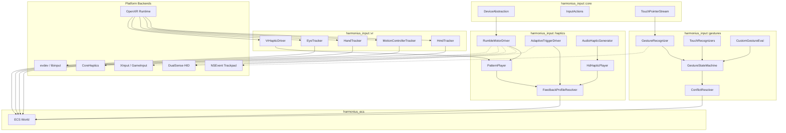
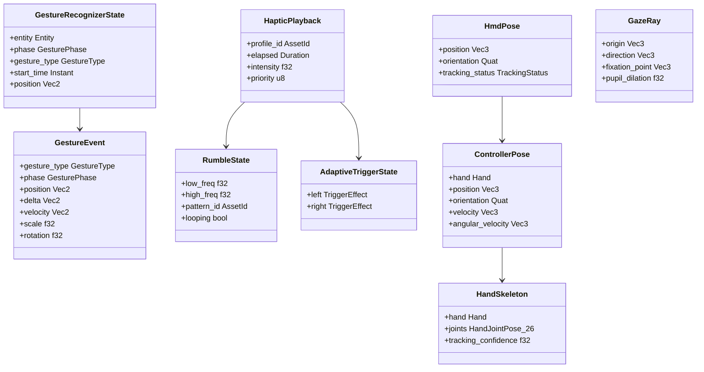
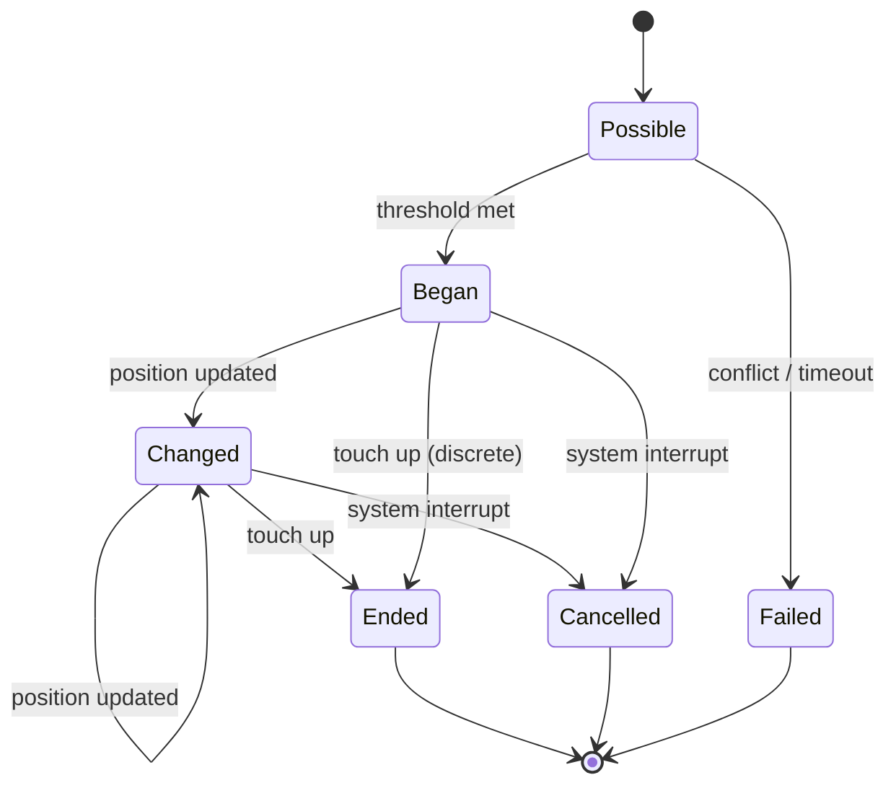
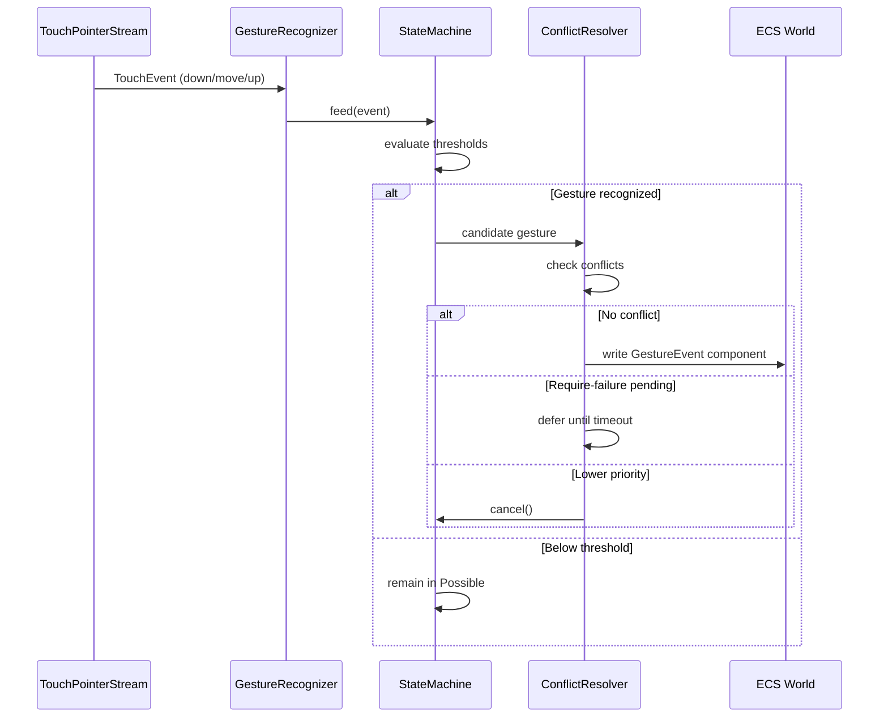
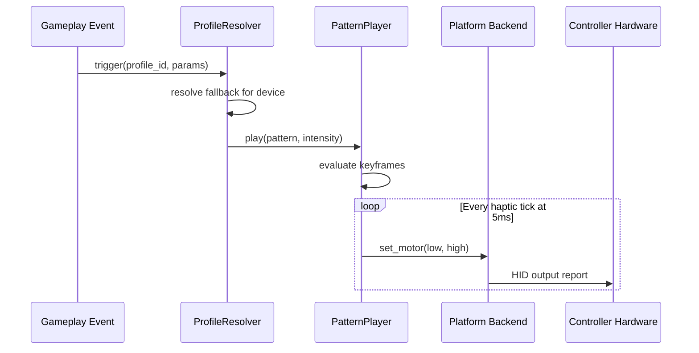
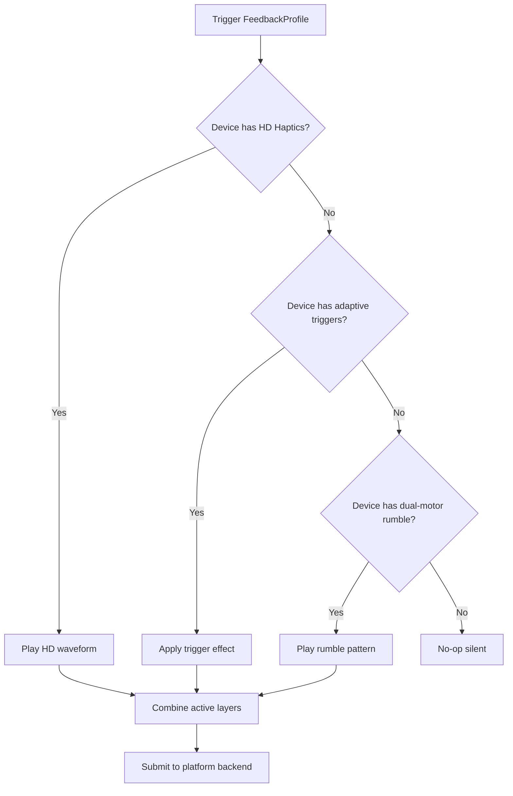
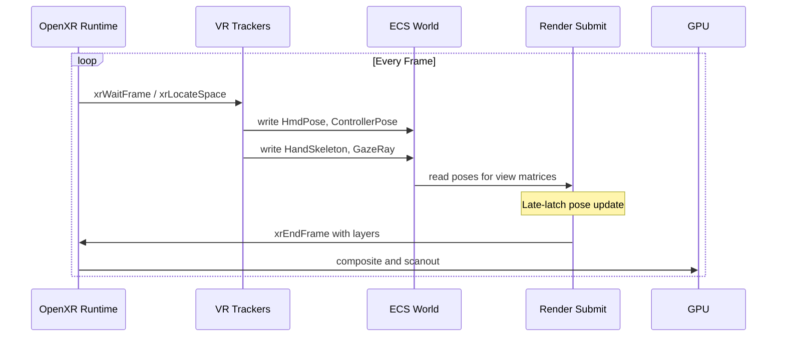
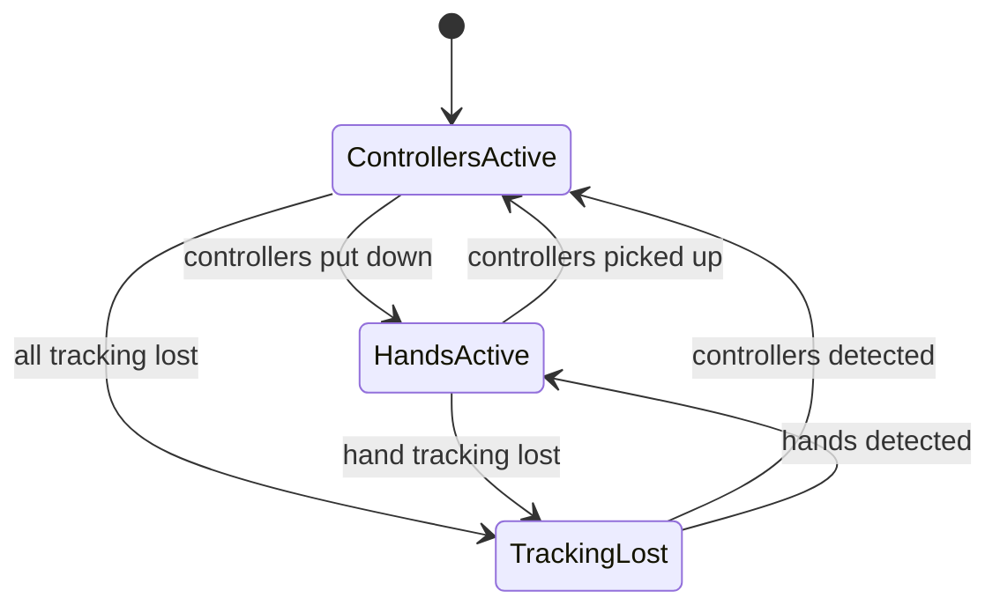

# Gestures, Haptics, and VR Input Design

## Requirements Trace

> **Canonical sources:** Features, requirements, and user stories are defined in
> [features/input/](../../features/), [requirements/input/](../../requirements/), and
> [user-stories/input/](../../user-stories/). The table below traces design elements to those
> definitions.

### Gestures (6.3)

| Feature   | Requirement |
|-----------|-------------|
| F-6.3.1   | R-6.3.1     |
| F-6.3.2   | R-6.3.2     |
| F-6.3.3   | R-6.3.3     |
| F-6.3.4   | R-6.3.4     |
| F-6.3.5   | R-6.3.5     |
| R-6.3.NF1 | -           |

1. **F-6.3.1** — Tap, multi-tap, and long press recognition
2. **F-6.3.2** — Swipe direction recognition (cardinal + diagonal)
3. **F-6.3.3** — Pinch, rotate, and pan gestures
4. **F-6.3.4** — Gesture state machines with conflict resolution
5. **F-6.3.5** — Custom gesture definition via visual editor
6. **R-6.3.NF1** — Discrete gesture latency within 1 frame; continuous within 2 frames

### Haptics (6.4)

| Feature   | Requirement |
|-----------|-------------|
| F-6.4.1   | R-6.4.1     |
| F-6.4.2   | R-6.4.2     |
| F-6.4.3   | R-6.4.3     |
| F-6.4.4   | R-6.4.4     |
| F-6.4.5   | R-6.4.5     |
| R-6.4.NF1 | -           |

1. **F-6.4.1** — Dual-motor rumble with pattern sequencing
2. **F-6.4.2** — DualSense adaptive trigger effects
3. **F-6.4.3** — High-definition haptic playback
4. **F-6.4.4** — Audio-driven haptic generation
5. **F-6.4.5** — Custom force feedback profiles with fallback
6. **R-6.4.NF1** — Haptic output latency within 5 ms of event

### VR Input (6.5)

| Feature   | Requirement |
|-----------|-------------|
| F-6.5.1   | R-6.5.1     |
| F-6.5.2   | R-6.5.2     |
| F-6.5.3   | R-6.5.3     |
| F-6.5.4   | R-6.5.4     |
| F-6.5.5   | R-6.5.5     |
| R-6.5.NF1 | -           |
| R-6.5.NF2 | -           |

1. **F-6.5.1** — 6DOF head-mounted display tracking
2. **F-6.5.2** — Motion controller input (6DOF + buttons)
3. **F-6.5.3** — Hand tracking and skeletal input (26 joints)
4. **F-6.5.4** — Eye tracking and gaze input
5. **F-6.5.5** — VR controller haptics
6. **R-6.5.NF1** — Motion-to-photon latency not exceeding 20 ms
7. **R-6.5.NF2** — Hand tracking joint updates at 30+ Hz, 5 mm accuracy

## Overview

This document covers three tightly related input subsystems: touch gesture recognition, haptic
feedback output, and VR spatial input. All three share the same ECS-based data model where every
piece of input state is a component and every processing step is a system.

**Gestures** consume raw touch pointer events from the device abstraction layer (F-6.1.4) and
produce typed `GestureEvent` components through a state-machine-based recognition pipeline with
configurable conflict resolution.

**Haptics** consume gameplay events and produce hardware output reports through a layered profile
system that degrades gracefully across controller capabilities (HD haptics, adaptive triggers,
dual-motor rumble).

**VR Input** bridges platform VR runtimes (OpenXR, OVR, PSVR2 SDK) into ECS components for head
tracking, controller tracking, hand tracking, and eye tracking. VR haptics integrate with the shared
haptic profile system.

All configuration is exposed through the visual editor. Users never write code.

## Architecture

### Module Boundaries



### File Layout

```text
harmonius_input/
├── gestures/
│   ├── recognizer.rs    # GestureRecognizer trait,
│   │                    # RecognizerSet
│   ├── state_machine.rs # GestureStateMachine,
│   │                    # GesturePhase
│   ├── conflict.rs      # ConflictResolver,
│   │                    # ResolutionStrategy
│   ├── tap.rs           # TapRecognizer,
│   │                    # LongPressRecognizer
│   ├── swipe.rs         # SwipeRecognizer
│   ├── pinch.rs         # PinchRecognizer,
│   │                    # RotateRecognizer
│   ├── pan.rs           # PanRecognizer
│   ├── custom.rs        # CustomGestureEval,
│   │                    # logic graph bridge
│   └── systems.rs       # ECS systems for
│                        # gesture processing
├── haptics/
│   ├── rumble.rs        # RumbleMotorDriver,
│   │                    # DualMotorState
│   ├── pattern.rs       # PatternPlayer,
│   │                    # RumblePattern,
│   │                    # Keyframe, Envelope
│   ├── adaptive.rs      # AdaptiveTriggerDriver,
│   │                    # TriggerEffect
│   ├── hd_haptic.rs     # HdHapticPlayer,
│   │                    # HapticWaveform
│   ├── audio_haptic.rs  # AudioHapticGenerator,
│   │                    # BandExtractor
│   ├── profile.rs       # FeedbackProfile,
│   │                    # FallbackChain
│   └── systems.rs       # ECS systems for
│                        # haptic playback
├── vr/
│   ├── hmd.rs           # HmdTracker, HmdPose,
│   │                    # PlayAreaMode
│   ├── controller.rs    # MotionControllerTracker,
│   │                    # ControllerPose
│   ├── hand.rs          # HandTracker,
│   │                    # HandSkeleton,
│   │                    # HandJointPose
│   ├── eye.rs           # EyeTracker, GazeRay,
│   │                    # FixationState
│   ├── haptic.rs        # VrHapticDriver
│   ├── openxr.rs        # OpenXR bindings
│   └── systems.rs       # ECS systems for
│                        # VR input
└── platform/
    ├── windows/
    │   ├── xinput.rs     # XInput rumble backend
    │   ├── gameinput.rs  # GameInput rumble
    │   └── dualsense.rs  # DualSense HID (USB)
    ├── macos/
    │   ├── core_haptics.rs # CoreHaptics backend
    │   ├── nsevent.rs      # NSEvent trackpad
    │   │                   # gestures
    │   └── gc_haptics.rs   # GCController haptics
    └── linux/
        ├── evdev.rs      # evdev force feedback
        └── dualsense.rs  # DualSense HID
                          # (hidraw)
```

### ECS Component Map



### Gesture State Machine Lifecycle



### Gesture Recognition Data Flow



### Haptic Feedback Pipeline



### Haptic Fallback Resolution



### VR Tracking Pipeline



### Hand Tracking Auto-Switch



## API Design

### Gesture Types and Phases

```rust
/// Phase of a gesture recognizer's lifecycle.
/// Mirrors UIKit's UIGestureRecognizer states
/// but is engine-owned for cross-platform
/// consistency.
#[derive(
    Clone, Copy, Debug, PartialEq, Eq, Hash,
    Reflect,
)]
pub enum GesturePhase {
    /// Recognizer is evaluating incoming touches.
    Possible,
    /// Gesture has been recognized and started.
    Began,
    /// Continuous gesture position has changed.
    Changed,
    /// Gesture completed successfully.
    Ended,
    /// Gesture was interrupted by the system.
    Cancelled,
    /// Gesture recognition failed (conflict or
    /// threshold not met).
    Failed,
}

/// Built-in gesture types.
#[derive(
    Clone, Copy, Debug, PartialEq, Eq, Hash,
    Reflect,
)]
pub enum GestureType {
    Tap { count: u8 },
    LongPress,
    Swipe { direction: SwipeDirection },
    Pinch,
    Rotate,
    Pan,
    /// Custom gesture defined via visual editor.
    Custom { asset_id: AssetId },
}

/// Cardinal and diagonal swipe directions.
#[derive(
    Clone, Copy, Debug, PartialEq, Eq, Hash,
    Reflect,
)]
pub enum SwipeDirection {
    Up,
    Down,
    Left,
    Right,
    UpLeft,
    UpRight,
    DownLeft,
    DownRight,
}
```

### Gesture Recognizer Trait

```rust
/// Trait for all gesture recognizers. Each
/// recognizer is a state machine that processes
/// raw touch events and emits gesture phases.
/// **Note:** The `GestureRecognizer` trait has a
/// fixed set of implementations (Tap, LongPress,
/// Swipe, Pinch, Rotate, Pan, Custom). Consider
/// migrating to `GestureRecognizerKind` enum
/// dispatch in implementation to align with the
/// static dispatch preference in constraints.md.
pub trait GestureRecognizer: Send + Sync {
    /// Feed a raw touch event into the recognizer.
    fn feed(
        &mut self,
        event: &TouchEvent,
        config: &GestureConfig,
    );

    /// Current lifecycle phase.
    fn phase(&self) -> GesturePhase;

    /// The gesture type this recognizer handles.
    fn gesture_type(&self) -> GestureType;

    /// Reset to the Possible state for re-use.
    fn reset(&mut self);

    /// Build the output event if the gesture has
    /// been recognized (phase is Began, Changed,
    /// or Ended).
    fn build_event(&self) -> Option<GestureEvent>;
}
```

### Gesture Configuration (No-Code)

```rust
/// Per-recognizer thresholds. All values are
/// authored in the visual editor and serialized
/// as data assets. Users never write code.
#[derive(Clone, Debug, Reflect)]
pub struct GestureConfig {
    /// Maximum pixel distance between touch-down
    /// and touch-up for a tap. Scaled by DPI.
    pub tap_distance_threshold: f32,
    /// Maximum interval in seconds between
    /// consecutive taps for multi-tap.
    pub multi_tap_interval: f32,
    /// Duration in seconds before long press
    /// triggers.
    pub long_press_duration: f32,
    /// Minimum pixel distance to recognize a
    /// swipe. Scaled by DPI.
    pub swipe_distance_threshold: f32,
    /// Minimum velocity (px/sec) for swipe
    /// recognition.
    pub swipe_velocity_threshold: f32,
    /// Minimum scale delta for pinch recognition.
    pub pinch_scale_threshold: f32,
    /// Minimum angle delta (radians) for rotation
    /// recognition.
    pub rotation_angle_threshold: f32,
    /// DPI of the current display. Used to scale
    /// distance thresholds automatically.
    pub display_dpi: f32,
    /// Reference DPI. Distance thresholds are
    /// authored at this DPI and scaled
    /// proportionally.
    pub reference_dpi: f32,
}

impl GestureConfig {
    /// Scale a pixel distance threshold by the
    /// current display DPI relative to the
    /// reference DPI.
    pub fn dpi_scaled(&self, px: f32) -> f32 {
        px * (self.display_dpi / self.reference_dpi)
    }
}
```

### Conflict Resolution

```rust
/// Strategy for resolving ambiguity between two
/// gesture recognizers that both match the same
/// touch input.
#[derive(
    Clone, Copy, Debug, PartialEq, Eq, Reflect,
)]
pub enum ResolutionStrategy {
    /// The dependent recognizer waits for the
    /// other to fail before it can succeed.
    /// Example: tap waits for double-tap timeout.
    RequireFailure,
    /// Both recognizers may succeed simultaneously.
    /// Example: pinch and pan together.
    Simultaneous,
    /// The recognizer with higher priority wins.
    /// The lower-priority recognizer is cancelled.
    Priority,
}

/// A rule pairing two recognizers with a
/// resolution strategy. Authored in the editor.
#[derive(Clone, Debug, Reflect)]
pub struct ConflictRule {
    pub recognizer_a: GestureType,
    pub recognizer_b: GestureType,
    pub strategy: ResolutionStrategy,
    /// For Priority strategy: which recognizer
    /// wins (true = A wins, false = B wins).
    pub a_has_priority: bool,
}

/// Evaluates conflict rules against active
/// recognizer candidates and decides which
/// gestures to emit, defer, or cancel.
pub struct ConflictResolver {
    rules: Vec<ConflictRule>,
}

impl ConflictResolver {
    pub fn new(rules: Vec<ConflictRule>) -> Self;

    /// Given a set of candidate gestures from
    /// active recognizers, resolve conflicts and
    /// return the gestures that should be emitted.
    pub fn resolve(
        &self,
        candidates: &[GestureCandidate],
    ) -> Vec<ResolvedGesture>;
}

pub struct GestureCandidate {
    pub recognizer_idx: usize,
    pub gesture_type: GestureType,
    pub phase: GesturePhase,
    pub event: GestureEvent,
}

pub enum ResolvedGesture {
    /// Emit this gesture event now.
    Emit(GestureEvent),
    /// Defer until the specified recognizer fails.
    Defer {
        event: GestureEvent,
        waiting_on: GestureType,
    },
    /// Cancel this recognizer.
    Cancel(GestureType),
}
```

### Tap, Long Press, and Swipe Recognizers

```rust
/// Recognizes single-tap, double-tap, and
/// triple-tap gestures with DPI-scaled distance
/// threshold and configurable inter-tap interval.
pub struct TapRecognizer {
    tap_count: u8,
    target_count: u8,
    phase: GesturePhase,
    first_down_pos: Vec2,
    first_down_time: Instant,
    last_up_time: Option<Instant>,
}

impl TapRecognizer {
    pub fn single() -> Self;
    pub fn double() -> Self;
    pub fn triple() -> Self;
}

/// Recognizes sustained touch past a duration
/// threshold. Triggers haptic feedback on
/// recognition (F-6.4.1 integration).
pub struct LongPressRecognizer {
    phase: GesturePhase,
    down_pos: Vec2,
    down_time: Instant,
}

/// Recognizes linear swipe in 8 directions with
/// velocity and distance reporting.
pub struct SwipeRecognizer {
    phase: GesturePhase,
    down_pos: Vec2,
    down_time: Instant,
    current_pos: Vec2,
    peak_velocity: f32,
}

impl SwipeRecognizer {
    /// Classify the swipe direction from the
    /// displacement vector using 45-degree sector
    /// boundaries.
    fn classify_direction(
        delta: Vec2,
    ) -> SwipeDirection;
}
```

### Pinch, Rotate, and Pan Recognizers

```rust
/// Tracks two-finger pinch with scale factor
/// relative to initial finger distance.
pub struct PinchRecognizer {
    phase: GesturePhase,
    initial_distance: f32,
    current_scale: f32,
    finger_a: Option<TouchId>,
    finger_b: Option<TouchId>,
}

/// Tracks two-finger rotation with angle delta
/// in radians.
pub struct RotateRecognizer {
    phase: GesturePhase,
    initial_angle: f32,
    current_angle: f32,
    finger_a: Option<TouchId>,
    finger_b: Option<TouchId>,
}

/// Tracks single or multi-finger pan with
/// position delta and velocity.
pub struct PanRecognizer {
    phase: GesturePhase,
    start_pos: Vec2,
    current_pos: Vec2,
    velocity: Vec2,
    finger_count: u8,
}
```

### Custom Gesture Evaluation

```rust
/// Evaluates custom gesture definitions authored
/// in the visual gesture editor. Definitions are
/// loaded as data assets and evaluated at runtime
/// through the logic graph system (F-15.8.4).
pub struct CustomGestureEvaluator {
    /// Logic graph asset driving recognition.
    graph_asset: AssetId,
    phase: GesturePhase,
    /// Accumulated touch trail for shape matching.
    trail: Vec<Vec2>,
}

impl CustomGestureEvaluator {
    pub fn new(graph_asset: AssetId) -> Self;

    /// Feed a touch event and run one step of the
    /// logic graph evaluation.
    pub fn feed(
        &mut self,
        event: &TouchEvent,
        graph_runtime: &LogicGraphRuntime,
    );

    /// Check if the logic graph produced a
    /// recognition result.
    pub fn is_recognized(&self) -> bool;
}
```

### Gesture Event Component

```rust
/// ECS component written by the gesture system
/// when a gesture is recognized. Consumed by
/// gameplay systems and the input action layer.
#[derive(Clone, Debug, Reflect)]
pub struct GestureEvent {
    pub gesture_type: GestureType,
    pub phase: GesturePhase,
    /// Screen position of the gesture centroid.
    pub position: Vec2,
    /// Positional delta since last Changed phase.
    pub delta: Vec2,
    /// Current velocity in pixels per second.
    pub velocity: Vec2,
    /// Scale factor for pinch (1.0 = no change).
    pub scale: f32,
    /// Rotation angle delta in radians for rotate.
    pub rotation: f32,
    /// Number of fingers involved.
    pub touch_count: u8,
    /// Timestamp of the event.
    pub timestamp: Instant,
}
```

### Haptic Motor Abstraction

```rust
/// Normalized dual-motor rumble state.
/// Intensity values are 0.0 to 1.0 across
/// all backends.
#[derive(Clone, Copy, Debug, Default, Reflect)]
pub struct DualMotorState {
    /// Low-frequency (heavy) motor intensity.
    pub low_freq: f32,
    /// High-frequency (light) motor intensity.
    pub high_freq: f32,
}

/// Rumble pattern keyframe.
#[derive(Clone, Copy, Debug, Reflect)]
pub struct RumbleKeyframe {
    /// Time offset from pattern start in seconds.
    pub time: f32,
    /// Motor state at this keyframe.
    pub state: DualMotorState,
}

/// Envelope shape for a rumble pattern.
#[derive(Clone, Copy, Debug, Reflect)]
pub struct RumbleEnvelope {
    /// Attack ramp-up duration in seconds.
    pub attack: f32,
    /// Sustain duration in seconds.
    pub sustain: f32,
    /// Decay ramp-down duration in seconds.
    pub decay: f32,
}

/// A reusable rumble pattern asset authored in
/// the visual editor.
#[derive(Clone, Debug, Reflect)]
pub struct RumblePattern {
    pub keyframes: Vec<RumbleKeyframe>,
    pub envelope: RumbleEnvelope,
    pub looping: bool,
    /// Priority for interruption. Higher values
    /// interrupt lower values.
    pub priority: u8,
    /// Total duration in seconds.
    pub duration: f32,
}
```

### Pattern Player

```rust
/// Evaluates rumble patterns over time and
/// outputs motor state per haptic tick.
pub struct PatternPlayer {
    active_patterns: Vec<ActivePattern>,
}

struct ActivePattern {
    pattern: RumblePattern,
    elapsed: f32,
    intensity_scale: f32,
    priority: u8,
}

impl PatternPlayer {
    pub fn new() -> Self;

    /// Start playing a rumble pattern. If a
    /// higher-priority pattern is already active,
    /// this one is queued. If this one has higher
    /// priority, it interrupts the current.
    pub fn play(
        &mut self,
        pattern: &RumblePattern,
        intensity: f32,
    );

    /// Advance all active patterns by dt seconds
    /// and return the blended motor output.
    pub fn tick(
        &mut self,
        dt: f32,
    ) -> DualMotorState;

    /// Stop all active patterns.
    pub fn stop_all(&mut self);
}
```

### Adaptive Trigger Effects (DualSense)

```rust
/// DualSense adaptive trigger effect modes.
#[derive(
    Clone, Copy, Debug, PartialEq, Eq, Reflect,
)]
pub enum TriggerEffectMode {
    /// Progressive resistance (bow draw, brake).
    Resistance,
    /// Vibration through the trigger (recoil).
    Vibration,
    /// Discrete resistance notches (gear shift).
    SectionedResistance,
    /// No effect (clear current effect).
    Off,
}

/// Adaptive trigger effect parameters.
#[derive(Clone, Copy, Debug, Reflect)]
pub struct TriggerEffect {
    pub mode: TriggerEffectMode,
    /// Trigger pull position where effect starts
    /// (0.0 = fully released, 1.0 = fully pulled).
    pub start_position: f32,
    /// Trigger pull position where effect ends.
    pub end_position: f32,
    /// Effect strength (0.0 to 1.0).
    pub strength: f32,
    /// For Vibration mode: frequency in Hz.
    pub frequency: f32,
    /// For SectionedResistance: number of notches.
    pub section_count: u8,
}

/// Driver for DualSense adaptive triggers.
/// Gracefully degrades to no-op on controllers
/// that lack adaptive trigger support.
pub struct AdaptiveTriggerDriver;

impl AdaptiveTriggerDriver {
    /// Apply an effect to the specified trigger.
    /// Returns Ok(()) on DualSense, silently
    /// returns Ok(()) on unsupported hardware.
    pub fn apply(
        &self,
        device: &InputDevice,
        trigger: Trigger,
        effect: &TriggerEffect,
    ) -> Result<(), HapticError>;
}

#[derive(
    Clone, Copy, Debug, PartialEq, Eq,
)]
pub enum Trigger {
    Left,
    Right,
}
```

### HD Haptic Waveforms

```rust
/// Common waveform format for high-definition
/// haptics. Platform backends convert this to
/// device-specific formats:
/// - Switch: frequency/amplitude pairs at 5ms
/// - DualSense: raw waveform for voice-coil
#[derive(Clone, Debug, Reflect)]
pub struct HapticWaveform {
    /// Frequency in Hz for each sample.
    pub frequencies: Vec<f32>,
    /// Amplitude (0.0 to 1.0) for each sample.
    pub amplitudes: Vec<f32>,
    /// Sample interval in seconds (e.g. 0.005
    /// for 5ms).
    pub sample_interval: f32,
    /// Total duration in seconds.
    pub duration: f32,
}

/// Plays HD haptic waveforms on controllers
/// with HD haptic support. Falls back to
/// dual-motor approximation on legacy hardware.
pub struct HdHapticPlayer;

impl HdHapticPlayer {
    pub fn play(
        &self,
        device: &InputDevice,
        waveform: &HapticWaveform,
    ) -> Result<(), HapticError>;

    pub fn stop(
        &self,
        device: &InputDevice,
    ) -> Result<(), HapticError>;
}
```

### Audio-Driven Haptic Generation

```rust
/// Generates haptic waveforms from audio signals
/// by extracting low-frequency bands (20-250 Hz).
pub struct AudioHapticGenerator {
    /// Low-pass filter cutoff in Hz.
    pub low_cutoff: f32,
    /// High-pass filter cutoff in Hz.
    pub high_cutoff: f32,
    /// Output sample rate matching waveform format.
    pub sample_rate: f32,
}

impl AudioHapticGenerator {
    pub fn new(
        low_cutoff: f32,
        high_cutoff: f32,
    ) -> Self;

    /// Extract a haptic waveform from an audio
    /// buffer. Applies band-pass filter
    /// (20-250 Hz) and amplitude envelope
    /// extraction. Audio-haptic latency must
    /// stay under 10ms.
    pub fn generate(
        &self,
        audio_buffer: &[f32],
        audio_sample_rate: u32,
    ) -> HapticWaveform;
}
```

### Force Feedback Profiles

```rust
/// Named, data-driven haptic profile combining
/// rumble, adaptive triggers, and HD haptics.
/// Authored as a single reusable asset in the
/// visual editor.
#[derive(Clone, Debug, Reflect)]
pub struct FeedbackProfile {
    pub name: String,
    /// Rumble layer (available on all controllers).
    pub rumble: Option<RumblePattern>,
    /// Adaptive trigger layer (DualSense only).
    pub adaptive_trigger: Option<TriggerEffect>,
    /// HD haptic layer (Switch, DualSense).
    pub hd_waveform: Option<HapticWaveform>,
    /// Fallback ordering. Profiles degrade
    /// gracefully: HD haptics -> adaptive triggers
    /// -> dual-motor rumble -> no-op.
    pub fallback_chain: FallbackChain,
    /// Parameter bindings (e.g. "impact_force"
    /// scales rumble intensity).
    pub parameters: Vec<ParameterBinding>,
}

/// Defines how a profile degrades per controller
/// capability.
#[derive(Clone, Debug, Reflect)]
pub struct FallbackChain {
    /// Ordered list from highest fidelity to
    /// lowest. Each entry is a layer that the
    /// profile attempts to play.
    pub layers: Vec<HapticLayer>,
}

#[derive(
    Clone, Copy, Debug, PartialEq, Eq, Reflect,
)]
pub enum HapticLayer {
    HdHaptic,
    AdaptiveTrigger,
    DualMotorRumble,
}

/// Binds a gameplay parameter (e.g. impact
/// force) to a haptic intensity multiplier.
#[derive(Clone, Debug, Reflect)]
pub struct ParameterBinding {
    pub parameter_name: String,
    /// Which layer this binding applies to.
    pub target_layer: HapticLayer,
    /// Minimum parameter value (maps to 0.0
    /// intensity).
    pub min_value: f32,
    /// Maximum parameter value (maps to 1.0
    /// intensity).
    pub max_value: f32,
}

/// Resolves which layers of a FeedbackProfile
/// to play based on the connected device's
/// capabilities.
pub struct FeedbackProfileResolver;

impl FeedbackProfileResolver {
    /// Trigger a profile on a specific device.
    /// Resolves fallback chain, applies parameter
    /// bindings, and dispatches to the appropriate
    /// haptic player.
    pub fn trigger(
        &self,
        device: &InputDevice,
        profile: &FeedbackProfile,
        params: &[(String, f32)],
    ) -> Result<(), HapticError>;

    /// Validate at build time that every profile
    /// has a valid fallback for each controller
    /// class.
    pub fn validate_fallbacks(
        profile: &FeedbackProfile,
        controller_classes: &[ControllerClass],
    ) -> Vec<FallbackValidationError>;
}

#[derive(
    Clone, Copy, Debug, PartialEq, Eq,
)]
pub enum ControllerClass {
    Xbox,
    DualSense,
    SwitchPro,
    GenericRumble,
    VrController,
}
```

### VR Head Tracking

```rust
/// 6DOF head-mounted display pose. Written to
/// ECS each frame by the HMD tracking system.
#[derive(Clone, Copy, Debug, Reflect)]
pub struct HmdPose {
    pub position: Vec3,
    pub orientation: Quat,
    pub linear_velocity: Vec3,
    pub angular_velocity: Vec3,
    pub tracking_status: TrackingStatus,
    /// Timestamp from the VR runtime.
    pub timestamp: Instant,
}

#[derive(
    Clone, Copy, Debug, PartialEq, Eq, Reflect,
)]
pub enum TrackingStatus {
    /// Full 6DOF tracking.
    Tracked,
    /// Tracking was lost. Last known pose is held.
    Lost,
    /// Tracking is initializing.
    Initializing,
}

/// Play area configuration.
#[derive(
    Clone, Copy, Debug, PartialEq, Eq, Reflect,
)]
pub enum PlayAreaMode {
    RoomScale,
    Standing,
    Seated,
}

/// Guardian / chaperone boundary configuration.
#[derive(Clone, Debug, Reflect)]
pub struct GuardianConfig {
    pub mode: PlayAreaMode,
    /// Boundary vertices in floor-plane
    /// coordinates (meters).
    pub boundary_vertices: Vec<Vec2>,
}

/// Response when tracking is lost.
#[derive(
    Clone, Copy, Debug, PartialEq, Eq, Reflect,
)]
pub enum TrackingLossResponse {
    /// Freeze the game simulation.
    FreezeGame,
    /// Show a warning overlay but continue.
    WarningOverlay,
    /// Do nothing (game handles it).
    None,
}

/// Head tracking system bridging the VR runtime
/// into ECS components.
pub struct HmdTracker {
    play_area: PlayAreaMode,
    loss_response: TrackingLossResponse,
}

impl HmdTracker {
    pub fn new(
        play_area: PlayAreaMode,
        loss_response: TrackingLossResponse,
    ) -> Self;

    /// Poll the VR runtime for the latest head
    /// pose and write it to the ECS world.
    /// Called once per frame before render
    /// submission.
    pub fn update(
        &self,
        runtime: &VrRuntime,
    ) -> HmdPose;

    /// Fetch late-latched pose as close to
    /// scanout as possible.
    pub fn late_latch(
        &self,
        runtime: &VrRuntime,
    ) -> HmdPose;
}
```

### VR Motion Controller Tracking

```rust
/// 6DOF motion controller pose with buttons,
/// triggers, and analog axes. Written to ECS
/// each frame per-hand.
#[derive(Clone, Copy, Debug, Reflect)]
pub struct ControllerPose {
    pub hand: Hand,
    pub position: Vec3,
    pub orientation: Quat,
    pub velocity: Vec3,
    pub angular_velocity: Vec3,
    pub tracking_status: TrackingStatus,
}

#[derive(
    Clone, Copy, Debug, PartialEq, Eq, Reflect,
)]
pub enum Hand {
    Left,
    Right,
}

/// Per-controller input state beyond pose.
#[derive(Clone, Copy, Debug, Reflect)]
pub struct VrControllerState {
    pub hand: Hand,
    /// Trigger pull amount (0.0 to 1.0).
    pub trigger: f32,
    /// Grip pull amount (0.0 to 1.0).
    pub grip: f32,
    /// Thumbstick X/Y (-1.0 to 1.0).
    pub thumbstick: Vec2,
    /// Button bitmask.
    pub buttons: VrButtons,
    /// Capacitive touch bitmask (where supported).
    pub capacitive_touch: VrButtons,
}

bitflags::bitflags! {
    #[derive(Clone, Copy, Debug, Reflect)]
    pub struct VrButtons: u32 {
        const TRIGGER   = 1 << 0;
        const GRIP      = 1 << 1;
        const PRIMARY   = 1 << 2; // A / X
        const SECONDARY = 1 << 3; // B / Y
        const THUMBSTICK_CLICK = 1 << 4;
        const MENU      = 1 << 5;
        const SYSTEM    = 1 << 6;
    }
}
```

### VR Hand Tracking

```rust
/// Full 26-joint skeletal hand model. Written
/// to ECS each frame when hand tracking is
/// active.
#[derive(Clone, Debug, Reflect)]
pub struct HandSkeleton {
    pub hand: Hand,
    pub joints: [HandJointPose; 26],
    /// Overall tracking confidence (0.0 to 1.0).
    pub tracking_confidence: f32,
}

/// Individual joint pose with position,
/// orientation, and radius.
#[derive(Clone, Copy, Debug, Reflect)]
pub struct HandJointPose {
    pub position: Vec3,
    pub orientation: Quat,
    /// Joint sphere radius in meters.
    pub radius: f32,
}

/// Well-known joint indices matching the OpenXR
/// XR_HAND_JOINT_EXT enumeration.
#[derive(
    Clone, Copy, Debug, PartialEq, Eq, Reflect,
)]
#[repr(u8)]
pub enum HandJoint {
    Palm = 0,
    Wrist = 1,
    ThumbMetacarpal = 2,
    ThumbProximal = 3,
    ThumbDistal = 4,
    ThumbTip = 5,
    IndexMetacarpal = 6,
    IndexProximal = 7,
    IndexIntermediate = 8,
    IndexDistal = 9,
    IndexTip = 10,
    MiddleMetacarpal = 11,
    MiddleProximal = 12,
    MiddleIntermediate = 13,
    MiddleDistal = 14,
    MiddleTip = 15,
    RingMetacarpal = 16,
    RingProximal = 17,
    RingIntermediate = 18,
    RingDistal = 19,
    RingTip = 20,
    LittleMetacarpal = 21,
    LittleProximal = 22,
    LittleIntermediate = 23,
    LittleDistal = 24,
    LittleTip = 25,
}

/// Predefined VR hand gestures detected from
/// skeletal joint angles and distances.
#[derive(
    Clone, Copy, Debug, PartialEq, Eq, Reflect,
)]
pub enum VrHandGesture {
    /// Thumb and index finger touching.
    Pinch,
    /// All fingers curled around an object.
    Grab,
    /// Index finger extended, others curled.
    Point,
    /// Thumb extended, others curled.
    ThumbsUp,
    /// All fingers extended flat.
    OpenPalm,
    /// Custom gesture authored in logic graph.
    Custom { asset_id: AssetId },
}

/// System that detects predefined and custom
/// hand gestures from skeletal joint data.
pub struct HandGestureDetector {
    /// Joint angle thresholds for predefined
    /// gestures. Configurable in the editor.
    thresholds: HandGestureThresholds,
}

impl HandGestureDetector {
    pub fn new(
        thresholds: HandGestureThresholds,
    ) -> Self;

    /// Evaluate the current hand skeleton and
    /// return any detected gestures.
    pub fn detect(
        &self,
        skeleton: &HandSkeleton,
    ) -> Vec<VrHandGesture>;
}

/// Configurable thresholds for predefined
/// gesture recognition.
#[derive(Clone, Debug, Reflect)]
pub struct HandGestureThresholds {
    /// Maximum distance between thumb tip and
    /// index tip for pinch (meters).
    pub pinch_distance: f32,
    /// Maximum curl angle (radians) for finger
    /// to be considered "curled" (grab).
    pub curl_angle: f32,
    /// Minimum extension angle (radians) for
    /// finger to be considered "extended"
    /// (point, open palm).
    pub extension_angle: f32,
}

/// Manages automatic switching between
/// controller tracking and hand tracking
/// based on whether controllers are held.
pub struct HandControllerSwitch {
    current_mode: VrInputMode,
}

#[derive(
    Clone, Copy, Debug, PartialEq, Eq,
)]
pub enum VrInputMode {
    Controllers,
    Hands,
    TrackingLost,
}

impl HandControllerSwitch {
    pub fn new() -> Self;

    /// Update the input mode based on current
    /// tracking state. Called each frame.
    pub fn update(
        &mut self,
        controllers_tracked: bool,
        hands_tracked: bool,
    ) -> VrInputMode;
}
```

### Eye Tracking and Gaze

```rust
/// Eye tracking gaze data. Written to ECS each
/// frame when eye tracking is active.
#[derive(Clone, Copy, Debug, Reflect)]
pub struct GazeRay {
    /// Gaze origin in world space.
    pub origin: Vec3,
    /// Gaze direction (unit vector).
    pub direction: Vec3,
    /// Estimated fixation point in world space.
    pub fixation_point: Vec3,
    /// Pupil dilation (relative, 0.0 to 1.0).
    pub pupil_dilation: f32,
    /// Eye openness per eye (0.0 closed, 1.0
    /// fully open).
    pub left_openness: f32,
    pub right_openness: f32,
}

/// Gaze behavior classification.
#[derive(
    Clone, Copy, Debug, PartialEq, Eq, Reflect,
)]
pub enum GazeBehavior {
    /// Eye is fixating on a point.
    Fixation,
    /// Rapid eye movement between fixation points.
    Saccade,
    /// Smooth pursuit tracking a moving target.
    Pursuit,
    /// Unknown or transitional.
    Unknown,
}

/// Classifies gaze behavior from raw gaze
/// data using velocity and duration thresholds.
pub struct GazeBehaviorClassifier {
    /// Minimum fixation duration in seconds.
    pub fixation_min_duration: f32,
    /// Maximum angular velocity (deg/sec) for
    /// fixation classification.
    pub fixation_max_velocity: f32,
    /// Minimum angular velocity (deg/sec) for
    /// saccade classification.
    pub saccade_min_velocity: f32,
}

impl GazeBehaviorClassifier {
    pub fn new(
        fixation_min_duration: f32,
        fixation_max_velocity: f32,
        saccade_min_velocity: f32,
    ) -> Self;

    /// Classify the current gaze behavior.
    pub fn classify(
        &self,
        current: &GazeRay,
        previous: &GazeRay,
        dt: f32,
    ) -> GazeBehavior;
}
```

### VR Controller Haptics

```rust
/// Per-hand VR controller haptic parameters.
#[derive(Clone, Copy, Debug, Reflect)]
pub struct VrHapticParams {
    /// Vibration amplitude (0.0 to 1.0).
    pub amplitude: f32,
    /// Vibration frequency in Hz.
    pub frequency: f32,
    /// Duration in seconds. 0 = single impulse.
    pub duration: f32,
}

/// Drives per-hand haptic feedback on VR
/// controllers via OpenXR or platform SDK.
pub struct VrHapticDriver;

impl VrHapticDriver {
    /// Play a haptic impulse on the specified
    /// hand's controller.
    pub fn impulse(
        &self,
        hand: Hand,
        params: &VrHapticParams,
    ) -> Result<(), HapticError>;

    /// Play a continuous haptic pattern from a
    /// rumble pattern asset.
    pub fn play_pattern(
        &self,
        hand: Hand,
        pattern: &RumblePattern,
        intensity: f32,
    ) -> Result<(), HapticError>;

    /// Play spatially-driven haptics where
    /// intensity scales with proximity to a
    /// world position.
    pub fn spatial(
        &self,
        hand: Hand,
        controller_pos: Vec3,
        target_pos: Vec3,
        max_distance: f32,
        base_params: &VrHapticParams,
    ) -> Result<(), HapticError>;

    /// Stop all haptics on the specified hand.
    pub fn stop(
        &self,
        hand: Hand,
    ) -> Result<(), HapticError>;
}
```

### VR Runtime Abstraction

```rust
/// Platform-abstracted VR runtime. Selects
/// OpenXR, OVR, or PSVR2 SDK based on
/// `cfg` attributes.
pub struct VrRuntime { /* ... */ }

impl VrRuntime {
    /// Initialize the VR runtime and request
    /// the specified extensions.
    pub fn new(
        config: &VrConfig,
    ) -> Result<Self, VrError>;

    /// Begin a new frame. Must be called before
    /// any pose queries.
    pub fn begin_frame(
        &self,
    ) -> Result<FrameState, VrError>;

    /// End the frame and submit rendered layers.
    pub fn end_frame(
        &self,
        layers: &[CompositionLayer],
    ) -> Result<(), VrError>;

    /// Query the latest HMD pose.
    pub fn locate_hmd(&self) -> HmdPose;

    /// Query the pose for a specific controller.
    pub fn locate_controller(
        &self,
        hand: Hand,
    ) -> ControllerPose;

    /// Query hand skeleton data.
    pub fn get_hand_skeleton(
        &self,
        hand: Hand,
    ) -> Option<HandSkeleton>;

    /// Query eye gaze data.
    pub fn get_gaze(&self) -> Option<GazeRay>;

    /// Submit a haptic impulse via the VR runtime.
    pub fn haptic_impulse(
        &self,
        hand: Hand,
        params: &VrHapticParams,
    ) -> Result<(), VrError>;
}

/// VR session configuration.
#[derive(Clone, Debug, Reflect)]
pub struct VrConfig {
    pub play_area: PlayAreaMode,
    pub tracking_loss_response:
        TrackingLossResponse,
    /// Request hand tracking extension.
    pub enable_hand_tracking: bool,
    /// Request eye tracking extension.
    pub enable_eye_tracking: bool,
    /// Target refresh rate in Hz (90, 120).
    pub target_refresh_rate: u32,
}
```

### Error Types

```rust
#[derive(Clone, Debug)]
pub enum HapticError {
    /// Device does not support this haptic type.
    Unsupported,
    /// Device is disconnected.
    DeviceDisconnected,
    /// HID communication error.
    HidError { code: i32 },
}

#[derive(Clone, Debug)]
pub enum VrError {
    /// VR runtime not available.
    RuntimeUnavailable,
    /// Required extension not supported.
    ExtensionUnsupported { name: String },
    /// Session creation failed.
    SessionFailed { code: i32 },
    /// Frame timing error.
    FrameError,
    /// Tracking is not available.
    TrackingUnavailable,
}
```

### ECS Systems

```rust
/// Gesture recognition system. Runs each frame
/// after touch input is collected.
pub fn gesture_recognition_system(
    touch_events: Query<&TouchEvent>,
    mut recognizers: ResMut<RecognizerSet>,
    config: Res<GestureConfig>,
    resolver: Res<ConflictResolver>,
    mut gestures: EventWriter<GestureEvent>,
) {
    for event in touch_events.iter() {
        recognizers.feed_all(event, &config);
    }
    let candidates = recognizers.collect_candidates();
    let resolved = resolver.resolve(&candidates);
    for gesture in resolved {
        if let ResolvedGesture::Emit(event) = gesture {
            gestures.send(event);
        }
    }
}

/// Haptic playback system. Runs each frame to
/// advance active patterns and submit motor
/// output to hardware.
pub fn haptic_playback_system(
    mut player: ResMut<PatternPlayer>,
    devices: Query<&InputDevice>,
    time: Res<Time>,
) {
    let dt = time.delta_seconds();
    let state = player.tick(dt);
    for device in devices.iter() {
        // Submit motor state to platform backend
        device.set_rumble(state);
    }
}

/// VR tracking system. Runs each frame to poll
/// the VR runtime and write pose components.
pub fn vr_tracking_system(
    runtime: Res<VrRuntime>,
    mut hmd: ResMut<HmdPose>,
    mut controllers: Query<&mut ControllerPose>,
    mut hands: Query<&mut HandSkeleton>,
    mut gaze: ResMut<Option<GazeRay>>,
    switcher: ResMut<HandControllerSwitch>,
) {
    *hmd = runtime.locate_hmd();
    for hand in [Hand::Left, Hand::Right] {
        // Update controller or hand tracking
        // based on auto-switch mode
    }
    *gaze = runtime.get_gaze();
}
```

## Data Flow

### Gesture Processing Per Frame

1. The touch pointer stream (F-6.1.4) writes raw `TouchEvent` components.
2. `gesture_recognition_system` feeds each event into all active recognizers.
3. Each recognizer evaluates its state machine against the configured thresholds (DPI-scaled).
4. Recognizers that reach `Began`, `Changed`, or `Ended` emit candidates.
5. The `ConflictResolver` evaluates candidates against authored conflict rules.
6. Resolved gestures are written as `GestureEvent` components to the ECS world.
7. Gameplay systems and the input action layer consume `GestureEvent` components.

### Haptic Output Per Frame

1. A gameplay event triggers a `FeedbackProfile`.
2. The `FeedbackProfileResolver` queries the device's `ControllerClass` capabilities.
3. The resolver walks the fallback chain, selecting the highest-fidelity layer supported.
4. Parameter bindings scale intensity from gameplay values.
5. The selected layer dispatches to the appropriate player (`PatternPlayer`,
   `AdaptiveTriggerDriver`, or `HdHapticPlayer`).
6. The player evaluates keyframes at 5 ms intervals and submits HID output reports.

### VR Pose Acquisition Per Frame

1. `VrRuntime::begin_frame()` synchronizes with the VR compositor.
2. `vr_tracking_system` queries poses via `xrLocateSpace` (OpenXR).
3. `HmdPose`, `ControllerPose`, `HandSkeleton`, and `GazeRay` components are written to the ECS
   world.
4. The hand/controller auto-switch updates `VrInputMode`.
5. Gameplay and rendering systems consume pose components.
6. At render submission time, `HmdTracker::late_latch()` fetches the most recent pose for minimum
   motion-to-photon latency.
7. `VrRuntime::end_frame()` submits composition layers.

### Audio-Driven Haptic Pipeline

1. The audio system provides per-channel or final mix output buffers.
2. `AudioHapticGenerator` applies a band-pass filter (20-250 Hz) to extract the haptic-perceptible
   frequency range.
3. Amplitude envelope extraction produces a `HapticWaveform`.
4. The waveform is submitted to `HdHapticPlayer` or converted to dual-motor approximation.
5. Audio-to-haptic latency is maintained under 10 ms by processing in the same frame as the audio
   mix.

## Platform Considerations

### Gesture Platform APIs

| Platform | Touch API             | Trackpad Gestures                 |
|----------|-----------------------|-----------------------------------|
| Windows  | `WM_POINTER`          | N/A                               |
| macOS    | `NSTouch` / `NSEvent` | `NSEvent` magnification, rotation |
| Linux    | `libinput` multitouch | N/A                               |
| iOS      | `UITouch`             | N/A                               |
| Android  | `MotionEvent`         | N/A                               |

1. **Windows** — Touch and pen via pointer messages
2. **macOS** — Trackpad gestures use native NSEvent types
3. **Linux** — Touch slots via `libinput_event_touch`
4. **iOS** — Primary mobile touch target
5. **Android** — Primary mobile touch target

### Haptic Platform APIs

| Platform |
|----------|
| Windows  |
| Windows  |
| macOS    |
| Linux    |
| Switch   |
| PS5      |

1. **Windows** — XInput `XInputSetState`
   - **Adaptive Triggers:** DualSense HID (USB)
   - **Notes:** GameInput for newer controllers
2. **Windows** — GameInput
   - **Adaptive Triggers:** DualSense HID (USB)
   - **Notes:** Windows.Gaming.Input alternative
3. **macOS** — `GCController` haptics
   - **HD Haptics:** CoreHaptics `CHHapticEngine`
   - **Adaptive Triggers:** DualSense HID (Bluetooth)
   - **Notes:** CoreHaptics for custom waveforms
4. **Linux** — `evdev` `FF_RUMBLE`
   - **Adaptive Triggers:** DualSense HID (`hidraw`)
   - **Notes:** Force feedback via `ioctl`
5. **Switch** — HD Rumble API
   - **HD Haptics:** Freq/amp pairs at 5 ms
   - **Notes:** LRA actuators in Joy-Cons
6. **PS5** — DualSense SDK
   - **HD Haptics:** Voice-coil waveform
   - **Adaptive Triggers:** Native SDK
   - **Notes:** Full haptic suite

### VR Platform APIs

| Platform | Runtime | HMD Tracking | Hand Tracking | Eye Tracking |
|----------|---------|-------------|---------------|-------------|
| PC (SteamVR) | OpenXR | `xrLocateSpace` | `XR_EXT_hand_tracking` | `XR_EXT_eye_gaze_interaction` |
| PC (Oculus) | OpenXR | `xrLocateSpace` | `XR_EXT_hand_tracking` | Tobii SDK |
| Quest | OVR / OpenXR | OVR native | Meta Hand Tracking SDK | Quest Pro native |
| PSVR2 | PlayStation VR SDK | Native SDK | Not supported | Native eye tracking |

### Latency Budgets

| Metric | Target | Requirement |
|--------|--------|-------------|
| Discrete gesture recognition | 1 frame (16.7 ms at 60 fps) | R-6.3.NF1 |
| Continuous gesture recognition | 2 frames (33.3 ms at 60 fps) | R-6.3.NF1 |
| Haptic output latency | 5 ms from event to HID report | R-6.4.NF1 |
| Audio-haptic sync | 10 ms maximum delta | F-6.4.4 |
| Motion-to-photon (VR) | 20 ms at native refresh rate | R-6.5.NF1 |
| Hand tracking update rate | 30 Hz minimum | R-6.5.NF2 |
| Hand tracking accuracy | 5 mm per-joint RMS | R-6.5.NF2 |

### Proposed Dependencies

| Crate | Purpose | Justification |
|-------|---------|---------------|
| `openxr` | OpenXR bindings | Safe Rust wrapper for VR runtime interaction |
| `hidapi` | HID device communication | DualSense adaptive trigger control via USB/BT |
| `bitflags` | Button bitmask types | Standard pattern for VR controller buttons |
| `windows-rs` | Win32 API bindings | XInput, GameInput, `WM_POINTER` touch |
| `swift-bridge` | Rust-Swift bindings for macOS | CoreHaptics, NSEvent, GCController via swift-bridge |

## Test Plan

### Unit Tests

| Test                          | Req     |
|-------------------------------|---------|
| `test_single_tap_recognition` | R-6.3.1 |
| `test_double_tap_recognition` | R-6.3.1 |
| `test_long_press_recognition` | R-6.3.1 |
| `test_dpi_scaling`            | R-6.3.1 |
| `test_swipe_cardinal`         | R-6.3.2 |
| `test_swipe_diagonal`         | R-6.3.2 |
| `test_tap_swipe_filter`       | R-6.3.2 |
| `test_pinch_scale`            | R-6.3.3 |
| `test_rotation_angle`         | R-6.3.3 |
| `test_simultaneous_pinch_pan` | R-6.3.3 |
| `test_require_failure`        | R-6.3.4 |
| `test_simultaneous_strategy`  | R-6.3.4 |
| `test_priority_strategy`      | R-6.3.4 |
| `test_lifecycle_states`       | R-6.3.4 |
| `test_cancelled_state`        | R-6.3.4 |
| `test_custom_circle_gesture`  | R-6.3.5 |
| `test_custom_asset_loading`   | R-6.3.5 |
| `test_dual_motor_independent` | R-6.4.1 |
| `test_envelope_timing`        | R-6.4.1 |
| `test_priority_interruption`  | R-6.4.1 |
| `test_rumble_pattern_loop`    | R-6.4.1 |
| `test_adaptive_resistance`    | R-6.4.2 |
| `test_adaptive_degradation`   | R-6.4.2 |
| `test_waveform_conversion`    | R-6.4.3 |
| `test_audio_band_extraction`  | R-6.4.4 |
| `test_audio_high_freq_reject` | R-6.4.4 |
| `test_profile_full_dualsense` | R-6.4.5 |
| `test_profile_fallback_xbox`  | R-6.4.5 |
| `test_parameter_binding`      | R-6.4.5 |
| `test_fallback_validation`    | R-6.4.5 |

1. **`test_single_tap_recognition`** — Inject touch-down + touch-up within thresholds. Assert
   single-tap fires.
2. **`test_double_tap_recognition`** — Inject two taps within interval. Assert double-tap fires,
   single-tap does not.
3. **`test_long_press_recognition`** — Hold touch past duration. Assert long-press fires.
4. **`test_dpi_scaling`** — Set DPI to 2x reference. Assert distance threshold doubles.
5. **`test_swipe_cardinal`** — Inject rightward drag above thresholds. Assert swipe-right fires with
   velocity.
6. **`test_swipe_diagonal`** — Inject diagonal drag. Assert correct diagonal direction.
7. **`test_tap_swipe_filter`** — Inject short drag below threshold. Assert no swipe fires.
8. **`test_pinch_scale`** — Inject two fingers spreading. Assert scale factor > 1.0.
9. **`test_rotation_angle`** — Inject two rotating fingers. Assert correct angle delta.
10. **`test_simultaneous_pinch_pan`** — Inject spread + translate. Assert both pinch and pan fire.
11. **`test_require_failure`** — Configure tap require-failure of double-tap. Assert tap fires only
    after timeout.
12. **`test_simultaneous_strategy`** — Configure pan + pinch simultaneous. Assert both fire.
13. **`test_priority_strategy`** — Configure tap priority over long-press. Assert tap wins on
    conflict.
14. **`test_lifecycle_states`** — Verify Possible -> Began -> Changed -> Ended transitions.
15. **`test_cancelled_state`** — Interrupt gesture mid-flight. Assert Cancelled state.
16. **`test_custom_circle_gesture`** — Author circle swipe. Inject circular motion. Assert fires.
    Inject linear swipe. Assert does not.
17. **`test_custom_asset_loading`** — Load custom gesture as data asset. Assert hot-reload works.
18. **`test_dual_motor_independent`** — Set low=0.8, high=0.2. Verify output has correct per-motor
    values.
19. **`test_envelope_timing`** — Define 100ms attack / 200ms sustain / 100ms decay. Verify shape
    within 5ms.
20. **`test_priority_interruption`** — Trigger priority-3 during priority-5. Assert no interrupt.
    Trigger priority-7. Assert interrupt.
21. **`test_rumble_pattern_loop`** — Play a looping pattern for 3 loops. Verify continuous output.
22. **`test_adaptive_resistance`** — Apply resistance at 0.5 on DualSense. Verify HID output bytes.
23. **`test_adaptive_degradation`** — Apply adaptive effect on Xbox. Assert no error and no output.
24. **`test_waveform_conversion`** — Load 100Hz sine waveform. Verify Switch freq/amp pairs and
    DualSense raw output.
25. **`test_audio_band_extraction`** — Feed 100Hz sine at 0.8 amp. Assert output in 80-120Hz range.
26. **`test_audio_high_freq_reject`** — Feed 5kHz signal. Assert haptic amplitude near zero.
27. **`test_profile_full_dualsense`** — Play all-layer profile on DualSense. Assert all 3 layers
    activate.
28. **`test_profile_fallback_xbox`** — Play same profile on Xbox. Assert only rumble layer.
29. **`test_parameter_binding`** — Bind impact force = 0.5. Assert rumble intensity = 50% of base.
30. **`test_fallback_validation`** — Validate profiles at build time. Assert error for profile
    missing rumble fallback.

### VR Unit Tests

| Test                         | Req     |
|------------------------------|---------|
| `test_hmd_6dof_update`       | R-6.5.1 |
| `test_tracking_loss_event`   | R-6.5.1 |
| `test_guardian_boundary`     | R-6.5.1 |
| `test_controller_6dof`       | R-6.5.2 |
| `test_shared_action_mapping` | R-6.5.2 |
| `test_capacitive_touch`      | R-6.5.2 |
| `test_hand_26_joints`        | R-6.5.3 |
| `test_pinch_gesture`         | R-6.5.3 |
| `test_custom_hand_gesture`   | R-6.5.3 |
| `test_auto_switch`           | R-6.5.3 |
| `test_gaze_ray_update`       | R-6.5.4 |
| `test_fixation_detection`    | R-6.5.4 |
| `test_saccade_detection`     | R-6.5.4 |
| `test_vr_haptic_impulse`     | R-6.5.5 |
| `test_vr_haptic_continuous`  | R-6.5.5 |
| `test_vr_spatial_haptic`     | R-6.5.5 |
| `test_vr_asymmetric_haptic`  | R-6.5.5 |

1. **`test_hmd_6dof_update`** — Read HmdPose each frame. Assert position and orientation update.
2. **`test_tracking_loss_event`** — Simulate tracking loss. Assert status changes to Lost within 1
   frame.
3. **`test_guardian_boundary`** — Move past boundary. Assert guardian event fires.
4. **`test_controller_6dof`** — Verify ControllerPose, buttons, triggers update each frame.
5. **`test_shared_action_mapping`** — Bind Fire to gamepad and VR trigger. Assert same action fires
   from either.
6. **`test_capacitive_touch`** — Verify capacitive touch present on supporting controllers, absent
   on others.
7. **`test_hand_26_joints`** — Display hand. Assert all 26 joints have valid positions.
8. **`test_pinch_gesture`** — Perform pinch. Assert pinch action fires.
9. **`test_custom_hand_gesture`** — Author thumbs-up in logic graph. Perform gesture. Assert action
   fires.
10. **`test_auto_switch`** — Hold controllers -> verify controller mode. Release -> verify hand
    mode.
11. **`test_gaze_ray_update`** — Read GazeRay each frame. Assert valid direction vector.
12. **`test_fixation_detection`** — Fixate on point for 500ms. Assert fixation event.
13. **`test_saccade_detection`** — Rapid eye movement. Assert saccade event.
14. **`test_vr_haptic_impulse`** — Trigger impulse at 0.8 amp / 150Hz on right hand. Verify output.
15. **`test_vr_haptic_continuous`** — Play continuous pattern. Verify sustained for configured
    duration.
16. **`test_vr_spatial_haptic`** — Move controller toward object. Assert intensity increases with
    proximity.
17. **`test_vr_asymmetric_haptic`** — Trigger different haptics per hand. Verify independence.

### Integration Tests

| Test                              | Req       |
|-----------------------------------|-----------|
| `test_gesture_latency_discrete`   | R-6.3.NF1 |
| `test_gesture_latency_continuous` | R-6.3.NF1 |
| `test_haptic_output_latency`      | R-6.4.NF1 |
| `test_audio_haptic_sync`          | R-6.4.4   |
| `test_motion_to_photon`           | R-6.5.NF1 |
| `test_hand_tracking_rate`         | R-6.5.NF2 |
| `test_hand_tracking_accuracy`     | R-6.5.NF2 |
| `test_rumble_all_controllers`     | R-6.4.1   |
| `test_adaptive_all_modes`         | R-6.4.2   |
| `test_hmd_all_headsets`           | R-6.5.1   |
| `test_controllers_all_platforms`  | R-6.5.2   |
| `test_hand_tracking_all`          | R-6.5.3   |
| `test_eye_tracking_all`           | R-6.5.4   |
| `test_profiles_all_controllers`   | R-6.4.5   |

1. **`test_gesture_latency_discrete`** — Inject tap. Measure frames to event. Assert within 1 frame.
2. **`test_gesture_latency_continuous`** — Inject swipe. Measure frames from threshold crossing.
   Assert within 2 frames.
3. **`test_haptic_output_latency`** — Trigger rumble. Measure time to HID report. Assert p99 < 5 ms.
4. **`test_audio_haptic_sync`** — Measure audio-to-haptic timestamp delta. Assert < 10 ms.
5. **`test_motion_to_photon`** — Measure pose-to-scanout delta. Assert < 20 ms at 90 Hz.
6. **`test_hand_tracking_rate`** — Track hand for 10s. Assert updates at >= 30 Hz.
7. **`test_hand_tracking_accuracy`** — Compare engine positions vs SDK. Assert < 5 mm RMS.
8. **`test_rumble_all_controllers`** — Test rumble on Xbox, DualSense, Switch Pro.
9. **`test_adaptive_all_modes`** — Test resistance, vibration, sectioned on DualSense.
10. **`test_hmd_all_headsets`** — Test head tracking on PCVR, Quest, PSVR2.
11. **`test_controllers_all_platforms`** — Test Oculus Touch, Index, PSVR2 Sense, Quest Touch.
12. **`test_hand_tracking_all`** — Test hand tracking on Quest and PC OpenXR.
13. **`test_eye_tracking_all`** — Test on PSVR2, Quest Pro, PC Tobii.
14. **`test_profiles_all_controllers`** — Test each profile on each controller class.

### Benchmarks

| Benchmark | Target | Source |
|-----------|--------|--------|
| Gesture recognition per frame | < 0.1 ms for 10 simultaneous touches | R-6.3.NF1 |
| Haptic pattern tick | < 0.05 ms per active pattern | R-6.4.NF1 |
| Profile fallback resolution | < 0.01 ms per trigger | R-6.4.NF1 |
| HID report submission | < 1 ms per controller | R-6.4.NF1 |
| VR pose query | < 0.5 ms total (HMD + 2 controllers) | R-6.5.NF1 |
| Hand skeleton query | < 0.3 ms per hand | R-6.5.NF2 |
| Eye gaze query | < 0.1 ms | R-6.5.4 |
| Audio band extraction | < 1 ms per 5ms audio block | R-6.4.4 |

## Design Q & A

**Q1. What is the biggest constraint limiting this design?**

The platform-native API constraint (GCD on macOS, HID on all platforms for DualSense) means gesture
recognizers and haptic backends must be reimplemented per platform rather than using UIKit/AppKit
gesture recognizers or platform haptic SDKs directly. This is most limiting for gestures on macOS,
where NSEvent's built-in magnification and rotation recognizers are well-tuned but cannot be used
without accepting Apple's gesture heuristics. Lifting this for macOS would reduce implementation
effort and leverage Apple's multi-touch algorithms, but would create platform-specific behavior
divergence -- gestures would feel different on macOS versus Windows/Linux. Consistent cross-platform
gesture behavior is more important than per-platform polish for a multi-platform engine.

**Q2. How can this design be improved?**

The gesture conflict resolution system (R-6.3.4a) supports three strategies (require-failure,
simultaneous, priority) but lacks a "delay" strategy where a gesture waits a configurable duration
before committing, useful for distinguishing pan-start from tap-hold on touch. The HD haptic
waveform format (R-6.4.3) uses a common format with platform conversion, but the design does not
define the exact format -- this needs to be resolved before implementation. Audio-driven haptic
generation (R-6.4.4) processes the 20-250 Hz band but does not account for musical content where
bass-heavy audio would produce constant haptic buzz -- a transient-detection gate would improve
quality. The VR haptic system (R-6.5.5) reuses `RumblePattern` assets but lacks VR-specific features
like spatially-driven intensity falloff curves.

**Q3. Is there a better approach?**

For gestures, an alternative is to use a neural network-based recognizer trained on touch input data
rather than hand-authored state machines. This would handle ambiguous gestures (e.g., rune shapes
per F-6.3.5) more robustly than threshold-based matching. We are not taking this approach because
the no-code constraint requires all gesture parameters to be visually authorable, and ML models are
opaque to designers. The state machine approach with visual editing (F-6.3.5) gives designers direct
control over recognition behavior. For haptics, a single unified profile format (R-6.4.5) with
fallback chains is superior to per-platform authoring -- the current design is correct.

**Q4. Does this design solve all customer problems?**

The gesture system covers standard touch gestures (F-6.3.1--5) and the haptic system covers rumble,
adaptive triggers, and HD haptics (F-6.4.1--5), but there are gaps. There is no support for pen
gesture recognition -- pen strokes for map annotation (US-6.1.4.8) would benefit from stroke shape
recognition similar to custom touch gestures (F-6.3.5). The VR hand tracking system (F-6.5.3)
supports predefined gestures but the custom gesture pipeline via logic graphs does not specify how
hand skeletal data flows into the gesture state machine. Adding pen stroke recognition and a unified
gesture pipeline for touch, pen, and hand tracking would enable creative tools and VR spell-casting
games more comprehensively.

**Q5. Is this design cohesive with the overall engine?**

The gesture and haptic systems follow the ECS-based pattern: gesture events flow through the
observer system, haptic profiles are dispatched via ECS events (R-6.4.5b), and VR tracking data is
exposed as ECS components (R-6.5.1, R-6.5.2). The force feedback profile fallback chain (R-6.4.5a)
with build-time validation is a well-designed pattern that matches the engine's data-driven
philosophy. Custom gesture definition via logic graphs (F-6.3.5, F-15.8.4) reuses the same visual
scripting infrastructure as gameplay logic, which is a strong cohesion point. One inconsistency is
that VR controller haptics (F-6.5.5) and gamepad haptics (F-6.4.1) use separate asset formats
despite serving similar purposes -- unifying these into a single haptic pattern format with
per-platform output would improve authoring consistency.

## Open Questions

1. **macOS trackpad gesture passthrough** -- macOS provides built-in gesture recognizers via NSEvent
   (magnification, rotation, smart zoom). Should we use the platform recognizers directly and map
   their output into our gesture events, or should we consume raw trackpad touch data and run our
   own recognizers? Platform recognizers avoid reimplementing Apple's gesture heuristics but limit
   configurability.

2. **DualSense HID protocol stability** -- The DualSense HID output report format for adaptive
   triggers is reverse-engineered (no official public documentation). Should we depend on
   community-maintained HID documentation, or abstract behind platform SDKs where available (e.g.,
   PlayStation SDK on PS5)?

3. **OpenXR extension availability** -- Hand tracking (`XR_EXT_hand_tracking`) and eye tracking
   (`XR_EXT_eye_gaze_interaction`) are extensions, not core. What is the fallback behavior when a
   runtime does not advertise these extensions? Current design: graceful no-op with capability
   query.

4. **Audio-haptic generation scope** -- Should audio-driven haptic generation run on every audio
   source, or only on tagged sources? Running on all sources could be expensive. The current design
   assumes per-event opt-in configured in the editor.

5. **HD haptic waveform authoring format** -- Should the common waveform format be a simple
   frequency/amplitude timeline, or a more expressive format supporting multiple frequency bands?
   The simple format maps directly to Switch HD Rumble but may underutilize DualSense voice-coil
   capabilities.

6. **VR haptic integration depth** -- VR controller haptics currently reuse the `RumblePattern`
   asset format. Should VR haptics have their own asset format that supports VR-specific features
   (spatially-driven intensity, per-hand patterns) natively, or should the shared format be
   extended?

7. **Gesture recording and playback** -- The input recording system (F-6.2.7) records action-level
   events. Should raw touch events and gesture recognizer state also be recorded for gesture
   debugging and automated gesture testing?
