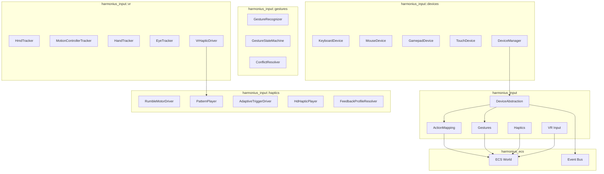
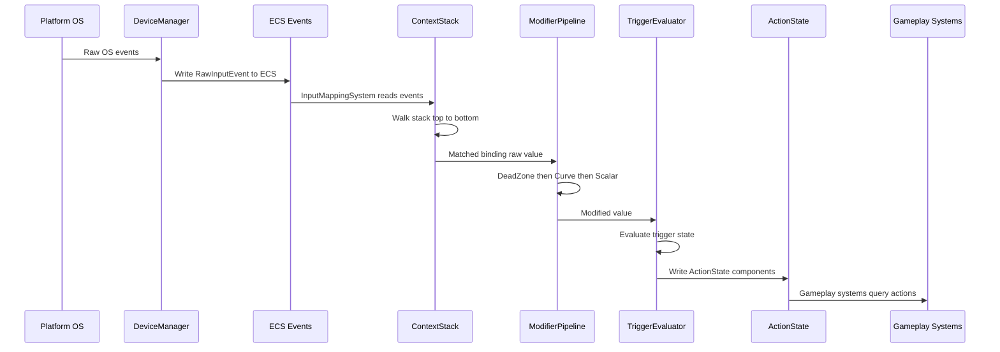
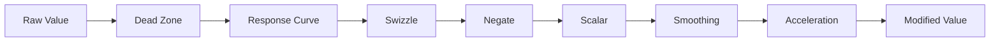
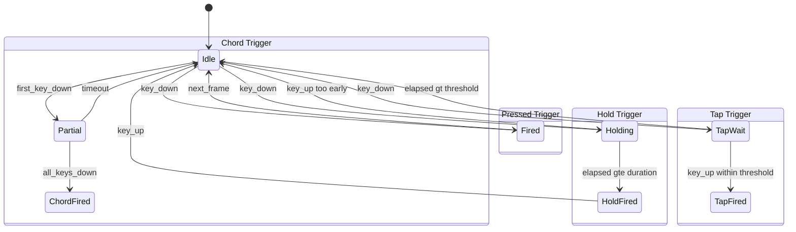
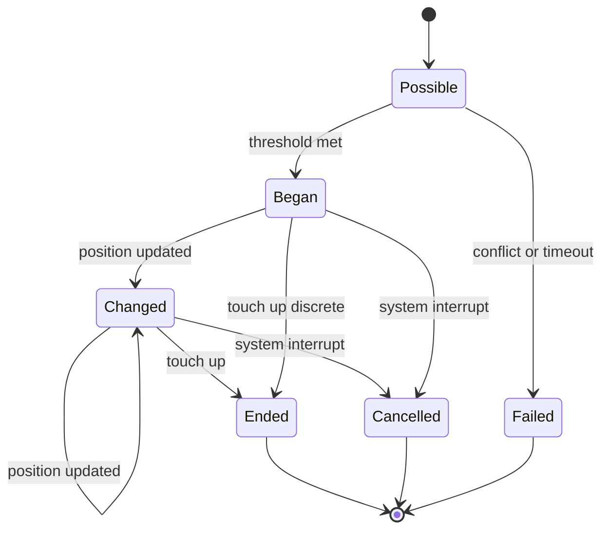
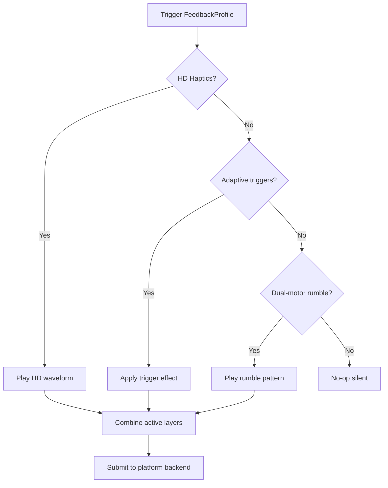
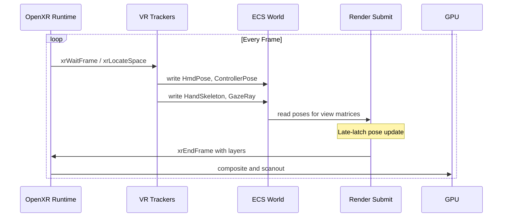
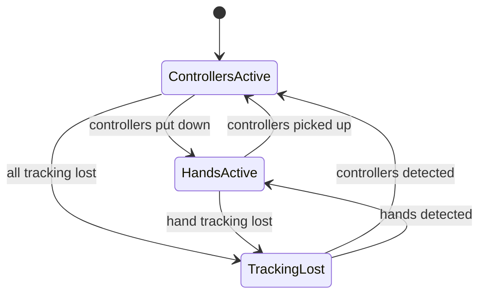

# Input System Design

## Requirements Trace

> **Canonical sources:** Features, requirements, and user stories live in
> [features/](../../features/), [requirements/](../../requirements/), and
> [user-stories/](../../user-stories/). Tables below trace design elements to those definitions.

### Device Abstraction (R-6.1)

| Feature   | Requirement |
|-----------|-------------|
| F-6.1.1   | R-6.1.1     |
| F-6.1.2   | R-6.1.2     |
| F-6.1.3   | R-6.1.3     |
| F-6.1.4   | R-6.1.4     |
| F-6.1.5   | R-6.1.5     |
| R-6.1.NF1 | --          |
| R-6.1.NF2 | --          |

1. **F-6.1.1** -- Keyboard press, release, repeat with scancode and keycode
2. **F-6.1.2** -- Mouse button, motion, scroll with sub-pixel deltas
3. **F-6.1.3** -- Unified gamepad over XInput, DualSense, Switch Pro
4. **F-6.1.4** -- Multi-touch and pen with pressure normalization
5. **F-6.1.5** -- Device hot-plug detection and enumeration
6. **R-6.1.NF1** -- OS-to-action pipeline under 1 ms p99
7. **R-6.1.NF2** -- Device enumeration within 5 ms startup, 2 ms hot-plug

### Action Mapping (R-6.2)

| Feature   | Requirement |
|-----------|-------------|
| F-6.2.1   | R-6.2.1     |
| F-6.2.2   | R-6.2.2     |
| F-6.2.3   | R-6.2.3     |
| F-6.2.4   | R-6.2.4     |
| F-6.2.5   | R-6.2.5     |
| F-6.2.6   | R-6.2.6     |
| F-6.2.7   | R-6.2.7     |
| F-6.2.8   | R-6.2.8     |
| F-6.2.9   | R-6.2.9     |
| F-6.2.10  | R-6.2.10    |
| F-6.2.11  | R-6.2.11    |
| R-6.2.NF1 | --          |
| R-6.2.NF2 | --          |

1. **F-6.2.1** -- Typed actions: bool, axis 1D/2D/3D
2. **F-6.2.2** -- Mapping contexts with priority stacking
3. **F-6.2.3** -- Modifier chains: dead zone, curve, swizzle, negate, scalar
4. **F-6.2.4** -- Trigger conditions: pressed, released, hold, tap, pulse, chord, combo
5. **F-6.2.5** -- Runtime rebinding with conflict detection
6. **F-6.2.6** -- Platform-aware button glyph resolution
7. **F-6.2.7** -- Input recording and deterministic playback
8. **F-6.2.8** -- Combo input trees and directional sequences
9. **F-6.2.9** -- Input buffering and ability cancel windows
10. **F-6.2.10** -- Smoothing, acceleration, aim assist
11. **F-6.2.11** -- Controller-driven UI interaction
12. **R-6.2.NF1** -- 128 actions evaluated under 0.2 ms/frame
13. **R-6.2.NF2** -- Rebinding persisted within 100 ms, restored within 50 ms

### Gestures (R-6.3)

| Feature   | Requirement |
|-----------|-------------|
| F-6.3.1   | R-6.3.1     |
| F-6.3.2   | R-6.3.2     |
| F-6.3.3   | R-6.3.3     |
| F-6.3.4   | R-6.3.4     |
| F-6.3.5   | R-6.3.5     |
| R-6.3.NF1 | --          |

1. **F-6.3.1** -- Tap, multi-tap, and long press recognition
2. **F-6.3.2** -- Swipe direction recognition (cardinal + diagonal)
3. **F-6.3.3** -- Pinch, rotate, and pan gestures
4. **F-6.3.4** -- Gesture state machines with conflict resolution
5. **F-6.3.5** -- Custom gesture definition via visual editor
6. **R-6.3.NF1** -- Discrete gesture latency within 1 frame; continuous within 2 frames

### Haptics (R-6.4)

| Feature   | Requirement |
|-----------|-------------|
| F-6.4.1   | R-6.4.1     |
| F-6.4.2   | R-6.4.2     |
| F-6.4.3   | R-6.4.3     |
| F-6.4.4   | R-6.4.4     |
| F-6.4.5   | R-6.4.5     |
| R-6.4.NF1 | --          |

1. **F-6.4.1** -- Dual-motor rumble with pattern sequencing
2. **F-6.4.2** -- DualSense adaptive trigger effects
3. **F-6.4.3** -- High-definition haptic playback
4. **F-6.4.4** -- Audio-driven haptic generation
5. **F-6.4.5** -- Custom force feedback profiles with fallback
6. **R-6.4.NF1** -- Haptic output latency within 5 ms of event

### VR Input (R-6.5)

| Feature   | Requirement |
|-----------|-------------|
| F-6.5.1   | R-6.5.1     |
| F-6.5.2   | R-6.5.2     |
| F-6.5.3   | R-6.5.3     |
| F-6.5.4   | R-6.5.4     |
| F-6.5.5   | R-6.5.5     |
| R-6.5.NF1 | --          |
| R-6.5.NF2 | --          |

1. **F-6.5.1** -- 6DOF head-mounted display tracking
2. **F-6.5.2** -- Motion controller input (6DOF + buttons)
3. **F-6.5.3** -- Hand tracking and skeletal input (26 joints)
4. **F-6.5.4** -- Eye tracking and gaze input
5. **F-6.5.5** -- VR controller haptics
6. **R-6.5.NF1** -- Motion-to-photon latency under 20 ms
7. **R-6.5.NF2** -- Hand tracking at 30+ Hz, 5 mm accuracy

## Overview

The input system has five layers that share a single ECS data model:

1. **Device Abstraction** -- platform-native capture of raw events from keyboard, mouse, gamepad,
   touch, and pen. Each backend uses OS-specific APIs (Win32 raw input, macOS HID/GCController,
   Linux evdev) and normalizes events into `RawInputEvent` written to the ECS world.
2. **Action Mapping** -- a data-driven pipeline that maps raw events to named, typed gameplay
   actions through priority-stacked mapping contexts, composable modifier chains, and trigger
   evaluators.
3. **Gesture Recognition** -- consumes raw touch events from the device layer (F-6.1.4) and produces
   typed `GestureEvent` components through state-machine-based recognizers with configurable
   conflict resolution.
4. **Haptics** -- consumes gameplay events and produces hardware output reports through a layered
   profile system that degrades gracefully across controller capabilities (HD haptics, adaptive
   triggers, dual-motor rumble).
5. **VR Input** -- bridges platform VR runtimes (OpenXR, OVR, PSVR2 SDK) into ECS components for
   head tracking, controller tracking, hand tracking, and eye tracking.

All input state lives as ECS components and resources. All bindings are authored in the visual
editor (no-code). Static dispatch via `cfg` attributes selects platform backends.

## Architecture

### Module Boundaries



### Per-Frame Input Pipeline



### Devices and Actions Class Diagram

```mermaid
classDiagram
    class DeviceManager {
        +enumerate() Vec~DeviceInfo~
        +poll_events(out)
        +active_device() Option~DeviceId~
        +handle_connect(info) DeviceId
        +handle_disconnect(id)
    }
    class DeviceId {
        +index u32
        +generation u32
    }
    class DeviceType {
        &lt;&lt;enumeration&gt;&gt;
        Keyboard
        Mouse
        Gamepad
        Touch
        Pen
    }
    class DeviceInfo {
        +id DeviceId
        +device_type DeviceType
        +capabilities DeviceCapabilities
    }
    class DeviceCapabilities {
        +has_gyroscope bool
        +has_adaptive_triggers bool
        +has_rumble bool
        +has_hd_rumble bool
    }
    class RawInputEvent {
        +device_id DeviceId
        +timestamp u64
        +kind RawInputKind
    }
    class RawInputKind {
        &lt;&lt;enumeration&gt;&gt;
        KeyPress
        KeyRelease
        MouseButton
        MouseMotion
        GamepadButton
        GamepadAxis
        TouchBegin
        TouchEnd
        PenMove
    }
    class Scancode {
        &lt;&lt;enumeration&gt;&gt;
        A B W S Space Escape
    }
    class MouseButton {
        &lt;&lt;enumeration&gt;&gt;
        Left Right Middle
    }
    class GamepadButton {
        &lt;&lt;enumeration&gt;&gt;
        South East West North
    }
    class GamepadAxis {
        &lt;&lt;enumeration&gt;&gt;
        LeftStickX RightStickX
    }
    class KeyboardState {
        +is_pressed(sc) bool
    }
    class MouseState {
        +position Vec2
        +delta Vec2
    }
    class GamepadState {
        +buttons u32
        +left_stick Vec2
    }
    class TouchState {
        +contacts TouchContact_x10
    }
    class TouchContact {
        +finger_id FingerId
        +position Vec2
        +pressure f32
    }
    class ActionId {
        +hash u64
    }
    class ActionValue {
        &lt;&lt;enumeration&gt;&gt;
        Bool Axis1D Axis2D Axis3D
    }
    class ActionState {
        +value ActionValue
        +triggered bool
        +elapsed f32
    }
    class InputSource {
        &lt;&lt;enumeration&gt;&gt;
        Key MouseButton GamepadButton
        GamepadAxis TouchRegion ComboTree
    }
    class MappingContext {
        +id ContextId
        +priority i32
        +bindings Vec~ActionBinding~
        +consumes_input bool
    }
    class ActionBinding {
        +action_id ActionId
        +source InputSource
        +modifiers ModifierChain
        +trigger TriggerCondition
    }
    class ContextStack {
        +push(id)
        +pop(id)
        +iter_active() Iterator
    }
    class InputModifier {
        &lt;&lt;enumeration&gt;&gt;
        DeadZoneAxial DeadZoneRadial
        ResponseCurve Swizzle Negate
        Scalar Smoothing Acceleration
    }
    class ModifierChain {
        +apply(value dt state) ActionValue
    }
    class TriggerCondition {
        &lt;&lt;enumeration&gt;&gt;
        Pressed Released Hold
        Tap Pulse Chord Combo Down
    }
    class TriggerPhase {
        &lt;&lt;enumeration&gt;&gt;
        Idle Ongoing Fired Completed
    }
    class RebindManager {
        +request_rebind() RebindResult
        +save_bindings() Result
    }
    class RebindResult {
        &lt;&lt;enumeration&gt;&gt;
        Success Conflict
        ReservedInput TypeMismatch
    }
    class GlyphResolver {
        +resolve() ResolvedGlyph
        +invalidate()
    }
    class DeviceFamily {
        &lt;&lt;enumeration&gt;&gt;
        Keyboard Xbox PlayStation SwitchPro
    }
    class ComboTree {
        +nodes Vec~ComboNode~
        +root ComboNodeId
    }
    class ComboNode {
        +input ComboInput
        +window f32
        +action Option~ActionId~
    }
    class ComboEvaluator {
        +advance(input dt tree) Option~ActionId~
    }
    class InputBuffer {
        +push(action category time)
        +try_consume(window) Option~ActionId~
    }
    class AimAssistConfig {
        +magnetism_radius f32
        +apply(look targets state) Vec2
    }

    DeviceManager *-- DeviceId
    DeviceManager --> DeviceInfo
    DeviceInfo --> DeviceType
    DeviceInfo --> DeviceCapabilities
    RawInputEvent --> DeviceId
    RawInputEvent --> RawInputKind
    MappingContext *-- ActionBinding
    ActionBinding --> InputSource
    ActionBinding --> ModifierChain
    ActionBinding --> TriggerCondition
    ModifierChain *-- InputModifier
    ActionState --> ActionValue
    ContextStack o-- MappingContext
    RebindManager --> RebindResult
    GlyphResolver --> DeviceFamily
    ComboTree *-- ComboNode
    ComboEvaluator --> ComboTree
```



### Gestures, Haptics, and VR Class Diagram

```mermaid
classDiagram
    class GesturePhase {
        &lt;&lt;enumeration&gt;&gt;
        Possible Began Changed
        Ended Cancelled Failed
    }
    class GestureType {
        &lt;&lt;enumeration&gt;&gt;
        Tap LongPress Swipe
        Pinch Rotate Pan Custom
    }
    class SwipeDirection {
        &lt;&lt;enumeration&gt;&gt;
        Up Down Left Right
        UpLeft UpRight DownLeft DownRight
    }
    class GestureConfig {
        +tap_distance_threshold f32
        +long_press_duration f32
        +swipe_velocity_threshold f32
        +pinch_scale_threshold f32
        +display_dpi f32
        +dpi_scaled(px) f32
    }
    class GestureEvent {
        +gesture_type GestureType
        +phase GesturePhase
        +position Vec2
        +delta Vec2
        +scale f32
        +rotation f32
    }
    class ResolutionStrategy {
        &lt;&lt;enumeration&gt;&gt;
        RequireFailure Simultaneous Priority
    }
    class ConflictRule {
        +recognizer_a GestureType
        +recognizer_b GestureType
        +strategy ResolutionStrategy
    }
    class ConflictResolver {
        +resolve(candidates) Vec~ResolvedGesture~
    }
    class TapRecognizer {
        +tap_count u8
        +phase GesturePhase
    }
    class SwipeRecognizer {
        +phase GesturePhase
        +peak_velocity f32
    }
    class PinchRecognizer {
        +phase GesturePhase
        +current_scale f32
    }
    class RotateRecognizer {
        +phase GesturePhase
        +current_angle f32
    }
    class PanRecognizer {
        +phase GesturePhase
        +velocity Vec2
    }
    class CustomGestureEvaluator {
        +graph_asset AssetId
        +feed(event runtime)
        +is_recognized() bool
    }
    class DualMotorState {
        +low_freq f32
        +high_freq f32
    }
    class RumblePattern {
        +keyframes Vec~RumbleKeyframe~
        +envelope RumbleEnvelope
        +looping bool
        +priority u8
    }
    class PatternPlayer {
        +play(pattern intensity)
        +tick(dt) DualMotorState
        +stop_all()
    }
    class TriggerEffectMode {
        &lt;&lt;enumeration&gt;&gt;
        Resistance Vibration
        SectionedResistance Off
    }
    class TriggerEffect {
        +mode TriggerEffectMode
        +start_position f32
        +strength f32
    }
    class HapticWaveform {
        +frequencies Vec~f32~
        +amplitudes Vec~f32~
        +sample_interval f32
    }
    class FeedbackProfile {
        +rumble Option~RumblePattern~
        +adaptive_trigger Option~TriggerEffect~
        +hd_waveform Option~HapticWaveform~
        +fallback_chain FallbackChain
    }
    class HapticLayer {
        &lt;&lt;enumeration&gt;&gt;
        HdHaptic AdaptiveTrigger DualMotorRumble
    }
    class FallbackChain {
        +layers Vec~HapticLayer~
    }
    class HmdPose {
        +position Vec3
        +orientation Quat
        +tracking_status TrackingStatus
    }
    class TrackingStatus {
        &lt;&lt;enumeration&gt;&gt;
        Tracked Lost Initializing
    }
    class ControllerPose {
        +hand Hand
        +position Vec3
        +orientation Quat
        +velocity Vec3
    }
    class HandSkeleton {
        +hand Hand
        +joints HandJointPose_x26
        +tracking_confidence f32
    }
    class HandJointPose {
        +position Vec3
        +orientation Quat
        +radius f32
    }
    class VrHandGesture {
        &lt;&lt;enumeration&gt;&gt;
        Pinch Grab Point
        ThumbsUp OpenPalm Custom
    }
    class GazeRay {
        +origin Vec3
        +direction Vec3
        +fixation_point Vec3
        +pupil_dilation f32
    }
    class GazeBehavior {
        &lt;&lt;enumeration&gt;&gt;
        Fixation Saccade Pursuit Unknown
    }
    class VrHapticParams {
        +amplitude f32
        +frequency f32
        +duration f32
    }
    class VrHapticDriver {
        +impulse(hand params) Result
        +play_pattern(hand pattern) Result
        +spatial(hand ctrl target) Result
    }

    GestureEvent --> GestureType
    GestureEvent --> GesturePhase
    GestureType --> SwipeDirection
    ConflictResolver *-- ConflictRule
    ConflictRule --> ResolutionStrategy
    TapRecognizer --> GesturePhase
    SwipeRecognizer --> GesturePhase
    PinchRecognizer --> GesturePhase
    PanRecognizer --> GesturePhase
    RumblePattern --> DualMotorState
    PatternPlayer --> RumblePattern
    TriggerEffect --> TriggerEffectMode
    FeedbackProfile --> RumblePattern
    FeedbackProfile --> TriggerEffect
    FeedbackProfile --> HapticWaveform
    FeedbackProfile --> FallbackChain
    FallbackChain *-- HapticLayer
    HmdPose --> TrackingStatus
    ControllerPose --> TrackingStatus
    HandSkeleton *-- HandJointPose
    VrHapticDriver --> VrHapticParams
```



### Modifier Pipeline Chain



### Trigger Condition State Machines



### Gesture State Machine Lifecycle



### Haptic Fallback Resolution



### VR Tracking Pipeline



### Hand Tracking Auto-Switch



## API Design

### Device Identification

```rust
/// Generational index for a connected device.
/// All types derive Reflect.
#[derive(Clone, Copy, Debug, PartialEq, Eq, Hash, Reflect)]
pub struct DeviceId {
    pub index: u32,
    pub generation: u32,
}

#[derive(Clone, Copy, Debug, PartialEq, Eq, Hash, Reflect)]
pub enum DeviceType {
    Keyboard,
    Mouse,
    Gamepad,
    Touch,
    Pen,
}

pub struct DeviceInfo {
    pub id: DeviceId,
    pub device_type: DeviceType,
    pub name: SmallString,
    pub vendor_id: u16,
    pub product_id: u16,
    pub capabilities: DeviceCapabilities,
}

#[derive(Clone, Copy, Debug, Default, Reflect)]
pub struct DeviceCapabilities {
    pub has_gyroscope: bool,
    pub has_accelerometer: bool,
    pub has_touchpad: bool,
    pub has_adaptive_triggers: bool,
    pub has_rumble: bool,
    pub has_hd_rumble: bool,
    pub max_touch_points: u8,
}
```

### Scancode, Keycode, and Button Enumerations

```rust
/// Layout-independent physical key identifier.
/// Normalized to USB HID usage table across
/// platforms.
#[derive(Clone, Copy, Debug, PartialEq, Eq, Hash, Reflect)]
#[repr(u16)]
pub enum Scancode {
    A = 0x0004,
    B = 0x0005,
    // ... full USB HID usage table (up to ~256)
    W = 0x001A,
    S = 0x0016,
    Space = 0x002C,
    LeftShift = 0x00E1,
    Escape = 0x0029,
}

/// Locale-aware virtual keycode.
#[derive(Clone, Copy, Debug, PartialEq, Eq, Hash, Reflect)]
pub struct Keycode(pub u32);

#[derive(Clone, Copy, Debug, PartialEq, Eq, Hash, Reflect)]
pub enum MouseButton {
    Left, Right, Middle, Button4, Button5,
}

#[derive(Clone, Copy, Debug, PartialEq, Eq, Hash, Reflect)]
pub enum GamepadButton {
    South,       // A / Cross
    East,        // B / Circle
    West,        // X / Square
    North,       // Y / Triangle
    LeftBumper, RightBumper,
    LeftTrigger, RightTrigger,
    Select, Start,
    LeftStick, RightStick,
    DPadUp, DPadDown, DPadLeft, DPadRight,
    Guide, Touchpad, Misc,
}

#[derive(Clone, Copy, Debug, PartialEq, Eq, Hash, Reflect)]
pub enum GamepadAxis {
    LeftStickX, LeftStickY,
    RightStickX, RightStickY,
    LeftTrigger, RightTrigger,
}

#[derive(Clone, Copy, Debug, PartialEq, Eq, Hash, Reflect)]
pub struct FingerId(pub u8);
```

### Raw Input Events

```rust
#[derive(Clone, Debug, Reflect)]
pub struct RawInputEvent {
    pub device_id: DeviceId,
    pub timestamp: u64,
    pub kind: RawInputKind,
}

#[derive(Clone, Debug, Reflect)]
pub enum RawInputKind {
    KeyPress { scancode: Scancode, keycode: Keycode },
    KeyRelease { scancode: Scancode, keycode: Keycode },
    KeyRepeat { scancode: Scancode, keycode: Keycode },
    MouseButton { button: MouseButton, pressed: bool },
    MouseMotion { delta_x: f32, delta_y: f32 },
    MousePosition { x: f32, y: f32 },
    MouseScroll { horizontal: f32, vertical: f32 },
    GamepadButton { button: GamepadButton, pressed: bool },
    GamepadAxis { axis: GamepadAxis, value: f32 },
    GamepadMotion { gyro: Vec3, accel: Vec3 },
    TouchBegin {
        finger_id: FingerId, position: Vec2,
        pressure: f32, area: f32,
    },
    TouchMove {
        finger_id: FingerId, position: Vec2,
        pressure: f32,
    },
    TouchEnd { finger_id: FingerId },
    PenMove {
        position: Vec2, pressure: f32, tilt: Vec2,
    },
    PenButton { button_index: u8, pressed: bool },
}
```

### Device Manager

```rust
/// ECS resource managing all connected devices.
pub struct DeviceManager {
    devices: Vec<DeviceSlot>,
    generation: Vec<u32>,
    free_list: Vec<u32>,
    active_device: Option<DeviceId>,
    active_device_type: Option<DeviceType>,
}

impl DeviceManager {
    /// Enumerate all devices at startup.
    /// Must complete within 5 ms (R-6.1.NF2).
    pub fn enumerate(&mut self) -> Vec<DeviceInfo>;

    /// Poll all devices. Called once per frame.
    /// Must complete within 1 ms (R-6.1.NF1).
    pub fn poll_events(
        &mut self,
        out: &mut Vec<RawInputEvent>,
    );

    pub fn active_device(&self) -> Option<DeviceId>;
    pub fn active_device_type(
        &self,
    ) -> Option<DeviceType>;
    pub fn capabilities(
        &self, id: DeviceId,
    ) -> Option<&DeviceCapabilities>;
    pub fn handle_connect(
        &mut self, info: DeviceInfo,
    ) -> DeviceId;
    pub fn handle_disconnect(&mut self, id: DeviceId);
}
```

### Device State Snapshots

```rust
pub struct KeyboardState {
    pressed: [u64; 4], // 256-bit scancode bitset
}
impl KeyboardState {
    pub fn is_pressed(&self, sc: Scancode) -> bool;
    pub fn just_pressed(
        &self, sc: Scancode, prev: &KeyboardState,
    ) -> bool;
    pub fn just_released(
        &self, sc: Scancode, prev: &KeyboardState,
    ) -> bool;
}

pub struct MouseState {
    pub position: Vec2,
    pub delta: Vec2,
    pub scroll: Vec2,
    pub buttons: u8,
}

pub struct GamepadState {
    pub buttons: u32,
    pub left_stick: Vec2,
    pub right_stick: Vec2,
    pub left_trigger: f32,
    pub right_trigger: f32,
    pub gyro: Vec3,
    pub accel: Vec3,
    pub orientation: Quat,
}

pub struct TouchState {
    pub contacts: [Option<TouchContact>; 10],
    pub contact_count: u8,
}

pub struct TouchContact {
    pub finger_id: FingerId,
    pub position: Vec2,
    pub pressure: f32,
    pub area: f32,
}
```

### Typed Actions

```rust
#[derive(Clone, Copy, Debug, PartialEq, Eq, Hash, Reflect)]
pub struct ActionId(pub u64);

#[derive(Clone, Copy, Debug, PartialEq, Reflect)]
pub enum ActionValue {
    Bool(bool),
    Axis1D(f32),
    Axis2D(Vec2),
    Axis3D(Vec3),
}

#[derive(Clone, Copy, Debug, PartialEq, Eq, Reflect)]
pub enum ActionValueType {
    Bool, Axis1D, Axis2D, Axis3D,
}

#[derive(Clone, Debug, Reflect)]
pub struct ActionState {
    pub value: ActionValue,
    pub triggered: bool,
    pub elapsed: f32,
    pub completed: bool,
}

pub struct ActionDefinition {
    pub id: ActionId,
    pub name: SmallString,
    pub value_type: ActionValueType,
    pub default_value: ActionValue,
}
```

### Input Source and Bindings

```rust
#[derive(Clone, Debug, PartialEq, Eq, Hash, Reflect)]
pub enum InputSource {
    Key(Scancode),
    MouseButton(MouseButton),
    MouseAxis(MouseAxisSource),
    GamepadButton(GamepadButton),
    GamepadAxis(GamepadAxis),
    GamepadStick(GamepadStickSource),
    TouchRegion(TouchRegionId),
    ComboTree(ComboTreeId),
}

#[derive(Clone, Copy, Debug, PartialEq, Eq, Hash, Reflect)]
pub struct ContextId(pub u64);

pub struct MappingContext {
    pub id: ContextId,
    pub name: SmallString,
    pub priority: i32,
    pub bindings: Vec<ActionBinding>,
    pub consumes_input: bool,
}

pub struct ActionBinding {
    pub action_id: ActionId,
    pub source: InputSource,
    pub modifiers: ModifierChain,
    pub trigger: TriggerCondition,
}

pub struct ContextStack {
    active: Vec<ActiveContext>,
}
impl ContextStack {
    pub fn push(&mut self, id: ContextId);
    pub fn pop(&mut self, id: ContextId);
    pub fn iter_active(
        &self,
    ) -> impl Iterator<Item = ContextId> + '_;
    pub fn is_active(&self, id: ContextId) -> bool;
}
```

### Input Modifiers

```rust
#[derive(Clone, Debug, Reflect)]
pub enum InputModifier {
    DeadZoneAxial { threshold_x: f32, threshold_y: f32 },
    DeadZoneRadial { threshold: f32 },
    ResponseCurve { curve_type: ResponseCurveType },
    Swizzle { order: SwizzleOrder },
    Negate { negate_x: bool, negate_y: bool, negate_z: bool },
    Scalar { multiplier: f32 },
    Smoothing { time_constant: f32 },
    Acceleration {
        ramp_up_time: f32, max_multiplier: f32,
        decay_rate: f32,
    },
}

pub struct ModifierChain {
    modifiers: SmallVec<[InputModifier; 4]>,
}
impl ModifierChain {
    pub fn apply(
        &self, value: ActionValue,
        dt: f32, state: &mut ModifierState,
    ) -> ActionValue;
}

pub struct ModifierState {
    pub smoothed_value: ActionValue,
    pub acceleration_velocity: f32,
}
```

### Trigger Conditions

```rust
#[derive(Clone, Debug, Reflect)]
pub enum TriggerCondition {
    Pressed,
    Released,
    Hold { duration: f32 },
    Tap { threshold: f32 },
    Pulse { interval: f32 },
    Chord {
        inputs: SmallVec<[InputSource; 4]>,
        window: f32,
    },
    Combo {
        sequence: SmallVec<[InputSource; 8]>,
        window_per_step: f32,
    },
    Down,
}

pub struct TriggerState {
    pub phase: TriggerPhase,
    pub elapsed: f32,
    pub chord_active: SmallVec<[bool; 4]>,
    pub combo_step: u8,
}

#[derive(Clone, Copy, Debug, PartialEq, Eq, Reflect)]
pub enum TriggerPhase {
    Idle, Ongoing, Fired, Completed,
}

impl TriggerCondition {
    pub fn evaluate(
        &self, input_active: bool,
        value: &ActionValue, dt: f32,
        state: &mut TriggerState,
    ) -> TriggerPhase;
}
```

### Rebinding

```rust
pub struct RebindRequest {
    pub context_id: ContextId,
    pub action_id: ActionId,
    pub new_source: InputSource,
}

#[derive(Clone, Debug, Reflect)]
pub enum RebindResult {
    Success,
    Conflict {
        conflicting_action: ActionId,
        conflicting_context: ContextId,
    },
    ReservedInput { source: InputSource },
    TypeMismatch {
        expected: ActionValueType,
        got: ActionValueType,
    },
}

pub struct RebindManager {
    reserved: Vec<InputSource>,
}
impl RebindManager {
    pub fn request_rebind(
        &self, req: &RebindRequest,
        contexts: &[MappingContext],
        stack: &ContextStack,
    ) -> RebindResult;
    /// Persist within 100 ms (R-6.2.NF2).
    pub async fn save_bindings(
        &self, contexts: &[MappingContext],
    ) -> Result<(), IoError>;
    /// Restore within 50 ms (R-6.2.NF2).
    pub async fn load_bindings(
        &self, contexts: &mut [MappingContext],
    ) -> Result<(), IoError>;
}
```

### Button Glyph Resolution

```rust
pub struct ResolvedGlyph {
    pub atlas_id: GlyphAtlasId,
    pub sprite_index: u32,
    pub label: SmallString,
}

#[derive(Clone, Copy, Debug, PartialEq, Eq, Hash, Reflect)]
pub enum DeviceFamily {
    Keyboard, Xbox, PlayStation, SwitchPro, Generic,
}

pub struct GlyphResolver {
    atlases: Vec<(DeviceFamily, GlyphAtlasId)>,
    cache: Vec<(ActionId, ResolvedGlyph)>,
}
impl GlyphResolver {
    pub fn resolve(
        &mut self, action_id: ActionId,
        binding: &ActionBinding,
        active_family: DeviceFamily,
    ) -> &ResolvedGlyph;
    pub fn invalidate(&mut self);
}
```

### Combo System

```rust
pub struct ComboTree {
    pub id: ComboTreeId,
    pub nodes: Vec<ComboNode>,
    pub root: ComboNodeId,
}

pub struct ComboNode {
    pub id: ComboNodeId,
    pub input: ComboInput,
    pub window: f32,
    pub children: SmallVec<[ComboNodeId; 4]>,
    pub action: Option<ActionId>,
}

#[derive(Clone, Copy, Debug, PartialEq, Eq, Hash, Reflect)]
pub enum ComboInput {
    Direction(CardinalDirection),
    Button(GamepadButton),
    Key(Scancode),
    AnyAttack,
    AnyDirection,
}

pub struct ComboEvaluator {
    pub tree_id: ComboTreeId,
    pub current_node: ComboNodeId,
    pub timer: f32,
    pub leniency: f32,
}
impl ComboEvaluator {
    pub fn advance(
        &mut self, input: ComboInput,
        dt: f32, tree: &ComboTree,
    ) -> Option<ActionId>;
    pub fn reset(&mut self);
}
```

### Input Buffer

```rust
#[derive(Clone, Copy, Debug, PartialEq, Eq, Reflect)]
pub enum ActionCategory {
    Movement = 0,
    Attack = 1,
    Special = 2,
    Dodge = 3,
    Any = 4,
}

pub struct CancelWindow {
    pub start_frame: u32,
    pub end_frame: u32,
    pub permitted: SmallVec<[ActionCategory; 4]>,
}

pub struct InputBuffer {
    buffer: Option<BufferedInput>,
    pub duration: f32,
}
impl InputBuffer {
    pub fn push(
        &mut self, action_id: ActionId,
        category: ActionCategory, time: f32,
    );
    pub fn try_consume(
        &mut self, window: &CancelWindow,
        current_frame: u32, current_time: f32,
    ) -> Option<ActionId>;
}
```

### Input Recording

```rust
pub struct InputRecording {
    pub context_id: ContextId,
    pub frames: Vec<InputFrame>,
    pub total_duration: f64,
}

pub struct InputRecorder {
    recording: Option<InputRecording>,
    active: bool,
}
impl InputRecorder {
    pub fn start(&mut self, context: ContextId);
    pub fn stop(
        &mut self,
    ) -> Option<InputRecording>;
    pub fn record_frame(
        &mut self, frame: u64, timestamp: f64,
        actions: &[(ActionId, ActionState)],
    );
}

pub struct InputPlayback {
    recording: InputRecording,
    cursor: usize,
    speed: f64,
}
impl InputPlayback {
    pub fn step(
        &mut self, dt: f64,
    ) -> Option<&[RecordedAction]>;
    pub fn is_complete(&self) -> bool;
}
```

### Aim Assist

```rust
pub struct AimAssistConfig {
    pub magnetism_radius: f32,
    pub magnetism_strength: f32,
    pub friction_radius: f32,
    pub friction_multiplier: f32,
    pub snap_enabled: bool,
    pub snap_radius: f32,
    pub enabled: bool,
}
impl AimAssistConfig {
    /// Queries the shared spatial index (F-1.9.4).
    pub fn apply(
        &self, look_input: Vec2,
        crosshair_world_pos: Vec3,
        targets: &[AimTarget],
        state: &mut AimAssistState,
    ) -> Vec2;
}
```

### Gesture Types and Configuration

```rust
#[derive(Clone, Copy, Debug, PartialEq, Eq, Hash, Reflect)]
pub enum GesturePhase {
    Possible, Began, Changed,
    Ended, Cancelled, Failed,
}

#[derive(Clone, Copy, Debug, PartialEq, Eq, Hash, Reflect)]
pub enum GestureType {
    Tap { count: u8 },
    LongPress,
    Swipe { direction: SwipeDirection },
    Pinch,
    Rotate,
    Pan,
    Custom { asset_id: AssetId },
}

#[derive(Clone, Copy, Debug, PartialEq, Eq, Hash, Reflect)]
pub enum SwipeDirection {
    Up, Down, Left, Right,
    UpLeft, UpRight, DownLeft, DownRight,
}

#[derive(Clone, Debug, Reflect)]
pub struct GestureConfig {
    pub tap_distance_threshold: f32,
    pub multi_tap_interval: f32,
    pub long_press_duration: f32,
    pub swipe_distance_threshold: f32,
    pub swipe_velocity_threshold: f32,
    pub pinch_scale_threshold: f32,
    pub rotation_angle_threshold: f32,
    pub display_dpi: f32,
    pub reference_dpi: f32,
}
impl GestureConfig {
    pub fn dpi_scaled(&self, px: f32) -> f32 {
        px * (self.display_dpi / self.reference_dpi)
    }
}
```

### Gesture Event and Conflict Resolution

```rust
#[derive(Clone, Debug, Reflect)]
pub struct GestureEvent {
    pub gesture_type: GestureType,
    pub phase: GesturePhase,
    pub position: Vec2,
    pub delta: Vec2,
    pub velocity: Vec2,
    pub scale: f32,
    pub rotation: f32,
    pub touch_count: u8,
    pub timestamp: Instant,
}

#[derive(Clone, Copy, Debug, PartialEq, Eq, Reflect)]
pub enum ResolutionStrategy {
    RequireFailure,
    Simultaneous,
    Priority,
}

#[derive(Clone, Debug, Reflect)]
pub struct ConflictRule {
    pub recognizer_a: GestureType,
    pub recognizer_b: GestureType,
    pub strategy: ResolutionStrategy,
    pub a_has_priority: bool,
}

pub struct ConflictResolver {
    rules: Vec<ConflictRule>,
}
impl ConflictResolver {
    pub fn resolve(
        &self, candidates: &[GestureCandidate],
    ) -> Vec<ResolvedGesture>;
}

pub enum ResolvedGesture {
    Emit(GestureEvent),
    Defer { event: GestureEvent, waiting_on: GestureType },
    Cancel(GestureType),
}
```

### Gesture Recognizers

```rust
pub struct TapRecognizer {
    tap_count: u8,
    target_count: u8,
    phase: GesturePhase,
    first_down_pos: Vec2,
    first_down_time: Instant,
}

pub struct SwipeRecognizer {
    phase: GesturePhase,
    down_pos: Vec2,
    current_pos: Vec2,
    peak_velocity: f32,
}

pub struct PinchRecognizer {
    phase: GesturePhase,
    initial_distance: f32,
    current_scale: f32,
}

pub struct RotateRecognizer {
    phase: GesturePhase,
    initial_angle: f32,
    current_angle: f32,
}

pub struct PanRecognizer {
    phase: GesturePhase,
    start_pos: Vec2,
    velocity: Vec2,
    finger_count: u8,
}

pub struct CustomGestureEvaluator {
    graph_asset: AssetId,
    phase: GesturePhase,
    trail: Vec<Vec2>,
}
impl CustomGestureEvaluator {
    pub fn feed(
        &mut self, event: &TouchEvent,
        graph_runtime: &LogicGraphRuntime,
    );
    pub fn is_recognized(&self) -> bool;
}
```

### Haptic Motor Abstraction

```rust
#[derive(Clone, Copy, Debug, Default, Reflect)]
pub struct DualMotorState {
    pub low_freq: f32,
    pub high_freq: f32,
}

#[derive(Clone, Copy, Debug, Reflect)]
pub struct RumbleKeyframe {
    pub time: f32,
    pub state: DualMotorState,
}

#[derive(Clone, Copy, Debug, Reflect)]
pub struct RumbleEnvelope {
    pub attack: f32,
    pub sustain: f32,
    pub decay: f32,
}

#[derive(Clone, Debug, Reflect)]
pub struct RumblePattern {
    pub keyframes: Vec<RumbleKeyframe>,
    pub envelope: RumbleEnvelope,
    pub looping: bool,
    pub priority: u8,
    pub duration: f32,
}

pub struct PatternPlayer {
    active_patterns: Vec<ActivePattern>,
}
impl PatternPlayer {
    pub fn play(
        &mut self, pattern: &RumblePattern,
        intensity: f32,
    );
    pub fn tick(&mut self, dt: f32) -> DualMotorState;
    pub fn stop_all(&mut self);
}
```

### Adaptive Trigger Effects (DualSense)

```rust
#[derive(Clone, Copy, Debug, PartialEq, Eq, Reflect)]
pub enum TriggerEffectMode {
    Resistance,
    Vibration,
    SectionedResistance,
    Off,
}

#[derive(Clone, Copy, Debug, Reflect)]
pub struct TriggerEffect {
    pub mode: TriggerEffectMode,
    pub start_position: f32,
    pub end_position: f32,
    pub strength: f32,
    pub frequency: f32,
    pub section_count: u8,
}

pub struct AdaptiveTriggerDriver;
impl AdaptiveTriggerDriver {
    pub fn apply(
        &self, device: &InputDevice,
        trigger: Trigger, effect: &TriggerEffect,
    ) -> Result<(), HapticError>;
}
```

### HD Haptic Waveforms

```rust
#[derive(Clone, Debug, Reflect)]
pub struct HapticWaveform {
    pub frequencies: Vec<f32>,
    pub amplitudes: Vec<f32>,
    pub sample_interval: f32,
    pub duration: f32,
}

pub struct HdHapticPlayer;
impl HdHapticPlayer {
    pub fn play(
        &self, device: &InputDevice,
        waveform: &HapticWaveform,
    ) -> Result<(), HapticError>;
    pub fn stop(
        &self, device: &InputDevice,
    ) -> Result<(), HapticError>;
}
```

### Audio-Driven Haptic Generation

```rust
pub struct AudioHapticGenerator {
    pub low_cutoff: f32,
    pub high_cutoff: f32,
    pub sample_rate: f32,
}
impl AudioHapticGenerator {
    /// Band-pass filter (20-250 Hz) with envelope
    /// extraction. Latency must stay under 10 ms.
    pub fn generate(
        &self, audio_buffer: &[f32],
        audio_sample_rate: u32,
    ) -> HapticWaveform;
}
```

### Force Feedback Profiles

```rust
#[derive(Clone, Debug, Reflect)]
pub struct FeedbackProfile {
    pub name: String,
    pub rumble: Option<RumblePattern>,
    pub adaptive_trigger: Option<TriggerEffect>,
    pub hd_waveform: Option<HapticWaveform>,
    pub fallback_chain: FallbackChain,
    pub parameters: Vec<ParameterBinding>,
}

#[derive(Clone, Debug, Reflect)]
pub struct FallbackChain {
    pub layers: Vec<HapticLayer>,
}

#[derive(Clone, Copy, Debug, PartialEq, Eq, Reflect)]
pub enum HapticLayer {
    HdHaptic, AdaptiveTrigger, DualMotorRumble,
}

#[derive(Clone, Debug, Reflect)]
pub struct ParameterBinding {
    pub parameter_name: String,
    pub target_layer: HapticLayer,
    pub min_value: f32,
    pub max_value: f32,
}

pub struct FeedbackProfileResolver;
impl FeedbackProfileResolver {
    pub fn trigger(
        &self, device: &InputDevice,
        profile: &FeedbackProfile,
        params: &[(String, f32)],
    ) -> Result<(), HapticError>;
    pub fn validate_fallbacks(
        profile: &FeedbackProfile,
        classes: &[ControllerClass],
    ) -> Vec<FallbackValidationError>;
}

#[derive(Clone, Copy, Debug, PartialEq, Eq, Reflect)]
pub enum ControllerClass {
    Xbox, DualSense, SwitchPro,
    GenericRumble, VrController,
}
```

### VR Head Tracking

```rust
#[derive(Clone, Copy, Debug, Reflect)]
pub struct HmdPose {
    pub position: Vec3,
    pub orientation: Quat,
    pub linear_velocity: Vec3,
    pub angular_velocity: Vec3,
    pub tracking_status: TrackingStatus,
    pub timestamp: Instant,
}

#[derive(Clone, Copy, Debug, PartialEq, Eq, Reflect)]
pub enum TrackingStatus {
    Tracked, Lost, Initializing,
}

#[derive(Clone, Copy, Debug, PartialEq, Eq, Reflect)]
pub enum PlayAreaMode {
    RoomScale, Standing, Seated,
}

#[derive(Clone, Copy, Debug, PartialEq, Eq, Reflect)]
pub enum TrackingLossResponse {
    FreezeGame, WarningOverlay, None,
}

pub struct HmdTracker {
    play_area: PlayAreaMode,
    loss_response: TrackingLossResponse,
}
impl HmdTracker {
    pub fn update(
        &self, runtime: &VrRuntime,
    ) -> HmdPose;
    pub fn late_latch(
        &self, runtime: &VrRuntime,
    ) -> HmdPose;
}
```

### VR Motion Controller and Hand Tracking

```rust
#[derive(Clone, Copy, Debug, Reflect)]
pub struct ControllerPose {
    pub hand: Hand,
    pub position: Vec3,
    pub orientation: Quat,
    pub velocity: Vec3,
    pub angular_velocity: Vec3,
    pub tracking_status: TrackingStatus,
}

#[derive(Clone, Copy, Debug, PartialEq, Eq, Reflect)]
pub enum Hand { Left, Right }

#[derive(Clone, Copy, Debug, Reflect)]
pub struct VrControllerState {
    pub hand: Hand,
    pub trigger: f32,
    pub grip: f32,
    pub thumbstick: Vec2,
    pub buttons: VrButtons,
    pub capacitive_touch: VrButtons,
}

bitflags::bitflags! {
    #[derive(Clone, Copy, Debug, Reflect)]
    pub struct VrButtons: u32 {
        const TRIGGER         = 1 << 0;
        const GRIP            = 1 << 1;
        const PRIMARY         = 1 << 2;
        const SECONDARY       = 1 << 3;
        const THUMBSTICK_CLICK = 1 << 4;
        const MENU            = 1 << 5;
        const SYSTEM          = 1 << 6;
    }
}

#[derive(Clone, Debug, Reflect)]
pub struct HandSkeleton {
    pub hand: Hand,
    pub joints: [HandJointPose; 26],
    pub tracking_confidence: f32,
}

#[derive(Clone, Copy, Debug, Reflect)]
pub struct HandJointPose {
    pub position: Vec3,
    pub orientation: Quat,
    pub radius: f32,
}

#[derive(Clone, Copy, Debug, PartialEq, Eq, Reflect)]
#[repr(u8)]
pub enum HandJoint {
    Palm = 0, Wrist = 1,
    ThumbMetacarpal = 2, ThumbTip = 5,
    IndexTip = 10, MiddleTip = 15,
    RingTip = 20, LittleTip = 25,
    // ... full 26-joint OpenXR enumeration
}

#[derive(Clone, Copy, Debug, PartialEq, Eq, Reflect)]
pub enum VrHandGesture {
    Pinch, Grab, Point, ThumbsUp, OpenPalm,
    Custom { asset_id: AssetId },
}

pub struct HandGestureDetector {
    thresholds: HandGestureThresholds,
}
impl HandGestureDetector {
    pub fn detect(
        &self, skeleton: &HandSkeleton,
    ) -> Vec<VrHandGesture>;
}

pub struct HandControllerSwitch {
    current_mode: VrInputMode,
}

#[derive(Clone, Copy, Debug, PartialEq, Eq, Reflect)]
pub enum VrInputMode {
    Controllers, Hands, TrackingLost,
}

impl HandControllerSwitch {
    pub fn update(
        &mut self, controllers_tracked: bool,
        hands_tracked: bool,
    ) -> VrInputMode;
}
```

### Eye Tracking and Gaze

```rust
#[derive(Clone, Copy, Debug, Reflect)]
pub struct GazeRay {
    pub origin: Vec3,
    pub direction: Vec3,
    pub fixation_point: Vec3,
    pub pupil_dilation: f32,
    pub left_openness: f32,
    pub right_openness: f32,
}

#[derive(Clone, Copy, Debug, PartialEq, Eq, Reflect)]
pub enum GazeBehavior {
    Fixation, Saccade, Pursuit, Unknown,
}

pub struct GazeBehaviorClassifier {
    pub fixation_min_duration: f32,
    pub fixation_max_velocity: f32,
    pub saccade_min_velocity: f32,
}
impl GazeBehaviorClassifier {
    pub fn classify(
        &self, current: &GazeRay,
        previous: &GazeRay, dt: f32,
    ) -> GazeBehavior;
}
```

### VR Controller Haptics

```rust
#[derive(Clone, Copy, Debug, Reflect)]
pub struct VrHapticParams {
    pub amplitude: f32,
    pub frequency: f32,
    pub duration: f32,
}

pub struct VrHapticDriver;
impl VrHapticDriver {
    pub fn impulse(
        &self, hand: Hand, params: &VrHapticParams,
    ) -> Result<(), HapticError>;
    pub fn play_pattern(
        &self, hand: Hand,
        pattern: &RumblePattern, intensity: f32,
    ) -> Result<(), HapticError>;
    pub fn spatial(
        &self, hand: Hand,
        controller_pos: Vec3, target_pos: Vec3,
        max_distance: f32, base_params: &VrHapticParams,
    ) -> Result<(), HapticError>;
    pub fn stop(
        &self, hand: Hand,
    ) -> Result<(), HapticError>;
}
```

### VR Runtime Abstraction

```rust
pub struct VrRuntime { /* platform-selected */ }
impl VrRuntime {
    pub fn new(
        config: &VrConfig,
    ) -> Result<Self, VrError>;
    pub fn begin_frame(
        &self,
    ) -> Result<FrameState, VrError>;
    pub fn end_frame(
        &self, layers: &[CompositionLayer],
    ) -> Result<(), VrError>;
    pub fn locate_hmd(&self) -> HmdPose;
    pub fn locate_controller(
        &self, hand: Hand,
    ) -> ControllerPose;
    pub fn get_hand_skeleton(
        &self, hand: Hand,
    ) -> Option<HandSkeleton>;
    pub fn get_gaze(&self) -> Option<GazeRay>;
}

#[derive(Clone, Debug, Reflect)]
pub struct VrConfig {
    pub play_area: PlayAreaMode,
    pub tracking_loss_response: TrackingLossResponse,
    pub enable_hand_tracking: bool,
    pub enable_eye_tracking: bool,
    pub target_refresh_rate: u32,
}
```

### Error Types

```rust
#[derive(Clone, Debug, Reflect)]
pub enum InputError {
    TypeMismatch {
        action: ActionId,
        expected: ActionValueType,
        got: ActionValueType,
    },
    ContextNotFound { id: ContextId },
    ActionNotFound { id: ActionId },
    DeviceNotFound { id: DeviceId },
    Platform { code: i32, message: SmallString },
}

#[derive(Clone, Debug, Reflect)]
pub enum HapticError {
    Unsupported,
    DeviceDisconnected,
    HidError { code: i32 },
}

#[derive(Clone, Debug, Reflect)]
pub enum VrError {
    RuntimeUnavailable,
    ExtensionUnsupported { name: String },
    SessionFailed { code: i32 },
    FrameError,
    TrackingUnavailable,
}
```

### ECS Systems

```rust
/// Polls devices and writes RawInputEvents.
pub struct DevicePollSystem;
impl System for DevicePollSystem {
    type Query = (
        ResMut<DeviceManager>,
        EventWriter<RawInputEvent>,
        EventWriter<DeviceConnected>,
        EventWriter<DeviceDisconnected>,
    );
    fn run(&self, query: Self::Query);
}

/// Evaluates action mapping: context stack walk,
/// modifiers, triggers. Writes ActionState.
pub struct ActionMappingSystem;
impl System for ActionMappingSystem {
    type Query = (
        Res<DeviceManager>,
        Res<ActionMap>,
        Res<ContextStack>,
        EventReader<RawInputEvent>,
        ResMut<ActionStates>,
    );
    fn run(&self, query: Self::Query);
}

/// Evaluates combo trees and input buffers.
pub struct ComboInputSystem;

/// Records or plays back input each frame.
pub struct InputRecordingSystem;

/// Updates glyph resolution on device change.
pub struct GlyphUpdateSystem;

/// Gesture recognition from touch events.
pub fn gesture_recognition_system(
    touch_events: Query<&TouchEvent>,
    mut recognizers: ResMut<RecognizerSet>,
    config: Res<GestureConfig>,
    resolver: Res<ConflictResolver>,
    mut gestures: EventWriter<GestureEvent>,
);

/// Haptic playback -- advances patterns and
/// submits motor output to hardware.
pub fn haptic_playback_system(
    mut player: ResMut<PatternPlayer>,
    devices: Query<&InputDevice>,
    time: Res<Time>,
);

/// VR tracking -- polls runtime and writes
/// pose components.
pub fn vr_tracking_system(
    runtime: Res<VrRuntime>,
    mut hmd: ResMut<HmdPose>,
    mut controllers: Query<&mut ControllerPose>,
    mut hands: Query<&mut HandSkeleton>,
    mut gaze: ResMut<Option<GazeRay>>,
    switcher: ResMut<HandControllerSwitch>,
);
```

### ECS Events

```rust
pub struct DeviceConnected {
    pub device_id: DeviceId,
    pub info: DeviceInfo,
}
pub struct DeviceDisconnected {
    pub device_id: DeviceId,
    pub device_type: DeviceType,
}
pub struct ActiveDeviceChanged {
    pub previous: Option<DeviceType>,
    pub current: DeviceType,
    pub device_id: DeviceId,
}
```

## Data Flow

### Per-Frame System Execution Order

```rust
// 1. Poll devices, write raw events
DevicePollSystem::run();
// 2. Detect active device changes, update glyphs
GlyphUpdateSystem::run();
// 3. Evaluate action mapping pipeline
ActionMappingSystem::run();
// 4. Evaluate combo trees and input buffers
ComboInputSystem::run();
// 5. Gesture recognition from touch events
gesture_recognition_system();
// 6. Haptic playback
haptic_playback_system();
// 7. VR tracking (if VR active)
vr_tracking_system();
// 8. Record/playback (if active)
InputRecordingSystem::run();
// -- Gameplay systems read ActionStates --
```

### Context Stack Walk (ActionMappingSystem)

For each `RawInputEvent` in the frame:

1. Walk the `ContextStack` from highest to lowest priority.
2. For each active context, check if any `ActionBinding` matches the event's `InputSource`.
3. On first match: extract raw value, run `ModifierChain::apply()`, evaluate
   `TriggerCondition::evaluate()`, write `ActionState`.
4. If `consumes_input` is true, stop walking. Otherwise continue to lower contexts.
5. If no context matches, the input is dropped.

### Modifier Chain Evaluation

Each modifier transforms the value in sequence:

1. **Dead Zone** -- zero values below threshold. Radial remaps [threshold, 1.0] to [0.0, 1.0].
2. **Response Curve** -- exponential: `sign(v)*|v|^exp`. S-curve: hermite interpolation.
3. **Swizzle** -- remap axis order.
4. **Negate** -- invert specified axes.
5. **Scalar** -- multiply by sensitivity.
6. **Smoothing** -- exponential moving average: `lerp(prev, raw, dt / time_const)`.
7. **Acceleration** -- scale by input velocity: `value * (1.0 + velocity * accel)`.

### Trigger State Transitions

- **Pressed**: Idle -> Fired (key_down) -> Idle.
- **Released**: Idle -> Fired (key_up) -> Idle.
- **Hold**: Idle -> Ongoing (key_down) -> Fired (elapsed >= duration) -> Idle (key_up).
- **Tap**: Idle -> Ongoing (key_down) -> Fired (key_up within threshold) OR Idle (timeout).
- **Pulse**: Idle -> Ongoing -> Fired each interval.
- **Chord**: Idle -> Ongoing (first key) -> Fired (all keys within window) -> Idle (any key up).
- **Combo**: Idle -> Ongoing per step -> Fired (final).
- **Down**: Fired every frame while input active.

### Gesture Processing Per Frame

1. Touch pointer stream (F-6.1.4) writes raw `TouchEvent` components.
2. `gesture_recognition_system` feeds each event into all active recognizers.
3. Each recognizer evaluates its state machine against DPI-scaled thresholds.
4. Recognizers reaching `Began`/`Changed`/`Ended` emit candidates.
5. `ConflictResolver` evaluates against authored rules.
6. Resolved gestures written as `GestureEvent` to ECS.
7. Gameplay and action layers consume events.

### Haptic Output Per Frame

1. Gameplay event triggers a `FeedbackProfile`.
2. `FeedbackProfileResolver` queries device capabilities.
3. Resolver walks fallback chain, selecting highest fidelity supported layer.
4. Parameter bindings scale intensity.
5. Selected layer dispatches to player (`PatternPlayer`, `AdaptiveTriggerDriver`, or
   `HdHapticPlayer`).
6. Player evaluates keyframes at 5 ms intervals and submits HID output reports.

### VR Pose Acquisition Per Frame

1. `VrRuntime::begin_frame()` syncs with compositor.
2. `vr_tracking_system` queries poses via `xrLocateSpace`.
3. `HmdPose`, `ControllerPose`, `HandSkeleton`, and `GazeRay` written to ECS.
4. Hand/controller auto-switch updates `VrInputMode`.
5. At render submission, `HmdTracker::late_latch()` fetches most recent pose for minimum
   motion-to-photon latency.
6. `VrRuntime::end_frame()` submits composition layers.

### Audio-Driven Haptic Pipeline

1. Audio system provides per-channel output buffers.
2. `AudioHapticGenerator` applies band-pass filter (20-250 Hz).
3. Amplitude envelope extraction produces a `HapticWaveform`.
4. Waveform submitted to `HdHapticPlayer` or converted to dual-motor approximation.
5. Audio-to-haptic latency maintained under 10 ms.

## Platform Considerations

### Keyboard

| Platform | API                   |
|----------|-----------------------|
| Windows  | `WM_KEYDOWN/UP`      |
| macOS    | `IOHIDManager`        |
| Linux    | `evdev` `EV_KEY`      |

1. **Windows** -- scancodes from `lParam` bits 16-23
2. **macOS** -- USB HID usage codes are native
3. **Linux** -- convert evdev codes to USB HID

### Mouse

| Platform | API                |
|----------|--------------------|
| Windows  | `WM_INPUT` raw     |
| macOS    | `CGEvent` delta    |
| Linux    | `evdev` `EV_REL`   |

### Gamepad

| Platform | API                 |
|----------|---------------------|
| Windows  | XInput / WGI       |
| macOS    | `GCController`      |
| Linux    | `evdev` gamepad     |

### Touch and Pen

| Platform | API                   |
|----------|-----------------------|
| Windows  | `WM_POINTER`          |
| macOS    | `NSTouch` / `NSEvent` |
| Linux    | `libinput`            |

### Hot-Plug

| Platform | API                        |
|----------|----------------------------|
| Windows  | `WM_DEVICECHANGE`          |
| macOS    | `IOHIDManager` callbacks   |
| Linux    | `udev` monitor             |

### Gesture Platform APIs

| Platform | Touch API       | Trackpad        |
|----------|-----------------|-----------------|
| Windows  | `WM_POINTER`    | N/A             |
| macOS    | `NSTouch`       | `NSEvent` mag/rot |
| Linux    | `libinput`      | N/A             |
| iOS      | `UITouch`       | N/A             |
| Android  | `MotionEvent`   | N/A             |

### Haptic Platform APIs

| Platform | Rumble API          | HD / Adaptive          |
|----------|---------------------|------------------------|
| Windows  | XInput / GameInput  | DualSense HID (USB)   |
| macOS    | `GCController`      | CoreHaptics, DualSense BT |
| Linux    | `evdev` FF_RUMBLE   | DualSense HID (hidraw) |
| Switch   | HD Rumble API       | LRA freq/amp at 5 ms  |
| PS5      | DualSense SDK       | Native full suite      |

### VR Platform APIs

| Platform | Runtime  | Hand      | Eye        |
|----------|----------|-----------|------------|
| PC Steam | OpenXR   | XR_EXT    | XR_EXT     |
| Quest    | OVR/OpenXR | Meta SDK | Quest Pro  |
| PSVR2    | PS VR SDK | N/A      | Native     |

### Scancode Normalization

| Platform | Native Format   | Conversion      |
|----------|-----------------|-----------------|
| Windows  | Win32 scan codes | Lookup table   |
| macOS    | USB HID codes   | Identity        |
| Linux    | evdev codes     | Lookup table    |

### Latency Budgets

| Metric            | Target        | Req       |
|-------------------|---------------|-----------|
| OS-to-action      | 1 ms p99      | R-6.1.NF1 |
| Device enum       | 5 ms startup  | R-6.1.NF2 |
| 128 actions eval  | 0.2 ms/frame  | R-6.2.NF1 |
| Discrete gesture  | 1 frame       | R-6.3.NF1 |
| Continuous gesture | 2 frames     | R-6.3.NF1 |
| Haptic output     | 5 ms          | R-6.4.NF1 |
| Audio-haptic sync | 10 ms         | F-6.4.4   |
| Motion-to-photon  | 20 ms         | R-6.5.NF1 |
| Hand tracking     | 30 Hz, 5 mm   | R-6.5.NF2 |

### Scaling Tiers

| Tier    | Devices | Actions | Contexts |
|---------|---------|---------|----------|
| Mobile  | 2       | 64      | 4        |
| Desktop | 8       | 128     | 8        |
| Console | 6       | 128     | 8        |

### Proposed Dependencies

| Crate          | Purpose                  |
|----------------|--------------------------|
| `openxr`       | VR runtime bindings      |
| `hidapi`       | DualSense HID comms      |
| `bitflags`     | VR button bitmasks       |
| `windows-rs`   | Win32 API bindings       |
| `objc2`        | macOS/iOS Obj-C FFI      |
| `smallvec`     | Inline small vectors     |

## Test Plan

Companion test case files:

- `input-test-cases.md` -- comprehensive test cases for all subsystems

### Unit Tests

| Test                                | Req      |
|-------------------------------------|----------|
| `test_scancode_normalization_win`   | R-6.1.1  |
| `test_scancode_normalization_linux` | R-6.1.1  |
| `test_mouse_dpi_normalization`      | R-6.1.2  |
| `test_gamepad_button_mapping`       | R-6.1.3  |
| `test_gamepad_capability_query`     | R-6.1.3  |
| `test_touch_pressure_normalization` | R-6.1.4  |
| `test_touch_10_contacts`            | R-6.1.4  |
| `test_action_type_bool`             | R-6.2.1  |
| `test_action_type_axis2d`           | R-6.2.1  |
| `test_action_type_mismatch`         | R-6.2.1  |
| `test_context_priority_consume`     | R-6.2.2  |
| `test_context_passthrough`          | R-6.2.2  |
| `test_deadzone_radial`              | R-6.2.3  |
| `test_deadzone_axial`               | R-6.2.3  |
| `test_response_curve_exponential`   | R-6.2.3  |
| `test_modifier_chain_order`         | R-6.2.3  |
| `test_trigger_pressed`              | R-6.2.4  |
| `test_trigger_hold`                 | R-6.2.4  |
| `test_trigger_tap`                  | R-6.2.4  |
| `test_trigger_chord`                | R-6.2.4  |
| `test_trigger_combo`                | R-6.2.4  |
| `test_rebind_success`               | R-6.2.5  |
| `test_rebind_conflict`              | R-6.2.5  |
| `test_rebind_reserved`              | R-6.2.5  |
| `test_glyph_xbox`                   | R-6.2.6  |
| `test_glyph_playstation`            | R-6.2.6  |
| `test_combo_qcf`                    | R-6.2.8  |
| `test_combo_timeout`                | R-6.2.8  |
| `test_buffer_consume`               | R-6.2.9  |
| `test_buffer_priority`              | R-6.2.9  |
| `test_smoothing_reduces_jitter`     | R-6.2.10 |
| `test_aim_magnetism`                | R-6.2.10 |
| `test_single_tap_recognition`       | R-6.3.1  |
| `test_double_tap_recognition`       | R-6.3.1  |
| `test_long_press_recognition`       | R-6.3.1  |
| `test_dpi_scaling`                  | R-6.3.1  |
| `test_swipe_cardinal`               | R-6.3.2  |
| `test_swipe_diagonal`               | R-6.3.2  |
| `test_pinch_scale`                  | R-6.3.3  |
| `test_rotation_angle`               | R-6.3.3  |
| `test_simultaneous_pinch_pan`       | R-6.3.3  |
| `test_require_failure`              | R-6.3.4  |
| `test_priority_strategy`            | R-6.3.4  |
| `test_custom_circle_gesture`        | R-6.3.5  |
| `test_dual_motor_independent`       | R-6.4.1  |
| `test_envelope_timing`              | R-6.4.1  |
| `test_priority_interruption`        | R-6.4.1  |
| `test_adaptive_resistance`          | R-6.4.2  |
| `test_adaptive_degradation`         | R-6.4.2  |
| `test_waveform_conversion`          | R-6.4.3  |
| `test_audio_band_extraction`        | R-6.4.4  |
| `test_profile_full_dualsense`       | R-6.4.5  |
| `test_profile_fallback_xbox`        | R-6.4.5  |
| `test_parameter_binding`            | R-6.4.5  |
| `test_hmd_6dof_update`              | R-6.5.1  |
| `test_tracking_loss_event`          | R-6.5.1  |
| `test_controller_6dof`              | R-6.5.2  |
| `test_shared_action_mapping`        | R-6.5.2  |
| `test_hand_26_joints`               | R-6.5.3  |
| `test_pinch_gesture`                | R-6.5.3  |
| `test_auto_switch`                  | R-6.5.3  |
| `test_gaze_ray_update`              | R-6.5.4  |
| `test_fixation_detection`           | R-6.5.4  |
| `test_vr_haptic_impulse`            | R-6.5.5  |
| `test_vr_spatial_haptic`            | R-6.5.5  |

### Integration Tests

| Test                              | Req       |
|-----------------------------------|-----------|
| `test_hotplug_connect`            | R-6.1.5   |
| `test_hotplug_disconnect`         | R-6.1.5   |
| `test_hotplug_rapid_cycles`       | R-6.1.5   |
| `test_cross_platform_keyboard`    | R-6.1.1   |
| `test_cross_platform_gamepad`     | R-6.1.3   |
| `test_full_pipeline_latency`      | R-6.1.NF1 |
| `test_enumeration_speed`          | R-6.1.NF2 |
| `test_128_actions_throughput`     | R-6.2.NF1 |
| `test_rebind_persistence`         | R-6.2.NF2 |
| `test_recording_determinism`      | R-6.2.7   |
| `test_full_ui_navigability`       | R-6.2.11  |
| `test_gesture_latency_discrete`   | R-6.3.NF1 |
| `test_gesture_latency_continuous` | R-6.3.NF1 |
| `test_haptic_output_latency`      | R-6.4.NF1 |
| `test_audio_haptic_sync`          | R-6.4.4   |
| `test_motion_to_photon`           | R-6.5.NF1 |
| `test_hand_tracking_rate`         | R-6.5.NF2 |
| `test_hand_tracking_accuracy`     | R-6.5.NF2 |
| `test_profiles_all_controllers`   | R-6.4.5   |

### Benchmarks

| Benchmark                    | Target     | Req       |
|------------------------------|------------|-----------|
| Device poll (all)            | < 0.1 ms   | R-6.1.NF1 |
| Scancode normalize           | < 10 ns    | R-6.1.1   |
| Action eval (128)            | < 0.2 ms   | R-6.2.NF1 |
| Modifier chain (4 stages)   | < 50 ns    | R-6.2.3   |
| Trigger eval (per binding)  | < 20 ns    | R-6.2.4   |
| Context walk (8 contexts)   | < 0.05 ms  | R-6.2.2   |
| Gesture recog (10 touches)  | < 0.1 ms   | R-6.3.NF1 |
| Haptic pattern tick          | < 0.05 ms  | R-6.4.NF1 |
| Profile fallback resolve     | < 0.01 ms  | R-6.4.NF1 |
| VR pose query (all)          | < 0.5 ms   | R-6.5.NF1 |
| Hand skeleton query          | < 0.3 ms   | R-6.5.NF2 |
| Audio band extraction        | < 1 ms     | R-6.4.4   |

## Open Questions

1. **Keyboard text input integration** -- Should OS IME integration (TSM on macOS, IMM32 on Windows,
   iBus on Linux) be part of the input module or the UI module?

2. **Gyroscope calibration** -- Should calibration happen automatically on connect, or be exposed as
   an explicit API?

3. **Multi-gamepad player assignment** -- Options: first-come, explicit lobby assignment, or
   OS-level player mapping (GCController player index).

4. **macOS trackpad gesture passthrough** -- Use platform NSEvent recognizers directly and map
   output into our events, or consume raw trackpad data and run our own recognizers?

5. **DualSense HID protocol stability** -- Depend on community-maintained HID docs, or abstract
   behind platform SDKs where available?

6. **OpenXR extension fallback** -- Hand/eye tracking extensions are optional. Current design:
   graceful no-op with capability query.

7. **Audio-haptic generation scope** -- Run on every audio source, or only on tagged sources?
   Current design assumes per-event opt-in.

8. **HD haptic waveform format** -- Simple frequency/amplitude timeline, or multi-band format that
   better utilizes DualSense voice-coil?

9. **VR haptic asset unification** -- VR and gamepad haptics currently share `RumblePattern`. Should
   VR have its own format with spatial features, or should the shared format be extended?

10. **Combo tree asset format** -- Use the same graph format as logic graphs (F-15.8), or a
    specialized compact format?

11. **Touch virtual joystick** -- Built-in device type, or higher-level construct that synthesizes
    `GamepadAxis` events?

12. **Aim assist spatial query cost** -- Use the shared BVH, or a separate lower-resolution index?

## Review Feedback

### RF-1: Fix input pipeline — drain SPSC, don't poll OS

`DevicePollSystem` must NOT call OS APIs from a worker thread. The main thread receives all OS input
events (window messages, NSEvent, Wayland protocol events) and forwards them via SPSC queue. The
input system drains this queue at the start of Phase 1.

Replace `DeviceManager::poll_events()` with channel drain:

```rust
fn input_drain_system(
    events: Res<InputChannel>,
    mut state: ResMut<InputState>,
) {
    for event in events.drain() {
        state.apply(event);
    }
}
```

Gamepad polling (XInput, GCController) is the ONE exception — these require explicit polling. The
main thread polls gamepads in its event loop and forwards the results through the same channel.

### RF-2: Platform input API matrix

All input arrives through the main thread's OS event loop. The main thread normalizes platform
events into `RawInputEvent` and forwards via SPSC queue.

**Windows:**

| Device | API | Delivery |
|--------|-----|----------|
| Keyboard | Raw Input (WM_INPUT) | Message queue |
| Mouse | Raw Input (WM_INPUT) | Message queue |
| Pen/Stylus | WM_POINTER (Windows Ink) | Message queue |
| Touch | WM_POINTER | Message queue |
| Gamepad | GameInput API | Polled by main thread |
| 3D Mouse | Raw Input (WM_INPUT) HID | Message queue |
| VR | OpenXR | Polled per frame |

**macOS:**

| Device | API | Delivery |
|--------|-----|----------|
| Keyboard | NSEvent (keyDown/keyUp) | NSApp event loop |
| Mouse | NSEvent (mouseMoved) | NSApp event loop |
| Pen/Stylus | NSEvent (pressure/tilt) | NSApp event loop |
| Trackpad | NSTouch | NSApp event loop |
| Gamepad | GCController | Polled by main thread |
| 3D Mouse | IOKit HID Manager | Callback to main thread |

**Linux:**

| Device | API | Delivery |
|--------|-----|----------|
| Keyboard | wl_keyboard (Wayland) / XInput2 (X11) | Protocol events |
| Mouse | wl_pointer / XInput2 | Protocol events |
| Pen/Stylus | Wayland tablet protocol / XInput2 | Protocol events |
| Touch | wl_touch / XInput2 | Protocol events |
| Gamepad | evdev | Polled by main thread |
| 3D Mouse | evdev / hidraw | Polled by main thread |
| VR | OpenXR | Polled per frame |

**iOS:**

| Device | API | Delivery |
|--------|-----|----------|
| Touch | UITouch / UIEvent | UIKit callbacks |
| Apple Pencil | UITouch (type: stylus) | UIKit callbacks |
| Gamepad | GCController | Polled |
| Accelerometer | CMMotionManager | Polled |
| Keyboard | UIPress | UIKit callbacks |

**Android:**

| Device | API | Delivery |
|--------|-----|----------|
| Touch | MotionEvent | Activity callbacks |
| Pen/Stylus | MotionEvent (TOOL_TYPE_STYLUS) | Activity callbacks |
| Gamepad | KeyEvent + MotionEvent | Activity callbacks |
| Accelerometer | SensorManager | Polled |
| Keyboard | KeyEvent | Activity callbacks |

### RF-3: Additional input devices

Add support for these devices not covered in the current design:

1. **Accelerometer/gyroscope (mobile)** — iOS: CMMotionManager. Android: SensorManager
   (TYPE_ACCELEROMETER, TYPE_GYROSCOPE). Polled by main thread, forwarded as `MotionSensorEvent`
   with linear acceleration and rotation rate vectors.

2. **Apple Vision Pro hand tracking** — ARKit hand tracking via `HandTrackingProvider`. Joint
   positions for 27 hand joints per hand. Direct interaction (pinch, grab) and indirect interaction
   (gaze + pinch). Forward as `HandTrackingEvent` with joint skeleton and gesture classification.

3. **Apple Vision Pro eye tracking** — ARKit `WorldTrackingProvider` with gaze direction. Forward as
   `GazeEvent` with ray origin and direction.

4. **VR 3D pen (Logitech MX Ink, etc.)** — OpenXR hand interaction profile with 6DOF pose, pressure,
   buttons. Forward as `VrPenEvent` with pose, pressure, tip/eraser state.

5. **VR hand tracking (general)** — OpenXR `XR_EXT_hand_tracking` extension. 26 joints per hand.
   Forward as `HandTrackingEvent` (same type as visionOS).

6. **Motion capture** — External mocap systems (OptiTrack, Vicon, Rokoko) stream skeleton data over
   network (typically via NatNet SDK or OSC protocol). The main thread receives network packets via
   platform I/O and forwards as `MocapEvent` with a full-body skeleton (bone transforms). This
   drives animation retargeting in real-time. Also covers iPhone/iPad face tracking (ARKit
   `ARFaceAnchor`) for facial mocap and body tracking (`ARBodyAnchor`).

7. **Apple Vision Pro direct interaction** — visionOS spatial interaction via `SpatialEventGesture`.
   Includes ray-based indirect interaction (look + pinch) and direct manipulation (touching virtual
   objects with hands). Forward as `SpatialInteractionEvent` with interaction type, 3D position, and
   entity target.

All sensor data is polled by the main thread (or received via platform callbacks / network I/O on
the main thread) and forwarded through the same SPSC channel as other input events.

### RF-4: Remove all async fn

Replace `RebindManager::save_bindings` and `load_bindings` async fn with synchronous request/handle
pattern. Submit save/load to main thread via channel. Completion arrives as an ECS event.

### RF-5: Remove all Reflect derives

Remove `#[derive(Reflect)]` from all 60+ types. Use codegen-generated static metadata if editor
inspection is needed.

### RF-6: Define windowing boundary types

Define `PointerEvent`, `PenState`, `PointerDevice`, `PointerEventKind` here (as referenced by
windowing design). Or reconcile naming so both designs use `RawInputEvent` / `RawInputKind`. Both
designs must agree on the shared vocabulary.

### RF-7: Add frame-consistency guarantee

Document explicitly: `input_drain_system` runs once at the start of Phase 1, writes `ActionState`
components, and no further input mutations occur until the next frame. All downstream systems read
the same snapshot. No double-buffering needed because the ECS schedule enforces Phase 1 completes
before Phase 3+ begins.

### RF-8: Create input-test-cases.md

Extract inline test tables to companion file with TC-X.Y.Z.N IDs.

### RF-9: Request dependency approvals

`bitflags`, `openxr`, `hidapi` are not in the approved deps list. Request approval or find
alternatives.

### RF-10: Replace Instant with frame timestamp

Use frame clock `u64` nanoseconds from the game loop, not `std::time::Instant`, for frame-consistent
timestamps across all input events within a single frame.
