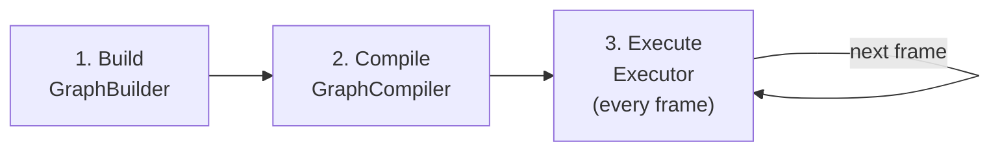
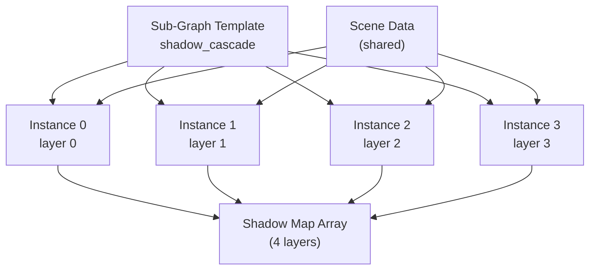
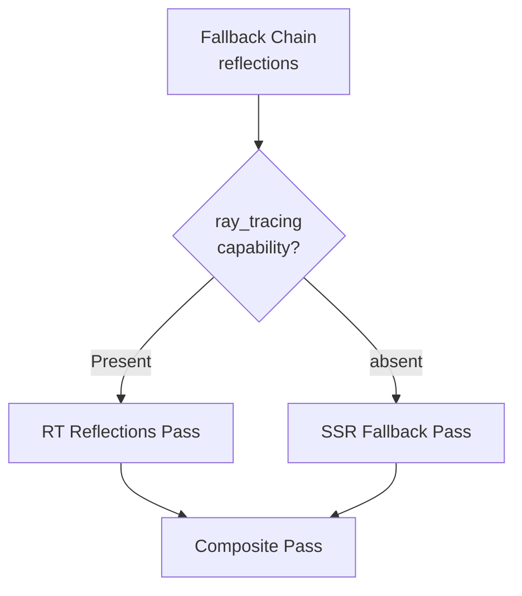
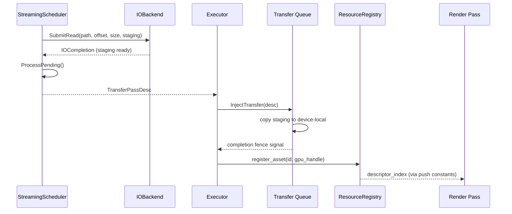
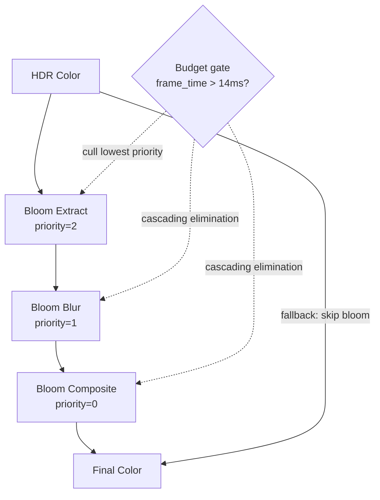

# Integration Examples

Self-contained examples demonstrating how to use the Harmonius GPU graphics framework API.
Each example builds on the types and conventions defined in
[render-graph-design.md](render-graph-design.md),
[render-graph-classes.md](render-graph-classes.md),
[gpu-runtime.md](gpu-runtime.md), and
[asset-pipeline.md](asset-pipeline.md).

All examples assume C++26 and use designated initializers for descriptor construction.
Error handling uses `std::expected`; every fallible call is checked.

---

## Contents

- [Example 1: Minimal Frame (Clear + Present)](#example-1-minimal-frame-clear--present)
- [Example 2: GBuffer + Lighting (Two-Pass Deferred)](#example-2-gbuffer--lighting-two-pass-deferred)
- [Example 3: Shadow Cascades with Sub-Graph Templates](#example-3-shadow-cascades-with-sub-graph-templates)
- [Example 4: Capability-Gated RT Reflections with Fallback](#example-4-capability-gated-rt-reflections-with-fallback)
- [Example 5: Streaming Asset Integration](#example-5-streaming-asset-integration)
- [Example 6: Budget-Gated Post-Processing Chain](#example-6-budget-gated-post-processing-chain)

---

## Example 1: Minimal Frame (Clear + Present)

The simplest possible render graph: a single pass that clears a render target and presents
it. Demonstrates the three-phase lifecycle: build, compile, execute.



```cpp
#include <harmonius/gpu/format.hpp>
#include <harmonius/rg/builder/graph_builder.hpp>
#include <harmonius/rg/compiler/graph_compiler.hpp>
#include <harmonius/rg/exec/executor.hpp>

namespace rg = harmonius::rg;
namespace gpu = harmonius::gpu;
namespace exec = harmonius::rg::exec;

/// Build, compile, and run a minimal clear-and-present frame.
/// \param caps         Hardware capabilities queried from the device.
/// \param allocator    GPU runtime memory allocator.
/// \param tracked_cmd  State-tracked command buffer.
/// \param work_graph_exec  Work graph executor (unused here but required by Executor).
/// \param swapchain    Platform swapchain providing the backbuffer image each frame.
/// \return true on success, false on error.
bool RunMinimalFrame(const rg::gate::CapabilityDescriptor& caps, harmonius::gpu_runtime::memory::Allocator& allocator,
                       harmonius::gpu_runtime::state::TrackedCommandBuffer& tracked_cmd,
                       harmonius::gpu_runtime::work_graph::WorkGraphExecutor& work_graph_exec,
                       gpu::Swapchain& swapchain) {
  // ---------------------------------------------------------------
  // Phase 1: Build the graph (once)
  // ---------------------------------------------------------------
  rg::builder::GraphBuilder builder{caps};

  // Declare the swapchain backbuffer as an imported resource.
  // Imported resources are externally allocated; the render graph
  // only tracks their usage and inserts barriers.
  auto backbuffer = builder.DeclareImported({
      .name = "backbuffer",
      .external_handle = swapchain.CurrentImage(),
      .initial_access = rg::AccessMode::kWrite,
      .initial_usage = rg::UsageType::kColorAttachment,
  });

  // Add a rasterization pass that clears the backbuffer.
  // The executor begins the render pass with load_op::clear
  // automatically when a color attachment is first written.
  auto clear_pass = builder.AddPass({
      .name = "clear",
      .type = rg::PassType::kRasterization,
      .outputs = {{
          .resource = backbuffer,
          .access = rg::AccessMode::kWrite,
          .usage = rg::UsageType::kColorAttachment,
      }},
      .execute =
          [](exec::PassContext& ctx) {
            // Render pass is already begun by the executor.
            // Nothing to record -- the clear load op does the work.
          },
  });

  // Add a present pass that reads the cleared backbuffer.
  auto present_pass = builder.AddPass({
      .name = "present",
      .type = rg::PassType::kPresent,
      .inputs = {{
          .resource = backbuffer,
          .access = rg::AccessMode::kRead,
          .usage = rg::UsageType::kPresent,
      }},
  });

  // Finalize the declared graph.
  auto graph_result = builder.Build();
  if (!graph_result) {
    return false;
  }
  auto& graph = graph_result.value();

  // ---------------------------------------------------------------
  // Phase 2: Compile the graph (once)
  // ---------------------------------------------------------------
  rg::compiler::GraphCompiler compiler;
  auto plan_result = compiler.Compile(graph, caps);
  if (!plan_result) {
    return false;
  }
  auto& plan = plan_result.value();

  // ---------------------------------------------------------------
  // Phase 3: Execute (every frame)
  // ---------------------------------------------------------------
  exec::Executor executor{allocator, tracked_cmd, work_graph_exec};

  // Per-frame loop (simplified -- real applications run until exit).
  executor.BindResource(backbuffer, swapchain.CurrentImage());
  executor.Execute(plan);

  return true;
}
```

---

## Example 2: GBuffer + Lighting (Two-Pass Deferred)

A deferred rendering setup with three passes:

1. **GBuffer pass** (rasterization) -- writes albedo, normal, and depth.
2. **Lighting pass** (compute) -- reads the GBuffer textures and writes the final color.
3. **Present pass** -- reads the final color for presentation.

All intermediate textures are transient: the compiler aliases their memory with other
resources that do not overlap in lifetime.


```cpp
#include <harmonius/gpu/format.hpp>
#include <harmonius/rg/builder/graph_builder.hpp>
#include <harmonius/rg/compiler/graph_compiler.hpp>
#include <harmonius/rg/exec/executor.hpp>

namespace rg = harmonius::rg;
namespace gpu = harmonius::gpu;
namespace exec = harmonius::rg::exec;

/// Build a two-pass deferred rendering graph.
/// \return The compiled execution plan, or an error.
std::expected<rg::compiler::ExecutionPlan, rg::CompileError> BuildDeferredGraph(
    const rg::gate::CapabilityDescriptor& caps, uint32_t width, uint32_t height) {
  rg::builder::GraphBuilder builder{caps};

  // ----- Declare transient GBuffer resources -----

  auto albedo = builder.DeclareTransient({
      .name = "gbuffer_albedo",
      .format = gpu::Format::kRgba8Unorm,
      .width = width,
      .height = height,
  });

  auto normal = builder.DeclareTransient({
      .name = "gbuffer_normal",
      .format = gpu::Format::kRgb10a2Unorm,
      .width = width,
      .height = height,
  });

  auto depth = builder.DeclareTransient({
      .name = "gbuffer_depth",
      .format = gpu::Format::kD32Float,
      .width = width,
      .height = height,
  });

  // Declare the final HDR color target (transient).
  auto hdr_color = builder.DeclareTransient({
      .name = "hdr_color",
      .format = gpu::Format::kRgba16Float,
      .width = width,
      .height = height,
  });

  // ----- GBuffer pass (rasterization) -----

  auto gbuffer_pass = builder.AddPass({
      .name = "gbuffer",
      .type = rg::PassType::kRasterization,
      .queue = rg::QueueAffinity::kGraphics,
      .outputs =
          {
              {albedo, rg::AccessMode::kWrite, rg::UsageType::kColorAttachment},
              {normal, rg::AccessMode::kWrite, rg::UsageType::kColorAttachment},
              {depth, rg::AccessMode::kWrite, rg::UsageType::kDepthAttachment},
          },
      .render_area =
          rg::builder::RenderArea{
              .x = 0,
              .y = 0,
              .width = width,
              .height = height,
          },
      .execute =
          [](exec::PassContext& ctx) {
            auto& cmd = ctx.cmd();

            // Allocate per-draw push constants from the ring buffer.
            auto constants = ctx.AllocateConstants(sizeof(DrawConstants), /*alignment=*/256);
            auto* data = static_cast<DrawConstants*>(constants.mapped_ptr);
            data->view_proj = /* ... */;

            cmd.PushConstants(data, sizeof(DrawConstants), 0);
            cmd.DispatchMesh(/* group_x */ 64, 1, 1);
          },
  });

  // ----- Lighting pass (compute) -----

  auto lighting_pass = builder.AddPass({
      .name = "lighting",
      .type = rg::PassType::kCompute,
      .queue = rg::QueueAffinity::kGraphics,
      .inputs =
          {
              {albedo, rg::AccessMode::kRead, rg::UsageType::kShaderRead},
              {normal, rg::AccessMode::kRead, rg::UsageType::kShaderRead},
              {depth, rg::AccessMode::kRead, rg::UsageType::kShaderRead},
          },
      .outputs =
          {
              {hdr_color, rg::AccessMode::kWrite, rg::UsageType::kStorageWrite},
          },
      .execute =
          [width, height](exec::PassContext& ctx) {
            auto& cmd = ctx.cmd();

            struct LightConstants {
              uint32_t albedo_index;
              uint32_t normal_index;
              uint32_t depth_index;
              uint32_t output_index;
            };

            auto constants = ctx.AllocateConstants(sizeof(LightConstants), 256);
            // Fill in descriptor indices (resolved at bind time).

            cmd.PushConstants(constants.mapped_ptr, sizeof(LightConstants), 0);
            cmd.Dispatch((width + 7) / 8, (height + 7) / 8, 1);
          },
  });

  // ----- Present pass -----

  auto present_pass = builder.AddPass({
      .name = "present",
      .type = rg::PassType::kPresent,
      .inputs = {{
          hdr_color,
          rg::AccessMode::kRead,
          rg::UsageType::kPresent,
      }},
  });

  // ----- Build and compile -----

  auto graph = builder.Build();
  if (!graph) {
    return std::unexpected(graph.error());
  }

  rg::compiler::GraphCompiler compiler;
  return compiler.Compile(graph.value(), caps);
}

/// Execute the deferred rendering graph for one frame.
void ExecuteDeferredFrame(exec::Executor& executor, const rg::compiler::ExecutionPlan& plan,
                            rg::ResourceHandle hdr_color, gpu::ResourceHandle swapchain_image) {
  // Bind the swapchain image to the final output slot.
  // Transient resources (albedo, normal, depth) are managed
  // internally -- no per-frame binding needed.
  executor.BindResource(hdr_color, swapchain_image);
  executor.Execute(plan);
}
```

---

## Example 3: Shadow Cascades with Sub-Graph Templates

Multi-view rendering using sub-graph templates. A shadow render sub-graph is declared once,
then instantiated four times -- one per cascade. Each instance writes to a distinct array
layer of a shared shadow map texture. Scene data is shared across all instances.



```cpp
#include <harmonius/gpu/format.hpp>
#include <harmonius/rg/builder/graph_builder.hpp>
#include <harmonius/rg/compiler/graph_compiler.hpp>
#include <harmonius/rg/exec/executor.hpp>

namespace rg = harmonius::rg;
namespace gpu = harmonius::gpu;
namespace exec = harmonius::rg::exec;

static constexpr uint32_t cascade_count = 4;
static constexpr uint32_t shadow_resolution = 2048;

/// Build a shadow cascade render graph using sub-graph templates.
/// \return The compiled execution plan, or an error.
std::expected<rg::compiler::ExecutionPlan, rg::CompileError> BuildShadowCascadeGraph(
    const rg::gate::CapabilityDescriptor& caps) {
  rg::builder::GraphBuilder builder{caps};

  // ----- Shared resources (visible to all cascade instances) -----

  // Scene geometry buffer -- imported from the mesh pipeline.
  auto scene_data = builder.DeclareImported({
      .name = "scene_data",
      .external_handle = {},  // bound per-frame
      .initial_access = rg::AccessMode::kRead,
      .initial_usage = rg::UsageType::kShaderRead,
  });

  // Shadow map texture array with one layer per cascade.
  auto shadow_map = builder.DeclareTransient({
      .name = "shadow_map",
      .format = gpu::Format::kD32Float,
      .width = shadow_resolution,
      .height = shadow_resolution,
      .array_layers = cascade_count,
  });

  // ----- Declare the sub-graph template -----

  // The template contains a single shadow-render pass.
  // param_slots define which resources are shared vs exclusive.
  auto shadow_template =
      builder.DeclareSubgraphTemplate("shadow_cascade",
                                      {
                                          .name = "shadow_cascade",
                                          .max_instances = cascade_count,
                                          .passes = {{
                                              .name = "shadow_render",
                                              .type = rg::PassType::kRasterization,
                                              .queue = rg::QueueAffinity::kGraphics,
                                              // Inputs/outputs reference param slot indices.
                                              // Slot 0 = SceneData (shared), slot 1 = ShadowMap (exclusive layer).
                                              .inputs = {{
                                                  .resource = rg::ResourceHandle{0},
                                                  .access = rg::AccessMode::kRead,
                                                  .usage = rg::UsageType::kShaderRead,
                                              }},
                                              .outputs = {{
                                                  .resource = rg::ResourceHandle{1},
                                                  .access = rg::AccessMode::kWrite,
                                                  .usage = rg::UsageType::kDepthAttachment,
                                              }},
                                              .render_area =
                                                  rg::builder::RenderArea{
                                                      .x = 0,
                                                      .y = 0,
                                                      .width = shadow_resolution,
                                                      .height = shadow_resolution,
                                                  },
                                              .execute =
                                                  [](exec::PassContext& ctx) {
                                                    auto& cmd = ctx.cmd();

                                                    // Push per-cascade view-projection matrix.
                                                    auto constants =
                                                        ctx.AllocateConstants(sizeof(CascadeConstants), 256);
                                                    auto* data = static_cast<CascadeConstants*>(constants.mapped_ptr);
                                                    // data->light_view_proj = ...

                                                    cmd.PushConstants(data, sizeof(CascadeConstants), 0);
                                                    cmd.DispatchMesh(/* groups */ 32, 1, 1);
                                                  },
                                          }},
                                          .param_slots =
                                              {
                                                  {.name = "scene_data", .is_shared = true},
                                                  {.name = "shadow_layer", .is_shared = false},
                                              },
                                      });

  // ----- Instantiate the template N times -----

  // Build per-instance bindings. Each instance targets a
  // distinct array layer of the shadow map.
  std::vector<rg::builder::SubGraphBindings> bindings;
  bindings.reserve(cascade_count);
  for (uint32_t i = 0; i < cascade_count; ++i) {
    bindings.push_back({
        .exclusive_resources = {shadow_map},
        .shared_resources = {scene_data},
        .target_array_layer = i,
    });
  }

  builder.InstantiateSubgraph(shadow_template, cascade_count, bindings);

  // ----- Build and compile -----

  auto graph = builder.Build();
  if (!graph) {
    return std::unexpected(graph.error());
  }

  rg::compiler::GraphCompiler compiler;
  return compiler.Compile(graph.value(), caps);
}

/// Execute the shadow cascade graph for one frame.
void ExecuteShadowFrame(exec::Executor& executor, const rg::compiler::ExecutionPlan& plan,
                          rg::SubGraphHandle shadow_template, rg::ResourceHandle scene_data,
                          gpu::ResourceHandle scene_buffer) {
  // Bind the scene Buffer (shared across all instances).
  executor.BindResource(scene_data, scene_buffer);

  // Optionally reduce the active cascade count at runtime
  // without recompilation.
  executor.SetInstanceCount(shadow_template, cascade_count);

  executor.Execute(plan);
}
```

---

## Example 4: Capability-Gated RT Reflections with Fallback

Demonstrates the gating system with a fallback chain. When the device supports ray tracing,
an RT reflections pass is selected. Otherwise, a screen-space reflections (SSR) compute pass
is automatically substituted. The compiler eliminates the unused pass and its exclusive
resources.



```cpp
#include <harmonius/gpu/format.hpp>
#include <harmonius/rg/builder/graph_builder.hpp>
#include <harmonius/rg/compiler/graph_compiler.hpp>
#include <harmonius/rg/exec/executor.hpp>
#include <harmonius/rg/gate/capability_descriptor.hpp>

namespace rg = harmonius::rg;
namespace gpu = harmonius::gpu;
namespace exec = harmonius::rg::exec;
namespace gate = harmonius::rg::gate;

/// Build a reflection graph with RT / SSR fallback.
/// \return The compiled execution plan, or an error.
std::expected<rg::compiler::ExecutionPlan, rg::CompileError> BuildReflectionGraph(
    const gate::CapabilityDescriptor& caps, uint32_t width, uint32_t height) {
  rg::builder::GraphBuilder builder{caps};

  // ----- Input resources -----

  auto gbuffer_depth = builder.DeclareImported({
      .name = "gbuffer_depth",
      .external_handle = {},  // bound per-frame
      .initial_access = rg::AccessMode::kRead,
      .initial_usage = rg::UsageType::kShaderRead,
  });

  auto gbuffer_normal = builder.DeclareImported({
      .name = "gbuffer_normal",
      .external_handle = {},  // bound per-frame
      .initial_access = rg::AccessMode::kRead,
      .initial_usage = rg::UsageType::kShaderRead,
  });

  auto hdr_color = builder.DeclareImported({
      .name = "hdr_color",
      .external_handle = {},  // bound per-frame
      .initial_access = rg::AccessMode::kRead,
      .initial_usage = rg::UsageType::kShaderRead,
  });

  // Acceleration structure for RT (only allocated when RT is active).
  auto tlas = builder.DeclareAccelerationStructure({
      .name = "scene_tlas",
      .category = rg::ResourceCategory::kPersistent,
  });

  // Reflection output -- transient, used by whichever pass is active.
  auto reflection_output = builder.DeclareTransient({
      .name = "reflection_output",
      .format = gpu::Format::kRgba16Float,
      .width = width,
      .height = height,
  });

  // ----- RT reflections pass -----

  auto rt_reflection_pass = builder.AddPass({
      .name = "rt_reflections",
      .type = rg::PassType::kRayTracingDispatch,
      .queue = rg::QueueAffinity::kGraphics,
      .inputs =
          {
              {gbuffer_depth, rg::AccessMode::kRead, rg::UsageType::kShaderRead},
              {gbuffer_normal, rg::AccessMode::kRead, rg::UsageType::kShaderRead},
              {hdr_color, rg::AccessMode::kRead, rg::UsageType::kShaderRead},
              {tlas, rg::AccessMode::kRead, rg::UsageType::kAccelerationStructureRead},
          },
      .outputs = {{
          reflection_output,
          rg::AccessMode::kWrite,
          rg::UsageType::kStorageWrite,
      }},
      .execute =
          [width, height](exec::PassContext& ctx) {
            auto& cmd = ctx.cmd();
            cmd.TraceRays({
                .width = width,
                .height = height,
                .depth = 1,
            });
          },
  });

  // Attach a soft capability gate: RT reflections require ray_tracing.
  // If the capability is absent the pass is silently removed.
  builder.AttachCapabilityGate(rt_reflection_pass, {
                                                         .required_capability = "ray_tracing",
                                                         .hard = false,  // soft gate -- do not fail compilation
                                                     });

  // ----- SSR fallback pass (compute) -----

  auto ssr_pass = builder.AddPass({
      .name = "ssr_fallback",
      .type = rg::PassType::kCompute,
      .queue = rg::QueueAffinity::kGraphics,
      .inputs =
          {
              {gbuffer_depth, rg::AccessMode::kRead, rg::UsageType::kShaderRead},
              {gbuffer_normal, rg::AccessMode::kRead, rg::UsageType::kShaderRead},
              {hdr_color, rg::AccessMode::kRead, rg::UsageType::kShaderRead},
          },
      .outputs = {{
          reflection_output,
          rg::AccessMode::kWrite,
          rg::UsageType::kStorageWrite,
      }},
      .execute =
          [width, height](exec::PassContext& ctx) {
            auto& cmd = ctx.cmd();
            cmd.Dispatch((width + 7) / 8, (height + 7) / 8, 1);
          },
  });

  // ----- Declare the fallback chain -----

  // The compiler tries each entry in order. The first whose
  // capability gate is satisfied becomes the active pass.
  // When RT is available, rt_reflections is selected.
  // Otherwise, ssr_fallback is selected (no gate).
  std::array<gate::FallbackEntry, 2> entries = {{
      {
          .pass = rt_reflection_pass,
          .capability_gate =
              gate::CapabilityGateDesc{
                  .required_capability = "ray_tracing",
                  .hard = false,
              },
      },
      {
          .pass = ssr_pass,
          // No gate -- always satisfiable as a last resort.
      },
  }};

  builder.DeclareFallbackChain("reflections", entries);

  // ----- Build and compile -----

  auto graph = builder.Build();
  if (!graph) {
    return std::unexpected(graph.error());
  }

  rg::compiler::GraphCompiler compiler;
  return compiler.Compile(graph.value(), caps);
}
```

---

## Example 5: Streaming Asset Integration

Shows how the asset pipeline integrates with the render graph for streaming. The
`StreamingScheduler` submits IO requests, produces `TransferPassDesc` entries, and the
executor injects them as transfer passes. After the completion fence signals, the
`ResourceRegistry` resolves bindless descriptor indices that shaders use via push constants.



```cpp
#include <harmonius/asset/resource_registry.hpp>
#include <harmonius/asset/streaming_scheduler.hpp>
#include <harmonius/gpu/format.hpp>
#include <harmonius/rg/builder/graph_builder.hpp>
#include <harmonius/rg/compiler/graph_compiler.hpp>
#include <harmonius/rg/exec/executor.hpp>

namespace rg = harmonius::rg;
namespace gpu = harmonius::gpu;
namespace exec = harmonius::rg::exec;
namespace asset = harmonius::asset;

/// Demonstrates streaming asset integration within a frame.
///
/// The flow has five stages:
///   1. StreamingScheduler submits IO requests for needed assets.
///   2. ProcessPending() returns TransferPassDesc entries for
///      completed IO reads.
///   3. Executor::InjectTransfer() injects them into the frame.
///   4. After the completion fence, ResourceRegistry resolves the
///      bindless descriptor index.
///   5. The render pass accesses the asset via push constants using
///      the descriptor index for bindless access.
void StreamingFrame(exec::Executor& executor, const rg::compiler::ExecutionPlan& plan,
                     asset::StreamingScheduler& scheduler, asset::ResourceRegistry& registry,
                     const std::vector<asset::StreamRequest>& requests) {
  // ---------------------------------------------------------------
  // Stage 1: Submit streaming requests
  // ---------------------------------------------------------------
  // The scheduler evaluates camera distance and priority to decide
  // which chunks to load this frame.
  scheduler.Request(requests);

  // ---------------------------------------------------------------
  // Stage 2: Process pending IO completions
  // ---------------------------------------------------------------
  // ProcessPending() polls the platform IO backend for completed
  // reads, allocates device-local memory from the pool, and returns
  // TransferPassDesc entries describing the staging-to-device copies.
  auto transfers = scheduler.ProcessPending();

  // ---------------------------------------------------------------
  // Stage 3: Inject transfer passes into the executor
  // ---------------------------------------------------------------
  // Each TransferPassDesc carries a completion_fence_value that the
  // host can poll or wait on. The executor validates queue
  // compatibility and inserts barriers automatically.
  for (const auto& transfer : transfers) {
    executor.InjectTransfer(transfer);
  }

  // ---------------------------------------------------------------
  // Stage 4: Execute the frame
  // ---------------------------------------------------------------
  // The executor runs transfer passes before graphics passes,
  // respecting fence dependencies. When a transfer completes
  // (fence signals), the uploaded resource is GPU-visible.
  executor.Execute(plan);

  // ---------------------------------------------------------------
  // Stage 5: Register newly resident assets
  // ---------------------------------------------------------------
  // After execution, check which transfers have completed by
  // polling their fence values. Register completed assets in the
  // resource registry so that subsequent frames can access them
  // via bindless descriptor indices.
  for (const auto& transfer : transfers) {
    // The fence value is set by the executor during submission.
    // In practice, completion is checked on the next frame
    // after the fence has had time to signal.
  }
}

/// Example render pass that uses a streamed asset via bindless access.
/// The descriptor_index is resolved from the ResourceRegistry and
/// passed to the shader through push constants.
void RecordTexturedMeshPass(exec::PassContext& ctx, const asset::ResourceRegistry& registry,
                               asset::AssetHandle texture_handle) {
  auto& cmd = ctx.cmd();

  // Resolve the bindless descriptor index for the streamed texture.
  auto index_result = registry.ResolveDescriptorIndex(texture_handle);
  if (!index_result) {
    // Asset not yet resident -- skip or use fallback.
    return;
  }

  struct MeshConstants {
    uint32_t texture_index;  // bindless descriptor index
    uint32_t mesh_offset;
    uint32_t instance_count;
  };

  auto constants = ctx.AllocateConstants(sizeof(MeshConstants), 256);
  auto* data = static_cast<MeshConstants*>(constants.mapped_ptr);

  data->texture_index = index_result.value();
  data->mesh_offset = 0;
  data->instance_count = 1;

  cmd.PushConstants(data, sizeof(MeshConstants), 0);
  cmd.DispatchMesh(/* groups */ 16, 1, 1);
}
```

---

## Example 6: Budget-Gated Post-Processing Chain

Demonstrates budget gating with a post-processing chain. Three bloom passes are declared
as a chain with budget gates attached. When the frame time exceeds the threshold, the
lowest-priority pass is culled first, and cascading dead-pass elimination removes its
dependents.



```cpp
#include <harmonius/gpu/format.hpp>
#include <harmonius/rg/builder/graph_builder.hpp>
#include <harmonius/rg/compiler/graph_compiler.hpp>
#include <harmonius/rg/exec/executor.hpp>
#include <harmonius/rg/gate/capability_descriptor.hpp>

namespace rg = harmonius::rg;
namespace gpu = harmonius::gpu;
namespace exec = harmonius::rg::exec;
namespace gate = harmonius::rg::gate;

/// Build a post-processing chain with budget gates.
/// When the GPU frame time exceeds thresholds, bloom passes are
/// progressively culled to maintain the target frame rate.
/// \return The compiled execution plan, or an error.
std::expected<rg::compiler::ExecutionPlan, rg::CompileError> BuildBloomChain(const gate::CapabilityDescriptor& caps,
                                                                               uint32_t width, uint32_t height) {
  rg::builder::GraphBuilder builder{caps};

  // ----- Input resource (HDR scene color) -----

  auto hdr_color = builder.DeclareImported({
      .name = "hdr_color",
      .external_handle = {},  // bound per-frame
      .initial_access = rg::AccessMode::kRead,
      .initial_usage = rg::UsageType::kShaderRead,
  });

  // ----- Intermediate bloom textures (transient) -----

  const uint32_t bloom_w = width / 2;
  const uint32_t bloom_h = height / 2;

  auto bloom_extract_tex = builder.DeclareTransient({
      .name = "bloom_extract",
      .format = gpu::Format::kRgba16Float,
      .width = bloom_w,
      .height = bloom_h,
  });

  auto bloom_blur_tex = builder.DeclareTransient({
      .name = "bloom_blur",
      .format = gpu::Format::kRgba16Float,
      .width = bloom_w,
      .height = bloom_h,
  });

  // Final output (where composite writes, or HDR passes through).
  auto final_color = builder.DeclareTransient({
      .name = "final_color",
      .format = gpu::Format::kRgba16Float,
      .width = width,
      .height = height,
  });

  // ----- Declare the bloom chain -----
  // Chains let the graph know these passes form a logical unit.
  // Budget gates on the chain head cascade elimination to all steps.

  auto bloom_chain = builder.BeginChain("bloom");

  // Step 1: Bloom extract -- threshold bright pixels.
  auto bloom_extract = builder.AddChainStep(
      bloom_chain,
      {
          .name = "bloom_extract",
          .type = rg::PassType::kCompute,
          .queue = rg::QueueAffinity::kGraphics,
          .inputs = {{
              hdr_color,
              rg::AccessMode::kRead,
              rg::UsageType::kShaderRead,
          }},
          .outputs = {{
              bloom_extract_tex,
              rg::AccessMode::kWrite,
              rg::UsageType::kStorageWrite,
          }},
          .estimated_cost_ms = 0.3f,
          .priority = 2,
          .execute = [bloom_w,
                      bloom_h](exec::PassContext& ctx) { ctx.cmd().Dispatch((bloom_w + 7) / 8, (bloom_h + 7) / 8, 1); },
      });

  // Step 2: Bloom blur -- Gaussian blur on extracted pixels.
  auto bloom_blur = builder.AddChainStep(
      bloom_chain,
      {
          .name = "bloom_blur",
          .type = rg::PassType::kCompute,
          .queue = rg::QueueAffinity::kGraphics,
          .inputs = {{
              bloom_extract_tex,
              rg::AccessMode::kRead,
              rg::UsageType::kShaderRead,
          }},
          .outputs = {{
              bloom_blur_tex,
              rg::AccessMode::kWrite,
              rg::UsageType::kStorageWrite,
          }},
          .estimated_cost_ms = 0.5f,
          .priority = 1,
          .execute = [bloom_w,
                      bloom_h](exec::PassContext& ctx) { ctx.cmd().Dispatch((bloom_w + 7) / 8, (bloom_h + 7) / 8, 1); },
      });

  // Step 3: Bloom composite -- blend bloom back onto HDR color.
  auto bloom_composite = builder.AddChainStep(
      bloom_chain,
      {
          .name = "bloom_composite",
          .type = rg::PassType::kCompute,
          .queue = rg::QueueAffinity::kGraphics,
          .inputs =
              {
                  {hdr_color, rg::AccessMode::kRead, rg::UsageType::kShaderRead},
                  {bloom_blur_tex, rg::AccessMode::kRead, rg::UsageType::kShaderRead},
              },
          .outputs = {{
              final_color,
              rg::AccessMode::kWrite,
              rg::UsageType::kStorageWrite,
          }},
          .estimated_cost_ms = 0.2f,
          .priority = 0,
          .execute = [width,
                      height](exec::PassContext& ctx) { ctx.cmd().Dispatch((width + 7) / 8, (height + 7) / 8, 1); },
      });

  builder.EndChain(bloom_chain);

  // ----- Attach timestamp queries for GPU timing feedback -----

  builder.AttachTimestampQuery(bloom_extract, "bloom_extract");
  builder.AttachTimestampQuery(bloom_blur, "bloom_blur");
  builder.AttachTimestampQuery(bloom_composite, "bloom_composite");

  // ----- Attach budget gates -----
  // Each gate references a timestamp query and a threshold in ms.
  // When the measured GPU time exceeds the threshold, the pass is
  // culled. Priority determines culling order: lower priority
  // passes are culled first.
  //
  // Because bloom_extract produces bloom_extract_tex which is the
  // sole input to bloom_blur, culling bloom_extract triggers
  // cascading dead-pass elimination of bloom_blur and
  // bloom_composite.

  builder.AttachBudgetGate(bloom_extract, {
                                                .timestamp_query_name = "bloom_extract",
                                                .threshold_ms = 14.0f,
                                                .priority = 2,
                                            });

  builder.AttachBudgetGate(bloom_blur, {
                                             .timestamp_query_name = "bloom_blur",
                                             .threshold_ms = 15.0f,
                                             .priority = 1,
                                         });

  builder.AttachBudgetGate(bloom_composite, {
                                                  .timestamp_query_name = "bloom_composite",
                                                  .threshold_ms = 16.0f,
                                                  .priority = 0,
                                              });

  // ----- Fallback: when bloom is entirely culled -----
  // A simple pass-through that copies HDR color to final color
  // without bloom. This is the last entry in the chain and has
  // no budget gate, so it is always satisfiable.

  auto passthrough = builder.AddPass({
      .name = "bloom_passthrough",
      .type = rg::PassType::kCompute,
      .queue = rg::QueueAffinity::kGraphics,
      .inputs = {{
          hdr_color,
          rg::AccessMode::kRead,
          rg::UsageType::kShaderRead,
      }},
      .outputs = {{
          final_color,
          rg::AccessMode::kWrite,
          rg::UsageType::kStorageWrite,
      }},
      .execute = [width, height](exec::PassContext& ctx) { ctx.cmd().Dispatch((width + 7) / 8, (height + 7) / 8, 1); },
  });

  // Present the final color.
  auto present = builder.AddPass({
      .name = "present",
      .type = rg::PassType::kPresent,
      .inputs = {{
          final_color,
          rg::AccessMode::kRead,
          rg::UsageType::kPresent,
      }},
  });

  // ----- Build and compile -----

  auto graph = builder.Build();
  if (!graph) {
    return std::unexpected(graph.error());
  }

  rg::compiler::GraphCompiler compiler;
  return compiler.Compile(graph.value(), caps);
}

/// Per-frame execution with runtime budget threshold adjustment.
/// The executor evaluates budget gates against GPU timing from the
/// previous frame and culls passes that exceed their threshold.
void ExecuteBloomFrame(exec::Executor& executor, const rg::compiler::ExecutionPlan& plan,
                         rg::GateHandle bloom_extract_gate, rg::ResourceHandle hdr_color,
                         gpu::ResourceHandle swapchain_image, float target_frame_time_ms) {
  // Bind the HDR color input for this frame.
  executor.BindResource(hdr_color, swapchain_image);

  // Adjust the budget threshold dynamically. When the application
  // detects sustained frame drops, it can tighten the threshold
  // to cull bloom earlier.
  executor.SetBudgetThreshold(bloom_extract_gate, target_frame_time_ms);

  // Execute. The executor reads GPU timestamp results from the
  // previous frame, evaluates budget gates, culls passes that
  // exceed their thresholds, and cascades elimination to
  // dependent passes.
  executor.Execute(plan);
}
```
