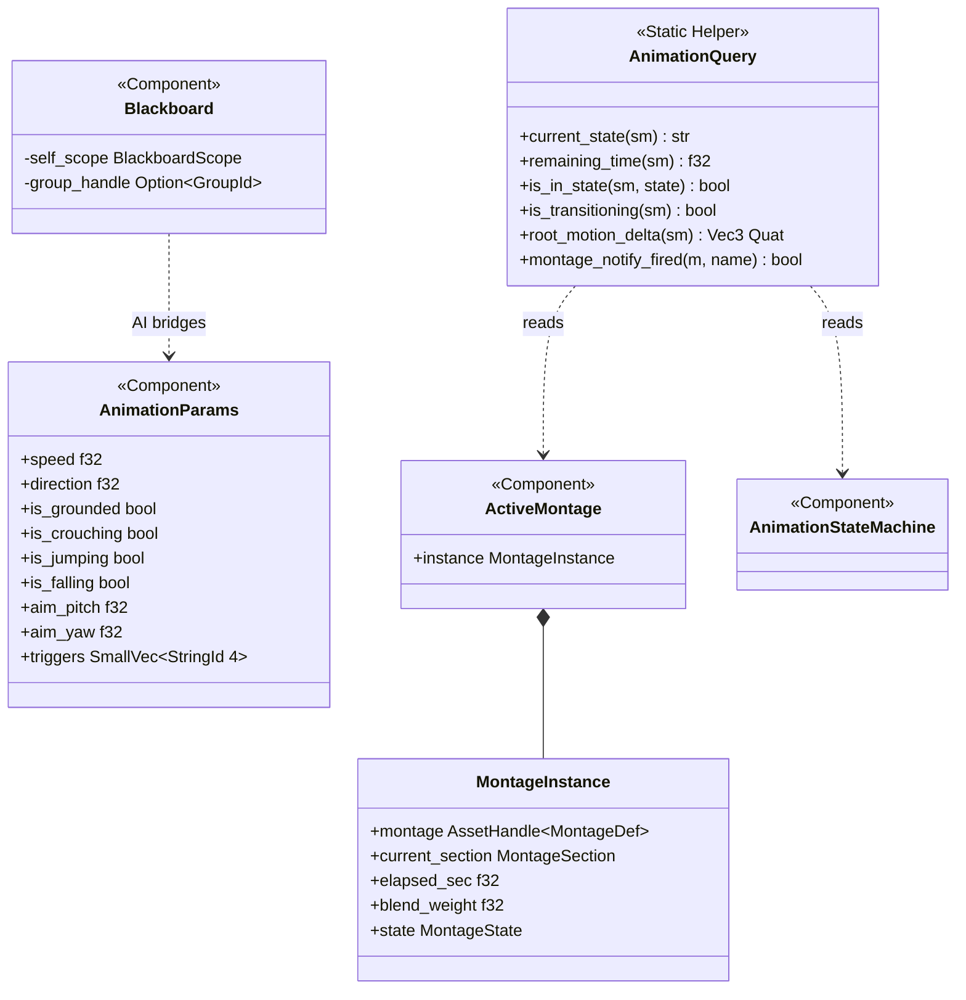
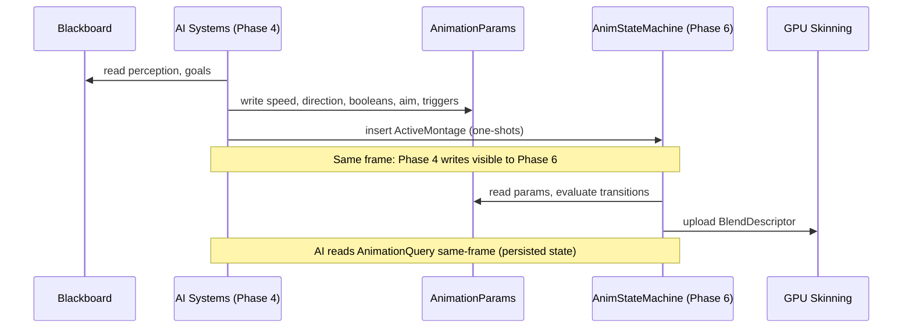

# AI Behavior ↔ Animation Integration Design

## Systems Involved

| System | Design | Domain |
|--------|--------|--------|
| AI Behavior | [behavior.md](../ai/behavior.md) | AI |
| Animation SM | [state-machine.md](../animation/state-machine.md) | Animation |

## Integration Requirements

| ID | Requirement | Systems |
|----|-------------|---------|
| IR-1.1.1 | BT/GOAP actions write animation params | AI, Anim |
| IR-1.1.2 | AI reads animation state for conditions | AI, Anim |
| IR-1.1.3 | AI state transitions trigger montages | AI, Anim |
| IR-1.1.4 | Locomotion speed/dir drive blend space | AI, Anim |
| IR-1.1.5 | AI budget includes animation eval cost | AI, Anim |

1. **IR-1.1.1** -- BT leaf nodes and GOAP action execution write `AnimationParams` component values
   (speed, direction, booleans, aim offsets, triggers) consumed by the animation state machine's
   transition conditions.
2. **IR-1.1.2** -- AI condition nodes call `AnimationQuery` methods (current state, remaining time,
   transition status) to gate transitions on animation completion. Results are available same-frame
   because animation runs in Phase 6 of the previous frame, and AI reads the persisted component
   state at the start of its Phase 4.
3. **IR-1.1.3** -- AI state machine transitions (e.g., Combat enter) insert `ActiveMontage`
   components to play one-shot attack/react anims.
4. **IR-1.1.4** -- Navigation leaf nodes write locomotion speed and move direction into
   `AnimationParams`, driving 2D blend spaces for walk/run/strafe. AI also writes `is_grounded`,
   `is_crouching`, `is_jumping`, `is_falling`, `aim_pitch`, and `aim_yaw` when controlling NPC
   locomotion and posture.
5. **IR-1.1.5** -- Combined AI + animation evaluation for 500 agents stays under 2 ms per frame
   (US-9.4.10.3). The AI `FrameBudget` accounts for animation evaluation cost via a shared budget
   reservation protocol.

## Data Contracts

| Type | Defined in | Consumed by | Purpose |
|------|-----------|-------------|---------|
| `AnimationParams` | Animation | AI (write) | Shared params |
| `AnimationQuery` | Animation | AI (call) | Query API |
| `ActiveMontage` | Animation | AI (insert) | One-shots |

1. **`AnimationParams`** -- ECS component written by AI (Phase 4), read by animation state machine
   (Phase 6). Matches upstream `state-machine.md` definition.
2. **`AnimationQuery`** -- static query helper with methods that read `AnimationStateMachine`
   component state. Not a component itself. AI systems call these methods during Phase 4 to read
   state persisted from the previous frame's Phase 6 evaluation.
3. **`ActiveMontage`** -- ECS component inserted by AI to trigger one-shot animations. Contains a
   `MontageInstance` with playback state.

```rust
/// Written by AI systems in Phase 4,
/// read by animation eval in Phase 6.
/// Stored as a component on the entity.
/// Matches state-machine.md line 2549.
#[derive(Component)]
pub struct AnimationParams {
    pub speed: f32,
    pub direction: f32,
    pub is_grounded: bool,
    pub is_crouching: bool,
    pub is_jumping: bool,
    pub is_falling: bool,
    pub aim_pitch: f32,
    pub aim_yaw: f32,
    pub triggers: SmallVec<[StringId; 4]>,
}

/// Static query helper for AI systems to read
/// animation state. Not an ECS component.
/// Matches state-machine.md line 1697.
pub struct AnimationQuery;

impl AnimationQuery {
    /// Current state node name.
    pub fn current_state(
        sm: &AnimationStateMachine,
    ) -> &str;

    /// Remaining time in the current clip.
    pub fn remaining_time(
        sm: &AnimationStateMachine,
    ) -> f32;

    /// Whether a specific state is active.
    pub fn is_in_state(
        sm: &AnimationStateMachine,
        state: StateNodeId,
    ) -> bool;

    /// Whether a transition is in progress.
    pub fn is_transitioning(
        sm: &AnimationStateMachine,
    ) -> bool;

    /// Root motion displacement this frame.
    pub fn root_motion_delta(
        sm: &AnimationStateMachine,
    ) -> (Vec3, Quat);

    /// Whether a montage notify has fired.
    pub fn montage_notify_fired(
        montage: &ActiveMontage,
        notify_name: &str,
    ) -> bool;
}
```

> **Note on `StringId`**: The animation subsystem uses `StringId` for runtime identifiers (bone
> names, triggers, event markers) and `FixedString` for asset definition names. `StringId` is a
> hashed string identifier optimized for fast comparison; `FixedString` is an inline fixed-capacity
> string for asset data. Both types are defined in `core-runtime`. This integration uses `StringId`
> for triggers, consistent with the upstream `AnimationParams` definition.
>
> **Note on `Blackboard` and `HashMap`**: The upstream `Blackboard` design (`behavior.md`) uses
> `HashMap<BlackboardKey, BlackboardValue>` inside `BlackboardScope`. This is a constraint
> violation: blackboards are hot-path structures (thousands to millions of instances).
> `BlackboardScope` must use `BTreeMap` or a sorted `Vec` instead of `HashMap`. This integration
> does not depend on `Blackboard` internals -- AI reads the blackboard for its own decisions and
> writes results to `AnimationParams`. The animation system never reads the blackboard directly.

## Class Diagram



## Data Flow



## Timing and Ordering

| System | Phase | Timestep | Order |
|--------|-------|----------|-------|
| AI Behavior | 4-AI | Variable | First |
| Animation SM | 6-Animation | Variable | After AI |

AI writes `AnimationParams` and inserts `ActiveMontage` during Phase 4. Animation reads them in
Phase 6, two phases later in the same frame. No channel or sync primitive needed -- ECS component
writes in Phase 4 are visible to Phase 6 reads.

**No one-frame delay for animation state reads.** AI reads `AnimationQuery` methods against the
`AnimationStateMachine` component, which was written by Phase 6 of the previous frame and persists
as ECS state. This means AI in Phase 4 reads the result of the immediately preceding Phase 6 --
same-frame from the AI system's perspective, with no skipped frames. The animation state machine
determines which animation to play immediately in the same frame as the AI trigger.

**Phase ordering for same-frame response:**

1. **Phase 4 (AI):** AI reads `AnimationStateMachine` (persisted from last frame's Phase 6), makes
   decisions, writes `AnimationParams`, inserts `ActiveMontage`.
2. **Phase 6 (Animation):** State machine reads `AnimationParams`, evaluates transitions, updates
   `AnimationStateMachine` component. The chosen animation begins blending this frame.

## Failure Modes

| ID | Failure | Impact | Recovery |
|----|---------|--------|----------|
| FM-1 | Missing AnimationParams | No transition | Default idle |
| FM-2 | Invalid trigger ID | Trigger ignored | Log warn, stay |
| FM-3 | Montage asset missing | No one-shot | Log error, skip |
| FM-4 | Budget exceeded | AI truncated | Time-slice next |

**Fallback paths:**

1. **FM-1 (Missing `AnimationParams`):** If an entity has an `AnimationStateMachine` but no
   `AnimationParams` component, the state machine uses default parameter values (speed=0, all
   booleans false, no triggers). The entity remains in idle state. Logged as `warn` once per entity.
2. **FM-2 (Invalid trigger ID):** If a `StringId` in the triggers list does not match any transition
   condition, the trigger is consumed and discarded. Logged as `warn` with the unrecognized trigger
   ID. The state machine continues evaluating remaining triggers and parameter-based conditions.
3. **FM-3 (Montage asset missing):** If the `AssetHandle<MontageDef>` in an inserted `ActiveMontage`
   references an unloaded or missing asset, the `ActiveMontage` component is removed and the state
   machine continues with the current state. Logged as `error` with the asset ID.
4. **FM-4 (Budget exceeded):** When `FrameBudget` is exhausted, remaining AI agents are deferred to
   the next frame via time-slicing. Deferred agents retain their previous `AnimationParams` values
   -- the animation state machine continues evaluating with stale parameters. No visible hitch for
   agents whose params change slowly (patrol, idle). Logged as `debug` with the count of deferred
   agents.

## Platform Considerations

None -- identical across all platforms. Both AI and animation systems are pure CPU ECS logic with no
platform-specific code paths.

## Test Plan

See companion [ai-animation-test-cases.md](ai-animation-test-cases.md).

## Review Feedback

1. **[APPLIED]** The `AnimationQuery` struct here uses `active_state: StateNodeId` and
   `normalized_time`, but the animation state-machine design (`state-machine.md` line 2619) defines
   it with `current_state: StateId`, `state_elapsed`, `active_montage: Option<MontageId>`, and
   `root_motion_delta: Vec3`. The integration doc must match the upstream definition exactly.
   **Fix:** Replaced the data struct with the upstream static query helper pattern from
   `state-machine.md` line 1697, exposing `current_state()`, `remaining_time()`, `is_in_state()`,
   `is_transitioning()`, `root_motion_delta()`, and `montage_notify_fired()` methods.

2. **[APPLIED]** The data contract table lists `ParameterMap` as the shared type, but the Rust
   pseudocode defines a separate `AnimationParams` struct with different fields (`speed`,
   `direction`, `triggers`). The upstream animation design (`state-machine.md` line 2549) uses
   `AnimationParams` as the component name with a richer field set (including `is_grounded`,
   `is_crouching`, `is_jumping`, `is_falling`, `aim_pitch`, `aim_yaw`). The table should say
   `AnimationParams`, not `ParameterMap`, and the pseudocode should match the upstream struct.
   **Fix:** Renamed table entry to `AnimationParams`. Updated pseudocode to match upstream with all
   fields. Updated sequence diagram participant and messages. Updated failure mode table references.

3. **[APPLIED]** The `AnimationParams` pseudocode uses `SmallVec<[StringId; 4]>` for triggers, but
   the upstream animation design uses the same type. However, `StringId` is not defined anywhere in
   the animation or AI designs -- the animation design uses `FixedString` for its string types.
   Clarify whether `StringId` is an alias for `FixedString` or a distinct type, and ensure
   consistency. **Fix:** Added note explaining `StringId` (hashed runtime identifier) vs
   `FixedString` (inline fixed-capacity string for asset defs). Both defined in `core-runtime`.
   Triggers use `StringId` consistent with upstream `AnimationParams`.

4. **[APPLIED]** The data contract table lists `Blackboard` as consumed by Animation, but the design
   body never describes how or why the animation system reads the blackboard. The data flow diagram
   and Timing section only show AI reading the blackboard. Either remove `Blackboard` from the
   contracts table or document the animation system's use of it. **Fix:** Removed `Blackboard` from
   the data contracts table. Added note clarifying that AI reads the blackboard for its own
   decisions and bridges results to `AnimationParams`. Animation never reads the blackboard
   directly. `Blackboard` remains in class diagram to show the bridging relationship.

5. **[APPLIED]** The design CLAUDE.md requires every design to have a Mermaid `classDiagram`
   covering all types, structs, enums, traits, and relationships. This document has no
   `classDiagram` -- only a `sequenceDiagram`. Add a class diagram showing `AnimationParams`,
   `AnimationQuery`, `ActiveMontage`, `Blackboard`, and their relationships. **Fix:** Added class
   diagram section with `AnimationParams`, `AnimationQuery`, `ActiveMontage`, `MontageInstance`,
   `AnimationStateMachine`, and `Blackboard` including all fields and relationships.

6. **[APPLIED]** The upstream `Blackboard` design (`behavior.md` line 702) uses
   `HashMap<BlackboardKey, BlackboardValue>` inside `BlackboardScope`. This violates the engine
   constraint "No HashMap on hot paths (sorted Vec/BTreeMap only)". While this is an upstream issue,
   this integration doc should note the constraint or avoid referencing `Blackboard` internals that
   rely on HashMap. **Fix:** Added note flagging the `HashMap` constraint violation in
   `BlackboardScope`. Documented that blackboards are hot-path (thousands to millions of instances)
   and must use `BTreeMap` or sorted `Vec`. This integration does not depend on `Blackboard`
   internals.

7. **[APPLIED]** The `AnimationParams` pseudocode defines a flat struct with `speed`, `direction`,
   and `triggers`. The upstream `AnimationParams` has additional boolean fields (`is_grounded`,
   `is_crouching`, `is_jumping`, `is_falling`) and aim offsets (`aim_pitch`, `aim_yaw`). Should AI
   systems also write these additional fields, or are they exclusively player-driven? This affects
   the completeness of IR-1.1.1 and IR-1.1.4. **Decision:** AI systems write all `AnimationParams`
   fields when controlling NPC locomotion and posture. Updated pseudocode to include all upstream
   fields. Updated IR-1.1.4 description to list the additional fields AI writes.

8. **[DISMISSED]** No 2.5D or 3D dimensionality considerations are discussed. The constraint
   "2D/2.5D/3D support required in every subsystem" means the design should at minimum state whether
   AI-to-animation integration differs across 2D sprite-based, 2.5D isometric, and 3D skeletal
   animation pipelines, even if the answer is that the `AnimationParams` interface is identical.
   **Decision:** 2D/2.5D scope does not need to be addressed in this integration design.

9. **[APPLIED]** The test case companion file has no negative/error-path tests for the failure modes
   listed in the design (missing `AnimationParams`, invalid trigger ID, montage asset missing,
   budget exceeded). Each failure mode in the table should have at least one corresponding test case
   verifying the recovery behavior. **Fix:** Added four error-path test cases (TC-IR-1.1.E1 through
   TC-IR-1.1.E4) to the companion test case file, one per failure mode, verifying the documented
   recovery behavior.

10. **[APPLIED]** IR-1.1.5 references US-9.4.10.3 for the 500-agent budget target. The test case
    TC-IR-1.1.5.1 and benchmark TC-IR-1.1.5.B1 test this, but the design does not describe the
    time-slicing mechanism or how AI budget accounting includes animation cost. Should this
    integration doc specify the budget-sharing protocol, or is that fully owned by the AI behavior
    design? **Decision:** Added budget-sharing protocol description to IR-1.1.5. Documented
    `FrameBudget` reservation in the integration requirements. Documented time-slicing fallback
    behavior in FM-4.

11. **[APPLIED]** The `AnimationQuery` in the pseudocode is a plain struct, not an ECS component.
    The upstream design defines it as a static query helper (`pub struct AnimationQuery;` with
    `impl` methods at line 1697). The integration doc should clarify whether `AnimationQuery` is a
    component read by AI or a query API called by AI systems, and match the upstream pattern.
    **Fix:** Replaced the data struct with the upstream static query helper (unit struct + `impl`
    methods). Updated data contract table to say "AI (call)" instead of "AI (read)". Updated
    contract detail list to describe it as a query API. Removed one-frame delay language from timing
    section -- AI reads persisted `AnimationStateMachine` component state same-frame.
