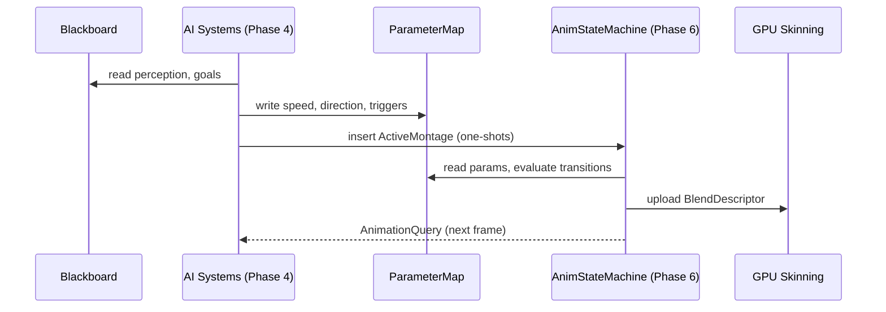

# AI Behavior ↔ Animation Integration Design

## Systems Involved

| System | Design | Domain |
|--------|--------|--------|
| AI Behavior | [behavior.md](../ai/behavior.md) | AI |
| Animation SM | [state-machine.md](../animation/state-machine.md) | Animation |

## Integration Requirements

| ID | Requirement | Systems |
|----|-------------|---------|
| IR-1.1.1 | BT/GOAP actions write animation params | AI, Anim |
| IR-1.1.2 | AI reads animation state for conditions | AI, Anim |
| IR-1.1.3 | AI state transitions trigger montages | AI, Anim |
| IR-1.1.4 | Locomotion speed/dir drive blend space | AI, Anim |
| IR-1.1.5 | AI budget includes animation eval cost | AI, Anim |

1. **IR-1.1.1** -- BT leaf nodes and GOAP action execution write `ParameterMap` values (speed,
   direction, triggers) consumed by the animation state machine's transition conditions.
2. **IR-1.1.2** -- AI condition nodes read `AnimationQuery` (current state, normalized time,
   remaining duration) to gate transitions on animation completion.
3. **IR-1.1.3** -- AI state machine transitions (e.g., Combat enter) insert `ActiveMontage`
   components to play one-shot attack/react anims.
4. **IR-1.1.4** -- Navigation leaf nodes write locomotion speed and move direction into
   `ParameterMap`, driving 2D blend spaces for walk/run/strafe.
5. **IR-1.1.5** -- Combined AI + animation evaluation for 500 agents stays under 2 ms per frame
   (US-9.4.10.3).

## Data Contracts

| Type | Defined in | Consumed by | Purpose |
|------|-----------|-------------|---------|
| `ParameterMap` | Animation | AI (write) | Shared params |
| `AnimationQuery` | Animation | AI (read) | State query |
| `ActiveMontage` | Animation | AI (insert) | One-shots |
| `Blackboard` | AI | Animation | AI state |

```rust
/// Written by AI systems in Phase 4,
/// read by animation eval in Phase 6.
/// Stored as a component on the entity.
#[derive(Component)]
pub struct AnimationParams {
    pub speed: f32,
    pub direction: f32,
    pub triggers: SmallVec<[StringId; 4]>,
}

/// Read-only query result for AI to check
/// animation state without coupling to
/// internals.
pub struct AnimationQuery {
    pub active_state: StateNodeId,
    pub normalized_time: f32,
    pub state_remaining: f32,
    pub is_transitioning: bool,
}
```

## Data Flow



## Timing and Ordering

| System | Phase | Timestep | Order |
|--------|-------|----------|-------|
| AI Behavior | 4-AI | Variable | First |
| Animation SM | 6-Animation | Variable | After AI |

AI writes `ParameterMap` and inserts `ActiveMontage` during Phase 4. Animation reads them in Phase
6, two phases later in the same frame. No channel or sync primitive needed -- ECS component writes
in Phase 4 are visible to Phase 6 reads.

`AnimationQuery` is read by AI in the *next* frame (one-frame latency). This is acceptable because
AI decisions operate on perception data that is already one frame stale.

## Failure Modes

| Failure | Impact | Recovery |
|---------|--------|----------|
| Missing ParameterMap | No anim transition | Default idle state |
| Invalid trigger ID | Trigger ignored | Log warn, stay |
| Montage asset missing | No one-shot plays | Log error, skip |
| Budget exceeded | AI eval truncated | Time-slice next frame |

## Platform Considerations

None -- identical across all platforms. Both AI and animation systems are pure CPU ECS logic with no
platform-specific code paths.

## Test Plan

See companion [ai-animation-test-cases.md](ai-animation-test-cases.md).
