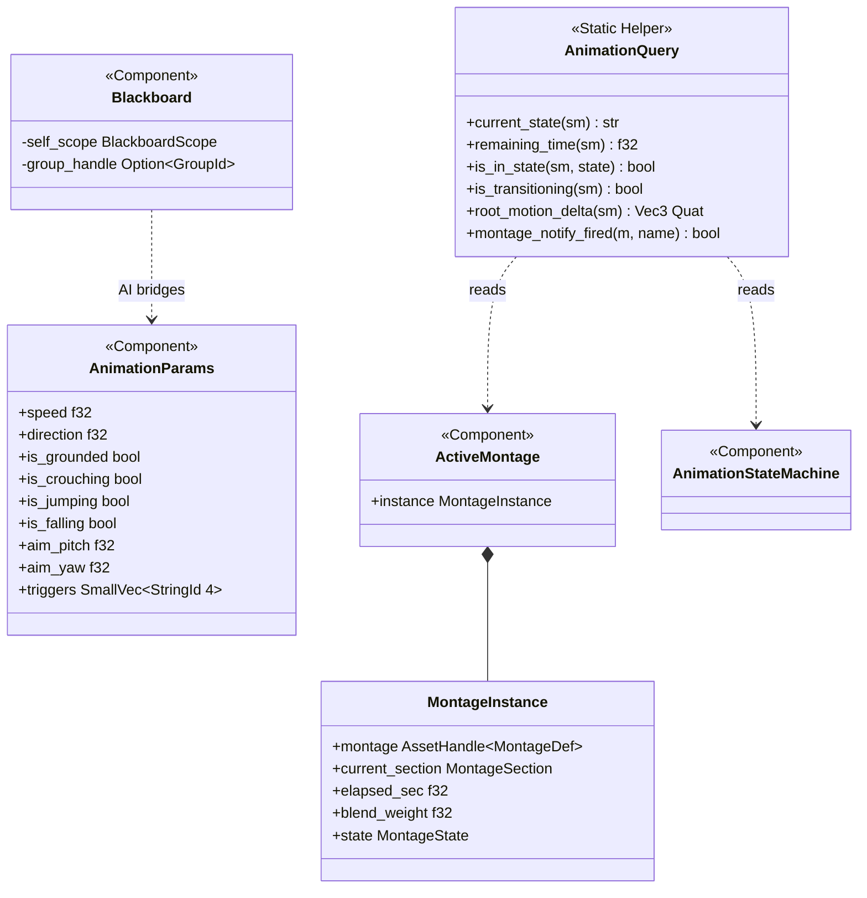
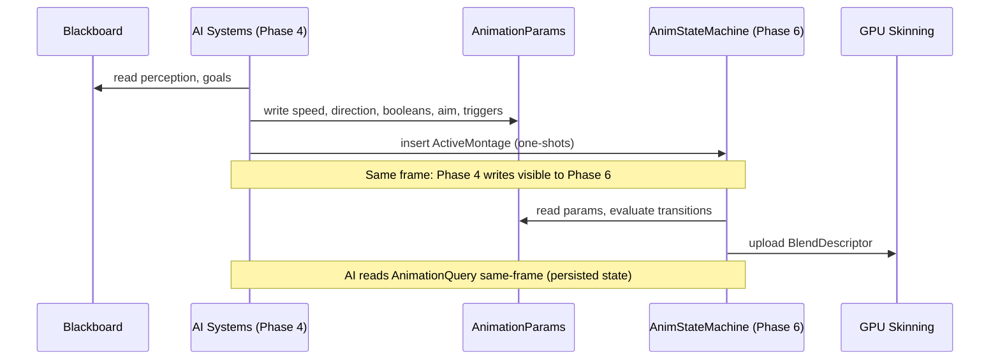

# AI Behavior ↔ Animation Integration Design

## Systems Involved

| System | Design | Domain |
|--------|--------|--------|
| AI Behavior | [behavior.md](../ai/behavior.md) | AI |
| Animation SM | [state-machine.md](../animation/state-machine.md) | Animation |

## Integration Requirements

| ID | Requirement | Systems |
|----|-------------|---------|
| IR-1.1.1 | BT/GOAP actions write animation params | AI, Anim |
| IR-1.1.2 | AI reads animation state for conditions | AI, Anim |
| IR-1.1.3 | AI state transitions trigger montages | AI, Anim |
| IR-1.1.4 | Locomotion speed/dir drive blend space | AI, Anim |
| IR-1.1.5 | AI budget includes animation eval cost | AI, Anim |

1. **IR-1.1.1** -- BT leaf nodes and GOAP action execution write `AnimationParams` component values
   (speed, direction, booleans, aim offsets, triggers) consumed by the animation state machine's
   transition conditions.
2. **IR-1.1.2** -- AI condition nodes call `AnimationQuery` methods (current state, remaining time,
   transition status) to gate transitions on animation completion. Results are available same-frame
   because animation runs in Phase 6 of the previous frame, and AI reads the persisted component
   state at the start of its Phase 4.
3. **IR-1.1.3** -- AI state machine transitions (e.g., Combat enter) insert `ActiveMontage`
   components to play one-shot attack/react anims.
4. **IR-1.1.4** -- Navigation leaf nodes write locomotion speed and move direction into
   `AnimationParams`, driving 2D blend spaces for walk/run/strafe. AI also writes `is_grounded`,
   `is_crouching`, `is_jumping`, `is_falling`, `aim_pitch`, and `aim_yaw` when controlling NPC
   locomotion and posture.
5. **IR-1.1.5** -- Combined AI + animation evaluation for 500 agents stays under 2 ms per frame
   (US-9.4.10.3). The AI `FrameBudget` accounts for animation evaluation cost via a shared budget
   reservation protocol.

## Data Contracts

| Type | Defined in | Consumed by | Purpose |
|------|-----------|-------------|---------|
| `AnimationParams` | Animation | AI (write) | Shared params |
| `AnimationQuery` | Animation | AI (call) | Query API |
| `ActiveMontage` | Animation | AI (insert) | One-shots |

1. **`AnimationParams`** -- ECS component written by AI (Phase 4), read by animation state machine
   (Phase 6). Matches upstream `state-machine.md` definition.
2. **`AnimationQuery`** -- static query helper with methods that read `AnimationStateMachine`
   component state. Not a component itself. AI systems call these methods during Phase 4 to read
   state persisted from the previous frame's Phase 6 evaluation.
3. **`ActiveMontage`** -- ECS component inserted by AI to trigger one-shot animations. Contains a
   `MontageInstance` with playback state.

```rust
/// Written by AI systems in Phase 4,
/// read by animation eval in Phase 6.
/// Stored as a component on the entity.
/// Matches state-machine.md line 2549.
#[derive(Component)]
pub struct AnimationParams {
    pub speed: f32,
    pub direction: f32,
    pub is_grounded: bool,
    pub is_crouching: bool,
    pub is_jumping: bool,
    pub is_falling: bool,
    pub aim_pitch: f32,
    pub aim_yaw: f32,
    pub triggers: SmallVec<[StringId; 4]>,
}

/// Static query helper for AI systems to read
/// animation state. Not an ECS component.
/// Matches state-machine.md line 1697.
pub struct AnimationQuery;

impl AnimationQuery {
    /// Current state node name.
    pub fn current_state(
        sm: &AnimationStateMachine,
    ) -> &str;

    /// Remaining time in the current clip.
    pub fn remaining_time(
        sm: &AnimationStateMachine,
    ) -> f32;

    /// Whether a specific state is active.
    pub fn is_in_state(
        sm: &AnimationStateMachine,
        state: StateNodeId,
    ) -> bool;

    /// Whether a transition is in progress.
    pub fn is_transitioning(
        sm: &AnimationStateMachine,
    ) -> bool;

    /// Root motion displacement this frame.
    pub fn root_motion_delta(
        sm: &AnimationStateMachine,
    ) -> (Vec3, Quat);

    /// Whether a montage notify has fired.
    pub fn montage_notify_fired(
        montage: &ActiveMontage,
        notify_name: &str,
    ) -> bool;
}
```

> **Note on `StringId`**: The animation subsystem uses `StringId` for runtime identifiers (bone
> names, triggers, event markers) and `FixedString` for asset definition names. `StringId` is a
> hashed string identifier optimized for fast comparison; `FixedString` is an inline fixed-capacity
> string for asset data. Both types are defined in `core-runtime`. This integration uses `StringId`
> for triggers, consistent with the upstream `AnimationParams` definition.
>
> **Note on `Blackboard` and `HashMap`**: The upstream `Blackboard` design (`behavior.md`) uses
> `HashMap<BlackboardKey, BlackboardValue>` inside `BlackboardScope`. This is a constraint
> violation: blackboards are hot-path structures (thousands to millions of instances).
> `BlackboardScope` must use `BTreeMap` or a sorted `Vec` instead of `HashMap`. This integration
> does not depend on `Blackboard` internals -- AI reads the blackboard for its own decisions and
> writes results to `AnimationParams`. The animation system never reads the blackboard directly.

## Class Diagram



## Data Flow



## Timing and Ordering

| System | Phase | Timestep | Order |
|--------|-------|----------|-------|
| AI Behavior | 4-AI | Variable | First |
| Animation SM | 6-Animation | Variable | After AI |

AI writes `AnimationParams` and inserts `ActiveMontage` during Phase 4. Animation reads them in
Phase 6, two phases later in the same frame. No channel or sync primitive needed -- ECS component
writes in Phase 4 are visible to Phase 6 reads.

**No one-frame delay for animation state reads.** AI reads `AnimationQuery` methods against the
`AnimationStateMachine` component, which was written by Phase 6 of the previous frame and persists
as ECS state. This means AI in Phase 4 reads the result of the immediately preceding Phase 6 --
same-frame from the AI system's perspective, with no skipped frames. The animation state machine
determines which animation to play immediately in the same frame as the AI trigger.

**Phase ordering for same-frame response:**

1. **Phase 4 (AI):** AI reads `AnimationStateMachine` (persisted from last frame's Phase 6), makes
   decisions, writes `AnimationParams`, inserts `ActiveMontage`.
2. **Phase 6 (Animation):** State machine reads `AnimationParams`, evaluates transitions, updates
   `AnimationStateMachine` component. The chosen animation begins blending this frame.

## Failure Modes

| ID | Failure | Impact | Recovery |
|----|---------|--------|----------|
| FM-1 | Missing AnimationParams | No transition | Default idle |
| FM-2 | Invalid trigger ID | Trigger ignored | Log warn, stay |
| FM-3 | Montage asset missing | No one-shot | Log error, skip |
| FM-4 | Budget exceeded | AI truncated | Time-slice next |

**Fallback paths:**

1. **FM-1 (Missing `AnimationParams`):** If an entity has an `AnimationStateMachine` but no
   `AnimationParams` component, the state machine uses default parameter values (speed=0, all
   booleans false, no triggers). The entity remains in idle state. Logged as `warn` once per entity.
2. **FM-2 (Invalid trigger ID):** If a `StringId` in the triggers list does not match any transition
   condition, the trigger is consumed and discarded. Logged as `warn` with the unrecognized trigger
   ID. The state machine continues evaluating remaining triggers and parameter-based conditions.
3. **FM-3 (Montage asset missing):** If the `AssetHandle<MontageDef>` in an inserted `ActiveMontage`
   references an unloaded or missing asset, the `ActiveMontage` component is removed and the state
   machine continues with the current state. Logged as `error` with the asset ID.
4. **FM-4 (Budget exceeded):** When `FrameBudget` is exhausted, remaining AI agents are deferred to
   the next frame via time-slicing. Deferred agents retain their previous `AnimationParams` values
   -- the animation state machine continues evaluating with stale parameters. No visible hitch for
   agents whose params change slowly (patrol, idle). Logged as `debug` with the count of deferred
   agents.

## Platform Considerations

None -- identical across all platforms. Both AI and animation systems are pure CPU ECS logic with no
platform-specific code paths.

**Dimensionality:** 3D only; 2D/2.5D out of scope for this integration.

## Test Plan

See companion [ai-animation-test-cases.md](ai-animation-test-cases.md).

## Review Status

1. **APPLIED** -- `AnimationQuery` realigned to upstream static-helper pattern from
   `state-machine.md` line 1697 with the correct method set.
2. **APPLIED** -- `ParameterMap` renamed to `AnimationParams` everywhere; pseudocode matches
   upstream definition at `state-machine.md` line 2549.
3. **CLARIFIED** -- Added `StringId` vs `FixedString` note; triggers use `StringId` (hashed runtime
   identifier) consistent with upstream.
4. **APPLIED** -- `Blackboard` removed from data contracts table; class diagram retains it to show
   the AI-side bridging relationship.
5. **APPLIED** -- Added Mermaid `classDiagram` covering all integration types and relationships.
6. **APPLIED** -- Flagged upstream `BlackboardScope` HashMap as a hot-path constraint violation;
   this integration does not depend on blackboard internals.
7. **CLARIFIED** -- AI writes the full `AnimationParams` field set when controlling NPC locomotion
   and posture; IR-1.1.4 enumerates the additional fields.
8. **ACKNOWLEDGED-OUT-OF-SCOPE** -- 2D/2.5D out of scope for this integration; see Platform
   Considerations note.
9. **APPLIED** -- Added four negative/error-path test cases (TC-IR-1.1.E1 through TC-IR-1.1.E4), one
   per failure mode, in the companion test-cases file.
10. **APPLIED** -- Budget-sharing protocol and time-slicing fallback documented in IR-1.1.5 and
    FM-4.
11. **APPLIED** -- `AnimationQuery` clarified as a static query helper (not a component); data
    contract table says "AI (call)"; same-frame read of persisted state documented.
