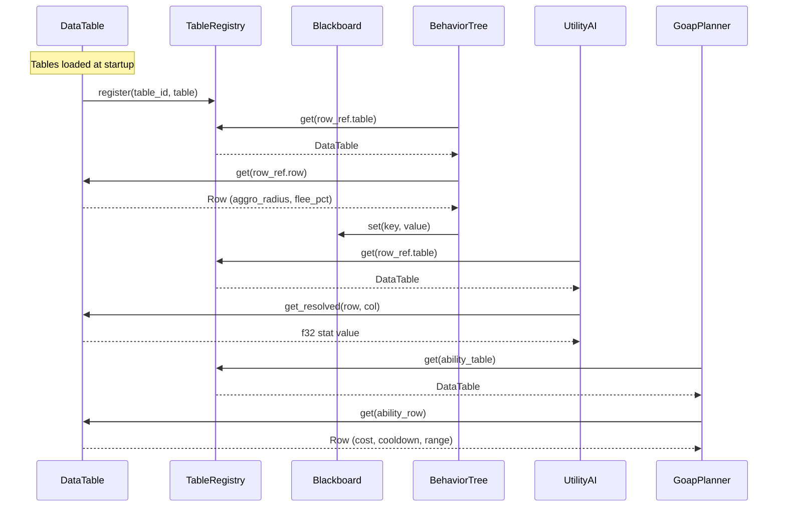

# AI Behavior ↔ Data Tables Integration Design

## Systems Involved

| System | Design | Domain |
|--------|--------|--------|
| AI Behavior | [behavior.md](../ai/behavior.md) | AI |
| Data Tables | [data-tables.md](../data-systems/data-tables.md) | Data |

## Integration Requirements

| ID | Requirement | Systems |
|----|-------------|---------|
| IR-2.1.1 | BT leaf nodes read NPC data from tables | AI, Data |
| IR-2.1.2 | Utility considerations read stat values | AI, Data |
| IR-2.1.3 | GOAP action costs lookup from tables | AI, Data |
| IR-2.1.4 | Ability definitions resolve via RowRef | AI, Data |
| IR-2.1.5 | Blackboard keys bind to table columns | AI, Data |
| IR-2.1.6 | Hot reload of tables updates AI data | AI, Data |

1. **IR-2.1.1** -- BT leaf nodes reference `RowRef` to look up NPC behavior parameters (aggro
   radius, flee threshold, patrol speed) from `DataTable` rows.
2. **IR-2.1.2** -- Utility AI `InputAxis::Custom` considerations read stat values from table columns
   via `TableRegistry::get()` + `ColumnId` lookup.
3. **IR-2.1.3** -- GOAP `GoapAction::cost` fields reference `FormulaId` columns that codegen to Rust
   functions reading table data at bake time.
4. **IR-2.1.4** -- Ability definitions stored as `DataTable` rows are resolved by AI systems via
   `RowRef` to determine preconditions and cooldowns.
5. **IR-2.1.5** -- `Blackboard` keys can bind to table column values via `DatabaseRow` component,
   syncing on entity spawn and table hot-reload.
6. **IR-2.1.6** -- When `TableReloaded` event fires, AI systems that cache table data must
   invalidate and re-read affected rows.

## Data Contracts

| Type | Defined in | Consumed by | Purpose |
|------|-----------|-------------|---------|
| `RowRef` | Data Tables | AI Behavior | Row lookup key |
| `TableRegistry` | Data Tables | AI Behavior | Table access |
| `DatabaseRow` | Data Tables | AI Behavior | Entity binding |
| `Blackboard` | AI Behavior | AI Behavior | Agent state |
| `TableReloaded` | Data Tables | AI Behavior | Cache bust |

```rust
/// BT leaf that reads an NPC behavior parameter
/// from a data table row. The RowRef is stored
/// on the entity's DatabaseRow component.
pub struct BtTableLookup {
    /// Column to read from the bound table row.
    pub column: ColumnId,
    /// Blackboard key to write the result into.
    pub target_key: BlackboardKey,
}

/// Utility consideration that reads a numeric
/// column from the entity's bound data table row.
pub struct TableColumnConsideration {
    /// Table + row reference for the lookup.
    pub row_ref: RowRef,
    /// Column containing the numeric value.
    pub column: ColumnId,
    /// Response curve applied to the raw value.
    pub curve: ResponseCurve,
}
```

## Data Flow



## Timing and Ordering

| System | Game loop phase | Timestep | Ordering |
|--------|----------------|----------|----------|
| Data Tables | Phase 1-Input | Variable | Load first |
| AI Behavior | Phase 4-AI | Variable | After tables |

AI systems run in Phase 4. `TableRegistry` is an ECS resource available as a read-only system
parameter. Table hot-reload events are processed at phase boundaries. AI systems read tables
immutably; no write contention.

## Failure Modes

| Failure | Impact | Recovery |
|---------|--------|----------|
| Missing RowRef | AI uses default values | Log warning, use fallback |
| Table hot-reload | Stale cached data | Invalidate on TableReloaded |
| Invalid column type | Type mismatch panic | Validate at load time |
| Missing table | AI system skips entity | Log error, skip tick |

## Platform Considerations

None -- identical across all platforms. `TableRegistry` and `DataTable` are pure Rust data
structures with no platform-specific behavior.

## Test Plan

See companion [ai-data-tables-test-cases.md](ai-data-tables-test-cases.md).
