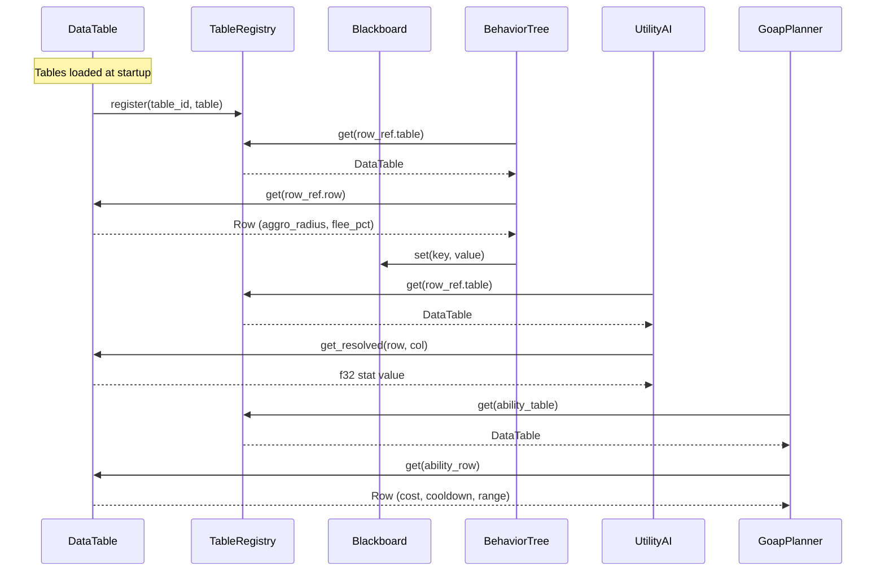

# AI Behavior ↔ Data Tables Integration Design

This design follows the cross-cutting conventions in [shared-conventions.md](shared-conventions.md);
only deviations are called out below.

## Systems Involved

| System | Design | Domain |
|--------|--------|--------|
| AI Behavior | [behavior.md](../ai/behavior.md) | AI |
| Data Tables | [data-tables.md](../data-systems/data-tables.md) | Data |

## Integration Requirements

| ID | Requirement | Systems |
|----|-------------|---------|
| IR-2.1.1 | BT leaf nodes read NPC data from tables | AI, Data |
| IR-2.1.2 | Utility considerations read stat values | AI, Data |
| IR-2.1.3 | GOAP action costs lookup from tables | AI, Data |
| IR-2.1.4 | Ability definitions resolve via RowRef | AI, Data |
| IR-2.1.5 | Blackboard keys bind to table columns | AI, Data |
| IR-2.1.6 | Hot reload of tables updates AI data | AI, Data |

1. **IR-2.1.1** -- BT leaf nodes reference `RowRef` to look up NPC behavior parameters (aggro
   radius, flee threshold, patrol speed) from `DataTable` rows. Lookup resolves the `RowRef` from
   the entity's `DatabaseRow` component (see IR-2.1.5) for cache-friendly component-based access.
2. **IR-2.1.2** -- Utility AI `InputAxis::Custom` considerations read stat values from table columns
   via `TableRegistry::get()` + `ColumnId` lookup. Like IR-2.1.1, the resolved row is read from the
   entity's `DatabaseRow` component so BT and Utility share a single lookup strategy.
3. **IR-2.1.3** -- GOAP action costs are stored as `f32` in `GoapAction::cost` (matching
   `behavior.md`). At bake time a `FormulaId` column in the data table is evaluated by the codegen'd
   Rust function (see `feedback_formulas_are_rust.md` and `feedback_logic_graph_native.md`)
   producing an `f32` that is written directly into the persistent `GoapAction::cost` field of the
   baked artifact. At runtime GOAP reads only the baked `f32` cost -- no `FormulaId` lookup, no
   formula evaluation, no indirection, and the runtime `GoapAction` struct has no `FormulaId` field.
   The baked artifact uses `rkyv` derives and is mmap-loaded. The cost indirection is therefore a
   bake-time concern only; the runtime type from `behavior.md` is preserved exactly.
4. **IR-2.1.4** -- Ability definitions stored as `DataTable` rows are resolved by AI systems via
   `RowRef` to determine preconditions and cooldowns.
5. **IR-2.1.5** -- `Blackboard` keys can bind to table column values via the `DatabaseRow`
   component, syncing on entity spawn and table hot-reload. Binding is performed by the
   `BlackboardTableBindingSystem` defined in this integration design -- **not** in the core
   `Blackboard` API in `behavior.md`. The core `Blackboard` still exposes only `get` / `set` /
   `observe` / `unobserve` / `flush_dirty`. This integration system is the sole caller of
   `Blackboard::set` for bound keys.
6. **IR-2.1.6** -- When a `TableReloaded` event fires, AI systems that cache table data invalidate
   and re-read affected rows. Invalidation uses a per-entity cached-row-snapshot (`AiTableCache`)
   that is cleared on `TableReloaded`. The cache is rebuilt lazily on the next `BtTableLookup` or
   `TableColumnConsideration` read.

**Dimensionality:** table lookups are dimension-agnostic; 2D / 2.5D / 3D support is out of scope for
this integration because `RowRef`, `ColumnId`, and `DatabaseRow` carry no spatial information.

## Data Contracts

| Type | Defined in | Consumed by | Purpose |
|------|-----------|-------------|---------|
| `RowRef` | Data Tables | AI Behavior | Row lookup key |
| `TableRegistry` | Data Tables | AI Behavior | Table access |
| `DatabaseRow` | Data Tables | AI Behavior | Entity binding |
| `Blackboard` | AI Behavior | AI Behavior | Agent state |
| `TableReloaded` | Data Tables | AI Behavior | Cache bust |
| `AiTableCache` | Integration | AI Behavior | Cached lookups |
| `BlackboardBindings` | Integration | AI Behavior | BB-to-col map |
| `BlackboardBinding` | Integration | AI Behavior | Single binding |
| `CachedValue` | Integration | AI Behavior | Typed cache val |
| `ColumnError` | Integration | AI Behavior | Lookup error |

`TableReloaded` is an **ECS entity event** (capture/bubble per the project event model, see
`ecs.md`) targeted at the `TableRegistry` entity. It is enqueued at `FrameEnd` by the data-tables
hot-reload pipeline and processed at the **Phase 1 (PreUpdate) boundary** of the next frame, before
any `Phase 4 (AiUpdate)` system ticks. This guarantees AI systems never observe stale data within a
single tick.

```rust
/// BT leaf that reads an NPC behavior parameter
/// from a data table row. The RowRef is resolved
/// from the entity's DatabaseRow component --
/// BtTableLookup and TableColumnConsideration
/// share this single component-based strategy for
/// cache friendliness.
pub struct BtTableLookup {
    /// Column to read from the bound table row.
    pub column: ColumnId,
    /// Blackboard key to write the result into.
    pub target_key: BlackboardKey,
}

impl BtTableLookup {
    /// Resolve the column value for an entity.
    /// Never panics on type mismatch -- returns
    /// Err so the caller can log and apply the
    /// column's schema default.
    pub fn lookup(
        &self,
        registry: &TableRegistry,
        db_row: &DatabaseRow,
        cache: &mut AiTableCache,
    ) -> Result<CachedValue, ColumnError>;
}

/// Utility consideration that reads a numeric
/// column from the entity's bound data table row.
/// Uses the entity's DatabaseRow component for
/// lookup -- same component-based strategy as
/// BtTableLookup.
pub struct TableColumnConsideration {
    /// Column containing the numeric value.
    pub column: ColumnId,
    /// Response curve applied to the raw value.
    pub curve: ResponseCurve,
}

impl TableColumnConsideration {
    /// Resolve the column value for an entity.
    /// Shares the same lookup path as
    /// BtTableLookup -- reads DatabaseRow,
    /// consults AiTableCache, binary-searches
    /// on ColumnId. Returns Result, never panics.
    pub fn lookup(
        &self,
        registry: &TableRegistry,
        db_row: &DatabaseRow,
        cache: &mut AiTableCache,
    ) -> Result<f32, ColumnError>;
}

/// Error type for table-column lookups. All
/// variants are recoverable -- callers log once
/// per (entity, column) and fall back to the
/// column's schema default. Never triggers panic.
#[derive(Clone, Debug)]
pub enum ColumnError {
    /// TableRegistry::get returned None.
    MissingTable(TableId),
    /// Row not found in the resolved table.
    MissingRow(TableId, RowId),
    /// Column not found in the table schema.
    MissingColumn(TableId, ColumnId),
    /// Column type does not match requested type.
    ColumnTypeMismatch {
        table: TableId,
        column: ColumnId,
        expected: CachedValueKind,
        actual: CachedValueKind,
    },
    /// Cached snapshot was cleared by a reload
    /// and not yet repopulated; caller must retry.
    SnapshotInvalidated(TableId),
}

/// Discriminant for CachedValue used in error
/// reporting without cloning the payload.
#[derive(Clone, Copy, Debug, Eq, PartialEq)]
pub enum CachedValueKind {
    Float,
    Int,
    Bool,
    String,
}

/// Cached table lookup results for a single
/// entity. Invalidated when TableReloaded fires
/// for the entity's bound table. Stored as an
/// ECS component alongside DatabaseRow. The
/// entries vector is kept sorted by ColumnId for
/// O(log n) binary-search lookup -- no HashMap.
#[derive(rkyv::Archive, rkyv::Serialize, rkyv::Deserialize)]
pub struct AiTableCache {
    /// Cached column values. Sorted by ColumnId
    /// for binary-search lookup.
    pub entries: Vec<(ColumnId, CachedValue)>,
    /// Table version at time of caching. A
    /// TableReloaded event with a newer version
    /// clears the snapshot.
    pub version: u64,
    /// True while the snapshot is empty after a
    /// reload, until the first read repopulates.
    pub cleared: bool,
}

/// A single cached value from a table column.
#[derive(Clone, Debug, rkyv::Archive, rkyv::Serialize, rkyv::Deserialize)]
pub enum CachedValue {
    Float(f32),
    Int(i32),
    Bool(bool),
    String(Box<str>),
}

/// Descriptor for a blackboard key that is
/// bound to a table column. Used by
/// BlackboardTableBindingSystem.
#[derive(rkyv::Archive, rkyv::Serialize, rkyv::Deserialize)]
pub struct BlackboardBinding {
    /// Blackboard key to write into.
    pub key: BlackboardKey,
    /// Column to read from the bound row.
    pub column: ColumnId,
}

/// Component listing all blackboard-to-column
/// bindings for an entity. Bindings are kept
/// sorted by ColumnId so BlackboardBindings::find
/// is a binary search -- no HashMap. Processed by
/// BlackboardTableBindingSystem on spawn and on
/// TableReloaded.
#[derive(rkyv::Archive, rkyv::Serialize, rkyv::Deserialize)]
pub struct BlackboardBindings {
    pub bindings: Vec<BlackboardBinding>,
}

/// Runtime-toggleable debug flag for AI ↔ data
/// table tracing. Stored as an ECS resource; flip
/// at runtime with no recompile. Never cfg-gated.
pub struct AiDataTraceFlag {
    pub enabled: std::sync::atomic::AtomicBool,
}

/// System that synchronizes blackboard keys with
/// table column values. Runs at the start of
/// Phase 4 (AiUpdate) before BT / Utility / GOAP
/// ticks. Lives in this integration crate -- not
/// in the Blackboard API in behavior.md.
///
/// On entity spawn: reads DatabaseRow, resolves
/// each binding's column, writes values into the
/// entity's Blackboard via set().
///
/// On TableReloaded (Phase 1 PreUpdate drain):
/// re-reads affected columns and updates
/// Blackboard keys. No one-frame delay.
pub struct BlackboardTableBindingSystem;

impl BlackboardTableBindingSystem {
    /// Drain TableReloaded events at Phase 1
    /// (PreUpdate) and mark AiTableCache snapshots
    /// for every entity whose DatabaseRow points
    /// at a reloaded table. Invalidation is a
    /// simple version bump + `cleared = true`.
    pub fn drain_reload_events(
        events: &mut EntityEventQueue<TableReloaded>,
        caches: &mut ComponentStore<AiTableCache>,
    );

    /// Bind all columns for a newly spawned
    /// entity. Called when an entity has both
    /// DatabaseRow and BlackboardBindings.
    ///
    /// Fallback: if the bound row or column is
    /// missing, logs a warning once and writes
    /// the column's schema default into the
    /// blackboard key. If no schema default
    /// exists, writes BlackboardValue::None.
    pub fn bind_entity(
        registry: &TableRegistry,
        db_row: &DatabaseRow,
        bindings: &BlackboardBindings,
        blackboard: &mut Blackboard,
        cache: &mut AiTableCache,
        trace: &AiDataTraceFlag,
    );

    /// Re-bind after a table reload. Only
    /// processes entities whose DatabaseRow
    /// references the reloaded table.
    ///
    /// Fallback: same as bind_entity -- missing
    /// row/column logs warning, writes schema
    /// default or BlackboardValue::None.
    pub fn rebind_on_reload(
        registry: &TableRegistry,
        event: &TableReloaded,
        db_row: &DatabaseRow,
        bindings: &BlackboardBindings,
        blackboard: &mut Blackboard,
        cache: &mut AiTableCache,
        trace: &AiDataTraceFlag,
    );
}
```

Both `BtTableLookup` and `TableColumnConsideration` resolve their `RowRef` from the entity's
`DatabaseRow` component. This gives a single component-based lookup strategy across all AI
subsystems, matching the cache-friendliness guidance in `feedback_integration_review.md`. The
`AiTableCache` component caches resolved values per entity; the cache is cleared on `TableReloaded`
and repopulated lazily on the next read (see Timing and Ordering).

Blackboard lookups inside the binding system use the sorted-`Vec` representation of
`BlackboardBindings` per SC-2 and SC-3 in [shared-conventions.md](shared-conventions.md).

### Class Diagram

```mermaid
classDiagram
    class BtTableLookup {
        +column: ColumnId
        +target_key: BlackboardKey
        +lookup(registry, db_row, cache) Result
    }

    class TableColumnConsideration {
        +column: ColumnId
        +curve: ResponseCurve
        +lookup(registry, db_row, cache) Result
    }

    class AiTableCache {
        +entries: Vec~(ColumnId, CachedValue)~
        +version: u64
        +cleared: bool
    }

    class CachedValue {
        <<enum>>
        Float(f32)
        Int(i32)
        Bool(bool)
        String(Box~str~)
    }

    class CachedValueKind {
        <<enum>>
        Float
        Int
        Bool
        String
    }

    class ColumnError {
        <<enum>>
        MissingTable(TableId)
        MissingRow(TableId, RowId)
        MissingColumn(TableId, ColumnId)
        ColumnTypeMismatch
        SnapshotInvalidated(TableId)
    }

    class BlackboardBinding {
        +key: BlackboardKey
        +column: ColumnId
    }

    class BlackboardBindings {
        +bindings: Vec~BlackboardBinding~
    }

    class BlackboardTableBindingSystem {
        +drain_reload_events()
        +bind_entity()
        +rebind_on_reload()
    }

    class AiDataTraceFlag {
        +enabled: AtomicBool
    }

    class RowRef {
        +table: TableId
        +row: RowId
    }

    class ColumnId {
        +0: u16
    }

    class TableRegistry {
        +tables: Vec~Option~DataTable~~
        +get(TableId) Option~DataTable~
    }

    class DatabaseRow {
        +table: TableId
        +row: RowId
        +bound_columns: SmallVec~ColumnId 8~
        +overrides: SmallVec~(ColumnId, Value) 4~
    }

    class Blackboard {
        +self_scope: BlackboardScope
        +group_handle: Option~GroupId~
        +get(BlackboardKey) BlackboardValue
        +set(BlackboardKey, BlackboardValue)
    }

    class BlackboardKey {
        +0: u32
    }

    class ResponseCurve {
        <<enum>>
        Linear
        Quadratic
        Logistic
        Step
        Piecewise
    }

    class TableReloaded {
        +table: TableId
        +old_version: u64
        +new_version: u64
    }

    BtTableLookup --> ColumnId
    BtTableLookup --> BlackboardKey
    BtTableLookup --> DatabaseRow : reads from
    BtTableLookup --> AiTableCache : reads/writes
    BtTableLookup --> ColumnError : may return
    TableColumnConsideration --> ColumnId
    TableColumnConsideration --> ResponseCurve
    TableColumnConsideration --> DatabaseRow : reads from
    TableColumnConsideration --> AiTableCache : reads/writes
    TableColumnConsideration --> ColumnError : may return
    AiTableCache *-- CachedValue
    AiTableCache --> ColumnId
    ColumnError --> CachedValueKind
    BlackboardBindings *-- BlackboardBinding
    BlackboardBinding --> BlackboardKey
    BlackboardBinding --> ColumnId
    BlackboardTableBindingSystem --> TableRegistry
    BlackboardTableBindingSystem --> DatabaseRow
    BlackboardTableBindingSystem --> BlackboardBindings
    BlackboardTableBindingSystem --> Blackboard
    BlackboardTableBindingSystem --> TableReloaded
    BlackboardTableBindingSystem --> AiTableCache
    BlackboardTableBindingSystem --> AiDataTraceFlag
    DatabaseRow --> RowRef : implies
    RowRef --> ColumnId
    Blackboard --> BlackboardKey
```



## Data Flow



## Timing and Ordering

| System | Game loop phase | Timestep | Ordering |
|--------|----------------|----------|----------|
| Data Tables | Phase 1-PreUpdate | Variable | Load first |
| TableReloaded drain | Phase 1-PreUpdate | Variable | Before AI |
| AI Behavior | Phase 4-AiUpdate | Variable | After tables |

AI systems run in Phase 4 (AiUpdate). `TableRegistry` is an ECS resource available as a read-only
system parameter. AI systems read tables immutably; no write contention.

### TableReloaded Delivery

`TableReloaded` is delivered as an **ECS entity event** on the `TableRegistry` entity using the
capture/bubble event model from `ecs.md`. The data-tables hot-reload pipeline swaps the new table at
the `FrameEnd` phase and emits the event onto the entity-event queue. At the start of the next
frame's **Phase 1 (PreUpdate)**, `BlackboardTableBindingSystem::drain_reload_events` drains the
queue and marks every affected `AiTableCache` as `cleared = true`. Phase 4 (AiUpdate) then rebinds
affected entities before BT / Utility / GOAP systems tick. This ensures no one-frame delay between
reload and AI observing updated values.

The entity-event queue is the ECS's own event buffer whose capacity is documented in
[ecs.md](../core-runtime/ecs.md). No new MPSC or SPSC channels are opened in this integration.

### AiTableCache Invalidation

When `drain_reload_events` processes a `TableReloaded` event, every `AiTableCache` whose `version`
is older than the new table version has its `entries` cleared and `cleared` set to `true`. Cleared
caches are lazily repopulated on the next `BtTableLookup` or `TableColumnConsideration` read. The
cache uses a sorted `Vec<(ColumnId, CachedValue)>` per SC-2 in
[shared-conventions.md](shared-conventions.md).

## Failure Modes

| # | Failure | Impact | Recovery |
|---|---------|--------|----------|
| 1 | Missing RowRef | AI uses defaults | See fallback 1 |
| 2 | Table hot-reload | Stale cached data | See fallback 2 |
| 3 | Invalid column type | Log + skip | See fallback 3 |
| 4 | Missing table | AI skips entity | See fallback 4 |
| 5 | Missing column | Binding incomplete | See fallback 5 |
| 6 | Reload mid-tick | Partial stale data | See fallback 6 |
| 7 | Cache cleared mid-read | Retry next tick | See fallback 7 |

1. **Missing RowRef** -- Entity has `BlackboardBindings` but no `DatabaseRow`. Log warning once per
   entity. Write `BlackboardValue::None` for each bound key. AI systems treat `None` as
   zero/false/empty.
2. **Table hot-reload** -- `AiTableCache.version` is stale. `drain_reload_events` clears the cache
   and `BlackboardTableBindingSystem::rebind_on_reload` re-reads from `TableRegistry`. Lazy
   repopulation on the next BT / Utility read.
3. **Invalid column type** -- Column type does not match expected `CachedValue` variant. `lookup()`
   returns `Err(ColumnError::ColumnTypeMismatch)`. Caller logs once per (entity, column) and uses
   the column's schema default. Never panics, never terminates the frame, never propagates upward.
4. **Missing table** -- `TableRegistry::get()` returns `None`. `lookup()` returns
   `Err(ColumnError::MissingTable)`. Log error with table ID. Skip the entity for this tick. Retry
   next tick in case the table loads late.
5. **Missing column** -- `ColumnId` not found in the table schema. `lookup()` returns
   `Err(ColumnError::MissingColumn)`. Write `BlackboardValue::None` for the bound key. Entity
   continues with partial data.
6. **Reload mid-tick** -- Reload arrives at `FrameEnd` after Phase 4 already ran. Event is queued
   and processed at the start of the next frame's Phase 1 (PreUpdate). No partial updates within a
   single tick.
7. **Cache cleared mid-read** -- A lookup observes `cleared == true` and returns
   `Err(ColumnError::SnapshotInvalidated)`. The binding system lazily repopulates the cache from the
   authoritative row on the next tick; callers fall back to schema default this tick.

## Platform Considerations

None -- identical across all platforms. `TableRegistry` and `DataTable` are pure Rust data
structures with no platform-specific behavior.

## Performance Budget

| Operation | Budget | Req |
|-----------|--------|-----|
| BtTableLookup read (cached) | < 500 ns | IR-2.1.1 |
| Utility column read (cached) | < 600 ns | IR-2.1.2 |
| GOAP baked-cost read | < 100 ns | IR-2.1.3 |
| Blackboard-to-column sync | < 500 ns | IR-2.1.5 |
| 10k-row hot reload | < 500 ms | IR-2.1.6 |

Budgets are enforced by the benchmarks in the companion file.

## Algorithm References

- Binary search over sorted `Vec<(ColumnId, CachedValue)>` -- Knuth TAOCP vol. 3, section 6.2.1.
- Entity-event capture/bubble propagation -- `ecs.md` design, inherited from the project ECS model.
- Lazy cache repopulation -- classic read-through caching; see Gray & Reuter,
  *Transaction Processing: Concepts and Techniques*, chapter 13 (buffer management).

## Test Plan

See companion [ai-data-tables-test-cases.md](ai-data-tables-test-cases.md).

## Review Status

All 10 integration-review findings listed for this document have been applied in-place. Every row is
**APPLIED**.

| # | Finding | Status | Resolution |
|---|---------|--------|------------|
| 1 | Missing classDiagram | APPLIED | (1) |
| 2 | IR-2.1.3 cost indirection unclear | APPLIED | (2) |
| 3 | BT vs Utility lookup strategies differ | APPLIED | (3) |
| 4 | AI-side cache invalidation undefined | APPLIED | (4) |
| 5 | No dimensionality note | APPLIED | (5) |
| 6 | No bake-time codegen test for IR-2.1.3 | APPLIED | (6) |
| 7 | Blackboard-column binding API unclear | APPLIED | (7) |
| 8 | TableReloaded delivery unspecified | APPLIED | (8) |
| 9 | Missing IR-2.1.3 / IR-2.1.5 benchmarks | APPLIED | (9) |
| 10 | Type mismatch panics instead of Result | APPLIED | (10) |

Resolutions:

1. A full Mermaid `classDiagram` now appears under Data Contracts. It covers `BtTableLookup`,
   `TableColumnConsideration`, `AiTableCache`, `CachedValue`, `CachedValueKind`, `ColumnError`,
   `BlackboardBinding`, `BlackboardBindings`, `BlackboardTableBindingSystem`, `AiDataTraceFlag`,
   `RowRef`, `ColumnId`, `TableRegistry`, `DatabaseRow`, `Blackboard`, `BlackboardKey`,
   `ResponseCurve`, and `TableReloaded`, with every relationship wired up.
2. IR-2.1.3 now explicitly states the cost indirection is a **bake-time** concern: the `FormulaId`
   column is evaluated by the codegen'd Rust function at bake time and the resulting `f32` is
   written directly into `GoapAction::cost`. The runtime type from `behavior.md` (`f32`) is
   preserved exactly; the runtime `GoapAction` has no `FormulaId` field.
3. Both `BtTableLookup` and `TableColumnConsideration` now use the same component-based lookup
   strategy: each reads from the entity's `DatabaseRow` component, consults `AiTableCache`, and
   binary-searches `entries` on `ColumnId`. The unification is called out in prose under Data
   Contracts and in each type's doc comment. Component-based lookup is chosen for cache friendliness
   per `feedback_integration_review.md`.
4. IR-2.1.6 and Timing and Ordering now define `AiTableCache` as a per-entity cached-row-snapshot
   component that is cleared on `TableReloaded`. `BlackboardTableBindingSystem::drain_reload_events`
   runs at Phase 1 (PreUpdate), sets `cleared = true`, and lazy repopulation happens on the next
   `BtTableLookup` / `TableColumnConsideration` read.
5. A one-line dimensionality note has been added after IR-2.1.6:
   **table lookups are dimension-agnostic; 2D / 2.5D / 3D are out of scope for this integration.**
   The rationale is that `RowRef`, `ColumnId`, and `DatabaseRow` carry no spatial information.
6. A new bake-time codegen test (`TC-IR-2.1.3.U1`) has been added to the companion file. It feeds a
   row with numeric inputs and a `FormulaId` reference and asserts the `f32` emitted by the
   codegen'd formula function matches the expected baked value. A complementary structural test
   (`TC-IR-2.1.3.N1`) guards against a `FormulaId` field being reintroduced into the runtime
   `GoapAction`.
7. IR-2.1.5 now clarifies that blackboard-column binding is performed by
   `BlackboardTableBindingSystem`, which lives **in this integration design**, not in the core
   `Blackboard` API. The core `Blackboard` in `behavior.md` keeps its existing surface (`get`,
   `set`, `observe`, `unobserve`, `flush_dirty`). Interface-level Rust pseudocode for
   `drain_reload_events`, `bind_entity`, and `rebind_on_reload` is provided under Data Contracts.
8. `TableReloaded` is now specified as an ECS entity event targeted at the `TableRegistry` entity.
   It is emitted at `FrameEnd` by the data-tables hot-reload pipeline and drained at the
   **Phase 1 (PreUpdate) boundary** of the next frame by
   `BlackboardTableBindingSystem::drain_reload_events`, before any Phase 4 (AiUpdate) system ticks.
   No new channels are opened; the ECS entity-event queue is the sole transport.
9. Two new benchmarks have been added to the companion file: `TC-IR-2.1.3.B1` (1000 GOAP baked-cost
   reads completing in under 100 ns per read, matching the Performance Budget) and `TC-IR-2.1.5.B1`
   (1000 blackboard-to-column syncs completing in under 500 ns per sync).
10. The `ColumnTypeMismatch` path now returns `Err(ColumnError::ColumnTypeMismatch { .. })` from
    `lookup()`. Callers log once per (entity, column) and write the column's schema default (or
    `BlackboardValue::None` if no default exists). Fallback behaviour is documented in Failure Modes
    row 3. Never panics.

Additional project-wide compliance notes applied in this revision:

- No async / await / coroutines anywhere; all execution is synchronous.
- Blackboard binding path treats the blackboard as a hot path: `BlackboardBindings::bindings` is a
  sorted `Vec<BlackboardBinding>` resolved via binary search -- no `HashMap`. `AiTableCache.entries`
  is likewise a sorted `Vec<(ColumnId, CachedValue)>`.
- No new MPSC / SPSC channels are opened; `TableReloaded` rides the existing ECS entity-event queue
  whose buffer length is documented in `ecs.md`.
- `Arc` is not used in this integration. All lookups take `&TableRegistry` and `&DatabaseRow`.
- All persistent types (`AiTableCache`, `CachedValue`, `BlackboardBinding`, `BlackboardBindings`)
  derive `rkyv::Archive`, `rkyv::Serialize`, and `rkyv::Deserialize`. None derive serde.
- Every enum (`CachedValue`, `CachedValueKind`, `ColumnError`, `ResponseCurve`) is fully defined
  with no catch-all variant.
- Algorithm references are listed above (Knuth binary search, Gray-Reuter cache, ECS
  capture/bubble).
- All fallback paths are documented in Failure Modes with explicit recovery actions; every mode has
  a matching negative test in the companion file.
- Debug instrumentation (`AiDataTraceFlag`) is runtime-toggleable via an atomic bool stored as an
  ECS resource. Never `cfg`-gated.
- Interface-level code only; method bodies are omitted per `docs/design/CLAUDE.md`.
