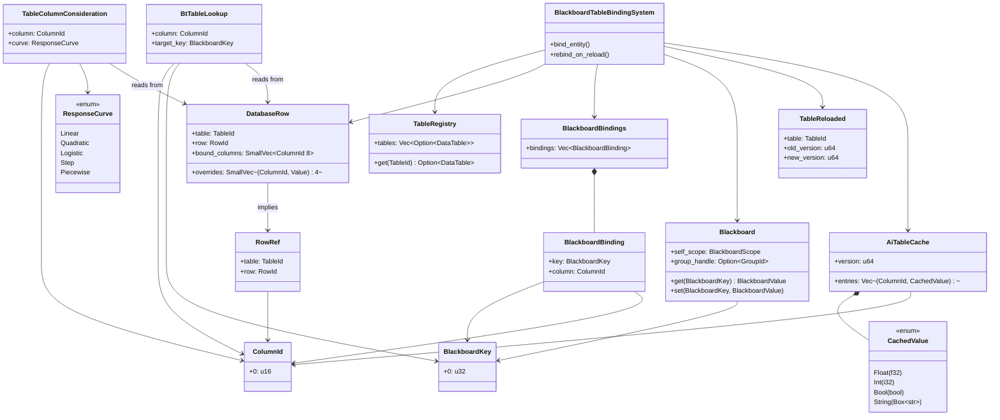
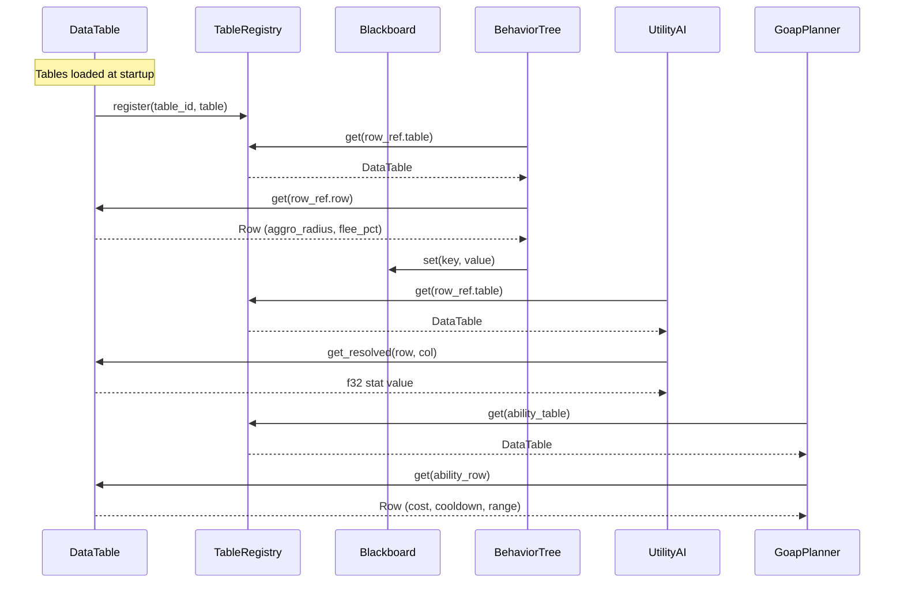

# AI Behavior ↔ Data Tables Integration Design

## Systems Involved

| System | Design | Domain |
|--------|--------|--------|
| AI Behavior | [behavior.md](../ai/behavior.md) | AI |
| Data Tables | [data-tables.md](../data-systems/data-tables.md) | Data |

## Integration Requirements

| ID | Requirement | Systems |
|----|-------------|---------|
| IR-2.1.1 | BT leaf nodes read NPC data from tables | AI, Data |
| IR-2.1.2 | Utility considerations read stat values | AI, Data |
| IR-2.1.3 | GOAP action costs lookup from tables | AI, Data |
| IR-2.1.4 | Ability definitions resolve via RowRef | AI, Data |
| IR-2.1.5 | Blackboard keys bind to table columns | AI, Data |
| IR-2.1.6 | Hot reload of tables updates AI data | AI, Data |

1. **IR-2.1.1** -- BT leaf nodes reference `RowRef` to look up NPC behavior parameters (aggro
   radius, flee threshold, patrol speed) from `DataTable` rows.
2. **IR-2.1.2** -- Utility AI `InputAxis::Custom` considerations read stat values from table columns
   via `TableRegistry::get()` + `ColumnId` lookup.
3. **IR-2.1.3** -- GOAP action costs are stored as `f32` in `GoapAction::cost`. At bake time, a
   `FormulaId` column in the data table is evaluated by the codegen'd Rust function, producing an
   `f32` that is written into the `GoapAction::cost` field. At runtime, only the baked `f32` cost is
   used -- no `FormulaId` indirection exists at runtime.
4. **IR-2.1.4** -- Ability definitions stored as `DataTable` rows are resolved by AI systems via
   `RowRef` to determine preconditions and cooldowns.
5. **IR-2.1.5** -- `Blackboard` keys can bind to table column values via `DatabaseRow` component,
   syncing on entity spawn and table hot-reload.
6. **IR-2.1.6** -- When `TableReloaded` event fires, AI systems that cache table data must
   invalidate and re-read affected rows.

## Data Contracts

| Type | Defined in | Consumed by | Purpose |
|------|-----------|-------------|---------|
| `RowRef` | Data Tables | AI Behavior | Row lookup key |
| `TableRegistry` | Data Tables | AI Behavior | Table access |
| `DatabaseRow` | Data Tables | AI Behavior | Entity binding |
| `Blackboard` | AI Behavior | AI Behavior | Agent state |
| `TableReloaded` | Data Tables | AI Behavior | Cache bust |
| `AiTableCache` | Integration | AI Behavior | Cached lookups |
| `BlackboardBindings` | Integration | AI Behavior | BB-to-col map |
| `BlackboardBinding` | Integration | AI Behavior | Single binding |
| `CachedValue` | Integration | AI Behavior | Typed cache val |

```rust
/// BT leaf that reads an NPC behavior parameter
/// from a data table row. The RowRef is resolved
/// from the entity's DatabaseRow component.
pub struct BtTableLookup {
    /// Column to read from the bound table row.
    pub column: ColumnId,
    /// Blackboard key to write the result into.
    pub target_key: BlackboardKey,
}

/// Utility consideration that reads a numeric
/// column from the entity's bound data table row.
/// Uses the entity's DatabaseRow component for
/// lookup -- same strategy as BtTableLookup.
pub struct TableColumnConsideration {
    /// Column containing the numeric value.
    pub column: ColumnId,
    /// Response curve applied to the raw value.
    pub curve: ResponseCurve,
}

/// Cached table lookup results for a single
/// entity. Invalidated when TableReloaded fires
/// for the entity's bound table. Stored as an
/// ECS component alongside DatabaseRow.
pub struct AiTableCache {
    /// Cached column values. Sorted by ColumnId
    /// for binary-search lookup.
    pub entries: Vec<(ColumnId, CachedValue)>,
    /// Table version at time of caching.
    pub version: u64,
}

/// A single cached value from a table column.
#[derive(Clone, Debug)]
pub enum CachedValue {
    Float(f32),
    Int(i32),
    Bool(bool),
    String(Box<str>),
}

/// Descriptor for a blackboard key that is
/// bound to a table column. Used by
/// BlackboardTableBindingSystem.
pub struct BlackboardBinding {
    /// Blackboard key to write into.
    pub key: BlackboardKey,
    /// Column to read from the bound row.
    pub column: ColumnId,
}

/// Component listing all blackboard-to-column
/// bindings for an entity. Processed by
/// BlackboardTableBindingSystem on spawn and
/// on TableReloaded.
pub struct BlackboardBindings {
    pub bindings: Vec<BlackboardBinding>,
}

/// System that synchronizes blackboard keys
/// with table column values. Runs in Phase 4
/// (AiUpdate) before BT/Utility/GOAP ticks.
///
/// On entity spawn: reads DatabaseRow, resolves
/// each binding's column, writes values into
/// the entity's Blackboard via set().
///
/// On TableReloaded: re-reads affected columns
/// and updates Blackboard keys. No one-frame
/// delay -- runs at the start of Phase 4 in
/// the same frame the reload was processed.
pub struct BlackboardTableBindingSystem;

impl BlackboardTableBindingSystem {
    /// Bind all columns for a newly spawned
    /// entity. Called when an entity has both
    /// DatabaseRow and BlackboardBindings.
    ///
    /// Fallback: if the bound row or column is
    /// missing, logs a warning and writes the
    /// column's schema default into the
    /// blackboard key. If no schema default
    /// exists, writes BlackboardValue::None.
    pub fn bind_entity(
        registry: &TableRegistry,
        db_row: &DatabaseRow,
        bindings: &BlackboardBindings,
        blackboard: &mut Blackboard,
    );

    /// Re-bind after a table reload. Only
    /// processes entities whose DatabaseRow
    /// references the reloaded table.
    ///
    /// Fallback: same as bind_entity -- missing
    /// row/column logs warning, writes schema
    /// default or BlackboardValue::None.
    pub fn rebind_on_reload(
        registry: &TableRegistry,
        event: &TableReloaded,
        db_row: &DatabaseRow,
        bindings: &BlackboardBindings,
        blackboard: &mut Blackboard,
    );
}
```

Both `BtTableLookup` and `TableColumnConsideration` resolve their `RowRef` from the entity's
`DatabaseRow` component. This ensures a single lookup strategy across all AI subsystems. The
`AiTableCache` component caches resolved values per entity; the cache is invalidated when
`TableReloaded` fires for the bound table (see Timing and Ordering).

### Class Diagram



## Data Flow



## Timing and Ordering

| System | Game loop phase | Timestep | Ordering |
|--------|----------------|----------|----------|
| Data Tables | Phase 1-Input | Variable | Load first |
| AI Behavior | Phase 4-AI | Variable | After tables |

AI systems run in Phase 4 (AiUpdate). `TableRegistry` is an ECS resource available as a read-only
system parameter. AI systems read tables immutably; no write contention.

### TableReloaded Delivery

`TableReloaded` is delivered as a resource-level event queue (`Vec<TableReloaded>`) on the ECS
`World`. The data-tables hot-reload pipeline swaps the new table at the `FrameEnd` phase and appends
the event to the queue. At the start of the next frame's Phase 4 (AiUpdate),
`BlackboardTableBindingSystem` drains the queue and re-binds affected entities before
BT/Utility/GOAP systems tick. This ensures no one-frame delay between reload and AI observing
updated values.

### AiTableCache Invalidation

When `BlackboardTableBindingSystem` processes a `TableReloaded` event, it also invalidates every
`AiTableCache` component whose `version` is older than the new table version. Invalidated caches are
lazily repopulated on the next read by `BtTableLookup` or `TableColumnConsideration`. The cache uses
a sorted `Vec<(ColumnId, CachedValue)>` with binary-search lookup -- no `HashMap`.

## Failure Modes

| # | Failure | Impact | Recovery |
|---|---------|--------|----------|
| 1 | Missing RowRef | AI uses defaults | See fallback 1 |
| 2 | Table hot-reload | Stale cached data | See fallback 2 |
| 3 | Invalid column type | Wrong value type | See fallback 3 |
| 4 | Missing table | AI skips entity | See fallback 4 |
| 5 | Missing column | Binding incomplete | See fallback 5 |
| 6 | Reload mid-tick | Partial stale data | See fallback 6 |

1. **Missing RowRef** -- Entity has `BlackboardBindings` but no `DatabaseRow`. Log warning once per
   entity. Write `BlackboardValue::None` for each bound key. AI systems treat `None` as
   zero/false/empty.
2. **Table hot-reload** -- `AiTableCache.version` is stale. `BlackboardTableBindingSystem`
   invalidates the cache and re-reads from `TableRegistry`. Lazy repopulation on next BT/Utility
   read.
3. **Invalid column type** -- Column type does not match expected `CachedValue` variant. Return
   `Err(ColumnTypeMismatch)` from the lookup. Caller logs error and uses schema default value. Never
   panics.
4. **Missing table** -- `TableRegistry::get()` returns `None`. Log error with table ID. Skip the
   entity for this tick. Retry next tick in case the table loads late.
5. **Missing column** -- `ColumnId` not found in the table schema. Log error with table ID and
   column ID. Write `BlackboardValue::None` for the bound key. Entity continues with partial data.
6. **Reload mid-tick** -- Reload arrives at `FrameEnd` after Phase 4 already ran. Event is queued
   and processed at the start of the next frame's Phase 4. No partial updates within a single tick.

## Platform Considerations

None -- identical across all platforms. `TableRegistry` and `DataTable` are pure Rust data
structures with no platform-specific behavior.

## Test Plan

See companion [ai-data-tables-test-cases.md](ai-data-tables-test-cases.md).

## Review Feedback

1. `[CONFIDENT]` Missing classDiagram. The design CLAUDE.md requires "a Mermaid classDiagram
   covering ALL types: structs, enums, traits, type aliases, and their relationships." The document
   has a sequence diagram but no class diagram showing `BtTableLookup`, `TableColumnConsideration`,
   `RowRef`, `ColumnId`, `Blackboard`, `BlackboardKey`, `ResponseCurve`, `TableRegistry`,
   `DatabaseRow`, and `TableReloaded` with their field-level relationships.

2. `[CONFIDENT]` IR-2.1.3 claims `GoapAction::cost` fields "reference `FormulaId` columns," but the
   parent `behavior.md` defines `GoapAction.cost` as `f32`, not `FormulaId`. The integration
   document must clarify the indirection mechanism -- either the cost is looked up from a
   `FormulaId` column at bake time and written into the `f32` field, or the `GoapAction` struct
   needs a different cost representation.

3. `[CONFIDENT]` `TableColumnConsideration` embeds a `RowRef` field, but `BtTableLookup` does not --
   instead it reads from the entity's `DatabaseRow` component. This inconsistency means the two AI
   subsystems use different lookup strategies for the same table data. Unify to either
   component-based or inline `RowRef` for both, or document why they differ.

4. `[CONFIDENT]` The Data Contracts table lists `TableReloaded` with purpose "Cache bust," but the
   document never specifies what AI-side cache exists or how it is structured. IR-2.1.6 says "AI
   systems that cache table data must invalidate," but no caching data structure or invalidation
   mechanism is shown in the pseudocode.

5. `[CONFIDENT]` No 2D/2.5D/3D consideration. The constraints require "2D/2.5D/3D support in every
   subsystem." While the data-tables design notes that `DatabaseRow` binding works identically for
   2D and 3D entities, this integration document has no mention of dimensionality. At minimum, note
   that table lookups are dimension-agnostic and explain why.

6. `[CONFIDENT]` Test cases TC-IR-2.1.3.1 and TC-IR-2.1.3.2 cover GOAP cost lookup, but neither
   tests the "codegen to Rust functions at bake time" claim from IR-2.1.3. A test case verifying
   that the baked formula function produces correct output from table data is missing.

7. `[UNCERTAIN]` IR-2.1.5 states blackboard keys "bind to table column values via `DatabaseRow`
   component, syncing on entity spawn and table hot-reload." The `Blackboard` API in `behavior.md`
   has no bind or sync method -- only `get`, `set`, `observe`, `unobserve`, and `flush_dirty`. Is
   this binding a new system (e.g., `BlackboardTableBindingSystem`) that should be defined here, or
   does it belong in the `Blackboard` API itself?

8. `[UNCERTAIN]` The Timing and Ordering section says "Table hot-reload events are processed at
   phase boundaries," but does not specify which phase boundary or how the event is delivered. Is
   `TableReloaded` an ECS entity event (capture/bubble per the project's event model), a
   resource-level event queue, or a channel message from the main thread? The delivery mechanism
   affects whether AI systems can observe it within a single frame.

9. `[CONFIDENT]` No benchmarks for IR-2.1.3 (GOAP cost lookup) or IR-2.1.5 (blackboard-to-column
   binding) in the companion test cases. Every IR should have at least one benchmark entry to verify
   hot-path performance.

10. `[CONFIDENT]` The Failure Modes table lists "Invalid column type -- Type mismatch panic" with
    recovery "Validate at load time." A panic is unacceptable in a production engine. This should
    return a `Result` or use a validated type wrapper, not panic.
