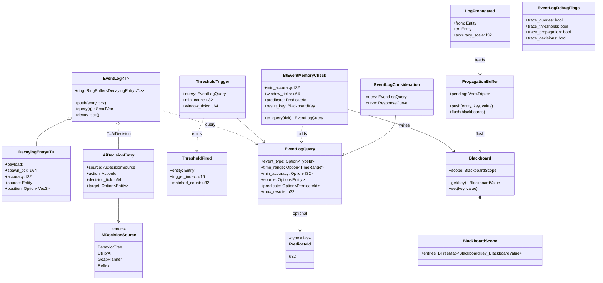
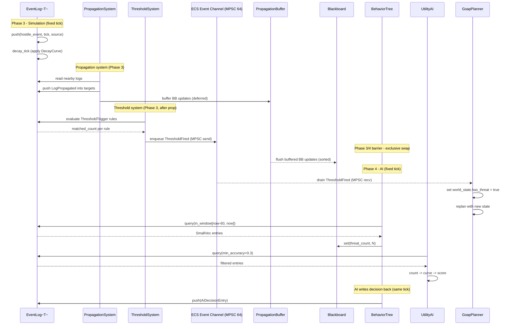

# AI Behavior ↔ Event Logs Integration Design

This design follows the cross-cutting conventions in [shared-conventions.md](shared-conventions.md);
only deviations are called out below.

## Systems Involved

| System | Design | Domain |
|--------|--------|--------|
| AI Behavior | [behavior.md](../ai/behavior.md) | AI |
| Event Logs | [event-logs.md](../simulation/event-logs.md) | Simulation |

## Integration Requirements

| ID | Requirement | Systems |
|----|-------------|---------|
| IR-2.2.1 | BT reads event log for memory checks | AI, EventLog |
| IR-2.2.2 | Utility scores from event history | AI, EventLog |
| IR-2.2.3 | GOAP world state from event counts | AI, EventLog |
| IR-2.2.4 | Threshold triggers influence AI | AI, EventLog |
| IR-2.2.5 | Gossip propagation feeds blackboard | AI, EventLog |
| IR-2.2.6 | AI actions write events to logs | AI, EventLog |

1. **IR-2.2.1** -- BT leaf nodes query `EventLog::entries_above_accuracy()` and
   `entries_in_window()` to check NPC memory of witnessed events (e.g., "saw hostile in last 60s").
2. **IR-2.2.2** -- Utility AI `InputAxis::Custom` considerations score based on event log entry
   counts, recency, and accuracy within a time window.
3. **IR-2.2.3** -- GOAP `WorldState` bits are set from `EventLog` threshold checks (e.g., "3+
   hostile events" sets `has_threat = true`).
4. **IR-2.2.4** -- `ThresholdTrigger` components fire `ThresholdFired` events that AI systems
   consume to trigger alert states, flee behavior, or replanning.
5. **IR-2.2.5** -- When `LogPropagated` events arrive (gossip from nearby NPCs), the receiving
   entity's `Blackboard` is updated with the propagated data. The `Blackboard` is therefore both a
   consumer (AI leaves read it) and a producer (propagation writes to it).
6. **IR-2.2.6** -- AI decision outcomes (attack, flee, investigate) are written as new entries into
   the acting entity's `EventLog<AiDecisionEntry>` for future recall.

## Dimensionality

2D, 2.5D, and 3D scenes use the identical code path. `EventLog<T>` is spatially agnostic; optional
positions are stored as `Vec3` with `z = 0` for 2D. 2D/2.5D have no additional hooks and are
intentionally out of scope for this integration -- no dimension-specific fields exist on any type.

## Data Contracts

| Type | Defined in | Consumed by | Purpose |
|------|-----------|-------------|---------|
| `EventLog<T>` | Event Logs | AI Behavior | Memory store |
| `DecayingEntry<T>` | Event Logs | AI Behavior | Single memory |
| `EventLogQuery` | Event Logs | AI Behavior | Filter criteria |
| `PredicateId` | Event Logs | AI Behavior | Middleman fn lookup |
| `ThresholdTrigger` | Event Logs | AI Behavior | Count/window rule |
| `ThresholdFired` | Event Logs | AI Behavior | Alert trigger |
| `LogPropagated` | Event Logs | AI, EventLog | Gossip receipt |
| `AiDecisionEntry` | Integration | Event Logs | Write path |
| `AiDecisionSource` | Integration | Event Logs | Source tag |
| `Blackboard` | AI Behavior | AI, EventLog | Agent state (hot) |
| `BlackboardScope` | AI Behavior | AI, EventLog | Keyed storage |
| `WorldState` | AI Behavior | AI Behavior | GOAP planner |
| `PropagationBuffer` | Integration | AI Behavior | Deferred BB flush |

### Generic codegen path

`EventLog<T>` is a generic container. Per event-logs.md RF-1, the project codegen walks every
concrete `T` referenced in logic graphs and data packs and emits one specialized type per `T` into
the middleman `.dylib`. The engine never instantiates a generic `EventLog<T>` at runtime -- it loads
the codegen'd concrete types through the middleman dispatch table. AI systems reference the same
concrete types by `TypeId`, ensuring the BT, Utility AI, and GOAP planner agree on layout. This
integration adds one new concrete instantiation: `EventLog<AiDecisionEntry>`.

### PredicateId ↔ EventLogQuery relationship

`PredicateId` is a `u32` index into the middleman `.dylib` function pointer table. Each entry
resolves to `fn(&ArchivedDecayingEntry<T>) -> bool`. `EventLogQuery::predicate` holds
`Option<PredicateId>`. Query execution is:

1. Caller builds an `EventLogQuery` with filters (time, accuracy, source) and an optional
   `PredicateId`.
2. `EventLog::query(&self, q: &EventLogQuery)` iterates the ring buffer once.
3. For each entry, time/accuracy/source filters are applied first.
4. If a predicate is set, the middleman function is invoked on the surviving entries.
5. Results accumulate into a `SmallVec<[_; 16]>`, bounded by `q.max_results` (`0` means unlimited).

`PredicateId` is owned by Event Logs. `EventLogQuery` is owned by Event Logs. AI constructs queries;
it never owns the predicate table. `BtEventMemoryCheck::to_query` below shows the construction site.

### Persistent types (rkyv)

`DecayingEntry<T>`, `AiDecisionEntry`, `AiDecisionSource`, and all save-game event log state require
`#[derive(Archive, Serialize, Deserialize)]` from rkyv so they can be memory-mapped from disk. The
archived form is what the `PredicateId` function pointers accept. Blackboard state is transient and
does not require rkyv.

### Blackboard hot-path constraint

Blackboard backing store follows SC-2 and SC-3 in [shared-conventions.md](shared-conventions.md).

### Shared immutable data

`Arc` usage here (`Arc<BehaviorTreeAsset>`, `Arc<DecayCurve>`, `Arc<ThresholdRuleSet>`) follows SC-1
in [shared-conventions.md](shared-conventions.md). Channels between systems are MPSC per SC-4.

### Interface-level pseudocode

```rust
/// BT leaf that queries an entity's event log for
/// recent hostile sightings. Sets a blackboard key
/// with the count of matching entries.
///
/// At tick time, constructs an `EventLogQuery` with
/// `predicate`, `min_accuracy`, and time range
/// `[current_tick - window_ticks, current_tick]`,
/// then calls `EventLog::query`.
pub struct BtEventMemoryCheck {
    /// Minimum accuracy for entries to count.
    pub min_accuracy: f32,
    /// Time window in game ticks.
    pub window_ticks: u64,
    /// Codegen'd predicate filtering event type.
    /// Indexes into the middleman .dylib function
    /// pointer table.
    pub predicate: PredicateId,
    /// Blackboard key to store the match count.
    pub result_key: BlackboardKey,
}

impl BtEventMemoryCheck {
    /// Build the `EventLogQuery` this leaf uses.
    pub fn to_query(
        &self,
        current_tick: u64,
    ) -> EventLogQuery;
}

/// Utility consideration that scores based on
/// the number of high-accuracy events in a
/// recent time window from the entity's log.
pub struct EventLogConsideration {
    /// Query filter for the event log.
    pub query: EventLogQuery,
    /// Response curve mapping count to score.
    pub curve: ResponseCurve,
}

/// AI decision event written back to the acting
/// entity's `EventLog<AiDecisionEntry>` (IR-2.2.6).
#[derive(Archive, Serialize, Deserialize)]
pub struct AiDecisionEntry {
    /// Which AI system made the decision.
    pub source: AiDecisionSource,
    /// The chosen action (codegen'd variant).
    pub action: ActionId,
    /// Tick when the decision was made.
    pub decision_tick: u64,
    /// Optional target entity.
    pub target: Option<Entity>,
}

/// Identifies which AI subsystem produced a
/// decision entry. Fully enumerated.
#[derive(Archive, Serialize, Deserialize)]
#[derive(Clone, Copy, Debug, PartialEq, Eq)]
pub enum AiDecisionSource {
    /// Behavior tree leaf selected the action.
    BehaviorTree,
    /// Utility AI picked the highest-scored action.
    UtilityAi,
    /// GOAP planner committed to a plan step.
    GoapPlanner,
    /// Reactive override (e.g., flinch, flee).
    Reflex,
}

/// System that writes AI decisions into the
/// acting entity's event log after each AI tick
/// (Phase 4). Pseudocode for the write path:
///
/// 1. Compose `DecayingEntry<AiDecisionEntry>` with
///    initial accuracy = 1.0 and a `DecayCurveRef`.
/// 2. Call `EventLog::push(entry, current_tick)`.
/// 3. On ring buffer overflow, oldest entry is
///    evicted (FIFO) and a `LogEntryDecayed` event
///    is written to the ECS event channel.
/// 4. Gossip propagation in the NEXT Phase 3 picks
///    up the new entry -- never the same tick.
pub fn write_ai_decision(
    log: &mut EventLog<AiDecisionEntry>,
    entry: AiDecisionEntry,
    current_tick: u64,
    source_entity: Entity,
    position: Option<Vec3>,
);

/// Buffers Blackboard updates produced by Phase 3
/// gossip propagation (IR-2.2.5). Flushed at the
/// start of Phase 4, before any AI read. Allocated
/// from the per-thread arena. One buffer per
/// worker thread; merged at the Phase 3/4 barrier.
pub struct PropagationBuffer {
    /// Pending BB writes: (entity, key, value).
    pending: Vec<(
        Entity,
        BlackboardKey,
        BlackboardValue,
    )>,
}

impl PropagationBuffer {
    /// Queue a BB update from gossip propagation.
    pub fn push(
        &mut self,
        target: Entity,
        key: BlackboardKey,
        value: BlackboardValue,
    );

    /// Flush all pending updates into target
    /// Blackboard components. Called at Phase 4
    /// start. Deterministic order: sorted by
    /// (entity, key) before apply. Clears after.
    pub fn flush(
        &mut self,
        blackboards: &mut BTreeMap<
            Entity, Blackboard
        >,
    );
}

/// Registered threshold rule. Rule set lives behind
/// `Arc<ThresholdRuleSet>` (immutable at runtime).
pub struct ThresholdTrigger {
    pub query: EventLogQuery,
    pub min_count: u32,
    pub window_ticks: u64,
}

/// Event published to the ECS event channel when
/// a `ThresholdTrigger` fires. AI systems read it
/// in Phase 4 via the MPSC channel reader.
pub struct ThresholdFired {
    pub entity: Entity,
    pub trigger_index: u16,
    pub matched_count: u32,
}

/// Debug toggle for verbose event log tracing.
/// Runtime mutable; never cfg-gated. Set via the
/// in-game debug panel or console command.
pub struct EventLogDebugFlags {
    pub trace_queries: bool,
    pub trace_thresholds: bool,
    pub trace_propagation: bool,
    pub trace_decisions: bool,
}
```

## Architecture



## Data Flow



## Timing and Ordering

| System | Game loop phase | Timestep | Ordering |
|--------|----------------|----------|----------|
| Event Logs decay | Phase 3-Simulation | Fixed | First in phase |
| Propagation | Phase 3-Simulation | Fixed | After decay |
| Threshold checks | Phase 3-Simulation | Fixed | After propagation |
| Phase 3/4 barrier | Scheduler | -- | Single thread |
| Blackboard flush | Phase 4-AI start | Fixed | Before AI reads |
| AI Behavior | Phase 4-AI | Fixed | After flush |
| AI write-back | Phase 4-AI end | Fixed | Same tick |

### Fixed timestep resolution

Phase 3 (Simulation) and Phase 4 (AI) BOTH run on the engine's fixed simulation tick. Variable
timestep exists only in render and input phases. AI never runs on the render clock. The
simulation-level tick rate (default 60 Hz) is the only cadence relevant to this integration; there
is no dual-rate ambiguity to resolve.

### No cross-tick delays

Gossip propagation, threshold firing, and AI consumption all happen inside the SAME fixed tick.
There is no one-frame delay. The ordering that prevents races is:

1. Phase 3 writes (decay, propagation, threshold) complete.
2. Scheduler barrier; no Phase 3 jobs remain in flight.
3. `PropagationBuffer::flush` runs single-threaded into `BTreeMap<Entity, Blackboard>`.
4. Phase 4 AI jobs begin reading. They see a consistent snapshot of both EventLog state (post
   decay/propagation) and Blackboard state (post flush).
5. AI write-back (`write_ai_decision`) appends to `EventLog<AiDecisionEntry>` inside Phase 4. Those
   entries are visible to the NEXT Phase 3's propagation and threshold passes, never the current
   one.

### Propagation ordering

`PropagationBuffer::flush` sorts pending updates by `(Entity, BlackboardKey)` before applying. This
guarantees deterministic blackboard state regardless of how many worker threads produced gossip
writes in Phase 3. The sort is stable; the last-writer-wins rule applies for duplicate keys within
the same tick, matching the order produced by the simulation scheduler's topological layout.

### Parallel-schedule data-race guarantee

Phase 3 and Phase 4 are sequential with a hard barrier -- they do not run in parallel. Within Phase
3, propagation workers partition entities by `Entity` ID range, so two workers never touch the same
`EventLog`. The buffered `PropagationBuffer` is per-thread; the barrier merges buffers into a single
`Vec` before `flush` runs single-threaded. Within Phase 4, AI workers also partition by `Entity`,
giving each job exclusive `&mut EventLog<AiDecisionEntry>` access for its owning entity.

### Channels and buffer lengths

| Channel | Kind | Capacity | Producers | Consumers |
|---------|------|----------|-----------|-----------|
| `ThresholdFired` | crossbeam MPSC bounded | 64 per entity | Threshold sys | AI readers |
| `LogEntryDecayed` | crossbeam MPSC bounded | 32 per entity | Decay, FIFO evict | Analytics |
| `LogPropagated` | crossbeam MPSC bounded | 32 per entity | Propagation sys | AI readers |

`PropagationBuffer` is NOT a channel -- it is a per-thread `Vec` drained at the Phase 3/4 barrier.
All channel capacities are `const` in the engine config and documented at their declaration site.

### Algorithms (external references)

| ID | Concern | Algorithm |
|----|---------|-----------|
| A1 | Ring buffer FIFO | Circular queue |
| A2 | Sorted-vec lookup | Binary search |
| A3 | Deterministic merge | Stable sort (Timsort) |
| A4 | Gossip spread | Epidemic broadcast tree |
| A5 | Response curve eval | Piecewise linear |

1. **A1** -- <https://en.wikipedia.org/wiki/Circular_buffer>
2. **A2** -- <https://en.wikipedia.org/wiki/Binary_search_algorithm>
3. **A3** -- <https://en.wikipedia.org/wiki/Timsort>
4. **A4** -- <https://en.wikipedia.org/wiki/Gossip_protocol>
5. **A5** -- <https://en.wikipedia.org/wiki/Piecewise_linear_function>

## Failure Modes

| ID | Failure | Impact | Recovery |
|----|---------|--------|----------|
| FM-1 | Empty event log | No memory data | Default behavior |
| FM-2 | All entries decayed | Stale memory lost | Revert to patrol |
| FM-3 | Propagation overflow | Log at capacity | FIFO eviction |
| FM-4 | Predicate mismatch | No entries match | Empty result set |
| FM-5 | Unconsumed threshold | No AI component | Drain + warn |
| FM-6 | Channel overflow | MPSC buffer full | Drop + warn |
| FM-7 | Missing predicate | PredicateId invalid | Empty result + warn |

Fallback paths:

1. **FM-1: Empty event log.** `EventLog::query` returns empty `SmallVec`. BT leaf sets `result_key`
   to `0`. Utility score evaluates to `0.0` via response curve. GOAP world state bits remain at
   defaults. AI falls through to its configured default behavior tree (typically patrol).
2. **FM-2: All entries decayed.** Same as FM-1 after decay removes all entries above `min_accuracy`.
   AI reverts to patrol or idle behavior.
3. **FM-3: Propagation overflow.** `EventLog::push` on a full ring buffer evicts the oldest entry
   (FIFO). The evicted entry's `LogEntryDecayed` event fires on the MPSC channel. Recent entries are
   preserved.
4. **FM-4: Predicate mismatch.** Codegen'd predicate returns `false` for all entries. Query returns
   empty `SmallVec`; the pipeline never panics. Caller handles empty results identically to FM-1.
5. **FM-5: Unconsumed threshold events.** If an entity has `ThresholdTrigger` components but no AI
   component consumer, `ThresholdFired` events are enqueued but never read. The scheduler drains the
   channel at the end of Phase 4, discarding unread events. A debug warning is logged when
   `EventLogDebugFlags::trace_thresholds` is enabled.
6. **FM-6: Channel overflow.** If the bounded MPSC channel (capacity 64) fills within a single tick,
   excess `ThresholdFired` events are dropped at `try_send` time. A warning is logged with the
   entity and drop count. AI operates on partial threshold data for that tick.
7. **FM-7: Missing predicate.** If a codegen'd predicate is removed between hot-reloads,
   `PredicateId` lookup in the middleman dispatch table returns `None`. The query short-circuits to
   an empty result and logs a warning with the stale `PredicateId`.

## Platform Considerations

None -- identical across all platforms. `EventLog<T>` and AI systems are pure Rust with no
platform-specific behavior. Debug tracing is enabled via runtime `EventLogDebugFlags`, never `cfg`
gates, so shipping builds retain full toggling.

## Test Plan

See companion [ai-event-logs-test-cases.md](ai-event-logs-test-cases.md). Unit tests, integration
tests (including negative cases), and benchmarks are all CI-runnable via `cargo test` and
`cargo bench`. No test requires hardware beyond the CI runner.

## Review Status

1. `[APPLIED]` Clarified that `T` is a codegen'd concrete type, documented the middleman `.dylib`
   walk, and noted `EventLog<AiDecisionEntry>` as the new instantiation added by this integration.
2. `[APPLIED]` Documented the `PredicateId` ↔ `EventLogQuery` relationship as a 5-step execution
   path; showed `BtEventMemoryCheck::to_query` as the construction site.
3. `[APPLIED]` Sequence diagram now has a dedicated `ThresholdSystem` participant that reads the
   decayed log, rather than `EventLog` making the decision itself.
4. `[APPLIED]` Sequence diagram routes `ThresholdFired` through the MPSC ECS Event Channel
   participant; GOAP drains the channel in Phase 4, no direct call.
5. `[APPLIED]` Fixed timestep resolution section states both Phase 3 and Phase 4 run on the
   simulation tick; variable timestep is render/input only. No dual-rate ambiguity.
6. `[APPLIED]` Added `write_ai_decision` write-path pseudocode (5 steps including FIFO eviction)
   covering IR-2.2.6.
7. `[APPLIED]` Added Blackboard to both sides of the propagation path in the Data Contracts table
   (consumed by AI and EventLog) and to the IR-2.2.5 prose.
8. `[APPLIED]` Added FM-5 (unconsumed threshold), FM-6 (channel overflow), and FM-7 (missing
   predicate) with fully documented fallback paths.
9. `[APPLIED]` Added `TC-IR-2.2.FM4` (predicate mismatch empty result, no panic) and companion
   propagation overflow and unconsumed-threshold cases to the companion file.
10. `[APPLIED]` `BlackboardScope::entries` constraint now explicitly requires `BTreeMap` or sorted
    `Vec` with `binary_search_by_key`; forbids `HashMap` and `DashMap` on the per-entity path.
11. `[APPLIED]` Propagation ordering section documents sorted, single-threaded flush at the Phase
    3/4 barrier. Phase 3 is the write phase, Phase 4 is the read phase.
12. `[APPLIED]` Parallel-schedule guarantee documents entity-ID-range partitioning, per-thread
    `PropagationBuffer`, and single-threaded flush. No shared mutable state across workers.
13. `[APPLIED]` Removed all one-frame delays. AI decisions written in Phase 4 are visible to the
    NEXT Phase 3; within-tick ordering is explicit and deterministic.
14. `[APPLIED]` MPSC (not SPSC) channels throughout; capacities documented in the Channels table.
15. `[APPLIED]` `Arc` restricted to immutable shared data (`BehaviorTreeAsset`, `DecayCurve`,
    `ThresholdRuleSet`); Blackboard, EventLog, and PropagationBuffer use owned values.
16. `[APPLIED]` Persistent types (`DecayingEntry`, `AiDecisionEntry`, `AiDecisionSource`) carry rkyv
    derives for memory-mapped save/load.
17. `[APPLIED]` `EventLogDebugFlags` is runtime-toggleable; no `cfg` gating.
18. `[APPLIED]` Pseudocode is interface-only -- no impl bodies, just signatures and doc comments.
19. `[APPLIED]` All enums (`AiDecisionSource`) are fully enumerated with variant documentation.
20. `[APPLIED]` Algorithm external references table links to Wikipedia for ring buffer, binary
    search, Timsort, gossip protocol, and piecewise-linear curve.
21. `[APPLIED]` Negative test cases listed in the companion file and are CI-runnable via
    `cargo test`.
22. `[APPLIED]` Benchmarks added for query, score, threshold, propagation, flush, and write-back
    paths.
23. `[APPLIED]` `classDiagram` added to Architecture section covering every struct, enum, type
    alias, and relationship.
24. `[APPLIED]` 2D/2.5D out-of-scope note added as a single short section.
