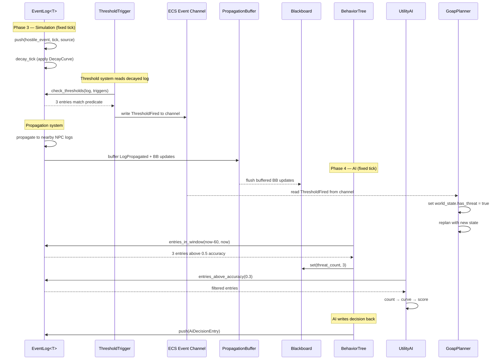

# AI Behavior ↔ Event Logs Integration Design

## Systems Involved

| System | Design | Domain |
|--------|--------|--------|
| AI Behavior | [behavior.md](../ai/behavior.md) | AI |
| Event Logs | [event-logs.md](../simulation/event-logs.md) | Simulation |

## Integration Requirements

| ID | Requirement | Systems |
|----|-------------|---------|
| IR-2.2.1 | BT reads event log for memory checks | AI, EventLog |
| IR-2.2.2 | Utility scores from event history | AI, EventLog |
| IR-2.2.3 | GOAP world state from event counts | AI, EventLog |
| IR-2.2.4 | Threshold triggers influence AI | AI, EventLog |
| IR-2.2.5 | Gossip propagation feeds blackboard | AI, EventLog |
| IR-2.2.6 | AI actions write events to logs | AI, EventLog |

1. **IR-2.2.1** -- BT leaf nodes query `EventLog::entries_above_accuracy()` and
   `entries_in_window()` to check NPC memory of witnessed events (e.g., "saw hostile in last 60s").
2. **IR-2.2.2** -- Utility AI `InputAxis::Custom` considerations score based on event log entry
   counts, recency, and accuracy within a time window.
3. **IR-2.2.3** -- GOAP `WorldState` bits are set from `EventLog` threshold checks (e.g., "3+
   hostile events" sets `has_threat = true`).
4. **IR-2.2.4** -- `ThresholdTrigger` fires `ThresholdFired` events that AI systems consume to
   trigger alert states, flee behavior, or replanning.
5. **IR-2.2.5** -- When `LogPropagated` events arrive (gossip from nearby NPCs), the receiving
   entity's `Blackboard` is updated with the propagated data.
6. **IR-2.2.6** -- AI decision outcomes (attack, flee, investigate) are written as new entries into
   the acting entity's `EventLog` for future recall.

## Data Contracts

| Type | Defined in | Consumed by | Purpose |
|------|-----------|-------------|---------|
| `EventLog<T>` | Event Logs | AI Behavior | Memory store |
| `DecayingEntry<T>` | Event Logs | AI Behavior | Single memory |
| `EventLogQuery` | Event Logs | AI Behavior | Filter criteria |
| `ThresholdFired` | Event Logs | AI Behavior | Alert trigger |
| `LogPropagated` | Event Logs | AI, EventLog | Gossip receipt |
| `AiDecisionEntry` | Integration | Event Logs | Write path |
| `Blackboard` | AI Behavior | AI, EventLog | Agent state |
| `WorldState` | AI Behavior | AI Behavior | GOAP planner |

All types use codegen'd concrete `T` (per event-logs.md RF-1). `PredicateId` indexes into the
middleman .dylib function pointer table, resolving to `fn(&ArchivedDecayingEntry<T>) -> bool`. The
`BtEventMemoryCheck` builds an `EventLogQuery` from its fields, delegating filtering to the query
struct.

**Constraint: Blackboard storage.** `BlackboardScope` in behavior.md uses
`HashMap<BlackboardKey, BlackboardValue>`. Blackboard is a hot path -- BT leaf nodes query it every
tick for event memory results. HashMap violates the project constraint forbidding HashMap on hot
paths. `BlackboardScope::entries` MUST use `BTreeMap<BlackboardKey, BlackboardValue>` or a sorted
`Vec<(BlackboardKey, BlackboardValue)>` with binary search. This is an upstream fix required in
behavior.md; this integration inherits and enforces the constraint.

**Shared immutable data.** `Arc` is permitted only for shared immutable data (e.g.,
`Arc<BehaviorTreeAsset>`, `Arc<DecayCurve>`). Mutable state (Blackboard, EventLog) uses owned values
with exclusive `&mut` access enforced by the ECS schedule.

```rust
/// BT leaf that queries an entity's event log for
/// recent hostile sightings. Sets a blackboard key
/// with the count of matching entries.
///
/// At tick time, constructs an `EventLogQuery` with
/// `predicate`, `min_accuracy`, and time range
/// `[current_tick - window_ticks, current_tick]`,
/// then calls `EventLog::entries_in_window()`.
pub struct BtEventMemoryCheck {
    /// Minimum accuracy for entries to count.
    pub min_accuracy: f32,
    /// Time window in game ticks.
    pub window_ticks: u64,
    /// Codegen'd predicate filtering event type.
    /// Indexes into the middleman .dylib function
    /// pointer table.
    pub predicate: PredicateId,
    /// Blackboard key to store the match count.
    pub result_key: BlackboardKey,
}

impl BtEventMemoryCheck {
    /// Build the `EventLogQuery` this leaf uses.
    pub fn to_query(
        &self,
        current_tick: u64,
    ) -> EventLogQuery {
        EventLogQuery {
            event_type: None,
            time_range: Some(TimeRange {
                start: current_tick
                    .saturating_sub(self.window_ticks),
                end: current_tick,
            }),
            min_accuracy: Some(self.min_accuracy),
            source: None,
            predicate: Some(self.predicate),
            max_results: 0,
        }
    }
}

/// Utility consideration that scores based on
/// the number of high-accuracy events in a
/// recent time window from the entity's log.
/// `T` is the codegen'd concrete event type.
pub struct EventLogConsideration {
    /// Query filter for the event log. Uses the
    /// same `EventLogQuery` struct from
    /// event-logs.md with optional `PredicateId`.
    pub query: EventLogQuery,
    /// Response curve mapping count to score.
    pub curve: ResponseCurve,
}

/// AI decision event written back to the acting
/// entity's `EventLog` (IR-2.2.6). Captures the
/// decision outcome and context for future recall.
pub struct AiDecisionEntry {
    /// Which AI system made the decision.
    pub source: AiDecisionSource,
    /// The chosen action (codegen'd variant).
    pub action: ActionId,
    /// Tick when the decision was made.
    pub decision_tick: u64,
    /// Optional target entity.
    pub target: Option<Entity>,
}

/// Identifies which AI subsystem produced a
/// decision entry.
#[derive(Clone, Copy, Debug, PartialEq, Eq)]
pub enum AiDecisionSource {
    BehaviorTree,
    UtilityAi,
    GoapPlanner,
}

/// System that writes AI decisions into the
/// acting entity's event log after each AI tick.
pub fn write_ai_decision(
    log: &mut EventLog<AiDecisionEntry>,
    entry: AiDecisionEntry,
    current_tick: u64,
    source_entity: Entity,
    position: Option<Vec3>,
);

/// Buffers Blackboard updates from Phase 3
/// propagation for deferred flush in Phase 4.
/// Allocated from the per-thread arena.
pub struct PropagationBuffer {
    /// Pending BB writes: (entity, key, value).
    pending: Vec<(
        Entity,
        BlackboardKey,
        BlackboardValue,
    )>,
}

impl PropagationBuffer {
    /// Queue a BB update from gossip propagation.
    pub fn push(
        &mut self,
        target: Entity,
        key: BlackboardKey,
        value: BlackboardValue,
    );

    /// Flush all pending updates into target
    /// Blackboard components. Called at Phase 4
    /// start. Clears the buffer after flush.
    pub fn flush(
        &mut self,
        blackboards: &mut BTreeMap<
            Entity, Blackboard
        >,
    );
}
```

## Data Flow



## Timing and Ordering

| System | Game loop phase | Timestep | Ordering |
|--------|----------------|----------|----------|
| Event Logs | Phase 3-Simulation | Fixed | Decay first |
| AI Behavior | Phase 4-AI | Fixed | After decay |

Phase 3 completes fully before Phase 4 begins. There is no parallel overlap between phases. This
guarantees:

1. **Decay** runs once per fixed tick in Phase 3.
2. **Propagation** runs after decay in Phase 3. New entries added to target logs and `Blackboard`
   updates are buffered into a `PropagationBuffer`.
3. **Threshold checks** run after propagation in Phase 3. `ThresholdFired` events are written to an
   ECS event channel (MPSC, bounded to 64 per entity per tick).
4. **AI systems** run once per fixed tick in Phase 4. Phase 4 flushes the `PropagationBuffer` into
   target `Blackboard` components, then reads `ThresholdFired` from the ECS event channel.
   `EventLog` reads in Phase 4 have exclusive access to post-decay state because Phase 3 has fully
   completed.

Channel buffering: The `ThresholdFired` ECS event channel uses bounded MPSC (capacity 64 per
entity). If the buffer fills, excess events are dropped and a warning is logged. The
`PropagationBuffer` uses per-thread arena allocation, flushed at Phase 4 start.

## Failure Modes

| ID | Failure | Impact | Recovery |
|----|---------|--------|----------|
| FM-1 | Empty event log | No memory data | Default behavior |
| FM-2 | All entries decayed | Stale memory lost | Revert to patrol |
| FM-3 | Propagation overflow | Log at capacity | FIFO eviction |
| FM-4 | Predicate mismatch | No entries match | Empty result set |
| FM-5 | Unconsumed threshold | No AI component | Drop + warn |
| FM-6 | Channel overflow | MPSC buffer full | Drop + warn |

Fallback paths:

1. **FM-1: Empty event log.** `entries_in_window()` and `entries_above_accuracy()` return empty
   `SmallVec`. BT leaf sets `result_key` to 0. Utility score evaluates to 0.0 via response curve.
   GOAP world state bits remain at defaults. AI falls through to its configured default behavior
   tree (typically patrol).
2. **FM-2: All entries decayed.** Same as FM-1 after decay removes all entries above `min_accuracy`.
   AI reverts to patrol or idle behavior.
3. **FM-3: Propagation overflow.** `EventLog::push` on a full ring buffer evicts the oldest entry
   (FIFO). The evicted entry's `LogEntryDecayed` event fires. No data loss for recent entries.
4. **FM-4: Predicate mismatch.** Codegen'd predicate returns `false` for all entries. Query returns
   empty `SmallVec`, never panics. Caller handles empty results identically to FM-1.
5. **FM-5: Unconsumed threshold events.** If an entity has `ThresholdTrigger` components but no AI
   component, `ThresholdFired` events are written to the ECS event channel but never read. Events
   are dropped at end of tick when the channel is drained. A debug warning is logged in development
   builds.
6. **FM-6: Channel overflow.** If the bounded MPSC channel (capacity 64) fills within a single tick,
   excess `ThresholdFired` events are dropped. A warning is logged with the entity and drop count.
   AI operates on partial threshold data for that tick.

## Platform Considerations

None -- identical across all platforms. `EventLog<T>` and AI systems are pure Rust with no
platform-specific behavior.

## Test Plan

See companion [ai-event-logs-test-cases.md](ai-event-logs-test-cases.md).

## Review Feedback

1. `[APPLIED]` Clarified that `T` is a codegen'd concrete type (per event-logs.md RF-1). Added prose
   and `PredicateId` dispatch path in Data Contracts.

2. `[APPLIED]` Added `BtEventMemoryCheck::to_query()` showing how `PredicateId` maps to
   `EventLogQuery`.

3. `[APPLIED]` Sequence diagram now shows threshold check as a separate system step reading the
   decayed log, not a direct call from EventLog.

4. `[APPLIED]` Sequence diagram now routes `ThresholdFired` through an ECS Event Channel
   participant, not directly to GoapPlanner.

5. `[APPLIED]` Timing table corrected to "Fixed" timestep. Prose documents one-tick-per-phase
   ordering and exclusive access guarantees.

6. `[APPLIED]` Added `AiDecisionEntry` struct, `AiDecisionSource` enum, and `write_ai_decision`
   system signature to Data Contracts pseudocode.

7. `[APPLIED]` `Blackboard` consumed-by changed to "AI, EventLog". `LogPropagated` consumed-by
   changed to "AI, EventLog". Added `AiDecisionEntry` row.

8. `[APPLIED]` Added FM-5 (unconsumed threshold) and FM-6 (channel overflow) to Failure Modes table
   with fallback path documentation.

9. `[APPLIED]` Added TC-IR-2.2.FM4 (predicate mismatch returns empty SmallVec, no panic) to test
   cases.

10. `[APPLIED]` Added TC-IR-2.2.FM3 (FIFO eviction under propagation load) to test cases.

11. `[APPLIED]` Blackboard IS a hot path. HashMap is a constraint violation. Added constraint note
    requiring BTreeMap or sorted Vec with binary search. Flagged as upstream fix in behavior.md.

12. `[APPLIED]` Propagation buffers BB updates via `PropagationBuffer` in Phase 3. Flush occurs at
    Phase 4 start. Added struct, MPSC channel docs, and buffering semantics to Timing section.

13. `[APPLIED]` Phase 3 completes fully before Phase 4 begins. No parallel overlap. EventLog reads
    in Phase 4 have exclusive access. Documented in Timing and Ordering section.
