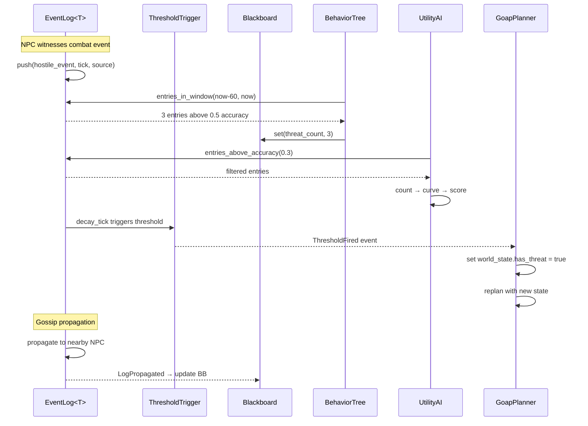

# AI Behavior ↔ Event Logs Integration Design

## Systems Involved

| System | Design | Domain |
|--------|--------|--------|
| AI Behavior | [behavior.md](../ai/behavior.md) | AI |
| Event Logs | [event-logs.md](../simulation/event-logs.md) | Simulation |

## Integration Requirements

| ID | Requirement | Systems |
|----|-------------|---------|
| IR-2.2.1 | BT reads event log for memory checks | AI, EventLog |
| IR-2.2.2 | Utility scores from event history | AI, EventLog |
| IR-2.2.3 | GOAP world state from event counts | AI, EventLog |
| IR-2.2.4 | Threshold triggers influence AI | AI, EventLog |
| IR-2.2.5 | Gossip propagation feeds blackboard | AI, EventLog |
| IR-2.2.6 | AI actions write events to logs | AI, EventLog |

1. **IR-2.2.1** -- BT leaf nodes query `EventLog::entries_above_accuracy()` and
   `entries_in_window()` to check NPC memory of witnessed events (e.g., "saw hostile in last 60s").
2. **IR-2.2.2** -- Utility AI `InputAxis::Custom` considerations score based on event log entry
   counts, recency, and accuracy within a time window.
3. **IR-2.2.3** -- GOAP `WorldState` bits are set from `EventLog` threshold checks (e.g., "3+
   hostile events" sets `has_threat = true`).
4. **IR-2.2.4** -- `ThresholdTrigger` fires `ThresholdFired` events that AI systems consume to
   trigger alert states, flee behavior, or replanning.
5. **IR-2.2.5** -- When `LogPropagated` events arrive (gossip from nearby NPCs), the receiving
   entity's `Blackboard` is updated with the propagated data.
6. **IR-2.2.6** -- AI decision outcomes (attack, flee, investigate) are written as new entries into
   the acting entity's `EventLog` for future recall.

## Data Contracts

| Type | Defined in | Consumed by | Purpose |
|------|-----------|-------------|---------|
| `EventLog<T>` | Event Logs | AI Behavior | Memory store |
| `DecayingEntry<T>` | Event Logs | AI Behavior | Single memory |
| `EventLogQuery` | Event Logs | AI Behavior | Filter criteria |
| `ThresholdFired` | Event Logs | AI Behavior | Alert trigger |
| `LogPropagated` | Event Logs | AI Behavior | Gossip receipt |
| `Blackboard` | AI Behavior | AI Behavior | Agent state |
| `WorldState` | AI Behavior | AI Behavior | GOAP planner |

```rust
/// BT leaf that queries an entity's event log for
/// recent hostile sightings. Sets a blackboard key
/// with the count of matching entries.
pub struct BtEventMemoryCheck {
    /// Minimum accuracy for entries to count.
    pub min_accuracy: f32,
    /// Time window in game ticks.
    pub window_ticks: u64,
    /// Codegen'd predicate filtering event type.
    pub predicate: PredicateId,
    /// Blackboard key to store the match count.
    pub result_key: BlackboardKey,
}

/// Utility consideration that scores based on
/// the number of high-accuracy events in a
/// recent time window from the entity's log.
pub struct EventLogConsideration {
    /// Query filter for the event log.
    pub query: EventLogQuery,
    /// Response curve mapping count to score.
    pub curve: ResponseCurve,
}
```

## Data Flow



## Timing and Ordering

| System | Game loop phase | Timestep | Ordering |
|--------|----------------|----------|----------|
| Event Logs | Phase 3-Simulation | Fixed | Decay first |
| AI Behavior | Phase 4-AI | Variable | After decay |

Event log decay and propagation run in Phase 3 (Simulation) on the fixed timestep. AI systems run in
Phase 4 and read the post-decay log state. This guarantees AI sees consistent accuracy values.

## Failure Modes

| Failure | Impact | Recovery |
|---------|--------|----------|
| Empty event log | No memory data | AI uses default behavior |
| All entries decayed | Stale memory lost | AI reverts to patrol |
| Propagation overflow | Log at capacity | Oldest entries evicted |
| Predicate mismatch | No entries match | Return empty result set |

## Platform Considerations

None -- identical across all platforms. `EventLog<T>` and AI systems are pure Rust with no
platform-specific behavior.

## Test Plan

See companion [ai-event-logs-test-cases.md](ai-event-logs-test-cases.md).
