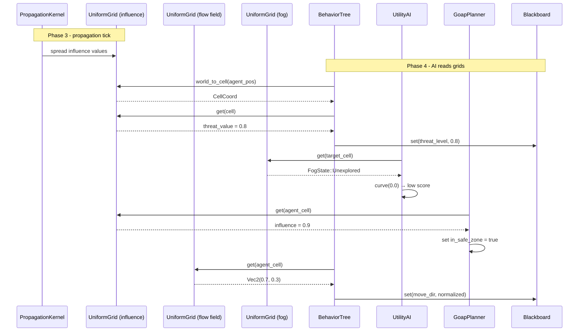

# AI Behavior ↔ Grids/Volumes Integration Design

## Systems Involved

| System | Design | Domain |
|--------|--------|--------|
| AI Behavior | [behavior.md](../ai/behavior.md) | AI |
| Grids/Volumes | [grids-volumes.md](../simulation/grids-volumes.md) | Simulation |

## Integration Requirements

| ID | Requirement | Systems |
|----|-------------|---------|
| IR-2.3.1 | AI reads influence maps for decisions | AI, Grids |
| IR-2.3.2 | AI reads flow fields for movement | AI, Grids |
| IR-2.3.3 | AI reads fog of war for visibility | AI, Grids |
| IR-2.3.4 | Utility scores from grid cell values | AI, Grids |
| IR-2.3.5 | GOAP world state from grid queries | AI, Grids |
| IR-2.3.6 | AI writes influence to grids | AI, Grids |

1. **IR-2.3.1** -- BT leaf nodes query `UniformGrid<f32>` influence maps via `world_to_cell()` +
   `get()` to read threat, resource, or territory values at the agent's position.
2. **IR-2.3.2** -- AI movement systems read `UniformGrid<Vec2>` flow fields to get a pre-computed
   direction vector for pathfinding toward goals without per-agent A*.
3. **IR-2.3.3** -- BT conditions and utility considerations check `UniformGrid<FogState>` cells to
   determine if a target position is visible, explored, or unexplored.
4. **IR-2.3.4** -- Utility AI `InputAxis::Custom` considerations sample grid cell values at
   candidate positions and map them through response curves for scoring.
5. **IR-2.3.5** -- GOAP `WorldState` bits are set from grid queries (e.g., "in_safe_zone" when
   influence > threshold at agent position).
6. **IR-2.3.6** -- AI systems write influence values back to grids (e.g., marking claimed territory
   or danger zones after combat).

## Data Contracts

| Type | Defined in | Consumed by | Purpose |
|------|-----------|-------------|---------|
| `UniformGrid<f32>` | Grids | AI Behavior | Influence map |
| `UniformGrid<Vec2>` | Grids | AI Behavior | Flow field |
| `UniformGrid<T>` | Grids | AI Behavior | Visibility (1) |
| `CellCoord` | Grids | AI Behavior | Grid position |
| `Blackboard` | AI Behavior | AI Behavior | Agent state (2) |

1. Fog of war cell type `T` (e.g., `FogState`) is user-defined and codegen'd into the middleman
   .dylib. The engine treats it as an opaque `T`. See grids-volumes.md section 12 for codegen
   details.
2. `Blackboard` uses `BTreeMap<BlackboardKey, BlackboardValue>` (not `HashMap`) because every agent
   samples grids and writes results to its blackboard each frame, making this a hot path. See
   behavior.md `BlackboardScope`.

```rust
/// BT leaf that samples an influence map at the
/// agent's world position and writes the value
/// to a blackboard key.
pub struct BtInfluenceSample {
    /// Entity holding the UniformGrid<f32>.
    pub grid_entity: Entity,
    /// Blackboard key to store the sampled value.
    pub target_key: BlackboardKey,
}

/// Utility consideration that scores a candidate
/// position by sampling a grid cell value.
pub struct GridCellConsideration {
    /// Entity holding the target grid.
    pub grid_entity: Entity,
    /// World position to sample (from blackboard).
    pub position_key: BlackboardKey,
    /// Response curve mapping cell value to score.
    pub curve: ResponseCurve,
}

/// Flow field direction lookup result.
pub struct FlowFieldSample {
    /// Direction vector from the flow field cell.
    pub direction: Vec2,
    /// Whether the cell is valid (reachable).
    pub valid: bool,
}

/// BT leaf that writes an influence value back to
/// a grid cell at the agent's position (IR-2.3.6).
/// Sends an InfluenceWriteMsg through an MPSC
/// channel so concurrent AI systems never race on
/// grid mutation.
pub struct BtInfluenceWrite {
    /// Entity holding the UniformGrid<f32>.
    /// Generational index -- stale handles are
    /// safely rejected (see ecs.md Entity).
    pub grid_entity: Entity,
    /// Blackboard key holding the value to write.
    pub value_key: BlackboardKey,
    /// Write mode: additive or overwrite.
    pub mode: InfluenceWriteMode,
}

/// How an influence write merges with the existing
/// cell value.
pub enum InfluenceWriteMode {
    /// New value = old + written.
    Additive,
    /// New value = written (last writer wins within
    /// the batch).
    Overwrite,
}

/// Message sent through the per-grid MPSC channel.
/// AI systems in Phase 4 enqueue writes; a single
/// drain system applies them sequentially before
/// Phase 3 propagation of the next frame.
///
/// Channel buffering: bounded to
/// `MAX_WRITES_PER_GRID` (default 4096). If the
/// channel is full the write is dropped and logged
/// as a warning. The drain system processes all
/// pending messages in one batch.
pub struct InfluenceWriteMsg {
    /// Cell to write to.
    pub cell: CellCoord,
    /// Value to write.
    pub value: f32,
    /// Write mode.
    pub mode: InfluenceWriteMode,
}
```

## Data Flow



## Timing and Ordering

| System | Game loop phase | Timestep | Ordering |
|--------|----------------|----------|----------|
| Grids propagation | Phase 3-Simulation | Fixed | Propagate first |
| AI Behavior | Phase 4-AI | Variable | After propagation |

Grid propagation runs on the fixed timestep in Phase 3 (Simulation). AI systems in Phase 4 read the
post-propagation grid state. AI writes to grids (IR-2.3.6) also happen in Phase 4 and are picked up
by the next propagation tick.

## Failure Modes

| Failure | Impact | Recovery |
|---------|--------|----------|
| Agent outside grid | No cell data | Return default value |
| Grid not yet propagated | Stale values | Use last frame data |
| Flow field unreachable | Invalid direction | Fallback to direct path |
| Fog state unknown | Cannot assess target | Treat as unexplored |

## Platform Considerations

None -- identical across all platforms. `UniformGrid<T>` is a pure Rust data structure. GPU sync for
rendering overlays is handled by the grids/volumes system independently of AI reads.

## Test Plan

See companion [ai-grids-volumes-test-cases.md](ai-grids-volumes-test-cases.md).

## Review Feedback

1. `[CONFIDENT]` `FogState` is referenced in the Data Contracts table and pseudocode (IR-2.3.3) but
   is not defined in either the grids-volumes or AI behavior design documents. It needs to be
   defined in `grids-volumes.md` or documented here as a user-defined cell type `T`.

2. `[CONFIDENT]` The document covers only `UniformGrid<T>` (2D). The grids-volumes design also
   defines `VoxelVolume<T>` (3D) and `HierarchicalGrid` (2D LOD). The engine requires 2D/2.5D/3D
   support in every subsystem, but this integration has no coverage of AI reading 3D voxel volumes
   (e.g., 3D influence or fog in a voxel world).

3. `[CONFIDENT]` IR-2.3.6 (AI writes influence to grids) has no Rust pseudocode in the Data
   Contracts section. There is no struct or function signature showing how AI systems write values
   back. Add a write-back data contract (e.g., `BtInfluenceWrite` or a system function signature).

4. `[CONFIDENT]` The sequence diagram does not show the IR-2.3.6 write-back flow. AI writing
   influence back to grids is described in prose but absent from the Mermaid diagram. Add a sequence
   showing AI writing to the grid and the next propagation tick picking it up.

5. `[CONFIDENT]` Test cases are missing benchmarks for IR-2.3.4 (utility scoring from grid cells)
   and IR-2.3.5 (GOAP world state from grid queries). Every other IR has a benchmark entry.

6. `[UNCERTAIN]` IR-2.3.6 states AI writes happen in Phase 4 and are "picked up by the next
   propagation tick" in Phase 3. If multiple AI systems write to the same grid cells concurrently
   within Phase 4 (parallel ECS systems), the document does not specify ordering or conflict
   resolution. Should writes be atomic, additive, or last-writer-wins?

7. `[UNCERTAIN]` The Timing table shows AI Behavior runs on "Variable" timestep while Grids
   propagation runs on "Fixed" timestep. When multiple variable-rate AI ticks occur between fixed
   propagation ticks, the document does not clarify whether grid reads return interpolated data or
   the last fixed-tick snapshot.

8. `[CONFIDENT]` The `Blackboard` design in `behavior.md` uses
   `HashMap<BlackboardKey, BlackboardValue>` for `BlackboardScope`. The engine forbids `HashMap` on
   hot paths. Since every AI agent samples grids and writes results to its blackboard every frame,
   this is a hot path. The blackboard should use `BTreeMap` or sorted `Vec`.

9. `[CONFIDENT]` The `PropagationKernel<f32>` appears in the Data Contracts table as "Consumed by:
   AI Behavior" but no pseudocode or integration requirement references AI systems configuring or
   reading propagation kernels. Either remove it from the table or add an IR describing the
   interaction.

10. `[CONFIDENT]` The `GridCellConsideration` struct stores `grid_entity: Entity` as a direct entity
    reference. The engine prefers generational indices over raw entity references for safety.
    Clarify whether `Entity` here is a generational index (as in the custom ECS design) or a raw ID.

11. `[CONFIDENT]` The Failure Modes table lists "Grid not yet propagated" with recovery "Use last
    frame data," but does not explain how last frame data is accessed. The immutable-first data
    pattern suggests double-buffering. If grids are double-buffered, state that AI reads the front
    buffer; if not, document why stale reads are safe.

12. `[CONFIDENT]` The `FlowFieldSample` struct in Data Contracts uses `Vec2` for direction, limiting
    it to 2D. For 3D games with vertical movement (flying AI, multi-floor buildings), a `Vec3`
    variant or a generic approach is needed to satisfy the 2D/3D requirement.
