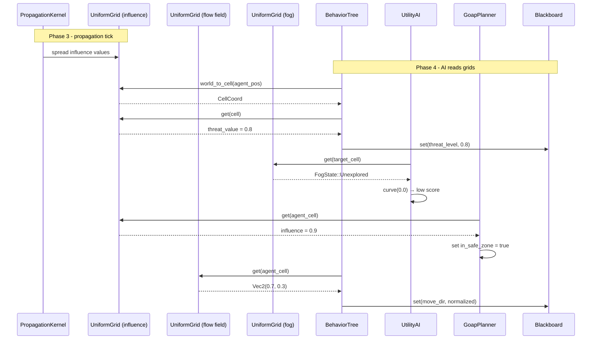

# AI Behavior ↔ Grids/Volumes Integration Design

## Systems Involved

| System | Design | Domain |
|--------|--------|--------|
| AI Behavior | [behavior.md](../ai/behavior.md) | AI |
| Grids/Volumes | [grids-volumes.md](../simulation/grids-volumes.md) | Simulation |

## Integration Requirements

| ID | Requirement | Systems |
|----|-------------|---------|
| IR-2.3.1 | AI reads influence maps for decisions | AI, Grids |
| IR-2.3.2 | AI reads flow fields for movement | AI, Grids |
| IR-2.3.3 | AI reads fog of war for visibility | AI, Grids |
| IR-2.3.4 | Utility scores from grid cell values | AI, Grids |
| IR-2.3.5 | GOAP world state from grid queries | AI, Grids |
| IR-2.3.6 | AI writes influence to grids | AI, Grids |

1. **IR-2.3.1** -- BT leaf nodes query `UniformGrid<f32>` influence maps via `world_to_cell()` +
   `get()` to read threat, resource, or territory values at the agent's position.
2. **IR-2.3.2** -- AI movement systems read `UniformGrid<Vec2>` flow fields to get a pre-computed
   direction vector for pathfinding toward goals without per-agent A*.
3. **IR-2.3.3** -- BT conditions and utility considerations check `UniformGrid<FogState>` cells to
   determine if a target position is visible, explored, or unexplored.
4. **IR-2.3.4** -- Utility AI `InputAxis::Custom` considerations sample grid cell values at
   candidate positions and map them through response curves for scoring.
5. **IR-2.3.5** -- GOAP `WorldState` bits are set from grid queries (e.g., "in_safe_zone" when
   influence > threshold at agent position).
6. **IR-2.3.6** -- AI systems write influence values back to grids (e.g., marking claimed territory
   or danger zones after combat).

## Data Contracts

| Type | Defined in | Consumed by | Purpose |
|------|-----------|-------------|---------|
| `UniformGrid<f32>` | Grids | AI Behavior | Influence map |
| `UniformGrid<Vec2>` | Grids | AI Behavior | Flow field |
| `UniformGrid<FogState>` | Grids | AI Behavior | Visibility |
| `CellCoord` | Grids | AI Behavior | Grid position |
| `PropagationKernel<f32>` | Grids | AI Behavior | Influence spread |
| `Blackboard` | AI Behavior | AI Behavior | Agent state |

```rust
/// BT leaf that samples an influence map at the
/// agent's world position and writes the value
/// to a blackboard key.
pub struct BtInfluenceSample {
    /// Entity holding the UniformGrid<f32>.
    pub grid_entity: Entity,
    /// Blackboard key to store the sampled value.
    pub target_key: BlackboardKey,
}

/// Utility consideration that scores a candidate
/// position by sampling a grid cell value.
pub struct GridCellConsideration {
    /// Entity holding the target grid.
    pub grid_entity: Entity,
    /// World position to sample (from blackboard).
    pub position_key: BlackboardKey,
    /// Response curve mapping cell value to score.
    pub curve: ResponseCurve,
}

/// Flow field direction lookup result.
pub struct FlowFieldSample {
    /// Direction vector from the flow field cell.
    pub direction: Vec2,
    /// Whether the cell is valid (reachable).
    pub valid: bool,
}
```

## Data Flow



## Timing and Ordering

| System | Game loop phase | Timestep | Ordering |
|--------|----------------|----------|----------|
| Grids propagation | Phase 3-Simulation | Fixed | Propagate first |
| AI Behavior | Phase 4-AI | Variable | After propagation |

Grid propagation runs on the fixed timestep in Phase 3 (Simulation). AI systems in Phase 4 read the
post-propagation grid state. AI writes to grids (IR-2.3.6) also happen in Phase 4 and are picked up
by the next propagation tick.

## Failure Modes

| Failure | Impact | Recovery |
|---------|--------|----------|
| Agent outside grid | No cell data | Return default value |
| Grid not yet propagated | Stale values | Use last frame data |
| Flow field unreachable | Invalid direction | Fallback to direct path |
| Fog state unknown | Cannot assess target | Treat as unexplored |

## Platform Considerations

None -- identical across all platforms. `UniformGrid<T>` is a pure Rust data structure. GPU sync for
rendering overlays is handled by the grids/volumes system independently of AI reads.

## Test Plan

See companion [ai-grids-volumes-test-cases.md](ai-grids-volumes-test-cases.md).
