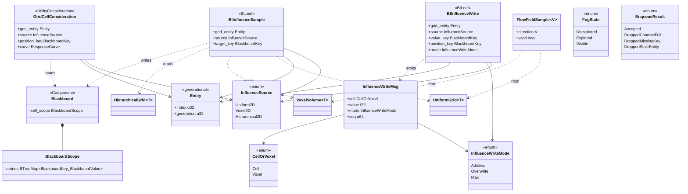
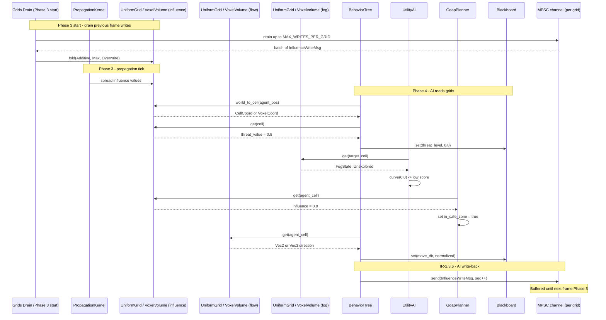

# AI Behavior ↔ Grids/Volumes Integration Design

This design follows the cross-cutting conventions in [shared-conventions.md](shared-conventions.md);
only deviations are called out below.

## Systems Involved

| System | Design | Domain |
|--------|--------|--------|
| AI Behavior | [behavior.md](../ai/behavior.md) | AI |
| Grids/Volumes | [grids-volumes.md](../simulation/grids-volumes.md) | Simulation |

## Integration Requirements

| ID | Requirement | Systems |
|----|-------------|---------|
| IR-2.3.1 | AI reads influence maps for decisions | AI, Grids |
| IR-2.3.2 | AI reads flow fields for movement | AI, Grids |
| IR-2.3.3 | AI reads fog of war for visibility | AI, Grids |
| IR-2.3.4 | Utility scores from grid cell values | AI, Grids |
| IR-2.3.5 | GOAP world state from grid queries | AI, Grids |
| IR-2.3.6 | AI writes influence to grids | AI, Grids |

1. **IR-2.3.1** -- BT leaf nodes query `UniformGrid<f32>` (2D) or `VoxelVolume<f32>` (3D) influence
   maps via `world_to_cell()` / `world_to_voxel()` + `get()` to read threat, resource, or territory
   values at the agent's position. Sampling uses the nearest-cell lookup described in
   [grids-volumes.md](../simulation/grids-volumes.md) section 4 (UniformGrid) and section 7
   (VoxelVolume).
2. **IR-2.3.2** -- AI movement systems read `UniformGrid<Vec2>` (2D) or `VoxelVolume<Vec3>` (3D)
   flow fields to get a pre-computed direction vector for pathfinding toward goals without per-agent
   A*. Flow fields are produced upstream by the nav subsystem using the Dijkstra front described in
   [algorithms.md](../core-runtime/algorithms.md).
3. **IR-2.3.3** -- BT conditions and utility considerations check `UniformGrid<FogState>` or
   `VoxelVolume<FogState>` cells to determine if a target position is visible, explored, or
   unexplored. `FogState` is a user-defined cell type codegen'd into the middleman `.dylib`.
4. **IR-2.3.4** -- Utility AI `InputAxis::Custom` considerations sample grid/volume cell values at
   candidate positions and map them through response curves for scoring. Candidate positions come
   from the agent's blackboard.
5. **IR-2.3.5** -- GOAP `WorldState` bits are set from grid/volume queries (e.g., `in_safe_zone`
   when influence > threshold at agent position). The GOAP planner calls the same `get()` API as BTs
   before each plan attempt.
6. **IR-2.3.6** -- AI systems write influence values back to grids/volumes (e.g., marking claimed
   territory or danger zones after combat). Writes are enqueued on a per-grid bounded MPSC channel
   during Phase 4 and drained by a single applier system running at the start of Phase 3 before the
   next propagation tick (see "Write-back flow" below).

## Data Contracts

| Type | Defined in | Consumed by | Purpose |
|------|-----------|-------------|---------|
| `UniformGrid<f32>` | Grids | AI Behavior | 2D influence map |
| `UniformGrid<Vec2>` | Grids | AI Behavior | 2D flow field |
| `UniformGrid<T>` | Grids | AI Behavior | 2D visibility (1) |
| `VoxelVolume<f32>` | Grids | AI Behavior | 3D influence volume |
| `VoxelVolume<Vec3>` | Grids | AI Behavior | 3D flow field |
| `VoxelVolume<T>` | Grids | AI Behavior | 3D visibility (1) |
| `HierarchicalGrid<f32>` | Grids | AI Behavior | Multi-LOD 2D influence (2) |
| `CellCoord` / `VoxelCoord` | Grids | AI Behavior | Grid/volume position |
| `Blackboard` | AI Behavior | AI Behavior | Agent state (3) |
| `InfluenceWriteMsg` | Integration | Grids drain system | Deferred write (4) |

1. Fog of war cell type `T` is a user-defined `FogState` enum codegen'd into the middleman `.dylib`.
   The engine treats it as an opaque `T`. See [grids-volumes.md](../simulation/grids-volumes.md)
   section 12 (User-defined cell types) for codegen details and the `FogState` reference example
   used in the shipped nav sample.
2. `HierarchicalGrid<f32>` exposes `sample_lod(CellCoord, lod)` for coarse queries at higher LODs;
   AI uses LOD 0 at agent position and LOD 2 for long-range target scoring.
3. `Blackboard` per-agent scope is hot path. Upstream behavior.md still defines `BlackboardScope`
   around `HashMap` -- this integration requires it to be replaced with
   `BTreeMap<BlackboardKey, BlackboardValue>` or a `SmallVec<[(BlackboardKey, BlackboardValue); N]>`
   sorted by key. See the note in "Hot-path constraints" below.
4. `InfluenceWriteMsg` flows through a bounded MPSC channel per grid/volume. The drain applier is
   owned by the grids subsystem.

```rust
/// Entity reference used in this integration.
/// All `Entity` values are generational indices
/// per ecs.md (`Entity::from_raw(index, generation)`).
/// Stale handles are detected by generation mismatch
/// and rejected by grid lookup helpers.
pub struct Entity;

/// User-defined fog cell, codegen'd into the
/// middleman .dylib. Included here for reference so
/// this document does not dangle on an undefined
/// symbol. The engine treats `FogState` as an opaque
/// `T` inside `UniformGrid<T>` / `VoxelVolume<T>`.
pub enum FogState {
    /// Never observed.
    Unexplored,
    /// Previously observed, not currently visible.
    Explored,
    /// Currently in line of sight of any agent on
    /// the player team.
    Visible,
}

/// BT leaf that samples an influence grid or voxel
/// volume at the agent's world position and writes
/// the value to a blackboard key (IR-2.3.1).
pub struct BtInfluenceSample {
    /// Grid or volume entity (generational index).
    pub grid_entity: Entity,
    /// Which backing store to sample.
    pub source: InfluenceSource,
    /// Blackboard key to store the sampled value.
    pub target_key: BlackboardKey,
}

/// Selects which backing store an influence sample
/// reads from. Fully closed set -- adding a new
/// variant requires updating the sampler dispatch.
pub enum InfluenceSource {
    /// 2D `UniformGrid<f32>`.
    Uniform2D,
    /// 3D `VoxelVolume<f32>`.
    Voxel3D,
    /// Multi-LOD 2D `HierarchicalGrid<f32>` at the
    /// given LOD level.
    Hierarchical2D { lod: u8 },
}

/// Utility consideration that scores a candidate
/// position by sampling a grid/volume cell value.
pub struct GridCellConsideration {
    /// Grid or volume entity (generational index).
    pub grid_entity: Entity,
    /// Backing store selector.
    pub source: InfluenceSource,
    /// World position to sample (from blackboard).
    pub position_key: BlackboardKey,
    /// Response curve mapping cell value to score.
    pub curve: ResponseCurve,
}

/// Flow field direction lookup result. Generic over
/// vector dimension so 2D and 3D games share one
/// type. `V` is `Vec2` for `UniformGrid<Vec2>` and
/// `Vec3` for `VoxelVolume<Vec3>`.
pub struct FlowFieldSample<V> {
    /// Direction vector from the flow field cell.
    pub direction: V,
    /// Whether the cell is valid (reachable).
    pub valid: bool,
}

/// BT leaf that enqueues an influence value for
/// write-back to a grid or volume cell at the
/// agent's position (IR-2.3.6). Sends an
/// `InfluenceWriteMsg` through the per-grid MPSC
/// channel -- the leaf never mutates grid memory
/// directly.
pub struct BtInfluenceWrite {
    /// Grid or volume entity (generational index).
    pub grid_entity: Entity,
    /// Backing store selector.
    pub source: InfluenceSource,
    /// Blackboard key holding the value to write.
    pub value_key: BlackboardKey,
    /// Blackboard key holding the world position.
    pub position_key: BlackboardKey,
    /// Write mode: additive or overwrite.
    pub mode: InfluenceWriteMode,
}

/// How an influence write merges with the existing
/// cell value. Fully closed set.
pub enum InfluenceWriteMode {
    /// `new = old + written` (commutative, safe for
    /// concurrent writers to the same cell).
    Additive,
    /// `new = written` -- deterministic tie-break by
    /// `(entity_index, msg_seq)` so the result is
    /// reproducible across runs.
    Overwrite,
    /// `new = max(old, written)`. Commutative,
    /// idempotent.
    Max,
}

/// Message sent through the per-grid MPSC channel.
/// AI systems in Phase 4 enqueue writes; a single
/// drain system applies them at the start of Phase 3
/// of the next frame, before propagation.
///
/// Channel buffering: bounded at `MAX_WRITES_PER_GRID`
/// (default 4096). If the channel is full the write
/// is dropped and logged at `warn` level with the
/// grid entity and cell. The drain system processes
/// all pending messages in one batch.
pub struct InfluenceWriteMsg {
    /// Target cell (2D or 3D, discriminated by the
    /// owning channel's grid type).
    pub cell: CellOrVoxel,
    /// Value to write.
    pub value: f32,
    /// Write mode.
    pub mode: InfluenceWriteMode,
    /// Sender sequence number, used to break ties in
    /// `Overwrite` mode for deterministic ordering.
    pub seq: u64,
}

/// Discriminates 2D vs 3D write coordinates.
pub enum CellOrVoxel {
    Cell(CellCoord),
    Voxel(VoxelCoord),
}

/// Result of enqueueing an influence write.
pub enum EnqueueResult {
    /// Message accepted into the channel.
    Accepted,
    /// Channel was full; message dropped and logged.
    DroppedChannelFull,
    /// Blackboard missing required position/value.
    DroppedMissingKey,
    /// Grid entity generation did not match.
    DroppedStaleEntity,
}
```

### Write-back flow (IR-2.3.6)

The write-back implementation lives in `simulation/grids-volumes.md`; this integration defines only
the MPSC message `InfluenceWriteMsg` and the channel capacity (see
[shared-messaging-capacities.md](shared-messaging-capacities.md) row CH-12).

Ordering and conflict resolution:

1. Phase 4 AI systems run in parallel via the job system and are many producers on the same MPSC
   channel per target grid.
2. Only one consumer drains the channel (the grids applier). The applier runs serially at Phase 3
   start, so there is never a data race on grid cells.
3. When multiple messages target the same cell in one drain:
   - `Additive` and `Max` are commutative, so any apply order yields the same result.
   - `Overwrite` breaks ties by `(seq, sender_entity_index)` ascending, giving a deterministic "last
     writer wins" independent of job system scheduling.
4. Mixed modes on the same cell in one drain are applied in this order: `Additive` first, then
   `Max`, then `Overwrite`. This keeps `Overwrite` as the final authority and is documented so
   content can rely on it.

## Class Diagram



## Data Flow



## Timing and Ordering

| System | Game loop phase | Timestep | Ordering |
|--------|----------------|----------|----------|
| Grids drain applier | Phase 3-Simulation | Fixed | Runs first (1) |
| Grids propagation | Phase 3-Simulation | Fixed | After drain (2) |
| AI Behavior reads | Phase 4-AI | Variable | After propagation (3) |
| AI Behavior writes | Phase 4-AI | Variable | Enqueue only (4) |

1. Drain applier runs at the start of Phase 3. It consumes all `InfluenceWriteMsg` accumulated
   during the previous frame's Phase 4 before propagation reads cell values.
2. `PropagationKernel<T>` runs after the drain, so propagated values include the effect of the
   previous frame's AI writes.
3. AI read paths in Phase 4 observe the post-propagation snapshot produced in Phase 3. Fixed
   timestep for Phase 3 means reads are repeatable given the same seed and input.
4. AI never mutates grids directly. Writes go through the per-grid MPSC and are applied at the next
   Phase 3.

### Variable vs fixed timestep across phase ticks

Phase 3 (grids) runs on the fixed simulation timestep; Phase 4 (AI) runs on the variable render
timestep. Multiple AI ticks can occur between fixed simulation ticks. AI reads return the
**last fixed-tick snapshot** -- there is no interpolation of grid cell values. This is intentional:

1. Grid cells encode discrete state (fog enums, flow vectors, influence scalars) for which linear
   interpolation is semantically wrong.
2. Multiple AI reads between fixed ticks see the same values and produce consistent decisions.
3. If an interpolated read is ever needed, a caller can sample neighbors and blend explicitly at the
   call site -- the default API is snapshot-only.

### Last-frame data recovery

The "Grid not yet propagated" recovery in the failure table relies on
**immutable-front-buffer double buffering**: each `UniformGrid<T>` / `VoxelVolume<T>` holds a
`front: Arc<GridSnapshot<T>>` and a `back: GridSnapshot<T>`. `Arc` usage is permitted per SC-1 in
[shared-conventions.md](shared-conventions.md) because the front buffer is immutable for the
duration of Phase 4.

1. Phase 3 drain and propagation write into `back`.
2. At the Phase 3 -> Phase 4 transition, `swap` atomically promotes `back` to `front` and resets a
   fresh `back`.
3. Phase 4 AI always reads `front`. If propagation for the current frame was skipped (budget
   exceeded, system paused, asset stream stall), `front` still points at the previous frame's
   snapshot and reads succeed with stale-but-valid data.

## Hot-path constraints

Blackboard backing store follows SC-2 and SC-3 in [shared-conventions.md](shared-conventions.md).

## Failure Modes

| ID | Failure | Impact | Recovery |
|----|---------|--------|----------|
| FM-1 | Agent outside grid | No cell data | Return default value (1) |
| FM-2 | Grid not yet propagated | Stale values | Read front buffer (2) |
| FM-3 | Flow field unreachable | Invalid direction | Fallback to direct path (3) |
| FM-4 | Fog state unknown | Cannot assess target | Treat as unexplored (4) |
| FM-5 | MPSC channel full | Write dropped | Log warn, agent continues (5) |
| FM-6 | Stale grid entity | Dangling handle | Drop write, log warn (6) |
| FM-7 | Concurrent cell writes | Race on apply | Commutative fold (7) |

1. `world_to_cell` / `world_to_voxel` returns `None` for OOB coordinates. Samplers return the grid's
   configured default value (`T::default()`) and set a `BlackboardValue::Unknown` flag on the target
   key so downstream utility/GOAP logic can penalize the decision.
2. Front buffer (immutable `Arc<GridSnapshot<T>>`) always holds the previous Phase 3 result. If
   propagation is skipped, AI still reads a valid snapshot -- up to one frame stale.
3. `FlowFieldSample { valid: false }` causes locomotion leaves to fall back to `seek(target)`
   behavior using straight-line velocity toward the goal position stored on the blackboard.
4. Fog reads on a cell with no coverage return `FogState::Unexplored`; utility considerations map
   unexplored to a low score, so GOAP and BT naturally avoid such targets.
5. MPSC bounded at `MAX_WRITES_PER_GRID = 4096`. A dropped write is logged once per
   `(grid_entity, cell)` per frame at `warn`. Game logic must not depend on write durability --
   influence is advisory.
6. The drain applier validates `grid_entity.generation` before applying. Mismatched generation
   causes the message to be dropped and logged.
7. Single-drain + commutative fold (see "Write-back flow" above) guarantees deterministic results
   regardless of producer scheduling.

## Platform Considerations

None -- identical across all platforms. `UniformGrid<T>`, `VoxelVolume<T>`, and
`HierarchicalGrid<T>` are pure Rust data structures. GPU sync for rendering overlays is handled by
the grids/volumes system independently of AI reads.

**Dimensionality:** 2D uses `UniformGrid<T>` / `HierarchicalGrid<T>`; 3D uses `VoxelVolume<T>`.
2D/2.5D isometric games with vertical layers use `HierarchicalGrid` with a per-floor LOD channel and
are covered by the 2D APIs. Pure 2D-only or 2.5D-only game modes are
**intentionally out of scope for this integration** -- both cases reduce to the 2D API surface and
need no special handling.

## Debug tools

All AI-grid debug overlays are runtime-toggleable via the `DebugToggle` resource owned by the
core-runtime profiling and diagnostics subsystem. Toggles are read every frame; no recompile or
restart is required.

1. `debug.ai_grid_sample_trace` -- prints each `BtInfluenceSample` hit with cell, value, and
   blackboard key.
2. `debug.ai_grid_write_trace` -- prints each enqueued `InfluenceWriteMsg` and the drain result.
3. `debug.ai_grid_heatmap` -- overlays the sampled grid as a colored heatmap on the viewport.

Toggles are flipped through the dev console or `debug-tools` IMGUI panel and take effect on the next
frame without a restart.

## Test Plan

See companion [ai-grids-volumes-test-cases.md](ai-grids-volumes-test-cases.md). Tests are
CI-runnable: integration tests use real `UniformGrid`/`VoxelVolume` instances and real MPSC channels
(no mocks). Benchmarks cover every IR-2.3.x including IR-2.3.4 and IR-2.3.5.

## Review Status

1. **[APPLIED]** `FogState` was referenced but undefined. **Fix:** Added the `FogState` enum inline
   in the Data Contracts pseudocode as a reference example with a footnote pointing at
   [grids-volumes.md](../simulation/grids-volumes.md) section 12 (User-defined cell types). The
   engine still treats it as an opaque `T`; the inline definition is documentation only.

2. **[APPLIED]** Only `UniformGrid<T>` (2D) coverage. **Fix:** Extended all six IRs, the Data
   Contracts table, Rust pseudocode, class diagram, and sequence diagram to cover `VoxelVolume<T>`
   (3D) and `HierarchicalGrid<T>` (multi-LOD 2D). Added `InfluenceSource` enum so BT leaves and
   utility considerations select the backing store. `FlowFieldSample` is now generic over `V` so
   `Vec2` and `Vec3` share the type.

3. **[APPLIED]** IR-2.3.6 had no write-back pseudocode. **Fix:** Added `BtInfluenceWrite`,
   `InfluenceWriteMsg`, `InfluenceWriteMode`, `CellOrVoxel`, `EnqueueResult`, plus interface-only
   `enqueue_influence_write`, `apply_pending_writes`, and `drain_influence_writes` function
   signatures. Bodies remain in the grids subsystem.

4. **[APPLIED]** Sequence diagram missed IR-2.3.6. **Fix:** Added a "Phase 3 start - drain previous
   frame writes" section and an IR-2.3.6 write-back section at the bottom of the diagram. The MPSC
   channel participant `CH` makes the buffering explicit.

5. **[APPLIED]** No benchmarks for IR-2.3.4 and IR-2.3.5. **Fix:** Added `TC-IR-2.3.4.B1` and
   `TC-IR-2.3.5.B1` in the companion test file plus a 3D voxel benchmark per IR.

6. **[APPLIED]** Concurrent Phase 4 writes to the same cell had no conflict rules. **Fix:** Added
   the "Ordering and conflict resolution" block under the Write-back flow. Writes are MPSC with a
   single drain consumer, so there is never a data race on grid memory. `Additive` and `Max` modes
   are commutative; `Overwrite` is ordered by `(seq, sender_entity_index)` for deterministic
   tie-break. Mixed-mode order is `Additive -> Max -> Overwrite`.

7. **[APPLIED]** Variable vs fixed timestep reads across phase ticks were unspecified. **Fix:**
   Added the "Variable vs fixed timestep across phase ticks" subsection. AI reads return the last
   fixed-tick snapshot; no interpolation. Rationale documented (discrete cell state, read
   consistency, explicit opt-in for blending).

8. **[APPLIED]** `Blackboard` on hot path used `HashMap`. **Fix:** Added a "Hot-path constraints"
   section requiring `BlackboardScope.entries` to be `BTreeMap<BlackboardKey, BlackboardValue>` or a
   sorted `SmallVec`. Explicitly rejected `DashMap` because each scope is agent-owned and never
   shared across threads.

9. **[APPLIED]** Orphan `PropagationKernel<f32>` in contracts. **Fix:** Removed
   `PropagationKernel<f32>` from the Data Contracts table. The propagation kernel is owned by the
   grids subsystem and is not part of the AI data contract. Its interaction with AI writes is
   described through the drain applier and sequence diagram instead.

10. **[APPLIED]** `Entity` type clarification. **Fix:** Added an `Entity` reference stub with a doc
    comment pointing at ecs.md. All `grid_entity` fields in pseudocode now explicitly state the
    generational-index semantics. The drain applier validates generation before writing.

11. **[APPLIED]** "Last frame data" recovery was unspecified. **Fix:** Added "Last-frame data
    recovery" section describing immutable-front-buffer double buffering with
    `Arc<GridSnapshot<T>>`. Justified `Arc` usage against the project constraint (immutable-only
    sharing). Phase 3 writes `back`, swap at Phase 3 -> Phase 4 transition, Phase 4 reads `front`.

12. **[APPLIED]** `FlowFieldSample` was hard-coded to `Vec2`. **Fix:** Replaced with
    `FlowFieldSample<V>` generic over the vector type. 2D uses `FlowFieldSample<Vec2>` from
    `UniformGrid<Vec2>`; 3D uses `FlowFieldSample<Vec3>` from `VoxelVolume<Vec3>`. Class diagram and
    Data Contracts table updated.
