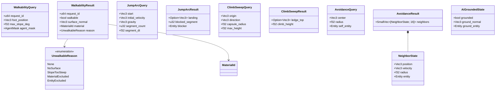
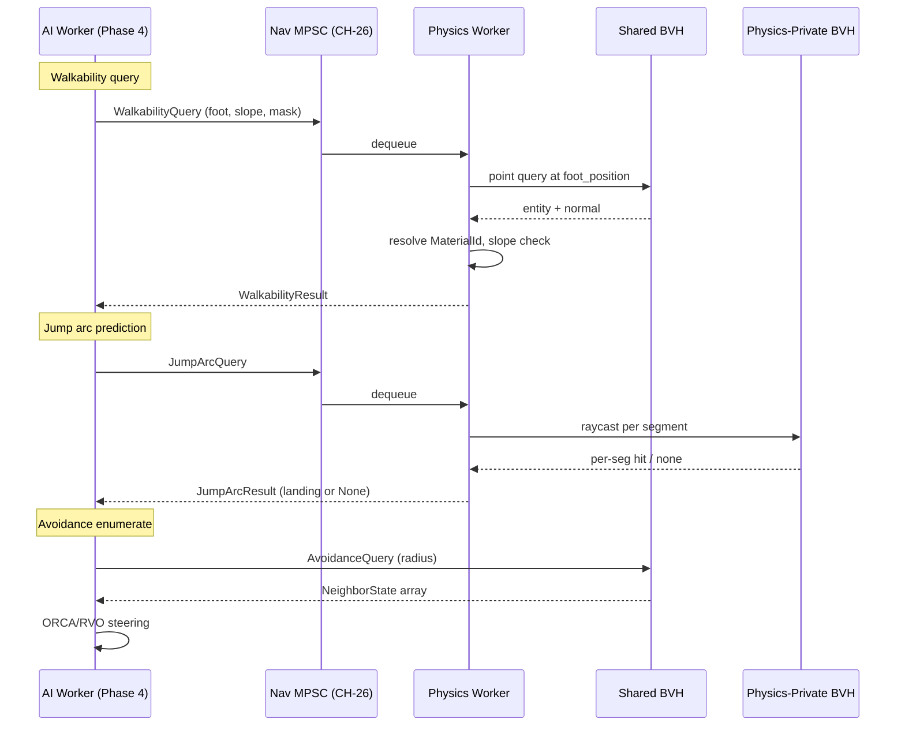

# AI ↔ Physics Integration Design

## Systems Involved

| System | Design | Domain |
|--------|--------|--------|
| AI | [behavior.md](../ai/behavior.md), [navigation.md](../ai/navigation.md) | AI |
| Physics | [foundation.md](../physics/foundation.md) | Physics |

See [shared-conventions.md](shared-conventions.md) for `Arc`, `HashMap`, MPSC, rkyv, and fallback
naming rules. See [shared-messaging-capacities.md](shared-messaging-capacities.md) for channel
capacity rationale. The shared spatial index used here is the CORE-RUNTIME shared BVH, **not** the
physics-private BVH.

## Integration Requirements

| ID | Requirement | Systems |
|----|-------------|---------|
| IR-2.5.1 | AI walkability query against shared BVH | AI, Phys |
| IR-2.5.2 | Jump arc prediction via parabolic raycast | AI, Phys |
| IR-2.5.3 | Climb detection via vertical sweep | AI, Phys |
| IR-2.5.4 | Physics-aware avoidance (dynamic body velocity) | AI, Phys |
| IR-2.5.5 | AI grounded state from contact list | AI, Phys |
| IR-2.5.6 | AI line-of-sight occlusion query | AI, Phys |

1. **IR-2.5.1** -- AI navigation issues `WalkabilityQuery` carrying a candidate foot position. The
   shared BVH reports nearest surface; physics reports whether the surface's material is walkable.
   The AI nav system uses the answer to generate / refine nav cells.
2. **IR-2.5.2** -- Before committing to a jump, an AI agent issues a parabolic raycast: a series of
   short segments following a gravity-respecting arc. The first blocked segment marks the jump
   landing candidate; if unblocked, the final segment descends to the target.
3. **IR-2.5.3** -- Climb detection runs a vertical sweep (capsule cast) at the wall surface. A ledge
   within `climb_height` above the agent head triggers a climb action.
4. **IR-2.5.4** -- Avoidance queries enumerate dynamic physics bodies (`RigidBody::Dynamic`) within
   a radius and supply their velocities to ORCA/RVO steering. See IR-2.5.4 detail below.
5. **IR-2.5.5** -- The physics contact list reports `ground_normal` and `ground_entity` for AI
   characters. `AiGroundedState` reads these once per AI tick.
6. **IR-2.5.6** -- Spatial awareness line-of-sight queries against the shared BVH feed the AI
   perception system (see `ai-spatial-awareness.md`). This doc covers the LOS query contract; the
   perception pipeline lives in the other doc.

## Data Contracts

| Type | Defined in | Consumed by | Purpose |
|------|-----------|-------------|---------|
| `WalkabilityQuery` | AI | Physics worker | Point query |
| `WalkabilityResult` | AI | AI nav | Walkable bool + normal |
| `JumpArcQuery` | AI | Physics worker | Parabola trace |
| `JumpArcResult` | AI | AI motion | Landing point or None |
| `ClimbSweepQuery` | AI | Physics worker | Capsule sweep |
| `ClimbSweepResult` | AI | AI motion | Ledge pos or None |
| `AvoidanceQuery` | AI | Spatial index | Dynamic body enum |
| `AvoidanceResult` | AI | AI steering | `SmallVec<[NeighborState; 16]>` |
| `NeighborState` | AI | AI steering | Pos, vel, radius |
| `AiGroundedState` | AI | AI nav | Bool + normal + entity |
| `AiNavQueryCh` | AI | Workers | MPSC `CH-26` |

## Class Diagram

## Data Flow

## Timing and Ordering

| System | Phase | Timestep | Order |
|--------|-------|----------|-------|
| Physics step | 5 Physics | Fixed | Produces contact list |
| AI perception | 4 AI | Fixed | Reads contact list (prev) |
| AI behavior tree | 4 AI | Fixed | Issues nav queries |
| AI motion | 4 AI | Fixed | Consumes query replies |
| Physics broadphase | 5 Physics | Fixed | Shared BVH updated |

AI queries run in Phase 4, the physics step runs in Phase 5. AI reads the previous frame's contact
list (one-frame latency is acceptable for AI walkability/grounded, which is not a visual feature).
Nav queries that need a reply within the same AI tick drain the reply slot before Phase 4 ends (a
dedicated geometry/physics worker pool services the channel).

## Thread Ownership

| Data / system | Owning thread | QoS / pin | Handoff |
|---------------|---------------|-----------|---------|
| Shared BVH | Core runtime | user-initiated | Read-shared, rebuilt at Phase 3 |
| Physics-private BVH | Physics worker | user-initiated | Physics owns, read-only to nav worker |
| `AiNavQueryCh` (CH-26) | Worker -> Worker | user-initiated | cap=256 DropOldest |
| Contact list | Physics worker | user-initiated | Published at Phase 5 end |
| `AiGroundedState` | AI worker | user-initiated | Written in Phase 4 from prev contacts |
| `FracturePresetTable` etc. | -- | -- | See `geometry-vfx.md` (cross-ref) |

1. **No HashMap on AI query hot paths** (SC-2). The neighbor enumeration uses a `SmallVec<[_; 16]>`
   bound and a sorted-by-entity-id layout.
2. **Blackboard store** used by AI behavior trees is `SortedVecMap` (SC-3).
3. **Deterministic seed** for ORCA tie-breaking is sourced from `GameTime.seed` (SC-8).

## Fallback Modes

| ID | Trigger | Policy | Recovery | Side effects |
|----|---------|--------|----------|-------------|
| FM-1 | Shared BVH not yet built | Return `WalkabilityResult::NoSurface` | Next frame | One-frame invalid nav |
| FM-2 | Physics-private BVH raycast fails | Treat arc segment as blocked | N/A | Agent avoids jump |
| FM-3 | `CH-26` full | DropOldest | Channel drains | AI retries next tick |
| FM-4 | No contact list this frame | Reuse previous `AiGroundedState` | Next physics step | Up to 1 frame stale |
| FM-5 | Climb sweep exceeds `max_height` | Return `None` | Agent finds other path | No climb action |
| FM-6 | Avoidance neighbor count > 16 | Keep 16 nearest by distance | Next tick | Tiny steering bias |

## Performance Budget

Cross-reference [/docs/design/performance-budget.md](../performance-budget.md).

| Pair subsystem | Phase | Budget (per frame) | Source |
|----------------|-------|---------------------|--------|
| AI walkability queries (100/frame) | 4 AI | 0.3 ms | AI nav slice |
| Jump arc prediction (5/frame) | 4 AI | 0.1 ms | AI motion slice |
| Climb sweeps (5/frame) | 4 AI | 0.05 ms | AI motion slice |
| Avoidance enumeration (100 agents) | 4 AI | 0.2 ms | AI steering slice |
| Physics servicing queries | 5 Physics | 0.1 ms | Physics query slice |

The AI phase total (2.0 ms) must include all of the above plus perception, BT/GOAP, and steering.

## Test Plan

See companion [ai-physics-test-cases.md](ai-physics-test-cases.md).

## Open Questions

| # | Question | Owner |
|---|----------|-------|
| 1 | Should walkability material table live in AI or Physics? | AI + Physics |
| 2 | Is jump arc segment_count const or adaptive? | AI |
| 3 | Should avoidance queries use shared BVH or physics-private? | Core runtime |
