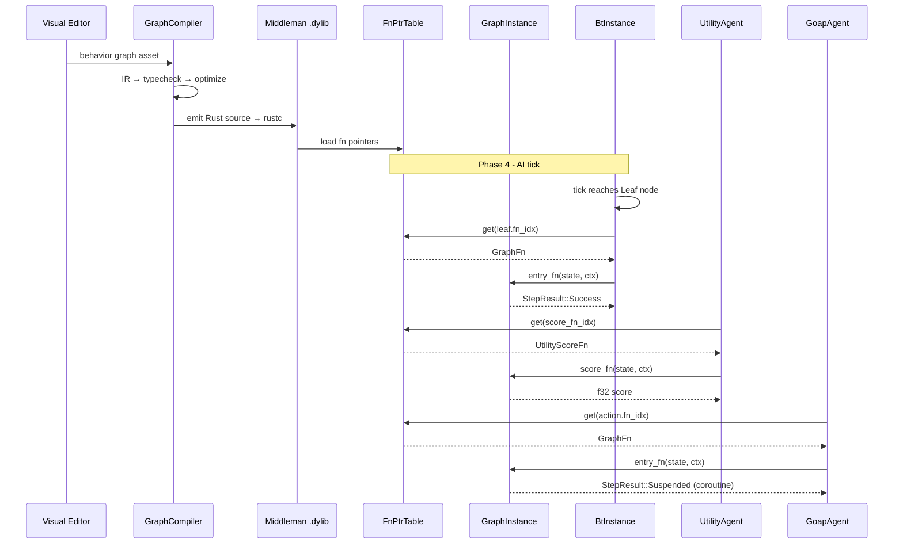

# AI Behavior ↔ Scripting Integration Design

## Systems Involved

| System | Design | Domain |
|--------|--------|--------|
| AI Behavior | [behavior.md](../ai/behavior.md) | AI |
| Scripting | [scripting.md](../game-framework/scripting.md) | Framework |

## Integration Requirements

| ID | Requirement | Systems |
|----|-------------|---------|
| IR-2.4.1 | Behavior graphs codegen to ECS systems | AI, Script |
| IR-2.4.2 | Utility curves authored as logic graphs | AI, Script |
| IR-2.4.3 | BT leaf actions are codegen'd functions | AI, Script |
| IR-2.4.4 | GOAP action execution via graph programs | AI, Script |
| IR-2.4.5 | Hot reload of behavior graphs | AI, Script |
| IR-2.4.6 | Coroutine support for multi-frame AI | AI, Script |

1. **IR-2.4.1** -- Behavior tree assets authored in the visual editor compile through the graph
   compiler to Rust source. The codegen emits a `GraphProgram` with entry points for `on_tick` that
   drives BT evaluation as an ECS system.
2. **IR-2.4.2** -- Utility AI `ResponseCurve` and custom `InputAxis::Custom` considerations are
   authored as logic graph nodes. The compiler emits `fn score(ctx) -> f32` functions in the
   middleman .dylib's `FnPtrTable`.
3. **IR-2.4.3** -- BT `Leaf` node actions reference `GraphProgram` entry points. When a leaf is
   reached during BT tick, the codegen'd function is invoked via the `FnPtrTable`.
4. **IR-2.4.4** -- GOAP action execution calls codegen'd `GraphFn` functions for each plan step. The
   graph programs read/write ECS components via typed queries.
5. **IR-2.4.5** -- When the middleman .dylib is hot-reloaded, `GraphInstance` components on AI
   entities detect version mismatch via `needs_reload()` and migrate variable state.
6. **IR-2.4.6** -- Multi-frame AI sequences (patrol routes, investigation behavior) use codegen'd
   `CoroutineState` synchronous state machines. Each yield point is an enum variant with no
   async/await.

## Data Contracts

| Type | Defined in | Consumed by | Purpose |
|------|-----------|-------------|---------|
| `GraphProgram` | Scripting | AI Behavior | Compiled graph |
| `GraphInstance` | Scripting | AI Behavior | Per-entity state |
| `FnPtrTable` | Scripting | AI Behavior | Function dispatch |
| `GraphFn` | Scripting | AI Behavior | Entry point sig |
| `CoroutineState` | Scripting | AI Behavior | Multi-frame state |
| `VariableStore` | Scripting | AI Behavior | Graph variables |
| `BtInstance` | AI Behavior | Scripting | BT runtime state |
| `UtilityAgent` | AI Behavior | Scripting | Utility runtime |

```rust
/// A BT leaf that invokes a codegen'd graph
/// function from the middleman .dylib. The
/// fn_idx indexes into the GraphProgram's
/// FnPtrTable.
pub struct BtGraphLeaf {
    /// Index into FnPtrTable for this leaf action.
    pub fn_idx: u32,
}

/// Codegen'd utility score function signature.
/// Generated from a visual logic graph. Pure
/// function with no side effects.
pub type UtilityScoreFn = fn(
    state: &GraphInstanceState,
    ctx: &ExecutionContext<'_>,
) -> f32;

/// GOAP action executor that invokes a codegen'd
/// graph program for each plan step.
pub struct GoapGraphAction {
    /// GraphProgram entry point for this action.
    pub entry_name: &'static str,
    /// Index into FnPtrTable.
    pub fn_idx: u32,
}
```

## Data Flow



## Timing and Ordering

| System | Game loop phase | Timestep | Ordering |
|--------|----------------|----------|----------|
| Graph reload | Phase 1-Input | Variable | Reload first |
| AI Behavior | Phase 4-AI | Variable | After reload |

Hot reload of the middleman .dylib occurs at phase boundaries (Phase 1). AI systems in Phase 4
always see the latest `GraphProgram` version. The `GraphExecutionSystem` handles version migration
before invoking any `GraphFn`.

## Failure Modes

| Failure | Impact | Recovery |
|---------|--------|----------|
| Compile error in graph | .dylib not updated | Keep previous version |
| fn_idx out of range | Invalid dispatch | Log error, skip leaf |
| Coroutine state mismatch | Migration fails | Reset to initial state |
| Hot reload mid-tick | Stale fn pointers | Deferred to next frame |

## Platform Considerations

None -- identical across all platforms. The graph compiler emits platform-independent Rust source.
The middleman .dylib is compiled by the bundled `rustc` for the host target.

## Test Plan

See companion [ai-scripting-test-cases.md](ai-scripting-test-cases.md).
