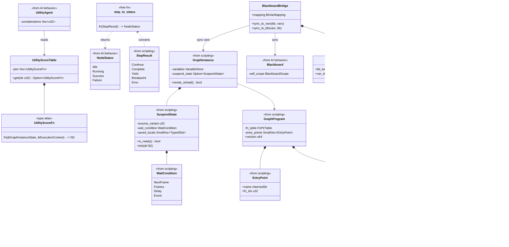
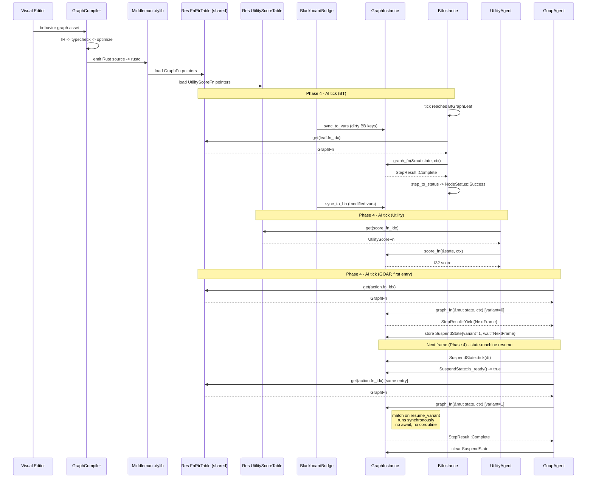

# AI Behavior ↔ Scripting Integration Design

## Systems Involved

| System | Design | Domain |
|--------|--------|--------|
| AI Behavior | [behavior.md](../ai/behavior.md) | AI |
| Scripting | [scripting.md](../game-framework/scripting.md) | Framework |

## Integration Requirements

| ID | Requirement | Systems |
|----|-------------|---------|
| IR-2.4.1 | Behavior graphs codegen to ECS systems | AI, Script |
| IR-2.4.2 | Utility curves authored as logic graphs | AI, Script |
| IR-2.4.3 | BT leaf actions are codegen'd functions | AI, Script |
| IR-2.4.4 | GOAP action execution via graph programs | AI, Script |
| IR-2.4.5 | Hot reload of behavior graphs | AI, Script |
| IR-2.4.6 | Multi-frame AI via explicit state machines | AI, Script |

1. **IR-2.4.1** -- Behavior tree assets authored in the visual editor compile through the graph
   compiler to Rust source. The codegen emits a `GraphProgram` with entry points for `on_tick` that
   drives BT evaluation as an ECS system. No bytecode VM; the middleman `.dylib` contains native
   machine code (see [feedback_logic_graph_native.md]).
2. **IR-2.4.2** -- Utility AI response curves and custom considerations are authored as logic graph
   nodes. The compiler emits `UtilityScoreFn` functions in the middleman `.dylib`'s
   `UtilityScoreTable` (separate from `FnPtrTable` because score functions are pure and take
   immutable state).
3. **IR-2.4.3** -- BT `Leaf` node actions reference `GraphProgram` entry points. When a leaf is
   reached during BT tick, the codegen'd function is invoked via `FnPtrTable` using the `fn_idx`
   stored on `BtGraphLeaf`.
4. **IR-2.4.4** -- GOAP action execution calls codegen'd `GraphFn` functions for each plan step. The
   graph programs read/write ECS components via typed queries. No string-keyed lookup; action
   dispatch goes through `fn_idx` only.
5. **IR-2.4.5** -- When the middleman `.dylib` is hot-reloaded, `GraphInstance` components on AI
   entities detect version mismatch via `needs_reload()` and migrate variable state. Reload is gated
   to phase boundaries (Phase 1-Input) and never occurs mid-tick.
6. **IR-2.4.6** -- Multi-frame AI sequences (patrol routes, investigation behavior) use codegen'd
   **explicit state machines**. There are NO coroutines and NO `async`/`await` anywhere in the
   engine. Each suspension point is an enum variant of a generated `ResumeVariant` type. The
   generated entry function is a `match` on the current variant that runs synchronously until the
   next suspension or completion.

## Out of Scope

2D/2.5D-specific AI authoring (tile-grid pathing, sprite state charts) is intentionally out of scope
for this integration; 2D/2.5D is deferred project-wide.

## Data Contracts

| Type | Defined in | Consumed by | Purpose |
|------|-----------|-------------|---------|
| `GraphProgram` | Scripting | AI Behavior | Compiled graph |
| `GraphInstance` | Scripting | AI Behavior | Per-entity state |
| `FnPtrTable` | Scripting | AI Behavior | Function dispatch |
| `GraphFn` | Scripting | AI Behavior | Entry point sig |
| `SuspendState` | Scripting | AI Behavior | State machine snapshot |
| `VariableStore` | Scripting | AI Behavior | Graph variables |
| `UtilityScoreFn` | Scripting | AI Behavior | Score codegen sig |
| `BlackboardBridge` | Integration | AI, Scripting | BB ↔ vars sync |
| `BtGraphLeaf` | Integration | AI Behavior | BT leaf adapter |
| `GoapGraphAction` | Integration | AI Behavior | GOAP plan step |

> **Terminology.** The scripting design's suspension snapshot (variant index + wait condition +
> saved locals) is referred to as `SuspendState` throughout this integration document. It is a plain
> data record used by a synchronous state machine, not a coroutine; the engine has no coroutines and
> no async runtime.

### Reverse data flow

The dependency is one-directional: scripting produces `GraphProgram` / `FnPtrTable` /
`UtilityScoreTable`, and AI behavior consumes them. `BtInstance`, `UtilityAgent`, and `GoapAgent`
are AI Behavior internals. Scripting does not read, borrow, or mutate these types; the graph
function signatures take only `&mut GraphInstanceState` and `&ExecutionContext`, which expose ECS
queries and the entity's `VariableStore` but never the BT / utility / GOAP runtime structs
themselves. If a graph needs to observe BT state, it reads the mirrored blackboard key via
`BlackboardBridge` during the pre-tick sync step.

### Signature distinction: GraphFn vs UtilityScoreFn

| Alias | Borrow | Stored in |
|-------|--------|-----------|
| `GraphFn` | mut state | `FnPtrTable` |
| `UtilityScoreFn` | immutable | `UtilityScoreTable` |

Signatures:

```rust
pub type GraphFn = fn(&mut GraphInstanceState, &ExecutionContext) -> StepResult;
pub type UtilityScoreFn = fn(&GraphInstanceState, &ExecutionContext) -> f32;
```

Semantics:

1. `GraphFn` is the general graph entry. It may mutate the variable store, produce side effects on
   ECS components, and return a `StepResult` describing completion, suspension, or error.
2. `UtilityScoreFn` is a **pure** scoring function: it borrows state immutably, has no side effects,
   and returns a plain `f32`. It is never dispatched through `FnPtrTable::get()`; it is stored in a
   distinct `UtilityScoreTable` with the same `fn_idx` space semantics.

### Blackboard ↔ VariableStore bridge

AI behavior uses `Blackboard` as the per-agent knowledge store. Codegen'd graph programs use
`VariableStore`. The bridge synchronizes them at deterministic points:

1. **Before graph tick** -- `BlackboardBridge::sync_to_vars` copies dirty `Blackboard` keys into the
   corresponding `VariableStore` slots using the static mapping table.
2. **After graph tick** -- `BlackboardBridge::sync_to_bb` copies modified `VariableStore` slots back
   to `Blackboard` keys.
3. **Mapping** -- the graph compiler emits a `BbVarMapping` per graph asset. It is static data
   loaded alongside the middleman `.dylib`.

#### Blackboard hot-path constraint

`Blackboard` is read on every AI tick and is therefore a **hot path**. Per project feedback, hot
paths MUST NOT use `HashMap`. The AI behavior design's current `BlackboardScope` uses
`HashMap<BlackboardKey, BlackboardValue>`, which violates this constraint and is tracked as a
follow-up in the behavior design. Until that migration lands, this integration defines the canonical
fast path as follows:

- `BlackboardBridge` resolves all lookups through the slot-indexed `VariableStore`, which is a dense
  `Vec` keyed by `u32`.
- The sync pass walks a fixed `SmallVec<[(BlackboardKey, u32); 8]>` mapping, never the `HashMap`, so
  graph-driven AI ticks bypass the map entirely.
- The eventual behavior-side fix is to replace `BlackboardScope::entries` with a fixed-slot array
  indexed by `BlackboardKey(u32)`. At that point the bridge implementation is unchanged.

### LeafNodeRegistry bypass (direct dispatch)

The behavior design's `LeafNodeRegistry` is a `HashMap<String, LeafNodeFn>` used for declarative
(non-codegen) leaves only. Codegen'd `BtGraphLeaf` nodes **do not** look up leaves by name and never
touch the registry. Instead, the graph compiler resolves each leaf reference to a `fn_idx: u32` at
compile time and stores it directly on `BtGraphLeaf`. Dispatch is a single `FnPtrTable::get(fn_idx)`
indirection with no map lookup, no string comparison, and no hash.

This matches the "avoid HashMap; codegen direct dispatch" constraint: the registry `HashMap` exists
only for legacy declarative assets and is not walked on the hot path.

### StepResult ↔ NodeStatus adapter

The behavior design's `LeafNodeFn` returns `NodeStatus`. Codegen'd graph functions return
`StepResult`. `BtGraphLeaf` adapts between them using the `step_to_status` pure function. See
[algorithms.md](../core-runtime/algorithms.md) for the canonical conversion table.

```rust
/// Convert a scripting StepResult into a BT NodeStatus.
/// Pure function; no side effects. Called once per leaf tick.
fn step_to_status(result: StepResult) -> NodeStatus;
```

Mapping:

| StepResult | NodeStatus | Notes |
|------------|-----------|-------|
| `Complete` | `Success` | Normal completion |
| `Continue` | `Running` | Non-suspending graph still ticking |
| `Yield(_)` | `Running` | State machine suspended on WaitCondition |
| `Error(_)` | `Failure` | Recoverable runtime error |
| `Breakpoint(_)` | `Running` | Debug builds only; runtime-toggleable |

When a `BtGraphLeaf` is reached during BT tick:

1. Look up `GraphFn` via `FnPtrTable::get(leaf.fn_idx)`.
2. Invoke `graph_fn(state, ctx)` → `StepResult`.
3. Convert via `step_to_status` → `NodeStatus`.
4. **Fallback (FM-2)**: if `FnPtrTable::get` returns `None` (fn_idx out of range, e.g. after a
   partial reload), log an error and return `NodeStatus::Failure`. The parent Selector advances to
   the next child, so a single stale index cannot halt the tree.

## API Design

All snippets below are **interface-level only**; bodies are documented elsewhere in the scripting
and behavior design documents. All enums are fully defined.

```rust
/// A BT leaf that invokes a codegen'd graph function from the middleman .dylib.
/// The fn_idx indexes into the GraphProgram's FnPtrTable and is resolved at
/// compile time by the graph compiler; there is no name-based lookup.
pub struct BtGraphLeaf {
    /// Index into FnPtrTable for this leaf action.
    pub fn_idx: u32,
}

/// Codegen'd utility score function signature. A SEPARATE codegen output from
/// GraphFn. Unlike GraphFn, this takes an immutable &GraphInstanceState because
/// score functions are pure (no side effects, no state mutation). Score
/// functions are NOT dispatched through FnPtrTable::get(); the codegen pipeline
/// emits them as standalone typed fn pointers stored in UtilityScoreTable.
pub type UtilityScoreFn = fn(
    state: &GraphInstanceState,
    ctx: &ExecutionContext<'_>,
) -> f32;

/// Separate table for utility score fn pointers. Loaded alongside FnPtrTable
/// from the middleman .dylib. Score functions are pure and take immutable
/// state, so they cannot be stored in FnPtrTable (which holds GraphFn with
/// &mut state).
pub struct UtilityScoreTable {
    ptrs: Vec<UtilityScoreFn>,
}

impl UtilityScoreTable {
    /// Look up a score fn by index. Returns None if idx is out of range.
    pub fn get(&self, idx: u32) -> Option<UtilityScoreFn>;
}

/// GOAP action executor that invokes a codegen'd graph program for each plan
/// step. Uses fn_idx only; the name-to-index mapping lives in
/// GraphProgram::entry_points (EntryPoint struct). No redundant entry_name
/// field — lookups go through EntryPoint.fn_idx.
pub struct GoapGraphAction {
    /// Index into FnPtrTable. Resolved at compile time from the
    /// GraphProgram::entry_points table.
    pub fn_idx: u32,
}

/// Maps Blackboard keys to VariableStore slots. Emitted by the graph compiler
/// per graph asset. Walked by BlackboardBridge for pre/post-tick sync. Stored
/// as parallel SmallVecs to stay alloc-free for small mappings.
pub struct BbVarMapping {
    /// Parallel arrays: bb_keys[i] maps to var_slots[i].
    pub bb_keys: SmallVec<[BlackboardKey; 8]>,
    pub var_slots: SmallVec<[u32; 8]>,
}

/// Synchronizes Blackboard ↔ VariableStore before and after graph execution.
/// Never touches BlackboardScope::entries (HashMap); walks the mapping
/// SmallVec directly.
pub struct BlackboardBridge {
    pub mapping: BbVarMapping,
}

impl BlackboardBridge {
    /// Copy dirty Blackboard keys into VariableStore slots before graph tick.
    pub fn sync_to_vars(&self, bb: &Blackboard, vars: &mut VariableStore);

    /// Copy modified VariableStore slots back to Blackboard after graph tick.
    pub fn sync_to_bb(&self, vars: &VariableStore, bb: &mut Blackboard);
}

/// Adapter converting scripting StepResult to BT NodeStatus. See the mapping
/// table in the design text.
pub fn step_to_status(result: StepResult) -> NodeStatus;
```

### FnPtrTable ownership

| Resource | Ownership |
|----------|-----------|
| `Res<FnPtrTable>` | Single ECS resource, shared read-only |
| `Res<UtilityScoreTable>` | Single ECS resource, shared read-only |
| `Arc<FnPtrTable>` | Allowed; immutable after load |

1. **`Res<FnPtrTable>`** -- all three AI systems dispatch through the same pointer table. No
   per-system copy.
2. **`Res<UtilityScoreTable>`** -- pure score functions; a parallel resource to `FnPtrTable` because
   the two aliases have different borrow requirements.
3. **`Arc<FnPtrTable>`** -- allowed because the table is immutable once loaded from the `.dylib`;
   this satisfies the "Arc only for immutable shared data" constraint.

`Arc` is permitted here because the contents are immutable for the lifetime of a loaded `.dylib`
version. Hot reload constructs a new `FnPtrTable` and swaps the `Res` at a phase boundary; it never
mutates the existing one. This matches the "Arc only for immutable shared data" constraint. The
three AI systems (`bt_tick_system`, `utility_tick_system`, `goap_tick_system`) each obtain the
resource via `Res<FnPtrTable>` and dispatch independently; there is no per-system table.

### Class Diagram



## Data Flow

All three AI systems (`bt_tick_system`, `utility_tick_system`, `goap_tick_system`) share a single
`Res<FnPtrTable>` ECS resource loaded from the middleman `.dylib`. The `UtilityScoreTable` is a
separate `Res<UtilityScoreTable>` resource for pure score functions. Both are constructed once per
reload and treated as immutable for the lifetime of that version.



The next-frame resume path is a plain synchronous re-entry: `GoapAgent` re-invokes the same
`GraphFn` with the `GraphInstance` whose `SuspendState::resume_variant` has been advanced. The
codegen'd function body dispatches on `resume_variant` via a `match` statement. There is no
coroutine machinery, no stackful fiber, no trampolining, and no `await`.

## Timing and Ordering

| System | Game loop phase | Timestep | Ordering |
|--------|----------------|----------|----------|
| Graph reload | Phase 1-Input | Variable | Reload first |
| AI Behavior | Phase 4-AI | Variable | After reload |

1. **Hot reload** of the middleman `.dylib` occurs only at phase boundaries (specifically the Phase
   1-Input boundary). The scripting runtime's drain-then-swap protocol constructs a new `FnPtrTable`
   / `UtilityScoreTable` and swaps the `Res` atomically. No AI system is inside a tick when this
   happens.
2. **AI systems** run in Phase 4 and always see the latest `GraphProgram::version`. The
   `GraphExecutionSystem` handles `needs_reload()` variable migration before invoking any `GraphFn`
   on a stale instance.
3. **Render thread pinning.** AI ticks run on the shared worker pool under QoS "user-initiated"; the
   render thread is core-pinned and does not touch AI state. AI work is dispatched via the job
   system's `par_iter` over `GraphInstance` batches.

### Channel buffering (if used)

Where the integration publishes events between AI and scripting (e.g. graph → BT "sub-tree finished"
notifications for deferred logging), we use **MPSC** channels (preferred over SPSC per project
feedback). Buffer lengths:

| Channel | Producers | Consumer | Capacity | Rationale |
|---------|-----------|----------|---------:|-----------|
| `graph_log_tx` | N graphs | 1 logger | 1024 | Debug-only; drops on overflow |
| `graph_event_tx` | N graphs | 1 AI events | 256 | One frame of AI events |

Both channels are flushed at the end of Phase 4. Buffer sizes are documented here per project
convention.

## Debug Tools

| Tool | Toggle | Notes |
|------|--------|-------|
| BT step-through | Runtime flag `debug.bt_step` | No cfg-gating |
| Graph breakpoints | Runtime flag `debug.graph_bp` | `StepResult::Breakpoint` path |
| Blackboard dump | Runtime flag `debug.bb_dump` | Per-tick snapshot |

All debug tooling is runtime-toggleable via hot-reloadable flags. **None** is compile-time gated
behind `cfg(debug_assertions)` or Cargo features. When disabled, the compiled graph's breakpoint
check is a single predicated branch that the optimizer is expected to eliminate from the hot loop.

## Persistence

`GraphInstance::variables` (the `VariableStore`) and `GraphInstance::suspend_state` are persistent
across save/load. The scripting design derives `rkyv::Archive`, `Serialize`, and `Deserialize` on
these types for zero-copy save. The integration side adds no new persistent types beyond
`BbVarMapping`, which is codegen'd static data shipped inside the middleman `.dylib` and therefore
does not need runtime persistence.

## Failure Modes

| ID | Failure | Impact | Recovery |
|----|---------|--------|----------|
| FM-1 | Compile error in graph | `.dylib` not updated | See below |
| FM-2 | `fn_idx` out of range | Invalid dispatch | See below |
| FM-3 | `resume_variant` mismatch after reload | Migration fails | See below |
| FM-4 | BB key missing in mapping | Sync skips key | See below |
| FM-5 | `UtilityScoreTable` idx OOB | No score | See below |
| FM-6 | `GraphInstance::needs_reload` = true | Stale variables | See below |

1. **FM-1** -- Graph compilation fails (type error, invalid node connections). The previous `.dylib`
   remains loaded, `GraphProgram::version` does not increment, and all AI systems continue using the
   last valid version. The editor displays the compile error. A negative test case covers this path
   (see companion test file).
2. **FM-2** -- `FnPtrTable::get(fn_idx)` returns `None`. The `BtGraphLeaf` adapter logs an error
   with entity ID and `fn_idx`, then returns `NodeStatus::Failure`. The parent Selector advances to
   the next child.
3. **FM-3** -- After hot reload, `SuspendState::resume_variant` names a variant that no longer
   exists in the new `GraphProgram`. The migration system resets the state machine to its initial
   variant (0), clears `saved_locals`, and logs a warning. The AI agent restarts its multi-frame
   sequence. No coroutine is involved; this is a plain enum-variant reset.
4. **FM-4** -- `BlackboardBridge::sync_to_vars` encounters a `BlackboardKey` not present in
   `BbVarMapping`. The key is skipped silently (no crash). A debug warning is logged behind the
   runtime-toggleable `debug.bb_dump` flag.
5. **FM-5** -- `UtilityScoreTable::get(idx)` returns `None`. The utility system assigns a score of
   `0.0` for that consideration and logs an error. The consideration is effectively ignored until
   the next valid reload.
6. **FM-6** -- `needs_reload()` returns true on an instance that has not yet been migrated. The
   `GraphExecutionSystem` runs variable migration (walks `VariableLayout` and copies matching slots)
   before invoking the graph. If migration fails, the instance is reset to its default state.

> **No "hot reload mid-tick" failure.** Reload is gated to Phase 1-Input; AI runs in Phase 4.
> Dispatch through `FnPtrTable` and `UtilityScoreTable` cannot observe a swap mid-tick because the
> `Res` swap happens outside Phase 4. This failure mode is therefore structurally prevented and not
> listed above. (Previous drafts listed a "stale fn pointer" mode; it has been removed.)

## Platform Considerations

The graph compiler emits platform-independent Rust source. The middleman dynamic library is built by
the bundled `rustc` for the host target. Platform-specific surface area is limited to dynamic
library loading and unloading:

| Platform | Extension | Load | Resolve | Unload |
|----------|-----------|------|---------|--------|
| macOS | `.dylib` | `dlopen` (RTLD_NOW) | `dlsym` | `dlclose` |
| Linux | `.so` | `dlopen` or `dlmopen` | `dlsym` | `dlclose` |
| Windows | `.dll` | `LoadLibraryW` | `GetProcAddress` | `FreeLibrary` |

1. **macOS / Linux** -- `dlopen` with `RTLD_NOW | RTLD_LOCAL` so unresolved symbols fail
   immediately. Linux may use `dlmopen` with a fresh namespace to allow multiple concurrent versions
   during hot reload.
2. **Windows** -- `LoadLibraryW` to load the new `.dll`, `GetProcAddress` to resolve each fn symbol
   listed in the export table, `FreeLibrary` on the previous version once no `GraphInstance`
   references it.
3. **Swap protocol** -- the scripting runtime's `DylibLoader` abstracts these details. AI behavior
   systems never call `dlopen` / `LoadLibrary` directly; they only read `Res<FnPtrTable>` and
   `Res<UtilityScoreTable>`.
4. **Hot reload** -- each platform's loader returns a new handle; the runtime drains in-flight work
   on the old handle, swaps the `Res`, and calls the unload API once ref counts on the old tables
   drop to zero.

## Test Plan

See companion [ai-scripting-test-cases.md](ai-scripting-test-cases.md). The companion file covers
all integration tests, negative / compile-failure tests, and benchmarks, and tags each entry with
its integration requirement ID. All tests are runnable in CI.

## Open Questions

1. Should `BbVarMapping` also record the per-slot value type for runtime type checking during
   reload, or is compile-time typecheck sufficient?
2. For very long suspended sequences (minutes), should `SuspendState::saved_locals` spill to the
   heap when the `SmallVec` inline capacity is exceeded, or should the compiler reject such graphs?

## Review Status

All prior review feedback (12 findings) has been addressed in the body of this document. A summary
of the resolution is tracked below for traceability.

| # | Finding |
|---|---------|
| 1 | `UtilityScoreFn` vs `GraphFn` signature distinction |
| 2 | Redundant `entry_name` in `GoapGraphAction` |
| 3 | Blackboard bridge relationship to `VariableStore` |
| 4 | `BtGraphLeaf` ↔ `LeafNodeFn` adapter (`StepResult` vs `NodeStatus`) |
| 5 | Replace `HashMap<String, LeafNodeFn>` with direct dispatch |
| 6 | Reverse data flow (scripting ← BT/Utility/GOAP internals) |
| 7 | Missing `classDiagram` |
| 8 | Platform considerations: `dlopen` / `LoadLibrary` / `dlmopen` |
| 9 | Next-frame resume path in sequence diagram |
| 10 | `FnPtrTable` ownership (shared vs per-system) |
| 11 | Remove / rewrite "hot reload mid-tick" failure |
| 12 | Negative tests for compile failures (IR-2.4.1) |

Resolutions:

1. Signature distinction table plus semantic prose (see "Signature distinction" above).
2. Removed; dispatch uses `EntryPoint.fn_idx` only.
3. Dedicated bridge section plus `BbVarMapping` / `BlackboardBridge` types.
4. `step_to_status` adapter with full mapping table.
5. Registry bypass via codegen'd `fn_idx` stored on `BtGraphLeaf`.
6. New "Reverse data flow" subsection explains the one-directional consumption.
7. Full `classDiagram` added covering every type referenced by this integration.
8. Full platform table with load / resolve / unload APIs for macOS, Linux, Windows.
9. Sequence diagram extended with the state-machine resume path on the next frame.
10. Ownership table plus `Arc` rationale anchored on immutability.
11. Removed; reload is gated to Phase 1 and cannot be observed mid-tick.
12. Added to companion test file under "Negative / Error Tests".

**Coroutine removal.** All prior references to "coroutines" have been rewritten as explicit
synchronous state machines. `CoroutineState` is referred to as `SuspendState` in this integration
document to emphasize that it is a plain enum-variant snapshot, not a coroutine. The engine has no
coroutines and no `async`/`await` — the only async surface in the project is inside backend services
that do not run with the engine.
