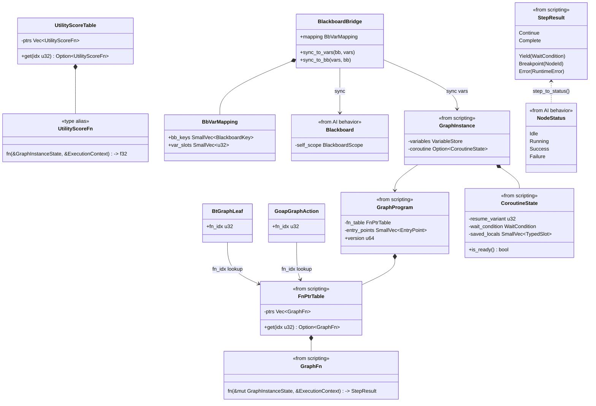
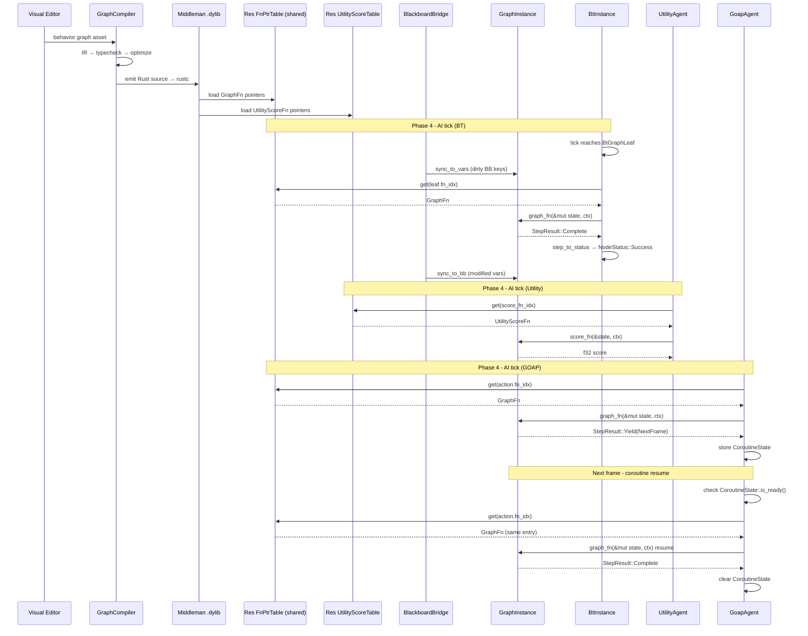

# AI Behavior ↔ Scripting Integration Design

## Systems Involved

| System | Design | Domain |
|--------|--------|--------|
| AI Behavior | [behavior.md](../ai/behavior.md) | AI |
| Scripting | [scripting.md](../game-framework/scripting.md) | Framework |

## Integration Requirements

| ID | Requirement | Systems |
|----|-------------|---------|
| IR-2.4.1 | Behavior graphs codegen to ECS systems | AI, Script |
| IR-2.4.2 | Utility curves authored as logic graphs | AI, Script |
| IR-2.4.3 | BT leaf actions are codegen'd functions | AI, Script |
| IR-2.4.4 | GOAP action execution via graph programs | AI, Script |
| IR-2.4.5 | Hot reload of behavior graphs | AI, Script |
| IR-2.4.6 | Coroutine support for multi-frame AI | AI, Script |

1. **IR-2.4.1** -- Behavior tree assets authored in the visual editor compile through the graph
   compiler to Rust source. The codegen emits a `GraphProgram` with entry points for `on_tick` that
   drives BT evaluation as an ECS system.
2. **IR-2.4.2** -- Utility AI `ResponseCurve` and custom `InputAxis::Custom` considerations are
   authored as logic graph nodes. The compiler emits `UtilityScoreFn` functions in the middleman
   .dylib's `UtilityScoreTable` (separate from `FnPtrTable` because score functions are pure and
   take immutable state).
3. **IR-2.4.3** -- BT `Leaf` node actions reference `GraphProgram` entry points. When a leaf is
   reached during BT tick, the codegen'd function is invoked via the `FnPtrTable`.
4. **IR-2.4.4** -- GOAP action execution calls codegen'd `GraphFn` functions for each plan step. The
   graph programs read/write ECS components via typed queries.
5. **IR-2.4.5** -- When the middleman .dylib is hot-reloaded, `GraphInstance` components on AI
   entities detect version mismatch via `needs_reload()` and migrate variable state.
6. **IR-2.4.6** -- Multi-frame AI sequences (patrol routes, investigation behavior) use codegen'd
   `CoroutineState` synchronous state machines. Each yield point is an enum variant with no
   async/await.

## Data Contracts

| Type | Defined in | Consumed by | Purpose |
|------|-----------|-------------|---------|
| `GraphProgram` | Scripting | AI Behavior | Compiled graph |
| `GraphInstance` | Scripting | AI Behavior | Per-entity state |
| `FnPtrTable` | Scripting | AI Behavior | Function dispatch |
| `GraphFn` | Scripting | AI Behavior | Entry point sig |
| `CoroutineState` | Scripting | AI Behavior | Multi-frame state |
| `VariableStore` | Scripting | AI Behavior | Graph variables |
| `UtilityScoreFn` | Scripting | AI Behavior | Score codegen sig |
| `BlackboardBridge` | Integration | AI, Scripting | BB ↔ vars sync |

`BtInstance` and `UtilityAgent` are AI Behavior internals. Scripting does not consume them; the
dependency is one-directional: scripting produces `GraphProgram` / `FnPtrTable`, AI behavior
consumes them.

### Blackboard ↔ VariableStore Bridge

The AI behavior design uses `Blackboard` as the per-agent knowledge store. Codegen'd graph programs
use `VariableStore`. The integration bridge synchronizes them:

1. **Before graph tick** -- `BlackboardBridge::sync_to_vars` copies dirty `Blackboard` keys into the
   corresponding `VariableStore` slots using the mapping table.
2. **After graph tick** -- `BlackboardBridge::sync_to_bb` copies modified `VariableStore` slots back
   to `Blackboard` keys.
3. **Mapping** -- the graph compiler emits a `BbVarMapping` that maps each `BlackboardKey` to a
   `VariableStore` slot index. This is static per graph asset.

> **HashMap violation.** `Blackboard` is a hot path (read every AI tick). The current
> `BlackboardScope` uses `HashMap<BlackboardKey, BlackboardValue>`, which violates the "no HashMap
> on deterministic hot paths" constraint. The behavior design must migrate to a fixed-slot array
> indexed by `BlackboardKey(u32)`. Until then, `BlackboardBridge` uses the slot-indexed
> `VariableStore` as the canonical fast path during graph execution, avoiding the `HashMap`
> entirely.

### LeafNodeRegistry Bypass

The behavior design's `LeafNodeRegistry` uses `HashMap<String, LeafNodeFn>` for leaf lookup.
Codegen'd `BtGraphLeaf` nodes bypass the registry entirely via direct `fn_idx` into `FnPtrTable`.
The `HashMap` is a registration-time-only structure used for non-codegen'd (declarative asset) leaf
nodes.

### StepResult ↔ NodeStatus Adapter

The behavior design's `LeafNodeFn` returns `NodeStatus`. Codegen'd graph functions return
`StepResult`. The `BtGraphLeaf` tick adapter converts between them:

```rust
/// Convert scripting StepResult to BT NodeStatus.
fn step_to_status(result: StepResult) -> NodeStatus {
    match result {
        StepResult::Complete => NodeStatus::Success,
        StepResult::Continue => NodeStatus::Running,
        StepResult::Yield(_) => NodeStatus::Running,
        StepResult::Error(_) => NodeStatus::Failure,
        StepResult::Breakpoint(_) => {
            NodeStatus::Running
        }
    }
}
```

When a `BtGraphLeaf` is reached during BT tick:

1. Look up `GraphFn` via `FnPtrTable::get(leaf.fn_idx)`.
2. Invoke `graph_fn(state, ctx)` → `StepResult`.
3. Convert via `step_to_status` → `NodeStatus`.
4. **Fallback**: if `FnPtrTable::get` returns `None` (fn_idx out of range), log an error and return
   `NodeStatus::Failure`.

```rust
/// A BT leaf that invokes a codegen'd graph
/// function from the middleman .dylib. The
/// fn_idx indexes into the GraphProgram's
/// FnPtrTable.
pub struct BtGraphLeaf {
    /// Index into FnPtrTable for this leaf action.
    pub fn_idx: u32,
}

/// Codegen'd utility score function signature.
/// A SEPARATE codegen output from `GraphFn`.
/// Unlike `GraphFn`, this takes an immutable
/// `&GraphInstanceState` because score functions
/// are pure (no side effects, no state mutation).
/// Score functions are NOT dispatched through
/// `FnPtrTable::get()`; the codegen pipeline
/// emits them as standalone typed fn pointers
/// stored in `UtilityScoreTable`.
pub type UtilityScoreFn = fn(
    state: &GraphInstanceState,
    ctx: &ExecutionContext<'_>,
) -> f32;

/// Separate table for utility score fn pointers.
/// Loaded alongside FnPtrTable from the middleman
/// .dylib. Score functions are pure and take
/// immutable state, so they cannot be stored in
/// FnPtrTable (which holds GraphFn with &mut).
pub struct UtilityScoreTable {
    ptrs: Vec<UtilityScoreFn>,
}

impl UtilityScoreTable {
    /// Look up a score fn by index. Returns None
    /// if idx is out of range.
    pub fn get(
        &self,
        idx: u32,
    ) -> Option<UtilityScoreFn>;
}

/// GOAP action executor that invokes a codegen'd
/// graph program for each plan step. Uses fn_idx
/// only; the name-to-index mapping is in
/// GraphProgram::entry_points (EntryPoint struct).
pub struct GoapGraphAction {
    /// Index into FnPtrTable.
    pub fn_idx: u32,
}

/// Maps Blackboard keys to VariableStore slots.
/// Emitted by the graph compiler per graph asset.
/// Used by BlackboardBridge for sync.
pub struct BbVarMapping {
    /// Parallel arrays: bb_keys[i] maps to
    /// var_slots[i].
    pub bb_keys: SmallVec<[BlackboardKey; 8]>,
    pub var_slots: SmallVec<[u32; 8]>,
}

/// Synchronizes Blackboard ↔ VariableStore
/// before and after graph execution.
pub struct BlackboardBridge {
    pub mapping: BbVarMapping,
}

impl BlackboardBridge {
    /// Copy dirty Blackboard keys into
    /// VariableStore slots before graph tick.
    pub fn sync_to_vars(
        &self,
        bb: &Blackboard,
        vars: &mut VariableStore,
    );

    /// Copy modified VariableStore slots back to
    /// Blackboard after graph tick.
    pub fn sync_to_bb(
        &self,
        vars: &VariableStore,
        bb: &mut Blackboard,
    );
}
```

### Class Diagram



## Data Flow

All three AI systems (`bt_tick_system`, `utility_tick_system`, `goap_tick_system`) share a single
`Res<FnPtrTable>` ECS resource loaded from the middleman .dylib. The `UtilityScoreTable` is a
separate `Res<UtilityScoreTable>` resource for pure score functions.



## Timing and Ordering

| System | Game loop phase | Timestep | Ordering |
|--------|----------------|----------|----------|
| Graph reload | Phase 1-Input | Variable | Reload first |
| AI Behavior | Phase 4-AI | Variable | After reload |

Hot reload of the middleman .dylib occurs at phase boundaries (Phase 1). AI systems in Phase 4
always see the latest `GraphProgram` version. The `GraphExecutionSystem` handles version migration
before invoking any `GraphFn`.

## Failure Modes

| ID | Failure | Impact | Recovery |
|----|---------|--------|----------|
| FM-1 | Compile error in graph | .dylib not updated | See below |
| FM-2 | fn_idx out of range | Invalid dispatch | See below |
| FM-3 | Coroutine state mismatch | Migration fails | See below |
| FM-4 | BB key missing in mapping | Sync skips key | See below |
| FM-5 | UtilityScoreTable idx OOB | No score | See below |

1. **FM-1** -- Graph compilation fails (type error, invalid node connections). The previous .dylib
   remains loaded. `GraphProgram::version` does not increment. All AI systems continue using the
   last valid version. The editor displays the compile error.
2. **FM-2** -- `FnPtrTable::get(fn_idx)` returns `None`. The `BtGraphLeaf` adapter logs an error
   with the entity ID and fn_idx, then returns `NodeStatus::Failure`. The BT continues evaluation
   (parent Selector tries next child).
3. **FM-3** -- After hot reload, `CoroutineState` has a `resume_variant` that does not exist in the
   new `GraphProgram`. The migration system resets the coroutine to its initial state (variant 0).
   The AI agent restarts its multi-frame sequence.
4. **FM-4** -- `BlackboardBridge::sync_to_vars` encounters a `BlackboardKey` not present in
   `BbVarMapping`. The key is skipped (no crash). A debug warning is logged.
5. **FM-5** -- `UtilityScoreTable::get(idx)` returns `None`. The utility system assigns a score of
   `0.0` for that consideration and logs an error.

> **No "hot reload mid-tick" failure.** The scripting design's drain-then-swap protocol ensures
> .dylib reload occurs only at phase boundaries (Phase 1). AI systems run in Phase 4, so fn pointers
> cannot become stale mid-tick. This failure mode is structurally prevented.

## Platform Considerations

The graph compiler emits platform-independent Rust source. The middleman dynamic library is compiled
by the bundled `rustc` for the host target. The platform-specific aspects are limited to dynamic
library loading:

| Platform | Extension | Load API |
|----------|-----------|----------|
| macOS | `.dylib` | `dlopen` / `dlsym` |
| Linux | `.so` | `dlopen` / `dlsym` |
| Windows | `.dll` | `LoadLibrary` / `GetProcAddress` |

The scripting runtime's `DylibLoader` abstraction handles these differences. AI behavior systems are
unaware of the platform -- they interact only with `FnPtrTable` and `UtilityScoreTable` after
loading completes.

## Test Plan

See companion [ai-scripting-test-cases.md](ai-scripting-test-cases.md).

## Review Feedback

1. `[CONFIDENT]` The `UtilityScoreFn` signature uses `&GraphInstanceState` (immutable borrow) but
   the canonical `GraphFn` in scripting.md uses `&mut GraphInstanceState`. Score functions are pure
   so immutable is correct, but this is a distinct type alias, not a `GraphFn` -- the document
   should clarify that `UtilityScoreFn` is a separate codegen output, not dispatched through
   `FnPtrTable.get()`.

2. `[CONFIDENT]` The `GoapGraphAction` struct has a field `entry_name: &'static str` that is
   redundant with `fn_idx`. The canonical `EntryPoint` in scripting.md already maps name to index.
   Storing both in `GoapGraphAction` duplicates the lookup path and adds a `&'static str` that must
   be kept in sync. Remove `entry_name` or document why both are needed.

3. `[CONFIDENT]` The AI behavior design (`behavior.md`) uses `Blackboard` as the per-agent knowledge
   store, but this integration doc never mentions `Blackboard`. It relies entirely on
   `VariableStore` from scripting. The document must specify how `Blackboard` reads/writes are
   bridged to `VariableStore` graph variables, or whether codegen'd graph programs replace
   `Blackboard` entirely for graph-driven AI.

4. `[CONFIDENT]` The AI behavior design defines `LeafNodeFn` with signature
   `fn(&mut Blackboard, &World, Entity) -> NodeStatus`, but this integration doc defines
   `BtGraphLeaf` dispatching through `FnPtrTable` which returns `StepResult` via `GraphFn`. The two
   signatures are incompatible. The document must specify an adapter or show how `StepResult` maps
   to `NodeStatus` (Success/Failure/Running).

5. `[CONFIDENT]` The behavior design's `LeafNodeRegistry` uses `HashMap<String, LeafNodeFn>`, which
   violates the "no HashMap on hot paths" constraint. While this is a behavior design issue, the
   integration doc should note this and specify that codegen'd `BtGraphLeaf` nodes bypass the
   registry entirely via `fn_idx`, making the `HashMap` a registration-time-only structure.

6. `[UNCERTAIN]` The sequence diagram shows `BT` and `UA` and `GP` all calling `FP` (FnPtrTable)
   directly, but the behavior design runs these as separate ECS systems (`bt_tick_system`,
   `utility_tick_system`, `goap_tick_system`). It is unclear whether all three systems share the
   same `FnPtrTable` resource or each has its own. The data flow should clarify resource ownership.

7. `[CONFIDENT]` The data contracts table lists `BtInstance` and `UtilityAgent` as "Defined in: AI
   Behavior, Consumed by: Scripting" but the integration doc never explains what scripting does with
   these types. The scripting system produces `GraphProgram`/`FnPtrTable` and the AI system consumes
   them -- the reverse direction is not demonstrated in the data flow or pseudocode.

8. `[UNCERTAIN]` The failure mode "Hot reload mid-tick / Stale fn pointers / Deferred to next frame"
   is vague. If a hot reload occurs while Phase 4 AI systems are executing, the fn pointers could
   become dangling. The scripting design's drain-then-swap protocol ensures this cannot happen
   because reload occurs at phase boundaries (Phase 1). The failure mode table should either remove
   this entry or describe a specific scenario where deferral is needed despite the phase-boundary
   reload.

9. `[CONFIDENT]` No `classDiagram` is present in the document. The design CLAUDE.md requires "every
   design MUST have a Mermaid classDiagram covering ALL types." The three new types (`BtGraphLeaf`,
   `UtilityScoreFn`, `GoapGraphAction`) and their relationships to scripting types should be shown
   in a class diagram.

10. `[CONFIDENT]` The Platform Considerations section says "None -- identical across all platforms"
    but hot reload of `.dylib` files is platform-specific: `.dylib` on macOS, `.so` on Linux, `.dll`
    on Windows. While the graph compiler handles this, the integration doc should acknowledge the
    platform-specific dynamic library extension and loading mechanism (dlopen vs LoadLibrary).

11. `[UNCERTAIN]` There are no negative/error test cases for compile-time failures (IR-2.4.1 graph
    with type errors, IR-2.4.2 curve with invalid domain). The failure modes table lists "Compile
    error in graph" but no test case covers this path. Consider adding a test case for graph
    compilation failure and verifying that the previous `.dylib` version is preserved.

12. `[CONFIDENT]` The coroutine data flow is incomplete. The sequence diagram shows
    `GP -> GI: entry_fn(state, ctx)` returning `StepResult::Suspended (coroutine)` but does not show
    the resume path on the next frame. The next-frame resume is the core of IR-2.4.6 and should be
    illustrated in the sequence diagram.
