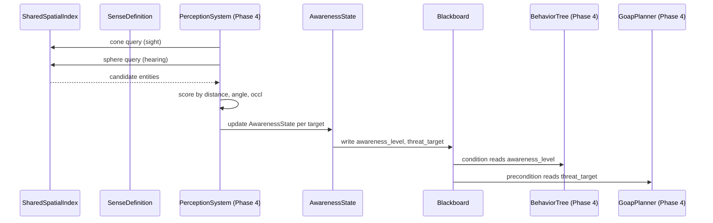

# AI ↔ Spatial Awareness Integration Design

## Systems Involved

| System | Design | Domain |
|--------|--------|--------|
| AI Behavior | [behavior.md](../ai/behavior.md) | AI |
| Spatial Awareness | [spatial-awareness.md](../simulation/spatial-awareness.md) | Simulation |

## Integration Requirements

| ID | Requirement | Systems |
|----|-------------|---------|
| IR-1.10.1 | Sight sense feeds AI perception | SA, AI |
| IR-1.10.2 | Hearing sense feeds AI perception | SA, AI |
| IR-1.10.3 | Awareness state drives AI blackboard | SA, AI |
| IR-1.10.4 | Threat assessment from scored targets | SA, AI |
| IR-1.10.5 | AI budget governs perception queries | SA, AI |

1. **IR-1.10.1** -- `SenseDefinition` with `SenseShape::Cone` queries the shared BVH for entities
   within the sight cone. Line-of-sight raycasts filter occluded targets. Results are written to
   `AiPerception.known_entities` as `PerceivedEntity` entries with `sense: Sight`.
2. **IR-1.10.2** -- `SenseDefinition` with `SenseShape::Sphere` queries the BVH for entities within
   hearing range. The audio propagation system's `PropagationResult` provides occlusion-adjusted
   intensity at the AI's position. Only sounds above the hearing threshold register. The perception
   system reads `PropagationResultStore` (an ECS resource snapshot), not the audio thread's
   double-buffer directly. The audio propagation system (Phase 3) writes results to the ECS resource
   via atomic swap before Phase 4 begins. If no `PropagationResult` exists for a source (audio not
   yet propagated), the fallback is to skip the hearing check for that source -- the agent does not
   hear it until the next frame when propagation data is available.
3. **IR-1.10.3** -- `AwarenessState` transitions (Unaware -> Suspicious -> Alert -> Tracking ->
   Lost) are written to `Blackboard` keys. BT condition nodes and GOAP preconditions read these keys
   to gate behavior changes (e.g., enter combat when awareness reaches Alert). Blackboard is a
   hot-path structure (written every frame per agent). Its backing store (`BlackboardScope.entries`)
   must use a sorted `Vec` or `BTreeMap`, never `HashMap`, per the no-HashMap-on-hot-paths
   constraint.
4. **IR-1.10.4** -- `SenseResult` scores (distance, angle, occlusion weighted) are ranked to select
   the highest-threat target. The top-scored entity is written to `Blackboard` as the current threat
   target for BT/GOAP consumption.
5. **IR-1.10.5** -- Perception queries consume `AiBudget` time. Time-sliced execution ensures that
   perception + decision-making for 500 agents stays within the per-frame AI budget (< 2 ms).

## Data Contracts

| Type | Defined in | Consumed by | Purpose |
|------|-----------|-------------|---------|
| `SenseDefinition` | SA | AI (query) | Sense config |
| `SenseResult` | SA | AI | Query results |
| `AwarenessState` | SA | AI | Detection level |
| `AwarenessLevel` | SA | AI | State enum |
| `AiPerception` | AI | AI (write) | Perceived list |
| `PerceivedEntity` | AI | AI (write) | Per-target |
| `Blackboard` | AI | AI (write) | AI state |
| `AiBudget` | AI | SA (consume) | Time budget |

```rust
/// System that runs perception queries for AI
/// agents. Queries the shared BVH via
/// SenseDefinition and writes results to
/// AiPerception and Blackboard.
pub fn ai_perception_system(
    agents: Query<(
        Entity,
        &mut AiPerception,
        &GlobalTransform,
        &mut Blackboard,
    )>,
    targets: Query<(
        Entity,
        &GlobalTransform,
        Option<&FactionId>,
    )>,
    senses: Res<Assets<SenseDefinition>>,
    spatial_index: Res<SharedSpatialIndex>,
    propagation: Res<PropagationResultStore>,
    mut budget: ResMut<AiBudget>,
);

/// Writes awareness transitions into blackboard
/// keys that BT/GOAP systems consume.
///
/// Pseudocode -- iteration API will align with
/// the custom ECS query style at implementation.
pub fn awareness_blackboard_sync(
    agents: Query<(
        &AwarenessState,
        &mut Blackboard,
    ), Changed<AwarenessState>>,
) {
    for (awareness, mut bb) in &agents {
        bb.set(
            AWARENESS_LEVEL_KEY,
            BlackboardValue::Int(
                awareness.highest_level() as i32,
            ),
        );
        if let Some(target) =
            awareness.highest_scored_target()
        {
            bb.set(
                THREAT_TARGET_KEY,
                BlackboardValue::Entity(
                    target.entity,
                ),
            );
            bb.set(
                THREAT_POSITION_KEY,
                BlackboardValue::Vec3(
                    target.last_known_position,
                ),
            );
        } else {
            bb.remove(THREAT_TARGET_KEY);
            bb.remove(THREAT_POSITION_KEY);
        }
    }
}
```

## Data Flow



## Timing and Ordering

| System | Phase | Timestep | Order |
|--------|-------|----------|-------|
| Perception query | 4-AI | Variable | First |
| Awareness update | 4-AI | Variable | After query |
| Blackboard sync | 4-AI | Variable | After aware |
| BT/GOAP eval | 4-AI | Variable | After sync |

All perception and AI systems run within Phase 4. Perception queries execute first, producing
`SenseResult` entries. Awareness state transitions run next, updating `AwarenessState`. Blackboard
sync writes derived keys. Finally, BT/GOAP evaluate with fully updated blackboard data.

Time-slicing via `AiBudget` may defer some agents to the next frame. Deferred agents use stale
perception data (one frame old), which is acceptable for AI decision-making.

## Concurrency and Shared Data

All perception and AI systems run on the game loop thread within Phase 4. No cross-thread sharing
occurs for AI-side data (`Blackboard`, `AiPerception`, `AwarenessState`).

### Cross-thread data: PropagationResultStore

`PropagationResultStore` is the only cross-thread dependency. The audio propagation system (Phase 3,
worker threads) writes `PropagationResult` entries. Results are delivered to the ECS resource via
MPSC crossbeam-channel. The game loop thread drains the channel at the Phase 3/4 boundary, writing
results into the ECS resource before perception reads them.

**Channel buffering:** The MPSC channel is bounded with capacity = max active audio sources (default
256). If the channel is full, the audio worker drops the oldest pending result (the next frame will
recompute it). This prevents unbounded memory growth while accepting one-frame staleness.

### Arc usage

`Arc` is permitted only for shared immutable data that crosses the Phase 3/4 boundary:

- `Arc<SenseDefinition>` -- immutable asset data shared between the asset loader and perception
  system. Never mutated after load.
- `Arc<AcousticMaterialTable>` -- immutable material lookup shared with the audio propagation
  system.

No `Arc` is used for mutable state. All mutable per-agent data (`Blackboard`, `AiPerception`,
`AwarenessState`) is owned by the ECS as components.

## Failure Modes

| ID | Failure | Impact | Fallback |
|----|---------|--------|----------|
| FM-1 | BVH empty | No targets found | See detail 1 |
| FM-2 | Sense def missing | No perception | See detail 2 |
| FM-3 | Budget exhausted | Agents deferred | See detail 3 |
| FM-4 | Target despawned | Stale entry | See detail 4 |
| FM-5 | Faction missing | No friend/foe | See detail 5 |
| FM-6 | Propagation missing | No hearing data | See detail 6 |
| FM-7 | Awareness unchanged | No BB write | See detail 7 |

1. **FM-1** -- BVH returns zero candidates. Perception produces no `SenseResult`. Agent retains
   existing `AiPerception.known_entities` (subject to memory decay). BT/GOAP run with stale or empty
   blackboard -- agent stays idle.
2. **FM-2** -- `SenseDefinition` asset not loaded. Log a warning with the missing asset handle. Skip
   that sense entirely for the current frame. Agent perceives via remaining senses only.
3. **FM-3** -- `AiBudget` time depleted mid-frame. Remaining agents are deferred to next frame.
   Deferred agents use one-frame-old perception data. Round-robin carry-over ensures fairness.
4. **FM-4** -- Perceived entity despawns between frames. `PerceivedEntity.last_seen_time` ages past
   `AiPerception.memory_duration`. Memory decay removes the stale entry. If the entity is still in
   `Blackboard` as `THREAT_TARGET_KEY`, the next `awareness_blackboard_sync` clears it when
   `highest_scored_target()` returns `None`.
5. **FM-5** -- Target entity has no `FactionId` component. Perception system treats it as neutral
   (no friend/foe scoring bonus). Agent still perceives and scores the target by distance, angle,
   and occlusion.
6. **FM-6** -- `PropagationResultStore` has no entry for a sound source. Skip hearing check for that
   source this frame. Agent does not hear it until propagation data arrives next frame.
7. **FM-7** -- `AwarenessState` unchanged between frames (`Changed<AwarenessState>` filter). No
   blackboard write occurs. BT/GOAP read previous values, which remain valid.

## Platform Considerations

None -- identical across all platforms. BVH queries, awareness state machines, and blackboard writes
are pure CPU ECS operations with no platform-specific dependencies.

## Test Plan

See companion [ai-spatial-awareness-test-cases.md](ai-spatial-awareness-test-cases.md).

## Review Feedback

1. `[APPLIED]` Fixed `&AiPerception` to `&mut AiPerception` in `ai_perception_system` signature.

2. `[APPLIED]` Noted in IR-1.10.3 that Blackboard is a hot path; backing store must use sorted `Vec`
   or `BTreeMap`, never `HashMap`.

3. `[DISMISSED]` 2D/2.5D does not need to be addressed in this integration doc. 2D sense shapes use
   the same integration path; no separate coverage needed.

4. `[APPLIED]` Fixed TC-IR-1.10.3.3 in companion test cases to use `AwarenessTransitionEvent`.

5. `[APPLIED]` Fixed Data Contracts table: `AiPerception` and `PerceivedEntity` consumed by "AI
   (write)".

6. `[APPLIED]` Fixed Data Contracts table: `Blackboard` consumed by "AI (write)".

7. `[APPLIED]` Marked `awareness_blackboard_sync` body as pseudocode; iteration API will align with
   custom ECS at implementation.

8. `[UNCERTAIN]` `AiBudget` is consumed as `ResMut<AiBudget>` in `ai_perception_system`, but in
   `behavior.md` the BT/GOAP systems also take `Res<AiBudget>` (immutable). If perception mutates
   the budget and runs in the same phase as BT/GOAP, ordering must guarantee perception finishes
   before BT/GOAP reads -- the Timing table says so, but should the budget be split into a
   perception budget vs. a decision budget?

9. `[APPLIED]` Documented cross-thread handoff in IR-1.10.2 and new Concurrency section. Perception
   reads the ECS resource snapshot. MPSC channel delivers results at Phase 3/4 boundary. Channel
   buffering documented (bounded, capacity 256).

10. `[DISMISSED]` 2D test cases not needed; same integration path as 3D. Dismissed per user
    decision.

11. `[APPLIED]` Added TC-IR-1.10.6.1 (target despawn, memory decay removes stale entry).

12. `[APPLIED]` Added TC-IR-1.10.6.2 (faction missing, treated as neutral).

13. `[APPLIED]` Added `else` branch to clear `THREAT_TARGET_KEY` and `THREAT_POSITION_KEY` when
    `highest_scored_target()` returns `None`.
