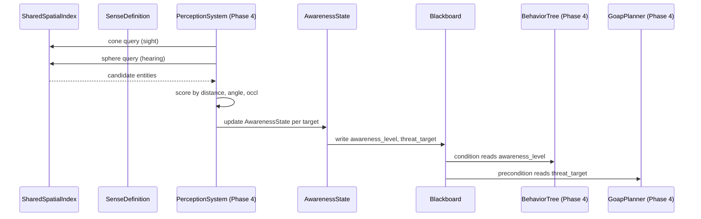

# AI ↔ Spatial Awareness Integration Design

## Systems Involved

| System | Design | Domain |
|--------|--------|--------|
| AI Behavior | [behavior.md](../ai/behavior.md) | AI |
| Spatial Awareness | [spatial-awareness.md](../simulation/spatial-awareness.md) | Simulation |

## Integration Requirements

| ID | Requirement | Systems |
|----|-------------|---------|
| IR-1.10.1 | Sight sense feeds AI perception | SA, AI |
| IR-1.10.2 | Hearing sense feeds AI perception | SA, AI |
| IR-1.10.3 | Awareness state drives AI blackboard | SA, AI |
| IR-1.10.4 | Threat assessment from scored targets | SA, AI |
| IR-1.10.5 | AI budget governs perception queries | SA, AI |

1. **IR-1.10.1** -- `SenseDefinition` with `SenseShape::Cone` queries the shared BVH for entities
   within the sight cone. Line-of-sight raycasts filter occluded targets. Results are written to
   `AiPerception.known_entities` as `PerceivedEntity` entries with `sense: Sight`.
2. **IR-1.10.2** -- `SenseDefinition` with `SenseShape::Sphere` queries the BVH for entities within
   hearing range. The audio propagation system's `PropagationResult` provides occlusion- adjusted
   intensity at the AI's position. Only sounds above the hearing threshold register.
3. **IR-1.10.3** -- `AwarenessState` transitions (Unaware -> Suspicious -> Alert -> Tracking ->
   Lost) are written to `Blackboard` keys. BT condition nodes and GOAP preconditions read these keys
   to gate behavior changes (e.g., enter combat when awareness reaches Alert).
4. **IR-1.10.4** -- `SenseResult` scores (distance, angle, occlusion weighted) are ranked to select
   the highest-threat target. The top-scored entity is written to `Blackboard` as the current threat
   target for BT/GOAP consumption.
5. **IR-1.10.5** -- Perception queries consume `AiBudget` time. Time-sliced execution ensures that
   perception + decision-making for 500 agents stays within the per-frame AI budget (< 2 ms).

## Data Contracts

| Type | Defined in | Consumed by | Purpose |
|------|-----------|-------------|---------|
| `SenseDefinition` | SA | AI (query) | Sense config |
| `SenseResult` | SA | AI | Query results |
| `AwarenessState` | SA | AI | Detection level |
| `AwarenessLevel` | SA | AI | State enum |
| `AiPerception` | AI | SA (write) | Perceived list |
| `PerceivedEntity` | AI | SA (write) | Per-target |
| `Blackboard` | AI | SA (write) | AI state |
| `AiBudget` | AI | SA (consume) | Time budget |

```rust
/// System that runs perception queries for AI
/// agents. Queries the shared BVH via
/// SenseDefinition and writes results to
/// AiPerception and Blackboard.
pub fn ai_perception_system(
    agents: Query<(
        Entity,
        &AiPerception,
        &GlobalTransform,
        &mut Blackboard,
    )>,
    targets: Query<(
        Entity,
        &GlobalTransform,
        Option<&FactionId>,
    )>,
    senses: Res<Assets<SenseDefinition>>,
    spatial_index: Res<SharedSpatialIndex>,
    propagation: Res<PropagationResultStore>,
    mut budget: ResMut<AiBudget>,
);

/// Writes awareness transitions into blackboard
/// keys that BT/GOAP systems consume.
pub fn awareness_blackboard_sync(
    agents: Query<(
        &AwarenessState,
        &mut Blackboard,
    ), Changed<AwarenessState>>,
) {
    for (awareness, mut bb) in &agents {
        bb.set(
            AWARENESS_LEVEL_KEY,
            BlackboardValue::Int(
                awareness.highest_level() as i32,
            ),
        );
        if let Some(target) =
            awareness.highest_scored_target()
        {
            bb.set(
                THREAT_TARGET_KEY,
                BlackboardValue::Entity(
                    target.entity,
                ),
            );
            bb.set(
                THREAT_POSITION_KEY,
                BlackboardValue::Vec3(
                    target.last_known_position,
                ),
            );
        }
    }
}
```

## Data Flow



## Timing and Ordering

| System | Phase | Timestep | Order |
|--------|-------|----------|-------|
| Perception query | 4-AI | Variable | First |
| Awareness update | 4-AI | Variable | After query |
| Blackboard sync | 4-AI | Variable | After aware |
| BT/GOAP eval | 4-AI | Variable | After sync |

All perception and AI systems run within Phase 4. Perception queries execute first, producing
`SenseResult` entries. Awareness state transitions run next, updating `AwarenessState`. Blackboard
sync writes derived keys. Finally, BT/GOAP evaluate with fully updated blackboard data.

Time-slicing via `AiBudget` may defer some agents to the next frame. Deferred agents use stale
perception data (one frame old), which is acceptable for AI decision-making.

## Failure Modes

| Failure | Impact | Recovery |
|---------|--------|----------|
| BVH empty | No targets found | AI stays idle |
| Sense def missing | No perception | Log warn, skip sense |
| Budget exhausted | Agents deferred | Evaluate next frame |
| Target despawned | Stale entry | Memory decay removes |
| Faction missing | No friend/foe | Treat as neutral |

## Platform Considerations

None -- identical across all platforms. BVH queries, awareness state machines, and blackboard writes
are pure CPU ECS operations with no platform-specific dependencies.

## Test Plan

See companion [ai-spatial-awareness-test-cases.md](ai-spatial-awareness-test-cases.md).
