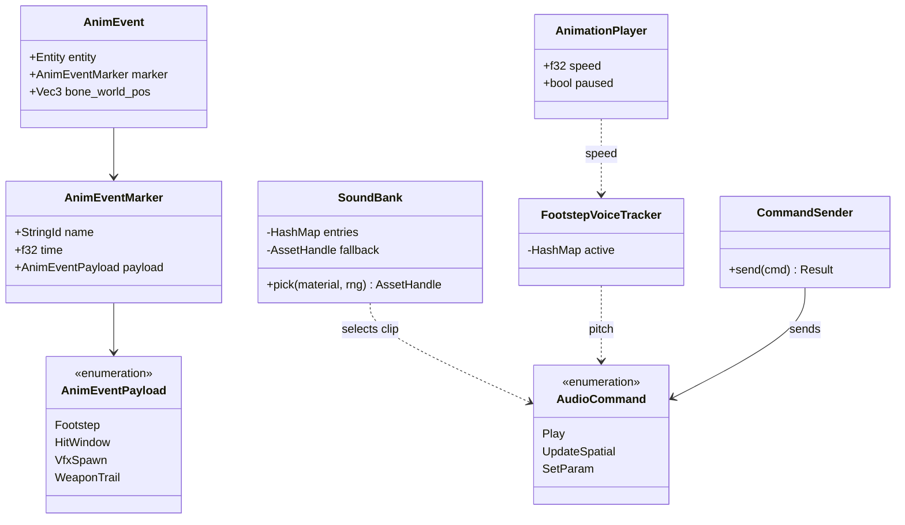
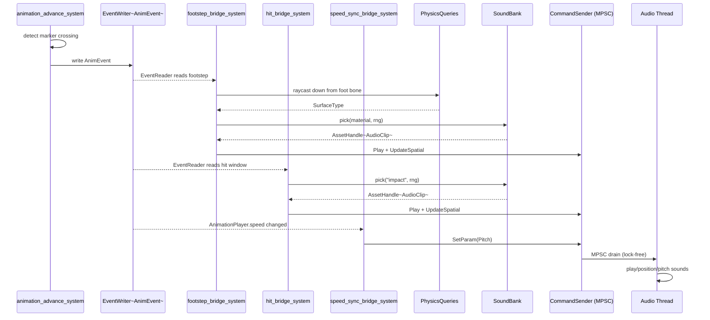

# Animation ↔ Audio Integration Design

## Systems Involved

| System | Design | Domain |
|--------|--------|--------|
| Animation | [skeletal.md](../animation/skeletal.md) | Animation |
| Audio | [audio.md](../audio/audio.md) | Audio |

## Integration Requirements

| ID | Requirement | Systems |
|----|-------------|---------|
| IR-1.2.1 | Footstep events trigger surface sounds | Anim, Audio |
| IR-1.2.2 | Impact events trigger hit sounds | Anim, Audio |
| IR-1.2.3 | Sound sync to walk cycle phase | Anim, Audio |
| IR-1.2.4 | Surface type selects sound variant | Anim, Audio |
| IR-1.2.5 | Animation speed scales sound pitch | Anim, Audio |

1. **IR-1.2.1** -- The state machine determines the current animation immediately (no one-frame
   delay). `AnimEventPayload::Footstep` fires an ECS event via `EventWriter<AnimEvent>`. The audio
   bridge reads it and enqueues `AudioCommand::Play` followed by `AudioCommand::UpdateSpatial` for
   positioning.
2. **IR-1.2.2** -- `AnimEventPayload::HitWindow` markers fire on weapon contact frames. The
   hit-event bridge enqueues `AudioCommand::Play` + `UpdateSpatial` at the bone's world position.
3. **IR-1.2.3** -- Footstep events are frame-accurate within the animation clip. The state machine
   resolves the active state without delay, so the audio command uses `AudioTimestamp::Immediate`
   and the sound aligns with the visual foot-plant.
4. **IR-1.2.4** -- The `Footstep { surface: StringId }` payload carries the surface type. A raycast
   from the foot bone downward determines the actual ground material, selecting the correct
   `SoundBank` entry.
5. **IR-1.2.5** -- When `AnimationPlayer.speed` changes (run vs walk), the speed-sync bridge sends
   `AudioCommand::SetParam` with `VoiceParam::Pitch` scaled proportionally.

## Data Contracts

| Type | Defined in | Consumed by | Purpose |
|------|-----------|-------------|---------|
| `AnimEventMarker` | Animation | Audio | Marker def |
| `AnimEventPayload` | Animation | Audio | Payload enum |
| `AnimEvent` | Animation | Audio bridge | ECS event |
| `AudioCommand` | Audio | Audio bridge | Sound cmds |
| `SoundBank` | This design | Audio bridge | Material map |
| `PhysicsMaterial` | Physics | Audio bridge | Surface tag |
| `CommandSender` | Audio | Audio bridge | MPSC sender |

### Channel Contracts

The audio command channel is an **MPSC** (multiple-producer single-consumer) lock-free queue.
Multiple game-thread systems (footstep bridge, hit bridge, speed-sync bridge) send commands; the
single audio thread drains them.

| Property | Value |
|----------|-------|
| Type | MPSC, lock-free |
| Buffering | Bounded, 4096 commands |
| Backpressure | `send` returns `Err` when full |
| Consumer | Audio thread drains each callback |
| Atomicity | Each `send` is atomic |

### SoundBank

Maps surface material types to randomized audio clip pools. Used by footstep and impact bridges to
select the correct sound variant.

```rust
/// Maps surface materials to audio clip pools.
/// Loaded as an ECS resource from asset data.
pub struct SoundBank {
    /// Material -> pool of clip handles.
    entries: HashMap<StringId, Vec<AssetHandle<AudioClip>>>,
    /// Fallback clip when material has no entry.
    fallback: AssetHandle<AudioClip>,
}

impl SoundBank {
    /// Picks a random clip for the given material.
    /// Falls back to `self.fallback` if the material
    /// has no entry in the bank.
    pub fn pick(
        &self,
        material: StringId,
        rng: &mut Rng,
    ) -> AssetHandle<AudioClip> {
        self.entries
            .get(&material)
            .and_then(|pool| pool.choose(rng))
            .cloned()
            .unwrap_or_else(|| self.fallback.clone())
    }
}
```

### AnimEvent

The ECS event emitted by `animation_advance_system` when playback crosses an event marker. Matches
the canonical name from `skeletal.md` (`EventWriter<AnimEvent>`).

```rust
/// ECS event emitted when animation playback
/// crosses an AnimEventMarker time.
pub struct AnimEvent {
    pub entity: Entity,
    pub marker: AnimEventMarker,
    pub bone_world_pos: Vec3,
}
```

### Footstep Bridge

```rust
/// ECS system: bridges footstep animation events
/// to audio commands.
pub fn footstep_bridge_system(
    events: EventReader<AnimEvent>,
    physics_world: Res<PhysicsQueries>,
    sound_bank: Res<SoundBank>,
    audio_cmd: Res<CommandSender>,
    mut rng: ResMut<Rng>,
) {
    for event in events.read() {
        if let AnimEventPayload::Footstep { surface }
            = &event.marker.payload
        {
            // Raycast down from foot bone to find
            // the actual ground material.
            let material = physics_world
                .raycast_down(event.bone_world_pos, 0.3)
                .map(|h| h.surface_type)
                .unwrap_or(*surface);

            let clip = sound_bank.pick(material, &mut rng);
            let voice_id = VoiceId::transient();

            // Fallback path: if send fails (queue full),
            // the sound is silently dropped. Voice limit
            // overflow is handled by priority-based
            // stealing inside the audio engine.
            let _ = audio_cmd.send(AudioCommand::Play {
                voice_id,
                clip,
                bus: BusId::SFX,
                priority: VoicePriority::Medium,
                timestamp: AudioTimestamp::Immediate,
            });
            let _ = audio_cmd.send(
                AudioCommand::UpdateSpatial {
                    voice_id,
                    position: event.bone_world_pos,
                    velocity: Vec3::ZERO,
                    orientation: Quat::IDENTITY,
                },
            );
        }
    }
}
```

#### Fallback Paths (Footstep)

| Condition | Fallback | Result |
|-----------|----------|--------|
| Raycast misses ground | Use clip's `surface` hint | Correct genre sound |
| `SoundBank` has no material | `SoundBank::fallback` clip | Default footstep |
| Command queue full | `send` returns `Err`, drop | Silent (no sound) |
| Voice limit exceeded | Priority-based steal in engine | Lowest-priority culled |

### Hit Event Bridge

```rust
/// ECS system: bridges hit-window animation events
/// to impact audio commands.
pub fn hit_bridge_system(
    events: EventReader<AnimEvent>,
    impact_bank: Res<SoundBank>,
    audio_cmd: Res<CommandSender>,
    mut rng: ResMut<Rng>,
) {
    for event in events.read() {
        if let AnimEventPayload::HitWindow { .. }
            = &event.marker.payload
        {
            let clip = impact_bank.pick(
                StringId::from("impact"),
                &mut rng,
            );
            let voice_id = VoiceId::transient();

            // Fallback: queue-full drops silently.
            let _ = audio_cmd.send(AudioCommand::Play {
                voice_id,
                clip,
                bus: BusId::SFX,
                priority: VoicePriority::High,
                timestamp: AudioTimestamp::Immediate,
            });
            let _ = audio_cmd.send(
                AudioCommand::UpdateSpatial {
                    voice_id,
                    position: event.bone_world_pos,
                    velocity: Vec3::ZERO,
                    orientation: Quat::IDENTITY,
                },
            );
        }
    }
}
```

#### Fallback Paths (Hit)

| Condition | Fallback | Result |
|-----------|----------|--------|
| `SoundBank` has no "impact" | `SoundBank::fallback` clip | Default hit |
| Command queue full | `send` returns `Err`, drop | Silent (no sound) |
| Voice limit exceeded | Priority steal (High prio) | Lower-prio culled |

### Speed-Sync Bridge

```rust
/// Tracks active footstep voices and their
/// associated animation entity, so pitch can
/// be updated when animation speed changes.
pub struct FootstepVoiceTracker {
    /// Entity -> most recent footstep VoiceId.
    active: HashMap<Entity, VoiceId>,
}

/// ECS system: scales footstep pitch to match
/// animation playback speed.
pub fn speed_sync_bridge_system(
    players: Query<(Entity, &AnimationPlayer)>,
    tracker: Res<FootstepVoiceTracker>,
    audio_cmd: Res<CommandSender>,
) {
    for (entity, player) in players.iter() {
        if let Some(&voice_id) =
            tracker.active.get(&entity)
        {
            // Map animation speed to pitch. A speed
            // of 2.0 yields pitch ~1.1 (subtle shift).
            let pitch = 1.0 + (player.speed - 1.0) * 0.1;

            // Fallback: queue-full drops silently;
            // pitch remains at previous value.
            let _ = audio_cmd.send(
                AudioCommand::SetParam {
                    voice_id,
                    param: VoiceParam::Pitch,
                    value: pitch,
                    timestamp: AudioTimestamp::Immediate,
                },
            );
        }
    }
}
```

#### Fallback Paths (Speed-Sync)

| Condition | Fallback | Result |
|-----------|----------|--------|
| No active voice for entity | Skip (no-op) | No pitch change |
| Command queue full | `send` returns `Err`, drop | Pitch stays previous |

## Class Diagram



## Data Flow



## Timing and Ordering

| System | Phase | Timestep | Order |
|--------|-------|----------|-------|
| Animation eval | 6-Animation | Variable | First |
| Event dispatch | 6-Animation | Variable | After eval |
| Audio bridges | 6-Animation | Variable | After events |
| Audio thread | Dedicated | Real-time | MPSC drain |

The state machine determines the active animation immediately with no one-frame delay. Animation
evaluates clips and fires events in Phase 6. The bridge systems run immediately after event dispatch
in the same phase. Audio commands are enqueued to the bounded MPSC lock-free queue (4096 capacity)
and drained by the audio thread at its next buffer callback.

Latency: event-to-sound is under one audio buffer period (typically 5-10 ms at 48 kHz / 256
samples).

## Failure Modes

| Failure | Impact | Recovery |
|---------|--------|----------|
| Sound bank missing material | Wrong sound | `SoundBank::fallback` clip |
| Raycast misses ground | Wrong surface | Use clip's `surface` hint |
| Voice limit exceeded | Sound virtualized | Priority-based steal |
| Command queue full | Sound dropped | `send` returns `Err` |
| Audio thread overrun | Buffer underrun | Silence, catch up next cb |

### Detailed Fallback Paths

1. **Sound bank missing material** -- `SoundBank::pick` returns `self.fallback` when the material
   has no entry. A default footstep or impact sound always plays.
2. **Raycast misses ground** -- The bridge uses the `surface` hint from `AnimEventPayload::Footstep`
   as the material key. The sound matches the clip author's intended surface.
3. **Voice limit exceeded** -- The audio engine's `VoiceManager` performs priority-based stealing.
   Transient footstep voices (`VoicePriority::Medium`) are culled before hit voices (`High`).
4. **Command queue full** -- `CommandSender::send` returns `Err(cmd)`. The bridge discards the
   command with `let _ =`. The sound is silently skipped for that frame.
5. **Audio thread overrun** -- The audio callback outputs silence for the missed buffer. The thread
   catches up on the next callback by draining any accumulated commands.

## Platform Considerations

None -- identical across all platforms. Animation events and audio commands use platform-agnostic
ECS and MPSC channel primitives. The audio thread's platform backend is abstracted behind
`AudioBackend`.

## Test Plan

See companion [animation-audio-test-cases.md](animation-audio-test-cases.md).

## Review Feedback

1. [APPLIED] `AudioCommand::Play` has no `position` field. Fixed: bridge now sends `Play` followed
   by `UpdateSpatial` matching the canonical audio API.

2. [APPLIED] Bare references replaced with ECS system parameters (`Res<T>`, `ResMut<T>`,
   `EventReader`, `Query`).

3. [APPLIED] Renamed `AnimEventFired` to `AnimEvent` to match the canonical name from `skeletal.md`
   (`EventWriter<AnimEvent>`).

4. [APPLIED] Added `speed_sync_bridge_system` with `FootstepVoiceTracker` and
   `AudioCommand::SetParam` using `VoiceParam::Pitch`.

5. [APPLIED] Added `hit_bridge_system` for IR-1.2.2 impact/hit sounds.

6. [APPLIED] Added `SoundBank` type definition with
   `HashMap<StringId, Vec<AssetHandle<AudioClip>>>`, `fallback` field, and `pick(material, rng)`
   method.

7. [APPLIED] Added `classDiagram` Mermaid diagram covering all types, enums, and relationships.

8. [APPLIED] Renamed "Async drain" to "MPSC drain" in Timing table. Documented channel as MPSC
   lock-free with bounded 4096 capacity.

9. [APPLIED] Added failure-mode test cases to companion file: TC-IR-1.2.1.3 (sound bank fallback),
   TC-IR-1.2.1.4 (voice limit steal), TC-IR-1.2.1.5 (buffer underrun recovery), TC-IR-1.2.1.6 (queue
   full).

10. [APPLIED] Sequence diagram now shows `animation_advance_system` as the emitter, not the clip
    asset directly.
