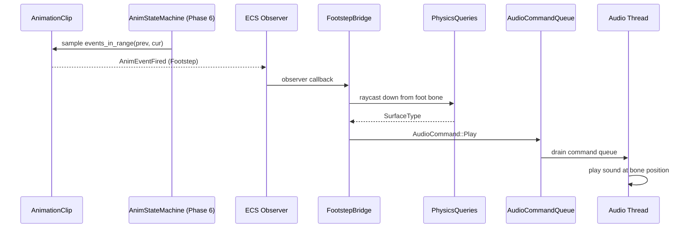

# Animation ↔ Audio Integration Design

## Systems Involved

| System | Design | Domain |
|--------|--------|--------|
| Animation | [skeletal.md](../animation/skeletal.md) | Animation |
| Audio | [audio.md](../audio/audio.md) | Audio |

## Integration Requirements

| ID | Requirement | Systems |
|----|-------------|---------|
| IR-1.2.1 | Footstep events trigger surface sounds | Anim, Audio |
| IR-1.2.2 | Impact events trigger hit sounds | Anim, Audio |
| IR-1.2.3 | Sound sync to walk cycle phase | Anim, Audio |
| IR-1.2.4 | Surface type selects sound variant | Anim, Audio |
| IR-1.2.5 | Animation speed scales sound pitch | Anim, Audio |

1. **IR-1.2.1** -- `AnimEventMarker` with `AnimEventPayload::Footstep` fires an ECS observer event.
   The audio system observes it and enqueues an `AudioCommand::Play` for the matching surface sound.
2. **IR-1.2.2** -- `AnimEventPayload::HitWindow` markers fire on weapon contact frames. Audio plays
   an impact sound at the bone's world position.
3. **IR-1.2.3** -- Footstep events are frame-accurate within the animation clip. The audio command
   uses `AudioTimestamp::Immediate` so the sound aligns with the visual foot-plant.
4. **IR-1.2.4** -- The `Footstep { surface: StringId }` payload carries the surface type. A raycast
   from the foot bone downward determines the actual ground material, selecting the correct sound
   bank.
5. **IR-1.2.5** -- When `AnimationPlayer.speed` changes (run vs walk), the audio system scales
   footstep pitch proportionally to maintain perceived sync.

## Data Contracts

| Type | Defined in | Consumed by | Purpose |
|------|-----------|-------------|---------|
| `AnimEventMarker` | Animation | Audio | Event fire |
| `AnimEventPayload` | Animation | Audio | Payload type |
| `AudioCommand` | Audio | Animation bridge | Sound play |
| `PhysicsMaterial` | Physics | Audio | Surface tag |

```rust
/// Emitted as an ECS observer event when an
/// AnimEventMarker fires during clip playback.
pub struct AnimEventFired {
    pub entity: Entity,
    pub marker: AnimEventMarker,
    pub bone_world_pos: Vec3,
}

/// Observer handler bridges animation events
/// to audio commands.
pub fn on_footstep_event(
    event: &AnimEventFired,
    physics_world: &PhysicsQueries,
    sound_bank: &SoundBank,
    audio_cmd: &CommandSender,
) {
    if let AnimEventPayload::Footstep { surface }
        = &event.marker.payload
    {
        let ground = physics_world.raycast_down(
            event.bone_world_pos, 0.3,
        );
        let material = ground
            .map(|h| h.surface_type)
            .unwrap_or(*surface);
        let clip = sound_bank.pick(material);
        audio_cmd.send(AudioCommand::Play {
            voice_id: VoiceId::transient(),
            clip,
            bus: BusId::SFX,
            priority: VoicePriority::Medium,
            position: Some(event.bone_world_pos),
            timestamp: AudioTimestamp::Immediate,
        });
    }
}
```

## Data Flow



## Timing and Ordering

| System | Phase | Timestep | Order |
|--------|-------|----------|-------|
| Animation eval | 6-Animation | Variable | First |
| Event dispatch | 6-Animation | Variable | After eval |
| Audio bridge | 6-Animation | Variable | After events |
| Audio thread | Dedicated | Real-time | Async drain |

Animation evaluates clips and fires events in Phase 6. The observer bridge runs immediately after
event dispatch in the same phase. Audio commands are enqueued to the lock-free SPSC queue and
drained by the audio thread at its next buffer callback.

Latency: event-to-sound is under one audio buffer period (typically 5-10 ms at 48 kHz / 256
samples).

## Failure Modes

| Failure | Impact | Recovery |
|---------|--------|----------|
| Sound bank missing material | No sound plays | Fallback to default |
| Raycast misses ground | Wrong surface | Use clip's surface hint |
| Voice limit exceeded | Sound virtualized | Priority-based steal |
| Audio thread overrun | Buffer underrun | Silence, catch up |

## Platform Considerations

None -- identical across all platforms. Animation events and audio commands use platform-agnostic
ECS and channel primitives. The audio thread's platform backend is abstracted behind `AudioBackend`.

## Test Plan

See companion [animation-audio-test-cases.md](animation-audio-test-cases.md).
