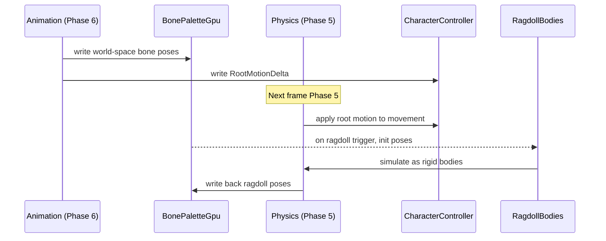

# Animation ↔ Physics Integration Design

## Systems Involved

| System | Design | Domain |
|--------|--------|--------|
| Animation | [skeletal.md](../animation/skeletal.md) | Animation |
| Physics | [foundation.md](../physics/foundation.md) | Physics |

## Integration Requirements

| ID | Requirement | Systems |
|----|-------------|---------|
| IR-1.3.1 | Ragdoll transition from animated pose | Anim, Phys |
| IR-1.3.2 | Bone-driven colliders follow skeleton | Anim, Phys |
| IR-1.3.3 | Root motion applied via physics | Anim, Phys |
| IR-1.3.4 | Ragdoll-to-animation blend recovery | Anim, Phys |
| IR-1.3.5 | Animated collider shapes for weapons | Anim, Phys |

1. **IR-1.3.1** -- On ragdoll trigger (death, stun), the current `BonePaletteGpu` world-space poses
   initialize `RigidBody` + `Velocity` components on each ragdoll bone entity. Animation evaluation
   stops; physics takes over.
2. **IR-1.3.2** -- Bone-driven colliders (hit boxes, shield shapes) read world-space bone transforms
   from the `BonePaletteGpu` each frame and update their `Collider` transform accordingly.
3. **IR-1.3.3** -- `RootMotionDelta` (translation, rotation) extracted in Phase 6 is applied to
   `DesiredMovement` on the `CharacterController` during Phase 5 of the *next* frame, or via
   `ExternalForce` for dynamic bodies.
4. **IR-1.3.4** -- Recovery from ragdoll blends physics poses back to an animated get-up clip over a
   configurable duration, using per-bone blend weights that ramp from 0 (physics) to 1 (animation).
5. **IR-1.3.5** -- Weapon colliders attached to hand bones are kinematic bodies whose transforms
   track the bone each frame. `AnimEventWindow` (HitWindow) enables/disables their collision layers.

## Data Contracts

| Type | Defined in | Consumed by | Purpose |
|------|-----------|-------------|---------|
| `BonePaletteGpu` | Animation | Physics | Bone poses |
| `RootMotionDelta` | Animation | Physics | Root delta |
| `RigidBody` | Physics | Animation | Ragdoll |
| `Velocity` | Physics | Animation | Init vel |
| `CharacterController` | Physics | Animation | Root motion |
| `CollisionLayers` | Physics | Animation | Hit windows |

```rust
/// Ragdoll configuration asset. Maps skeleton
/// bones to rigid body shapes and constraints.
pub struct RagdollDef {
    pub bone_bodies: Vec<RagdollBone>,
    pub constraints: Vec<RagdollConstraint>,
}

pub struct RagdollBone {
    pub bone_index: BoneIndex,
    pub shape: ColliderShape,
    pub mass: f32,
    pub friction: f32,
    pub restitution: f32,
}

pub struct RagdollConstraint {
    pub parent_bone: BoneIndex,
    pub child_bone: BoneIndex,
    pub twist_limit: f32,
    pub swing_limit: f32,
}

/// Component marking an entity in ragdoll mode.
/// When present, animation eval is skipped and
/// physics drives bone transforms.
#[derive(Component)]
pub struct RagdollActive {
    pub blend_weight: f32,
    pub recovery_timer: Option<f32>,
}
```

## Data Flow



## Timing and Ordering

| System | Phase | Timestep | Order |
|--------|-------|----------|-------|
| Physics | 5-Physics | Fixed | First |
| Animation | 6-Animation | Variable | After phys |
| Root motion apply | 5-Physics | Fixed | Next frame |
| Bone collider sync | 6-Animation | Variable | After eval |

Root motion has one-frame latency: extracted in Phase 6 frame N, applied in Phase 5 frame N+1. This
matches the existing `DesiredMovement` pattern for character controllers.

Ragdoll transition is instant within a single frame: physics initializes bodies from the last
animated pose during the same Phase 5 tick.

## Failure Modes

| Failure | Impact | Recovery |
|---------|--------|----------|
| RagdollDef missing bone | Bone floats free | Skip bone, log warn |
| Root motion on sleeping body | No movement | Wake body first |
| Constraint violation | Joint explodes | Clamp velocities |
| Recovery anim missing | Stuck in ragdoll | Snap to idle pose |

## Platform Considerations

None -- identical across all platforms. Physics and animation are pure CPU/GPU ECS systems with no
platform-specific paths. Fixed-timestep physics guarantees deterministic ragdoll behavior.

## Test Plan

See companion [animation-physics-test-cases.md](animation-physics-test-cases.md).
