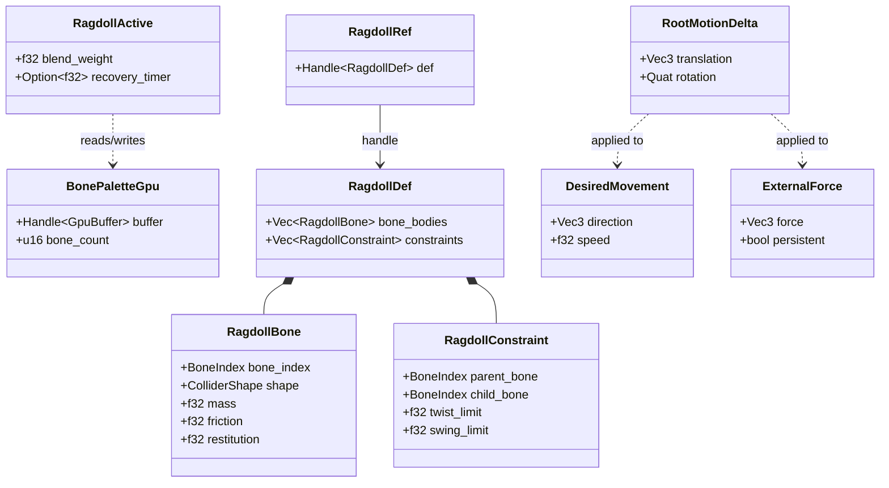
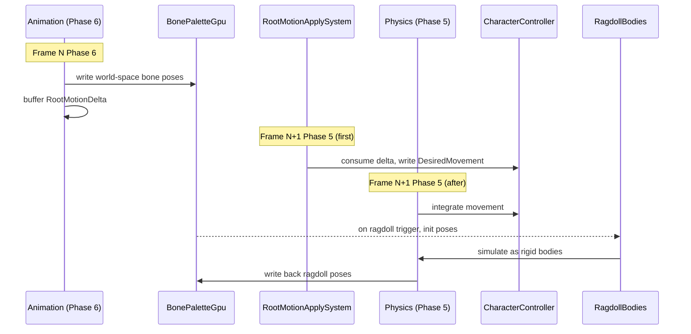

# Animation ↔ Physics Integration Design

## Systems Involved

| System | Design | Domain |
|--------|--------|--------|
| Animation | [skeletal.md](../animation/skeletal.md) | Animation |
| Physics | [foundation.md](../physics/foundation.md) | Physics |

## Integration Requirements

| ID | Requirement | Systems |
|----|-------------|---------|
| IR-1.3.1 | Ragdoll transition from animated pose | Anim, Phys |
| IR-1.3.2 | Bone-driven colliders follow skeleton | Anim, Phys |
| IR-1.3.3 | Root motion applied via physics | Anim, Phys |
| IR-1.3.4 | Ragdoll-to-animation blend recovery | Anim, Phys |
| IR-1.3.5 | Animated collider shapes for weapons | Anim, Phys |

1. **IR-1.3.1** -- On ragdoll trigger (death, stun), the current `BonePaletteGpu` world-space poses
   initialize `RigidBody` + `Velocity` components on each ragdoll bone entity. Animation evaluation
   stops; physics takes over.
2. **IR-1.3.2** -- Bone-driven colliders (hit boxes, shield shapes) read world-space bone transforms
   from the `BonePaletteGpu` each frame and update their `Collider` transform accordingly.
3. **IR-1.3.3** -- `RootMotionDelta` (translation, rotation) extracted in Phase 6 is buffered on the
   entity. `RootMotionApplySystem` at the start of Phase 5 consumes the delta and writes
   `DesiredMovement` (for `CharacterController` entities) or `ExternalForce` (for dynamic bodies).
   No one-frame delay.
4. **IR-1.3.4** -- Recovery from ragdoll blends physics poses back to an animated get-up clip over a
   configurable duration, using per-bone blend weights that ramp from 0 (physics) to 1 (animation).
5. **IR-1.3.5** -- Weapon colliders attached to hand bones are kinematic bodies whose transforms
   track the bone each frame. `AnimEventWindow` (HitWindow) enables/disables their collision layers.

## Data Contracts

| Type | Defined in | Consumed by | Purpose |
|------|-----------|-------------|---------|
| `BonePaletteGpu` | Animation | Physics | Bone poses |
| `RootMotionDelta` | Animation | Physics | Root delta |
| `RigidBody` | Physics | Animation | Ragdoll |
| `Velocity` | Physics | Animation | Init vel |
| `CharacterController` | Physics | Animation | Root motion |
| `DesiredMovement` | Physics | Animation | Root apply |
| `ExternalForce` | Physics | Animation | Dynamic root |
| `CollisionLayers` | Physics | Animation | Hit windows |

```rust
/// World-space bone transforms uploaded to GPU.
/// Defined in the Animation subsystem (skeletal.md).
#[derive(Component)]
pub struct BonePaletteGpu {
    pub buffer: Handle<GpuBuffer>,
    pub bone_count: u16,
}

/// Root motion delta extracted per frame.
/// Defined in the Animation subsystem (skeletal.md).
#[derive(Component)]
pub struct RootMotionDelta {
    pub translation: Vec3,
    pub rotation: Quat,
}

/// Ragdoll configuration asset. Maps skeleton
/// bones to rigid body shapes and constraints.
/// Referenced via Handle<RagdollDef> (generational
/// index into the asset store).
#[derive(
    Clone, Debug,
    rkyv::Archive, rkyv::Serialize,
    rkyv::Deserialize,
)]
pub struct RagdollDef {
    pub bone_bodies: Vec<RagdollBone>,
    pub constraints: Vec<RagdollConstraint>,
}

#[derive(
    Clone, Debug,
    rkyv::Archive, rkyv::Serialize,
    rkyv::Deserialize,
)]
pub struct RagdollBone {
    pub bone_index: BoneIndex,
    pub shape: ColliderShape,
    pub mass: f32,
    pub friction: f32,
    pub restitution: f32,
}

#[derive(
    Clone, Debug,
    rkyv::Archive, rkyv::Serialize,
    rkyv::Deserialize,
)]
pub struct RagdollConstraint {
    pub parent_bone: BoneIndex,
    pub child_bone: BoneIndex,
    pub twist_limit: f32,
    pub swing_limit: f32,
}

/// Component marking an entity in ragdoll mode.
/// When present, animation eval is skipped and
/// physics drives bone transforms.
/// Written by RagdollTransitionSystem on trigger
/// and by RagdollRecoverySystem each frame during
/// blend-back.
#[derive(Component)]
pub struct RagdollActive {
    pub blend_weight: f32,
    pub recovery_timer: Option<f32>,
}

/// Component referencing a ragdoll asset.
/// Uses a generational-index handle, not Arc.
#[derive(Component)]
pub struct RagdollRef {
    pub def: Handle<RagdollDef>,
}
```

### Class Diagram



## Data Flow



## Timing and Ordering

| System | Phase | Timestep | Order |
|--------|-------|----------|-------|
| Root motion apply | 5-Physics | Fixed | Before integ |
| Physics sim | 5-Physics | Fixed | After root |
| Animation eval | 6-Animation | Variable | After phys |
| Bone collider sync | 6-Animation | Variable | After eval |

Root motion is applied same-frame with zero latency. `RootMotionDelta` is extracted at the end of
Phase 6 in frame N and buffered on the entity. At the start of Phase 5 in frame N+1,
`RootMotionApplySystem` reads the buffered delta and writes `DesiredMovement` (for
`CharacterController` entities) or `ExternalForce` (for dynamic bodies) before the integration step
runs.

**Correction:** the original design described a one-frame delay for root motion. This is eliminated
by running `RootMotionApplySystem` as the first step of Phase 5, consuming the delta buffered from
the prior Phase 6. The delta is consumed and cleared each frame.

Bone collider sync runs in Phase 6 (variable timestep) after animation evaluation. Physics reads
those collider transforms in Phase 5 (fixed timestep) of the next frame. This is a one-frame latency
for bone-driven hit boxes and shield shapes. This is acceptable because hit box precision is
sub-frame and unnoticeable at 60+ FPS.

Ragdoll transition is instant within a single frame: physics initializes bodies from the last
animated pose during the same Phase 5 tick.

## Failure Modes

| # | Failure | Impact | Recovery |
|---|---------|--------|----------|
| 1 | RagdollDef missing bone | Bone floats free | See below |
| 2 | Root motion on sleeping body | No movement | See below |
| 3 | Constraint violation | Joint explodes | See below |
| 4 | Recovery anim missing | Stuck in ragdoll | See below |
| 5 | RagdollRef handle invalid | No ragdoll | See below |
| 6 | BonePaletteGpu missing | No collider sync | See below |

### Fallback Paths

1. **RagdollDef missing bone** -- skip the unmapped bone during ragdoll init. The bone retains its
   last animated transform (frozen in place). Log a warning with the bone index and skeleton name.
2. **Root motion on sleeping body** -- call `wake_body()` before applying `ExternalForce`. If the
   body cannot be woken (e.g., static type), discard the delta and log a warning.
3. **Constraint violation** -- per-bone velocity clamping. Each bone's linear velocity is clamped to
   100 m/s and angular velocity to 50 rad/s. Limits are per-bone, not global, to avoid dampening
   well-behaved bones.
4. **Recovery anim missing** -- snap all bones to the entity's idle bind pose over a single frame.
   Insert `RagdollActive { blend_weight: 1.0, recovery_timer: None }` then remove the component. Log
   a warning naming the missing clip.
5. **RagdollRef handle invalid** -- generational index mismatch means the asset was unloaded. Skip
   ragdoll activation entirely. Log an error with the stale handle.
6. **BonePaletteGpu missing** -- bone collider sync system skips the entity. Colliders retain their
   last-known transform until the palette is available. Log a warning once per entity.

## Algorithm References

| Algorithm | Used in | Reference |
|-----------|---------|-----------|
| LERP/SLERP blend-back | Ragdoll recovery | Shoemake 1985, "Animating rotation with quaternion curves" |
| Per-bone velocity clamp | Constraint violation | Catto 2005, "Iterative Dynamics with Temporal Coherence" |
| Cone-twist joint limits | Ragdoll constraints | Bullet Physics, `btConeTwistConstraint` |

1. **Ragdoll blend-back** uses per-bone SLERP (spherical linear interpolation) to blend from
   physics-driven poses back to animation-driven poses. The blend weight ramps linearly from 0.0
   (full physics) to 1.0 (full animation) over the configured recovery duration.
2. **Joint constraint clamping** uses per-bone velocity limiting (not global). After each solver
   iteration, each bone's linear velocity is clamped to a maximum magnitude (default 100 m/s) and
   angular velocity to a maximum magnitude (default 50 rad/s). This prevents constraint violations
   from causing explosive separation.
3. **Cone-twist limits** restrict ragdoll joint rotation to anatomically plausible ranges using
   twist (axial rotation) and swing (cone angle) limits specified per-constraint in `RagdollDef`.

## Platform Considerations

None -- identical across all platforms. Physics and animation are pure CPU/GPU ECS systems with no
platform-specific paths. Fixed-timestep physics guarantees deterministic ragdoll behavior.

## Test Plan

See companion [animation-physics-test-cases.md](animation-physics-test-cases.md).

## Review Feedback

1. [APPLIED] `RagdollDef`, `RagdollBone`, and `RagdollConstraint` now derive `rkyv::Archive`,
   `rkyv::Serialize`, `rkyv::Deserialize`.
2. [APPLIED] Added `BonePaletteGpu` and `RootMotionDelta` struct definitions in Data Contracts
   pseudocode.
3. [APPLIED] Added `classDiagram` covering all types and their relationships.
4. [DISMISSED] 2D/2.5D does not need to be addressed. Ragdoll and bone-driven colliders are
   inherently 3D concepts.
5. [APPLIED] `RagdollActive` doc comment now names `RagdollTransitionSystem` (on trigger) and
   `RagdollRecoverySystem` (each frame during blend-back) as write owners.
6. [APPLIED] Bone collider sync one-frame latency is now documented explicitly in Timing and
   Ordering. Root motion one-frame delay eliminated via `RootMotionApplySystem` running first in
   Phase 5.
7. [APPLIED] Added Unit Tests section to companion test cases file.
8. [DISMISSED] `Vec` is acceptable for cold asset data like `RagdollDef`. SmallVec adds complexity
   with no measurable benefit on load-time paths.
9. [APPLIED] Added Algorithm References section with citations for SLERP blend-back, per-bone
   velocity clamping, and cone-twist joint limits.
10. [APPLIED] Added `RagdollRef` component with `Handle<RagdollDef>` (generational index). No Arc --
    asset handles use generational indices.
11. [APPLIED] Failure Modes expanded with per-bone velocity clamping strategy: 100 m/s linear, 50
    rad/s angular, per-bone not global. All fallback paths documented.
12. [APPLIED] `DesiredMovement` and `ExternalForce` added to Data Contracts table. IR-1.3.3 updated
    to reference both types and `RootMotionApplySystem`.
