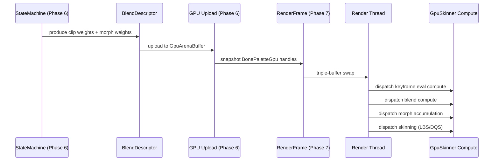

# Animation ↔ Rendering Integration Design

## Systems Involved

| System | Design | Domain |
|--------|--------|--------|
| Animation | [skeletal.md](../animation/skeletal.md) | Animation |
| Rendering | [rendering-core.md](../rendering/rendering-core.md) | Rendering |

## Integration Requirements

| ID | Requirement | Systems |
|----|-------------|---------|
| IR-1.4.1 | GPU skinning dispatch from blend desc | Anim, Render |
| IR-1.4.2 | Morph target accumulation before skin | Anim, Render |
| IR-1.4.3 | Animation LOD selects eval tier | Anim, Render |
| IR-1.4.4 | Bone palette included in RenderFrame | Anim, Render |
| IR-1.4.5 | Instanced skinning for crowds | Anim, Render |

1. **IR-1.4.1** -- `AnimationBlendDescriptor` produced by the state machine (Phase 6) is uploaded to
   GPU buffers. The render thread dispatches compute shaders for keyframe eval, blending, and
   skinning (LBS or DQS) using the `GpuSkinner` pipeline.
2. **IR-1.4.2** -- `MorphTargets` weights are accumulated via GPU compute into sparse delta buffers.
   The morph pass runs before skinning so vertex deltas are applied to the base mesh prior to bone
   transforms.
3. **IR-1.4.3** -- `AnimationLodTier` computed from the shared spatial index selects the evaluation
   tier: Full, ReducedBones, HalfRate, or VAT. Lower tiers skip GPU blend/skin dispatches and use
   baked vertex animation textures.
4. **IR-1.4.4** -- `BonePaletteGpu` buffer handles are snapshotted into the `RenderFrame` at Phase
   7. The render thread reads them for skinned mesh draw calls without accessing ECS state.
5. **IR-1.4.5** -- `InstancedAnimator` groups entities sharing the same skeleton and clip set into a
   single `GpuArenaBuffer` dispatch, enabling 1000+ skinned instances per draw call.

## Data Contracts

| Type | Defined in | Consumed by | Purpose |
|------|-----------|-------------|---------|
| `BlendDescriptor` | Animation | Render | Clip weights |
| `BonePaletteGpu` | Animation | Render | Bone buffer |
| `MorphTargets` | Animation | Render | Morph weights |
| `AnimationLodTier` | Animation | Render | LOD tier |
| `GpuArenaBuffer` | Animation | Render | Instance arena |
| `RenderFrame` | Rendering | Animation | Snapshot |
| `SkinningMode` | Animation | Render | LBS vs DQS |

```rust
/// Snapshotted at Phase 7 into RenderFrame.
/// Render thread consumes without ECS access.
pub struct SkinnedMeshProxy {
    pub bone_palette: Handle<GpuBuffer>,
    pub bone_count: u16,
    pub skinning_mode: SkinningMode,
    pub morph_buffer: Option<Handle<GpuBuffer>>,
    pub lod_tier: LodTier,
}

/// GPU compute dispatch descriptor for one
/// skinning batch. Groups instances by skeleton
/// and skinning mode for minimal dispatches.
pub struct SkinningDispatch {
    pub arena_buffer: Handle<GpuBuffer>,
    pub instance_count: u32,
    pub bone_count_per_instance: u16,
    pub mode: SkinningMode,
}
```

## Data Flow



## Timing and Ordering

| System | Phase | Timestep | Order |
|--------|-------|----------|-------|
| Animation eval | 6-Animation | Variable | Workers |
| GPU upload | 6-Animation | Variable | After eval |
| Snapshot | 7-Snapshot | Variable | After upload |
| Skinning dispatch | Render thread | Variable | After swap |

The render thread operates one frame behind the game thread via triple buffering. `RenderFrame`
snapshot at Phase 7 includes all GPU buffer handles produced during Phase 6. The render thread reads
the snapshot and dispatches compute shaders without synchronization.

## Failure Modes

| Failure | Impact | Recovery |
|---------|--------|----------|
| Arena buffer full | New instances dropped | Grow or LOD cull |
| Morph buffer overflow | Morph clipped | Clamp to max targets |
| LOD tier invalid | Wrong eval path | Fallback to Full |
| GPU timeout on skin | Frame stall | Reduce instance count |

## Platform Considerations

| Platform | Consideration |
|----------|---------------|
| Windows (D3D12) | Compute dispatch via ID3D12 |
| macOS (Metal) | Compute dispatch via MTLComputeCommandEncoder |
| Linux (Vulkan) | Compute dispatch via vkCmdDispatch |

All three backends use the same `GpuSkinner` compute shader (HLSL compiled to DXIL/SPIR-V/Metal IR).
Dispatch group sizes may differ per GPU architecture but the data flow is identical.

## Test Plan

See companion [animation-rendering-test-cases.md](animation-rendering-test-cases.md).
