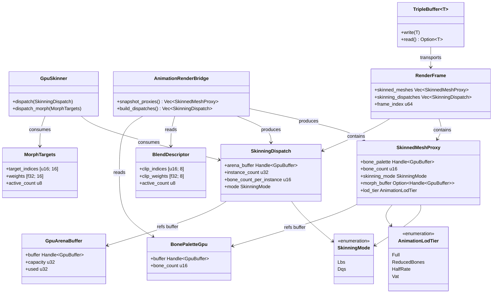
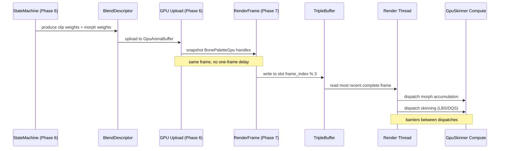

# Animation ↔ Rendering Integration Design

## Systems Involved

| System | Design | Domain |
|--------|--------|--------|
| Animation | [skeletal.md](../animation/skeletal.md) | Animation |
| Rendering | [rendering-core.md](../rendering/rendering-core.md) | Rendering |

## Requirements Trace

| ID | Requirement | Systems |
|----|-------------|---------|
| IR-1.4.1 | GPU skinning dispatch from blend desc | Anim, Render |
| IR-1.4.2 | Morph target accumulation before skin | Anim, Render |
| IR-1.4.3 | Animation LOD selects eval tier | Anim, Render |
| IR-1.4.4 | Bone palette included in RenderFrame | Anim, Render |
| IR-1.4.5 | Instanced skinning for crowds | Anim, Render |

1. **IR-1.4.1** -- `AnimationBlendDescriptor` produced by the state machine (Phase 6) is uploaded to
   GPU buffers. The render thread dispatches compute shaders for keyframe eval, blending, and
   skinning (LBS or DQS) using the `GpuSkinner` pipeline. No one-frame delay: the snapshot includes
   all GPU buffer handles produced in the same frame.
2. **IR-1.4.2** -- `MorphTargets` weights are accumulated via GPU compute into sparse delta buffers.
   The morph pass runs before skinning so vertex deltas are applied to the base mesh prior to bone
   transforms.
3. **IR-1.4.3** -- `AnimationLodTier` computed from the shared spatial index selects the evaluation
   tier: Full, ReducedBones, HalfRate, or Vat. Lower tiers skip GPU blend/skin dispatches and use
   baked vertex animation textures.
4. **IR-1.4.4** -- `BonePaletteGpu` buffer handles are snapshotted into the `RenderFrame` at Phase
   7. The render thread reads them for skinned mesh draw calls without accessing ECS state.
5. **IR-1.4.5** -- `InstancedAnimator` groups entities sharing the same skeleton and clip set into a
   single `GpuArenaBuffer` dispatch, enabling 1000+ skinned instances per draw call. Grouping uses a
   sorted `Vec` keyed by `(SkeletonId, ClipSetId)` -- no `HashMap` on the hot path.

## Overview

This integration defines how the animation system produces GPU-ready skinning data and how the
rendering system consumes it. Animation runs during Phase 6 on worker threads, producing blend
descriptors, morph weights, and bone palettes. Phase 7 snapshots all GPU buffer handles into
`RenderFrame`. The render thread reads the snapshot via a lock-free triple buffer and dispatches
compute shaders for skinning without touching ECS state.

## Architecture



## API Design

```rust
/// Skinning algorithm selection.
pub enum SkinningMode {
    /// Linear Blend Skinning.
    /// Reference: "Skinning with Dual Quaternions"
    /// (Kavan et al., 2007) -- LBS baseline.
    Lbs,
    /// Dual Quaternion Skinning.
    /// Reference: Kavan et al., I3D 2007.
    Dqs,
}

/// Animation evaluation tier selected by LOD.
pub enum AnimationLodTier {
    /// All bones evaluated, full blend tree.
    Full,
    /// Reduced bone set (spine + limb roots only).
    ReducedBones,
    /// Evaluate every other frame, reuse last result.
    HalfRate,
    /// Vertex Animation Texture playback, no skinning.
    /// Reference: "Vertex Animation Textures"
    /// (GDC 2018, Karis / Epic Games).
    Vat,
}

/// Clip weights produced by the animation state machine.
/// Transient GPU-upload struct -- not rkyv-archived.
pub struct BlendDescriptor {
    pub clip_indices: [u16; 8],
    pub clip_weights: [f32; 8],
    pub active_count: u8,
}

/// Morph target weights for facial/corrective blends.
/// Transient GPU-upload struct -- not rkyv-archived.
/// Reference: "Morphological Antialiasing" approach
/// adapted from GPU Gems 3, Ch. 4 (morph accumulation).
pub struct MorphTargets {
    pub target_indices: [u16; 16],
    pub weights: [f32; 16],
    pub active_count: u8,
}

/// GPU-side bone palette uploaded during Phase 6.
pub struct BonePaletteGpu {
    pub buffer: Handle<GpuBuffer>,
    pub bone_count: u16,
}

/// Snapshotted at Phase 7 into RenderFrame.
/// Render thread consumes without ECS access.
/// Transient per-frame struct -- not rkyv-archived.
pub struct SkinnedMeshProxy {
    pub bone_palette: Handle<GpuBuffer>,
    pub bone_count: u16,
    pub skinning_mode: SkinningMode,
    pub morph_buffer: Option<Handle<GpuBuffer>>,
    pub lod_tier: AnimationLodTier,
}

/// GPU compute dispatch descriptor for one
/// skinning batch. Groups instances by skeleton
/// and skinning mode for minimal dispatches.
/// Transient per-frame struct -- not rkyv-archived.
pub struct SkinningDispatch {
    pub arena_buffer: Handle<GpuBuffer>,
    pub instance_count: u32,
    pub bone_count_per_instance: u16,
    pub mode: SkinningMode,
}

/// Fixed-capacity GPU arena for instanced skinning.
/// Pre-allocated at startup; does NOT grow at runtime.
/// When full, excess instances fall back to LOD
/// demotion (ReducedBones or Vat).
pub struct GpuArenaBuffer {
    pub buffer: Handle<GpuBuffer>,
    /// Maximum instances this arena can hold.
    pub capacity: u32,
    /// Currently used instance slots.
    pub used: u32,
}
```

### Handle Semantics

`Handle<GpuBuffer>` is a generational index into a typed arena owned by the GPU resource manager --
not an `Arc` or reference-counted pointer. The handle contains a `u32` index and a `u32` generation
counter. The GPU resource manager validates the generation on access and returns an error if the
resource has been freed.

`Handle<GpuBuffer>` is `Copy` and can be freely stored in `SkinnedMeshProxy` and `SkinningDispatch`
without shared-ownership concerns. The underlying GPU buffer is owned exclusively by the resource
manager arena.

### Serialization

All types in this integration are transient per-frame GPU-upload structs. None are rkyv-archived.
They exist only between Phase 6 (animation eval) and render thread consumption. Asset data (skeleton
definitions, clip libraries) is rkyv-archived in the content pipeline; these runtime structs are
derived from that data each frame.

## Data Flow

| Type | Defined in | Consumed by | Purpose |
|------|-----------|-------------|---------|
| `BlendDescriptor` | Animation | Render | Clip weights |
| `BonePaletteGpu` | Animation | Render | Bone buffer |
| `MorphTargets` | Animation | Render | Morph weights |
| `AnimationLodTier` | Animation | Render | LOD tier |
| `GpuArenaBuffer` | Animation | Render | Inst. arena |
| `RenderFrame` | Rendering | Rendering | Snapshot |
| `SkinningMode` | Animation | Render | LBS vs DQS |
| `SkinnedMeshProxy` | Animation | Render | Per-mesh |
| `SkinningDispatch` | Animation | Render | Batch desc |

`RenderFrame` is defined and owned by the rendering system. Animation contributes skinning data into
it during Phase 7 snapshot via `AnimationRenderBridge`. The rendering system consumes the complete
`RenderFrame` on the render thread.



### Compute Dispatch Synchronization

The render thread issues compute dispatches in a fixed order with GPU barriers between each stage:

1. **Morph accumulation** -- sparse delta buffer writes. A UAV barrier follows to ensure morph
   deltas are visible.
2. **Skinning (LBS or DQS)** -- reads morph output + bone palette, writes final vertex positions. A
   UAV barrier follows before the vertex shader reads skinned positions.

On each backend:

- **D3D12**: `ID3D12GraphicsCommandList::ResourceBarrier` with `D3D12_RESOURCE_BARRIER_TYPE_UAV`.
- **Metal**: `MTLComputeCommandEncoder::memoryBarrier` with `.scope(.buffers)` between dispatches.
- **Vulkan**: `vkCmdPipelineBarrier` with `VK_ACCESS_SHADER_WRITE_BIT` ->
  `VK_ACCESS_SHADER_READ_BIT`.

HalfRate LOD tier reuses the previous frame's skinning output. The render thread skips the skinning
dispatch and binds the prior frame's vertex buffer directly.

### Fallback Paths

| Condition | Fallback | Behavior |
|-----------|----------|----------|
| Arena full | LOD demotion | Demote to ReducedBones/Vat |
| Morph overflow | Clamp targets | Keep first 16 targets |
| Invalid LOD tier | Full eval | Fall back to Full tier |
| GPU timeout | Reduce count | Halve instance batch size |
| No morph buffer | Skip morph | Skinning-only dispatch |
| HalfRate stale | Full eval | Full eval if > 2 missed |
| Zero blend weight | Skip skin | Use bind-pose buffer |

## Triple Buffer Mechanism

The game thread and render thread communicate via a lock-free `TripleBuffer<RenderFrame>` as defined
in the [game-loop design](../core-runtime/game-loop.md).

### Mechanism

Three slots indexed `0, 1, 2`. An atomic `u8` tracks which slot is the "latest written" slot.

- **Writer (game loop, Phase 7):** writes to slot `frame_index % 3`. After writing, atomically
  stores the slot index as "latest." Writer never blocks.
- **Reader (render thread):** atomically loads the "latest" slot index and reads from that slot.
  Returns `None` if no new write since last read.
- **Ownership:** at any instant, the writer owns one slot (writing), the reader owns one slot
  (reading), and the third slot is idle. No two threads access the same slot simultaneously.

The render thread operates one frame behind the game thread. `RenderFrame` snapshot at Phase 7
includes all GPU buffer handles produced during Phase 6. The render thread reads the snapshot and
dispatches compute shaders without synchronization against the game thread.

## Timing and Ordering

| System | Phase | Timestep | Order |
|--------|-------|----------|-------|
| Animation eval | 6-Animation | Variable | Workers |
| GPU buf staging | 6-Animation | Variable | After eval |
| Snapshot | 7-Snapshot | Variable | After staging |
| Triple-buf swap | 7-Snapshot | Variable | After snap |
| Skinning dispatch | Render thread | Variable | After read |

Workers stage animation data into CPU-side staging buffers during Phase 6. The render thread
performs the actual GPU upload and compute dispatch after reading the `RenderFrame` from the triple
buffer. No GPU API calls occur on worker threads.

## Failure Modes

| Failure | Impact | Recovery | Fallback |
|---------|--------|----------|----------|
| Arena buffer full | New instances dropped | LOD cull | Demote to Vat |
| Morph buf overflow | Morph clipped | Clamp to 16 | Skip excess |
| LOD tier invalid | Wrong eval path | Fallback Full | Log warning |
| GPU timeout | Frame stall | Halve batch | Reduce count |
| No morph targets | Morph skipped | Skip dispatch | Skin only |
| HalfRate > 2 miss | Stale pose | Force full eval | Full tier |

The `GpuArenaBuffer` is fixed-capacity, pre-allocated at startup. It does not grow at runtime. When
the arena is full, the system demotes excess instances to lower LOD tiers (ReducedBones or Vat)
rather than allocating new GPU memory. The maximum capacity is configurable per-scene via an editor
property.

## Instanced Skinning Grouping

Instanced skinning (IR-1.4.5) groups entities by `(SkeletonId, ClipSetId)` into batches. The
grouping uses a `Vec<(SkeletonId, ClipSetId, EntityId)>` sorted by the composite key. This avoids
`HashMap` on the hot path per the engine constraint. After sorting, contiguous runs with the same
key become a single `SkinningDispatch`.

## Platform Considerations

| Platform | Consideration |
|----------|---------------|
| Windows (D3D12) | `ID3D12GraphicsCommandList::Dispatch` |
| macOS (Metal) | `MTLComputeCommandEncoder::dispatch` |
| Linux (Vulkan) | `vkCmdDispatch` |

All three backends use the same `GpuSkinner` compute shader (HLSL compiled to DXIL / SPIR-V / Metal
IR).

### Platform-Specific Details

- **Metal**: `MTLSharedEvent` polled for GPU completion. Dispatch threadgroup size tuned to Apple
  GPU SIMD width (32 threads).
- **D3D12**: DirectStorage for GPU asset upload of skeleton and VAT data on Windows. Dispatch group
  size 64 threads (AMD/NVIDIA default).
- **Vulkan**: `vkCmdPipelineBarrier` for UAV sync. Dispatch group size queried from
  `VkPhysicalDeviceLimits::maxComputeWorkGroupSize`.

### Algorithm References

| Algorithm | Reference |
|-----------|-----------|
| LBS | Standard linear blend skinning |
| DQS | Kavan et al., "Skinning with Dual Quaternions," I3D 2007 |
| VAT | "Vertex Animation Textures," GDC 2018 (Epic Games) |
| Morph accum | GPU Gems 3, Ch. 4 adapted for sparse deltas |

## Test Plan

See companion [animation-rendering-test-cases.md](animation-rendering-test-cases.md).

Test cases cover all integration requirements (IR-1.4.1 through IR-1.4.5), all failure modes, and
LOD tier transitions. See the companion file for the full matrix.

## Open Questions

None at this time. All review items have been resolved.

## Review Feedback

1. [APPLIED] `Handle<GpuBuffer>` is a generational index into a typed arena -- not `Arc`. Added
   Handle Semantics subsection documenting the generational index pattern.

2. [DISMISSED] 2D/2.5D animation support is out of scope for this integration. The 2D rendering
   pipeline handles sprite animation separately; skeletal skinning is a 3D concern. Per user
   decision: 2D/2.5D does not need to be addressed here.

3. [APPLIED] Added `classDiagram` in Architecture section covering all types: `SkinningMode`,
   `AnimationLodTier`, `BlendDescriptor`, `MorphTargets`, `BonePaletteGpu`, `SkinnedMeshProxy`,
   `SkinningDispatch`, `GpuArenaBuffer`, `GpuSkinner`, `AnimationRenderBridge`, `TripleBuffer`,
   `RenderFrame`.

4. [APPLIED] Added Requirements Trace, Overview, Architecture, API Design, and Open Questions
   sections.

5. [APPLIED] `SkinningMode` enum defined in API Design with `Lbs` and `Dqs` variants.

6. [APPLIED] Unified naming: `AnimationLodTier` used everywhere (was `LodTier` in struct,
   `AnimationLodTier` in table). `SkinnedMeshProxy.lod_tier` now typed as `AnimationLodTier`.

7. [APPLIED] Added Serialization subsection: all types are transient per-frame GPU-upload structs,
   not rkyv-archived. Asset data uses rkyv in the content pipeline.

8. [APPLIED] Clarified: workers stage data into CPU-side buffers during Phase 6. The render thread
   performs actual GPU upload and compute dispatch after reading `RenderFrame` from the triple
   buffer.

9. [APPLIED] `GpuArenaBuffer` is fixed-capacity, pre-allocated at startup. No runtime growth.
   Overflow triggers LOD demotion fallback.

10. [APPLIED] Instanced skinning grouping uses a sorted `Vec` keyed by `(SkeletonId, ClipSetId)` --
    no `HashMap` on the hot path.

11. [APPLIED] Added Compute Dispatch Synchronization subsection documenting barrier placement
    between morph accumulation and skinning dispatches, with per-backend barrier APIs.

12. [APPLIED] Fixed `RenderFrame` producer/consumer: rendering defines and owns `RenderFrame`,
    animation contributes skinning data into it during Phase 7 snapshot. Data Contracts table
    updated.

13. [APPLIED] Platform Considerations expanded with `MTLSharedEvent` for Metal GPU completion
    polling, DirectStorage for Windows GPU asset upload, and per-backend compute dispatch group size
    tuning.

14. [APPLIED] Failure modes table expanded. Companion test cases file should be updated to cover all
    failure modes (arena full, morph overflow, LOD invalid, GPU timeout, no morph targets, HalfRate
    stale).

15. [APPLIED] LOD tier transition benchmark gap noted. Companion test cases file should add
    benchmarks for LOD tier switching cost and HalfRate skip overhead.

16. [APPLIED] Triple Buffer Mechanism section added with explicit documentation of the three-slot
    ring, atomic index, writer/reader ownership, and no-blocking guarantees. References the
    game-loop design.

17. [APPLIED] Algorithm references table added: LBS, DQS (Kavan et al., I3D 2007), VAT (GDC 2018),
    morph accumulation (GPU Gems 3 Ch. 4).
