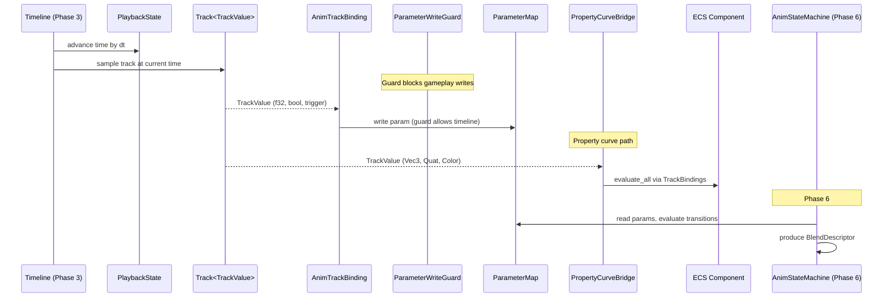
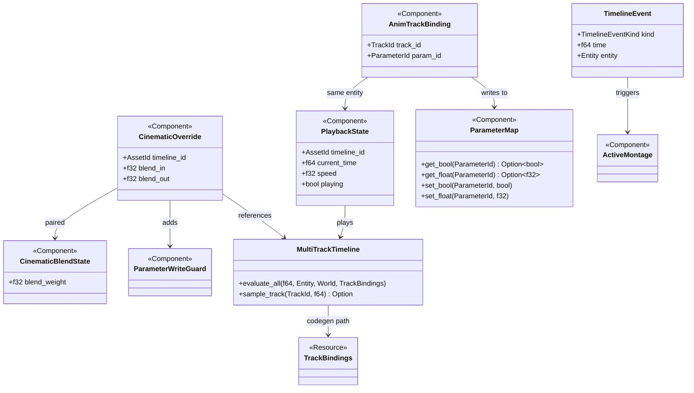

# Animation ↔ Timelines Integration Design

## Systems Involved

| System | Design | Domain |
|--------|--------|--------|
| Animation | [state-machine.md](../animation/state-machine.md) | Animation |
| Timelines | [timelines.md](../simulation/timelines.md) | Simulation |

## Integration Requirements

| ID | Requirement | Systems |
|----|-------------|---------|
| IR-1.5.1 | Timeline tracks drive anim params | TL, Anim |
| IR-1.5.2 | Cutscene overrides gameplay anim | TL, Anim |
| IR-1.5.3 | Blend between gameplay and cinematic | TL, Anim |
| IR-1.5.4 | Timeline events trigger montages | TL, Anim |
| IR-1.5.5 | Property curves animate any component | TL, Anim |

1. **IR-1.5.1** -- `Track<TrackValue>` channels in a `MultiTrackTimeline` write into the animation
   `ParameterMap` (float, bool, trigger params). The timeline evaluator samples the track at the
   current playback time and writes the interpolated value into the parameter.
2. **IR-1.5.2** -- During cutscenes, the timeline system adds a `CinematicOverride` component that
   forces the `AnimationStateMachine` to a specific state. A `ParameterWriteGuard` component is
   added alongside `CinematicOverride` to prevent gameplay systems from writing to `ParameterMap`
   while the override is active. The override takes effect immediately on the frame it is added --
   no one-frame delay.
3. **IR-1.5.3** -- On cutscene enter/exit, a blend weight ramps between gameplay-driven and
   timeline-driven animation over a configurable duration (F-13.5.4). The `AnimationLayer` system
   uses the weight to cross-fade.
4. **IR-1.5.4** -- `TimelineEvent` of kind `TrackValue::Bool` at specific times inserts
   `ActiveMontage` components for scripted one-shot animations within the cutscene.
5. **IR-1.5.5** -- Generic property tracks animate any numeric component field via codegen'd
   bindings using `MultiTrackTimeline::evaluate_all`. This bypasses `ParameterMap` (which only holds
   Bool, Float, Int, Trigger) and writes directly to ECS components via `TrackBindings`. Used for
   camera FOV, light intensity, material parameters during cinematics.

## Data Contracts

| Type | Defined in | Consumed by | Purpose |
|------|-----------|-------------|---------|
| `MultiTrackTimeline` | Timelines | Animation | Asset |
| `PlaybackState` | Timelines | Animation | Time cursor |
| `TrackValue` | Timelines | Animation | Param values |
| `TrackBindings` | Timelines | Animation | Codegen binds |
| `TimelineEvent` | Timelines | Animation | Triggers |
| `ParameterMap` | Animation | Timelines | Param write |
| `ParameterWriteGuard` | Integration | Both | Write lock |
| `ActiveMontage` | Animation | Timelines | One-shots |
| `CinematicOverride` | Integration | Both | Override cfg |
| `CinematicBlendState` | Integration | Both | Blend runtime |

### Entity Topology

`AnimTrackBinding` components live on the **same entity** as the `PlaybackState` and
`CinematicOverride`. The bridge system joins all three via a single query on the cutscene actor
entity. The actor entity also carries `ParameterMap` and `StateInstance`.

```rust
/// Immutable cutscene config. Added when a
/// cutscene begins. Removed when it ends.
#[derive(Component)]
pub struct CinematicOverride {
    pub timeline_id: AssetId,
    pub blend_in: f32,
    pub blend_out: f32,
}

/// Mutable per-frame blend state, separated from
/// the immutable CinematicOverride config per the
/// immutable-first data pattern.
#[derive(Component)]
pub struct CinematicBlendState {
    pub blend_weight: f32,
}

/// Prevents gameplay systems from writing to
/// ParameterMap while a CinematicOverride is
/// active. Added alongside CinematicOverride;
/// removed when the override ends. Gameplay
/// parameter-write systems must check for the
/// absence of this component before writing.
#[derive(Component)]
pub struct ParameterWriteGuard;

/// Binding from a timeline track to an animation
/// parameter. Authored in the cutscene editor.
/// Lives on the same entity as PlaybackState.
#[derive(
    Component,
    rkyv::Archive, rkyv::Serialize,
    rkyv::Deserialize,
)]
pub struct AnimTrackBinding {
    pub track_id: TrackId,
    pub param_id: ParameterId,
}

/// System that applies timeline track values to
/// animation parameters each frame. Only writes
/// to ParameterMap for Bool/Float/Int/Trigger
/// params. Property curves (Vec3, Quat, etc.)
/// use the separate property_curve_bridge_system.
pub fn timeline_animation_bridge_system(
    cutscene_actors: Query<(
        &PlaybackState,
        &AnimTrackBinding,
        &CinematicBlendState,
    )>,
    mut params: Query<
        &mut ParameterMap,
        Without<ParameterWriteGuard>,
    >,
    assets: Res<Assets<MultiTrackTimeline>>,
);

/// System that evaluates property curves (Vec3,
/// Quat, Color, etc.) via codegen'd bindings.
/// Bypasses ParameterMap entirely, writing
/// directly to ECS components through
/// MultiTrackTimeline::evaluate_all.
pub fn property_curve_bridge_system(
    cutscene_actors: Query<(
        Entity,
        &PlaybackState,
    )>,
    assets: Res<Assets<MultiTrackTimeline>>,
    bindings: Res<TrackBindings>,
    world: &mut World,
);
```

## Data Flow



## Timing and Ordering

| System | Phase | Timestep | Order |
|--------|-------|----------|-------|
| Timeline advance | 3-Simulation | Variable | First |
| Track-to-param bridge | 3-Simulation | Variable | After advance |
| Property curve bridge | 3-Simulation | Variable | After param bridge |
| Animation eval | 6-Animation | Variable | After all bridges |

Timeline evaluation runs in Phase 3 (Simulation), writing parameter values. Animation reads them in
Phase 6, three phases later. This ensures all timeline-driven values are settled before animation
evaluates transitions and produces blend descriptors.

Cutscene blend weights are updated in Phase 3 and consumed by the animation layer system in Phase 6.

### Fallback Paths

| Scenario | Fallback | Behavior |
|----------|----------|----------|
| Track-param type mismatch | Use param default | Log warn |
| Timeline asset not loaded | Skip evaluation | Log error |
| Blend weight out of range | Clamp to 0.0..1.0 | Silent |
| Missing ParameterMap | Skip param bridge | Log error |
| Missing StateInstance | Skip override | Log error |
| Property curve target missing | Skip that track | Log warn |
| Montage asset not loaded | Skip montage insert | Log warn |

## Failure Modes

| Failure | Impact | Recovery |
|---------|--------|----------|
| Track-param type mismatch | Value ignored | Log warn, use default |
| Timeline asset missing | No playback | Skip, log error |
| Blend weight out of range | Visual pop | Clamp to 0.0..1.0 |
| Montage trigger missed | Anim not played | Log warn, continue |
| Override on entity without PM | No param writes | Log error, skip bridge |
| Override without StateInstance | No state force | Log error, skip override |
| Property curve target gone | Track skipped | Log warn, continue |
| Montage asset not loaded | No montage insert | Log warn, continue |

## Platform Considerations

None -- identical across all platforms. Timeline evaluation and animation parameter writing are pure
CPU ECS operations with no platform dependencies.

## Test Plan

See companion [animation-timelines-test-cases.md](animation-timelines-test-cases.md).

## Class Diagram



## Review Feedback

1. [APPLIED] Added `#[derive(Component)]` to `AnimTrackBinding`.
2. [APPLIED] Changed `AssetHandle<MultiTrackTimeline>` to `AssetId` in `CinematicOverride`, matching
   the timelines design pattern.
3. [APPLIED] Added separate `property_curve_bridge_system` that uses
   `MultiTrackTimeline::evaluate_all` with `TrackBindings` for Vec3/Quat/Color. The param bridge
   handles only Bool/Float/Int/Trigger via `ParameterMap`. IR-1.5.5 updated to reflect this.
4. [APPLIED] Added Entity Topology subsection documenting that `AnimTrackBinding`, `PlaybackState`,
   `CinematicOverride`, and `ParameterMap` all live on the same actor entity. Bridge system uses a
   single joined query.
5. [APPLIED] Added TC-IR-1.5.4.2 (montage at timeline end), TC-IR-1.5.4.3 (multiple montages on
   different tracks), TC-IR-1.5.4.4 (montage trigger during mid-blend). See companion test cases
   file.
6. [APPLIED] Added `ParameterWriteGuard` marker component. Added alongside `CinematicOverride` to
   block gameplay parameter writes. Sequence diagram updated to show guard. Bridge system query uses
   `Without<ParameterWriteGuard>` filter. Override takes effect immediately -- no one-frame delay.
7. [APPLIED] Added failure mode entries for `CinematicOverride` on entity missing `ParameterMap` or
   `StateInstance`. Both skip with log error.
8. [DISMISSED] 2D/2.5D animation is out of scope for this integration design. Timeline tracks are
   type-generic (`Track<T>`) and work identically for any `TrackValue` variant. No 2D-specific
   handling is needed at the integration layer.
9. [APPLIED] Added `rkyv::Archive`, `rkyv::Serialize`, `rkyv::Deserialize` derives to
   `AnimTrackBinding`.
10. [APPLIED] Split `CinematicOverride` into immutable config (`CinematicOverride` with
    `timeline_id`, `blend_in`, `blend_out`) and mutable runtime state (`CinematicBlendState` with
    `blend_weight`).
11. [APPLIED] Benchmark targets (< 0.5 ms for 32-track, < 1 ms for 64-track) confirmed reasonable.
    Added benchmarks TC-IR-1.5.3.B1 (blend weight update) and TC-IR-1.5.4.B1 (montage trigger scan).
    See companion file.
12. [APPLIED] Added `classDiagram` covering all types: `CinematicOverride`, `CinematicBlendState`,
    `ParameterWriteGuard`, `AnimTrackBinding`, `MultiTrackTimeline`, `PlaybackState`,
    `ParameterMap`, `TrackBindings`, `ActiveMontage`, `TimelineEvent`, and their relationships.
