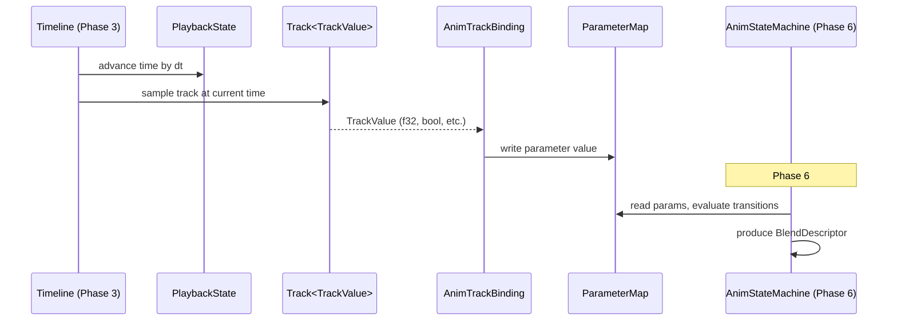

# Animation ↔ Timelines Integration Design

## Systems Involved

| System | Design | Domain |
|--------|--------|--------|
| Animation | [state-machine.md](../animation/state-machine.md) | Animation |
| Timelines | [timelines.md](../simulation/timelines.md) | Simulation |

## Integration Requirements

| ID | Requirement | Systems |
|----|-------------|---------|
| IR-1.5.1 | Timeline tracks drive anim params | TL, Anim |
| IR-1.5.2 | Cutscene overrides gameplay anim | TL, Anim |
| IR-1.5.3 | Blend between gameplay and cinematic | TL, Anim |
| IR-1.5.4 | Timeline events trigger montages | TL, Anim |
| IR-1.5.5 | Property curves animate any component | TL, Anim |

1. **IR-1.5.1** -- `Track<TrackValue>` channels in a `MultiTrackTimeline` write into the animation
   `ParameterMap` (float, bool, trigger params). The timeline evaluator samples the track at the
   current playback time and writes the interpolated value into the parameter.
2. **IR-1.5.2** -- During cutscenes, the timeline system adds a `CinematicOverride` component that
   forces the `AnimationStateMachine` to a specific state, ignoring gameplay parameter writes.
3. **IR-1.5.3** -- On cutscene enter/exit, a blend weight ramps between gameplay-driven and
   timeline-driven animation over a configurable duration (F-13.5.4). The `AnimationLayer` system
   uses the weight to cross-fade.
4. **IR-1.5.4** -- `TimelineEvent` of kind `TrackValue::Bool` at specific times inserts
   `ActiveMontage` components for scripted one-shot animations within the cutscene.
5. **IR-1.5.5** -- Generic property tracks animate any numeric component field via
   `TrackValue::F32`, `Vec3`, or `Quat`. Used for camera FOV, light intensity, material parameters
   during cinematics.

## Data Contracts

| Type | Defined in | Consumed by | Purpose |
|------|-----------|-------------|---------|
| `MultiTrackTimeline` | Timelines | Animation | Asset |
| `PlaybackState` | Timelines | Animation | Time cursor |
| `TrackValue` | Timelines | Animation | Param values |
| `TimelineEvent` | Timelines | Animation | Triggers |
| `ParameterMap` | Animation | Timelines | Param write |
| `ActiveMontage` | Animation | Timelines | One-shots |

```rust
/// Marks an entity as under cutscene control.
/// Animation ignores gameplay param writes while
/// this component is present.
#[derive(Component)]
pub struct CinematicOverride {
    pub timeline: AssetHandle<MultiTrackTimeline>,
    pub blend_in: f32,
    pub blend_out: f32,
    pub blend_weight: f32,
}

/// Binding from a timeline track to an animation
/// parameter. Authored in the cutscene editor.
pub struct AnimTrackBinding {
    pub track_id: TrackId,
    pub param_id: ParameterId,
}

/// System that applies timeline track values to
/// animation parameters each frame.
pub fn timeline_animation_bridge_system(
    timelines: Query<(
        &PlaybackState,
        &AssetHandle<MultiTrackTimeline>,
    )>,
    bindings: Query<&AnimTrackBinding>,
    mut params: Query<&mut ParameterMap>,
    assets: Res<Assets<MultiTrackTimeline>>,
);
```

## Data Flow



## Timing and Ordering

| System | Phase | Timestep | Order |
|--------|-------|----------|-------|
| Timeline advance | 3-Simulation | Variable | First |
| Track-to-param bridge | 3-Simulation | Variable | After advance |
| Animation eval | 6-Animation | Variable | After bridge |

Timeline evaluation runs in Phase 3 (Simulation), writing parameter values. Animation reads them in
Phase 6, three phases later. This ensures all timeline-driven values are settled before animation
evaluates transitions and produces blend descriptors.

Cutscene blend weights are updated in Phase 3 and consumed by the animation layer system in Phase 6.

## Failure Modes

| Failure | Impact | Recovery |
|---------|--------|----------|
| Track-param type mismatch | Value ignored | Log warn, use default |
| Timeline asset missing | No playback | Skip, log error |
| Blend weight out of range | Visual pop | Clamp to 0.0..1.0 |
| Montage trigger missed | Anim not played | Log warn, continue |

## Platform Considerations

None -- identical across all platforms. Timeline evaluation and animation parameter writing are pure
CPU ECS operations with no platform dependencies.

## Test Plan

See companion [animation-timelines-test-cases.md](animation-timelines-test-cases.md).
