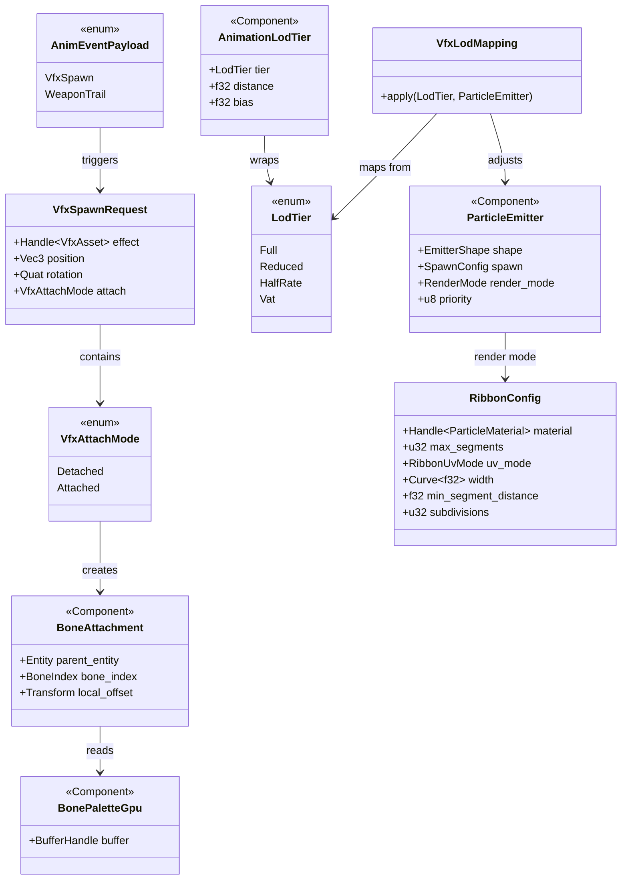
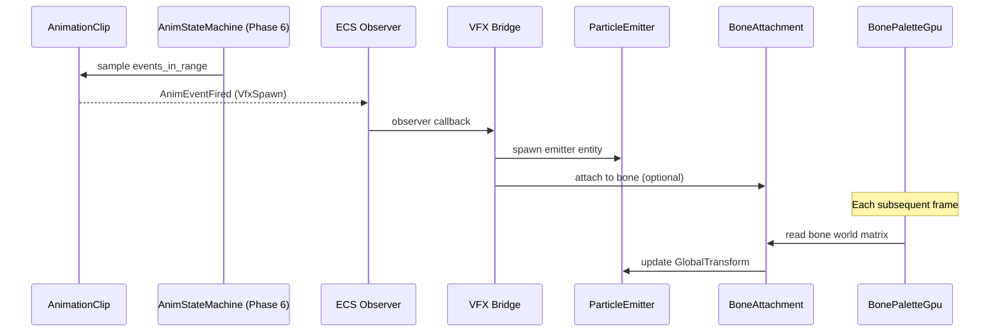

# Animation ↔ VFX Integration Design

## Systems Involved

| System | Design | Domain |
|--------|--------|--------|
| Animation | [skeletal.md](../animation/skeletal.md) | Animation |
| VFX | [effects.md](../vfx/effects.md) | VFX |

## Overview

Animation events trigger VFX spawning and attachment. Data flows one direction: animation produces
events and bone transforms, VFX consumes them.

| Aspect | Detail |
|--------|--------|
| Direction | Animation -> VFX |
| Mechanism | ECS observer events |
| Data exchanged | Bone poses, spawn requests |
| Frequency | Per-event and per-frame |

## Integration Requirements

| ID | Requirement | Systems |
|----|-------------|---------|
| IR-1.6.1 | Anim events spawn particle effects | Anim, VFX |
| IR-1.6.2 | Trail effects follow bone transforms | Anim, VFX |
| IR-1.6.3 | Weapon trail on/off from hit windows | Anim, VFX |
| IR-1.6.4 | VFX LOD matches animation LOD | Anim, VFX |
| IR-1.6.5 | Bone attachment for persistent effects | Anim, VFX |

1. **IR-1.6.1** -- `AnimEventPayload::VfxSpawn` markers fire an ECS observer event. The VFX bridge
   spawns a `ParticleEmitter` entity at the specified bone's world position with the referenced
   `Handle<VfxAsset>` effect.
2. **IR-1.6.2** -- Trail emitters (ribbon particles) attached to bones read the bone's world-space
   transform from `BonePaletteGpu` each frame to emit ribbon control points at the bone's
   trajectory.
3. **IR-1.6.3** -- `AnimEventPayload::WeaponTrail` with `active: true/false` toggles the
   `ParticleEmitter` spawn rate on weapon-bone attached trail entities. Active during hit windows
   only.
4. **IR-1.6.4** -- `AnimationLodTier` is read by the VFX budget system per the LOD mapping table
   below.
5. **IR-1.6.5** -- Persistent effects (fire aura, frost hands) are child entities attached to a bone
   via `BoneAttachment`. Their `GlobalTransform` is updated from the bone's world-space matrix each
   frame after skinning.

### Animation LOD to VFX Mapping

| `LodTier` | Spawn rate | Simulation | Notes |
|-----------|-----------|------------|-------|
| Full | 100% | Active | All modules run |
| Reduced | 75% | Active | Full sim |
| HalfRate | 50% | Active | Skip frames |
| Vat | 0% | Inactive | Culled entirely |

## Data Contracts

| Type | Defined in | Consumed by | Purpose |
|------|-----------|-------------|---------|
| `AnimEventPayload` | Animation | VFX | Spawn trigger |
| `BonePaletteGpu` | Animation | VFX | Bone poses |
| `AnimationLodTier` | Animation | VFX | LOD matching |
| `BoneAttachment` | Integration | VFX | Bone child |
| `VfxSpawnRequest` | Integration | VFX bridge | Spawn params |
| `ParticleEmitter` | VFX | Animation (spawn) | Emitter comp |
| `RibbonConfig` | VFX | Animation bridge | Trail setup |
| `VfxLodMapping` | Integration | VFX budget | LOD mapping |

```rust
/// Relevant variants from AnimEventPayload
/// (defined in animation/skeletal.md). Shown
/// here for contract clarity.
pub enum AnimEventPayload {
    /// VFX spawn point at a bone position.
    VfxSpawn { effect: Handle<VfxAsset> },
    /// Weapon trail start/end toggle.
    WeaponTrail { active: bool },
    // ... other variants omitted
}

/// Attaches a child entity to a specific bone.
/// Updated each frame from the parent's
/// BonePaletteGpu world-space bone matrix.
/// Fallback: if bone_index is invalid, attaches
/// to root bone (index 0) and logs a warning.
#[derive(Component)]
pub struct BoneAttachment {
    pub parent_entity: Entity,
    pub bone_index: BoneIndex,
    pub local_offset: Transform,
}

/// How a spawned VFX relates to its source bone.
pub enum VfxAttachMode {
    /// Spawn at bone position, no attachment.
    /// Emitter stays at spawn position.
    Detached,
    /// Spawn and follow bone each frame via
    /// BoneAttachment. Used for persistent FX.
    Attached {
        bone_entity: Entity,
        bone_index: BoneIndex,
    },
}

/// Emitted when an animation VFX event fires.
pub struct VfxSpawnRequest {
    pub effect: Handle<VfxAsset>,
    pub position: Vec3,
    pub rotation: Quat,
    pub attach: VfxAttachMode,
}

/// Ribbon trail configuration (defined in
/// vfx/particles.md). Shown here for contract
/// reference. Ribbon emitters use this to
/// configure trail geometry per bone attachment.
#[derive(Clone, Debug)]
pub struct RibbonConfig {
    /// Material for the ribbon strip.
    pub material: Handle<ParticleMaterial>,
    /// Maximum ribbon segment count.
    pub max_segments: u32,
    /// UV mode along ribbon length.
    pub uv_mode: RibbonUvMode,
    /// Width curve over ribbon length.
    pub width: Curve<f32>,
    /// Minimum distance between ribbon points
    /// before a new segment is added.
    pub min_segment_distance: f32,
    /// Catmull-Rom subdivision count.
    pub subdivisions: u32,
}

/// Mapping from AnimationLodTier to VFX
/// emitter behavior. Applied by the VFX budget
/// system each frame.
pub struct VfxLodMapping;

impl VfxLodMapping {
    /// Returns the spawn rate multiplier and
    /// whether simulation is active for the
    /// given animation LOD tier.
    pub fn apply(
        tier: LodTier,
        emitter: &mut ParticleEmitter,
    ) {
        match tier {
            LodTier::Full => {
                // 100% spawn rate, full sim
                emitter.spawn.rate_scale = 1.0;
                emitter.lod.active = true;
            }
            LodTier::Reduced => {
                // 75% spawn rate, full sim
                emitter.spawn.rate_scale = 0.75;
                emitter.lod.active = true;
            }
            LodTier::HalfRate => {
                // 50% spawn rate, skip frames
                emitter.spawn.rate_scale = 0.5;
                emitter.lod.active = true;
            }
            LodTier::Vat => {
                // Culled entirely. No particles.
                emitter.spawn.rate_scale = 0.0;
                emitter.lod.active = false;
            }
        }
    }
}

/// Observer that bridges animation VfxSpawn
/// events to VFX emitter spawning.
/// Fallback: if VfxAsset handle is invalid,
/// logs a warning and skips spawning.
pub fn on_vfx_anim_event(
    event: &AnimEventFired,
    mut commands: Commands,
    assets: Res<AssetStore<VfxAsset>>,
) {
    if let AnimEventPayload::VfxSpawn { effect }
        = &event.marker.payload
    {
        if !assets.contains(effect) {
            log::warn!(
                "VfxAsset missing: {:?}",
                effect,
            );
            return;
        }
        let mut emitter = commands.spawn((
            ParticleEmitter::from_asset(effect),
            Transform::from_translation(
                event.bone_world_pos,
            ),
        ));
        if let VfxAttachMode::Attached {
            bone_entity: _,
            bone_index,
        } = event.attach
        {
            emitter.insert(BoneAttachment {
                parent_entity: event.entity,
                bone_index,
                local_offset: Transform::IDENTITY,
            });
        }
    }
}

/// Observer that bridges animation WeaponTrail
/// events to emitter spawn rate toggling.
/// Fallback: if no ParticleEmitter is found on
/// the trail entity, logs a warning and skips.
pub fn on_weapon_trail_event(
    event: &AnimEventFired,
    mut emitters: Query<&mut ParticleEmitter>,
) {
    if let AnimEventPayload::WeaponTrail {
        active,
    } = &event.marker.payload
    {
        if let Ok(mut emitter) =
            emitters.get_mut(event.trail_entity)
        {
            emitter.spawn.rate_scale =
                if *active { 1.0 } else { 0.0 };
        } else {
            log::warn!(
                "No emitter on trail entity {:?}",
                event.trail_entity,
            );
        }
    }
}
```

## Type Relationships



## Data Flow



## Timing and Ordering

| System | Phase | Timestep | Constraint |
|--------|-------|----------|------------|
| Animation eval | 6 | Variable | -- |
| Event dispatch | 6 | Variable | `.after(anim_eval)` |
| VFX bridge | 6 | Variable | `.after(event_dispatch)` |
| Bone attach sync | 6 | Variable | `.after(vfx_bridge)` |
| Particle sim | 8 | Variable | GPU compute dispatch |

VFX spawn events fire in Phase 6 immediately after animation evaluation. `BoneAttachment` transforms
are synced at the end of Phase 6 after all bone palettes are finalized. Particle simulation runs as
GPU compute dispatched at frame end.

## Failure Modes

| Failure | Impact | Recovery |
|---------|--------|----------|
| VfxAsset missing | No particles spawn | Log warn, skip spawn |
| Bone index invalid | Wrong position | Fallback to root bone |
| Budget exceeded | Emitter culled | Priority-based cull |
| Trail without bone | Static ribbon | Use entity transform |
| Parent despawned | Orphaned child FX | Despawn child entity |
| Trail entity missing | No toggle | Log warn, skip |

Fallback details:

1. **VfxAsset missing** -- `on_vfx_anim_event` checks `assets.contains(effect)` before spawning. On
   failure, logs and returns early.
2. **Bone index invalid** -- `BoneAttachment` sync clamps to root bone (index 0) if the bone index
   exceeds the skeleton bone count.
3. **Budget exceeded** -- `ParticleBudgetManager` culls lowest-priority emitters first. Culled
   emitters have `rate_scale` set to 0.
4. **Trail without bone** -- ribbon emitter falls back to the entity's `GlobalTransform` instead of
   a bone matrix.
5. **Parent despawned** -- `bone_attach_sync` detects missing parent entity and despawns the child
   via `commands.entity(child).despawn()`.
6. **Trail entity missing** -- `on_weapon_trail_event` logs a warning if the query for the trail
   entity's `ParticleEmitter` returns `Err`.

## Platform Considerations

None -- identical across all platforms. Animation events and VFX spawning use platform-agnostic ECS
primitives. Particle simulation runs on GPU compute shaders compiled per-backend (HLSL to
DXIL/SPIR-V/ Metal IR).

## Test Plan

See companion [animation-vfx-test-cases.md](animation-vfx-test-cases.md).

## Review Feedback

1. [CONFIDENT] `VfxSpawnRequest` uses `Handle<VfxAsset>` which is a generational-index handle (not
   `Arc`), so this is constraint-safe. However, the type is defined inline but not listed in the
   Data Contracts table -- add it alongside `BoneAttachment`.
2. [CONFIDENT] The pseudocode uses `Commands` (deferred command buffer), which is correct for
   spawning from an observer callback. No async/await violations detected.
3. [CONFIDENT] No `classDiagram` is present. The design CLAUDE.md requires "a Mermaid classDiagram
   covering ALL types: structs, enums, traits, type aliases, and their relationships." Add one
   showing `BoneAttachment`, `VfxSpawnRequest`, `AnimEventPayload`, `RibbonConfig`,
   `ParticleEmitter`, `AnimationLodTier`, and `BonePaletteGpu`.
4. [CONFIDENT] No mention of 2D/2.5D VFX attachment. Constraints require every subsystem to work in
   2D, 2.5D, and 3D modes. Bone attachment relies on 3D `Transform` and `Vec3` only. Address how 2D
   sprite-frame events or `Transform2D` entities interact with VFX spawning.
5. [CONFIDENT] The Data Contracts pseudocode defines `VfxSpawnRequest` but IR-1.6.1 references
   `AnimEventPayload::VfxSpawn`. No pseudocode is shown for the `AnimEventPayload` enum or its
   `VfxSpawn` variant struct. Show the variant definition so the contract is unambiguous.
6. [CONFIDENT] IR-1.6.3 describes `WeaponTrail` toggling `ParticleEmitter` spawn rate, but no
   pseudocode or data contract is shown for `AnimEventPayload::WeaponTrail` or the spawn-rate field
   on `ParticleEmitter`. Add both.
7. [CONFIDENT] `RibbonConfig` is listed in the Data Contracts table but has no pseudocode
   definition. Every type in the contracts table should have a corresponding Rust struct definition.
8. [UNCERTAIN] IR-1.6.4 says VFX LOD matches animation LOD, and references `AnimationLodTier` which
   wraps a `LodTier` enum (Full, HalfRate, VAT). The design says emitters are "reduced or culled"
   but does not specify the mapping (e.g., HalfRate halves spawn rate vs. skipping frames). A
   concrete mapping table or pseudocode would make this testable.
9. [CONFIDENT] The Timing and Ordering table places both "Event dispatch" and "VFX bridge" in Phase
   6-Animation. The sequence diagram correctly shows this ordering, but the table does not show
   explicit system ordering constraints (e.g., `.after()` relationships). Peer designs like
   animation-physics do the same, so this is consistent, but explicit ordering labels would be
   stronger.
10. [CONFIDENT] Test case companion coverage is complete: every IR (1.6.1 through 1.6.5) has at
    least two test cases, and benchmarks cover IR-1.6.1, IR-1.6.2, and IR-1.6.5. No IR is missing
    test coverage.
11. [CONFIDENT] No benchmark exists for IR-1.6.3 (weapon trail toggling) or IR-1.6.4 (LOD-based VFX
    culling). These are hot-path operations that should have performance targets, especially LOD
    culling which affects frame budget.
12. [CONFIDENT] The Failure Modes table is reasonable but does not cover the case where
    `BoneAttachment` references a despawned parent entity. The test cases file does cover this
    (TC-IR-1.6.5.2), so the test plan is ahead of the design -- add a failure mode row for parent
    despawn.
13. [CONFIDENT] The Platform Considerations section states particle simulation runs on "GPU compute
    shaders compiled per-backend (HLSL to DXIL/SPIR-V/Metal IR)." Per constraints, HLSL compiles to
    DXIL via `dxc` CLI, and then DXIL to Metal IR via `metal-shaderconverter` CLI. SPIR-V is
    produced by `dxc` for Vulkan. This is accurate.
14. [UNCERTAIN] `VfxSpawnRequest.bone_entity` is `Option<Entity>` and `attach_to_bone` is a separate
    `bool`. This is redundant -- if `bone_entity` is `Some`, attachment is implied. Consider
    collapsing into `Option<BoneAttachmentRequest>` to eliminate the invalid state where
    `bone_entity` is `None` but `attach_to_bone` is `true`.
15. [CONFIDENT] No `HashMap` usage detected on hot paths. All data flows use ECS queries and
    component access, which is constraint-compliant.
16. [CONFIDENT] No `Arc`, `Rc`, `Cell`, or `RefCell` detected. All ownership is via ECS entities and
    components with generational handles.
17. [CONFIDENT] The document is missing the "Overview" section that the PROMPT template specifies
    (Overview, Data exchanged, Direction, Mechanism, etc.). Peer documents also omit it, so this may
    be a project-wide gap, but it is technically a deviation from the template.
