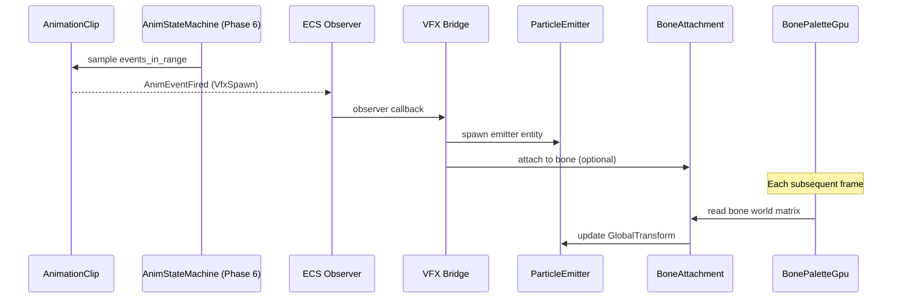

# Animation ↔ VFX Integration Design

## Systems Involved

| System | Design | Domain |
|--------|--------|--------|
| Animation | [skeletal.md](../animation/skeletal.md) | Animation |
| VFX | [effects.md](../vfx/effects.md) | VFX |

## Integration Requirements

| ID | Requirement | Systems |
|----|-------------|---------|
| IR-1.6.1 | Anim events spawn particle effects | Anim, VFX |
| IR-1.6.2 | Trail effects follow bone transforms | Anim, VFX |
| IR-1.6.3 | Weapon trail on/off from hit windows | Anim, VFX |
| IR-1.6.4 | VFX LOD matches animation LOD | Anim, VFX |
| IR-1.6.5 | Bone attachment for persistent effects | Anim, VFX |

1. **IR-1.6.1** -- `AnimEventPayload::VfxSpawn` markers fire an ECS observer event. The VFX bridge
   spawns a `ParticleEmitter` entity at the specified bone's world position with the referenced
   `Handle<VfxAsset>` effect.
2. **IR-1.6.2** -- Trail emitters (ribbon particles) attached to bones read the bone's world-space
   transform from `BonePaletteGpu` each frame to emit ribbon control points at the bone's
   trajectory.
3. **IR-1.6.3** -- `AnimEventPayload::WeaponTrail` with `active: true/false` toggles the
   `ParticleEmitter` spawn rate on weapon-bone attached trail entities. Active during hit windows
   only.
4. **IR-1.6.4** -- `AnimationLodTier` is read by the VFX budget system. Entities at LOD HalfRate or
   VAT have their attached particle emitters reduced or culled to match the animation quality level.
5. **IR-1.6.5** -- Persistent effects (fire aura, frost hands) are child entities attached to a bone
   via `BoneAttachment`. Their `GlobalTransform` is updated from the bone's world-space matrix each
   frame after skinning.

## Data Contracts

| Type | Defined in | Consumed by | Purpose |
|------|-----------|-------------|---------|
| `AnimEventPayload` | Animation | VFX | Spawn trigger |
| `BonePaletteGpu` | Animation | VFX | Bone poses |
| `AnimationLodTier` | Animation | VFX | LOD matching |
| `ParticleEmitter` | VFX | Animation (spawn) | Emitter comp |
| `RibbonConfig` | VFX | Animation bridge | Trail setup |

```rust
/// Attaches a child entity to a specific bone.
/// Updated each frame from the parent's
/// BonePaletteGpu world-space bone matrix.
#[derive(Component)]
pub struct BoneAttachment {
    pub parent_entity: Entity,
    pub bone_index: BoneIndex,
    pub local_offset: Transform,
}

/// Emitted when an animation VFX event fires.
pub struct VfxSpawnRequest {
    pub effect: Handle<VfxAsset>,
    pub position: Vec3,
    pub rotation: Quat,
    pub bone_entity: Option<Entity>,
    pub attach_to_bone: bool,
}

/// Observer that bridges animation events to
/// VFX spawning.
pub fn on_vfx_anim_event(
    event: &AnimEventFired,
    mut commands: Commands,
) {
    if let AnimEventPayload::VfxSpawn { effect }
        = &event.marker.payload
    {
        let mut emitter = commands.spawn((
            ParticleEmitter::from_asset(effect),
            Transform::from_translation(
                event.bone_world_pos,
            ),
        ));
        if event.marker.attach_to_bone {
            emitter.insert(BoneAttachment {
                parent_entity: event.entity,
                bone_index: event.marker.bone,
                local_offset: Transform::IDENTITY,
            });
        }
    }
}
```

## Data Flow



## Timing and Ordering

| System | Phase | Timestep | Order |
|--------|-------|----------|-------|
| Animation eval | 6-Animation | Variable | First |
| Event dispatch | 6-Animation | Variable | After eval |
| VFX bridge | 6-Animation | Variable | After events |
| Bone attach sync | 6-Animation | Variable | After bridge |
| Particle sim | 8-FrameEnd | Variable | GPU compute |

VFX spawn events fire in Phase 6 immediately after animation evaluation. `BoneAttachment` transforms
are synced at the end of Phase 6 after all bone palettes are finalized. Particle simulation runs as
GPU compute dispatched at frame end.

## Failure Modes

| Failure | Impact | Recovery |
|---------|--------|----------|
| VfxAsset missing | No particles spawn | Log warn, skip |
| Bone index invalid | Wrong attachment | Fallback to root |
| Budget exceeded | Emitter culled | Priority-based cull |
| Trail without bone | Static ribbon | Use entity transform |

## Platform Considerations

None -- identical across all platforms. Animation events and VFX spawning use platform-agnostic ECS
primitives. Particle simulation runs on GPU compute shaders compiled per-backend (HLSL to
DXIL/SPIR-V/ Metal IR).

## Test Plan

See companion [animation-vfx-test-cases.md](animation-vfx-test-cases.md).
