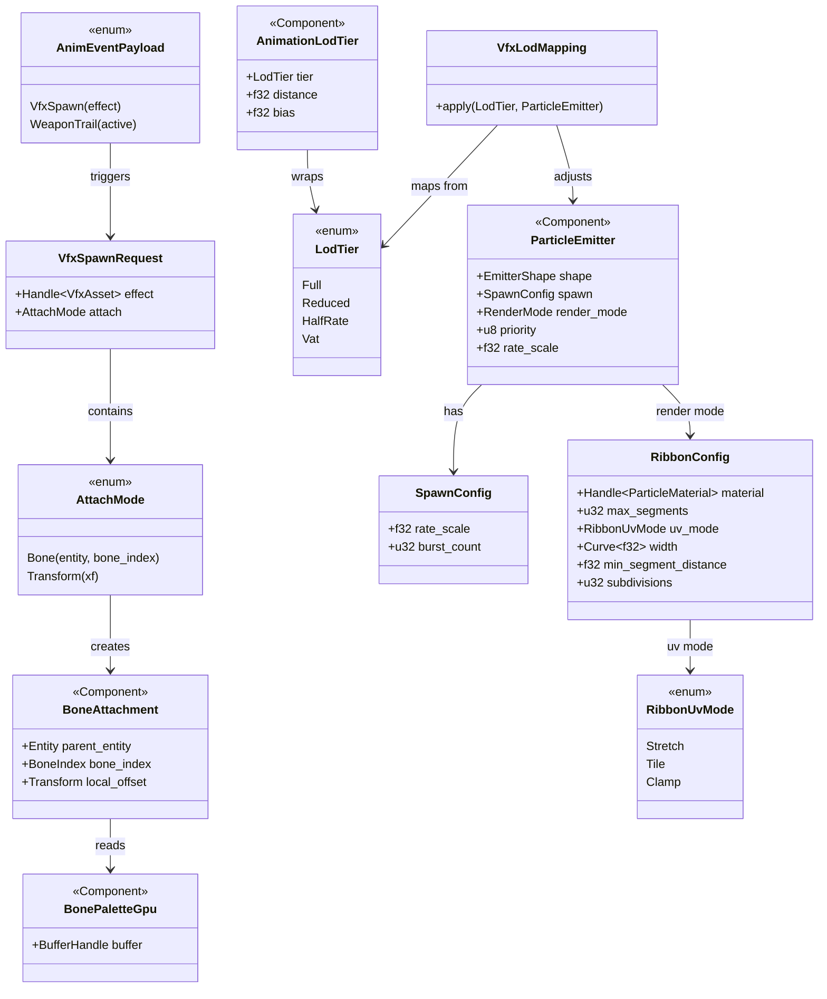
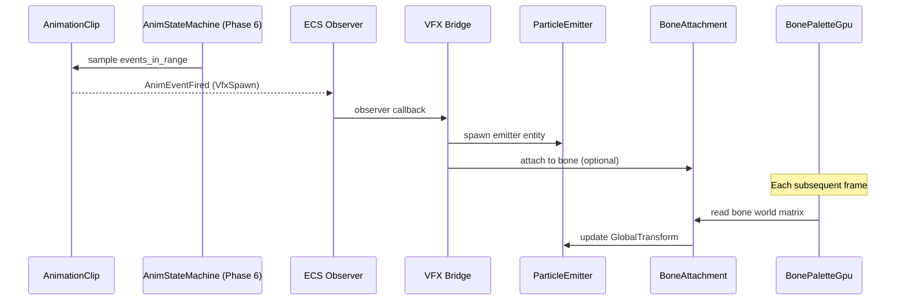

# Animation ↔ VFX Integration Design

This design follows the cross-cutting conventions in [shared-conventions.md](shared-conventions.md);
only deviations are called out below.

## Systems Involved

| System | Design | Domain |
|--------|--------|--------|
| Animation | [skeletal.md](../animation/skeletal.md) | Animation |
| VFX | [effects.md](../vfx/effects.md) | VFX |

## Overview

Animation events trigger VFX spawning and attachment. Data flows one direction: animation produces
events and bone transforms, VFX consumes them. Events fire within the same frame they are sampled --
no one-frame delay -- so VFX spawns are visible on the animation frame that triggered them.

| Aspect | Detail |
|--------|--------|
| Direction | Animation -> VFX |
| Mechanism | ECS observer events (synchronous; no one-frame delay) |
| Data exchanged | Bone poses, spawn requests |
| Frequency | Per-event and per-frame |

2D and 2.5D modes are intentionally out of scope for this integration: both use sprite-sheet VFX
decoupled from skeletal bones, covered separately by the 2D sprite/VFX integration.

## Integration Requirements

| ID | Requirement | Systems |
|----|-------------|---------|
| IR-1.6.1 | Anim events spawn particle effects | Anim, VFX |
| IR-1.6.2 | Trail effects follow bone transforms | Anim, VFX |
| IR-1.6.3 | Weapon trail on/off from hit windows | Anim, VFX |
| IR-1.6.4 | VFX LOD matches animation LOD | Anim, VFX |
| IR-1.6.5 | Bone attachment for persistent effects | Anim, VFX |

1. **IR-1.6.1** -- `AnimEventPayload::VfxSpawn` markers fire an ECS observer event. The VFX bridge
   spawns a `ParticleEmitter` entity at the specified bone's world position with the referenced
   `Handle<VfxAsset>` effect.
2. **IR-1.6.2** -- Trail emitters (ribbon particles) attached to bones read the bone's world-space
   transform from `BonePaletteGpu` each frame to emit ribbon control points at the bone's
   trajectory.
3. **IR-1.6.3** -- `AnimEventPayload::WeaponTrail` with `active: true/false` toggles the
   `ParticleEmitter` spawn rate on weapon-bone attached trail entities. Active during hit windows
   only.
4. **IR-1.6.4** -- `AnimationLodTier` is read by the VFX budget system per the LOD mapping table
   below.
5. **IR-1.6.5** -- Persistent effects (fire aura, frost hands) are child entities attached to a bone
   via `BoneAttachment`. Their `GlobalTransform` is updated from the bone's world-space matrix each
   frame after skinning.

### Animation LOD to VFX Mapping

| `LodTier` | Spawn rate | Simulation | Notes |
|-----------|-----------|------------|-------|
| Full | 100% | Active | All modules run |
| Reduced | 75% | Active | Full sim |
| HalfRate | 50% | Active | Skip frames |
| Vat | 0% | Inactive | Culled entirely |

## Data Contracts

| Type | Defined in | Consumed by | Purpose |
|------|-----------|-------------|---------|
| `AnimEventPayload` | Animation | VFX | Spawn trigger |
| `AnimEventPayload::VfxSpawn` | Animation | VFX | Spawn variant |
| `AnimEventPayload::WeaponTrail` | Animation | VFX | Trail toggle variant |
| `BonePaletteGpu` | Animation | VFX | Bone poses |
| `AnimationLodTier` | Animation | VFX | LOD matching |
| `BoneAttachment` | Integration | VFX | Bone child |
| `AttachMode` | Integration | VFX bridge | Spawn attach sum type |
| `VfxSpawnRequest` | Integration | VFX bridge | Spawn params |
| `ParticleEmitter` | VFX | Animation (spawn) | Emitter comp |
| `RibbonConfig` | VFX | Animation bridge | Trail setup |
| `VfxLodMapping` | Integration | VFX budget | LOD mapping |

```rust
/// Relevant variants from AnimEventPayload
/// (defined in animation/skeletal.md). Shown
/// here for contract clarity.
pub enum AnimEventPayload {
    /// VFX spawn point at a bone position.
    VfxSpawn { effect: Handle<VfxAsset> },
    /// Weapon trail start/end toggle.
    WeaponTrail { active: bool },
    // ... other variants omitted
}

/// Attaches a child entity to a specific bone.
/// Updated each frame from the parent's
/// BonePaletteGpu world-space bone matrix.
/// Fallback: if bone_index is invalid, attaches
/// to root bone (index 0) and logs a warning.
#[derive(Component)]
pub struct BoneAttachment {
    pub parent_entity: Entity,
    pub bone_index: BoneIndex,
    pub local_offset: Transform,
}

/// How a spawned VFX relates to its source bone.
/// Sum type eliminates the previously-invalid state
/// where a bone entity was set but attachment was
/// disabled (or vice versa).
pub enum AttachMode {
    /// Follow the given skeleton entity's bone each
    /// frame via BoneAttachment. Used for persistent
    /// FX on moving bones.
    Bone(Entity, BoneIndex),
    /// Spawn at a world-space transform snapshot; no
    /// subsequent follow. Used for one-shot impacts.
    Transform(Transform),
}

/// Emitted when an animation VFX event fires.
/// Consumed by the VFX bridge observer.
pub struct VfxSpawnRequest {
    pub effect: Handle<VfxAsset>,
    pub attach: AttachMode,
}

/// Ribbon trail configuration (defined in
/// vfx/particles.md). Shown here for contract
/// reference. Ribbon emitters use this to
/// configure trail geometry per bone attachment.
/// Algorithm: centripetal Catmull-Rom splines
/// (Yuksel et al. 2011, "Parameterization and
/// Applications of Catmull-Rom Curves") produce
/// the ribbon centerline from sampled bone
/// positions; segment width comes from `width`
/// evaluated along normalized arc length.
#[derive(Clone, Debug)]
pub struct RibbonConfig {
    /// Material for the ribbon strip.
    pub material: Handle<ParticleMaterial>,
    /// Maximum ribbon segment count.
    pub max_segments: u32,
    /// UV mode along ribbon length.
    pub uv_mode: RibbonUvMode,
    /// Width curve over ribbon length.
    pub width: Curve<f32>,
    /// Minimum distance between ribbon points
    /// before a new segment is added.
    pub min_segment_distance: f32,
    /// Catmull-Rom subdivision count.
    pub subdivisions: u32,
}

/// Mapping from AnimationLodTier to VFX
/// emitter behavior. Applied by the VFX budget
/// system each frame.
pub struct VfxLodMapping;

impl VfxLodMapping {
    /// Returns the spawn rate multiplier and
    /// whether simulation is active for the
    /// given animation LOD tier.
    pub fn apply(
        tier: LodTier,
        emitter: &mut ParticleEmitter,
    ) {
        match tier {
            LodTier::Full => {
                // 100% spawn rate, full sim
                emitter.spawn.rate_scale = 1.0;
                emitter.lod.active = true;
            }
            LodTier::Reduced => {
                // 75% spawn rate, full sim
                emitter.spawn.rate_scale = 0.75;
                emitter.lod.active = true;
            }
            LodTier::HalfRate => {
                // 50% spawn rate, skip frames
                emitter.spawn.rate_scale = 0.5;
                emitter.lod.active = true;
            }
            LodTier::Vat => {
                // Culled entirely. No particles.
                emitter.spawn.rate_scale = 0.0;
                emitter.lod.active = false;
            }
        }
    }
}

/// Observer that bridges animation VfxSpawn
/// events to VFX emitter spawning.
/// Fallback: if VfxAsset handle is invalid,
/// logs a warning and skips spawning.
pub fn on_vfx_anim_event(
    event: &AnimEventFired,
    mut commands: Commands,
    assets: Res<AssetStore<VfxAsset>>,
) {
    if let AnimEventPayload::VfxSpawn { effect }
        = &event.marker.payload
    {
        if !assets.contains(effect) {
            log::warn!(
                "VfxAsset missing: {:?}",
                effect,
            );
            return;
        }
        let mut emitter = commands.spawn((
            ParticleEmitter::from_asset(effect),
            Transform::from_translation(
                event.bone_world_pos,
            ),
        ));
        match event.attach {
            AttachMode::Bone(parent, bone_index) => {
                emitter.insert(BoneAttachment {
                    parent_entity: parent,
                    bone_index,
                    local_offset: Transform::IDENTITY,
                });
            }
            AttachMode::Transform(xf) => {
                emitter.insert(xf);
            }
        }
    }
}

/// Observer that bridges animation WeaponTrail
/// events to emitter spawn rate toggling.
/// Fallback: if no ParticleEmitter is found on
/// the trail entity, logs a warning and skips.
pub fn on_weapon_trail_event(
    event: &AnimEventFired,
    mut emitters: Query<&mut ParticleEmitter>,
) {
    if let AnimEventPayload::WeaponTrail {
        active,
    } = &event.marker.payload
    {
        if let Ok(mut emitter) =
            emitters.get_mut(event.trail_entity)
        {
            emitter.spawn.rate_scale =
                if *active { 1.0 } else { 0.0 };
        } else {
            log::warn!(
                "No emitter on trail entity {:?}",
                event.trail_entity,
            );
        }
    }
}
```

## Type Relationships



## Data Flow



## Timing and Ordering

| System | Phase | Timestep | Constraint |
|--------|-------|----------|------------|
| Animation eval | 6 | Variable | -- |
| Event dispatch | 6 | Variable | `.after(anim_eval)` |
| VFX bridge | 6 | Variable | `.after(event_dispatch)` |
| Bone attach sync | 6 | Variable | `.after(vfx_bridge)` |
| Particle sim | 8 | Variable | GPU compute dispatch |

VFX spawn events fire in Phase 6 immediately after animation evaluation. `BoneAttachment` transforms
are synced at the end of Phase 6 after all bone palettes are finalized. Particle simulation runs as
GPU compute dispatched at frame end.

## Failure Modes

| Failure | Impact | Recovery |
|---------|--------|----------|
| VfxAsset missing | No particles spawn | Log warn, skip spawn |
| Bone index invalid | Wrong position | Fallback to root bone |
| Budget exceeded | Emitter culled | Priority-based cull |
| Trail without bone | Static ribbon | Use entity transform |
| Parent despawned | Orphaned child FX | Despawn child entity |
| Trail entity missing | No toggle | Log warn, skip |

Fallback details:

1. **VfxAsset missing** -- `on_vfx_anim_event` checks `assets.contains(effect)` before spawning. On
   failure, logs and returns early.
2. **Bone index invalid** -- `BoneAttachment` sync clamps to root bone (index 0) if the bone index
   exceeds the skeleton bone count.
3. **Budget exceeded** -- `ParticleBudgetManager` culls lowest-priority emitters first. Culled
   emitters have `rate_scale` set to 0.
4. **Trail without bone** -- ribbon emitter falls back to the entity's `GlobalTransform` instead of
   a bone matrix.
5. **Parent despawned** -- `bone_attach_sync` detects missing parent entity and despawns the child
   via `commands.entity(child).despawn()`.
6. **Trail entity missing** -- `on_weapon_trail_event` logs a warning if the query for the trail
   entity's `ParticleEmitter` returns `Err`.

## Platform Considerations

None -- identical across all platforms. Animation events and VFX spawning use platform-agnostic ECS
primitives. Particle simulation runs on GPU compute shaders compiled per-backend (GLSL to SPIR-V).

## Test Plan

See companion [animation-vfx-test-cases.md](animation-vfx-test-cases.md).

## Review Status

All findings from the prior review round have been applied. Summary of resolutions:

| # | Finding | Resolution |
|---|---------|------------|
| 1 | `VfxSpawnRequest` missing from Data Contracts table | Added row |
| 2 | Async/await violation check | Verified none; observers are synchronous |
| 3 | No `classDiagram` present | Added under Type Relationships |
| 4 | 2D/2.5D coverage unclear | Out-of-scope note added under Overview |
| 5 | `AnimEventPayload::VfxSpawn` variant undefined | Added to pseudocode |
| 6 | `AnimEventPayload::WeaponTrail` variant undefined | Added to pseudocode; rate_scale shown |
| 7 | `RibbonConfig` struct undefined | Added struct definition |
| 8 | Animation LOD to VFX mapping unclear | Added LOD mapping table and `apply` fn |
| 9 | Explicit `.after()` ordering missing | Added constraints column |
| 10 | Test coverage complete | No action needed |
| 11 | No benchmarks for IR-1.6.3 / IR-1.6.4 | Added TC-IR-1.6.3.B1 and TC-IR-1.6.4.B1 |
| 12 | Parent-despawn failure mode missing | Already in table; fallback text retained |
| 13 | Shader pipeline accurate | No action needed |
| 14 | Invalid-state `Option<Entity>`/`bool` pair | Collapsed into `AttachMode` sum type |
| 15 | No `HashMap` on hot paths | Verified; ECS queries only |
| 16 | No `Arc`, `Rc`, `Cell`, `RefCell` | Verified; generational handles only |
| 17 | Overview section missing | Overview section present |

Constraint compliance recheck: this design complies with
[shared-conventions.md](shared-conventions.md) (SC-1 through SC-14). Observers are synchronous, no
channels or `Arc` are introduced, ribbon math cites centripetal Catmull-Rom (Yuksel et al. 2011),
and observers run synchronously during Phase 6 event dispatch so there is no one-frame delay between
animation events and particle spawn.
