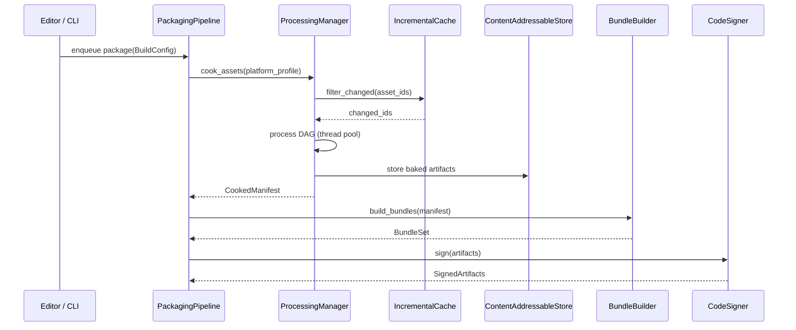

# Asset Pipeline ↔ Build/Deploy Integration Design

## Systems Involved

| System | Design | Domain |
|--------|--------|--------|
| Asset Pipeline | [asset-pipeline.md](../content-pipeline/asset-pipeline.md) | Content |
| Asset Processing | [asset-processing.md](../content-pipeline/asset-processing.md) | Content |
| Build/Deploy | [build-deploy.md](../tools/build-deploy.md) | Tools |

## Integration Requirements

| ID | Requirement | Systems |
|----|-------------|---------|
| IR-5.1.1 | Build system invokes AssetCooker per platform | Pipeline, Build |
| IR-5.1.2 | Baked assets use PlatformProfile target format | Processing, Build |
| IR-5.1.3 | IncrementalCache shared between editor and build | Pipeline, Build |
| IR-5.1.4 | BundleBuilder consumes CookedManifest from cook | Processing, Build |
| IR-5.1.5 | Shader variants compiled per TargetPlatform | Processing, Build |
| IR-5.1.6 | BLAKE3 content hash used for delta patching | Pipeline, Build |
| IR-5.1.7 | Shared CAS cache accelerates CI/CD builds | Pipeline, Build |

## Data Contracts

| Type | Defined in | Consumed by | Purpose |
|------|-----------|-------------|---------|
| `CookedManifest` | Processing | Build | List of baked asset IDs |
| `PlatformProfile` | Processing | Build | Per-platform format config |
| `AssetBundle` | Build | Packaging | Bundle with BLAKE3 hash |
| `CacheKey` | Build | Pipeline | Content-addressed cache key |
| `BuildConfig` | Build | Pipeline | Target platform + profile |

```rust
/// Build system requests a cook for a platform.
/// Processing returns a manifest of baked assets.
pub struct CookRequest {
    pub config: BuildConfig,
    pub profile: PlatformProfile,
    pub asset_ids: Vec<AssetId>,
}

/// Result of cooking: maps asset IDs to baked
/// artifact paths in the CAS.
pub struct CookedManifest {
    pub platform: TargetPlatform,
    pub entries: Vec<CookedEntry>,
    pub blake3_root: [u8; 32],
}

pub struct CookedEntry {
    pub asset_id: AssetId,
    pub cas_key: [u8; 32],
    pub size_bytes: u64,
    pub kind: AssetKind,
}
```

## Data Flow



## Timing and Ordering

| System | Game loop phase | Timestep | Ordering |
|--------|----------------|----------|----------|
| Asset Pipeline | Offline (not in loop) | N/A | Runs first |
| Build/Deploy | Offline (not in loop) | N/A | After cook |

The build pipeline runs entirely offline. Neither system participates in the game loop. The editor
submits build requests via crossbeam-channel; completions arrive as jobs polled at frame boundaries.

## Failure Modes

| Failure | Impact | Recovery |
|---------|--------|----------|
| Cook fails for 1 asset | Build aborted | Fix asset, re-cook |
| dxc/MSC CLI crash | Shader variant missing | Retry; fall back to cache |
| CAS corruption | Stale baked data | Invalidate cache, full rebuild |
| Bundle exceeds size limit | Packaging fails | Split bundle, adjust config |
| Signing key unavailable | Cannot ship | Prompt for credentials |

## Platform Considerations

| Platform | Shader tool | Texture format | Notes |
|----------|-------------|----------------|-------|
| Windows | dxc (DXIL) | BC7 | MSVC link.exe |
| macOS/iOS | dxc + MSC | ASTC | Apple ld64 |
| Linux | dxc (SPIR-V) | BC7 | lld linker |
| Android | dxc (SPIR-V) | ASTC/ETC2 | lld linker |
| Consoles | Platform SDK | Platform native | Server-side build |

## Test Plan

See companion
[asset-pipeline-build-deploy-test-cases.md](asset-pipeline-build-deploy-test-cases.md).
