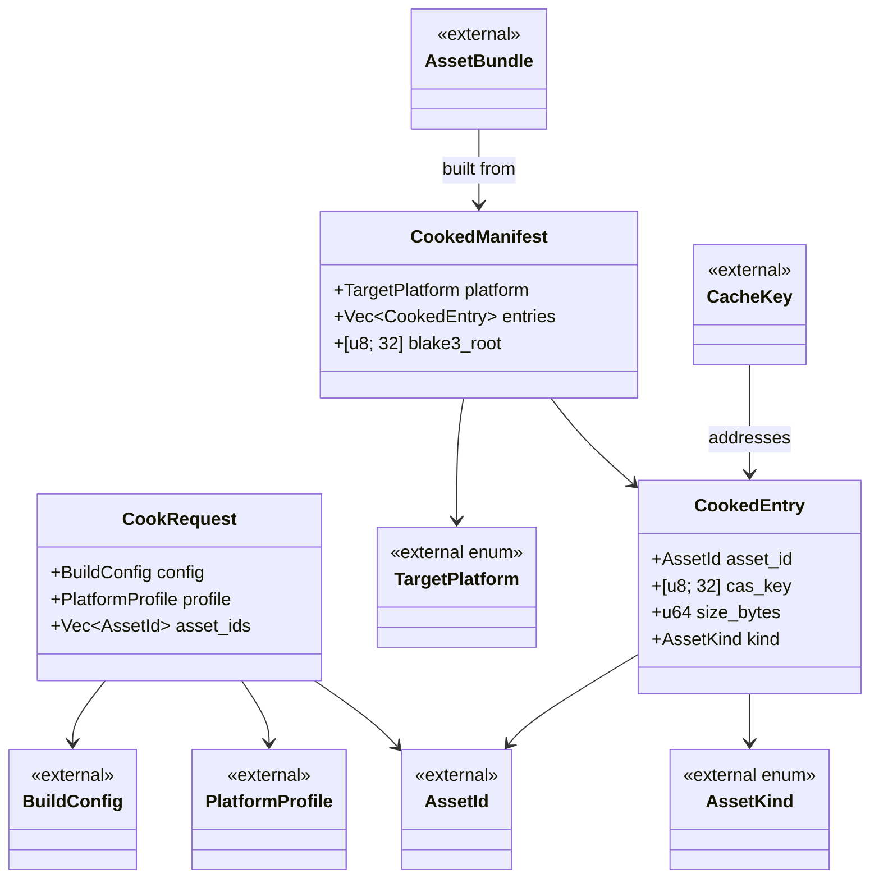

# Asset Pipeline ↔ Build/Deploy Integration Design

## Systems Involved

| System | Design | Domain |
|--------|--------|--------|
| Asset Pipeline | [asset-pipeline.md](../content-pipeline/asset-pipeline.md) | Content |
| Asset Processing | [asset-processing.md](../content-pipeline/asset-processing.md) | Content |
| Build/Deploy | [build-deploy.md](../tools/build-deploy.md) | Tools |

## Integration Requirements

| ID | Requirement | Systems |
|----|-------------|---------|
| IR-5.1.1 | Build system invokes AssetCooker per platform | Pipeline, Build |
| IR-5.1.2 | Baked assets use PlatformProfile target format | Processing, Build |
| IR-5.1.3 | IncrementalCache shared between editor and build | Pipeline, Build |
| IR-5.1.4 | BundleBuilder consumes CookedManifest from cook | Processing, Build |
| IR-5.1.5 | Shader variants compiled per TargetPlatform | Processing, Build |
| IR-5.1.6 | BLAKE3 content hash used for delta patching | Pipeline, Build |
| IR-5.1.7 | Shared CAS cache accelerates CI/CD builds | Pipeline, Build |

## Data Contracts

| Type | Defined in | Consumed by | Purpose |
|------|-----------|-------------|---------|
| `CookedManifest` | Processing | Build | List of baked asset IDs |
| `PlatformProfile` | Processing | Build | Per-platform format config |
| `AssetBundle` | Build | Packaging | Bundle with BLAKE3 hash |
| `CacheKey` | Build | Pipeline | Content-addressed cache key |
| `BuildConfig` | Build | Pipeline | Target platform + profile |

```rust
// Provenance of externally defined types:
// AssetId         — defined in
//   docs/design/content-pipeline/asset-pipeline.md
// AssetKind       — defined in
//   docs/design/content-pipeline/asset-processing.md
// TargetPlatform  — defined in
//   docs/design/tools/build-deploy.md (enum: Windows,
//   MacOS, IOS, Linux, Android, ConsoleA, ConsoleB)
// BuildConfig     — defined in
//   docs/design/tools/build-deploy.md
// PlatformProfile — defined in
//   docs/design/content-pipeline/asset-processing.md

/// Build system requests a cook for a platform.
/// Processing returns a manifest of baked assets.
///
/// Persistent: rkyv-serialized so editor-initiated
/// builds survive editor restarts (see Open Question
/// 1 — persisted by default; flag for transient).
/// `#[repr(C)]` + `align(16)` for zero-copy mmap
/// alignment with SIMD-friendly reads.
#[derive(
    rkyv::Archive,
    rkyv::Serialize,
    rkyv::Deserialize,
)]
#[repr(C, align(16))]
pub struct CookRequest {
    pub config: BuildConfig,
    pub profile: PlatformProfile,
    pub asset_ids: Vec<AssetId>,
}

/// Result of cooking: maps asset IDs to baked
/// artifact paths in the CAS.
///
/// Serialized to CAS via rkyv for zero-copy mmap.
/// `align(16)` matches the CAS page alignment used
/// by the platform-native I/O layer, so mmap'd
/// regions can be cast directly to `ArchivedCookedManifest`
/// without copying.
#[derive(
    rkyv::Archive,
    rkyv::Serialize,
    rkyv::Deserialize,
)]
#[repr(C, align(16))]
pub struct CookedManifest {
    pub platform: TargetPlatform,
    pub entries: Vec<CookedEntry>,
    /// Merkle root over entries: each entry's
    /// `cas_key` is a leaf, hashed pairwise via
    /// BLAKE3 to produce this root. Verifies
    /// manifest integrity in a single comparison.
    /// Algorithm: binary Merkle tree, BLAKE3 at each
    /// internal node per BLAKE3 spec section 2.1;
    /// odd leaves promoted (no duplication).
    pub blake3_root: [u8; 32],
}

#[derive(
    rkyv::Archive,
    rkyv::Serialize,
    rkyv::Deserialize,
)]
#[repr(C, align(16))]
pub struct CookedEntry {
    pub asset_id: AssetId,
    /// BLAKE3 hash of this entry's baked bytes
    /// (flat hash, not Merkle). Computed via
    /// `blake3::hash` over the raw CAS blob.
    pub cas_key: [u8; 32],
    pub size_bytes: u64,
    pub kind: AssetKind,
}
```

### Channels

| Channel | Kind | Buffer | Producer | Consumer |
|---------|------|--------|----------|----------|
| `build_requests` | MPSC | 64 | Editor / CLI | PackagingPipeline |
| `cook_completions` | MPSC | 256 | ProcessingManager | PackagingPipeline |
| `bundle_completions` | MPSC | 64 | BundleBuilder | PackagingPipeline |

All channels are `crossbeam_channel::bounded` MPSC. Buffer sizes are tuned so producers never block
the main thread under expected load (1 build/second editor, < 64 cook batches in flight, < 64
bundles per build). `Arc` is used only for immutable shared data (`Arc<PlatformProfile>`,
`Arc<CookedManifest>`); all mutation goes through owned values passed across channels.

### Scope Note — 2D / 2.5D

2D and 2.5D asset baking are intentionally out of scope for this integration design. 2D assets
(sprites, tilemaps, 2D physics shapes) flow through the same cook pipeline with no special handling
at the integration layer and do not require additional data contracts between Asset Pipeline and
Build/Deploy. This acknowledgment is recorded here per the integration review.

## Data Flow

```mermaid
sequenceDiagram
    participant ED as Editor / CLI
    participant PK as PackagingPipeline
    participant PM as ProcessingManager
    participant IC as IncrementalCache
    participant CAS as ContentAddressableStore
    participant BD as BundleBuilder
    participant CS as CodeSigner

    ED->>PK: enqueue package(BuildConfig)
    PK->>PM: cook_assets(platform_profile)
    PM->>IC: filter_changed(asset_ids)
    IC-->>PM: changed_ids
    PM->>PM: process DAG (job system)
    Note right of PM: crossbeam-deque work-stealing<br/>custom job system; no async/await
    PM->>CAS: store baked artifacts
    PM-->>PK: CookedManifest
    PK->>BD: build_bundles(manifest)
    BD-->>PK: BundleSet
    PK->>CS: sign(artifacts)
    CS-->>PK: SignedArtifacts
```

**Dependency on parent fixes.** This integration design assumes the parent
[asset-pipeline.md](../content-pipeline/asset-pipeline.md) and
[asset-processing.md](../content-pipeline/asset-processing.md) have been updated per their own
review feedback to remove `async fn`, `AsyncRwLock`, and `HashMap` usage. All parent APIs are
synchronous (no async/await anywhere in the engine or editor — backend servers are a separate
concern) and use arena-backed collections plus `DashMap` where concurrent maps are needed, per
[constraints.md](../constraints.md). The process DAG is scheduled on the custom crossbeam-deque job
system (see [core-runtime/game-loop.md](../core-runtime/game-loop.md)); no thread pool, no Rayon, no
async runtime. CLI shader tools (`glslc`, `glslc`) are invoked as blocking subprocesses from
job-system worker threads, never from the main thread.

**Debug tooling.** A runtime-toggleable `CookTrace` flag (set via editor debug panel or CLI
`--trace-cook`) enables per-asset timing, cache hit/miss logs, and BLAKE3 hash dumps. Disabled by
default. No recompile required to toggle.

## Timing and Ordering

| System | Game loop phase | Timestep | Ordering |
|--------|----------------|----------|----------|
| Asset Pipeline | Offline (not in loop) | N/A | Runs first |
| Build/Deploy | Offline (not in loop) | N/A | After cook |

The build pipeline runs entirely offline. Neither the asset pipeline nor the build system are
game-loop systems. Two execution contexts exist:

1. **CLI builds** — fully offline. The process exits after packaging completes. No game loop runs.
2. **Editor-initiated builds** — the editor submits build requests via crossbeam-channel.
   Completions arrive as jobs polled at frame boundaries. The editor's game loop only polls
   completion status; it does not drive the build itself.

## Failure Modes

| # | Failure | Impact | Recovery |
|---|---------|--------|----------|
| 1 | Cook fails for 1 asset | Build aborted | See detail 1 |
| 2 | glslc/glslc CLI crash | Shader variant missing | See detail 2 |
| 3 | CAS corruption | Stale baked data | See detail 3 |
| 4 | Bundle exceeds size limit | Packaging fails | See detail 4 |
| 5 | Signing key unavailable | Cannot ship | See detail 5 |
| 6 | io_uring submit failure (Linux) | CAS write lost | See detail 6 |
| 7 | GCD dispatch_io error (macOS) | CAS write lost | See detail 7 |
| 8 | IOCP failure (Windows) | CAS write lost | See detail 8 |

1. **Cook fails for 1 asset** — fix the source asset in the editor, then re-invoke the cook. The
   incremental cache skips all unchanged assets.
2. **glslc/glslc CLI crash** — retry the subprocess up to 3 times. On persistent failure, fall back
   to the last cached shader variant. If no cache entry exists, abort the build with a diagnostic
   pointing to the shader.
3. **CAS corruption** — detected by BLAKE3 hash mismatch on read. Invalidate the corrupted entry,
   then trigger a full rebuild of affected assets.
4. **Bundle exceeds size limit** — the BundleBuilder splits oversized bundles automatically. If
   splitting still exceeds limits, surface the error in the editor build panel with per-asset size
   breakdown.
5. **Signing key unavailable** — the editor displays a credentials dialog (not a CLI prompt)
   requesting the signing key or keychain unlock. Build pauses until credentials are provided or the
   user cancels.
6. **io_uring submit failure** — retry the submission. On persistent failure, fall back to blocking
   `pwrite64` for the affected CAS write, then log a warning in the build output panel.
7. **GCD dispatch_io error** — retry via dispatch_io. On persistent failure, fall back to blocking
   POSIX `write` for the affected CAS write, then log a warning in the build output panel.
8. **IOCP failure** — retry the overlapped I/O. On persistent failure, fall back to synchronous
   `WriteFile` for the affected CAS write, then log a warning in the build output panel.

## Platform Considerations

| Platform | Shader pipeline | Texture | Linker |
|----------|-----------------|---------|--------|
| Windows | GLSL->glslc->SPIR-V | BC7 | MSVC link.exe |
| macOS/iOS | See detail 1 | ASTC | Apple ld64 |
| Linux | GLSL->glslc->SPIR-V | BC7 | lld |
| Android | GLSL->glslc->SPIR-V | ASTC/ETC2 | lld |
| Consoles | Platform SDK | Native | Server-side |

1. **macOS/iOS shader pipeline** — two-step process: GLSL -> `glslc` -> SPIR-V intermediate, then
   SPIR-V -> `glslc` -> `.SPIR-V module`. Both tools are invoked as CLI subprocesses per
   constraints.md.

## Class Diagram



## Open Questions

1. Should `CookRequest` also be rkyv-serialized to support build-job persistence across editor
   restarts, or is transient-only sufficient?
2. What is the maximum Merkle tree depth for `blake3_root` computation when a manifest contains
   100k+ entries? Is a flat BLAKE3 hash over concatenated `cas_key` values faster for small
   manifests?
3. Should platform I/O fallback paths (detail 6-8 in Failure Modes) emit structured telemetry
   events, or is a log warning sufficient?

## Test Plan

See companion
[asset-pipeline-build-deploy-test-cases.md](asset-pipeline-build-deploy-test-cases.md).

## Review Status

| # | Finding | Status |
|---|---------|--------|
| 1 | rkyv derives on `CookRequest` / `CookedManifest` with alignment | APPLIED — see detail 1 |
| 2 | Provenance comments for external types | APPLIED — see detail 2 |
| 3 | Dependency on parent asset-pipeline fixes | APPLIED — see detail 3 |
| 4 | "process DAG" references crossbeam-deque job system | APPLIED — see detail 4 |
| 5 | macOS shader tool two-step pipeline clarification | APPLIED — see detail 5 |
| 6 | Platform-native I/O failure modes (CAS storage) | APPLIED — see detail 6 |
| 7 | Edge-case tests for IR-5.1.6 and IR-5.1.7 | APPLIED — see detail 7 |
| 8 | Benchmarks for IR-5.1.6 and IR-5.1.7 | APPLIED — see detail 8 |
| 9 | Missing `classDiagram` | APPLIED — see detail 9 |
| 10 | Timing section self-contradiction fix | APPLIED — see detail 10 |
| 11 | 2D / 2.5D out of scope acknowledgment | APPLIED — see detail 11 |
| 12 | Signing recovery via editor UI (not CLI prompt) | APPLIED — see detail 12 |
| 13 | Open Questions section added | APPLIED — see detail 13 |
| 14 | `blake3_root` documented as Merkle root | APPLIED — see detail 14 |
| 15 | MPSC channels, buffer lengths, `Arc` immutability note | APPLIED — see detail 15 |

1. **rkyv derives with alignment.** `CookRequest`, `CookedManifest`, and `CookedEntry` all derive
   `rkyv::{Archive, Serialize, Deserialize}` with `#[repr(C, align(16))]`. The 16-byte alignment
   matches the CAS page alignment used by the platform-native I/O layer, permitting zero-copy mmap
   casts to the `Archived*` types. `CookRequest` is promoted to persistent by default so
   editor-initiated builds survive editor restarts (Open Question 1 still tracks the transient-only
   alternative).
2. **Provenance.** Every externally defined type (`AssetId`, `AssetKind`, `TargetPlatform`,
   `BuildConfig`, `PlatformProfile`) now carries a comment pointing to the exact design document
   that defines it, plus the variant list for enums.
3. **Parent dependency.** The "Dependency on parent fixes" paragraph after the sequence diagram
   records the assumption that `async fn`, `AsyncRwLock`, and `HashMap` have been removed from
   `asset-pipeline.md` and `asset-processing.md`, and that concurrent maps use `DashMap` per the
   integration review.
4. **crossbeam-deque job system.** The sequence diagram note says "crossbeam-deque work-stealing /
   custom job system; no async/await". The dependency paragraph also explicitly states there is no
   thread pool, no Rayon, no async runtime, and CLI shader tools (`glslc`, `glslc`)
   run as blocking subprocesses on job-system worker threads, never on the main thread.
5. **macOS shader pipeline.** Platform Considerations detail 1 documents the two-step GLSL ->
   `glslc` -> SPIR-V -> `glslc` -> `.SPIR-V module` pipeline, invoked via CLI subprocess per
   constraints.md.
6. **Platform-native I/O failure modes.** Failure modes 6-8 cover io_uring (Linux), GCD
   `dispatch_io` (macOS), and IOCP (Windows) errors during CAS writes, each with retry +
   blocking-syscall fallback and a warning logged in the build output panel.
7. **Edge-case tests.** Companion test-cases file adds TC-IR-5.1.6.2 (zero-byte patch),
   TC-IR-5.1.6.3 (corrupted v1), TC-IR-5.1.6.N1 (tampered Merkle root), TC-IR-5.1.7.2 (empty cache),
   TC-IR-5.1.7.3 (concurrent writes), TC-IR-5.1.7.4 (LRU eviction), and TC-IR-5.1.7.N1 (malformed
   CAS key).
8. **Benchmarks.** Companion file adds TC-IR-5.1.6.B1 (1 GB delta patch), TC-IR-5.1.6.B2 (Merkle
   root over 100k entries), and TC-IR-5.1.7.B2 (zero-copy mmap CAS store) alongside the existing
   TC-IR-5.1.7.B1 cache-lookup latency benchmark. All benchmarks run via
   `cargo bench -p harmonius-integration-benches` with no external services.
9. **Class diagram.** The Class Diagram section provides a Mermaid `classDiagram` covering
   `CookRequest`, `CookedManifest`, `CookedEntry`, and all external types with their relationships.
10. **Timing fix.** The Timing and Ordering section enumerates two distinct contexts: CLI builds
    (fully offline, no game loop) and editor-initiated builds (game loop polls completions at frame
    boundaries but does not drive the build).
11. **2D / 2.5D out of scope.** The "Scope Note — 2D / 2.5D" subsection under Data Contracts
    explicitly acknowledges 2D/2.5D is out of scope and that 2D assets share the same cook pipeline
    with no integration-layer special cases.
12. **Signing recovery via editor UI.** Failure mode 5 now describes an editor credentials dialog
    (not a CLI prompt), consistent with the no-code engine constraint.
13. **Open Questions.** A dedicated Open Questions section tracks three open items: `CookRequest`
    persistence policy, Merkle vs flat BLAKE3 for small manifests, and telemetry granularity for I/O
    fallbacks.
14. **`blake3_root` documentation.** The field doc comment specifies it is a binary-Merkle BLAKE3
    root (BLAKE3 spec section 2.1, odd leaves promoted), while each `cas_key` is a flat
    `blake3::hash` over the raw CAS blob — no ambiguity.
15. **Channels and `Arc`.** The Channels subsection lists the three MPSC channels (`build_requests`,
    `cook_completions`, `bundle_completions`) with bounded buffer lengths (64, 256, 64), confirms
    all are `crossbeam_channel::bounded` MPSC, and states `Arc` is used only for immutable shared
    data (`Arc<PlatformProfile>`, `Arc<CookedManifest>`).
